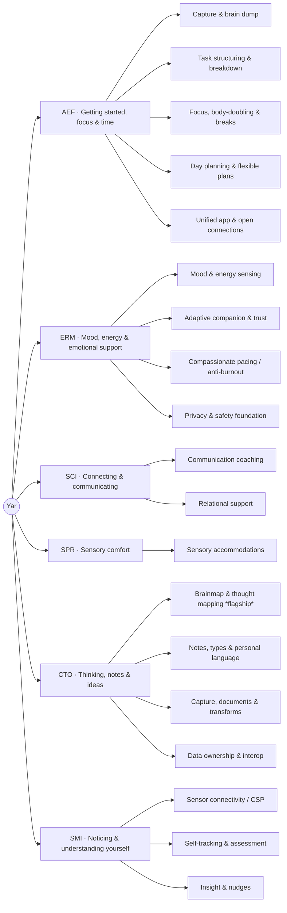

# Yar Universal Feature Hierarchy (v6)

> Reorganizes the canonical features from a flat 1-level list (6 branches) into a **3-level tree**: Root, 6 domains, 19 capability clusters, 69 features. The 62 original features are unchanged in name and scope; two approved features (**F63** invisible-disability advocacy mode, **F64** personal compass) were added on 2026-07-18 per decision D-E, and five verified gap features (**F65** focus & adherence guardian, **F66** ask & summarize your captures, **F67** long-term personal memory, **F68** cross-device sync, **F69** meeting-mode diarization) were added on 2026-07-19 per `FEATURE-VERIFICATION.md`. Source of truth for the original 62: `docs/03-Products/Cytonome/Yar/research/yar-unified-feature-comparison-v4.md`. Machine-readable version: `features.json`. Interactive views: `yar-feature-tree.html` (radial dendrogram + packed circles).

**Reading time:** about 8 minutes. **If you only read one thing:** the tree in Section 2 and the coverage gaps in Section 5.

## 1. Why add levels

The flat structure listed features directly under 6 domains, so a domain like ERM (18 features) or CTO (16) read as an undifferentiated wall. The new middle layer (**capability clusters**) groups features by the job they do for the user, which makes the taxonomy navigable, gives each cluster a natural owner and spec home, and exposes where coverage is thin (SPR) or deep (CTO brainmap). Counts after the 2026-07-19 additions: **18 / 18 / 5 / 2 / 19 / 7 = 69** (2026-07-18 state: 16 / 18 / 5 / 2 / 16 / 7 = 64; originally 15 / 18 / 4 / 2 / 16 / 7 = 62). New placements: F65 and F69 in AEF, F66, F67, and F68 in CTO.

## 2. The hierarchy

### 2.1 AEF, Attention & Executive Function (18)

| Cluster | Features |
|---|---|
| Capture & brain dump | F01 Voice brain dump; F32 Stray thought capture; F59 Capture from anywhere; F69 Meeting-mode diarization (gated) |
| Task structuring & breakdown | F02 Brain dump to action plan; F03 Tasks from your words; F04 Right-sized task breakdown |
| Focus, body-doubling & breaks | F06 Focus companion & body doubling; F20 Single-task focus mode; F21 Graceful activity pause; F22 Gentle break prompts; F26 Floating task reminder; F65 Focus & adherence guardian (gated) |
| Day planning & flexible plans | F07 Flexible plan with a backup track; F24 AI morning plan; F64 Personal compass (gentle goals) |
| Unified app & open connections | F28 Open data connections (MCP, gated); F41 All-in-one ND support app |

### 2.2 ERM, Emotional Regulation & Mood (18)

| Cluster | Features |
|---|---|
| Mood & energy sensing | F05 Your energy & mood map; F08 Mood tag on tasks; F40 Voice wellbeing signals (gated); F53 Mood-anchored morning check-in; F54 Voice mood awareness |
| Adaptive companion & trust | F11 Companion style & voice; F29 Companion that learns your style; F45 Mood-matched companion; F57 Adaptive companion that builds trust |
| Compassionate pacing (anti-burnout) | F27 Rest day support (gated); F35 Energy check before saying yes; F38 No-penalty plan change; F44 Streaks that honor rest days; F48 Gentle reset after a hard day (gated); F49 Your week as a story |
| Privacy & safety foundation | F17 Private space before planning; F18 Safety & consent layer (CAP); F19 On-device private AI |

### 2.3 SCI, Social Communication & Interaction (5)

| Cluster | Features |
|---|---|
| Communication coaching | F25 Pre-send tone check-in; F42 Two-way communication bridge (gated); F63 Invisible-disability advocacy mode (gated) |
| Relational support | F36 Co-planning with a trusted person (gated); F56 Social connections & your mood (gated) |

### 2.4 SPR, Sensory Processing & Regulation (2)

| Cluster | Features |
|---|---|
| Sensory accommodations | F23 Read-aloud with highlighting; F37 Gentle context change cues |

### 2.5 CTO, Cognitive Style & Thought Organization (19)

| Cluster | Features |
|---|---|
| Brainmap & thought mapping (flagship) | F13 Voice-grown thought map; F14 Thought placement assistant; F15 Spatial thought map view; F31 Thought map reviewer; F47 Untangling parallel thoughts; F60 Conversational thought map |
| Notes, types & personal language | F09 Structured note types; F10 Saved smart searches; F33 Your personal vocabulary; F58 Names & terms you use |
| Capture, documents & transforms | F34 Map to document transform; F50 Highlight & link on any page; F61 Thought to document templates; F66 Ask & summarize your captures |
| Data ownership & interop | F16 Your data in your own tools; F51 Open schema translation layer; F52 Private local knowledge store; F67 Long-term personal memory; F68 Cross-device sync |

### 2.6 SMI, Self-Monitoring & Interoception (7)

| Cluster | Features |
|---|---|
| Sensor connectivity (CSP) | F12 Open sensor connection layer (CSP); F30 Wearable sensor connection; F46 Brain sensor connection layer |
| Self-tracking & assessment | F55 Your custom tracking axes; F62 Opt-in self-assessment tools (gated) |
| Insight & nudges | F39 Personalized gentle nudges; F43 Layered wellbeing dashboard |

## 3. Cluster rationale (one line each)

- **AEF / Capture:** the frictionless "get it out of my head" surface; the daily-habit wedge starts here.
- **AEF / Task structuring:** turns raw capture into right-sized, doable steps.
- **AEF / Focus, body-doubling & breaks:** in-the-moment execution support; the Super Productivity comp lane.
- **AEF / Day planning:** dual-track (ideal vs baseline) daily structure.
- **AEF / Unified app & open connections:** the "one app, not eight" promise plus outward interop (MCP).
- **ERM / Mood & energy sensing:** the inputs to Brain Weather; where soft voice signals attach.
- **ERM / Adaptive companion & trust:** the persona that adapts style and depth over time.
- **ERM / Compassionate pacing:** the anti-burnout, no-shame core; Yar's largest open moat.
- **ERM / Privacy & safety foundation:** CAP, on-device AI, and the private pre-planning space.
- **SCI / Communication coaching:** tone and ND-to-neurotypical translation.
- **SCI / Relational support:** lightweight, consented sharing with one trusted person.
- **SPR / Sensory accommodations:** read-aloud and gentle transition cues (known thin area; see Section 5).
- **CTO / Brainmap:** the flagship branching-thought companion.
- **CTO / Notes, types & personal language:** typed knowledge and personalized vocabulary.
- **CTO / Capture, documents & transforms:** web highlight-and-link plus map-to-document output.
- **CTO / Data ownership & interop:** the local-first store and open schema translation.
- **SMI / Sensor connectivity (CSP):** the universal sensor adapter (the retention-to-sensor bridge).
- **SMI / Self-tracking & assessment:** user-defined axes and opt-in validated instruments.
- **SMI / Insight & nudges:** personalized nudges and the layered wellbeing dashboard.

## 4. Status rollup

Build status per the code-verified count in `yar-feature-research-FINAL_2026-07-16.md` (2026-07-05), plus the two 2026-07-18 additions and the five 2026-07-19 additions (all planned): **22 shipped, 2 partial, 3 groundwork, 1 placeholder-by-design, 41 planned = 69**. Eleven features are **safety-gated** (F27, F28, F36, F40, F42, F48, F56, F62, F63, F65, F69) and cannot ship until the crisis-detection module and privacy-boundary schema exist and are reviewed. F69 additionally requires a multi-party recording-consent legal review (counsel), a distinct gate from the crisis/privacy pair.

| Domain | Shipped | In progress (partial/groundwork/placeholder) | Planned | Gated |
|---|---|---|---|---|
| AEF | F01,F02,F03,F04,F06,F07,F32 (7) | F59 (1) | F20,F21,F22,F24,F26,F28,F41,F64,F65,F69 (10) | F28,F65,F69 |
| ERM | F05,F08,F11,F17,F18,F27,F44,F53 (8) | F54,F57 (2) | F19,F29,F35,F38,F40,F45,F48,F49 (8) | F27,F40,F48 |
| SCI | 0 | 0 | F25,F36,F42,F56,F63 (5) | F36,F42,F56,F63 |
| SPR | 0 | 0 | F23,F37 (2) | none |
| CTO | F14,F15,F16,F31,F52,F58 (6) | F09,F13,F60 (3) | F10,F33,F34,F47,F50,F51,F61,F66,F67,F68 (10) | none |
| SMI | F39 (1) | 0 | F12,F30,F43,F46,F55,F62 (6) | F62 |

## 5. Coverage findings (from the comps analysis)

The full comp-by-comp mapping and the capability-to-feature matrix live in `COMPS-MASTER-TABLE.md`. Three categories of result:

**Covered (the large majority).** Every capability observed across the 47 comps maps to at least one universal feature, except the items below. Capture, task breakdown, focus/timers, planning, mood-adaptive support, thought-mapping, local-first storage, voice pipeline, and consent all map cleanly.

**Gaps: two closed 2026-07-18, one closed 2026-07-19, one remaining.**

1. **Invisible-disability advocacy mode** (SCI): CLOSED, added as **F63** under Communication coaching. Realizes the founder narrative's "advocates for you when you can't" pillar.
2. **Gentle goals / "personal compass"** (AEF): CLOSED, added as **F64** under Day planning. Reframes Leantime's Goals as non-pressuring direction.
3. **Rich media as first-class objects** (CTO): still open. Images, PDFs, and audio with on-device analysis (OCR, categorization) are only partially implied by F09. Deferred per D-E.
4. **Meeting-mode diarization** (AEF): CLOSED, added as **F69** under Capture & brain dump on 2026-07-19, reversing the D-E deferral (the transcriber and mind-mapping agents now make multi-speaker capture concretely in scope). Consent-gated; requires counsel review of multi-party recording-consent law before shipping.

**Intentional exclusions (do not add; document the "no").** Enterprise/PM capabilities are deliberately out of scope: sprints, gantt, milestones, multi-user roles, real-time co-editing, comments, team dashboards, enterprise auth (LDAP/SSO). Subscription/freemium gating is also excluded per decision D1 (fully free). The only collaboration surface Yar keeps is F36 (one trusted person).

## 6. Naming note

Domain technical codes (AEF, ERM, SCI, SPR, CTO, SMI) are canonical; the public-facing plain-language names are the affirming-label rendering from `yar-feature-naming-convention.md` and map 1:1 (not a competing taxonomy). Clusters are new labels introduced here and should be adopted into the canonical feature docs during finalization (see the plan).
