# Yar Feature Verification: 8 Proposed Capabilities vs. the 64-Feature Taxonomy

**Date:** 2026-07-19 · **Status:** Verification complete (read-only against canonical sources) · **Author:** Claude (agent), for @shahin

**Reading time:** about 9 minutes. **If you only read one thing:** Section 4 (the daily-prioritization answer) plus the Section 2 gap table.

## BLUF

Of the 8 proposed capabilities: **3 map fully**, **4 map partially**, and one (focus/adherence guardian) has **no coverage**. **5 net-new gaps are confirmed** for the taxonomy: a focus/adherence guardian (F65), an ask-and-summarize-your-captures feature (F66), an explicit long-term-memory/PeT feature (F67), an explicit cross-device sync feature (F68), and a meeting-diarization feature (F69, promoted from an already-known but previously deferred gap). The closest existing feature for daily task prioritization is **F24, AI morning plan** (partial fit; recommend an explicit interactive-refinement extension, not a new id). Recommend adding F65 to F69 to `features.json` and `FEATURE-HIERARCHY.md` at the next canonical update.

---

## 1. Mapping table

| # | Proposed feature / capability | Coverage | Existing F-id(s) + names | Notes |
|---|---|---|---|---|
| 1 | Daily task prioritization (ADHD, meds aid focus not prioritization) + interactive collaborative refinement | **Partial** | **F24** AI morning plan (planned); F07 Flexible plan with a backup track (shipped); F04 Right-sized task breakdown (shipped) | F24's own spec (`prompts/daily-anchor-planner.md`) already prioritizes "by confidence and recency from the local knowledge graph" and caps output at 3 anchors, but the output shape is a single JSON pass (anchors + carry_forward), not a back-and-forth loop. **No existing feature explicitly supports iterative person+agent refinement of the plan.** F60 (Conversational thought map) proves the "iterate with the user" interaction pattern already exists elsewhere in the taxonomy and is the model to reuse. Recommend extending F24's scope, not minting a new id. |
| 2 | Focus/adherence guardian: permissioned app monitoring, deviation nudges, adjustable guard strictness | **None** | Adjacent only: F06 Focus companion & body doubling (shipped); F20 Single-task focus mode (planned); F26 Floating task reminder (planned); F39 Personalized gentle nudges (shipped) | All four adjacent features are passive (presence, UI, generic pattern-based nudges). None combine (a) explicit permission grants over apps/surfaces, (b) deviation detection against a specific agreed plan, (c) an adjustable dial from gentle reminder to hard block. **Confirmed gap, see F65.** |
| 3a | Phone + desktop apps (consistent UI); web dashboard (shorter-term, same UI) | **Partial** | F41 All-in-one ND support app (planned); F59 Capture from anywhere (groundwork) | F59 already explicitly names "phone, computer, or browser" as capture surfaces; F41 promises "no app-switching." Neither promises **UI parity** across phone/desktop/web specifically. Treated as a delivery-architecture note, not a new ND-functional capability: **recommend extending F41's description**, not a new id (see Section 2 rationale for why this one did not get a new F-id). |
| 3b | Browser extension (W3C WADM), like hypothes.is / Memex | **Full** | **F50** Web annotation layer (planned, infra); **F59** Capture from anywhere (groundwork) | F50 is explicitly WADM-based per `yar-product-spec.md:62` ("Annotation \| WADM (W3C Web Annotation Data Model) for highlight, annotate, and link flows") and `yar-unified-feature-comparison-v4.md:418`. F59 is explicitly modeled on Memex/WorldBrain (internal codename "Cytomark") per `yar-unified-feature-comparison-v4.md:283` and `COMPS-MASTER-TABLE.md` row 33: "Memex (WorldBrain) is the open-source, local-first, account-free web annotation reference pattern." This is already a deliberate, sourced design choice, not a gap. |
| 4 | Transcriber agent: low-latency real-time conversational, local/edge + cloud, later Cactus routing + personas | **Partial** | F01 Voice brain dump (shipped); F13 Voice-grown thought map (groundwork); F19 On-device AI runtime (infra, Gemma 4 E4B); F11/F29/F45/F57 companion-persona cluster (for "later: personas") | `SPEC-multi-agent.md` already names a **Transcriber** worker agent (Whisper-compatible on-device STT, PLANNED) as one of a 3-agent brainmap loop (Transcriber, Placer, Reviser). Naming nuance: the task's "low-latency real-time **conversational**" framing actually spans two separate named roles in the spec: **Transcriber** (ASR/segmentation only) and **Interviewer** (real-time conversational response, mood inference). Recommend reconciling this naming, not adding a feature. "Cactus" model-routing has zero references anywhere in the Yar docs (confirmed by search); the local/cloud split concept it would implement is already covered by the Edge/Supervisor split (`SPEC-multi-agent.md` §7) and the forthcoming `SPEC-edge-ai-hybrid.md`. |
| 5 | Cross-node sync (phone vs. laptop): Anysync or Loro+Iroh | **None** as a discrete feature (rich engineering spec exists) | Nearest: F52 Private local knowledge store (shipped); F16 Your data in your own tools (shipped) | `SPEC-sync-protocol.md` fully designs this: CRDT op-log at L2, current leaning **Loro + Iroh (36/45)** over **any-sync (35/45)**, decision O-1 still open. `YAR_FEATURE_CATALOG.md` §5 ties this spec to F52/F16, but neither promises multi-device continuity of Yar's own state (F52 is about storage location/ownership; F16 is about interop with Obsidian/Logseq). **Confirmed gap, see F68.** |
| 6 | PeT (personal/temporal) knowledge graph + long-term memory (HippoRAG, REMem, later SurrealDB Spectron) | **None** as a discrete feature | Infra pieces only: F52 Private local knowledge store (shipped); F51 Open schema translation layer (planned); F58 Names & terms you use (shipped); F33 Your personal vocabulary (planned); F10 Saved smart searches (planned) | `SPEC-storage-engine.md:81,87` already flags SurrealDB's **Spectron agent-memory layer** as a relevant, not-yet-adopted building block ("treat Spectron... as upside only, not MVP foundation"). HippoRAG and REMem are not referenced anywhere in the Yar docs (confirmed by search), genuinely new engineering ground. No feature names the retrieval-augmented longitudinal recall act itself. **Confirmed gap, see F67.** |
| 7 | Proofreading agent: personal terms/NER, maps to prior conversations via long-term memory, later Tana-style supertags | **Partial** | F58 Names & terms you use (shipped); F33 Your personal vocabulary (planned); F09 Structured note types (partial, for "later: supertags") | This is an agent-architecture role, not itself a discrete user-facing feature. `SPEC-multi-agent.md`'s agent inventory (Supervisor, Interviewer, Transcriber, Placer, Reviser) has **no "Proofreader" role today**; it would need to be added to that architecture. Its "maps to prior conversations via long-term memory" clause is blocked on the new F67 (PeT KG) gap below. |
| 8 | Mind-mapping agent: evolving graph, PeT-matched entities, linear/branching, resume conversations, doc templates, later diarization | **Full** (core loop) | **F13, F14, F15, F31, F47, F60** (all 6 of 6 in the Brainmap cluster); **F34, F61** (2 of 3 in Capture/documents/transforms) | This is explicitly `SPEC-multi-agent.md` §6's "conversational brainmap loop," named the **CU-6 capability cluster** and "the highest-priority founder-elevated feature set," implemented as a 3-agent loop (Transcriber, Placer, Reviser). F47 ("Untangling parallel thoughts") explicitly covers "supports linear and branching/scattered thought" and the "later: disentangle threads" line. F34/F61 explicitly cover "convert to docs from templates." "Resume prior conversations" / "integrate into PeT KG" depend on new F67. "Later: multi-speaker meeting notes" is the diarization gap, see F69 below. |

### 1.1 Memex capability sub-mapping (item 3b)

| Memex capability | F-id or gap | Coverage |
|---|---|---|
| Capture | F59 Capture from anywhere | Full |
| Annotate | F50 Web annotation layer (WADM) | Full |
| Summarize | Gap | None (closest adjacent: F34/F61, scoped to thought-maps, not arbitrary captures) |
| Ask (chat with your library) | Gap | None (closest adjacent: F10 Saved smart searches + F19 on-device AI + F52 local store, but no conversational Q&A feature exists) |
| Integrate with agents / MCPs | F28 Open data connections (MCP) | Full |

Summarize and Ask are the same underlying missing capability (AI-mediated digest and Q&A over your own saved captures) and are proposed together as one gap, F66.

---

## 2. Confirmed gaps to add (F65 to F69)

| Proposed id | Name | Domain / cluster | Gated | One-line description | Rationale |
|---|---|---|---|---|---|
| **F65** | Focus & adherence guardian | AEF / Focus, body-doubling & breaks | **Yes** | With permissioned access to chosen apps and surfaces, Yar notices drift from today's agreed plan and nudges you back, on a dial you set from gentle reminder to firm distraction block. | No existing feature combines cross-app permissioned monitoring, plan-deviation detection, and adjustable enforcement strength. Gated because granting an agent monitoring/blocking authority over other apps needs the privacy-boundary schema, the same reason F28 and F42 are gated. |
| **F66** | Ask & summarize your captures | CTO / Capture, documents & transforms | No | Chat with an AI over everything you have captured and saved, on demand, to ask a question or get an instant summary, grounded only in your own notes and highlights. | Closes the two Memex capabilities (Summarize, Ask) with no current F-id. Depends on F67 (below) for longitudinal recall quality but is usable against F52's existing local store on day one. |
| **F67** | Long-term personal memory graph (PeT recall) | CTO / Data ownership & interop | No | Yar remembers across weeks and months, not only this session, recalling the right prior context the way your own memory would, not just the most recent note. | F52 covers *where* notes live; F58/F33 cover *recognizing* names and terms; nothing covers the retrieval-augmented, longitudinal recall act itself. `SPEC-storage-engine.md` already flags SurrealDB's Spectron agent-memory layer as a relevant future building block, confirming the project is infra-aware but has not named the user-facing feature. |
| **F68** | Cross-device sync (phone and laptop) | CTO / Data ownership & interop | No | Your tasks, notes, and maps stay in step between phone and laptop, offline-friendly, with no single required server holding the one true copy. | `SPEC-sync-protocol.md` fully designs the mechanism (CRDT op-log; Loro+Iroh leaning over any-sync), but no F-id promises the user-facing outcome. F52/F16 are the closest existing ids and are insufficient alone. |
| **F69** | Meeting-mode diarization | AEF / Capture & brain dump | **Flag for counsel** | Multi-speaker meetings get botless transcription with who-said-what separation, not one undifferentiated transcript. | Already an identified, named gap: `FEATURE-HIERARCHY.md` §5 ("subsumed under F01 but not explicit") and `COMPS-MASTER-TABLE.md` both flag it, and `CANONICAL-EDITS-SPEC.md:41` explicitly **deferred** it on 2026-07-18 ("Defer, do not add now, keep as known gap"). **This recommendation reverses that deferral**, on the grounds that the Transcriber/Mind-mapping agents now make multi-speaker capture concretely in scope. Distinct new consideration versus the other gates: diarizing a meeting processes *other people's* speech, not only the user's; multi-party recording consent law varies by jurisdiction (several US states require all-party consent). Recommend counsel review before formalizing, separate from the usual crisis/privacy-boundary gate. |

**Considered and explicitly not added as a new id:** cross-device app + web-dashboard UI parity (item 3a). This reads as a delivery-architecture decision layered on F41 and F59, which already establish the multi-surface precedent, rather than a distinct ND-functional capability. Recommend extending F41's description explicitly to name "phone, desktop, and web dashboard, one consistent UI" instead of minting a new id. Flagging this choice rather than deferring it: if engineering wants platform parity tracked as its own roadmap line with independent status, promote it to F70 later. Proceeding on the extension approach unless told otherwise.

---

## 3. Proposed wave / architecture view

This is a **build-continuum lens over the 8 evaluated capabilities**, distinct from (but cross-referenced against) the official IPS-scored Wave 0 to 3 in `YAR_FEATURE_CATALOG.md`. Where an existing F-id already carries an official wave, that wave is shown in parentheses; new ids (F65 to F69) are placed by dependency, not by IPS score (not yet scored).

```mermaid
graph TD
  W0["WAVE 0, Core infra\nthe 3 agents + platform + sync + PeT KG"]
  W1["WAVE 1, Wedge\nbuilds directly on Wave 0"]
  W2["WAVE 2, Moat\nbuilds on Wave 1"]
  W3["WAVE 3, Research / later"]

  W0 --> W1 --> W2 --> W3

  W0A["3-agent substrate\nTranscriber + Placer + Reviser"]
  W0B["Platform delivery\nphone/desktop/browser-ext, WADM"]
  W0C["Cross-node sync, NEW F68"]
  W0D["PeT KG / long-term memory, NEW F67"]
  W0 --> W0A & W0B & W0C & W0D

  W0A -.-> F01["F01 (W1, shipped)"]
  W0A -.-> F13["F13 (W1, groundwork)"]
  W0A -.-> F19["F19 (Infra)"]
  W0A -.-> F58a["F58 (W1, shipped)"]
  W0B -.-> F59["F59 (W1, groundwork)"]
  W0B -.-> F50["F50 (Infra)"]

  W1A["Daily prioritization (partial)"]
  W1B["Mind-mapping core loop"]
  W1C["Proofreading core outcome"]
  W1D["Memex Capture + Annotate"]
  W1 --> W1A & W1B & W1C & W1D

  W1A -.-> F24["F24 (W2) + F07 (W1) + F04 (W1)"]
  W1B -.-> F14_15_31_60["F14, F31, F15, F60 (all W1)"]
  W1C -.-> F58b["F58 (W1)"]
  W1D -.-> F59b["F59 + F50 (W1/Infra, done above)"]

  W2A["Focus & adherence guardian, NEW F65"]
  W2B["Ask & summarize captures, NEW F66"]
  W2C["Mind-map to doc transforms"]
  W2D["Proofreading supertags (later)"]
  W2E["Memex MCP integration"]
  W2 --> W2A & W2B & W2C & W2D & W2E

  W2A -.-> F06_39_18["F06 (W1) + F39 (W1) + F18 (Infra, consent)"]
  W2B -.-> F67dep["F67 (W0, new) + F19 (Infra) + F10 (W2)"]
  W2C -.-> F34_61["F34, F61 (both W2)"]
  W2D -.-> F33_09["F33 (W2) + F09 (W2)"]
  W2E -.-> F28["F28 (W2)"]

  W3A["Meeting diarization, NEW F69"]
  W3B["Transcriber later: Cactus + personas"]
  W3C["Mind-map later: disentangle threads"]
  W3 --> W3A & W3B & W3C

  W3A -.-> F01b["builds on F01 (W1) + Transcriber agent"]
  W3B -.-> F11_57["F11, F57 (W1, base persona) + F29, F45 (W2, refinement)"]
  W3C -.-> F47["F47 (W3, official), consistency check: matches official placement"]
```

**Reading the tree:** Wave 0 is infrastructure only, two of its four nodes (sync, PeT KG) are entirely new (F67, F68); the other two (agents, platform) are stitched together from existing shipped/groundwork/infra ids that were never grouped this way before. Wave 1 to 3 show each proposed capability landing where its dependencies already sit in the official wave assignments, with one validation point: F47 (mind-mapping's "disentangle threads") independently lands in Wave 3 in both this lens and the official catalog, which cross-checks the placement logic.

**One thing to flag:** F24 (daily prioritization) sits at official Wave 2, not Wave 1, even though the underlying need (item 1) reads like a Wave 1 wedge feature. Worth a founder decision on whether to re-prioritize F24 into Wave 1 given how central "what do I do today" is to the ADHD wedge; not changed here since it is outside this task's scope (verification, not re-prioritization).

---

## 4. Direct answer

**What is the id/name of the daily-prioritization feature?**

**F24, "AI morning plan."** Coverage is **partial**: F24 already prioritizes tasks (by confidence and recency, per its own spec) and offers persona-toned delivery, but its current spec is a single-pass suggestion, not an interactive back-and-forth refinement with the user. Recommend extending F24's description to explicitly require iterative collaborative refinement (reusing F60's conversational-iteration pattern as the interaction model) rather than adding a new feature id. Supporting/adjacent ids: F07 (Flexible plan with a backup track) and F04 (Right-sized task breakdown).

---

## 5. Sources checked

- `docs/03-Products/Cytonome/Yar/research/features.json` (canonical 64-feature hierarchy)
- `docs/03-Products/Cytonome/Yar/research/FEATURE-HIERARCHY.md`
- `docs/03-Products/Cytonome/Yar/YAR_FEATURE_CATALOG.md` (wave tags)
- `docs/03-Products/Cytonome/Yar/research/yar-unified-feature-comparison-v4.md`
- `docs/03-Products/Cytonome/Yar/research/COMPS-MASTER-TABLE.md`
- `docs/03-Products/Cytonome/Yar/research/CANONICAL-EDITS-SPEC.md`
- `docs/03-Products/Cytonome/Yar/spec/SPEC-multi-agent.md`
- `docs/03-Products/Cytonome/Yar/spec/SPEC-sync-protocol.md`
- `docs/03-Products/Cytonome/Yar/spec/SPEC-storage-engine.md`
- `docs/03-Products/Cytonome/Yar/yar-product-spec.md`
- `docs/03-Products/Cytonome/Yar/prompts/daily-anchor-planner.md`
- Searched and confirmed absent from all Yar docs: HippoRAG, REMem, Cactus (model-routing)
