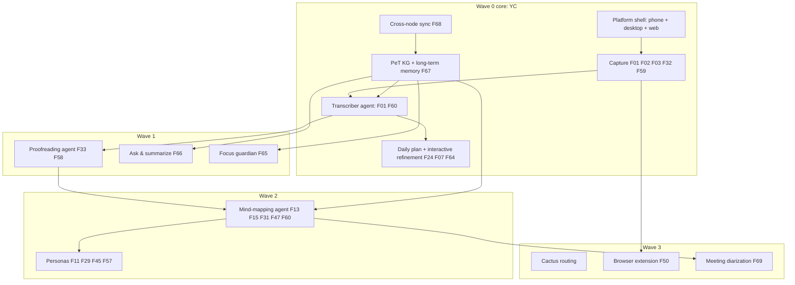

# Yar Wave Roadmap: Features, Effort, Dependencies, Timeline

**Date:** 2026-07-19. **Reading time:** about 8 minutes. **Status:** draft for planning; refine in the fresh session.

**BLUF:** Yar now has **69 universal features** (6 domains, 19 clusters) after adding F65-F69. Full build effort is **174 to 318 engineer-weeks** (about 3.5 to 7 engineer-years), gated by a critical path of three foundations: cross-node sync, the PeT knowledge graph plus long-term memory, and the platform shell. With **3 full-time developers**, the YC-demoable Wave 0 core lands in **1 to 2 quarters** and the full roadmap in about **8 quarters**. This doc consolidates four backing analyses: `FEATURE-VERIFICATION.md`, `EFFORT-ESTIMATES.md`, `DEPENDENCY-GRAPH.md`, `SPECS-INVENTORY.md`.

## 1. What changed in the taxonomy (v6)

Added 5 features (now 69), and one scope extension:

| New | Name | Domain / cluster | Gated | Why added |
|---|---|---|---|---|
| **F65** | Focus & adherence guardian | AEF / Focus, body-doubling & breaks | yes | Nudge/guard against drift from the agreed plan, adjustable authority (reminder to blocking) |
| **F66** | Ask & summarize your captures | CTO / Capture, documents & transforms | no | Memex "Ask" + "Summarize" over your own knowledge |
| **F67** | Long-term personal memory | CTO / Data ownership & interop | no | The PeT recall layer (HippoRAG/REMem-class) |
| **F68** | Cross-device sync | CTO / Data ownership & interop | no | Phone/laptop consistency (Anysync or Loro+Iroh) |
| **F69** | Meeting-mode diarization | AEF / Capture & brain dump | yes | Multi-speaker notes; reverses a prior deferral, needs consent-law review |

**Daily prioritization = F24 "AI morning plan"** (confirmed). It already prioritizes but is single-pass; extend its scope to **interactive collaborative refinement** (person and agent iterate), do not add a new id. Already-covered items: browser extension / WADM / Memex capture-annotate = **F50 + F59** ("Cytomark"); MCP integration = **F28**; the mind-mapping agent = the CTO brainmap cluster (F13, F14, F15, F31, F47, F60).

## 2. Wave / architecture view (build continuum)

Wave 0 is the core substrate proposed for YC; later waves build on it. Full tree in `FEATURE-VERIFICATION.md`.

## 3. Effort summary (from EFFORT-ESTIMATES.md)

- **Total: 174 to 318 engineer-weeks** on top of heavy OSS reuse.
- **Highest-effort (the risk items):** PeT KG + long-term memory (35-65 wk), cross-node sync (28-48 wk), mind-mapping agent (24-40 wk).
- **Best adoptable libraries:** Loro + Iroh or any-sync (sync); HippoRAG as a memory base (needs adaptation for continuous on-device use); spaCy/sciSpaCy + Instructor + DSPy (proofreading/NER); Whisper + Gemma (transcriber); Tauri v2 (multi-platform); FalkorDB on-server (already chosen). Full table with licenses and sources in `EFFORT-ESTIMATES.md`.
- **Watch:** "PeT" and "ReMem" are underspecified/ambiguous in current docs; confirm scope before writing those specs. Verify Cactus and Gemma license text before compliance sign-off.

## 4. Dependencies (from DEPENDENCY-GRAPH.md)

- **Foundations (start first, zero in-degree):** cross-node sync (F68), PeT KG + memory (F67), platform shell; plus two policy gates: G01 privacy-boundary schema, G02 crisis-detection module.
- **Pipeline (strictly sequential):** transcriber -> proofreading -> mind-mapping.
- **Layered last:** personas, Cactus routing, guardian, diarization, browser extension.
- No dependency cycles. The critical path runs foundations -> transcriber -> proofreading -> mind-mapping, which limits how much extra developers can parallelize.

## 5. Quarterly timeline (primary: 3 full-time developers)

Assumption: 1 developer delivers about **10 effective engineer-weeks per 13-week quarter** (the rest is reviews, meetings, testing, ramp). 3 devs is about 30 eng-weeks/quarter. Sequencing respects the dependency layers, so early quarters front-load foundations.

| Quarter | Ships (features) | Notes |
|---|---|---|
| **Q1 (YC core)** | Platform shell (desktop + phone MVP), capture (F01/F02/F03/F32/F59 already shipped), transcriber agent v1 (Whisper/Gemma local), F24 daily plan + start of interactive refinement; draft G01/G02 gates | The demoable Wave 0 story for YC |
| **Q2** | PeT KG + long-term memory v1 (F67), cross-device sync v1 (F68, after the Loro+Iroh vs any-sync decision), F66 ask & summarize | Foundations mature; the two biggest rocks |
| **Q3** | Proofreading agent v1 (F33/F58 + spaCy/Instructor), F65 focus guardian (after G01), web dashboard | Pipeline stage 2; guardian needs the privacy gate |
| **Q4** | Mind-mapping agent (F13/F15/F31/F47/F60), personas (F11/F29/F45/F57) | Pipeline stage 3; the flagship brainmap |
| **Q5-Q6** | Cactus routing, browser extension (F50 WADM/Memex), F69 diarization (after consent-law review), thread disentangling | Wave 3 layered features |
| **Q7-Q8** | Hardening, multi-speaker meeting notes, ERM/SMI depth, release polish | Production maturity |

Wave 0 core is demoable by end of **Q1**, solid by **Q2**. The full 69-feature roadmap completes around **Q8** at 3 devs.

## 6. Team-size scenarios

Effective capacity per quarter: full-time dev about 10 eng-weeks; half-time (20 hrs/wk) about 5. Midpoint total effort about 246 eng-weeks. Critical-path coupling means more than 3 to 4 devs yields diminishing returns until foundations are done.

| Team | Full roadmap (all 69) | Wave 0 core only (approx 70-100 eng-wk) |
|---|---|---|
| 1 dev full-time | about 24 quarters (6 yr) | about 7-10 quarters |
| 2 devs full-time | about 12 quarters (3 yr) | about 4-5 quarters |
| **3 devs full-time** | **about 8 quarters (2 yr)** | **about 2-3 quarters** |
| 4 devs full-time | about 6 quarters (1.5 yr) | about 2 quarters |
| 1 dev half-time | about 48 quarters (not viable alone) | about 14-20 quarters |

**Reading:** for a YC-stage push, 3 full-time developers gets a credible Wave 0 demo in one quarter and a shippable core in two. Fewer than 2 devs makes the timeline multi-year. The PeT KG and sync foundations are the pacing items; consider a specialist for those.

## 7. Governance gates (block gated features regardless of code)

- **G01 privacy-boundary schema** and **G02 crisis-detection module** must be built and reviewed before any safety-gated feature ships: F65, F69, F28, F40, F27, F36, F42, F48, F56, F62.
- **F69 diarization** additionally needs multi-party recording-consent legal review (varies by state).

## 8. What feeds the fresh sessions

- Code fix/finalize -> `PROMPT-A-code-finalization.md`.
- Features/specs/docs finalize (build the 10 specs, extend F24, add F65-F69 to all feature docs, refine these estimates) -> `PROMPT-B-features-specs.md`.
- Shared context -> `SHARED-BLUEPRINT.md`.
