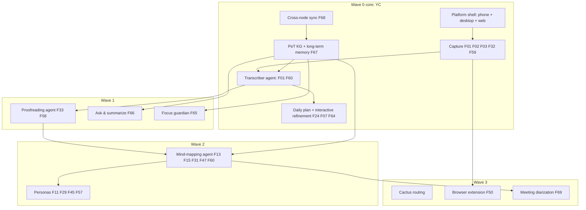

# Yar Wave Roadmap: Features, Effort, Dependencies, Timeline

**Date:** 2026-07-19. **Reading time:** about 8 minutes. **Status:** draft for planning; refine in the fresh session.

**BLUF:** Yar now has **69 universal features** (6 domains, 19 clusters) after adding F65-F69. Full build effort is **174 to 318 engineer-weeks** (about 3.5 to 7 engineer-years), gated by a critical path of three foundations: cross-node sync, the PeT knowledge graph plus long-term memory, and the platform shell. With **3 full-time developers**, the YC-demoable Wave 0 core lands in **1 to 2 quarters** and the full roadmap in about **8 quarters**. This doc consolidates four backing analyses: `FEATURE-VERIFICATION.md`, `EFFORT-ESTIMATES.md`, `DEPENDENCY-GRAPH.md`, `SPECS-INVENTORY.md`.

## 1. What changed in the taxonomy (v6)

Added 5 features (now 69), and one scope extension:

| New | Name | Domain / cluster | Gated | Why added |
|---|---|---|---|---|
| **F65** | Focus & adherence guardian | AEF / Focus, body-doubling & breaks | yes | Nudge/guard against drift from the agreed plan, adjustable authority (reminder to blocking) |
| **F66** | Ask & summarize your captures | CTO / Capture, documents & transforms | no | Memex "Ask" + "Summarize" over your own knowledge |
| **F67** | Long-term personal memory | CTO / Data ownership & interop | no | The PeT recall layer (HippoRAG/REMem-class) |
| **F68** | Cross-device sync | CTO / Data ownership & interop | no | Phone/laptop consistency (Anysync or Loro+Iroh) |
| **F69** | Meeting-mode diarization | AEF / Capture & brain dump | yes | Multi-speaker notes; reverses a prior deferral, needs consent-law review |

**Daily prioritization = F24 "AI morning plan"** (confirmed). It already prioritizes but is single-pass; extend its scope to **interactive collaborative refinement** (person and agent iterate), do not add a new id. Already-covered items: browser extension / WADM / Memex capture-annotate = **F50 + F59** ("Cytomark"); MCP integration = **F28**; the mind-mapping agent = the CTO brainmap cluster (F13, F14, F15, F31, F47, F60).

## 2. Wave / architecture view (build continuum)

Wave 0 is the core substrate proposed for YC; later waves build on it. Full tree in `FEATURE-VERIFICATION.md`.

## 3. Effort summary (from EFFORT-ESTIMATES.md)

- **Total: 174 to 318 engineer-weeks** on top of heavy OSS reuse.
- **Highest-effort (the risk items):** PeT KG + long-term memory (35-65 wk), cross-node sync (28-48 wk), mind-mapping agent (24-40 wk).
- **Best adoptable libraries:** Loro + Iroh or any-sync (sync); HippoRAG as a memory base (needs adaptation for continuous on-device use); spaCy/sciSpaCy + Instructor + DSPy (proofreading/NER); Whisper + Gemma (transcriber); Tauri v2 (multi-platform); FalkorDB on-server (already chosen). Full table with licenses and sources in `EFFORT-ESTIMATES.md`.
- **Watch:** "PeT" and "ReMem" are underspecified/ambiguous in current docs; confirm scope before writing those specs. Verify Cactus and Gemma license text before compliance sign-off.

## 4. Dependencies (from DEPENDENCY-GRAPH.md)

- **Foundations (start first, zero in-degree):** cross-node sync (F68), PeT KG + memory (F67), platform shell; plus two policy gates: G01 privacy-boundary schema, G02 crisis-detection module.
- **Pipeline (strictly sequential):** transcriber -> proofreading -> mind-mapping.
- **Layered last:** personas, Cactus routing, guardian, diarization, browser extension.
- No dependency cycles. The critical path runs foundations -> transcriber -> proofreading -> mind-mapping, which limits how much extra developers can parallelize.

## 5. Quarterly timeline (primary: 3 full-time developers)

Assumption: 1 developer delivers about **10 effective engineer-weeks per 13-week quarter** (the rest is reviews, meetings, testing, ramp). 3 devs is about 30 eng-weeks/quarter. Sequencing respects the dependency layers, so early quarters front-load foundations.

| Quarter | Ships (features) | Notes |
|---|---|---|
| **Q1 (YC core)** | Platform shell (desktop + phone MVP), capture (F01/F02/F03/F32/F59 already shipped), transcriber agent v1 (Whisper/Gemma local), F24 daily plan + start of interactive refinement; draft G01/G02 gates | The demoable Wave 0 story for YC |
| **Q2** | PeT KG + long-term memory v1 (F67), cross-device sync v1 (F68, after the Loro+Iroh vs any-sync decision), F66 ask & summarize | Foundations mature; the two biggest rocks |
| **Q3** | Proofreading agent v1 (F33/F58 + spaCy/Instructor), F65 focus guardian (after G01), web dashboard | Pipeline stage 2; guardian needs the privacy gate |
| **Q4** | Mind-mapping agent (F13/F15/F31/F47/F60), personas (F11/F29/F45/F57) | Pipeline stage 3; the flagship brainmap |
| **Q5-Q6** | Cactus routing, browser extension (F50 WADM/Memex), F69 diarization (after consent-law review), thread disentangling | Wave 3 layered features |
| **Q7-Q8** | Hardening, multi-speaker meeting notes, ERM/SMI depth, release polish | Production maturity |

Wave 0 core is demoable by end of **Q1**, solid by **Q2**. The full 69-feature roadmap completes around **Q8** at 3 devs.

## 6. Team and coding-agent scenarios

Effective delivery capacity per 13-week quarter is taken from `CODING-AGENT-PRODUCTIVITY.md` (cited, evidence-based): **1 FTE = 10** effective eng-weeks; **1 FTE + coding agent = 17** (range 13-22, about 1.7x); **3 FTE = 25** (sublinear per Brooks's Law); **3 FTE + coding agents = 38** (range 30-47). Midpoint total effort about **246 eng-weeks**; Wave 0 core about **85 eng-weeks**.

| Scenario | Capacity/quarter | Full roadmap (all 69) | Wave 0 core |
|---|---|---|---|
| 1 FTE, no agent | 10 | about 25 quarters (~6 yr) | about 8-9 quarters |
| **1 FTE + coding agent** | **17** | **about 14-15 quarters (~3.5 yr)** | **about 5 quarters** |
| 3 FTE, no agent | 25 | about 10 quarters (~2.5 yr) | about 3-4 quarters |
| 3 FTE + coding agents | 38 | about 6-7 quarters (~1.7 yr) | about 2-3 quarters |

**Critical caveat (evidence-based):** coding agents help most on greenfield UI, CRUD, and test-writing (1.5-2.2x) and least, sometimes net-negative, on the **research-heavy foundations that pace this roadmap**: PeT KG + long-term memory, cross-node sync, and mind-mapping structure revision. Plan those at only **1.0x-1.3x**. So the agent-boosted quarters above are optimistic for the foundation phase; expect early foundation quarters near the no-agent pace, with the speedup arriving once app-surface work dominates.

**On the personal estimate:** "1 FTE + agent beats 2 FTE, maybe up to 10x" is defensible only for greenfield/boilerplate sprints with a single expert driver. For the PeT KG, sync, and mind-mapping design work it does not hold (the METR 2025 RCT found experienced devs 19% slower with AI on mature-repo fixes). Realistic project-level multiplier for 1 FTE + agent is about **1.7x**, not 10x. Full evidence and citations: `CODING-AGENT-PRODUCTIVITY.md`.

## 7. Governance gates (block gated features regardless of code)

- **G01 privacy-boundary schema** and **G02 crisis-detection module** must be built and reviewed before any safety-gated feature ships: F65, F69, F28, F40, F27, F36, F42, F48, F56, F62.
- **F69 diarization** additionally needs multi-party recording-consent legal review (varies by state).

## 8. What feeds the fresh sessions

- Code fix/finalize -> `PROMPT-A-code-finalization.md`.
- Features/specs/docs finalize (build the 10 specs, extend F24, add F65-F69 to all feature docs, refine these estimates) -> `PROMPT-B-features-specs.md`.
- Shared context -> `SHARED-BLUEPRINT.md`.

---

## Addendum: 2026-07-19 spec-refresh (post Wave 0 spec suite)

All 10 Wave 0 spec areas (plus SPEC-meeting-diarization) were written or updated on 2026-07-19 and committed to `docs/03-Products/Cytonome/Yar/spec/` on the `yar-specs` branch. Decisions that change this document's inputs:

| Area | Resolution | Effect |
|---|---|---|
| **Sync (O-1)** | **any-sync** (MIT server nodes) adopted transport-only; Yar reducer stays sole authority; **Loro** (MIT) as CRDT container lib, Automerge 3.0 fallback | Effort revised **28-48 down to 12-24 eng-weeks** (core transport adoption 4-6 wk; the rest is E2E encryption, key custody, and hardening; E2E encryption is a hard launch gate) |
| **PeT KG (F67)** | PeT defined (Personal Temporal KG, bitemporal facts); substrate is the already-decided SQLite+FTS5+sqlite-vec device store and FalkorDB server projection, no new database; cytomem converges at the schema/API layer | Effort revised **35-65 down to 28-50 eng-weeks** (the "PeT is undefined" risk premium is retired; retrieval-quality tuning risk remains) |
| **Cactus routing** | Borrow the RoutingPolicy concept, do **not** ship the Cactus binary: its custom source-available license terminates free use at $2M funding or revenue (30-day commercial-license clause), incompatible with the YC spinout; license-clean alternatives (llama.cpp MIT, MLC-LLM Apache-2.0, LiteRT Apache-2.0, ONNX Runtime MIT) cover every runtime role. **Gemma 4 confirmed plain Apache-2.0** (ai.google.dev/gemma/apache_2) | Effort revised **7-13 down to 5-10 eng-weeks**; both license-verification flags are closed |
| **Transcriber** | whisper.cpp (MIT) + WhisperKit (MIT, Apple) + sherpa-onnx (Apache-2.0) device tier; faster-whisper (MIT) server tier (already shipped); raw audio stays device-only; cloud STT not adopted | Estimate stands (15-25) |
| **Proofreader** | Gazetteer (shipped) then GLiNER (Apache-2.0) + spaCy (MIT) then Instructor (MIT) tiers; DSPy offline-only; medSpaCy evaluated, not adopted for MVP | Estimate stands (6-12) |
| **Mind-mapper** | LLM placement + strict conservatism contract; river (BSD-3) advisory only; no adoptable core library confirmed | Estimate stands (24-40); still the highest-risk worker |
| **Diarization (F69)** | pyannote.audio (MIT code, CC-BY-4.0 community pipeline) + diart (MIT) streaming + FluidAudio (Apple) + sherpa-onnx fallback; NVIDIA Sortformer excluded (CC-BY-NC weights). Phone-call recording is OS-blocked on iOS/Android, so mobile scope is in-person meeting mode only | Estimate stands (10-20); counsel questions are now structured in the spec (consent states, BIPA voiceprints, GDPR Art. 9) |
| **Personas** | One Voice Persona, worn by the Interviewer only; workers voiceless by design (config, not character) | Scope-creep risk retired (2-5 stands) |
| **Multiplatform** | Thin adoption spec done; **Tauri v2 mobile recommended** for phone (one codebase), Flutter stays the org-template fallback; founder sign-off pending | Estimate stands (16-30); flagged founder decision |

**Revised total: approximately 149 to 276 eng-weeks** (was 174 to 318; midpoint about 213, down from about 246). Wave 0 core drops to about **75 eng-weeks** midpoint (was about 85). Spec-writing uncertainty is retired; remaining wide ranges are genuine engineering risk (mind-mapper structure inference, PeT retrieval quality, sync E2E hardening).

Roadmap-specific notes: the Section 3 watch item (PeT and ReMem underspecified; Cactus and Gemma licenses unverified) is fully retired. Q2's two biggest rocks (PeT, sync) carry materially less risk; at 3 FTE the full-roadmap estimate moves from about 8 quarters toward 7. The foundation-phase caution about coding-agent multipliers (1.0x-1.3x on research-heavy work) still applies.
