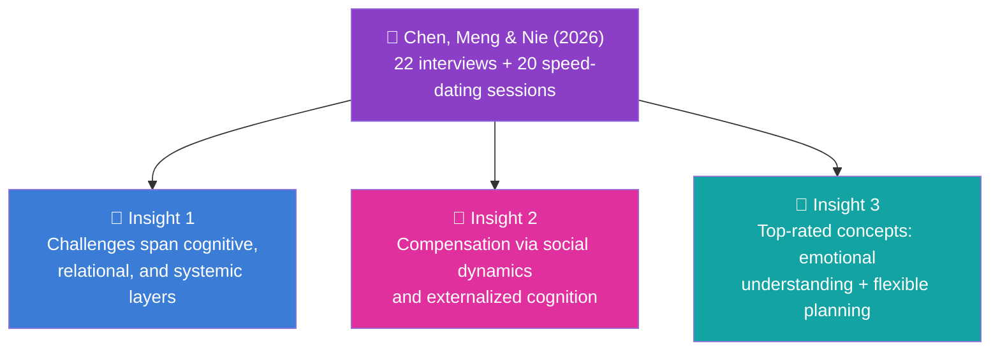
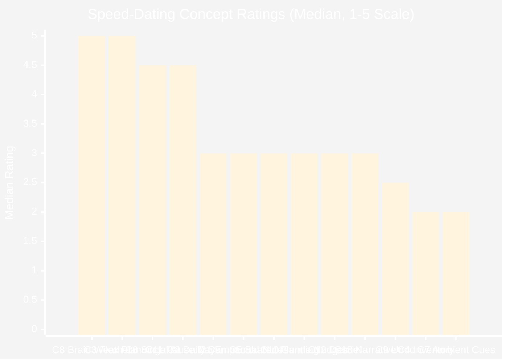
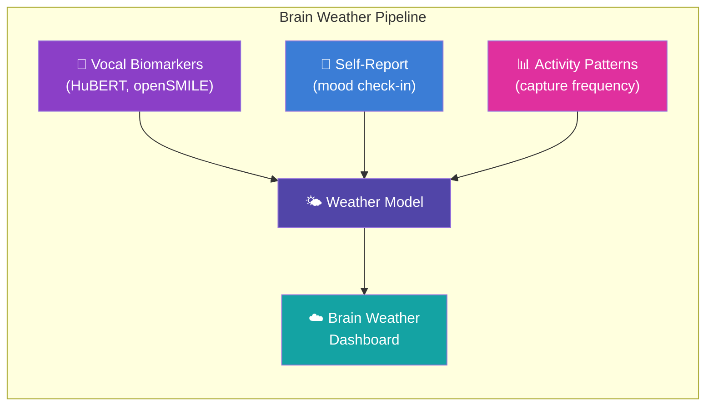
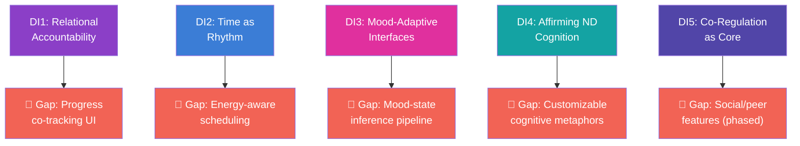
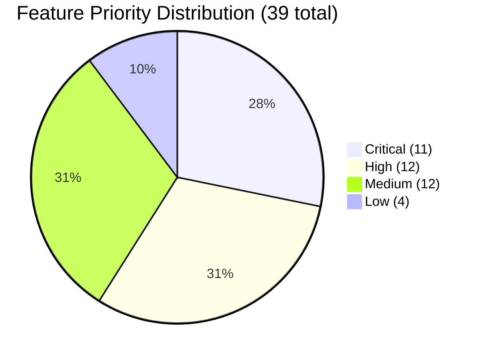

> **Status:** SUPERSEDED · **Archived:** 2026-07-01 · **Superseded by:** `04-Engineering/yar/research/adhd-paper-synthesis.md`
>
> Duplicate synthesis; the deeper 04E version is canonical. Kept for provenance; do not edit.

> **Status**: Active
> **Date**: 2026-05-29
> **Author**: \@mohammadi
> **Audience**: researchers, engineers
> **Tags**: `adhd`, `research`, `neurodivergent`, `yar`

> [!NOTE]
> **TL;DR**: Chen, Meng & Nie (2026) interviewed 22 ADHD adults and speed-dated 13 AI task management concepts. The top 3 findings: **Brain Weather Dashboard** (M=5) and **Flexible Planning with Gentle Streaks** (M=5) tied as the highest-rated concepts, followed by **Social Presence AI** (M=4.5) and **Emotionally Aware Pause Days** (M=4.5). The paper validates every one of Yar's core design principles: companion over tool, rhythm over grid, no shame ever. This synthesis maps all 13 concepts, 14 challenges, and 39 master features to Yar's architecture.
> **Source**: [adhd-paper-synthesis.md](file:///home/mohammadi/Documents/ObsidianVault/02-Products/cytonome-yar/research/adhd-paper-synthesis.md)

---

## ⚡ Executive Summary

> [!TIP]
> **Section summary**: This paper is the strongest empirical validation of Yar's design philosophy. ADHD task management is relational and emotional, not individual willpower. Tools built on neurotypical assumptions (stable attention, linear time, self-regulation) actively harm ADHD users.

### Three Core Insight Clusters

### Five Design Implications for Yar

| # | Design Implication | Yar Alignment |
|---|---|---|
| DI1 | Relational accountability over solo optimization | Yar's companion persona (warmth=0.85, patience=0.95) |
| DI2 | Time as rhythm, not grid | Yar rejects streaks, overdue tasks, productivity language |
| DI3 | Mood-adaptive interfaces | Brain Weather + emotional aftercare |
| DI4 | Affirming neurodivergent cognition | Identity-safe design, Communication Translation |
| DI5 | Co-regulation as core infrastructure | Distributed runtime (Dapr + NATS + LiveKit) |

> [!IMPORTANT]
> Every single design implication maps directly to an existing Yar principle. This paper does not change Yar's direction; it provides the empirical evidence that the direction is correct.

---

## 🎯 The 13 Design Concepts — Speed-Dating Results

> [!TIP]
> **Section summary**: 20 participants rated 13 speculative AI concepts (1-5 Likert). The winners: Brain Weather (M=5), Flexible Planning (M=5), Social Presence AI (M=4.5), Pause Days (M=4.5). The losers: Ambient Transition Cues (M=2) and Emotional Inventory (M=2). Yar should prioritize the top 4 and deprioritize the bottom 2.

### Concept Ratings at a Glance

### Full Concept Ranking Table

| Rank | Concept | Phase | Median | Top-3 Count | Least-3 Count | Yar Priority |
|---|---|---|---|---|---|---|
| 🥇 | C8: Brain Weather Dashboard | Execution | **5** | **13** | 0 | **Critical** |
| 🥇 | C3: Flexible Planning + Gentle Streaks | Planning | **5** | 10 | 1 | **Critical** |
| 🥉 | C6: Social Presence AI | Execution | **4.5** | **12** | 1 | **Critical** |
| 🥉 | C11: Emotionally Aware Pause Days | Adaptation | **4.5** | **12** | 0 | **High** |
| 5 | C2: Mood-Aware Daily Companion | Planning | 3 | 0 | 2 | High |
| 6 | C12: Emotional Debrief | Reflection | 3 | 3 | 4 | Medium |
| 7 | C5: Shared Planning w/ Trusted Person | Planning | 3 | 4 | 5 | Medium |
| 8 | C13: Weekly Narrative Reflection | Reflection | 3 | 0 | 3 | Medium |
| 9 | C10: Pattern-Based Gentle Nudges | Adaptation | 3 | 0 | 3 | Medium |
| 10 | C1: Private Emotional Notes | Planning | 3 | 2 | 2 | Low |
| 11 | C9: Adaptive Planning Undo | Adaptation | 2.5 | 1 | 5 | Medium |
| 12 | C4: Emotional Inventory | Planning | **2** | 0 | **10** | Low |
| 13 | C7: Ambient Transition Cues | Execution | **2** | 1 | **11** | Low |

---

### 📋 Planning Phase (Concepts 1-5)

> [!TIP]
> **Section summary**: Five concepts address the planning phase. **Flexible Planning + Gentle Streaks** (C3, M=5) is the clear winner. Mood-Aware Daily Companion (C2) maps to Yar's existing gentle planning. Emotional Inventory (C4, M=2) is the worst: friction during high motivation.

| Concept | Median | What It Does | Why Users Liked/Disliked It | Yar Mapping |
|---|---|---|---|---|
| **C1: Private Emotional Notes** | 3 | Text box before planning for mood notes | Useful for expression but unnecessary in task workflows | Optional pre-planning check-in in gentle planning flow |
| **C2: Mood-Aware Daily Companion** | 3 | AI morning check-in with mood-aware suggestions | Valued relational tone; worried about notification fatigue | Yar's gentle planning ("What should I focus on today?") enhanced with vocal biomarkers |
| **C3: Flexible Planning + Gentle Streaks** | **5** | Ideal vs. baseline plans; streaks preserved on skip days | S14: "Stopped me from hating myself." Some worried excessive flexibility = demotivating | Dual-track planning as core gentle planning UX. **No shame, ever** principle validated |
| **C4: Emotional Inventory** | **2** | Reflective prompts when accepting new tasks | "Introduced friction during moments of high motivation" — 10 least-preferred | Configurable JITAI, triggered only when overcommitment patterns detected |
| **C5: Shared Planning w/ Trusted Person** | 3 | Share daily plans with trusted friend/coach/partner | S9 valued gentle accountability; S4 questioned whether AI should mediate friendships | Opt-in shared visibility with granular controls. Never default to sharing |

> [!IMPORTANT]
> **C3 is Yar's most validated concept.** The dual-track (ideal vs. baseline) planning model has the strongest empirical support. Participants explicitly said it reduced self-blame. This should be a Phase 3 (Mobile Interface) priority.

---

### ⚙️ Execution Phase (Concepts 6-8)

> [!TIP]
> **Section summary**: This phase contains both the highest-rated concept (**Brain Weather**, M=5) and the lowest-rated (**Ambient Cues**, M=2). Social Presence AI (M=4.5) validates Yar's Rive companion animation.

| Concept | Median | What It Does | Why Users Liked/Disliked It | Yar Mapping |
|---|---|---|---|---|
| **C6: Social Presence AI** | **4.5** | AI body double: animated timers, gentle prompts, silent presence | S2: "a partner who understands and doesn't judge." S7: compared AI to the rose in *The Little Prince* | Yar's Rive persona animation = body-doubling proxy. Focus companion mode. |
| **C7: Ambient Transition Cues** | **2** | Gentle soundscapes, color shifts, soft chimes for transitions | "Too subtle to notice during focused work." 11 least-preferred | Supplementary only. Primary transitions use voice + visual + haptic |
| **C8: Brain Weather Dashboard** | **5** | Weather metaphors for cognitive states: "light fog," "clear skies" | S5: "I hope my emotions are seen." S9: "Mild haze is more comforting than red overdue tasks" — **13 top-3 picks** | Yar's primary self-awareness interface. Replaces conventional dashboards. Fed by vocal biomarkers + mood + activity |

> [!IMPORTANT]
> **Brain Weather is Yar's visual identity.** It is the single most popular concept in the study (13/20 top-3 picks, zero least-preferred picks). The weather metaphor externalizes cognitive state as environment, not character flaw. This defines Yar's unique design language.

---

### 🔄 Adaptation Phase (Concepts 9-11)

> [!TIP]
> **Section summary**: Emotionally Aware Pause Days (C11, M=4.5) is the standout. It validates proactive burnout prevention as a core Yar feature. Adaptive Planning Undo (C9) and Pattern-Based Nudges (C10) are secondary.

| Concept | Median | What It Does | Why Users Liked/Disliked It | Yar Mapping |
|---|---|---|---|---|
| **C9: Adaptive Planning Undo** | 2.5 | Withdraw tasks without penalty; soft reset | S11: reduced anxiety. Others: "enabling procrastination" | Extension of dual-track planning. Tasks never "overdue," always reschedulable |
| **C10: Pattern-Based Gentle Nudges** | 3 | Detect recurring friction, offer contextual suggestions | S14: "It feels like it's watching me." Others appreciated rhythm alignment | Pattern surfacing framed as insight, not instruction. User controls frequency/tone |
| **C11: Emotionally Aware Pause Days** | **4.5** | Proactive pause suggestion when burnout detected | S1: sadness "often became apparent only when overwhelming." S17: "earlier intervention might have prevented burnout" | JITAI triggered by converging signals: declining vocal energy, reduced capture, self-reported low mood |

> [!WARNING]
> **C10 (Pattern Nudges) creates a surveillance anxiety tension.** Even well-intentioned nudges can feel like monitoring. Yar must ensure all nudges are user-configured and pattern detection happens entirely on-device.

---

### 🪞 Reflection Phase (Concepts 12-13)

> [!TIP]
> **Section summary**: Both reflection concepts scored M=3. Emotional Debrief (C12) needs careful opt-in framing to avoid "revisiting failure." Weekly Narrative (C13) pairs naturally with Brain Weather history.

| Concept | Median | What It Does | Why Users Liked/Disliked It | Yar Mapping |
|---|---|---|---|---|
| **C12: Emotional Debrief After Collapse** | 3 | Non-judgmental reflection space after task abandonment | S16/S5 valued reflection. Others worried about "revisiting failure too directly" | Opt-in: "Would you like to think about this?" (not "Let's debrief what happened") |
| **C13: Weekly Narrative Reflection** | 3 | Narrate your week in own words instead of viewing analytics | "Useful for sensemaking but not distinctive" alone | Combine with Brain Weather history: narrate while viewing cognitive weather patterns |

---

## 🧠 Challenge Framework — What ADHD Users Face

> [!TIP]
> **Section summary**: The paper surfaces 14 challenges across 3 layers: internal (cognitive/emotional), relational (social misrecognition), and systemic (institutional misalignment). Every challenge maps to a specific Yar feature response.

### Challenge Architecture

```mermaid
graph TD
    ROOT["🧠 ADHD Task Management<br/>Challenges"]

    subgraph "Layer 1: Internal"
        I1["Task initiation paralysis"]
        I2["Hyperfocus exhaustion"]
        I3["Time perception disorders"]
        I4["Deadline addiction"]
        I5["Emotional avoidance"]
        I6["Self-blame spirals"]
        I7["Fear of sustainability"]
        I8["Planning anxiety"]
    end

    subgraph "Layer 2: Relational"
        R1["Social misrecognition"]
        R2["Internalized inadequacy"]
        R3["Resistance and reframing"]
        R4["Unequal social scaffolding"]
    end

    subgraph "Layer 3: Systemic"
        S1["Institutional misalignment"]
        S2["Over-reliance on organizing"]
    end

    ROOT --> I1
    ROOT --> R1
    ROOT --> S1

    style ROOT fill:#8B3FC7,color:#fff
    style I1 fill:#3B7DD6,color:#fff
    style I2 fill:#3B7DD6,color:#fff
    style I3 fill:#3B7DD6,color:#fff
    style I4 fill:#3B7DD6,color:#fff
    style I5 fill:#3B7DD6,color:#fff
    style I6 fill:#3B7DD6,color:#fff
    style I7 fill:#3B7DD6,color:#fff
    style I8 fill:#3B7DD6,color:#fff
    style R1 fill:#E0309E,color:#fff
    style R2 fill:#E0309E,color:#fff
    style R3 fill:#E0309E,color:#fff
    style R4 fill:#E0309E,color:#fff
    style S1 fill:#F26355,color:#fff
    style S2 fill:#F26355,color:#fff
```

### 🔵 Layer 1: Internal Cognitive and Emotional Barriers

| Challenge | Participant Quote | Yar Feature Response |
|---|---|---|
| **Task initiation paralysis** | "I obviously want to brush my teeth and wash my face, but I stay in bed all the time." (P17) | Voice capture (frictionless "Hey Yar"), Social Presence AI (body double), Spiciness slider (micro-step decomposition) |
| **Hyperfocus exhaustion** | "When it's something I really like, I can write for ten hours straight." (P13) | Break reminders, Emotionally Aware Pause Days, Brain Weather (state transition awareness) |
| **Time perception disorders** | "My perception of time is as if I want to deliberately forget it." (P5) | Time estimation, Dual-track planning (ideal/baseline), Rhythm-based scheduling |
| **Deadline addiction** | "I feel satisfaction from this dependence on pressure." (P1) | Gentle planning (proactive structure), Pattern surfacing ("You finish things 2 days before deadline") |
| **Emotional avoidance** | Tasks without personal relevance become "emotionally aversive" (P4, P8, P12) | Communication Translation (reframe purpose), Mood-aware planning, Spiciness slider |
| **Self-blame spirals** | "I often blame myself for a moment of distraction." (P17) | Brain Weather (normalize fluctuations as weather), Emotional aftercare, No shame design |
| **Fear of sustainability** | "If I really succeed, it will be very hard to maintain. I might as well smash this possibility." (P1) | Gentle streaks, Reflection prompting, Persistent relational context |
| **Planning anxiety** | "Every time I write a plan, I get anxious because I know I won't follow it." (P10) | Adaptive Planning Undo, Dual-track planning, Brain Weather (plan what the weather allows) |

### 🟣 Layer 2: Relational and Sociocultural Misrecognition

| Challenge | Participant Quote | Yar Feature Response |
|---|---|---|
| **Social misrecognition** | "When I told my sister I had ADHD, she said, 'Then just correct it.'" (P6) | Communication Translation (ND↔NT bridging), Affirming language, Per-person context |
| **Internalized inadequacy** | "Other people manage; why can't I?" (P10) | Brain Weather (externalizes state as weather, not flaw), Weekly Narrative Reflection, Identity-safe design |
| **Resistance and reframing** | "It's not that I can't focus; it's that I focus differently." (P7) | Affirming cognition as Yar's core persona, Cognitive scaffolding, Pattern surfacing (shows what works) |
| **Unequal social scaffolding** | "Emotional burden of self-management in isolation" (P8, P14) | Social Presence AI (always-available body double), AI co-regulation, Future community features |

### 🔴 Layer 3: Systemic and Structural Misalignments

| Challenge | Participant Quote | Yar Feature Response |
|---|---|---|
| **Institutional misalignment** | P4 left job due to open-office sensory overload | Proactive AI (surfaces overlooked obligations), Customizable sensory environment, Context-sensitive notifications |
| **Over-reliance on organizing** | "I sometimes spend more time organizing the to-do app than doing the task." (P9) | Friction reduction (Yar captures without setup), Auto task extraction (AI finds tasks), JITAI delivery |

---

## 🤝 Strategy Framework — How ADHD Users Compensate

> [!TIP]
> **Section summary**: Two compensation strategies: social dynamics (body doubling, peer communities) and technological tools (externalized cognition). The key insight: tools only work when embedded in relationships. Yar IS the relationship.

### Strategy 1: Social Dynamics as Executive Function Prosthetics

| Strategy | Paper Evidence | Yar Implementation |
|---|---|---|
| **Co-regulation / borrowed structure** | "My friend calls me to remind me to get up and do things." (P17). P1 maintains "replacement" friends to avoid relational dependence | Social Presence AI provides reliable, non-fragile co-regulation. Always available, never judges. Design constraint: supplement human relationships, never replace them |
| **Peer communities** | "Only in the ADHD group do I feel that I can tell the truth." (P13) | Future: shared focus rooms, peer co-working. Privacy-preserving: share presence, not content |

### Strategy 2: Technological Tools as Externalized Cognition

| Strategy | Paper Evidence | Yar Implementation |
|---|---|---|
| **Scaffolded memory** | "If it's only me reminding myself, it just becomes invisible after a few days." (P11) | Graph RAG + semantic retrieval make captures permanently findable. Social layer keeps information salient |
| **Emotional symbolism of tools** | "The bullet journal is the only paper tool I can stick to. It gives me peace of mind." (P15) | Capture experience must be intrinsically rewarding: satisfying animations, warm confirmation tones, Rive avatar reactions |
| **Simulated companionship** | "Reporting progress to AI was helpful." (P9) | This IS Yar's core value proposition. Structured capture + persona consistency + longitudinal memory + CAP safety |

> [!IMPORTANT]
> **The paper's most powerful finding**: participants already use AI chatbots for task accountability (P3, P6, P9). They are improvising what Yar is building deliberately. Yar formalizes the pattern with safety, consistency, and memory that chatbots lack.

---

## 🏗️ Design Implications — Yar Architecture Alignment

> [!TIP]
> **Section summary**: Five design implications from the paper. Each one maps to an existing Yar principle AND reveals a specific implementation gap. The gaps are actionable: progress co-tracking UI, energy-aware scheduling, mood-state pipeline, customizable metaphors, and phased social features.

### Implication-to-Gap Mapping

| # | Design Implication | Paper Says | Yar Alignment | Implementation Gap |
|---|---|---|---|---|
| DI1 | **Relational Accountability** | Simulate relational accountability through conversational check-ins, progress co-tracking, emotional acknowledgment | Direct match: persona design (warmth=0.85, patience=0.95, shame_avoidance=true), Rive animation states | No **progress co-tracking UI**. Add lightweight check-in flow with warm, non-evaluative language |
| DI2 | **Time as Rhythm** | Structure tasks against energy flows. Support ideal vs. baseline plans. Preserve streaks on skip days | Already rejects streaks and productivity language. Paper provides constructive alternative: rhythm-based + dual-track | No **energy-state-aware scheduling**. Integrate vocal biomarkers (HuBERT, openSMILE) to estimate energy and suggest plan tier |
| DI3 | **Mood-Adaptive Interfaces** | Integrate mood-adaptive mechanisms. Overwhelmed users see small manageable goals with affirming messages | Maps to Brain Weather + emotional aftercare. Most valued feature category across all 13 concepts | No **mood-state inference pipeline** combining self-report + vocal biomarkers + behavioral signals into unified weather model |
| DI4 | **Affirming ND Cognition** | Don't pathologize divergence. Allow users to select representations matching their cognitive orientation | Identity-safe by design. Communication Translation preserves intent. ADHD profiles are heterogeneous | No **customizable cognitive metaphors**. Some prefer weather, others prefer analytics. Build a preference system |
| DI5 | **Co-Regulation as Core** | Build co-regulation into core architecture. Offer live focus rooms, shared journaling, mutual nudging | Distributed runtime (Dapr + NATS, LiveKit) designed for multi-actor cognitive infrastructure | No social/peer features. **Phase 1**: AI co-regulator → **Phase 2**: trusted-person sharing → **Phase 3**: peer rooms |

---

## 📱 ADHD Apps Research Integration

> [!TIP]
> **Section summary**: Cross-referencing the ADHD apps research document with the paper's validated concepts. Five tool categories (voice-to-structure, vision-to-data, knowledge workspace, proactive AI, clipboard) all find validation in the paper's findings.

### Tool Category Alignment

| Category | Key App | Paper Validation | Yar Integration |
|---|---|---|---|
| 🎤 **Voice-to-Structure** | Tana voice memos → supertag pipeline | C2 (Mood-Aware Companion): voice-first reduces friction | Voice capture (Gemma 4 via LiteRT-LM) + supertag-style typed object routing |
| 🎤 **Voice-to-Structure** | Letterly (rambling → polished summaries) | Reducing cognitive burden: "Many apps are too complicated to set up" (P4) | Brain dump compiler (Goblin Tools pattern) + post-capture AI summarization |
| 🎤 **Voice-to-Structure** | Voicenotes.com (Universal Recall) | P11: "If it's only me reminding myself, it just becomes invisible" | Semantic retrieval across all captures. Graph RAG makes voice history queryable |
| 👁️ **Vision-to-Data** | Mathpix (diagram → LaTeX) | Additive to paper scope (STEM-specific) | Plugin for scientific users (ND researchers and students) |
| 📚 **Knowledge Workspace** | Obsidian (local-first Markdown) | Privacy emphasis: participants want AI that doesn't surveil | Anytype as local-first KG. Obsidian MCP for developer-oriented users |
| 📚 **Knowledge Workspace** | Heptabase (infinite canvas) | C8 validates visual metaphors for cognitive states | Brain Weather Dashboard serves spatial-visual function. Canvas view for knowledge exploration |
| 🤖 **Proactive AI** | Saner.ai (morning brief) | C2 + P14: "I hope the system comes to me instead of me opening it" | Gentle planning enhanced with multi-source scanning (captures, calendar, pending tasks) |
| 🤖 **Proactive AI** | Recallify (tasks from recordings) | P9: "I spend more time organizing the to-do app than doing the task" | Auto task extraction: AI organizes, user acts. No organizing required |
| 📋 **Clipboard** | ClipZ + KDE Connect | Co-regulation spans devices: support available wherever user is | Distributed runtime (NATS JetStream, Iroh Documents) for cross-device sync |

---

## 📝 Prompt Doc Integration — Feature Requirements Validation

> [!TIP]
> **Section summary**: The prompt document specifies target feature requirements across 4 categories. The paper validates most of them. Voice assistant and privacy/open-source requirements are the most strongly validated.

### Voice Assistant / Transcriber

| Requirement | Paper Validation | Priority |
|---|---|---|
| Real-time, no-delay conversational interface | Validated: "low-friction and proactive interaction" (Section 4.6) | **Critical** |
| Turn scattered voice into structured docs | Validated: C3 (Flexible Planning) + tools as externalized cognition | **Critical** |
| Understanding equations and math (LaTeX) | Not validated by paper. Validated by apps research (Mathpix) | Medium |
| AI summarization of transcribed content | Validated: desire for reduced cognitive burden | **High** |
| Integration with personal knowledge bases | Validated: tools work when embedded in context | **High** |
| Privacy and open-source | Validated: Section 7.3 ethics, participants prefer non-surveillance AI | **Critical** |

### Unstructured Content Transformation

| Requirement | Paper Validation | Priority |
|---|---|---|
| OCR for handwriting to editable text | DI4: affirming ND cognition through multiple input modes | Medium |
| Structure Recognition (notes → lists, tasks, maps) | Directly validated: C3, auto task extraction patterns | **High** |
| Visual-to-digital transformation | Not directly validated; additive convenience | Low |
| Edit scanned doc regions | Not validated by paper | Low |

### Note-Taking and Clipboard

| Requirement | Paper Validation | Priority |
|---|---|---|
| Seamless cross-device sync (Android + Linux) | DI5: co-regulation as core infrastructure spans devices | **High** |
| Online and offline functionality | On-device AI emphasis + privacy concerns | **Critical** |
| AI-friendly format exports (Markdown) | Developer-oriented; not directly validated | Medium |
| Cross-device clipboard sharing | Same as cross-device sync validation | Medium |

---

## 🏆 Master Feature Requirements (39 Features)

> [!TIP]
> **Section summary**: 39 de-duplicated features from all sources, grouped by the executive function they support. 8 executive function categories. 11 features are **Critical**, 12 are **High**, 12 are **Medium**, 4 are **Low**. The Critical features concentrate in task initiation, sustained attention, time management, emotional regulation, and privacy.

### Priority Distribution

### 🚀 Task Initiation (Overcoming Paralysis) — 5 features

| # | Feature | Source | Priority |
|---|---|---|---|
| 1 | **Voice-first capture** ("Hey Yar" → brain dump → typed object) | Apps Research, Prompt Doc | **Critical** |
| 2 | **Spiciness slider for task decomposition** | Goblin Tools pattern | **Critical** |
| 3 | **Social Presence AI / body doubling** | Paper C6 (M=4.5) | **Critical** |
| 4 | Auto task extraction from captures | Saner AI pattern | High |
| 5 | Mood-Aware Daily Companion (morning check-in) | Paper C2, Saner.ai | High |

### 🎯 Sustained Attention (Managing Focus) — 4 features

| # | Feature | Source | Priority |
|---|---|---|---|
| 6 | **Focus companion mode** (Rive avatar as ambient presence) | Paper C6, Product Impl | **Critical** |
| 7 | Break reminders during hyperfocus | Super Productivity pattern | High |
| 8 | Idle detection with graceful pause | Super Productivity pattern | Medium |
| 9 | PiP Focus Window (floating current-task reminder) | Saner AI pattern | Medium |

### ⏰ Time Management (Time Blindness) — 5 features

| # | Feature | Source | Priority |
|---|---|---|---|
| 10 | **Dual-track planning** (ideal vs. baseline goals) | Paper C3 (M=5) | **Critical** |
| 11 | Time estimation for tasks | Goblin Tools pattern | High |
| 12 | Rhythm-based scheduling (energy flows, not hourly grids) | Paper DI2 | High |
| 13 | Gentle streaks (preserved on skip days, no resets) | Paper C3 | High |
| 14 | Proactive daily planning (AI suggests based on context) | Saner.ai, Paper C2 | High |

### 💜 Emotional Regulation (Shame Prevention) — 6 features

| # | Feature | Source | Priority |
|---|---|---|---|
| 15 | **Brain Weather Dashboard** (cognitive state visualization) | Paper C8 (M=5) | **Critical** |
| 16 | Emotionally Aware Pause Days (proactive rest) | Paper C11 (M=4.5) | High |
| 17 | Emotional aftercare (post-difficulty processing) | Product Impl, Paper C12 | High |
| 18 | Emoji mood tracking on tasks | Leantime pattern | Medium |
| 19 | Emotional debrief after task collapse | Paper C12 | Medium |
| 20 | Replay loop interruption | Product Impl | Medium |

### 🧩 Working Memory (Externalized Cognition) — 7 features

| # | Feature | Source | Priority |
|---|---|---|---|
| 21 | **Brain dump compiler** (chaos → structure) | Goblin Tools, Prompt Doc | **Critical** |
| 22 | Semantic retrieval ("What was that thing about...") | Product Impl, Voicenotes | High |
| 23 | Smart note types / supertags | Tana pattern | High |
| 24 | Browser-aware contextual capture (Cytomark) | Product Impl | High |
| 25 | Cross-device clipboard sync | KDE Connect, ClipZ | Medium |
| 26 | OCR for handwriting/whiteboard | Mathpix, Nebo | Medium |
| 27 | LaTeX/math equation support | Mathpix | Medium |

### 💬 Social Cognition (Communication) — 4 features

| # | Feature | Source | Priority |
|---|---|---|---|
| 28 | **Communication Translation** (ND↔NT bidirectional) | Product Impl | **Critical** |
| 29 | Tone analysis ("Was that email rude or am I overthinking?") | Goblin Tools Judge | High |
| 30 | Persistent relational context (per-person models) | Product Impl | Medium |
| 31 | Shared planning with trusted person (opt-in) | Paper C5 | Medium |

### 📈 Self-Awareness (Longitudinal Understanding) — 4 features

| # | Feature | Source | Priority |
|---|---|---|---|
| 32 | Vocal biomarker tracking (energy, stress, medication) | Product Impl, Layer 2.4 | High |
| 33 | Pattern surfacing ("You've been capturing a lot about X") | Product Impl, Paper C10 | Medium |
| 34 | Weekly Narrative Reflection | Paper C13 | Medium |
| 35 | Longitudinal cognitive weather history | Paper C8 extension | Medium |

### 🔒 Privacy and Autonomy — 4 features

| # | Feature | Source | Priority |
|---|---|---|---|
| 36 | **On-device AI** (local-first inference) | Product Impl, Apps Research | **Critical** |
| 37 | **CAP safety guardrails** | Product Impl | **Critical** |
| 38 | User-controlled nudge configuration | Paper speed-dating | High |
| 39 | **Open-source availability** | Prompt Doc, Cytognosis mission | **Critical** |

---

## 🗺️ Implementation Roadmap Alignment

> [!TIP]
> **Section summary**: The paper's top-rated concepts concentrate in Phases 3-5. This validates Yar's phase ordering: infrastructure first (CAP, Anytype), then the features users value most (Brain Weather, Social Presence, Flexible Planning).

```mermaid
gantt
    title Yar Phases + Paper Concept Integration
    dateFormat X
    axisFormat %s

    section Phase 1: CAP
    CAP Integration               :done, p1, 0, 1
    Mood-adaptive policy (new)    :active, p1n, 0, 1

    section Phase 2: Anytype
    Anytype Submodule             :done, p2, 1, 2
    Cognitive weather object type :active, p2n, 1, 2

    section Phase 3: Mobile
    Social Presence AI (C6)       :crit, p3a, 2, 3
    Flexible Planning (C3)        :crit, p3b, 2, 3
    Brain Weather (C8)            :crit, p3c, 2, 3

    section Phase 4: Desktop
    Brain Weather Dashboard (C8)  :crit, p4a, 3, 4
    Weekly Narrative (C13)        :p4b, 3, 4

    section Phase 5: Voice
    Mood-Aware Companion (C2)     :p5a, 4, 5
    Vocal biomarkers for Weather  :p5b, 4, 5

    section Phase 6: Persona
    Focus companion mode (C6)     :p6a, 5, 6
    Pause Days (C11)              :p6b, 5, 6
```

| Yar Phase | Paper Concepts | New Requirements |
|---|---|---|
| **Phase 1: CAP Integration** | No change | CAP must support mood-adaptive policy adjustments |
| **Phase 2: Anytype Submodule** | No change | Schema needs "cognitive weather" object type |
| **Phase 3: Mobile Interface** | C6 (Social Presence), C3 (Flexible Planning), C8 (Brain Weather) | Rive persona in focus companion mode; dual-track goals in gentle planning |
| **Phase 4: Desktop & Web** | C8 (Brain Weather Dashboard), C13 (Weekly Narrative) | Desktop dashboard becomes Brain Weather primary interface |
| **Phase 5: Voice Pipeline** | C2 (Mood-Aware Companion) | Vocal biomarkers feed Brain Weather; morning check-in flow |
| **Phase 6: Persona System** | C6 (Social Presence), C11 (Pause Days) | Detect burnout signals and proactively suggest rest |

> [!IMPORTANT]
> The paper's highest-rated concepts (C8, C3, C6, C11) all land in Phases 3-5. This validates Yar's current sequencing: build the safety and data infrastructure first, then deliver the features that matter most.

---

## ⚠️ Key Design Tensions

> [!TIP]
> **Section summary**: Four tensions Yar must navigate. Each has a clear design response that preserves user autonomy while delivering value.

| Tension | What Users Said | Yar's Response |
|---|---|---|
| **Autonomy vs. Guidance** | "I want it to suggest, not decide." Users fear excessive AI intervention | Companion authority level. CAP enforces boundaries. All suggestions inspectable, adjustable, overridable |
| **Emotional Support vs. Efficiency** | Emotional journaling = extra cognitive burden when it disrupts workflow | Embed emotion seamlessly: vocal biomarkers detect mood without explicit journaling. Brain Weather updates passively |
| **Privacy vs. Social Connection** | Social Presence (C6) highly valued; Shared Planning (C5) divisive | Default to AI-mediated social presence. Human sharing always opt-in with granular controls |
| **Adaptive Nudges vs. Surveillance** | "Even if I know it's trying to help, it feels like it's watching me." (S14) | All nudges user-configured: frequency, tone, content, delivery mode. Pattern detection on-device, no data leaves |

> [!WARNING]
> **The surveillance tension is the most dangerous.** If Yar feels like monitoring software, users will abandon it regardless of how helpful it is. On-device processing and user-controlled nudges are non-negotiable design constraints.

---

## 🔗 What's Next?

| Document | Why Read It |
|---|---|
| [[adhd-paper-synthesis]] | Full source document with complete paper citations and methodology details |
| [[capacities-deep-dive_adhd]] | Object system design patterns Yar should adopt for Brain Weather data model |
| [[yar-master-reference_adhd]] | Yar's complete architecture reference, including the voice pipeline that feeds Brain Weather |
| [[adhd-apps-research_adhd]] | Detailed app-by-app analysis of the ADHD productivity tools ecosystem |

---

## 📖 Glossary

Expand terminology table

| Term | Definition |
|---|---|
| **Body doubling** | Having another person (or AI) present while working. Reduces task initiation barriers through social co-regulation. |
| **Brain Weather Dashboard** | Yar's cognitive state visualization using weather metaphors ("light fog," "clear skies") instead of productivity metrics. |
| **CAP** | Control Authority Protocol. Safety boundary system that governs what Yar can and cannot do. |
| **Co-regulation** | Using external relationships (human or AI) to help regulate executive function. Contrasts with self-regulation. |
| **Communication Translation** | Yar feature that bridges neurodivergent and neurotypical communication styles bidirectionally. |
| **Dapr** | Distributed Application Runtime. Microservices building block for Yar's distributed architecture. |
| **Dual-track planning** | Setting both "ideal" (ambitious) and "baseline" (minimum viable) plans. Users drop to baseline without shame. |
| **Gentle streaks** | Progress tracking where streaks survive skip days. No reset, no red, no penalty. |
| **Graph RAG** | Retrieval-Augmented Generation using knowledge graph traversal. Makes all captures queryable. |
| **HuBERT** | Hidden-Unit BERT. Self-supervised speech model used for emotion sensing from vocal biomarkers. |
| **JITAI** | Just-In-Time Adaptive Intervention. Support delivered at the precise moment of need, not as a general system. |
| **Likert scale** | 1-5 rating scale used in the speed-dating evaluation of design concepts. |
| **LiveKit** | Open-source WebRTC platform used for Yar's real-time voice and presence features. |
| **LiteRT-LM** | Google's on-device inference runtime (formerly TFLite). Runs Gemma 4 models locally on Yar. |
| **NATS** | Lightweight messaging system used in Yar's distributed runtime for cross-device communication. |
| **ND↔NT** | Neurodivergent to neurotypical (and vice versa). Refers to bidirectional communication translation. |
| **openSMILE** | Open-source toolkit for extracting prosodic features (pitch, energy, speech rate) from audio. |
| **Rive** | Animation runtime used for Yar's companion persona (idle → listening → thinking → speaking → empathic states). |
| **Speed-dating** | Research method where participants quickly evaluate multiple design concepts in sequence. |
| **Spiciness slider** | Task decomposition tool (from Goblin Tools pattern) that adjusts granularity of step breakdown. |
| **Supertag** | Tana's schema system. A typed tag that adds structured properties to any node. |
| **Vocal biomarkers** | Measurable speech characteristics (energy, pitch variability, speech rate) that correlate with cognitive/emotional states. |

