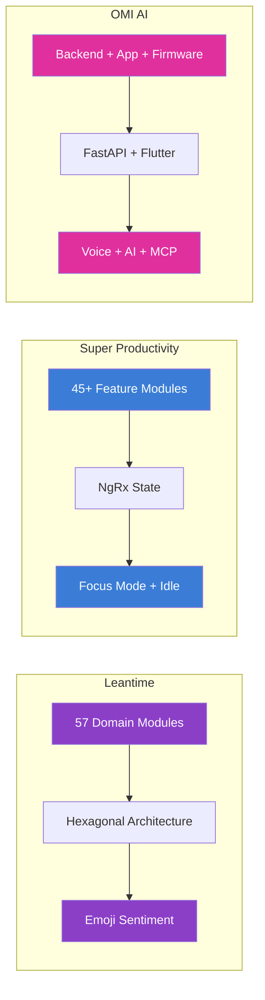
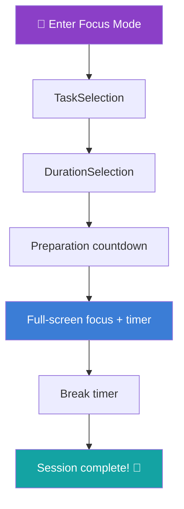
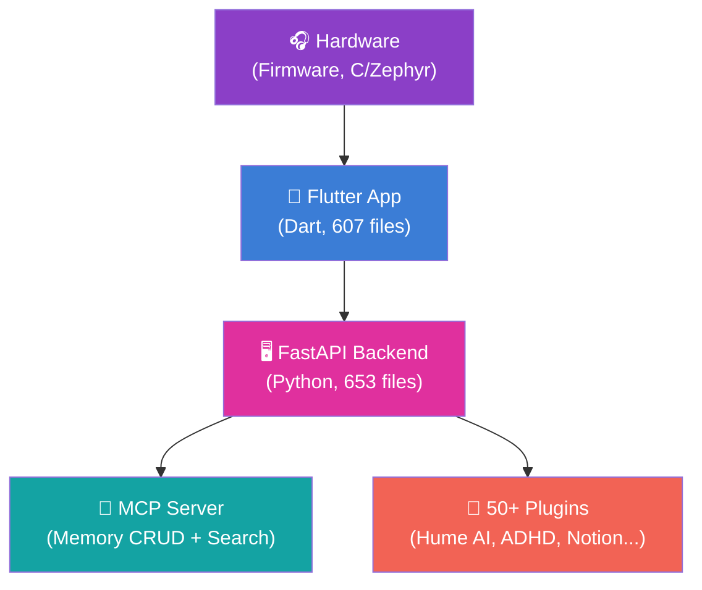
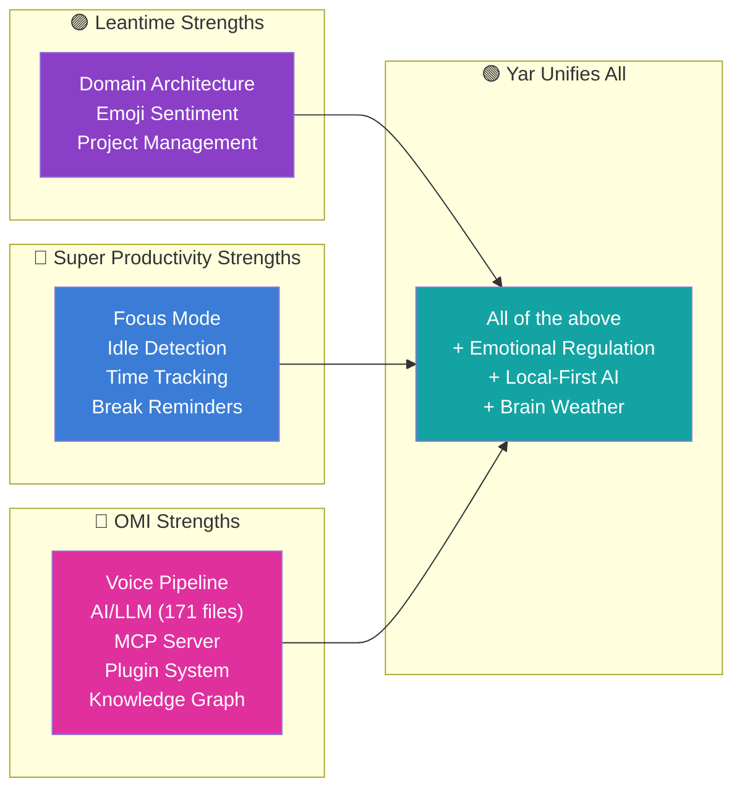

> **Status:** SUPERSEDED · **Archived:** 2026-07-01 · **Superseded by:** `04-Engineering/yar/research/codebase-analysis.md`
>
> Condensed duplicate; the 04E version is canonical. Kept for provenance; do not edit.

> **Status**: Active
> **Date**: 2026-05-29
> **Author**: \@mohammadi
> **Audience**: engineers
> **Tags**: `yar`, `codebase`, `analysis`

> [!NOTE]
> **TL;DR**: Three open-source codebases (Leantime, Super Productivity, OMI) were indexed with zoekt (383 MB, 11,467 files) and analyzed for patterns Yar should adopt. Super Productivity has the best focus mode (3 strategies: Pomodoro/Flowtime/Countdown). OMI has the deepest AI/voice pipeline (266 voice files, 171 AI files). Leantime has the cleanest domain architecture (57 modules). Together they cover everything Yar needs except emotional regulation and local-first AI.
> **Source**: [codebase-analysis.md](file:///home/mohammadi/repos/cytognosis/docs/cytonome/yar/research/codebase-analysis.md)

---

## ⚡ Quick Start: Key Findings

> [!TIP]
> **Section summary**: Each codebase excels in a different area. No single tool covers more than 3 of Yar's 7 core capabilities. The three are remarkably complementary.

### Top 10 Patterns for Yar

| # | Pattern | Source | Why It Matters |
|---|---|---|---|
| 1 | `FocusModeStrategy` interface | Super Productivity | 3 distinct focus modes (Pomodoro, Flowtime, Countdown) behind one interface |
| 2 | Idle detection + graceful resume | Super Productivity | Electron `powerMonitor` + web fallback |
| 3 | MCP server with CRUD + search | OMI | Production-ready reference for exposing cognitive data |
| 4 | Real-time voice → transcription pipeline | OMI | Whisper + Deepgram with diarization |
| 5 | Memory categories with boosts | OMI | `MemoryCategory` enum for weighted recall |
| 6 | Emoji sentiment on tasks | Leantime | Canvas module pattern for emotional tracking |
| 7 | Plugin architecture | OMI | 50+ independent plugins, standard interface |
| 8 | Hexagonal domain modules | Leantime | Clean Controllers/Services/Repos per domain |
| 9 | Feature-scoped NgRx state | Super Productivity | Isolated state management per feature |
| 10 | Break reminder service | Super Productivity | Simple, non-judgmental, configurable |

---

## 📊 Repository Comparison

> [!TIP]
> **Section summary**: Three repos, three languages, three architectures. All MIT or AGPL licensed. Together they index to 383 MB across 11,467 files.

| Metric | Leantime | Super Productivity | OMI AI |
|---|---|---|---|
| **License** | AGPL-3.0 | MIT | MIT |
| **Language** | PHP (838 files) | TypeScript (1,782 files) | Python (653) + Dart (607) + Swift (359) |
| **Clone Size** | 80 MB | 79 MB | 1.2 GB |
| **Zoekt Index** | 72 MB (1,491 files) | 86 MB (4,192 files) | 243 MB (5,784 files) |
| **Domain Modules** | 57 | 45+ feature modules | Backend + App + Plugins |
| **Architecture** | Hexagonal (DDD) | NgRx state management | FastAPI + Flutter + Firebase |

### Architecture Overview



---

## 🏗️ Leantime: Domain-Driven Design

> [!TIP]
> **Section summary**: Leantime uses the cleanest domain architecture of the three: hexagonal design with 57 isolated modules. Each module follows Controllers → Services → Repositories. The standout ND feature is emoji sentiment tracking in the Canvas module.

### Domain Module Structure

```
Domain/{ModuleName}/
├── Controllers/     # HTTP request handlers
├── Services/        # Business logic
├── Repositories/    # Data access
├── Models/          # Data structures
├── Templates/       # Blade views
├── Events/          # Domain events
└── Composers/       # View composers
```

### Key ND-Relevant Modules

| Module | Function | ND Relevance |
|---|---|---|
| `Canvas` | Strategy canvases, retrospectives | **Emoji sentiment tracking** |
| `Tickets` | Core task CRUD | Main task management |
| `Sprints` | Sprint planning + velocity | Time estimation |
| `Dashboard` | My Work view | Reduces cognitive overload |
| `Gamecenter` | Achievement system | **Dopamine rewards** |
| `Ideas` | Idea boards | Brain dump capture |
| `Notifications` | Alert system | Reminder infrastructure |

### Code Quality

| Criterion | Score | Notes |
|---|---|---|
| Modularity | 8/10 | Clean DDD with 57 isolated domains |
| Consistency | 7/10 | Blade templates vary in structure |
| Test Coverage | 6/10 | Tests exist but coverage uncertain |
| Documentation | 7/10 | README, CONTRIBUTING, CLAUDE.md |
| Extensibility | 8/10 | Plugin system with marketplace |
| Modern Patterns | 5/10 | PHP + MySQL stack limits modern dev |

---

## 🎯 Super Productivity: Focus Mode Champion

> [!TIP]
> **Section summary**: Super Productivity has the most mature focus mode implementation of ANY open-source tool. Three strategies behind one interface. Plus idle detection, break reminders, and a "finish day before close" flow. This is Yar's primary reference for time management features.

### Focus Mode Strategy Pattern



### Three Focus Strategies

| Mode | How It Works | Best For |
|---|---|---|
| **Flowtime** | Open-ended, break when ready | ADHD users who hate rigid intervals |
| **Pomodoro** | Classic 25/5 intervals | Structure-seekers |
| **Countdown** | Custom duration countdown | Deadline-driven tasks |

> [!IMPORTANT]
> **Yar Relevance**: The `FocusModeStrategy` interface means Yar can implement all three modes behind one API. Flowtime mode is especially critical for ADHD, as it respects natural flow states rather than interrupting with rigid intervals.

### Idle Detection

| Platform | Method |
|---|---|
| Desktop (Electron) | `powerMonitor.getSystemIdleTime()` |
| Web | Mouse/keyboard listener-based |

Behavior: Auto-pauses time tracking → dialog on return: "What were you doing?"

### ND-Relevant Feature Modules

| Module | Files | Function |
|---|---|---|
| `focus-mode/` | 18+ | Full-screen single-task with timer |
| `idle/` | 9 | System idle detection |
| `take-a-break/` | 1 | Break reminder service |
| `work-context/` | Multiple | Context switching |
| `finish-day-before-close/` | Multiple | Day completion flow |
| `reminder/` | Multiple | Task reminders |
| `planner/` | Multiple | Day planning view |

### Code Quality

| Criterion | Score | Notes |
|---|---|---|
| Modularity | 9/10 | 45+ isolated feature modules with NgRx |
| Consistency | 9/10 | Strict Angular conventions |
| Test Coverage | 7/10 | `.spec.ts` files alongside most components |
| Documentation | 8/10 | AGENTS.md, ARCHITECTURE-DECISIONS.md |
| Extensibility | 7/10 | Plugin system, less flexible than Leantime |
| Modern Patterns | 9/10 | Angular 18+, NgRx, standalone components |

---

## 🎙️ OMI AI: Voice + AI Pipeline

> [!TIP]
> **Section summary**: OMI has the deepest AI integration (171 files) and most extensive voice pipeline (266 files) of any open-source productivity tool. Its MCP server, plugin ecosystem (50+ plugins), and ADHD-specific plugin make it the primary reference for Yar's capture and AI layers.

### Multi-Platform Architecture



### Backend Database Modules

| Module | Function | ND Relevance |
|---|---|---|
| `memories.py` | Persistent memory storage | Long-term context retention |
| `conversations.py` | Conversation history | Session continuity |
| `tasks.py` | Task management | Action items |
| `action_items.py` | Extracted action items | Proactive task surfacing |
| `knowledge_graph.py` | Knowledge graph storage | Semantic relationships |
| `vector_db.py` | Vector embeddings | Semantic search |
| `focus_sessions.py` | Focus session tracking | Focus mode data |
| `daily_summaries.py` | Daily summary generation | Review/reflection |
| `trends.py` | Pattern detection | Behavioral insights |

### MCP Server Tools

| Tool | Function |
|---|---|
| `get_memories` | Retrieve stored memories with filtering |
| `create_memory` | Create new memory entries |
| `delete_memory` | Remove memory entries |
| `edit_memory` | Update existing memories |
| `get_conversations` | Retrieve conversation history |
| `search_conversations` | Semantic conversation search |

> [!IMPORTANT]
> **Yar Relevance**: OMI's MCP server is MIT-licensed and provides a production reference for Yar's own MCP server. The memory CRUD + semantic search pattern maps directly to Yar's knowledge graph API.

### Notable Plugins

| Plugin | Function |
|---|---|
| `ahda` | **ADHD-specific assistant** |
| `hume-ai` | Emotion detection from voice |
| `_mem0` | Memory management |
| `composio` | Tool composability |
| `omi-notion-app` | Notion sync |
| `omi-whoop-app` | Health wearable data |

### Code Quality

| Criterion | Score | Notes |
|---|---|---|
| Modularity | 7/10 | Multi-platform but some coupling |
| Consistency | 6/10 | Varies across Python/Dart/Swift |
| Test Coverage | 5/10 | Tests present but sparse |
| Documentation | 7/10 | AGENTS.md, README per component |
| Extensibility | 9/10 | Rich plugin system, MCP server |
| Modern Patterns | 8/10 | FastAPI, Flutter, Firebase, MCP |

---

## 🔥 Cross-Codebase Pattern Heat Map

> [!TIP]
> **Section summary**: This is the key finding. Pattern searches across all three repos show zero overlap in critical ND features. Super Productivity owns focus/idle, OMI owns voice/AI, Leantime owns emotion/architecture. Yar unifies all three.

| Pattern | Leantime | Super Productivity | OMI |
|---|:---:|:---:|:---:|
| Focus Mode | 0 files | **80 files** ✅ | 22 files |
| Pomodoro/Timer | 72 files | **69 files** ✅ | 2 files |
| Idle Detection | 0 files | **9 files** ✅ | 0 files |
| Emotion/Mood | 8 files | 0 files | **23 files** ✅ |
| AI/LLM | 31 files | 0 files | **171 files** ✅ |
| Task Decomposition | 0 files | 0 files | **133 files** ✅ |
| Voice/Speech | 0 files | 0 files | **266 files** ✅ |
| Knowledge Graph | 0 files | 0 files | **19 files** ✅ |



---

## 🏗️ Architecture Recommendations for Yar

> [!TIP]
> **Section summary**: Four recommendations for Yar's architecture, each drawn from the strongest implementation pattern across the three codebases.

| Area | Recommendation | Source | Details |
|---|---|---|---|
| **State Management** | Feature-scoped state with strategy pattern | Super Productivity | NgRx-inspired but in Riverpod/Bloc |
| **AI Pipeline** | Real-time voice → NER → task extraction | OMI | Memory categorization + vector search |
| **Plugin System** | Standard interface with lifecycle hooks | OMI | Independent deployment per plugin |
| **Data Layer** | Hybrid local-first + knowledge graph | Anytype + OMI | Typed objects + vector embeddings |

> [!IMPORTANT]
> **Critical Gap**: None of the three codebases implement emotional regulation features (Brain Weather, Pause Days, shame spiral interruption). These are Yar-only innovations validated by Chen et al. (2026).

---

## 📖 Glossary

<details>
<summary>Expand terminology table</summary>

| Term | Definition |
|---|---|
| **zoekt** | Google's fast text search engine for source code repositories. |
| **NgRx** | Angular's reactive state management library, inspired by Redux. |
| **FocusModeStrategy** | Super Productivity's interface pattern for focus mode variants. |
| **Flowtime** | Focus mode where you work until ready for a break (no forced intervals). |
| **Hexagonal Architecture** | Design pattern separating domain logic from external systems. |
| **DDD** | Domain-Driven Design, structuring code around business domains. |
| **MCP** | Model Context Protocol, allowing AI clients to access tool data. |
| **FastAPI** | Modern Python web framework for building APIs. |
| **Diarization** | Identifying different speakers in an audio recording. |
| **Vector DB** | Database storing numerical representations of text for semantic search. |
| **Silero VAD** | Voice Activity Detection model for detecting speech in audio. |
| **AGPL-3.0** | Copyleft open-source license requiring source disclosure for network use. |

</details>

---

➡️ **What's Next?** See [[yar-unified-feature-comparison-v3_adhd]] for how these codebase findings integrate into the 12-tool comparison, or [[adhd-paper-synthesis_adhd]] for the academic validation of the features these codebases implement.