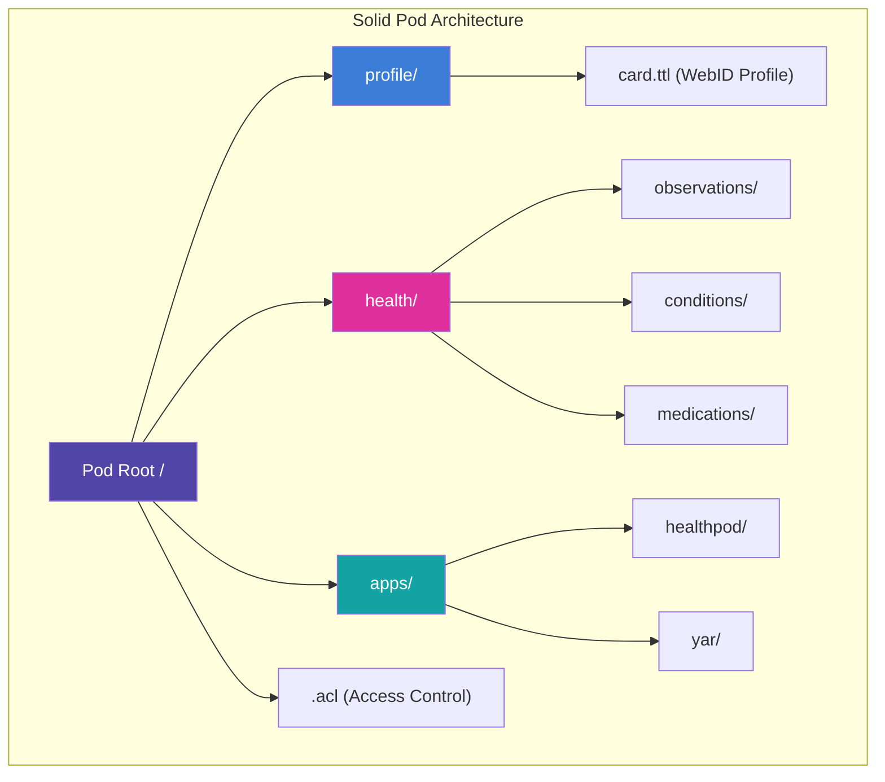
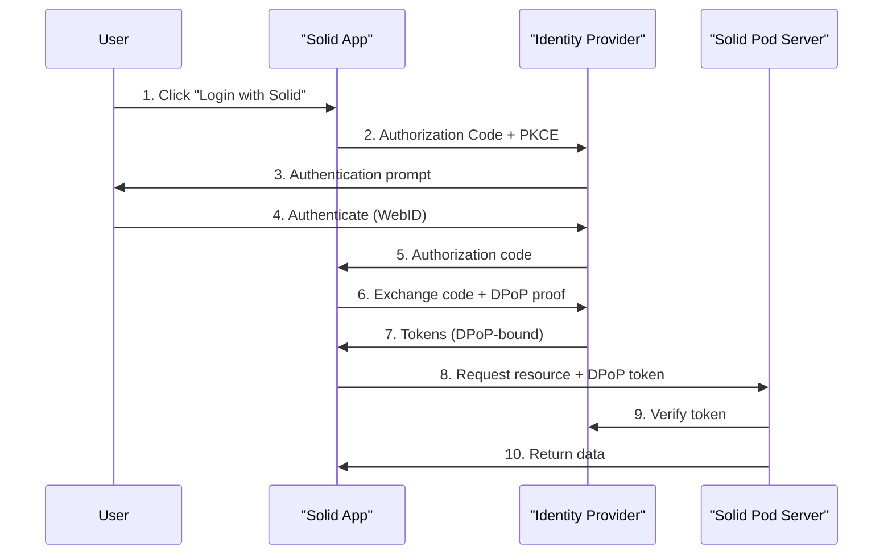
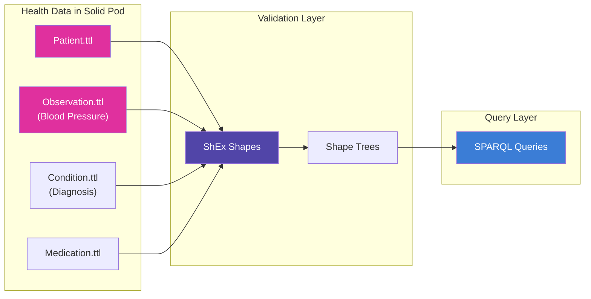
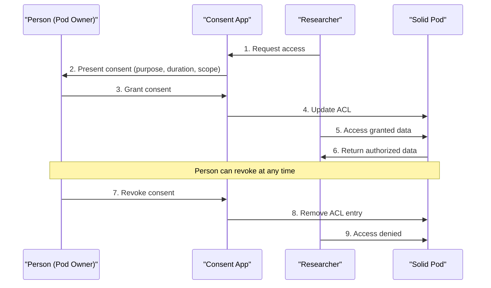
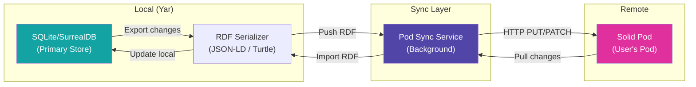
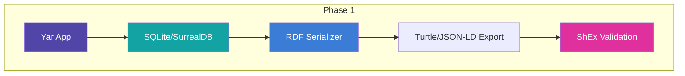
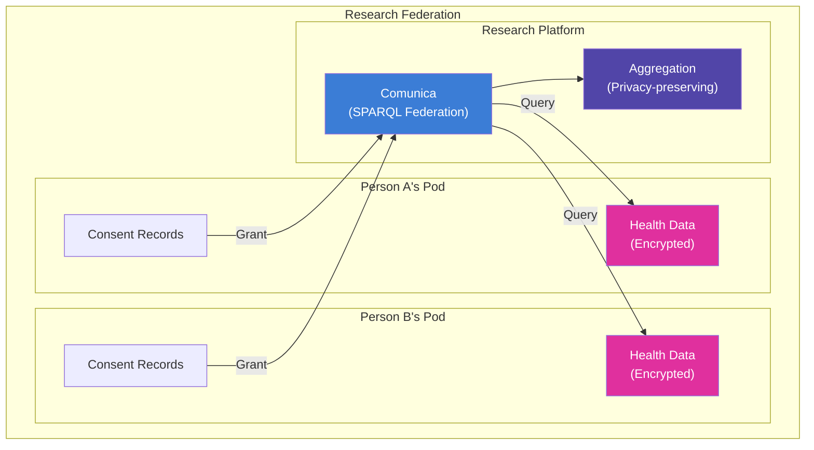
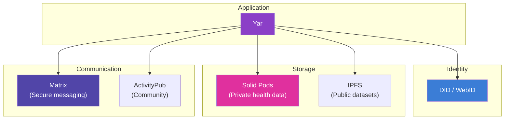

> **Status:** SUPERSEDED · **Archived:** 2026-07-01 · **Superseded by:** `04-Engineering/yar/research/solid-pods-comprehensive.md`
>
> Condensed duplicate; the 04E version is canonical. Kept for provenance; do not edit.

> **Status**: Active
> **Date**: 2026-05-29
> **Author**: \@mohammadi
> **Audience**: engineers
> **Tags**: `yar`, `solid`, `data-sovereignty`, `architecture`

> [!NOTE]
> **TL;DR**: Solid Pods give individuals ownership of their health data using W3C standards. **Community Solid Server (CSS)** is the recommended self-hosted option. Cytognosis should start **local-first** (SQLite with RDF export), then add **Solid pod sync** as a backup/sharing layer, then build **cross-pod federation** for research. The ANU SII "encrypt-before-upload" pattern is the right security model. A 3-phase, 24-month roadmap is defined.
> **Source**: [solid-pods-comprehensive.md](file:///home/mohammadi/Documents/ObsidianVault/02-Products/cytonome-yar/solid-pods-comprehensive.md)

---

## ⚡ Quick Start: What Are Solid Pods?

> [!TIP]
> **Section summary**: Solid Pods are personal data stores where YOU own the data. Apps ask permission to read/write. You can revoke access anytime. It is a W3C community standard led by Tim Berners-Lee.

**Solid** (Social Linked Data) is a W3C Community Group specification that decouples data from applications. You store your data in a **Pod** (Personal Online Data Store). You keep ownership and grant revocable access to apps.

For Cytognosis, Solid aligns directly with our health data sovereignty mission. The protocol's fine-grained access control maps onto our vision of putting individuals in control of their health information.

<details>
<summary>💡 101: What is a Pod?</summary>

A **Pod** is like your own personal cloud drive, but with superpowers. It is a secure web server where you store your data (profile, health records, files). Every Pod has a URL. Apps connect to your Pod instead of storing your data on their own servers. You choose what each app can see and do.

</details>

### Key Findings

| Dimension | Assessment |
|---|---|
| Protocol maturity | Core specs stable; WAC mature, ACP evolving |
| Server readiness | CSS is production-viable for self-hosting |
| Health app ecosystem | Active Flutter-based apps from ANU (HealthPod, VitalStats) |
| FHIR integration | FHIR RDF enables storage in pods; ShEx validates compliance |
| Encryption | On-device encryption before pod storage (server never sees plaintext) |
| Developer tools | Mature JS/TS SDKs (Inrupt, rdflib.js, Comunica); Flutter SDK |
| Risk level | Medium: ecosystem is real but niche |

### 🎯 Recommendation

| Phase | Timeline | Goal |
|---|---|---|
| **Phase 1** | 0-6 months | Local-first (SQLite) + RDF export |
| **Phase 2** | 6-12 months | Add Solid pod sync as backup/sharing layer |
| **Phase 3** | 12-24 months | Cross-pod federation for research |

---

## 🔬 Solid Protocol Deep Dive

> [!TIP]
> **Section summary**: Pods store data as **RDF** (linked data). They use standard HTTP for CRUD operations. Access is controlled by ACL files. Authentication uses **Solid-OIDC** (built on OpenID Connect with extra security).

### Core Architecture



| Component | What It Does |
|---|---|
| **Pod** | Your personal web server with a URL |
| **LDP** | RESTful API for CRUD on resources |
| **Containers** | Folders that organize data hierarchically |
| **RDF Resources** | Data as linked, machine-readable documents |
| **Non-RDF Resources** | Binary files (images, PDFs) |

### Access Control: WAC vs ACP

| Feature | WAC | ACP |
|---|---|---|
| Model | ACL-based (simple) | Policy-based (expressive) |
| Maturity | Mature/stable | Evolving |
| Granularity | Resource-level | Resource + client + issuer |
| Implementation | CSS (open source) | ESS (Inrupt, commercial) |
| **Best for Cytognosis** | Self-hosted CSS deployments | Enterprise/multi-tenant |

> [!IMPORTANT]
> **Start with WAC** (broader support, simpler). Add ACP later only if multi-tenant enterprise features are needed.

### Authentication: Solid-OIDC



<details>
<summary>💡 101: What is DPoP?</summary>

**DPoP** (Demonstration of Proof-of-Possession) binds tokens to a specific cryptographic key on your device. Even if someone steals your access token, they cannot use it because they do not have your device's private key. This is critical in Solid because your app talks to many different servers (pods).

</details>

### Data Validation: Shape Trees + ShEx

| Mechanism | Focus | Scope |
|---|---|---|
| **ShEx** | Validates structure of RDF triples in one resource | "Are these data fields correct?" |
| **Shape Trees** | Validates hierarchy and relationships across resources | "Are these files organized correctly?" |

### Notification Channels

| Channel | Mechanism | Best For |
|---|---|---|
| EventSource | Server-Sent Events (SSE) | Real-time browser updates |
| WebSockets | Persistent bidirectional | Low-latency apps |
| Webhooks | HTTP callbacks | Server-to-server |
| LDN | Linked Data Notifications | Async messaging |
| Fetch API | Polling | Simple clients |

### Technical Reports Index

| Spec | Status | Purpose |
|---|---|---|
| **Solid Protocol** | Core | Foundation for server/client interop |
| **WAC** | Mature | ACL authorization |
| **ACP** | Evolving | Policy authorization |
| **Solid-OIDC** | Stable | Authentication |
| **Notifications** | Active | Real-time changes |
| **Shape Trees** | Draft | Data hierarchy |
| **Type Indexes** | Draft | Data discovery |

---

## 🏗️ Server Implementations

> [!TIP]
> **Section summary**: Use **CSS** (Community Solid Server). It is the only viable open-source option. Deploy via Docker. NSS is dead. ESS is commercial (Inrupt).

### Server Comparison

| Feature | CSS | NSS | ESS |
|---|---|---|---|
| Open source | ✅ MIT | ✅ MIT | ❌ Commercial |
| Maintained | ✅ Active | ❌ Dead | ✅ Active |
| Production-ready | ✅ (with care) | ❌ | ✅ |
| Self-hosting | Easy (Docker) | ❌ | Requires license |
| Access control | WAC | WAC | ACP |
| Scale | Small-medium | N/A | Enterprise (millions) |
| Cost | Free | Free | Paid |

> [!WARNING]
> **Never use NSS** (Node Solid Server). It is unmaintained, has no security patches, and will break with modern Solid apps.

| Decision | Recommendation |
|---|---|
| **Self-hosting** | CSS via Docker |
| **Enterprise scale** | Consider ESS licensing |
| **Development** | CSS with file-system backend |

---

## 🔬 Health Data Architecture

> [!TIP]
> **Section summary**: Store health data as **FHIR RDF** (Turtle format) in Solid pods. Validate with **ShEx** shapes. Encrypt on-device before upload (ANU SII pattern). The pod server never sees plaintext health data.

### FHIR RDF in Solid Pods



### RDF Vocabulary Stack

| Vocabulary | Purpose | Use in Solid |
|---|---|---|
| **FHIR RDF** | Clinical data model | Primary health data format |
| **Schema.org** | Web discovery | Public annotations |
| **SNOMED CT** | Clinical terminology | Diagnosis coding |
| **LOINC** | Lab observation codes | Lab result coding |
| **ICD-10/11** | Disease classification | Condition coding |
| **ShEx** | Validation | FHIR conformance |
| **RML** | Format mapping | Data transformation |

<details>
<summary>💡 101: What is FHIR RDF?</summary>

**FHIR** (Fast Healthcare Interoperability Resources) is the global standard for health data exchange. It defines standard "resources" like Patient, Observation, Condition, and Medication. **RDF** is a format for linked data (machine-readable). **FHIR RDF** combines both: your health records stored as linked data that any FHIR-aware app can read. The key benefit: lossless round-tripping between JSON, XML, and RDF formats.

</details>

### Encryption: Trust No One

| Layer | Mechanism | Provider |
|---|---|---|
| In transit | TLS/HTTPS | Solid server |
| At rest (server) | Filesystem encryption | Server admin |
| At rest (app) | **On-device encryption** | App (e.g., HealthPod) |
| End-to-end | Client-side encryption | App + key management |

> [!IMPORTANT]
> **The ANU SII pattern** (encrypt-before-upload) is the right approach. Data is encrypted on your device before it reaches the pod. The pod server is a "dumb storage layer." Only your device holds the decryption keys. This aligns with Cytognosis's data sovereignty principle.

### Consent Management for Research



| Consent Mechanism | Granularity |
|---|---|
| WAC ACLs | Per-file or per-container |
| ACP Policies | Per-resource with context |
| Access Grants (ESS) | Time-bounded, purpose-specific |
| Consent ontologies | Machine-readable (DPV, GConsent) |

---

## 🏗️ Existing Health Apps

> [!TIP]
> **Section summary**: The ANU Software Innovation Institute in Australia has built a full Flutter-based health app ecosystem on Solid. **HealthPod** is the most relevant: encrypted health data management across all platforms.

### Health App Ecosystem

| App | Purpose | Encryption | Platform |
|---|---|---|---|
| **HealthPod** | Full health data management | ✅ On-device | All platforms |
| **VitalStats** | Blood pressure + weight tracking | Pod-stored RDF | Web |
| **SecureDialog** | Diabetes logging | ✅ On-device | Flutter |
| **MS Fatigue** | Clinical fatigue surveys | ✅ Encrypted | Flutter |
| **InnerPod** | Meditation sessions | Pod-stored | Flutter |

### HealthPod Data Structure

```
/healthpod/
├── profile/card.ttl
├── observations/
│   ├── blood-pressure/2026-05-24.ttl
│   ├── weight/2026-05-24.ttl
│   └── temperature/
├── conditions/active-conditions.ttl
├── medications/current-medications.ttl
├── appointments/history.ttl
├── vaccinations/record.ttl
└── reports/lab-results/
```

### Productivity Apps (Relevant Patterns)

| App | Pattern for Yar |
|---|---|
| **Portable LibreChat** | AI chat history in pods (not central DB) |
| **TodoPod** | Task management with pod storage |
| **DiaryPod** | Personal journal with pod storage |

> [!TIP]
> **LibreChat pattern** is directly relevant to Yar: store AI conversation history in the user's pod instead of a central database. This gives the user full ownership of their AI interactions.

---

## 🔬 Developer SDK Ecosystem

> [!TIP]
> **Section summary**: JavaScript/TypeScript SDKs are mature (Inrupt). Flutter/Dart SDKs exist (ANU SII). For Yar's Python backend, you will need to build custom HTTP clients since there is no production Python SDK.

### JavaScript/TypeScript SDKs

| Library | Purpose | Status |
|---|---|---|
| **@inrupt/solid-client** | High-level CRUD | ✅ Production |
| **@inrupt/solid-client-authn-browser** | Browser auth | ✅ Production |
| **@inrupt/solid-client-authn-node** | Node.js auth | ✅ Production |
| **rdflib.js** | Low-level RDF | ✅ Mature |
| **Comunica** | SPARQL queries | ✅ Research-grade |
| **LDO** | Type-safe Linked Data | ✅ Newer |

### Flutter/Dart SDKs (ANU SII)

| Package | Purpose |
|---|---|
| **solidpod** | Core: auth, CRUD, encryption, key management |
| **solidui** | UI widgets: login screens, permission management |
| **solid-auth** | Solid-OIDC for Flutter |
| **rdflib** | Turtle parsing, triple management |
| **solid-encrypt** | On-device encryption |

---

## 🏗️ Database Integration Patterns

> [!TIP]
> **Section summary**: SQLite or SurrealDB stays as Yar's primary local store. Solid pods are the sync target. The recommended sync pattern: **Export-on-change** (serialize changes to RDF, push to pod). Start with last-write-wins conflict resolution; evolve to CRDTs later.

### Recommended Pattern for Yar



### Sync Strategies

| Strategy | Pros | Cons |
|---|---|---|
| **Export-on-change** ✅ | Simple, predictable | Write amplification |
| Batch sync | Efficient | Stale remote data |
| CRDT-based | Robust offline | Complex implementation |
| Event-sourced | Auditable | Storage overhead |

### SPARQL Querying Options

| Approach | Performance | Best For |
|---|---|---|
| **Comunica** (client-side) | Good for small datasets | Quick queries |
| CSS SPARQL backend | Server-side, scalable | Medium datasets |
| Local triplestore (Oxigraph) | Best | Full SPARQL 1.1 |
| LDflex | Simple queries only | Path traversal |

### Data Tiering

| Tier | Storage | Freshness |
|---|---|---|
| **Hot** | Local SQLite/SurrealDB | Real-time |
| **Warm** | In-memory RDF cache | Minutes |
| **Cold** | Solid Pod | Sync interval |
| **Archive** | Pod + encrypted backup | Batch |

---

## 🏗️ Cytognosis Integration Roadmap

> [!TIP]
> **Section summary**: Three phases over 24 months. Phase 1: local-first with RDF export. Phase 2: add pod sync. Phase 3: cross-pod federation for research.

### Phase 1: Local-First + RDF Export (0-6 months)



| Task | Details |
|---|---|
| Define RDF vocabulary mapping | Map Yar's model to FHIR RDF + Schema.org |
| Implement RDF serializer | Export health data as Turtle/JSON-LD |
| Add ShEx validation | Validate exported RDF against FHIR shapes |
| Prototype pod login | "Login with Solid" using Inrupt JS SDK |
| Evaluate CSS deployment | Test CSS instance via Docker |

### Phase 2: SQLite → Solid Pod Sync (6-12 months)

| Task | Details |
|---|---|
| Deploy CSS production instance | Self-hosted on Cytognosis infrastructure |
| Bidirectional sync | Background service: local DB ↔ Solid pod |
| Consent UI | Grant/revoke access to health data |
| Encrypt-before-upload | ANU SII pattern for on-device encryption |
| Type Index registration | Register Yar data types in pod |

### Phase 3: Pod Federation for Research (12-24 months)



| Task | Details |
|---|---|
| Cross-pod queries | Comunica to query across consented pods |
| Research aggregation | Privacy-preserving insight aggregation |
| Notification subscriptions | WebSocket/Webhook for pod changes |
| External app interop | Other Solid apps read Yar health data |
| Pod-to-pod federation | Direct sharing without central server |

---

## 🔬 Comparison with Alternatives

> [!TIP]
> **Section summary**: Solid vs ActivityPub vs Matrix vs IPFS vs AT Protocol. Solid wins for **private health data** with fine-grained access control. The others serve different purposes and can complement (not replace) Solid.

| Technology | Best For | For Cytognosis |
|---|---|---|
| **Solid** | Private data with access control | ✅ Health data storage |
| **ActivityPub** | Public social content | Community features |
| **Matrix** | Secure messaging | Provider communication |
| **IPFS** | Distributed immutable storage | Dataset distribution |
| **AT Protocol** | Portable social networking | User identity (DIDs) |

### Hybrid Architecture



<details>
<summary>📋 Detailed comparison tables (Solid vs each alternative)</summary>

### Solid vs ActivityPub

| Dimension | Solid | ActivityPub |
|---|---|---|
| Purpose | Data ownership | Social content distribution |
| Data model | RDF (any data) | Activity Streams (social activities) |
| Identity | WebID (self-hosted) | Server-tied accounts |
| Access control | Fine-grained WAC/ACP | Server moderation |
| Ecosystem | Smaller, growing | Large (Mastodon, PeerTube) |

### Solid vs Matrix

| Dimension | Solid | Matrix |
|---|---|---|
| Purpose | Data storage | Secure communication |
| Encryption | Application-layer | End-to-end (Olm/Megolm) |
| Real-time | Notifications Protocol | Native messaging |
| Best for | Health records | Telehealth messaging |

### Solid vs IPFS

| Dimension | Solid | IPFS |
|---|---|---|
| Addressing | URL (location) | CID (content) |
| Access control | WAC/ACP (fine-grained) | None (encryption only) |
| Mutability | Native HTTP CRUD | Requires IPNS |
| Best for | Private controlled data | Public immutable content |

### Solid vs AT Protocol

| Dimension | Solid | AT Protocol |
|---|---|---|
| Identity | WebID (URI) | DID (decentralized) |
| Privacy | Private by default | Public by default |
| Access control | WAC/ACP | None |
| Best for | Private health data | Public social content |

</details>

---

## ⚠️ Risk Assessment

> [!TIP]
> **Section summary**: 8 risks, 2 are HIGH impact (regulatory compliance, user adoption). The biggest mitigation: on-device encryption + abstraction layer so Yar is not tightly coupled to Solid.

| Risk | Likelihood | Impact | Mitigation |
|---|---|---|---|
| Solid ecosystem stagnation | Medium | High | Build abstraction layer; do not couple tightly |
| CSS scalability limits | Medium | Medium | Monitor; plan ESS migration if needed |
| Encryption key management | Medium | High | Proven crypto libraries; key recovery |
| FHIR RDF tooling immaturity | Medium | Medium | Contribute to open-source; build adapters |
| WAC vs ACP fragmentation | Low | Medium | Start with WAC; add ACP later |
| **Regulatory compliance** | **High** | **Very High** | On-device encryption; audit logging; legal review |
| **User adoption of pods** | **High** | **High** | Abstract pod management behind familiar UX |
| Conflict resolution in sync | Medium | Medium | Start last-write-wins; evolve to CRDTs |

### Open Questions

| # | Question |
|---|---|
| 1 | Can Solid pods meet **HIPAA** requirements? Encrypt-before-upload helps, but legal review needed. |
| 2 | What **key recovery** mechanisms are acceptable for health data? |
| 3 | How does CSS perform with **thousands of RDF resources** per pod? |
| 4 | What is the **migration path** if Solid ecosystem stagnates? |
| 5 | How long can a user operate **offline** before sync conflicts are unresolvable? |
| 6 | How to handle **multi-device** concurrent access? |
| 7 | Which other Solid apps can **read Yar's health data**? |
| 8 | What is the **cost of self-hosting** CSS for N thousand users? |

### Technical Debt Watchlist

| Decision | Short-term Benefit | Long-term Risk |
|---|---|---|
| WAC over ACP | Simpler, broader support | May need ACP migration |
| SQLite + pod (dual storage) | Proven local-first performance | Dual storage complexity |
| ANU encryption pattern | Proven in health apps | May diverge from Solid encryption standards |
| Flutter for mobile SDK | Cross-platform, mature | ANU SII package dependency |
| CSS over ESS | Free, open-source | May lack enterprise features |

➡️ **What's Next?** Start Phase 1: define the FHIR RDF vocabulary mapping for Yar's data model, implement the RDF serializer, and prototype "Login with Solid" using CSS via Docker.

---

## 📖 Glossary

<details>
<summary>Expand terminology table</summary>

| Term | Definition |
|---|---|
| **Solid** | Social Linked Data. W3C specification for decentralized data ownership. |
| **Pod** | Personal Online Data Store. A user-controlled server for storing personal data. |
| **WebID** | A URI that uniquely identifies a user in the Solid ecosystem. |
| **WAC** | Web Access Control. ACL-based authorization for Solid resources. |
| **ACP** | Access Control Policy. Policy-based authorization (more expressive than WAC). |
| **Solid-OIDC** | Authentication protocol for Solid, built on OpenID Connect. |
| **DPoP** | Demonstration of Proof-of-Possession. Binds tokens to a specific device key. |
| **CSS** | Community Solid Server. Open-source Solid server implementation (TypeScript). |
| **NSS** | Node Solid Server. Deprecated, unmaintained predecessor to CSS. |
| **ESS** | Enterprise Solid Server. Inrupt's commercial Solid server for large-scale deployments. |
| **RDF** | Resource Description Framework. W3C standard for linked data representation. |
| **Turtle (.ttl)** | A human-readable serialization format for RDF data. |
| **JSON-LD** | JSON for Linking Data. A JSON-based serialization of RDF. |
| **SPARQL** | Query language for RDF data (like SQL for linked data). |
| **FHIR** | Fast Healthcare Interoperability Resources. Global standard for health data exchange. |
| **FHIR RDF** | FHIR resources serialized as RDF triples for linked data compatibility. |
| **ShEx** | Shape Expressions. Language for validating RDF data structure. |
| **Shape Trees** | Specification for organizing RDF resource hierarchies in Solid pods. |
| **LDP** | Linked Data Platform. W3C spec for RESTful linked data operations. |
| **Type Index** | Mechanism for discovering data types stored in a Solid pod. |
| **CRDT** | Conflict-free Replicated Data Type. Data structure for merge-safe distributed sync. |
| **SNOMED CT** | Systematized Nomenclature of Medicine. Clinical terminology standard. |
| **LOINC** | Logical Observation Identifiers Names and Codes. Lab observation standard. |
| **ICD** | International Classification of Diseases. WHO disease classification system. |
| **RML** | RDF Mapping Language. For transforming data between formats. |
| **Comunica** | Client-side SPARQL query engine for querying Solid pod data. |
| **HIPAA** | Health Insurance Portability and Accountability Act. US health data privacy law. |
| **GDPR** | General Data Protection Regulation. EU data privacy regulation. |
| **ANU SII** | Australian National University Software Innovation Institute. Solid health app developers. |
| **PKCE** | Proof Key for Code Exchange. OAuth 2.0 security extension for public clients. |
| **ActivityPub** | W3C standard for federated social networking (Mastodon, PeerTube). |
| **Matrix** | Open standard for secure, decentralized real-time communication. |
| **IPFS** | InterPlanetary File System. Peer-to-peer distributed storage network. |
| **AT Protocol** | Bluesky's protocol for decentralized social networking. |
| **DID** | Decentralized Identifier. A self-sovereign identity mechanism. |

</details>