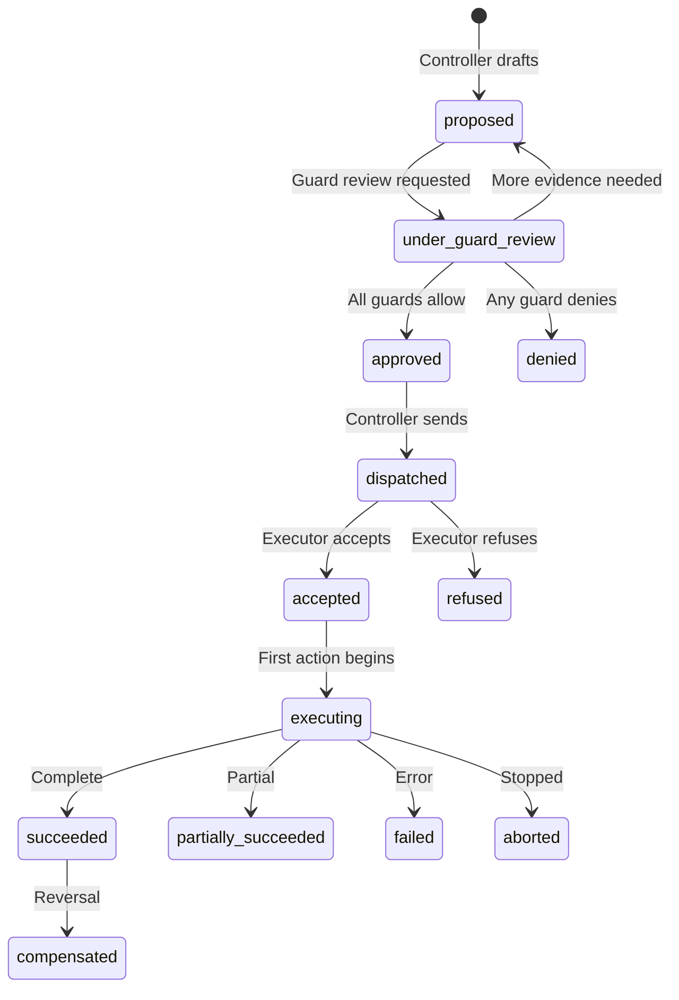
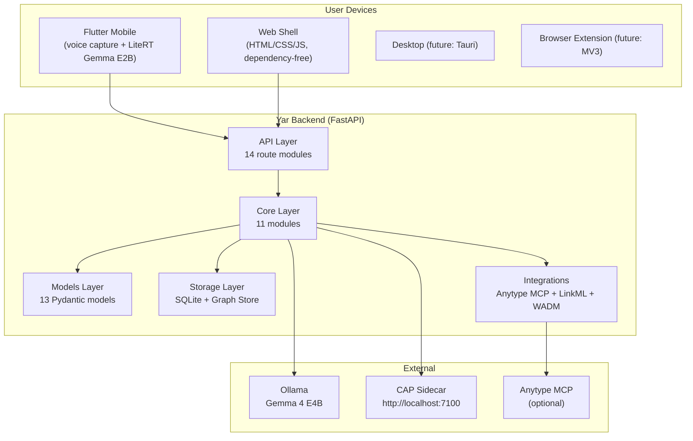
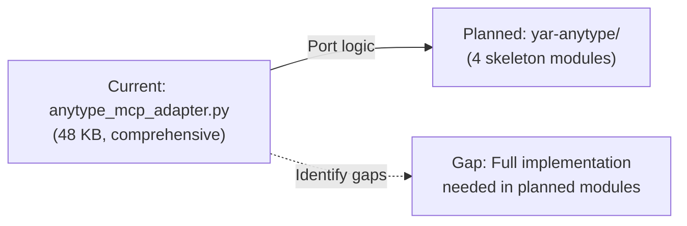
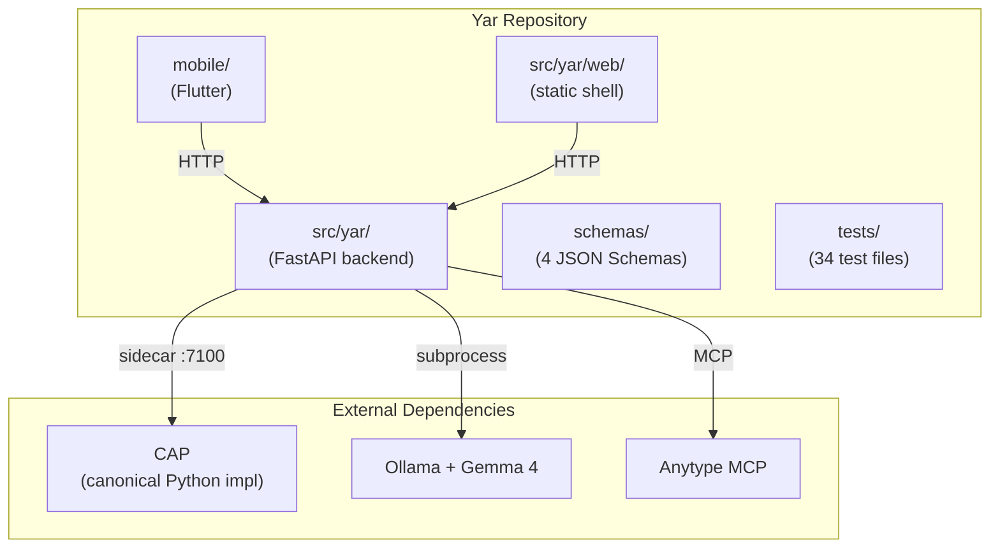

> **Status**: Active
> **Date**: 2026-05-29
> **Author**: \@mohammadi
> **Audience**: engineers
> **Tags**: `cap`, `yar`, `cytoplex`, `reference`

> [!NOTE]
> **TL;DR**: CAP is a transport-independent authority protocol (Controller, Guard, Executor, Observer) that governs what AI agents can do. Yar is a local-first cognitive companion that captures text/voice, routes through Gemma, and stores typed objects in SQLite with CAP-Lite guardrails. Together they form the safety-first backbone of Cytonome.
> **Source**: [cap_yar_comprehensive_reference.md](file:///home/mohammadi/repos/cytognosis/docs/cytonome/yar/research/cap_yar_comprehensive_reference.md)

---

# ⚡ CAP & Yar: Comprehensive Technical Reference

📍 **Breadcrumbs**: Cytonome > Yar > Research > CAP & Yar Reference

---

## Part I: CAP (Cytognosis Authority Protocol)

### 🔬 1. What CAP Is

> [!TIP]
> **Section Summary**: CAP is the "permission contract" between AI components. One side proposes actions; the other verifies and can refuse.

**CAP** is a **transport-independent control layer** for agentic systems. It defines the authority contract between components that form **intent** (Controller) and components that **act on the world** (Executor). It includes Guard decisions, typed refusals, hash-chain audit, and standards-composition.

💡 **101 Sidebar: What does "transport-independent" mean?**

> It means CAP works over any communication method (HTTP, gRPC, etc.). The rules stay the same regardless of how messages travel.

**CAP is NOT**: a transport, tool-calling protocol, policy engine, audit store, workflow runtime, identity system, or general-purpose agent framework. It **composes** with those.

---

### 🏗️ 2. Core Roles

> [!TIP]
> **Section Summary**: Four roles make up every CAP interaction. Think: Proposer, Checker, Doer, Watcher.

| Role | What It Does | Cytognosis Mapping |
|---|---|---|
| **Controller** | Forms intent, issues bounded `Directive` objects | Center Supervisor agent |
| **Guard** | Evaluates policy/safety/privacy, emits `GuardDecision` | Policy evaluator; **deny-wins** semantics |
| **Executor** | Verifies authority, refuses or executes under constraints | Edge Interviewer agent |
| **Observer** | Emits telemetry/provenance from lifecycle events | Local audit log (each side) |

**Key properties**:
- **Asymmetric authority**: Controller proposes, Executor verifies and may refuse
- **Deny-wins**: Any Guard deny blocks the action
- **`allow_with_constraints`** strictly narrows, never expands

---

### 🏗️ 3. Core Primitives (7)

> [!TIP]
> **Section Summary**: Seven message types make up the entire CAP vocabulary.

| # | Primitive | Purpose |
|---|---|---|
| 1 | **Directive** | Bounded authorization request: action, constraints, authority chain, policy refs, expiry, reversibility |
| 2 | **GuardDecision** | Policy decision: `allow`, `deny`, `allow_with_constraints`, `escalate`, `require_more_evidence`, `require_human_review`, `advisory_warning` |
| 3 | **RefusalMessage** | Typed, machine-actionable refusal with **16 reason codes** |
| 4 | **ExecutionReport** | Result with status, evidence produced, side effects |
| 5 | **DecisionRecord** | Audit-safe provenance artifact (NO chain-of-thought or raw evidence) |
| 6 | **EvidenceRef** | Hash-bound, freshness-aware pointer to evidence (not the evidence itself) |
| 7 | **AuthorityChain** | Scoped capability claim binding Controller, Guard, and Executor with temporal + attestation bounds |

🔬 Deep Dive: ExecutionReport Status Values

- `succeeded`
- `partially_succeeded`
- `failed`
- `aborted`
- `compensated`

🔬 Deep Dive: RefusalMessage Reason Codes (16)

`unauthorized`, `expired`, `missing_evidence`, `forbidden_tool`, `policy_denied`, `safety_denied`, and 10 more domain-specific codes.

---

### 🏗️ 4. Directive Lifecycle

> [!TIP]
> **Section Summary**: A Directive moves through a state machine from "proposed" to "succeeded" (or terminal states like "denied" or "refused").

➡️ **What's Next?** Understand the 11 layers that implement this lifecycle.

---

### 🏗️ 5. Architectural Layers (11)

> [!TIP]
> **Section Summary**: CAP has 11 layers, from core message schemas up through crypto, audit, and domain-specific constraints.

| # | Layer | Purpose |
|---|---|---|
| 1 | Core primitives | 7 typed message schemas |
| 2 | Guard semantics | CAP-Lite, CAP-Med, custom profiles via policy-as-data JSON |
| 3 | Transport bindings | gRPC/protobuf reference + HTTP/JSON independent |
| 4 | Crypto verification | mTLS (Ed25519), detached JWS, DSSE, in-toto attestation |
| 5 | Audit & observability | Hash-chain append-only audit + OpenTelemetry |
| 6 | Policy integration | Policy-as-data JSON + optional OPA hook |
| 7 | Evidence linking | W3C PROV-O + SSSOM for domain mappings |
| 8 | Object graph integration | Anytype MCP, SQLite; CAP guards object creation |
| 9 | Domain constraints | CAP-Med (clinical), CAP-Lite (general Yar) |
| 10 | Executor verification | Signature + decision + evidence + authority chain checks |
| 11 | Reporting | ExecutionReport (always emitted), optional supervisor review |

---

### 🔐 6. Transport Bindings

> [!TIP]
> **Section Summary**: Two independent transport implementations prove CAP is truly transport-agnostic.

| Binding | Implementation | Notes |
|---|---|---|
| **gRPC/protobuf** | `reference_grpc/cap.proto` | Bidirectional streaming, runtime mTLS Ed25519 |
| **HTTP/JSON** | `second_http/cap_types.py` | Python stdlib requests, independent (no codegen from gRPC) |

Both pass the same **28 conformance checks**. Both prove CAP semantics are transport-agnostic.

---

### 🔐 7. Cryptographic Stack

| Component | Purpose |
|---|---|
| **Ed25519 mTLS** | Runtime-generated certs per session; both sides authenticate |
| **Detached JWS** | Signs Directives/Reports without modifying body |
| **DSSE** | Tamper-evident envelope wrapping ExecutionReports |
| **in-toto** | Links Directive, GuardDecision, and ExecutionReport as verifiable chain |

---

### ✅ 8. Conformance & Hardening

- **28 conformance checks** per binding (56 total)
- **33 hardening checks**: crypto integrity, adversarial fixtures, redaction, idempotency under stress
- All **PASS** (89/89 total) ✅

---

### 🔬 9. Profiles

| Profile | Scope | What It Blocks |
|---|---|---|
| **CAP-Lite** (Yar default) | General users, cognitive companion | Diagnosis claims, treatment recs, mind-reading, raw data sharing without consent, external writes without confirmation |
| **CAP-Med** (clinical) | Center supervisor in clinical contexts | All CAP-Lite rules + medication, prescription language, non-diagnostic boundary on every question, raw transcript never reaches Center |

---

### 🏗️ 10. Standards Composition

> [!TIP]
> **Section Summary**: CAP composes with (does NOT replace) existing standards.

| Standard | CAP Relationship |
|---|---|
| **MCP** | CAP wraps MCP tool invocations; `Directive.action.target` = `mcp://server/tool` |
| **A2A** | CAP metadata embedded in A2A Task/Message/Part; AgentCard advertises CAP |
| **OPA/Rego/Cedar** | Guard adapter transforms Directive to OPA input to GuardDecision |
| **OpenTelemetry** | `cap.*` semantic conventions for spans |
| **W3C PROV-O** | Maps roles to PROV agents; Directives to Plans; reports to Entities |
| **DSSE/in-toto/SLSA** | Supply-chain attestation for decision chains |

---

### ✅ 11. Implementation Maturity

| Status | Details |
|---|---|
| **Fully implemented** | All primitives + schemas, both transport bindings, crypto stack, hash-chain audit, CAP-Lite + CAP-Med, conformance + hardening suites |
| **Stubs/limited** | Production KMS/HSM, live multi-org interop, latency benchmarks, profiles beyond Lite/Med |
| **External gates** | Third-party security audit, org-specific policy authoring, clinical validity, voice pipeline, mobile runtime binding |

---

## Part II: Yar

### 🔬 1. What Yar Is

> [!TIP]
> **Section Summary**: Yar is a local-first cognitive companion. It captures content, routes it through Gemma, structures into typed objects, applies safety guardrails, and stores locally.

**Yar** is a **local-first cognitive companion** for knowledge capture, built by **neurodivergent minds**. It captures text, voice transcripts, webpages, and messages. It routes through local Gemma via Ollama. It structures them into **typed graph objects**. It applies **CAP-Lite guardrails**. It stores in local **SQLite** (with optional Anytype MCP write).

💡 **101 Sidebar: What is "local-first"?**

> Your data lives on your device first. It works offline. Sync is optional. You own your data, always.

---

### 🏗️ 2. Architecture

---

### 🔬 3. Object Types

| Category | Types |
|---|---|
| **Core MVP (10)** | `Note`, `Task`, `Idea`, `Project`, `Person`, `Paper`, `Webpage`, `Decision`, `Reflection`, `MessageDraft` |
| **Optional Research (8)** | `Author`, `Dataset`, `Code`, `Method`, `Model`, `Annotation`, `Collection`, `Concept` |

---

### 🏗️ 4. Module Inventory

> [!TIP]
> **Section Summary**: Yar's backend has 14 API routes, 11 core modules, 4 integration modules, 13 Pydantic models, and 3 storage modules.

📦 API Routes (14 modules)

| Module | Routes | Purpose |
|---|---|---|
| `routes_health.py` | `GET /health` | Liveness check |
| `routes_capture.py` | `POST /capture` | Raw capture to Gemma routing to typed objects |
| `routes_annotations.py` | `POST /annotations/wadm` | WADM-compatible webpage annotations |
| `routes_objects.py` | `PATCH /objects/{id}` | CRUD for local objects + links |
| `routes_schemas.py` | `POST /schemas/register` | LinkML-like schema registration |
| `routes_anytype.py` | `GET /anytype/status` | Anytype MCP integration |
| `routes_cap.py` | `GET /cap/capabilities` | CAP metadata + audit endpoints |
| `routes_model.py` | `GET /model/status` | Model router introspection |
| `routes_voice.py` | `POST /voice/turn` | Mobile voice capture pipeline |
| `routes_planning.py` | `POST /plan/daily` | Gentle daily planning (no shame/streaks) |
| `routes_communication.py` | `POST /communication/translate` | Communication Translator Lite |
| `routes_persona.py` | Persona endpoints | Persona/tone management |
| `routes_retrieval.py` | `POST /retrieve` | Semantic retrieval with Gemma reranking |
| `routes_export.py` | Export endpoints | JSON/Markdown export |

🧠 Core Modules (11)

| Module | Size | Responsibility |
|---|---|---|
| `cap_lite_guard.py` | 21.6 KB | In-process CAP-Lite guard |
| `model_router.py` | 23.6 KB | Configurable model routing |
| `voice_service.py` | 19 KB | Voice conversation pipeline |
| `coordinator.py` | 9.6 KB | Core capture coordination |
| `proposal_validator.py` | 9.4 KB | Schema-aware object validation |
| `gemma_router_stub.py` | 8.7 KB | Deterministic fallback (tests only) |
| `anytype_write_planner.py` | 8 KB | Two-step write planning with CAP |
| `object_router.py` | 4.4 KB | Object routing abstraction |
| `json_utils.py` | 3 KB | JSON parsing/repair |
| `annotation_service.py` | 2.1 KB | WADM annotation processing |

🔌 Integration Modules (4)

| Module | Size | Responsibility |
|---|---|---|
| `anytype_mcp_adapter.py` | 48 KB | Full Anytype MCP adapter |
| `linkml_loader.py` | 11.5 KB | LinkML-like YAML schema loader |
| `wadm_adapter.py` | 4.6 KB | W3C Web Annotation Data Model adapter |

💾 Storage Modules (3)

| Module | Size | Responsibility |
|---|---|---|
| `sqlite_store.py` | 23.2 KB | Primary SQLite store |
| `graph_store.py` | 1.7 KB | Graph abstraction over SQLite links |

---

### 🏗️ 5. Interface Status

| Interface | Status | Key Capabilities |
|---|---|---|
| **Flutter Mobile** | ✅ Functional MVP | Voice capture, LiteRT Gemma E2B, object review, Anytype writes |
| **Web Shell** | ✅ Functional | Capture, search, Anytype status, safety refusal demo |
| **Desktop (Tauri)** | 🚧 Planned | Rust + web frontend |
| **Browser Extension** | 🚧 Planned | MV3 Chrome/Firefox |

---

### 🏗️ 6. Anytype Integration

> [!TIP]
> **Section Summary**: The current 48 KB adapter is comprehensive but the planned refactored submodule is still skeleton code.

| Feature | Current Adapter | Planned Submodule | Gap |
|---|---|---|---|
| MCP client init | ✅ | ❌ Skeleton | Full implementation needed |
| Tool discovery | ✅ Dynamic | ❌ Skeleton | Port discovery logic |
| Search | ✅ | ❌ Skeleton | Port search logic |
| Write planning | ✅ Two-step | ❌ Skeleton | Port planning logic |
| Write execution | ✅ Guarded | ❌ Skeleton | Port execution logic |
| Schema bridge | ✅ Deterministic | ⚠️ Stub map | Full LinkML to Anytype conversion |
| Connection pooling | ❌ | ❌ | New feature needed |
| Bulk operations | ❌ | ❌ | New feature needed |

---

### ✅ 7. Test Coverage

**34 test files** covering: health, capture flow, guard refusals, schema validation, Anytype adapter (6 files), CAP Lite guard (2 files), model router, voice routes, communication, graph store, JSON utils, logging, MVP end-to-end, planning, proposal validator, schema registry, web shell, link routes, annotation capture, export/retrieval.

---

## Part III: Cross-System Dependency Map

---

## Part IV: Key Architectural Decisions

| Decision | Rationale |
|---|---|
| CAP as separate product | CAP is a protocol standard; cyto-skills is a skill runtime. Mixing conflates concerns. |
| CAP as HTTP sidecar | Proves transport independence; CAP can be ported to TS/Rust without changing Yar |
| SQLite as default storage | Local-first; no server setup; people should not have to configure databases to think |
| Anytype as optional | Users choose their own graph system; Yar works without it |
| Gemma on-device via LiteRT | Privacy (no cloud); users deserve local control of their own data |
| Two-step Anytype writes | CAP-Lite requires explicit user confirmation before external mutations |
| Gentle planning language | No streaks, guilt, shame, or punishment framing; **evidence-based for ADHD** |

---

## 📖 Glossary

Expand terminology table

| Term | Definition |
|---|---|
| **CAP** | Cytognosis Authority Protocol. The safety/authority layer governing what AI agents can and cannot do. |
| **Directive** | A bounded authorization request from a Controller to an Executor. |
| **Guard** | A policy evaluator that checks whether a Directive should be allowed. |
| **GuardDecision** | The output of a Guard check: allow, deny, or allow with constraints. |
| **RefusalMessage** | A typed, machine-readable message explaining why an Executor refused a Directive. |
| **ExecutionReport** | The result of executing a Directive, including status and evidence. |
| **AuthorityChain** | A chain of trust linking Controller to Guard to Executor. |
| **CAP-Lite** | The default safety profile for Yar. Blocks diagnosis claims, treatment recommendations, and raw data sharing. |
| **CAP-Med** | A stricter clinical profile. Adds restrictions on medication language and transcript exposure. |
| **mTLS** | Mutual TLS. Both sides of a connection authenticate each other using certificates. |
| **DSSE** | Dead Simple Signing Envelope. A tamper-evident wrapper for signed data. |
| **in-toto** | A framework for verifying the integrity of software supply chains. |
| **MCP** | Model Context Protocol. A standard for AI tool invocation. |
| **A2A** | Agent-to-Agent protocol for multi-agent communication. |
| **OPA** | Open Policy Agent. An external policy engine that CAP can integrate with. |
| **Yar** | The local-first cognitive companion application. |
| **LiteRT** | Google's on-device ML runtime (formerly TensorFlow Lite). |
| **Gemma** | Google's open-weight language model family. |
| **LinkML** | Linked Data Modeling Language for defining data schemas. |
| **WADM** | W3C Web Annotation Data Model. |
| **Anytype** | A local-first, open-source knowledge management tool with graph-based storage. |
| **FastAPI** | A modern Python web framework for building APIs. |
| **Pydantic** | Python data validation library using type annotations. |
| **SQLite** | A lightweight, file-based relational database. |

