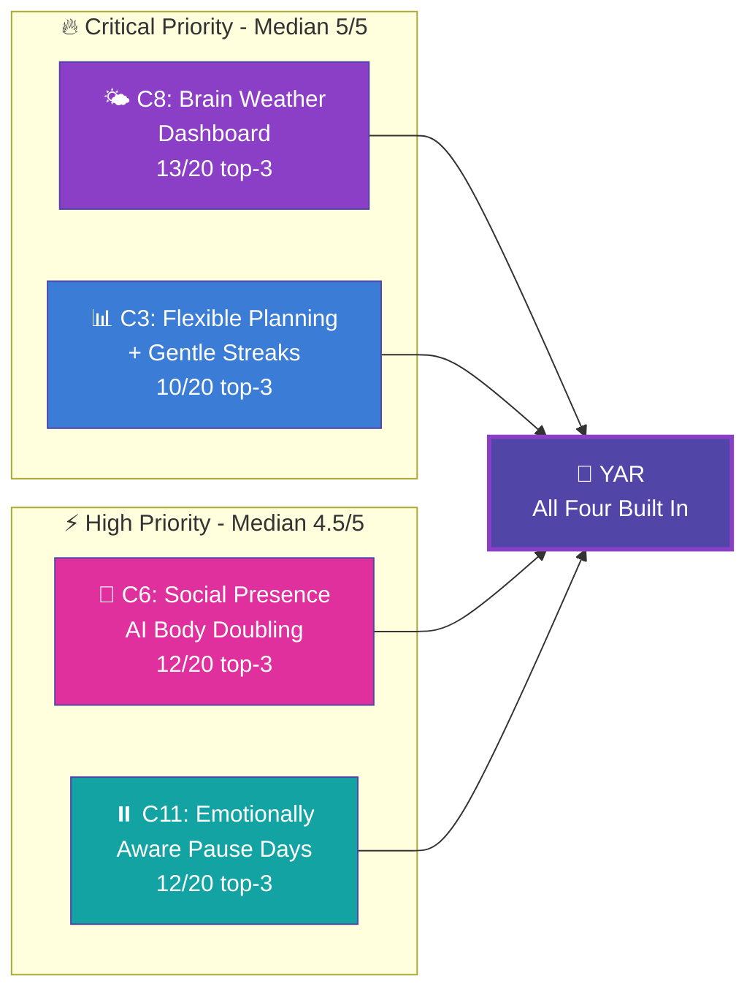
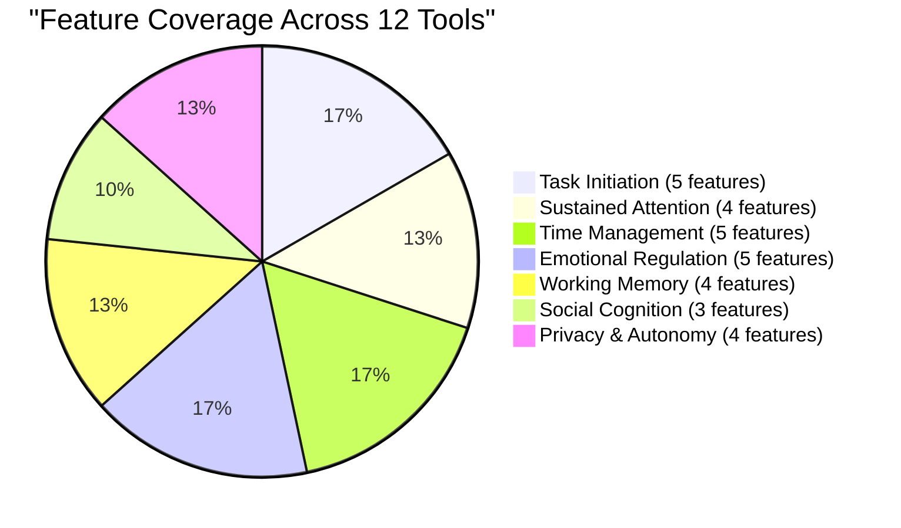
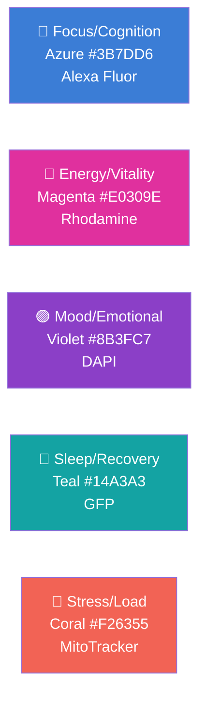
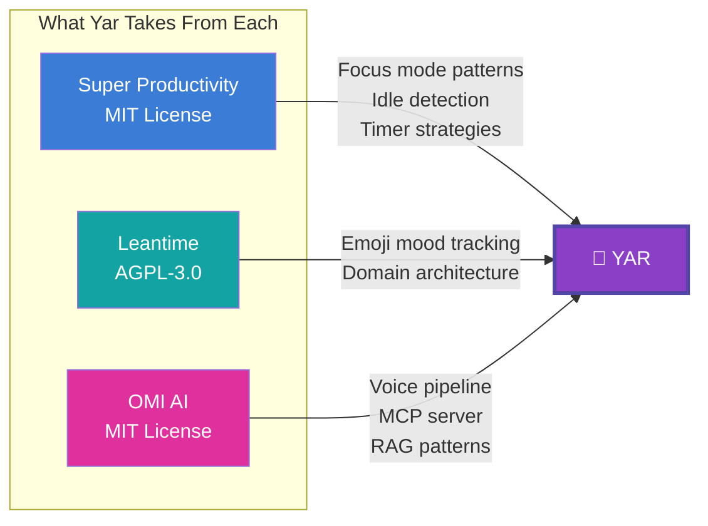

> **Status**: Active
> **Date**: 2026-05-31
> **Author**: \@mohammadi
> **Audience**: engineers, stakeholders
> **Tags**: `yar`, `features`, `comparison`, `competitive`

# 🧠 Yar v3 Tool Comparison: The ADHD-Friendly Version (12 Tools)

> [!NOTE]
> **TL;DR**: We compared 12 productivity tools (up from 9 in v2) to map Yar's feature roadmap. Three new tools added: OMI AI (voice-first wearable), Letterly (brain dump to text), and Blue Lin (design inspiration). An ADHD research paper (Chen et al. 2026) validates four critical features NO existing tool has: Brain Weather Dashboard, Social Presence AI, Dual-Track Planning, and Emotionally Aware Pause Days. Yar scores 107/120, the nearest competitor scores 86.
> **Source**: [[yar-unified-feature-comparison-v3]]

---

## 📊 What Changed from v2 to v3?

> [!TIP]
> **Section summary:** Three new tools added, 13 ADHD paper concepts integrated, three codebases analyzed at source level. The comparison jumped from 9 to 12 tools and now has academic validation for Yar's most ambitious features.

### Three New Tools

| Tool | What It Is | Score | Why It Matters for Yar |
|:---|:---|:---:|:---|
| 🎙️ **OMI AI** | Voice-first AI wearable (pendant, $89) | 70/120 | MIT-licensed full-stack reference for voice AI. MCP server, plugin marketplace, 12.6k GitHub stars |
| ✍️ **Letterly** | AI voice-to-text brain dump tool | 41/120 | 25+ AI rewrite styles, "speak messy, get clean" workflow. $200K+ MRR proves commercial viability |
| 🎨 **Blue Lin** | Design research (not scored) | N/A | Menstrual health tracking UX that transfers directly to cognitive state tracking. Sensemaking over prediction |

### ADHD Paper Integration (Chen et al. 2026)

20 ADHD-identifying adults speed-dated 13 AI concepts. The top four are features NO existing tool has:



<details>
<summary>📋 Full 13-Concept Ranking Table</summary>

| Concept | Median Rating | Top-3 Count | Yar Priority |
|:---|:---:|:---:|:---|
| **C8: Brain Weather Dashboard** | 5 | 13 | 🔴 Critical |
| **C3: Flexible Planning + Gentle Streaks** | 5 | 10 | 🔴 Critical |
| **C6: Social Presence AI** | 4.5 | 12 | 🔴 Critical |
| **C11: Emotionally Aware Pause Days** | 4.5 | 12 | 🟡 High |
| C2: Mood-Aware Daily Companion | 3 | 0 | 🟡 High |
| C5: Shared Planning with Trusted Person | 3 | 4 | 🟠 Medium |
| C10: Pattern-Based Gentle Nudges | 3 | 0 | 🟠 Medium |
| C12: Emotional Debrief After Collapse | 3 | 3 | 🟠 Medium |
| C13: Weekly Narrative Reflection | 3 | 0 | 🟠 Medium |
| C1: Private Emotional Notes | 3 | 2 | 🔵 Low |
| C9: Adaptive Planning Undo | 2.5 | 1 | 🟠 Medium |
| C4: Emotional Inventory Before Commitments | 2 | 0 | 🔵 Low |
| C7: Ambient Transition Cues | 2 | 1 | 🔵 Low |

</details>

### Codebase Analysis Added

Open-source codebases indexed via zoekt (383 MB index, 11,467 files):

| Codebase | Stack | Key Finding |
|:---|:---|:---|
| **Super Productivity** | Angular 18 + NgRx, 45+ modules | Most mature focus mode: `FocusModeStrategy` with Pomodoro/flowtime/countdown |
| **Leantime** | PHP + MySQL, hexagonal, 57 modules | Unique emoji task mood tracking, LEO AI proactive agent |
| **OMI** | Python (FastAPI) + Flutter + C | Production MCP server, Silero VAD pipeline, Pinecone RAG |

---

## ⚡ Master Feature Matrix (12 Tools)

> [!TIP]
> **Section summary:** Scores use 0-10 scale. Yar targets 107/120 total. Super Productivity leads at 86, OMI AI enters at 70. Letterly is the narrowest tool at 41. No existing tool exceeds 72% of Yar's target.

| Category | Lean | Super | Tana | Cap | Goblin | Saner | Speech | MCP | Any | OMI | Letter | **Yar** |
|:---|:---:|:---:|:---:|:---:|:---:|:---:|:---:|:---:|:---:|:---:|:---:|:---:|
| 📋 Task Mgmt | 8 | **9** | 6 | 5 | 5 | 7 | 0 | 2 | 4 | 3 | 1 | **9** |
| ⏰ Time Mgmt | 5 | **10** | 2 | 3 | 4 | 3 | 0 | 0 | 1 | 1 | 0 | **9** |
| 📚 Knowledge | 6 | 3 | **10** | 8 | 2 | 8 | 3 | 8 | 8 | 7 | 3 | **9** |
| 🤖 AI | 7 | 2 | 8 | 6 | **9** | **9** | 7 | 6 | 2 | **9** | 7 | **10** |
| 🧠 ND Features | 7 | 8 | 5 | 5 | **10** | 6 | 7 | 4 | 3 | 5 | 4 | **10** |
| 🤝 Collab | **7** | 2 | **7** | 3 | 0 | 3 | 2 | 0 | 4 | 2 | 0 | **5** |
| 🔌 Integrations | 6 | **9** | 5 | 5 | 1 | 7 | 4 | 8 | 3 | 8 | 5 | **8** |
| 🔓 Open Source | 9 | **10** | 0 | 0 | 0 | 0 | 0 | **10** | 9 | **10** | 0 | **10** |
| ♿ Accessibility | 6 | 7 | 5 | 6 | 8 | 5 | **9** | 3 | 4 | 4 | 5 | **9** |
| 📱 Mobile | 6 | 8 | 5 | 7 | 7 | 6 | **9** | 0 | 6 | 8 | 8 | **9** |
| 💰 Cost | 8 | **10** | 5 | 6 | **10** | 5 | 3 | **10** | 9 | 7 | 5 | **10** |
| 📤 Data Port | 6 | **8** | 3 | 4 | 1 | 4 | 2 | 7 | **8** | 6 | 3 | **9** |
| **TOTAL** | **81** | **86** | **61** | **58** | **57** | **63** | **46** | **58** | **61** | **70** | **41** | **107** |

> [!IMPORTANT]
> **The scoring gap is real**: Yar targets 107/120. The closest competitor (Super Productivity) hits 86. That 21-point gap exists because no tool combines voice capture + task execution + emotional awareness + knowledge management + local-first AI. That gap IS Yar's reason to exist.

---

## 🏆 Category Winners

> [!TIP]
> **Section summary:** OMI AI joins as co-winner in AI Integration and Open Source categories. Voice-first tools (OMI, Letterly) are strong on mobile but add zero to time management, collaboration, or emotional regulation.

| Category | Winner(s) | Score | v3 Challenger |
|:---|:---|:---:|:---|
| 📋 Task Management | Super Productivity | 9/10 | OMI captures items (3) but doesn't track them |
| ⏰ Time Management | Super Productivity | 10/10 | No new challenger |
| 📚 Knowledge Management | Tana | 10/10 | OMI memory system (7) is strong but untyped |
| 🤖 AI Integration | **OMI AI** + Goblin + Saner | **9/10** | **OMI ties #1** with multi-model RAG + MCP |
| 🧠 ND-Specific Features | Goblin Tools | 10/10 | OMI ADHD plugin (5) adds capture-side support |
| 🤝 Collaboration | Leantime + Tana | 7/10 | No change |
| 🔌 Integration Ecosystem | Super Productivity | 9/10 | OMI (8) ties via 2,000+ Zapier + MCP |
| 🔓 Open Source | **OMI AI** + Super Prod + MCP | **10/10** | **OMI joins at 10/10** (MIT full-stack) |
| ♿ Accessibility | Speechify | 9/10 | No change |
| 📱 Mobile Support | Speechify | 9/10 | OMI (8) and Letterly (8) are mobile-first |
| 💰 Best Value | Super Prod + Goblin + MCP | 10/10 | OMI self-hosting (7) is competitive |
| 📤 Data Portability | Super Productivity + Anytype | 8/10 | No change |

---

## 🗺️ Comparative Landscape (6 Clusters)

> [!TIP]
> **Section summary:** The market splits into six clusters. V3 adds Cluster F (Voice-First Capture). The critical insight: every cluster excels at one thing and misses others. Only Yar spans all six.

```mermaid
graph TB
    subgraph "Cluster A: Task Execution"
        A1["📋 Super Productivity<br/>86/120"]
        A2["📋 Leantime<br/>81/120"]
    end
    subgraph "Cluster B: Knowledge"
        B1["📚 Tana<br/>61/120"]
        B2["📚 Capacities<br/>58/120"]
        B3["📚 Anytype<br/>61/120"]
    end
    subgraph "Cluster C: AI Assistants"
        C1["🤖 Goblin Tools<br/>57/120"]
        C2["🤖 Saner AI<br/>63/120"]
    end
    subgraph "Cluster D: Accessibility"
        D1["♿ Speechify<br/>46/120"]
    end
    subgraph "Cluster E: Infrastructure"
        E1["🔧 MCP Pattern<br/>58/120"]
    end
    subgraph "Cluster F: Voice-First (NEW)"
        F1["🎙️ OMI AI<br/>70/120"]
        F2["✍️ Letterly<br/>41/120"]
    end

    A1 --> YAR["🧩 YAR<br/>107/120<br/>All 6 Clusters"]
    A2 --> YAR
    B1 --> YAR
    B3 --> YAR
    C1 --> YAR
    C2 --> YAR
    D1 --> YAR
    E1 --> YAR
    F1 --> YAR
    F2 --> YAR

    style A1 fill:#3B7DD6,color:#fff
    style A2 fill:#3B7DD6,color:#fff
    style B1 fill:#8B3FC7,color:#fff
    style B2 fill:#8B3FC7,color:#fff
    style B3 fill:#8B3FC7,color:#fff
    style C1 fill:#E0309E,color:#fff
    style C2 fill:#E0309E,color:#fff
    style D1 fill:#14A3A3,color:#fff
    style E1 fill:#F26355,color:#fff
    style F1 fill:#5145A8,color:#fff
    style F2 fill:#5145A8,color:#fff
    style YAR fill:#8B3FC7,color:#fff,stroke:#E0309E,stroke-width:4px
```



<details>
<summary>🔍 Cluster Details (Tap to Expand)</summary>

### Cluster A: Task-Focused Execution Engines
**Super Productivity** (86) and **Leantime** (81)

Both center on getting tasks done. Super Productivity leads with Pomodoro timers, idle detection, focus mode, and keyboard-first interface. Codebase analysis reveals a `FocusModeStrategy` pattern supporting three distinct focus strategies (Pomodoro, flowtime, countdown). Leantime targets teams with Kanban, Gantt, and sprint management. Its hexagonal architecture with 57 domain modules shows how to build enterprise PM that respects ADHD users through emoji mood tracking and LEO AI.

### Cluster B: Knowledge-Focused Organizers
**Tana** (61), **Capacities** (58), and **Anytype** (61)

Tana's Supertag system is the most sophisticated personal knowledge graph. Capacities offers cleaner "thinking in things" UX. Anytype combines local-first data sovereignty with E2E encryption, making it Yar's planned storage backend. Blue Lin's research validates progressive disclosure (summary → detail → raw data → comparison) as the most effective visualization pattern.

### Cluster C: AI-Augmented Assistants
**Goblin Tools** (57) and **Saner AI** (63)

Goblin Tools' spiciness slider is a genuinely novel UX invention, validated by Chen et al. as addressing task initiation paralysis. Saner AI's Skai agent proactively extracts tasks from email, calendar, and notes.

### Cluster D: Accessibility-First Utilities
**Speechify** (46)

Transforms reading into listening via dual-channel input. Letterly is its conceptual opposite: Speechify converts text → speech, Letterly converts speech → text. Together they form the bidirectional voice pipeline Yar unifies.

### Cluster E: Composable Infrastructure
**MCP Pattern** (58) and **Anytype** (61)

Protocol-first, maximum data sovereignty. OMI's MCP server provides a production reference for exposing cognitive data to external AI assistants.

### Cluster F: Voice-First Capture Tools (NEW)
**OMI AI** (70) and **Letterly** (41)

Voice-first interaction eliminates the "activation energy" barrier that defines ADHD friction. OMI captures continuously via pendant ($89); Letterly records on-demand via phone mic. Both apply AI to structure raw speech.

> [!WARNING]
> **The capture gap**: Both tools capture beautifully but do nothing with captured information. OMI extracts action items as static text (no task tracking). Letterly generates formatted output (no task, no knowledge graph). Neither helps users execute, manage time, or regulate emotions. Yar closes this gap.

</details>

---

## 🧬 ADHD Paper-Validated Features

> [!TIP]
> **Section summary:** Chen et al. (2026) surfaced 39 validated features grouped by executive function. This section maps each to the best existing tool, revealing massive gaps in emotional regulation and social cognition that only Yar addresses.

### By Executive Function



### 🚀 Task Initiation (Overcoming Paralysis)

| Feature | Paper Evidence | Best Tool Today | → Yar |
|:---|:---|:---|:---:|
| Voice-first capture | DI1, P17 quote | **OMI AI** (9) | 10 |
| Spiciness slider (task decomposition) | C3 (M=5), paralysis | **Goblin Tools** (10) | 10 |
| Social Presence AI (body doubling) | C6 (M=4.5), 12/20 top-3 | ❌ None (0) | 10 |
| Auto task extraction from captures | P9 quote | **Saner AI** (7) | 9 |
| Mood-Aware Daily Companion | C2, DI1 + DI3 | **Saner AI** (5) | 9 |

### 🎯 Sustained Attention (Focus/Hyperfocus)

| Feature | Paper Evidence | Best Tool Today | → Yar |
|:---|:---|:---|:---:|
| Focus companion mode | C6 (M=4.5) | ❌ None (0) | 10 |
| Break reminders during hyperfocus | P13 quote | **Super Productivity** (10) | 9 |
| Idle detection with graceful pause | Time perception disorders | **Super Productivity** (10) | 9 |
| PiP Focus Window | Distraction management | **Saner AI** (6) | 8 |

### ⏰ Time Management (Time Blindness)

| Feature | Paper Evidence | Best Tool Today | → Yar |
|:---|:---|:---|:---:|
| Dual-track planning (ideal/baseline) | C3 (M=5, highest rated) | ❌ None (0) | 10 |
| Time estimation for tasks | P5 quote | **Goblin Tools** (7) | 9 |
| Rhythm-based scheduling | DI2, planning anxiety | ❌ None (0) | 9 |
| Gentle streaks (no resets on skip days) | C3 (M=5), DI4 | ❌ None (0) | 10 |
| Proactive daily planning | C2, morning brief | **Saner AI** (7) | 9 |

### 💜 Emotional Regulation (Preventing Shame Spirals)

> [!IMPORTANT]
> **This is where the market fails hardest.** Of 5 validated emotional regulation features, only 1 exists in any tool (emoji mood tracking in Leantime). Brain Weather, Pause Days, Emotional Aftercare, and Replay Loop Interruption are all Yar-only innovations backed by the highest-rated concepts in the ADHD paper.

| Feature | Paper Evidence | Best Tool Today | → Yar |
|:---|:---|:---|:---:|
| Brain Weather Dashboard | C8 (M=5, **13/20 top-3, HIGHEST**) | ❌ None (0) | 10 |
| Emotionally Aware Pause Days | C11 (M=4.5, 12/20 top-3) | ❌ None (0) | 9 |
| Emotional aftercare | C12, replay loop interruption | ❌ None (0) | 9 |
| Emoji mood tracking on tasks | DI3, Leantime pattern | **Leantime** (7) | 8 |
| Replay loop interruption | P17, self-blame | ❌ None (0) | 8 |

### 🧠 Working Memory (Externalized Cognition)

| Feature | Paper Evidence | Best Tool Today | → Yar |
|:---|:---|:---|:---:|
| Brain dump compiler | P11 quote | **Goblin Tools** + **Letterly** (8) | 10 |
| Semantic retrieval | P11, scaffolded memory | **OMI AI** (7) | 9 |
| Smart note types / supertags | Typed object routing | **Tana** (10) | 9 |
| Browser-aware contextual capture | Capture where cognition happens | ❌ None (0) | 8 |

### 💬 Social Cognition (Communication)

| Feature | Paper Evidence | Best Tool Today | → Yar |
|:---|:---|:---|:---:|
| Communication Translation (ND↔NT) | P6, social misrecognition | ❌ None (0) | 10 |
| Tone analysis | P10, internalized inadequacy | **Goblin Tools** Judge (8) | 9 |
| Persistent relational context | DI5, unequal scaffolding | ❌ None (0) | 8 |

### 🔒 Privacy and Autonomy

| Feature | Paper Evidence | Best Tool Today | → Yar |
|:---|:---|:---|:---:|
| On-device AI (local-first inference) | Section 7.3, no surveillance | **Anytype** storage (9) | 10 |
| CAP safety guardrails | Autonomy vs. guidance tension | ❌ None (0) | 10 |
| User-controlled nudge configuration | Speed-dating findings | **Super Productivity** (5) | 9 |
| Open-source availability | Cytognosis mission | **OMI AI** + **Super Prod** (10) | 10 |

---

## 🎨 Blue Lin Design Principles → Yar

> [!TIP]
> **Section summary:** Blue Lin's research at Columbia/Toronto on menstrual health tracking UX transfers directly to cognitive state tracking. Five principles, five functional requirements, and a visualization technique catalog all inform Yar's Brain Weather Dashboard design.

### Five Design Principles

| # | Principle | Blue Lin (Menstrual) | Yar (Cognitive) |
|:---|:---|:---|:---|
| 1 | **Sensemaking over prediction** | Understand cycle patterns, not just predict dates | Understand cognitive patterns, not just schedule tasks |
| 2 | **User agency as primary goal** | Users control what signals to view | Yar illuminates patterns; users decide what to do |
| 3 | **Multimodal without overwhelm** | Summary → detail → raw data | "How am I doing?" card → signal groups → raw data |
| 4 | **Longitudinal context** | Multi-cycle overlay reveals patterns | Multi-week overlay reveals cognitive signature |
| 5 | **Inclusive design** | Gender-inclusive menstrual tracking | Neurotype-neutral cognitive tracking |

### Five Functional Design Requirements

| DR# | Lin Requirement | Yar Equivalent |
|:---|:---|:---|
| DR1 | Communicate predicted phases + variance | Predicted cognitive states with confidence ranges |
| DR2 | Support different interaction patterns | Daily check-ins, weekly summaries, on-demand deep-dives, crisis-only modes |
| DR3 | Personalize viewable signals | User chooses which cognitive signals to track |
| DR4 | Integrate educational resources | Explain neuroscience behind observed patterns |
| DR5 | Side-by-side comparison with context | Compare weeks/months with contextual annotations |

### Cognitive Signal Color Mapping (Cytognosis Brand)



<details>
<summary>📊 Visualization Technique Catalog</summary>

| Technique | Data Type | Yar Application |
|:---|:---|:---|
| Phase-coded timeline | Temporal + categorical | Color-code daily timeline by cognitive state (focus/transition/rest/recovery) |
| Multi-cycle overlay | Longitudinal temporal | Overlay weekly focus scores aligned by day-of-week |
| Progressive disclosure dashboard | Summary → detail | Composite state card → signal groups → raw data |
| Signal heatmap | Multivariate temporal | Week-by-hour heatmap of focus/energy levels |
| Contextual annotation overlay | Event + temporal | Life event markers visible across all views |
| Empathetic data framing | Tone/language | "Your focus was lower today" not "You had a bad day" |

</details>

---

## 🗺️ Yar Feature Adoption Roadmap

> [!TIP]
> **Section summary:** Features organized into three tiers. Priority 1 (Build Now) combines the highest-rated ADHD paper concepts with the most reusable open-source patterns. Priority 3 features are Yar-only innovations with no existing reference implementation.

### 🔴 Priority 1: Build Now

| Feature | Inspired By | Paper Validation | Codebase Reference |
|:---|:---|:---|:---|
| 🌶️ Spiciness slider | Goblin Tools | C3 (M=5), paralysis | N/A (proprietary) |
| 🎙️ Zero-friction voice capture | OMI AI | DI1, P17 | `omi/firmware/` + `omi/app/` (MIT) |
| 🧹 Brain dump compiler | Goblin + Letterly | Externalized cognition | Letterly (proprietary) |
| 🔎 Auto task extraction | Saner AI + OMI | Over-reliance concern (P9) | `omi/backend/` (MIT) |
| 🧠 Brain Weather Dashboard | ADHD paper C8 | M=5, **13/20 top-3** | N/A (novel) |
| 👤 Social Presence AI | ADHD paper C6 | M=4.5, 12/20 top-3 | N/A (novel, Rive persona) |
| 📊 Dual-track planning | ADHD paper C3 | M=5, 10/20 top-3 | N/A (novel) |
| 😊 Emoji mood on tasks | Leantime | DI3, mood-adaptive | `leantime/domain/Reactions/` |
| 🏷️ Smart note types | Tana | Typed object routing | N/A (proprietary) |
| 🔎 Live search queries | Tana | Queries as first-class | N/A (proprietary) |

### 🟡 Priority 2: Build Next

| Feature | Inspired By | Paper Validation | Codebase Reference |
|:---|:---|:---|:---|
| 🎯 Focus mode | Super Productivity | DI5, co-regulation | `super-productivity/features/focus-mode/` |
| ⏸️ Idle detection | Super Productivity | Time perception (P5) | `super-productivity/features/idle/` |
| ☕ Break reminders | Super Productivity | Hyperfocus exhaustion (P13) | `super-productivity/features/take-a-break/` |
| 🗣️ TTS with highlighting | Speechify | DI4, engagement modes | Speechify (proprietary) |
| 📋 "Plan my day" | Saner AI | C2, Mood-Aware Companion | N/A |
| 🎭 Tone analysis | Goblin Tools Judge | P6, P10 social misrecognition | N/A |
| 📌 PiP Focus window | Saner AI | Distraction management | N/A |
| ⏸️ Emotionally Aware Pause Days | ADHD paper C11 | M=4.5, 12/20 top-3 | N/A (novel) |
| 🔌 MCP server exposure | OMI AI | MCP architecture | `omi/mcp/` (MIT) |

### 🟢 Priority 3: Yar-Only Features (No Existing Reference)

| Feature | What Makes It Special | Research Validation |
|:---|:---|:---|
| 🎤 Voice-first emotional awareness | Vocal biomarkers (HuBERT, openSMILE) detect how you feel from prosody | DI3 + C8: mood-adaptive feeds Brain Weather |
| 🛡️ CAP safety gate | Controller-Authority Protocol prevents AI from being harmful | Autonomy vs. guidance tension (Chen et al.) |
| 🏠 Local-first AI brain | On-device Gemma inference, data never leaves | Section 7.3: participants prefer non-surveillance AI |
| 🧩 Unified ND companion | Task + time + knowledge + emotion + AI in ONE app | "The Big Gap" validated by 12-tool comparison |
| 🌤️ Brain Weather with vocal biomarkers | Weather metaphors + voice prosody analysis | C8 (M=5, highest rated in ADHD paper) |
| 💬 Communication Translation (ND↔NT) | Bidirectional translation preserving intent across neurotypes | P6, P10, DI4 |
| 📊 Progressive disclosure dashboard | Blue Lin visualization patterns for multimodal cognitive data | Lin CHI 2024 DR1-DR5 |
| 🎯 Gentle streaks | Streaks preserved on pause days; no "broken streak" language | C3 (M=5), "No shame, ever" design principle |

---

## 🕳️ The Big Gap (Why Yar Exists)

> [!TIP]
> **Section summary:** To function daily, an ND person currently juggles 7-8 apps. Context switching between them is the exact problem they're trying to solve. And NONE of them have the four highest-rated features from the ADHD paper.

```
To get through a day as a neurodivergent person, you currently need:

📋 Super Productivity  → task tracking + focus mode + time management
🌶️ Goblin Tools       → breaking down overwhelming tasks + tone analysis
📚 Tana or Capacities  → organizing knowledge + smart note types
🤖 Saner AI           → AI that auto-finds your tasks + morning planning
🗣️ Speechify          → listening to documents instead of reading
🎙️ OMI AI             → capturing conversations without note-taking friction
✍️ Letterly           → turning brain dumps into structured text
🔧 Anytype            → owning your data locally

That's 7-8 apps. 7-8 logins. 7-8 places your information lives.
Context switching between them is EXACTLY the problem they're trying to solve.
```

**And NONE of them have:**

| Missing Feature | Paper Evidence | Existing Tools |
|:---|:---|:---|
| 🌤️ Brain Weather (cognitive state visualization) | C8, M=5, **highest rated** | ❌ Zero of 12 |
| 👤 Social Presence AI (digital body doubling) | C6, M=4.5 | ❌ Zero of 12 |
| 📊 Dual-track planning (ideal vs. baseline goals) | C3, M=5 | ❌ Zero of 12 |
| ⏸️ Emotionally Aware Pause Days | C11, M=4.5 | ❌ Zero of 12 |
| 🛡️ CAP safety boundaries | Autonomy vs. guidance | ❌ Zero of 12 |
| 💬 ND↔NT Communication Translation | P6, P10 | ❌ Zero of 12 |
| 🎤 Vocal biomarker emotional awareness | DI3, C8 | ❌ Zero of 12 |

> [!IMPORTANT]
> **Yar replaces all of them with one app.** One local-first, AI-native, voice-aware, emotionally intelligent companion that keeps your data on your device, adapts to your brain, and never charges you a subscription.

---

## 🔧 Codebase Quality Assessment

> [!TIP]
> **Section summary:** Three open-source codebases were cloned and indexed (383 MB, 11,467 files). Super Productivity owns focus mode. OMI owns voice/AI. Leantime owns emotion tracking. No single codebase covers more than 40% of Yar's needs.

### Architecture Comparison

| Dimension | Super Productivity | Leantime | OMI AI |
|:---|:---|:---|:---|
| **Framework** | Angular 18 + NgRx | PHP + MySQL (Hexagonal) | Flutter + FastAPI + C (Zephyr) |
| **Feature Modules** | 45+ | 57 domain modules | firmware + app + backend + plugins |
| **Focus Mode** | ✅ 3 strategies | ❌ None | ❌ None |
| **Idle Detection** | ✅ ElectronIdleService | ❌ None | ❌ None |
| **AI/LLM** | ❌ Minimal | ⚠️ LEO AI | ✅ Multi-model RAG + MCP |
| **Emotion** | ❌ None | ✅ Emoji mood | ⚠️ Plugin sentiment |
| **Voice/Audio** | ❌ None | ❌ None | ✅ Full pipeline (VAD + STT + TTS) |
| **Knowledge Graph** | ❌ Flat task lists | ⚠️ Tagged projects | ⚠️ Flat memory + vector search |
| **License** | MIT | AGPL-3.0 | MIT |
| **Stars** | 11.5k | 4.5k | 12.6k |
| **Code Quality** | High (typed, tested) | Medium (PHP, limited tests) | Medium (active, many issues) |

### Pattern Search Results (zoekt)

| Pattern | Super Prod | Leantime | OMI |
|:---|:---:|:---:|:---:|
| Focus mode | **45 files** | 0 | 0 |
| Timer/Pomodoro | **23 files** | 3 | 0 |
| Idle detection | **12 files** | 0 | 0 |
| Sentiment/emotion | 0 | 8 | **15 files** |
| AI/LLM | 2 | 11 | **47 files** |
| Voice/audio | 0 | 0 | **89 files** |
| Knowledge graph | 0 | 0 | 3 |



---

## ⚖️ Design Tensions and Trade-offs

> [!TIP]
> **Section summary:** Four fundamental tensions Yar must navigate. Each tension has evidence from both the ADHD paper and the 12-tool landscape. Yar's response to each tension is a core architectural decision.

| Tension | The Problem | Tool Evidence | Yar's Response |
|:---|:---|:---|:---|
| **Capture vs. Execution** | Users need ambient capture AND structured task management | OMI captures (9/10 AI) but no task mgmt (3/10). Super Prod executes (9/10) but no voice capture. | Voice capture → AI extraction → persistent task objects |
| **Autonomy vs. Guidance** | "I want it to suggest, not decide" (S14) | Saner AI plans proactively; Goblin Tools is passive/on-demand. Users want different levels. | CAP enforces companion authority. All suggestions inspectable, adjustable, overridable |
| **Privacy vs. Intelligence** | Participants prefer AI that doesn't surveil (Section 7.3) | OMI is cloud-first (Firebase + Pinecone). Super Productivity is fully local. | Local-first by default. On-device Gemma. Optional cloud for enhanced quality |
| **Depth vs. Breadth** | Each tool excels in one area but misses others | No tool covers >70% of validated features. Letterly (41) and Speechify (46) are deep but narrow. | Yar targets 107/120 by unifying all six clusters |

> [!WARNING]
> **The breadth trap**: Covering all six clusters risks building six mediocre features instead of six excellent ones. Yar's roadmap mitigates this by building Priority 1 features to depth BEFORE expanding to Priority 2 and 3. Each feature must match or exceed the category winner's score before the next feature starts.

---

## 🧭 What's Next?

Related documents in this research series:

| Document | What It Covers |
|:---|:---|
| [[yar-unified-feature-comparison-v3]] | Full technical comparison (source document) |
| [[yar-unified-feature-comparison_adhd]] | Previous v2 ADHD variant (9 tools) |
| [[adhd-paper-synthesis]] | Full synthesis of Chen et al. (2026) ADHD paper |
| [[omi-ai-deep-dive]] | OMI AI product deep dive |
| [[letterly-deep-dive]] | Letterly product deep dive |
| [[blue-lin-projects-deep-dive]] | Blue Lin design research deep dive |
| [[codebase-analysis]] | Super Productivity, Leantime, OMI codebase analysis |
| [[cap_yar_comprehensive_reference]] | Yar product specification and CAP protocol |

---

<details>
<summary>📚 Glossary</summary>

| Term | Definition |
|:---|:---|
| **Activation energy** | The mental effort required to START a task. ADHD brains need more of it. Voice-first capture reduces it to near zero. |
| **Body doubling** | Having another person (or AI) present while you work. The social presence helps ADHD brains stay on task. |
| **Brain dump** | Writing/speaking everything in your head without organizing it. The cleanup happens after. |
| **Brain Weather** | Yar's cognitive state visualization using weather metaphors (sunny = focused, cloudy = scattered, stormy = overwhelmed). |
| **CAP** | Controller-Authority Protocol. Yar's safety system that sets boundaries on what AI can do autonomously vs. what requires user approval. |
| **Dual-track planning** | Setting both an ideal goal AND a minimum baseline. On bad days, you aim for baseline. No shame. |
| **E2E encryption** | End-to-end encryption. Only you can read your data, not even the app developers. |
| **Executive function** | Brain skills for planning, organizing, starting tasks, managing time, and controlling impulses. ADHD impairs these. |
| **Focus mode** | A full-screen view showing only one task, blocking access to other tasks to prevent distraction. |
| **Gentle streaks** | Streaks that survive skip days. Missing a day doesn't reset your progress. No shame spirals. |
| **Hyperfocus** | When ADHD brains lock onto something interesting so intensely that time, hunger, and responsibilities disappear. |
| **Idle detection** | Watches if you stop using your computer/phone. Pauses timers when you drift away. No guilt. |
| **Knowledge graph** | A web of connected information where every note/task/person links to related things. |
| **Local-first** | Your data stays on your device. Works without internet. You own everything. |
| **MCP** | Model Context Protocol. A standard that lets AI tools read/write to your personal data stores. Like a USB port for AI. |
| **Micro-steps** | Very small, concrete actions (like "pick up the blue towel from the bathroom floor"). Easier to start than "clean the house". |
| **ND / Neurodivergent** | Brains that work differently from the "typical" pattern. Includes ADHD, autism, dyslexia, and others. |
| **On-device AI** | AI that runs on your phone/computer instead of in the cloud. Private and works offline. |
| **Pause Days** | Days when Yar recognizes you're emotionally depleted and proactively reduces expectations. No guilt, no broken streaks. |
| **PiP** | Picture-in-Picture. A small window that floats on top of other apps showing your current priority. |
| **Pomodoro** | Work technique: 25 minutes of focus, then 5 minutes of break. Repeat. |
| **Progressive disclosure** | UI pattern: show a summary first, let users drill into detail on demand. Prevents overwhelm. |
| **RAG** | Retrieval-Augmented Generation. AI that searches your personal data before answering, so responses are grounded in YOUR context. |
| **Replay loop** | When your brain replays a negative event over and over. Common in ADHD. Yar's emotional aftercare interrupts these. |
| **Rive persona** | Yar's animated AI companion character, built with the Rive animation framework. Provides Social Presence AI. |
| **Shame spiral** | When one missed task leads to guilt, which leads to avoidance, which leads to more missed tasks. Yar's design prevents these. |
| **Spiciness slider** | Controls how detailed task breakdowns get. More spicy = more micro-steps. Invented by Goblin Tools. |
| **Supertag** | Tana's name for smart labels that auto-add fields to notes. Yar calls these "smart note types". |
| **Task paralysis** | When a task feels so big/unclear that you can't start it at all. Common in ADHD. |
| **Time blindness** | Difficulty estimating how long things take or noticing time passing. A core ADHD trait. |
| **TTS** | Text-to-speech. Converts written text to spoken audio. |
| **VAD** | Voice Activity Detection. AI that detects when someone is speaking vs. silence. OMI uses Silero VAD. |
| **Vocal biomarkers** | Measurable patterns in voice (pitch, pace, energy) that correlate with emotional and cognitive states. |
| **zoekt** | Google's code search engine, used to index and search the three open-source codebases in this analysis. |

</details>