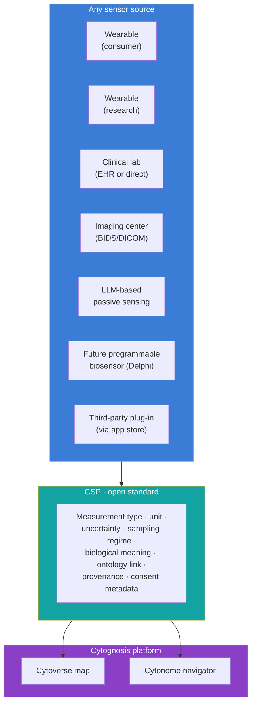
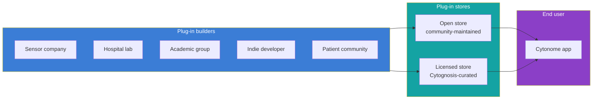

> **Status**: Active
> **Date**: 2026-06-14
> **Author**: @mohammadi
> **Audience**: engineers, stakeholders
> **Tags**: `yar`, `sensors`, `usap`, `architecture`

# Sensor Ecosystem and Cytonome Sensor Protocol (CSP)

> **Naming cross-reference:** this document now uses **CSP (Cytonome Sensor Protocol; formerly USAP/UBAP)** throughout, matching the canonical Yar engineering spec at `spec/SPEC-CSP.md`. This Strategy-level document previously used **UBAP** (Universal Biosensor Adapter Protocol) as its primary term; Strategic Initiative `SI-UBAP-v1` (tracked across `01-Strategy/planning/`) keeps its original identifier and is not renamed by this edit.

**Companion to:** `10_platform_architecture.md`, `12_clinical_to_wearable.md`, `15_app_design.md`

Cytoscope is not one device. It is a universal interface plus a specific lineage of hardware we develop directly or co-develop with partners. The interface is open; the standard is owned by the Foundation; specific hardware implementations may be open or proprietary depending on the partner.

## What counts as a sensor

A "sensor" is anything that produces a measurement of a person's biology, physiology, behavior, or environment. We organize sensors along two axes: **biology** (what they measure) and **deployment context** (how they are deployed).

| Biology | Clinical / episodic | Wearable / continuous |
|---|---|---|
| **Molecular** | Clinical labs (blood draws, biopsies, cytology, molecular panels) | CGM, future biomolecular sensors (ARPA-H Delphi class) |
| **Connectomic** | fMRI, structural MRI, dMRI, PET, research-grade EEG | fNIRS wearable headsets, consumer EEG |
| **Phenotypic** | Clinical interview, structured assessments, neuro exam | Wearable physiology (HRV, sleep, activity), passive ambient sensing |
| **Behavioral** | Standardized neuropsych tests | Conversation tracking via Cytonome, social-context proxies |

Each cell of this matrix is a sensor category. CSP is the open standard that lets any device or service in any cell feed into the navigator without bespoke integration.

## Cytonome Sensor Protocol (CSP)

### What CSP specifies

- **Measurement type.** What is being measured (analyte, voltage, hemodynamic signal, behavioral count, etc.) with structured ontology link (CHEBI, UBERON, NBO, SNOMED CT, ICD-11 as appropriate).
- **Unit.** SI or field-standard unit, machine-readable.
- **Uncertainty.** Each value carries an explicit uncertainty estimate (standard error, confidence interval, or distributional summary), or a documented reason for absence.
- **Sampling regime.** Continuous, event-driven, scheduled, sporadic. Frequency or trigger conditions specified.
- **Biological meaning.** Link to the relevant Cytoverse axis or axes; a human-readable description of why this signal matters.
- **Provenance.** Device model, firmware version, calibration history, signal-processing pipeline version. Enables reproducibility and audit.
- **Consent metadata.** What consent the participant has given for what use of this data, in machine-readable form, so the navigator can enforce participant choice automatically.

### What CSP does not specify

- The signal-processing pipeline inside the device. Vendors are free to compute their own derived metrics. CSP only specifies the contract at the boundary.
- The device hardware itself. CSP is a software contract.
- Whether the data is shared with Cytognosis. CSP describes the data; the consent metadata says what can happen with it.
- Whether the device is open-source. We hope partners will open-source what they can; we do not require it for CSP conformance.

## Plug-in ecosystem

CSP is the standard that enables a plug-in ecosystem. Companies, hospitals, academic groups, and individual makers can build plug-ins that bring their signals into the Cytognosis platform without giving us their raw data.

### Plug-in modes

A plug-in can operate in any of three modes, depending on how much the user trusts the plug-in builder and how much the builder is willing to share:

- **Raw signal.** The plug-in sends raw measurements (CSP-formatted) to the navigator. Most transparent; lowest barrier for the navigator to use the signal.
- **Derived embedding.** The plug-in computes a proprietary embedding and sends only the embedding to the navigator. Useful for vendors who want to protect signal-processing IP. The navigator can still use the embedding as an intermediate state for causal prediction; it just cannot reverse-engineer the raw signal.
- **Local-only.** The plug-in computes derived signals on-device and never leaves the device. Useful for high-sensitivity data. The navigator runs against the on-device output without seeing the underlying signal at all.

All three modes are first-class CSP citizens. Mode selection is a deployment-time choice.

## Cytognosis-built plug-ins

Cytognosis itself ships several plug-ins as the reference implementations:

| Plug-in | Mode | Notes |
|---|---|---|
| **Apple Watch / Oura / Whoop** | Raw signal | Wearable physiology |
| **Muse / Emotiv consumer EEG** | Raw signal | Consumer EEG, with on-device preprocessing |
| **fNIRS partner headsets** | Raw signal | Per partnership |
| **Standardized clinical-scale instruments** (PHQ-9, GAD-7, HiTOP profile, attachment style, personality, etc.) | Raw signal | Used for both initial calibration and tracking; mapped to universal phenotypic axes |
| **Conversational behavioral tracking** | Local-only | Cytonome's own LLM-derived passive sensing of mood, lifestyle, social context |
| **Lab connector** | Raw signal | Quest, LabCorp, hospital labs via direct connector |
| **Clinical-imaging connector** | Raw signal | DICOM / BIDS receiving from imaging centers |

Future Cytoscope-developed hardware (programmable multi-analyte sensors co-developed with ARPA-H Delphi or the Caltech FRO) becomes a Cytognosis plug-in like any other. Its hardware lineage may be proprietary post-bifurcation, but its CSP interface stays open.

## How sensors map to the three forms of data

Per `10_platform_architecture.md`, the platform integrates three forms of data: phenotypic outputs, intermediate endophenotypes (mediators), and interventions. Sensors map to all three:

- **Outputs.** Wearable physiology, behavioral tracking, clinical assessments, symptom logs.
- **Mediators.** Imaging (fMRI, fNIRS), molecular markers, cellular signatures from blood-based assays, connectomics.
- **Interventions.** Therapy logs, medication tracking, lifestyle logs, environmental exposures, social-interaction logs.

The navigator's causal modeling requires all three. CSP supports all three.

## Bifurcation rules for the sensor ecosystem

Per `02_horizons_and_bifurcation.md` and `23_open_science_and_ip.md`:

- **CSP itself stays open in perpetuity.** Foundation owns the spec, contributes it to standards bodies, and accepts community contributions. Apache 2.0 reference implementation, Apache 2.0 conformance suite.
- **Cytognosis-developed sensor hardware in H1 (Y1 to Y3) is open** by default if Cytognosis funded the hardware design alone, or per partnership terms if co-developed.
- **Cytoscope wearable v1 hardware lineage from Y4+ is proprietary** to the PBC. Its CSP interface is open; its design is not.
- **Third-party plug-ins** may be open or proprietary at the builder's choice. CSP conformance is required; openness is encouraged but not mandated.

## Adoption strategy

The single most important measure of CSP success is adoption by external groups. Strategic Initiative `SI-UBAP-v1` carries the cumulative target: by Year 5, ≥2 external biosensor groups have adopted CSP; by Year 10, ≥5.

Adoption is encouraged through:

- **Reference implementation in Apache 2.0** (Python and TypeScript) with first-class support.
- **Conformance test suite** so vendors can self-certify.
- **Co-development partnerships** with strategic partners (ARPA-H Delphi, Caltech molecular monitoring FRO, OpenBCI, academic biosensor groups).
- **Submission to standards bodies** at Y6+: IEEE, ISO, HL7-style health data standards.
- **Publication track** that documents CSP and its use cases in the open scientific literature.

## Risks and limits

| Risk | Mitigation |
|---|---|
| Vendors prefer their own closed standards | Accept that CSP will not win every partner; focus on the partners who share the open thesis |
| CSP versioning fragments the ecosystem | Backward compatibility commitment; versioned conformance suite; lighter-weight v1 to broaden adoption |
| Plug-in store creates moderation burden | Tiered approach: open store is community-moderated, licensed store is Cytognosis-curated; tier of trust per plug-in |
| Privacy implications of plug-in store | Every plug-in declares consent metadata; navigator enforces; PAC reviews high-impact plug-ins |
| Hardware churn outpaces standard adoption | Lightweight CSP v1; rapid iteration on minor versions; deprecate slowly |

## Cross-references

- The platform-level role: `10_platform_architecture.md`.
- App-level integration of plug-ins (sensor section, plug-in store): `15_app_design.md`.
- The clinical-to-wearable alignment that uses CSP-formatted data on both sides: [`12_clinical_to_wearable.md`](../../../01-Strategy/planning/12_clinical_to_wearable.md) (canonical numbered planning doc; the sibling `clinical-to-wearable.md` in this directory covers the same ground in Yar-specific terms).
- The bifurcation rules that govern hardware lineage: `02_horizons_and_bifurcation.md`, `23_open_science_and_ip.md`.
