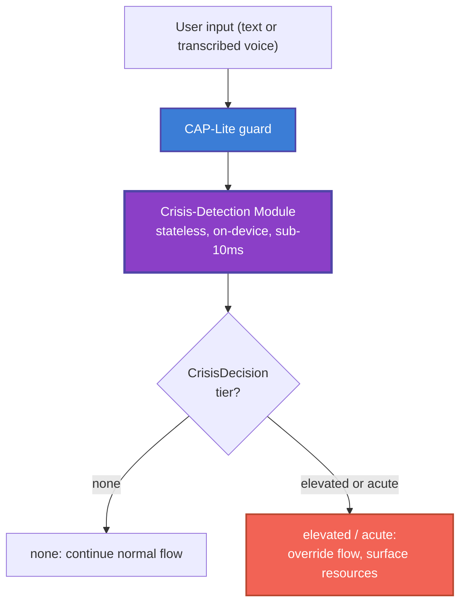

> **Related:** [privacy-boundary-spec](../../Cytoplex/spec/privacy-boundary-spec.md); CAP primitives at `Cytoplex/spec/03_primitives.md`

> **Status**: Draft
> **Date**: 2026-06-22
> **Author**: Cytognosis Foundation
> **Audience**: engineers, clinical advisors, counsel, reviewers
> **Tags**: `yar`, `cap`, `crisis-detection`, `safety`, `module-spec`, `v0`
> **Related**: `Cytoplex/spec/privacy-boundary-spec.md`, `../_archive/cytonome-master-reference.md`, `Yar/research/yar-unified-feature-comparison-v4.md` (F18)

> **Implementation status**: Design finalized 2026-07-16 for a post-YC build (decision D5). The full crisis-detection module described in this spec (tiered scoring, `CrisisDecision` struct, context handling, elevated tier, resource registry lookup) does not yet exist as code. The only currently built crisis mechanism is the deterministic `CapLiteGuard` crisis-term gate, originally at `Yar/src/cap/guard.py` and, as of 2026-07-16, ported into the YC Tauri base at `yar_revisions/yar-code-20260705-2354/backend/cap/` (commit `068b10d`), wired as a pre-response gate in `backend/assistant/views.py`. It matches a 22-term English and Farsi keyword list and redirects to 1480 (Iran Social Emergency) and findahelpline.com. Everything else in this spec is a design target requiring clinical-advisor review before implementation. See the "Implementation Status — 2026-07-16" section below and `spec/SAFETY-CHECKPOINT_2026-07-16.md` for the full resume plan.

# Crisis-Detection Subsystem (Module Spec, v0)

> **Reading options:** An ADHD-friendly progressive-disclosure rendering is generated from this file. The hand-maintained ADHD twin (`spec/adhd/MODULE-crisis-detection_adhd.md`) was retired 2026-07-16; see `_archive/cleanup_2026-07-16/adhd-twins/`.

> **Reading time**: ~10 minutes.
> **If you only read one thing**: the **Safety Principles** in Section 2. They are non-negotiable design constraints, and they require clinical-advisor sign-off before any user-facing release.

> [!CAUTION]
> This spec closes CRITICAL gap D3 from the v4 feature comparison. **It is a finalized design for clinical and legal review, not an approved implementation.** Today, the only shipped protection is a 22-term keyword match inside `CapLiteGuard.evaluate()`, now ported into the YC Tauri base (see Section 0). No full crisis module, threshold policy, or clinical-review process exists yet. Nothing beyond the shipped keyword gate ships to users until a clinical advisor signs off.

---

## 0. Implementation Status — 2026-07-16 (D5 Checkpoint)

> **Decision D5:** build the full crisis-detection module **post-YC**. Keep the `CapLiteGuard` keyword gate live for beta. This section is the authoritative implementation-status record as of 2026-07-16; see `spec/SAFETY-CHECKPOINT_2026-07-16.md` for the full resume plan.

**Shipped today:**

- The 22-term English/Farsi keyword gate inside `CapLiteGuard.evaluate()`, live in the YC Tauri base at `yar_revisions/yar-code-20260705-2354/backend/cap/` (ported from `Yar/src/cap/`, commit `068b10d`, 2026-07-16), wired as a pre-response gate in `backend/assistant/views.py` (`ChatView`, `ExtractTasksView`) via `backend/assistant/safety.py`.
- The shipped crisis message already redirects to **1480 (Iran Social Emergency) and findahelpline.com** — a live product decision already in code, not merely the Section 7 proposed default.
- Test coverage: `SafetyGateTests` in `backend/assistant/tests.py` — English crisis phrase, Farsi/Persian crisis phrase, diagnosis request, and benign message pass-through, plus the equivalent extract-tasks cases. All 41 backend tests are green.

**Deferred to post-YC:** tiered scoring (`elevated`/`acute`), the `CrisisDecision` struct, negation/context handling, the elevated tier's supportive response, and resource-registry lookup beyond the hardcoded Iran/findahelpline pair.

**Open dependencies blocking full implementation:**

| Dependency | Status | Owner |
|---|---|---|
| Clinical advisor | **None contracted yet.** No expanded lexicon, tier thresholds, negation handling, or evaluation set can be finalized until one is engaged (see Open Decisions #1 and #6 below). | Shahin (contracting decision) |
| Launch-market hotline set | **Open founder decision, not yet made.** Two candidate sets: (a) **1480 Iran Social Emergency + findahelpline.com** — matches what is already shipped in `CapLiteGuard` today; (b) **988 US Suicide & Crisis Lifeline + Crisis Text Line** (text HOME to 741741) — the Section 7 US default. Whichever market(s) Yar launches in first determines which set is authoritative for that market; both may be needed if launching in the US and Iran simultaneously. | Shahin (founder decision) |

## 1. Purpose and Scope

This module detects signals that a person using Yar may be in crisis, and connects that person to human help quickly and respectfully. It is a hard-coded safety subsystem enforced through CAP-Lite that overrides ordinary app flows when risk is detected.

**In scope:** the detection contract, response actions, the resource registry model, thresholds and evaluation, and safety requirements.
**Out of scope:** clinical validation itself (advisor-led), the privacy schema (see the privacy-boundary spec), and any claim of clinical efficacy.

## 2. Safety Principles (Non-Negotiable)

> [!IMPORTANT]
> Every requirement in this spec derives from these principles. They reflect established guidance on supporting people in distress.

- **Augmentation, never replacement.** Yar is not a crisis service, a clinician, or emergency care, and it never presents itself as one.
- **No diagnosis.** The module detects risk signals; it never states or implies a diagnosis.
- **No interrogation.** The module does not ask risk-assessment or screening questions. It expresses concern and offers resources.
- **Connect to humans.** The primary action is always to surface a fast path to trained human help.
- **Over-detection bias.** A false positive (offering help when not needed) is acceptable; a missed detection is not. Tune toward sensitivity.
- **Non-stigmatizing and supportive.** The tone stays warm and person-first. The module never shames, lectures, or gamifies, and it continues in a supportive, non-clinical mode afterward.
- **No false promises.** The module does not make categorical claims about confidentiality or about whether authorities will or will not be involved.

## 3. Architecture

The crisis-detection module is a standalone, stateless, single-responsibility component invoked synchronously by CAP-Lite on user input, before any other content flow. It runs fully on-device and does not depend on the network to detect risk or to display resources.



## 4. Public API

```text
evaluate(input: UserInput) -> CrisisDecision

CrisisDecision {
  risk_detected: bool
  tier: enum { none, elevated, acute }
  matched_signals: [signal_code]      # codes only, never the matched text
  recommended_actions: [action_code]
}
```

Properties: **stateless**, **synchronous**, target latency **under 10 milliseconds**, **no network dependency**. The function returns codes, never the raw matched content, so it composes with the privacy-boundary spec.

## 5. Detection Signals and Tiers

> [!WARNING]
> The signal taxonomy below is a **starting point that requires clinical-advisor definition**. Keyword matching alone is brittle: it misses paraphrase and over-triggers on idiom (for example, "this commute is killing me"). The module must apply negation and context handling, and a clinical advisor must own the final lexicon, tiers, and thresholds.

| Tier | Example signal class | Response |
|---|---|---|
| `none` | No risk signal | Continue normal flow |
| `elevated` | Hopelessness or passive-ideation language | Surface supportive resources and a gentle, non-interrogating offer of help |
| `acute` | Explicit intent or plan language (the current 22-term direct matches, bilingual) | Override the flow, surface crisis resources, offer one-tap call or text, optional clinician alert |

**Current state:** a 22-term English and Farsi keyword list (for example "end my life", "kill myself", and Farsi equivalents) is the only shipped signal. **Proposed (review-required):** an expanded, clinically owned lexicon with negation and context handling. Paralinguistic signals are explicitly **out of v1** and flagged for later research.

## 6. Response Actions

- **Surface resources first.** On `elevated` or `acute`, the module interrupts the normal flow and presents the resource set for the active market.
- **One-tap contact.** Provide a one-tap path to call or text the configured hotline.
- **Optional clinician alert.** WHERE the user has opted in, send the minimum-necessary alert defined by the privacy-boundary spec; never send content.
- **Supportive continuation.** After surfacing resources, continue in a warm, non-clinical tone; do not quiz, rank, or shame.
- **No autonomous escalation claims.** The module does not promise or perform contact with authorities, and does not claim the conversation is confidential.

## 7. Resource Registry (Verification Required)

> [!CAUTION]
> Ship **only** numbers verified for the launch market by a clinical advisor. Do not display an unverified crisis number. The set below is a proposed default, not an approved list.

| Market | Proposed resource | Status |
|---|---|---|
| United States | 988 Suicide and Crisis Lifeline (call or text 988); Crisis Text Line (text HOME to 741741) | Verify before ship |
| International | findahelpline.com (global directory, ThroughLine) | Verify coverage per market |
| Iran and other launch markets | Localized, clinically verified numbers | **Unresolved; must be verified, do not guess** |

> **2026-07-16 note:** the shipped `CapLiteGuard` message already uses **1480 (Iran Social Emergency) + findahelpline.com**, not the US 988/Crisis-Text-Line pair above. Which set is authoritative for launch is an open founder decision (Section 0) — this table's US row has not been verified or chosen over the Iran row that is already live in code.

The registry is data, not code, so it can be updated and localized without changing the module logic.

## 8. Thresholds and Evaluation

- **Bias.** Favor sensitivity over specificity; accept false positives to avoid missed detections.
- **Targets.** Sensitivity and specificity targets are **set by the clinical advisor**, not by engineering. No numbers are committed here.
- **Test set.** A labeled, privacy-safe evaluation set is required before any threshold is trusted; construction is a clinical-advisor task.
- **Initial threshold owner.** Until an advisor is contracted, the conservative default (the shipped keyword list at `acute`) stands, and the elevated tier stays disabled.

## 9. Requirements (EARS Notation)

- **CD-1 (ubiquitous):** THE module SHALL run fully on-device and SHALL NOT depend on network availability to detect risk or to display resources.
- **CD-2 (event-driven):** WHEN input matches a configured risk signal, THE SYSTEM SHALL surface crisis resources before continuing any other flow.
- **CD-3 (ubiquitous):** THE SYSTEM SHALL NOT ask risk-assessment or screening questions; it SHALL express concern and offer resources.
- **CD-4 (ubiquitous):** THE SYSTEM SHALL NOT state or imply a diagnosis, and SHALL NOT claim to be a crisis service or a substitute for emergency care.
- **CD-5 (state-driven):** WHILE in a detected-risk state, THE SYSTEM SHALL continue in a supportive, non-clinical tone and SHALL NOT shame, lecture, or gamify.
- **CD-6 (optional, where):** WHERE the user has opted in to clinician alerting, THE SYSTEM SHALL send only the minimum-necessary alert defined in the privacy-boundary spec.
- **CD-7 (unwanted, if-then):** IF the module errors or a signal is ambiguous, THEN THE SYSTEM SHALL fail toward showing resources, not suppress them.
- **CD-8 (ubiquitous):** THE SYSTEM SHALL NOT make categorical promises about confidentiality or about authority involvement.
- **CD-9 (event-driven):** WHEN surfacing resources, THE SYSTEM SHALL present a one-tap path to call or text the verified hotline for the active market.
- **CD-10 (ubiquitous):** THE SYSTEM SHALL log crisis events in non-stigmatizing, person-first language, with no PHI or content leaving the device (privacy-boundary PB-7).

## 10. Error Handling and Fail-Safe

The module fails safe by failing **toward** help: any internal error, load failure, or ambiguous signal resolves to showing resources, never to suppressing them (CD-7). Resource display must work offline from a local copy of the verified registry.

## 11. Open Decisions (Flagged, Not Resolved)

| # | Decision | Owner |
|---|---|---|
| 1 | Crisis signal taxonomy and tiers beyond the 22 keywords | Clinical advisor (none contracted yet) |
| 2 | Clinician-alert opt-in mechanics and HIPAA posture | Counsel (Duane Valz) |
| 3 | Verified hotline set per launch market — **founder decision, open as of 2026-07-16**: 1480 Iran + findahelpline.com (already shipped) vs. 988 US + Crisis Text Line (Section 7 default, unverified) | Shahin (founder decision), with clinical-advisor verification once contracted |
| 4 | Retention of crisis log events under HIPAA and state law | Counsel (Duane Valz) |
| 5 | Who sets the initial threshold before an advisor is contracted | Shahin |
| 6 | Sensitivity and specificity targets and the evaluation set | Clinical advisor |

---

<details>
<summary><strong>Glossary</strong></summary>

- **Acute tier:** explicit intent or plan signals; triggers full resource takeover.
- **Augmentation:** Yar assists and connects to human help; it never replaces care.
- **CAP-Lite:** the shipped enforcement gate that invokes this module.
- **Elevated tier:** hopelessness or passive-ideation signals; triggers a gentle, non-interrogating offer of help.
- **Fail toward help:** on any error, show resources rather than suppress them.
- **Over-detection bias:** tuning that accepts false positives to avoid missed detections.
- **PHI:** protected health information.

</details>

---

## Related documents

- [`privacy-boundary-spec.md`](./privacy-boundary-spec.md) -- this module's dependency (see `depends_on` front matter).
- [`SAFETY-CHECKPOINT_2026-07-16.md`](./SAFETY-CHECKPOINT_2026-07-16.md) -- the checkpoint that closes this module and privacy-boundary together for post-YC resume.
- CAP code path: `~/repos/cytognosis/yar_revisions/yar-code-20260705-2354/backend/cap/`.
