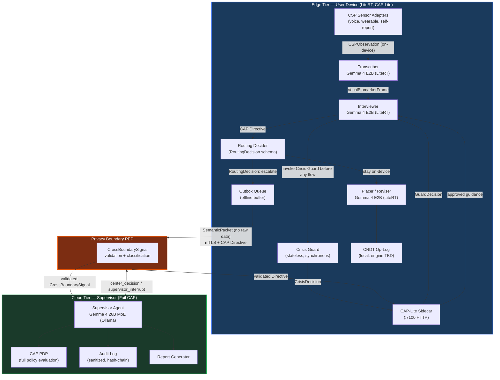

> **Status**: Draft
> **Date**: 2026-06-22
> **Author**: Cytognosis Foundation
> **Audience**: engineers
> **Tags**: `yar`, `edge-ai`, `hybrid`, `cap`, `gemma`

> **Related:** [SPEC-multi-agent](./SPEC-multi-agent.md); [SPEC-CSP](./SPEC-CSP.md); CAP latency budget at `04-Engineering/cytoplex/benchmarks/cap_v1_latency_mobile_budget.md`; CAP-Lite in `04-Engineering/yar/yar-system-doc.md`

# SPEC: Yar Edge-AI and Hybrid Supervisor Architecture

**Reading time**: ~17 minutes.

**BLUF**: Yar runs all latency-sensitive, privacy-critical computation on-device under CAP-Lite governance; the cloud supervisor receives only derived semantic packets, never raw data. The on-device/cloud boundary is a CAP privacy boundary, and every escalation is a declared `CrossBoundarySignal` crossing. Default routing stays on-device; escalation to the cloud supervisor requires an active consent grant plus a routing trigger that cannot be satisfied locally.

**If you only read one thing**: Section 3 (the routing-decision contract) and Section 4 (the handoff protocol). The core invariant is: raw audio, raw transcripts, and free text never leave the device. The cloud supervisor controls quality, policy, and safety; it does not touch raw data.

---

> **IMPLEMENTATION STATUS SUMMARY (2026-06-22)**
>
> | Component | Status |
> |---|---|
> | `CapLiteGuard` deterministic gate (`Yar/src/cap/guard.py`) | **IMPLEMENTED** — this is the actual on-device safety gate in v0.1; not an LLM, not a sidecar process |
> | `GemmaEdgeIntentService` on-device inference (`Yar/apps/mobile/lib/src/services/gemma_edge_intent_service.dart`) | **IMPLEMENTED** — `temperature: 0.1, topK: 16, topP: 0.8` for intent; `temperature: 0.4, topK: 32, topP: 0.9` for assistant replies |
> | `DistilHuBERT-SER` on-device affect inference (`Yar/apps/mobile/lib/src/affect/onnx_distilhubert_ser_inference.dart`) | **IMPLEMENTED** — model: `distilhubert-ser-int8-onnx` (mobile quantized) |
> | Supervisor agent (Gemma 4 26B MoE, Ollama) | **PLANNED** |
> | CAP-Lite sidecar at `:7100` | **PLANNED** (design concept; not a running process) |
> | NATS interrupt stream + Dapr orchestration | **PLANNED** |
> | Interrupt validation (Level 12 Gemma prototype) | **BENCHMARKED** (prototype; not production) |
> | DB/sync: SQLite+FTS5 local MVP | **BENCHMARKED AND DECIDED** — see `yar_supervisor_reproducible_benchmark_package/reports/Yar_Data_Fabric_Supervisor_Brief_EN.md`; SPEC-storage-engine remains open |

---

## 1. Architecture Overview

Yar's hybrid architecture has two tiers. The **edge tier** runs on the user's phone and handles all real-time user interaction. The **cloud tier** (or local supervisor, e.g., Ollama on a laptop) handles policy evaluation, complex reasoning, and external tool access. The boundary between them is a CAP privacy boundary.

### 1.1 Tier Definitions

| Tier | Physical location | Governing profile | Latency target |
|---|---|---|---|
| **Edge tier** | User's phone (LiteRT runtime) | **CAP-Lite** | Under 200ms per op |
| **Cloud tier** | Cytognosis-hosted server, or Ollama on user laptop | **Full CAP** | No hard RT constraint |

The edge tier includes: the Interviewer worker, the Transcriber worker, the Placer worker, the Reviser worker, the Crisis Guard, and the CAP-Lite sidecar. These match exactly the worker agents defined in `SPEC-multi-agent.md` Section 2.2.

The cloud tier includes: the Supervisor agent, the CAP PDP (policy decision point), the Privacy Boundary PEP, and the audit log. The Supervisor also manages all external tool calls and cross-boundary signal emission.

### 1.2 Architecture Diagram



### 1.3 Invariants

The following invariants hold across both tiers and are not overridable by configuration:

1. **Raw-data locality.** Raw audio, raw transcripts, and unredacted free text stay on the edge device. They are `privacy_tier: on_device_only` per `SPEC-CSP.md` Section 5.2.
2. **Privacy-preserving default.** When the routing decider is uncertain, the Directive stays on-device. Escalation requires an explicit trigger.
3. **CAP-Lite always on.** The CAP-Lite gate intercepts every user input and every proposed operation before any model inference. In v0.1 this is `CapLiteGuard` (`Yar/src/cap/guard.py`), a deterministic term-matching guard. The full sidecar process at `:7100` is PLANNED.
4. **Crisis gate first.** Crisis detection runs synchronously on every user input before the Interviewer (or intent service) sees it. In v0.1, crisis terms are matched by `CapLiteGuard` and deny immediately. The `CrisisDecision`-returning module described in `SPEC-multi-agent.md` Section 5.4 is PLANNED. This is inherited from `SPEC-multi-agent.md` Section 5.4.
5. **Cross-boundary = declared event.** Every escalation to the cloud tier is a `CrossBoundarySignal` event. The PEP validates the signal schema before it crosses.

---

## 2. CAP-Lite Governance on the Edge Tier

**CAP-Lite** is Yar's default on-device safety profile. It is defined in `Cytoplex/spec/07_profiles_roadmap.md` and implemented as a sidecar HTTP server at `:7100`. Every worker agent on the edge tier sends its Directives through CAP-Lite before execution.

### 2.1 What CAP-Lite Enforces

**v0.1 (IMPLEMENTED):** The on-device CAP-Lite gate is `CapLiteGuard` (`Yar/src/cap/guard.py`). It is a deterministic multilingual term-matching guard, not an LLM classifier. It runs synchronously before any model inference.

| Rule | v0.1 Enforcement (CapLiteGuard) | Future (PLANNED) |
|---|---|---|
| No diagnostic claims ("you have X") | Hardcoded term list + regex patterns; deny with refusal reason | CAP-Lite keyword + model check; `refusal_type: non_diagnostic_boundary_crossed` |
| No treatment recommendations | Term list + 4 compiled regex patterns | Same gate, LLM-backed |
| Crisis detection | Hardcoded crisis terms (EN + Farsi); deny with support message to 1480/findahelpline.com | Full crisis module per `MODULE-crisis-detection.md` |
| No raw audio or transcript forwarding | Checked via `raw_share_terms` matching + `user_confirmed_external_write` flag | Schema validator on every Directive payload |
| No external writes without confirmation | `validate_external_write()` checks `user_confirmed_external_write` flag | Outbox queue with Supervisor approval |
| Deny-wins semantics | Crisis check returns immediately; deny wins over all other outcomes | Same semantics |

### 2.2 CAP-Lite vs Full CAP

| Capability | CAP-Lite (edge) | Full CAP (cloud) |
|---|---|---|
| Policy evaluation | v0.1: deterministic term-matching (`CapLiteGuard`); future: local rules + Gemma E4B gate | Full PDP with OPA and multi-policy evaluation |
| External tool calls | Blocked (always denied) | Permitted under AuthorityChain + consent |
| Cross-boundary signal emission | Not permitted; only the Supervisor may emit | Permitted via PEP gate |
| Session-level guidance state | Read-only (receives from Supervisor) | Owns and writes |
| AuthorityChain issuance | Cannot issue; can verify | Issues all AuthorityChains |
| Audit log | Local hash-chain; no PHI | Full sanitized audit; decision traces; model output hashes |

### 2.3 CAP-Lite Sidecar Lifecycle

The CAP-Lite sidecar starts with the Yar backend process and holds a session-scoped Ed25519 key per agent. At session init, each agent verifies its AgentCard attestation through CAP-Lite before receiving any Directives. Key lifecycle is session-scoped; keys do not persist across sessions.

Reference: `SPEC-multi-agent.md` Section 3.2 (AgentCard schema) and `Cytoplex/spec/04_security_trust_evidence.md` (key management).

---

## 3. What Runs Where: Decision Table and Routing Contract

### 3.1 Task-Tier Decision Table

| Task type | Default tier | Escalation trigger |
|---|---|---|
| Voice transcription (ASR) | Edge | Never escalates; raw audio is always on-device |
| Real-time conversational response | Edge | Supervisor guidance out-of-band (non-blocking) |
| Brainmap node placement (Placer) | Edge | Never escalates; operates on local CRDT |
| Brainmap restructure (Reviser) | Edge | Never escalates; operates on local CRDT |
| Crisis detection | Edge | Crisis Guard result forces cloud notification (signal only, no content) |
| Mood-arc inference | Edge | Low confidence triggers escalation for re-evaluation |
| Dimensional behavioral scoring | Edge (simple) / Cloud | Score confidence below threshold; multi-session context needed |
| Policy evaluation for novel action | Edge (CAP-Lite) | Action not in CAP-Lite ruleset; `refusal_type: missing_evidence` triggers escalation |
| Cross-session context lookup | Cloud | Always; requires Supervisor's session-level guidance state |
| External tool invocation | Cloud | Always; edge cannot issue external tool Directives |
| Safety routing override | Cloud | Always; center-authority-level decision |
| Final report generation | Cloud | Always; requires full dimension coverage and scoring |
| Section transition decision | Cloud | Always; requires Supervisor's interview state |

### 3.2 Routing Decision Contract (LinkML Schema)

The **routing decider** runs on the edge tier as part of CAP-Lite processing. It produces a `RoutingDecision` that determines whether a Directive is handled locally or escalated.

```yaml
# LinkML sketch (field names normative; schema file: Yar/spec/schemas/edge-ai-hybrid/routing.yaml)
classes:
  RoutingDecision:
    attributes:
      decision_id:       { range: string, required: true }    # UUID
      directive_ref:     { range: string, required: true }    # Directive.id being routed
      tier:              { range: TierEnum, required: true }  # edge | cloud
      trigger:           { range: RoutingTriggerEnum }        # populated when tier=cloud
      confidence:        { range: float }                     # 0.0–1.0; populated for model-driven decisions
      privacy_gate:      { range: PrivacyGateDecisionEnum, required: true }  # pass | block
      consent_ref:       { range: string }                    # required when tier=cloud
      reasoning_code:    { range: string, required: true }    # non-PHI structured reason
      timestamp:         { range: datetime, required: true }

enums:
  TierEnum:
    permissible_values:
      edge: { description: "Handle locally; no escalation" }
      cloud: { description: "Escalate to Supervisor tier" }

  RoutingTriggerEnum:
    permissible_values:
      capability_gap:   { description: "Action requires model capability unavailable on-device" }
      confidence_low:   { description: "Model confidence below threshold for safe on-device execution" }
      latency_budget_exceeded: { description: "Op class exceeds edge latency budget" }
      safety_signal:    { description: "Crisis or risk signal; notify cloud tier (no raw content)" }
      policy_unknown:   { description: "CAP-Lite ruleset does not cover this action; escalate for PDP eval" }
      cross_session:    { description: "Action requires cross-session state held by Supervisor" }
      external_tool:    { description: "Action targets an external tool; edge cannot authorize" }

  PrivacyGateDecisionEnum:
    permissible_values:
      pass: { description: "Payload satisfies privacy rules; may proceed" }
      block: { description: "Payload contains disallowed content; Directive dropped" }
```

### 3.3 Routing Thresholds (Normative Defaults)

| Parameter | Default value | Rationale |
|---|---|---|
| Confidence threshold for on-device execution | 0.70 | Below this, edge model uncertainty is too high for safety-adjacent decisions |
| Max on-device context window (tokens) | 8192 (Gemma 4 E2B) | Larger context requires cloud model |
| Max time-to-first-response (edge) | 200ms | From `SPEC-multi-agent.md` Section 7.1 |
| Escalation consent required | Yes (active `consent_ref`) | No escalation without user consent |
| Privacy gate on escalation payload | All fields validated against `CrossBoundarySignal` schema | PB-1 through PB-10 from `privacy-boundary-spec.md` |

Thresholds are runtime-configurable via the session config, not hardcoded. Changes require a CAP-Lite policy update and a new `GuardDecision` record.

---

## 4. Handoff Protocol

### 4.1 Escalation Triggers (Detail)

**Capability gap**: the Interviewer needs to invoke a tool not in its published `ToolManifest`, or the action requires the Supervisor's full AuthorityChain. Triggered by `refusal_type: forbidden_tool` from CAP-Lite.

**Confidence low**: the Interviewer's model output confidence falls below 0.70 for a decision that affects downstream safety (e.g., dimensional score inference, mood-arc classification). The Interviewer proposes to the Supervisor rather than committing.

**Latency budget exceeded**: an op class cannot meet the 200ms edge target (for example, a multi-document context retrieval). The edge hands the request to the Supervisor queue; the Interviewer continues the turn with the last-known guidance.

**Safety signal**: the Crisis Guard returns `tier: elevated` or `tier: acute`. A `CrossBoundarySignal` of type `crisis_signal` is emitted to the Supervisor. The signal carries only `{ risk_detected, tier, signal_codes }`, never matched text.

**Policy unknown**: the action is not covered by CAP-Lite's ruleset. CAP-Lite returns `refusal_type: missing_evidence`; the routing decider escalates for PDP evaluation on the cloud tier.

### 4.2 Escalation Message Schema

The **semantic packet** is the payload that crosses the privacy boundary. It is derived from on-device data; it never contains raw content.

```yaml
# LinkML sketch (field names normative; schema file: Yar/spec/schemas/edge-ai-hybrid/semantic-packet.yaml)
classes:
  SemanticPacket:
    is_a: CrossBoundarySignal           # declared CrossBoundarySignal per privacy-boundary-spec.md
    attributes:
      packet_id:          { range: string, required: true }
      session_id:         { range: string, required: true }
      turn_id:            { range: string, required: true }
      routing_trigger:    { range: RoutingTriggerEnum, required: true }
      consent_ref:        { range: string, required: true }    # active grant; required for escalation
      dimension_signals:  { range: DimensionSignal, multivalued: true }
      safety_flags:       { range: SafetyFlagEnum, multivalued: true }
      local_risk_level:   { range: RiskLevelEnum }            # RISK_NONE | RISK_LOW | RISK_MODERATE | RISK_HIGH
      context_summary:    { range: string }                   # derived non-PHI summary; never raw transcript
      mood_arc:           { range: MoodArcEnum }              # improving | stable | declining
      redacted:           { range: boolean, required: true, equals_expression: "true" }  # invariant; always true
      model_metadata:     { range: ModelMetadata }
      raw_content_included: { range: boolean, required: true, equals_expression: "false" }  # invariant

  DimensionSignal:
    attributes:
      dimension_id:   { range: string, required: true }   # e.g. "mood_affect", "anxiety_arousal"
      score:          { range: integer }                  # 1=insufficient | 3=met | 5=strong
      evidence_count: { range: integer }

  ModelMetadata:
    attributes:
      edge_model_id:   { range: string }    # e.g. "gemma-4-e2b-it"
      inference_ms:    { range: float }     # on-device inference time, for audit
      output_hash:     { range: string }    # SHA-256 of model output; not the output itself
```

**Fields that MUST NOT appear in any escalation payload:**

- Raw transcript text
- Raw audio or waveform data
- Unredacted personal names, places, or identifiers
- Full verbatim user input beyond a derived summary
- Any field marked `privacy_tier: on_device_only` in its source adapter descriptor

The Privacy Boundary PEP validates these constraints using the `CrossBoundarySignal` schema before the packet reaches the Supervisor. Any violation drops the packet and raises a CAP policy violation (PB-10 from `privacy-boundary-spec.md`).

### 4.3 Supervisor Response Schema

The Supervisor returns a `CenterDecision` Directive to the edge tier through the same Privacy Boundary PEP.

```yaml
# LinkML sketch
classes:
  CenterDecision:
    attributes:
      decision_id:       { range: string, required: true }
      in_response_to:    { range: string, required: true }    # SemanticPacket.packet_id
      decision_type:     { range: CenterDecisionTypeEnum, required: true }
      approved_action:   { range: string }          # approved Directive action, if type=approve
      revised_action:    { range: string }          # replacement action, if type=revise
      guidance_update:   { range: GuidanceUpdate }  # updated session guidance for Interviewer
      safety_action:     { range: SafetyActionEnum }
      section_directive: { range: SectionDirectiveEnum }  # transition instruction if applicable
      latency_ms:        { range: float }           # cloud-side decision latency, for audit

enums:
  CenterDecisionTypeEnum:
    permissible_values:
      approve:    { description: "Edge proposal accepted; edge agent may commit" }
      revise:     { description: "Replace edge proposal with revised action" }
      redirect:   { description: "Route to a different section or dimension" }
      interrupt:  { description: "Stop current edge speech; supervisor_interrupt sent" }
      hold:       { description: "Pause; await additional context" }
      stop:       { description: "End session; stop condition met" }
```

### 4.4 Consent and Privacy Gating of Escalation

Escalation to the cloud tier MUST NOT proceed unless all three conditions hold:

1. **Active consent grant.** The session has an active `consent_ref` that covers the `cloud_supervisor` scope. An edge-only session (no consent to cloud escalation) runs entirely on-device.
2. **Routing trigger declared.** The `RoutingDecision.trigger` field is populated with a valid `RoutingTriggerEnum` value. Undeclared escalations are blocked.
3. **Privacy gate passes.** The `SemanticPacket` passes the `PrivacyGateDecisionEnum: pass` check. Any `block` result drops the escalation and surfaces a non-disruptive fallback to the user.

When the user has not consented to cloud escalation, the system runs in **device-only mode** (Section 5.4). All decisions degrade gracefully to on-device defaults.

### 4.5 Interrupt Stream

The Supervisor sends `supervisor_interrupt` and `supervisor_revision` messages via the interrupt stream (separate from the main Directive stream, per `multi-agent-architecture-report.md` Section 5.2). The interrupt stream runs over the NATS subject `yar.session.<id>.interrupt`.

Interrupt flow (validated in the Level 12 prototype):

```
Interviewer starts speaking
  |
Supervisor detects policy violation or quality failure
  |
Supervisor sends supervisor_interrupt (over interrupt NATS subject)
  |
CAP-Lite gate on edge receives interrupt
  |
Interviewer stops TTS/generation immediately
  |
Edge sends interrupt_ack
  |
Supervisor sends supervisor_revision (replacement content)
  |
Interviewer continues with revised content
```

The interrupt mechanism was validated at Level 12 of the Cytognosis multi-agent prototype (`multi-agent-architecture-report.md` Section 11.2):

> `"center_can_interrupt_edge": true, "interrupts_count": 1`

Interrupt handling is non-negotiable: an `interrupt` received by CAP-Lite immediately halts the current Directive chain. No Directive in flight supersedes an interrupt. This is governed by the deny-wins semantics in `Cytoplex/spec/02_core_model.md`.

---

## 5. Latency and Resource Budgets

### 5.1 Edge Latency Budget (Per Op Class)

Latency targets are derived from two sources: the `SPEC-multi-agent.md` Section 7.1 principle ("everything under 200ms runs on-device") and the CAP v1 latency microbenchmark at `04-Engineering/cytoplex/benchmarks/cap_v1_latency_mobile_budget.md` (benchmark id `cap-v1-latency-mobile-resource-local`, generated 2026-05-25).

| Op class | Edge latency target | CAP overhead (benchmark p50) | Notes |
|---|---|---|---|
| CAP-Lite guard check per Directive | < 10ms | `edge_pep_verify_envelope`: 3.010ms p50 | From benchmark; arm64 macOS proxy measurement |
| CAP-mediated tool call | < 10ms | `cap_mediated_mcp_tools_call`: 4.607ms p50 | From benchmark |
| Local PEP user output gate | < 1ms | `local_pep_user_output_gate`: 0.021ms p50 | From benchmark |
| CAP live stream gate | < 2ms | `cap_live_stream_gate`: 0.303ms p50 | From benchmark |
| Mobile proxy (Android/iOS) | < 1ms | `android_mobile_proxy_user_output`: 0.026ms p50; `ios_mobile_proxy_user_output`: 0.026ms p50 | From benchmark |
| Full conversational turn (Interviewer) | < 200ms end-to-end | Includes ASR + CAP-Lite + Gemma E2B inference | Design target; not yet measured on mobile hardware |
| Brainmap node placement (Placer) | < 200ms | Includes model inference + CRDT write | Design target |
| CAP streaming buffer hold max | 250ms | `max_buffer_ms: 250` | From benchmark streaming config |

**Caveat (from benchmark)**: Numbers are local microbenchmarks on arm64 macOS. Mobile Android/iOS measurements are Python proxy-path measurements, not native device telemetry. Production model inference, native UI wrappers, and service meshes will change latency substantially.

### 5.2 On-Device Model Footprint

The validated on-device model is `google/gemma-4-E2B-it` (LiteRT runtime), confirmed in the Level 12 Cytognosis prototype (`multi-agent-architecture-report.md` Section 13, Level 9.1). The Level 12 result confirmed two separate real model instances running concurrently:

> `"edge_model_was_real": true, "center_model_was_real": true, "models_are_shared": false`

**Measured inference parameters from the implemented `GemmaEdgeIntentService` (`Yar/apps/mobile/lib/src/services/gemma_edge_intent_service.dart`):**

| Method | temperature | topK | topP | Model type |
|---|---|---|---|---|
| `inferIntent` (intent classification) | **0.1** | **16** | **0.8** | `ModelType.gemmaIt` |
| `generateAssistantReply` (conversational response) | **0.4** | **32** | **0.9** | `ModelType.gemmaIt` |

The intent inference params (`temperature: 0.1, topK: 16, topP: 0.8`) are **normative** for the intent-classification path. The lower temperature enforces deterministic JSON output for `VoiceIntent` parsing. The assistant-reply params (`temperature: 0.4, topK: 32, topP: 0.9`) are appropriate for more natural conversational output.

| Parameter | Target |
|---|---|
| Model | Gemma 4 E4B (E2B in prototype; E4B in current codebase identifier) |
| Runtime | LiteRT via `flutter_gemma` package |
| Max context window | 8192 tokens |
| Memory footprint | TBD; profiling required on production mobile hardware (Level 16 work item per `multi-agent-architecture-report.md` Section 18) |
| Battery proxy (CPU time per 1000 ops) | `cap_mediated_mcp_tools_call`: 4604.52ms per 1000 ops; `edge_pep_verify_envelope`: 2988.94ms per 1000 ops (from CAP benchmark; relative proxy only) |

Note on model ID: the prototype reports `gemma-4-e2b-it`; the current `model_router.py` default is `gemma4:e4b`. Both use 4-bit quantized Gemma 4 variants. Confirm exact model ID before production deployment.

Production memory and battery profiling is a Level 16 milestone, per `multi-agent-architecture-report.md` Section 18.

### 5.3 Cloud Supervisor Model

The Supervisor runs `google/gemma-4-26B-MoE` via Ollama (decided in `SPEC-multi-agent.md` Section 2.2). No hard latency constraint applies to the cloud tier. The Interviewer does not block on Supervisor responses; it continues with last-known guidance and incorporates updates at the next turn boundary (from `SPEC-multi-agent.md` Section 7.2).

**Supervisor PLAN status:** The full Gemma 26B MoE supervisor agent is PLANNED, not yet implemented. The Level 12 prototype benchmark validated the interrupt and routing model. The `therapist_supervisor` scenario (`cytoplex/src/cytoplex/scenarios/therapist_supervisor/`) is the working reference for what the supervisor implementation will look like when built.

Decision latency was measured in the Level 12 prototype at:

> `"avg_ms": 0.17, "count": 6, "max_ms": 1`

Note: these values reflect deterministic validation logic in the prototype, not full model reasoning. Production Supervisor latency at full model scale has not been measured.

### 5.3a Storage and Sync Benchmarks (Normative Reference)

The reproducible benchmark package at `yar_supervisor_reproducible_benchmark_package/` contains the definitive empirical data for storage and sync decisions. These are binding on the edge tier's CRDT op-log and outbox queue design.

**DB decision (PATCH10, verified):**

| Role | Decision | Score (10k) | Score (100k) |
|---|---|---|---|
| Local phone/laptop MVP | SQLite + FTS5 + sqlite-vec | 3.05 (winner) | 5.49 (2nd) |
| Server graph projection | FalkorDB | 5.53 | 4.26 (winner) |
| GraphRAG candidate (not MVP default) | SurrealDB tuned | 8.35 | 9.37 |

Source: `yar_supervisor_reproducible_benchmark_package/reference_results/surreal_tuned_patch10_final_comparison.md`; decision in `reports/Yar_Data_Fabric_Supervisor_Brief_EN.md`.

**Sync edge-case gate:** 12/12 edge cases passed. Source: `yar_supervisor_reproducible_benchmark_package/sync_benchmark/EDGE_COVERAGE.md`.

**Sync phase decision:**

| Phase | Choice |
|---|---|
| MVP | `central_oplog_pull_since_seq` |
| Local-first | `p2p_version_vector_delta` |
| Blob/encrypted archive | any-sync / Iroh candidate |

SPEC-storage-engine (`Yar/spec/SPEC-storage-engine.md`) remains open (draft). These benchmark results are the authoritative source until that spec is finalized. Do not resolve the storage engine decision in this spec.

### 5.4 Offline and Degraded Behavior

When the Supervisor is unreachable (network loss, cloud unavailability, or user has not consented to escalation), the system operates in **device-only mode**.

| Condition | Behavior |
|---|---|
| No network | Edge runs independently; routing decider defaults all decisions to `tier: edge` |
| Supervisor 500ms timeout | Interviewer continues with last-known guidance; availability event logged (no PHI) |
| Cloud consent not granted | Same as no network; no escalation attempted |
| Crisis Guard unavailable | Fail toward help: treat as `tier: elevated`; surface resources (CD-7 from `MODULE-crisis-detection.md`) |
| CAP-Lite sidecar unavailable | Fail closed: no Directive dispatched; session transitions to DRAINING |
| CRDT write failure | Op buffered in per-agent WAL; supervisor notified on reconnect (per `SPEC-multi-agent.md` Section 4.3) |

Device-only mode is a fully supported operational state, not a fallback of last resort. Yar is local-first by design (from `yar-system-doc.md` Section 1).

The outbox queue buffers escalation packets during network loss. On reconnect, the queue flushes in-order to the Supervisor. Duplicate detection uses `message_id` idempotency keys (validated at Level 12: `"idempotency_enabled": true, "duplicate_retry_detected": true`).

---

## 6. Supervisor Interrupt Behavior

### 6.1 Interrupt Authority and Precedence

The Supervisor has unconditional interrupt authority over all edge agents. This authority hierarchy is fixed:

```
Crisis Guard (edge, synchronous)
  > Supervisor interrupt (cloud, asynchronous via NATS interrupt stream)
    > CAP-Lite policy denial (edge, synchronous)
      > Normal agent execution
```

An interrupt from the Supervisor supersedes any in-flight Directive except a Crisis Guard denial. A Crisis Guard denial cannot be overridden by any agent, including the Supervisor.

### 6.2 Interrupt Types

| Interrupt type | Sender | Trigger | Edge response |
|---|---|---|---|
| `supervisor_interrupt` | Supervisor | Policy violation detected mid-speech | Stop TTS/generation; emit `interrupt_ack` |
| `safety_redirect` | Supervisor | Risk level elevated; re-route to safety check | Stop current flow; follow `supervisor_revision` action |
| `section_transition` | Supervisor | Section completion criteria met | Interviewer receives new section target at next turn |
| `stop` | Supervisor | Stop condition met (full dimension coverage) | Session drains gracefully; final report generated |
| `hold` | Supervisor | Awaiting additional information | Interviewer suspends proposal cycle; polls for resume |

### 6.3 Interrupt Stream Contract

Interrupts travel over the dedicated NATS subject `yar.session.<id>.interrupt`, separate from the main Directive subject `yar.session.<id>.directive`. This ensures interrupts are not queued behind pending Directives.

CAP-Lite on the edge tier monitors the interrupt subject continuously during an active session. On receiving a `supervisor_interrupt`:

1. CAP-Lite raises an internal `InterruptSignal` with `priority: critical`.
2. All in-flight Directive execution is suspended.
3. The Interviewer's TTS pipeline receives a stop command within one audio frame.
4. The Interviewer emits `interrupt_ack` to `yar.session.<id>.interrupt`.
5. The Supervisor sends `supervisor_revision` with replacement content.
6. CAP-Lite validates the revision Directive before the Interviewer receives it.

### 6.4 Crisis Signal Force-Routing

When the Crisis Guard returns `tier: elevated` or `tier: acute`, the force-routing sequence bypasses normal Directive flow:

```
Crisis Guard returns tier: elevated or acute
  |
CAP-Lite raises CrisisSignal (no content; signal codes only)
  |
Edge: Interviewer receives action_code: surface_resources
Edge: All pending non-crisis Directives are suspended
  |
Outbox: CrossBoundarySignal of type crisis_signal emitted to Supervisor
  (carries only: { risk_detected, tier, signal_codes }; never matched text)
  |
Supervisor: records crisis event in audit log; triggers safety_supervision
Supervisor: sends safety_redirect or supportive_action Directive back to edge
  |
Normal flow resumes only after crisis tier returns to none
```

Full crisis-detection contract is in `MODULE-crisis-detection.md`, requirements CD-1 through CD-10. This spec wires the crisis signal into the edge-cloud handoff without redefining the crisis detection logic.

---

## 7. Privacy and Governance

### 7.1 CrossBoundarySignal Classifications for Escalation Payloads

Every escalation from the edge tier to the cloud tier is a `CrossBoundarySignal`. The Privacy Boundary PEP validates each signal type before it crosses. The following signal types are the only ones permitted to cross in the context of this spec:

| Signal type | Contents | Permitted direction |
|---|---|---|
| `semantic_packet` | Derived dimension signals, mood arc, safety flags, risk level, non-PHI context summary | Edge → Cloud |
| `crisis_signal` | `{ risk_detected, tier, signal_codes }` only; no content | Edge → Cloud |
| `center_decision` | `CenterDecision` struct; no raw data; guidance only | Cloud → Edge |
| `supervisor_interrupt` | Interrupt type + session ID; no content | Cloud → Edge |
| `supervisor_revision` | Replacement action; validated by PEP before edge receives | Cloud → Edge |
| `routing_decision_audit` | `RoutingDecision` struct; non-PHI; for audit | Edge → Audit log (local only) |
| `guidance_update` | `GuidanceUpdate` struct for Interviewer; derived signals only | Cloud → Edge |

The seven permitted types above are a subset of the permitted types defined in `privacy-boundary-spec.md` Section 3.1. Any payload type not listed here is blocked by the PEP.

### 7.2 Data Classification at the Boundary

| Data type | Classification | May cross boundary |
|---|---|---|
| Raw audio | `on_device_only` | Never |
| Raw transcript | `on_device_only` | Never |
| Unredacted free text | `on_device_only` | Never |
| VocalBiomarkerFrame (raw) | `on_device_only` | Never |
| CSPObservation waveform_ref | `on_device_only` | Never |
| Derived dimension score | `boundary_derived` | Yes, as part of `semantic_packet` |
| Mood arc (enum) | `boundary_derived` | Yes |
| Safety flag codes | `boundary_derived` | Yes |
| Risk level (enum) | `boundary_derived` | Yes |
| Non-PHI context summary | `boundary_derived` | Yes, validated by PEP |
| Model output hash (SHA-256) | `boundary_derived` | Yes, for audit |

### 7.3 CAP Primitives Used

| This spec requires | CAP source |
|---|---|
| `CrossBoundarySignal` schema | `Cytoplex/spec/privacy-boundary-spec.md` Section 3.1 |
| `GuardDecision` (deny-wins semantics) | `Cytoplex/spec/02_core_model.md` |
| `Directive` envelope format | `Cytoplex/spec/03_primitives.md` (Primitive 1) |
| `AuthorityChain` for cloud Directives | `Cytoplex/spec/03_primitives.md` (Primitive 7) |
| `RefusalMessage` reason codes | `Cytoplex/spec/03_primitives.md` (Primitive 3) |
| CAP-Lite profile constraints | `Cytoplex/spec/07_profiles_roadmap.md` |
| Conformance requirements | `Cytoplex/spec/06_conformance.md` |
| Ed25519 mTLS for the CAP/gRPC channel | `Cytoplex/spec/04_security_trust_evidence.md` |
| Audit: hash-chain append-only log | `Cytoplex/spec/02_core_model.md` |

### 7.4 Affirming Language in Escalation Notices

Any user-facing string produced during an escalation event, including consent prompts and routing notices, must follow the affirming language policy:

- Never "abnormal" or "pathological". Use "elevated distress signal" or "higher-than-usual focus variability today."
- Consent prompts frame cloud escalation as expanding capability, not as a deficit. "To get more tailored support, Yar can check in with a more detailed analysis. You can change this at any time."
- Risk notices are compassionate and non-alarming at `elevated`; direct and resource-providing at `acute`.

---

## 8. Conformance and Acceptance Criteria (EARS-Style)

**EA-1.** The system shall route all Directives involving raw audio, raw transcripts, or free text to the edge tier and shall block them from any cross-boundary payload.

**EA-2.** The system shall invoke the Crisis Guard synchronously on every user input before the Interviewer processes it, with no bypass mechanism.

**EA-3.** The system shall not escalate a Directive to the cloud tier unless an active `consent_ref` covering the `cloud_supervisor` scope is present in the session.

**EA-4.** When the cloud supervisor is unreachable, the system shall continue operating on the edge tier with last-known guidance and shall not surface an error to the user unless degradation exceeds three consecutive missed turns.

**EA-5.** The system shall complete on-device Directive execution within 200ms end-to-end for all op classes that meet the 200ms edge latency target in Section 5.1.

**EA-6.** The system shall halt in-flight edge agent speech within one audio frame of receiving a `supervisor_interrupt`, and shall emit `interrupt_ack` before any other action.

**EA-7.** The system shall validate every escalation payload against the `CrossBoundarySignal` schema before it reaches the Supervisor, and shall drop any payload that fails validation.

**EA-8.** When the Crisis Guard returns `tier: elevated` or `tier: acute`, the system shall suspend all non-crisis Directives, surface resources to the user, and emit a `crisis_signal` to the Supervisor containing only `{ risk_detected, tier, signal_codes }`.

**EA-9.** The system shall apply CAP-Lite deny-wins semantics: any ambiguous Guard decision shall result in a denial, not a conditional approval.

**EA-10.** The system shall buffer escalation packets in the outbox queue during network loss, flush them in-order on reconnect, and detect duplicates using `message_id` idempotency keys.

**EA-11.** The edge tier's outbox queue shall persist across app backgrounding using the CRDT op-log abstraction, not a volatile in-memory buffer.

**EA-12.** All user-facing strings produced during escalation events, consent prompts, and routing notices shall comply with the affirming language policy in Section 7.4.

**EA-13.** The system shall record a `RoutingDecision` for every Directive, whether routed to edge or cloud, and shall include the decision in the local audit log without PHI.

---

## 9. Open Questions

| # | Question | Current leaning | Blocker |
|---|---|---|---|
| **O-1** | Dapr/NATS version pins, sidecar vs embedded deployment on mobile, and the Dart/Rust shim for mobile binding | Not specified | Shared with `SPEC-multi-agent.md` O-1; resolve together |
| **O-2** | Edge model quantization level for production mobile (INT4, INT8, or FP16) | No leaning; profiling required | Level 16 milestone per `multi-agent-architecture-report.md` Section 18; requires actual device |
| **O-3** | CAP-Lite sidecar: embedded in Yar process or separate lightweight sidecar on mobile | Lean toward embedded (single process group) | Mobile OS background lifecycle constraints; coordinate with `yar-system-doc.md` Section 3.4 |
| **O-4** | Supervisor location in v1: always local (Ollama on laptop) or optionally cloud-hosted | Lean toward local-only for v1 | From `SPEC-multi-agent.md` O-7; any cloud path must pass the same PEP gate |
| **O-5** | Outbox queue persistence across iOS/Android backgrounding | No leaning; depends on storage-engine decision | Shared with `SPEC-storage-engine.md` O-1 through O-3; CRDT op-log abstraction is the intended solution |
| **O-6** | Confidence threshold (0.70 default): empirical validation | Not yet validated | Requires production user sessions; current value is a design heuristic |
| **O-7** | `SemanticPacket.context_summary` field: maximum character length to prevent PHI leakage through summarization | No leaning; 500 chars is a candidate ceiling | Needs PEP validation rule; coordinate with `privacy-boundary-spec.md` open decisions |
| **O-8** | Supervisor actor persistence across app backgrounding (iOS/Android) | No leaning | Mobile lifecycle semantics; shared with `SPEC-multi-agent.md` O-3 |
| **O-9** | Routing confidence threshold: per-dimension or global | No leaning; global threshold for v1 | Per-dimension thresholds would improve accuracy but add routing complexity |

---

## 10. References

| Document | Relationship |
|---|---|
| `03-Products/Cytonome/Yar/spec/SPEC-multi-agent.md` | Primary anchor; edge/cloud split principle (Section 7), agent inventory (Section 2.2), NATS subjects (Section 4.1), supervisor-worker topology |
| `04-Engineering/cytoplex/reports/multi-agent-architecture-report.md` | Validated prototype; Level 12 `FINAL RESULT: PASS`; real Gemma E2B instances (Level 9.1); interrupt validation (Section 11.2); decision latency metrics (Section 12.9); privacy validation (Section 6.3) |
| `04-Engineering/cytoplex/benchmarks/cap_v1_latency_mobile_budget.md` | CAP v1 latency microbenchmarks; `edge_pep_verify_envelope` p50 3.010ms; `cap_mediated_mcp_tools_call` p50 4.607ms; mobile proxy p50 0.026ms; streaming buffer max 250ms |
| `04-Engineering/yar/yar-system-doc.md` | CAP-Lite profile definition; local-first architecture; LiteRT runtime; sidecar at `:7100` |
| `03-Products/Cytonome/Yar/spec/SPEC-CSP.md` | Sensor signal contract; `SensorDescriptor` and privacy tier classification; CSPObservation schema; privacy tiers `on_device_only / boundary_derived / clinician_gated` |
| `03-Products/Cytonome/Cytoplex/spec/02_core_model.md` | CAP role definitions; deny-wins semantics; CAPEnvelope FSM |
| `03-Products/Cytonome/Cytoplex/spec/03_primitives.md` | Directive, GuardDecision, RefusalMessage, ExecutionReport, AuthorityChain schemas |
| `03-Products/Cytonome/Cytoplex/spec/04_security_trust_evidence.md` | Ed25519 mTLS; detached JWS; prompt-injection mitigation |
| `03-Products/Cytonome/Cytoplex/spec/06_conformance.md` | CAP conformance requirements |
| `03-Products/Cytonome/Cytoplex/spec/07_profiles_roadmap.md` | CAP-Lite and CAP-Med profile constraints |
| `03-Products/Cytonome/Cytoplex/spec/privacy-boundary-spec.md` | `CrossBoundarySignal` schema; PEP gate details; PB-1 through PB-10 |
| `Yar/spec/MODULE-crisis-detection.md` | Crisis Guard API; EARS requirements CD-1 through CD-10 |
| `Yar/spec/SPEC-storage-engine.md` | CRDT op-log abstraction; storage-engine open decisions O-1 through O-3 (draft; defer to benchmark package for decisions) |
| `Yar/spec/SPEC-sync-protocol.md` | L2 replication; L0 transport (Iroh, Tailscale) |
| `Yar/src/cap/guard.py` | `CapLiteGuard` — the v0.1 on-device safety gate (IMPLEMENTED); crisis terms EN + Farsi; deterministic term-matching |
| `Yar/apps/mobile/lib/src/services/gemma_edge_intent_service.dart` | `GemmaEdgeIntentService` — Gemma 4 E4B on-device inference (IMPLEMENTED); normative params: intent `temperature: 0.1, topK: 16, topP: 0.8`; reply `temperature: 0.4, topK: 32, topP: 0.9` |
| `Yar/apps/mobile/lib/src/affect/onnx_distilhubert_ser_inference.dart` | On-device SER affect inference (IMPLEMENTED); model: `distilhubert-ser-int8-onnx` |
| `cytoplex/src/cytoplex/scenarios/therapist_supervisor/` | Reference supervisor-worker scenario; use as template for Yar supervisor agent |
| `cytoplex/src/cytoplex/profiles/cap_med.py` | CAP-Med profile; reference for Yar medical-domain constraints |
| `yar_supervisor_reproducible_benchmark_package/reference_results/surreal_tuned_patch10_final_comparison.md` | PATCH10 p50 latency table; DB decision scores |
| `yar_supervisor_reproducible_benchmark_package/reports/Yar_Data_Fabric_Supervisor_Brief_EN.md` | Final DB + sync architecture decisions |
| `yar_supervisor_reproducible_benchmark_package/sync_benchmark/EDGE_COVERAGE.md` | Sync edge-case 12/12 pass matrix |

---

<details>
<summary><strong>Glossary</strong></summary>

- **CAP-Lite**: Yar's default on-device safety profile. v0.1 enforcement is `CapLiteGuard` (`Yar/src/cap/guard.py`), a deterministic multilingual term-matching guard that runs synchronously before any model inference. The full sidecar at `:7100 HTTP` is PLANNED. Blocks diagnosis claims, treatment recommendations, and raw data forwarding. Enforces deny-wins semantics. Defined in `Cytoplex/spec/07_profiles_roadmap.md`.
- **CrossBoundarySignal**: A derived, structured datum permitted to leave the on-device trust zone under consent and PEP validation. Defined in `privacy-boundary-spec.md` Section 3.1.
- **Crisis Guard**: The on-device stateless safety check invoked synchronously on every user input before the Interviewer processes it. Returns a `CrisisDecision` with tier and signal codes; never retains matched text.
- **Device-only mode**: The operational state when the cloud Supervisor is unreachable or not consented to. All routing defaults to `tier: edge`; graceful degradation applies.
- **Edge tier**: The on-device compute tier running LiteRT with Gemma 4 E2B-IT and CAP-Lite governance. Contains Interviewer, Transcriber, Placer, Reviser, Crisis Guard, and routing decider.
- **Cloud tier**: The Supervisor compute tier (Ollama on laptop or Cytognosis-hosted server) running Gemma 4 26B MoE with full CAP governance. Controls policy, quality, safety routing, and report generation.
- **Outbox queue**: A local CRDT-persisted buffer that holds escalation packets during network loss. Flushes in-order on reconnect with idempotency key deduplication.
- **Privacy Boundary PEP**: The policy enforcement point that validates every `CrossBoundarySignal` before it reaches an external recipient or the cloud Supervisor. Enforces PB-1 through PB-10.
- **Routing Decider**: The on-device component that produces a `RoutingDecision` for each Directive, determining `tier: edge` or `tier: cloud` based on capability, confidence, latency, and safety triggers.
- **SemanticPacket**: The derived, non-PHI payload that crosses the privacy boundary as a `CrossBoundarySignal` during escalation. Never contains raw transcripts, audio, or free text.
- **Supervisor interrupt**: An asynchronous signal from the cloud Supervisor over the NATS interrupt stream that halts in-flight edge agent speech and triggers a revision cycle.

</details>
