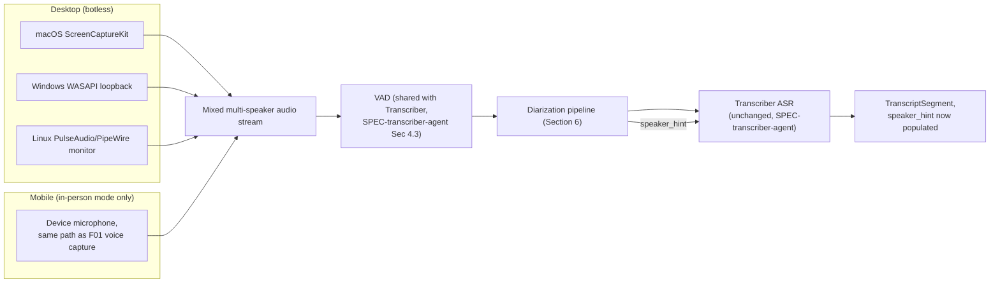
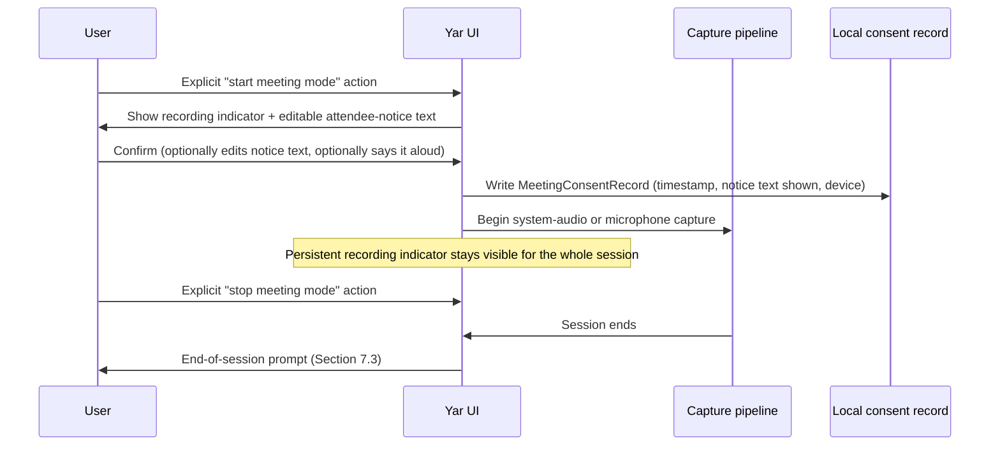

> **Status**: Draft v1 (gated: counsel review required)
> **Date**: 2026-07-19
> **Author**: @shahin (agent-drafted, founder review pending)
> **Audience**: engineers, counsel, clinical advisors, reviewers
> **Tags**: `yar`, `diarization`, `meetings`, `consent`, `biometric`, `cap`, `spec`

# SPEC: Yar Meeting Diarization (F69)

**Reading time:** about 18 minutes.
**If you only read one thing:** Section 6 (Consent gate and UX) and Section 7 (Counsel review required). Everything else in this spec, the botless capture design, the diarization pipeline, exists to serve a feature that cannot ship until those two sections clear review.

---

## BLUF

**F69 gives Yar botless, on-device meeting diarization: a person's own laptop captures system audio locally, separates who said what among the people in the room or on the call, and feeds that structure into the brainmap and PeT, with every other speaker's voiceprint discarded by default at session end unless the person explicitly says to keep it.** This spec recommends **pyannote.audio's `speaker-diarization-community-1` pipeline (CC-BY-4.0)** as the primary on-device diarization stack, with **diart (MIT)** as the streaming wrapper and **sherpa-onnx (Apache-2.0)** as the cross-platform fallback runtime, and it explicitly excludes NVIDIA's Sortformer models from the recommended stack because their license (**CC-BY-NC-4.0**) is non-commercial and incompatible with Yar's Summer 2026 for-profit plan. F69 reverses a 2026-07-18 deferral because the Transcriber's `speaker_hint` seam and the Mind-mapper's multi-speaker node support now make this concretely buildable, but it does not ship until privacy-boundary and crisis-detection gate this spec's writes and until counsel answers the questions in Section 7, because this is the first Yar feature that processes another person's speech, not only the user's own.

---

## 1. Problem

Every other Yar capture feature processes one voice: the person using Yar, talking to Yar. A meeting is different. `FEATURE-VERIFICATION.md`'s F69 row confirms this was already a known gap (`FEATURE-HIERARCHY.md` Section 5 flagged it as "subsumed under F01 but not explicit"; `CANONICAL-EDITS-SPEC.md` explicitly deferred it on 2026-07-18 with the note "defer, do not add now, keep as known gap"). This spec reverses that deferral, on the grounds `FEATURE-VERIFICATION.md` itself states: the Transcriber and Mind-mapper agents now make multi-speaker capture concretely in scope, not merely aspirational. `SPEC-transcriber-agent.md` Section 2.3 left a `speaker_hint` field on every `TranscriptSegment` specifically so this spec would not require a schema migration to land; it is `null` today and stays that way until this spec's pipeline populates it.

The honest complication `FEATURE-VERIFICATION.md` names directly: diarizing a meeting processes *other people's* speech, not only the user's own, and multi-party recording consent law varies by U.S. state (several require all-party consent), a distinct legal question from anything the crisis-detection or privacy-boundary gates already cover. `EFFORT-ESTIMATES.md` confirms diarization-specific libraries were not deep-researched in the prior estimation pass and flags F69 as carrying a legal gate, not only a technical one, recommending explicitly: "do not schedule F69's ship date assuming only engineering time." This spec closes the technical half (Sections 3 to 6, 8 to 9) and frames, without resolving, the legal half (Section 7).

For a neurodivergent adult, meetings are frequently where the invisible tax is highest: tracking who said what while also tracking the content is two simultaneous working-memory demands. A cognitive companion that quietly, locally, and consensually separates those two demands returns real capacity. A cognitive companion that does this by recording other people without their knowledge does the opposite of Yar's mission, it adds a new kind of harm the person using Yar did not ask for and the people around them did not consent to.

---

## 2. Scope and boundaries

**In scope:** research into existing meeting-note products and diarization libraries with verified July 2026 licenses (Sections 3 and 4); botless system-audio capture design per platform, desktop loopback and macOS `ScreenCaptureKit`, with an honest mobile-constraints statement (Section 5); the diarization pipeline that fills the Transcriber's `speaker_hint` seam (Section 6); speaker enrollment for the user's own voice and ephemeral per-meeting labels for everyone else (Section 6); the consent-first UX design (Section 7); the structured legal-question list for counsel (Section 8); how confirmed speaker identity becomes a PeT `Person` fact (Section 9).

**Out of scope:** the Transcriber's own ASR pipeline, consumed unchanged (`SPEC-transcriber-agent.md`); the Mind-mapper's placement and clustering logic, consumed unchanged (`SPEC-mindmapping-agent.md`); resolving the legal questions this spec raises, which is counsel's job, not this spec's (Section 8); phone-call recording as a general capability, which this spec treats as largely infeasible on current mobile platforms and out of scope beyond stating why (Section 5.3); real-time speaker-attributed translation; video capture of any kind, Yar is audio-only.

**Feature anchors.**

| Feature | One-line scope | Status in this spec |
|---|---|---|
| **F69** Meeting-mode diarization | Multi-speaker meetings get botless transcription with who-said-what separation | Primary; the whole spec |
| **F01** Voice brain dump | Extends the existing single-speaker capture loop to a multi-speaker session | Section 5, Section 6 |
| **F13** Voice-grown thought map | Multi-speaker meeting notes feed the same brainmap, with speaker attribution on nodes | Section 9, coordinating with `SPEC-mindmapping-agent.md` |
| `speaker_hint` seam | The nullable field `SPEC-transcriber-agent.md` Section 2.3 reserved | Section 6.4, this spec is the seam's only intended consumer |

**Yar is fully free, no subscription.** Every library this spec recommends for the default stack is open source and runs on-device or on the person's own local-supervisor laptop; nothing in the diarization pipeline requires a metered API key or a per-minute cloud vendor to function. This is also a legal-risk-reduction choice, not only a cost one: raw meeting audio, which by definition contains other people's speech, is the single worst category of data to send to a third-party cloud vendor under the consent questions Section 8 raises.

---

## 3. Prior-art research: existing meeting-note products (July 2026)

The founder's brief named six products to check plus the general bot-based versus botless split. Every claim below is sourced to a page fetched in this research pass, not a secondary summary of a summary.

| Product | Architecture | Consent UX pattern | Pricing/license posture | Relevance to Yar |
|---|---|---|---|---|
| **Granola** | **Botless.** Runs locally on the person's own Mac or Windows machine, capturing system audio output directly; no bot joins the call roster [per a 2026 AI-note-taker comparison](https://zackproser.com/blog/best-ai-meeting-notes-2026) | **No bot, no recording notification, no in-meeting announcement by default**; consent is left to the host's own organizational policy rather than an in-product mechanism [per the same comparison](https://www.useluminix.com/reports/industry-analysis/ai-meeting-notes-comparison-granola-vs-otter-vs-fireflies-vs-fathom-2026); Granola's own privacy post frames this as "no-bot recording," not as a replacement for informing participants [per Granola's own participant-privacy post](https://www.granola.ai/blog/ai-notetaker-participant-privacy-consent) | Proprietary SaaS, tiered subscription | **The closest architectural sibling to Yar's botless design.** Yar adopts the "no visible bot" pattern but explicitly does not adopt Granola's "no notification by default" posture, per Section 7's consent-first design |
| **Otter.ai** | **Bot-based.** A visible bot joins the call as a participant and uploads audio to Otter's cloud for transcription [per the same 2026 comparison](https://zackproser.com/blog/best-ai-meeting-notes-2026) | The bot's presence in the participant roster is itself the notice; no separate consent flow beyond that visibility | Proprietary SaaS, metered/subscription tiers | Named in a filed BIPA-adjacent class action over undisclosed voiceprint collection via its live-transcription speaker-attribution feature (Section 4, Section 8) |
| **Fireflies** | **Both.** Ships a bot-based mode and, as of early 2026, a bot-free system-audio mode for Google Meet and Microsoft Teams | For Teams, Fireflies **automatically posts a consent message in the meeting chat** when system-audio recording starts, and its Google Meet integration triggers that platform's own standard consent notification; no extra bot appears in the roster in this mode [per Fireflies' own bot-free documentation](https://fireflies.ai/blog/bot-free-meeting-recorder/) and [its knowledge-base article](https://guide.fireflies.ai/articles/6666374717-how-to-record-meetings-without-a-bot-on-the-fireflies-desktop-app) | Proprietary SaaS, metered/subscription tiers | **The strongest existing precedent for Yar's consent pattern**: an explicit, automatic, in-context notice at the moment recording starts, not merely a visible bot or a silent capture. Also the subject of a filed BIPA class action over its Speaker Recognition voiceprint feature (Section 8) |
| **Fathom** | Bot-based; unlimited free recording tier, 30-second post-call summaries [per a 2026 buyer's guide](https://zackproser.com/blog/best-ai-meeting-notes-tools-2026) | Bot visibility as notice, same pattern as Otter | Free tier plus paid tiers, proprietary | Not diarization-differentiated from Otter/Fireflies architecturally; named for completeness per the brief |
| **tl;dv** | Bot-based, with a stated GDPR-compliance emphasis in comparison coverage | Bot visibility as notice | Proprietary SaaS | Named for completeness; no botless or on-device mode found in this research pass |
| **Krisp** | Hybrid: real-time noise cancellation is on-device; meeting transcription and summarization is cloud-processed; a 2026 phone-call-recording feature exists for outgoing US calls only, tied to Krisp's own cloud pipeline [per Krisp's own feature page](https://krisp.ai/blog/introducing-call-recording-krisp-mobile/) | Standard platform-level call-recording announcements where the underlying OS requires them (see Section 5.3's iOS note) | Proprietary, freemium/subscription | Confirms that even a well-resourced 2026 vendor's phone-call recording is call-direction-restricted and US-number-restricted, supporting this spec's Section 5.3 conclusion that phone-call capture is not a general-purpose feature to build |
| **Apple Notes / iOS native call recording** | Platform-level, not a third-party app | **iOS hardcodes an audible "This call is being recorded" announcement to all parties, with no toggle to disable it**, a decision Apple made explicitly to manage legal liability [per a 2026 recording-methods roundup](https://hinoter.com/blog/how-to-record-a-phone-call-on-iphone-android-2026) | Native OS feature, no separate pricing | The strongest evidence available that even the platform vendor with the most legal resources chose loud, non-optional, all-party notice over a silent or opt-out design; Yar's own consent posture (Section 7) should not be less protective than Apple's own default |
| **Meetily** (open source, named in comparison coverage) | Botless, local system-audio capture, explicitly compared alongside Granola in bot-free rankings [per a 2026 bot-free roundup](https://meetily.ai/blog/best-meeting-notes-software-2026) | Not independently verified in this pass beyond its bot-free architecture claim | Open source | Confirms botless, local capture is a viable, already-shipping open-source pattern, not solely a proprietary one |

**The pattern this spec adopts from the market.** No major 2026 product ships a "loud, unmissable, cannot-be-silenced" consent notice for meeting capture the way Apple's iOS phone-call feature does; the closest analog among meeting tools is Fireflies' automatic in-chat consent message at recording start. Granola's "no notification by default" posture is the weakest precedent in this table, not the strongest, and this spec does not follow it (Section 7).

**The bot-based versus botless split, stated plainly.** Bot-based tools (Otter, Fathom, tl;dv, Fireflies' legacy mode) dial into the call as a visible, named participant and stream audio to the vendor's cloud. Botless tools (Granola, Fireflies' newer mode, Meetily) capture system audio locally, on the host's own machine, with no separate participant appearing in the roster. **Yar is botless by requirement, not by preference**: raw audio is `device_only` per `SPEC-transcriber-agent.md` Section 6.1 and `SPEC-cactus-routing.md`'s routing invariant, which a bot-based, cloud-upload architecture cannot satisfy at all. This is not a new decision this spec is making; it is an existing invariant this spec is the first to apply to multi-speaker audio specifically.

**Legal signal from 2026 litigation.** Both the Otter and the Fireflies BIPA-adjacent lawsuits, and a separate Microsoft Teams voiceprint suit filed 2026-02-05, turn on the same underlying claim: a speaker-attribution or "Speaker Recognition" feature generated a biometric voiceprint from a meeting participant who was not the paying customer and had not separately consented, distinct from consenting to be recorded at all [per a 2026 legal-context roundup](https://tldv.io/blog/ai-meeting-recorder-lawsuits/) and [a dedicated case summary](https://noboiler.com/blog/microsoft-teams-voiceprint). This is the single most important market fact this research surfaced: **the legal exposure is specifically about the diarization step, the voiceprint, not about transcription generally.** Section 6 and Section 8 are built around that distinction.

---

## 4. Library research and recommendation: diarization stack (July 2026)

Every entry was checked against its own repository, model card, or license file, following the same discipline `SPEC-transcriber-agent.md` Section 3 already establishes for ASR licensing.

### 4.1 Core diarization models and pipelines

| Library / model | License (verified) | What it is | Streaming? | Fit for Yar |
|---|---|---|---|---|
| **pyannote.audio** (code) | **MIT** | The reference neural building blocks for speaker diarization: segmentation, embedding, clustering | No (offline pipeline); diart wraps it for streaming | **Recommended, code dependency.** The library code itself is unambiguously permissive |
| **pyannote `speaker-diarization-community-1`** (pipeline weights) | **CC-BY-4.0**, stated to "always remain freely accessible" [per pyannoteAI's own announcement](https://www.pyannote.ai/blog/community-1) | The newest, non-gated, fully open pipeline as of this research pass | No | **Recommended, primary pipeline.** Attribution-only license, no commercial restriction, no per-model gate to manage at build time |
| **pyannote `speaker-diarization-3.1` / `segmentation-3.0`** (older weights) | Gated on Hugging Face: free for research and commercial use, but requires accepting a user agreement and generating an access token per model before download [per Hugging Face's own model pages](https://huggingface.co/pyannote/speaker-diarization-3.1) | The prior generation of pipeline weights, still widely used in 2026 tooling | No | **Usable as a fallback**, not the default; the gating is a build-and-distribution friction (a token must be provisioned per install), not a cost or field-of-use restriction, but `community-1`'s ungated CC-BY-4.0 status removes that friction entirely and is the reason it is the primary pick |
| **WhisperX** | MIT (project code); bundles Whisper transcription, forced alignment, and pyannote diarization in one pipeline | A convenience wrapper, not a new diarization algorithm; inherits whatever pyannote weights it is configured to call | No (batch pipeline) | **Not adopted as a dependency.** Yar already has its own Transcriber (whisper.cpp/faster-whisper, per `SPEC-transcriber-agent.md`); WhisperX's value is bundling ASR and diarization together, which duplicates the Transcriber rather than composing with it. Named for completeness per the brief, not recommended |
| **NVIDIA NeMo Sortformer** (`diar_sortformer_4spk-v1`, `diar_streaming_sortformer_4spk-v2.1`) | **CC-BY-NC-4.0**, non-commercial [per NVIDIA's own model cards on Hugging Face](https://huggingface.co/nvidia/diar_streaming_sortformer_4spk-v2.1); NeMo toolkit code itself is Apache-2.0 | A transformer-based, native-streaming diarization architecture reported as the strongest open-source diarization accuracy in several 2026 benchmark write-ups [per a 2026 DER benchmark roundup](https://novascribe.ai/compare/best-speaker-diarization-tools) | **Yes, native low-latency streaming**, frame-level speaker labels with timestamps as the conversation unfolds [per NVIDIA's own release description](https://www.marktechpost.com/2025/08/21/nvidia-ai-just-released-streaming-sortformer-a-real-time-speaker-diarization-that-figures-out-whos-talking-in-meetings-and-calls-instantly/) | **Excluded from the recommended stack, despite the best raw accuracy in the survey.** The model weights' CC-BY-NC-4.0 license is non-commercial, which conflicts directly with Cytognosis's own stated Summer 2026 YC for-profit consumer positioning for Yar; this is the same category of license trap `SPEC-transcriber-agent.md` Section 3.1 already flagged for April-ASR's GPL-3.0. Track as a fast-follow evaluation only if NVIDIA ever relicenses the weights, or for a strictly non-commercial research build, never for the shipping product |
| **sherpa-onnx** (k2-fsa) | **Apache-2.0** (the k2-fsa/Next-gen Kaldi code); bundles a diarization pipeline combining pyannote-3.0-derived segmentation with a **3D-Speaker CAM++ embedding model, itself Apache-2.0** [per the 3D-Speaker project's own repository](https://github.com/modelscope/3D-Speaker), plus fast clustering | Offline pipeline, with a documented speaker-diarization example in its own docs | **Recommended, cross-platform fallback runtime.** Already recommended in `SPEC-transcriber-agent.md` Section 3.1 as the ASR fallback for non-Apple embedded hardware; reusing it for diarization on the same devices avoids adding a second runtime. Its own docs caveat that individual bundled models should have their licenses checked case by case, which this table already does for the specific models it bundles |
| **diart** (juanmc2005) | **MIT** | The reference streaming wrapper around pyannote.audio models: incremental clustering that gets more accurate as a conversation progresses, purpose-built for real-time speaker diarization [per the project's own repository](https://github.com/juanmc2005/diart) | **Yes**, its stated purpose | **Recommended, streaming layer.** This is the library that turns pyannote's offline pipeline into the incremental, turn-by-turn diarization Yar's live-capture UX needs; it is also the official reference implementation of the overlap-aware online diarization research this spec's Section 6.2 pipeline follows |
| **FluidAudio** | **MIT/Apache-2.0** models converted to Core ML [per the project's own repository](https://github.com/FluidInference/FluidAudio) | An Apple-platform Swift package bundling VAD, ASR, and speaker diarization, running on the Neural Engine, avoiding CPU/GPU load | **Yes**, online and offline diarization pipelines | **Recommended, Apple-platform device-tier pick**, the direct diarization-side counterpart to `SPEC-transcriber-agent.md`'s WhisperKit recommendation for ASR. Its CoreML-native, Neural-Engine-tuned design is the best-fit option for iOS and macOS specifically |
| **3D-Speaker** (Alibaba, ModelScope) | **Apache-2.0** [confirmed against the repository](https://github.com/modelscope/3D-Speaker) | A speaker-verification, recognition, and diarization toolkit; its CAM++ embedding model is the one sherpa-onnx bundles | No (research toolkit, not a streaming product) | **Not adopted directly**; consumed indirectly through sherpa-onnx's bundling. Named because the brief asked for it explicitly and because its license is the reason sherpa-onnx's diarization bundle is safe to ship |
| **Silero VAD** | **MIT**, "zero strings attached, no telemetry, no registration" [per the project's own repository](https://github.com/snakers4/silero-vad) | Voice-activity detection, already the VAD `SPEC-transcriber-agent.md` Section 4.3 names as an acceptable choice for the ASR pipeline | Yes, designed for real-time use | **Reused, not re-adopted.** Diarization needs the same speech/silence gate the Transcriber already uses; this spec does not introduce a second VAD choice, it reuses whichever VAD the device-tier Transcriber implementation settles on (`SPEC-transcriber-agent.md` OQ-4) |

### 4.2 Speaker embedding models (referenced inside the pipelines above)

| Model | License | Where it appears |
|---|---|---|
| **ECAPA-TDNN** | Distributed via SpeechBrain (Apache-2.0 toolkit) or NVIDIA NeMo (model use governed by the NeMo toolkit's own license terms) | The embedding backbone inside pyannote's own pipelines and a common default for custom diarization builds |
| **TitaNet** | Distributed via NVIDIA NeMo | An alternative speaker-embedding architecture inside the NeMo ecosystem; not adopted here because this spec does not adopt NeMo's Sortformer diarization pipeline (Section 4.1) and does not need a second embedding source outside pyannote's own bundled embedding model |
| **CAM++** (3D-Speaker) | Apache-2.0 | The embedding model sherpa-onnx's diarization example bundles (Section 4.1); the actual embedding backbone Yar's sherpa-onnx fallback path uses |

### 4.3 Recommended stack per tier

| Tier | Recommendation | Rationale |
|---|---|---|
| **Apple platforms (iOS, macOS), on-device** | **FluidAudio** (MIT/Apache-2.0 CoreML models) | Matches `SPEC-transcriber-agent.md`'s WhisperKit recommendation for the same platform family; Neural-Engine-native, no separate Python runtime needed on a phone |
| **Cross-platform on-device (Android, Windows, Linux) or local-supervisor laptop** | **pyannote.audio (MIT code) + `speaker-diarization-community-1` (CC-BY-4.0 pipeline) wrapped by diart (MIT) for streaming** | Ungated weights, permissive attribution-only license, and the streaming wrapper is the reference implementation for exactly this use case, not a third-party guess at how to stream pyannote |
| **Cross-platform fallback, constrained or embedded hardware** | **sherpa-onnx (Apache-2.0)**, reusing the 3D-Speaker CAM++ embedding it bundles | Already the named ASR fallback in `SPEC-transcriber-agent.md`; one fewer runtime to maintain on the same constrained-hardware class |
| **Excluded from every tier** | NVIDIA Sortformer (CC-BY-NC-4.0) | Best raw accuracy in the 2026 survey, disqualified on license grounds alone for a for-profit consumer product; do not reach for it under accuracy pressure without reopening the license question at a founder level first |

**No cloud diarization vendor is evaluated or adopted.** Every diarization vendor a founder might otherwise consider (a hosted Otter/Fireflies-style API) requires raw meeting audio, including other people's voices, as input by construction. This is a stronger exclusion than the one `SPEC-transcriber-agent.md` Section 3.3 already applies to single-speaker cloud STT: it is not only Yar's own privacy invariant at stake, it is every other meeting participant's voice being sent to a third party they never agreed to send it to.

---

## 5. Architecture: botless capture per platform

### 5.1 Desktop (macOS)

Yar captures system audio via **`ScreenCaptureKit`**, Apple's media-capture API, which can record system audio tied to a capture session without requiring a screen-share or a visible recording indicator from the meeting app's own perspective [per a 2026 macOS audio-capture deep dive](https://www.recall.ai/blog/macos-screencapture-api). This is the same mechanism Granola and other botless macOS tools already use in production (Section 3). One documented limitation carries through unchanged: `ScreenCaptureKit`'s captured audio is not isolated from other system sounds, if a notification chimes or music plays during the meeting, it is part of the same capture stream, and Yar does not attempt to filter it beyond whatever noise-suppression the ASR pipeline already applies.

### 5.2 Desktop (Windows, Linux)

Windows loopback capture uses **WASAPI** in loopback mode, the standard mechanism for capturing "everything heard through speakers or headphones" [per Microsoft's own sample documentation](https://learn.microsoft.com/en-us/samples/microsoft/windows-classic-samples/applicationloopbackaudio-sample/) and a 2026 cross-platform capture tool that pairs WASAPI on Windows with `ScreenCaptureKit` on macOS under one interface [per that project's own repository](https://github.com/huxinhai/audiotee-wasapi). Linux capture runs through the platform's existing audio server (PulseAudio or PipeWire monitor sources); this spec does not fix a specific Linux library choice, leaving it to the device-tier implementation task, consistent with `SPEC-transcriber-agent.md`'s own pattern of not over-specifying implementation-level choices this spec has no new information to resolve.

### 5.3 Mobile: the honest constraint

**Phone-call capture is mostly infeasible on current mobile platforms, and this spec does not attempt to build it as a general capability.** The state of the platforms as of July 2026:

- **iOS**: no app can silently record a phone call. Apple's own native call-recording feature (iOS 18 onward) plays a hardcoded, non-disableable audible announcement, "This call is being recorded," to every party on the call, a decision Apple made specifically to manage legal liability, and there is no developer-facing API or Shortcut automation that bypasses it [per a 2026 recording-methods roundup](https://hinoter.com/blog/how-to-record-a-phone-call-on-iphone-android-2026).
- **Android**: Google banned third-party call-recording apps from accessing call audio on the Play Store in 2022; the only reliable path today is a phone manufacturer's own native recording feature (Pixel, Samsung, Xiaomi, and others vary), not a Yar-installable capability [per the same roundup](https://hinoter.com/blog/how-to-record-a-phone-call-on-iphone-android-2026).
- Even a well-resourced 2026 vendor's answer to this problem, **Krisp's phone-call recording feature, is restricted to outgoing calls from a US phone number only**, on both platforms [per Krisp's own feature announcement](https://krisp.ai/blog/introducing-call-recording-krisp-mobile/), which is the clearest available market evidence that this is a platform ceiling, not a vendor competence gap.

**What mobile does support: in-person meeting mode.** A phone held on a table during an in-person meeting, using its own microphone rather than call audio, is architecturally identical to the desktop system-audio case from the diarization pipeline's point of view, a single mixed-audio stream with multiple voices in it, just captured via the device microphone instead of a loopback tap. This is the mobile use case F69 actually builds for: a person's own phone, in their own hand or on their own table, in a room with other people, using ordinary microphone permission, not a call-audio interception. No new capture mechanism is needed beyond what `SPEC-transcriber-agent.md`'s existing microphone-capture pipeline already provides; the diarization pipeline (Section 6) layers on top of that existing audio path unchanged.

### 5.4 Capture architecture diagram

**No meeting bot ever joins a call.** There is no participant Yar adds to any video conferencing roster, no dial-in, no calendar-integration-triggered auto-join. This is a stronger posture than Granola's own architecture (which is also botless but, per Section 3, ships no in-product consent notice); Yar's botless design is paired with the mandatory consent gate in Section 7, not offered as an alternative to it.

---

## 6. Diarization pipeline

### 6.1 Pipeline stages

```mermaid
flowchart LR
  IN["Mixed audio stream (Section 5)"]
  VAD["Voice Activity Detection\n(shared with Transcriber)"]
  SEG["Speaker segmentation\n(pyannote / FluidAudio / sherpa-onnx)"]
  EMB["Speaker embedding extraction\n(pyannote bundled embedding / CAM++)"]
  CLUS["Clustering: agglomerative (offline)\nor incremental (diart, streaming)"]
  ENR["Enrollment match\n(Section 6.3)"]
  LABEL["Per-meeting speaker labels\n(Speaker A / B / ... or enrolled name)"]
  IN --> VAD --> SEG --> EMB --> CLUS --> ENR --> LABEL
  LABEL -->|"populates"| HINT["TranscriptSegment.speaker_hint"]
```

### 6.2 Offline versus streaming clustering

Two modes are supported, mirroring the honest tradeoff `SPEC-transcriber-agent.md` Section 4.2 already draws for ASR partials:

- **Offline (post-meeting) mode**: the full meeting's embeddings are clustered once, agglomeratively, after the meeting ends. Higher accuracy, because the clustering algorithm sees the whole conversation at once; no live speaker labels during the meeting itself.
- **Streaming (live) mode**: **diart**'s incremental clustering assigns a provisional speaker label as each turn is spoken, improving in accuracy as the conversation progresses, the same "gets more accurate as the conversation progresses" behavior its own documentation describes (Section 4.1). Provisional live labels can be revised as more audio arrives, the diarization analog of the ASR partial-hypothesis flicker `SPEC-transcriber-agent.md` Section 4.2 already documents; the UI should apply the same dimmed-versus-final visual treatment that spec recommends for ASR partials.

**Recommendation: ship offline mode first.** A live-caption-style "who is talking right now" indicator is a genuine UX nice-to-have, not the feature's core value, which is the finished, correctly-attributed transcript and brainmap. Streaming mode is a fast-follow once offline mode's accuracy is validated against Yar's own meeting recordings, not a v1 requirement.

### 6.3 Speaker enrollment and ephemeral labeling

- **The user's own voice profile**: enrolled once, locally, the same way any biometric-adjacent local profile would be (a short guided recording, or bootstrapped from the person's existing single-speaker Yar sessions where they are already the only voice present). Stored on-device only, under the same encryption posture `SPEC-data-sovereignty.md` Section 4 already requires for every other local data class. This is the one voiceprint in the system with unambiguous, direct, first-party consent, because it is the person's own device and their own explicit enrollment action.
- **Every other speaker in a meeting**: labeled `Speaker A`, `Speaker B`, and so on, for the duration of that single meeting only. These labels are **ephemeral by default**: the underlying voice embedding used to tell "Speaker A" apart from "Speaker B" within one meeting is discarded at session end, along with the ephemeral label mapping, unless the person using Yar explicitly confirms they want to keep it (Section 7.3).
- **Optional user-assigned names**: within a single meeting, the person using Yar may rename `Speaker A` to `Priya` in the moment, for their own note-taking clarity. This rename is a local, in-session label, not by itself a cross-session identity resolution; it becomes a durable PeT `Person` fact only through the explicit confirmation path in Section 9, never automatically.

### 6.4 Filling the `speaker_hint` seam

`SPEC-transcriber-agent.md` Section 2.3 defines `speaker_hint` as "a nullable, opaque local identifier (`speaker_0`, `speaker_1`, or `null`)," always `null` in that spec's own v1, reserved specifically for this spec. This spec is the only intended writer of a non-null `speaker_hint` value. Populated values remain **per-session, opaque local identifiers** (`speaker_0`, `speaker_1`, mapped to whatever ephemeral or enrolled label the UI shows) exactly as that spec anticipated; this spec does not promote `speaker_hint` to a durable cross-session identity by itself. `SPEC-transcriber-agent.md`'s own risk table flags exactly this failure mode ("an engineer could populate `speaker_hint` with a real, cross-session-resolved identity ahead of `SPEC-meeting-diarization.md` landing, effectively shipping diarization without its legal-review gate"); this spec is the landing that risk was waiting for, and it still does not cross that line without the explicit confirmation in Section 9.

### 6.5 Routing

Diarization runs edge-first, on the same device or local-supervisor machine doing capture, never escalating to a cloud target, for the same reason raw audio is `device_only` under `SPEC-cactus-routing.md`: a speaker embedding derived from raw audio is at least as sensitive as the audio itself (Section 8 discusses why it may be more sensitive, as biometric data). No exception to this routing row is proposed anywhere in this spec.

---

## 7. Consent gate and UX

This is the section the whole feature's legitimacy depends on. **Recording other people without a clear, unmissable signal is not a UX preference Yar can trade off for a smoother capture flow.**

### 7.1 Design principles, ranked against the market

| Principle | Yar's design | Compare to Section 3's research |
|---|---|---|
| **Explicit start action, never automatic** | The person using Yar must tap or say a distinct "start meeting mode" action; F69 never auto-triggers from a calendar event or a detected call | Stronger than any bot-based tool's implicit "bot joined the roster" notice |
| **A persistent, visible recording indicator on the capturing device** | A always-visible, non-dismissable indicator (a colored dot or bar) stays on screen for the entire capture, on the device doing the capturing | Matches the spirit of iOS's own hardcoded call-recording announcement (Section 5.3), adapted to a visual rather than audible signal since Yar is not intercepting a phone call |
| **Attendee-notification guidance, not attendee-notification automation** | Yar surfaces a copyable, editable notice text ("I'm using Yar to take notes on who said what in this meeting; let me know if that's not okay") the person can say aloud or paste into a chat, the same shape as Fireflies' automatic in-chat consent message (Section 3), but user-invoked rather than automatic, since Yar has no channel of its own into a third-party meeting app's chat | Adopts Fireflies' pattern (an explicit, in-context notice) over Granola's (no notice), while accepting the honest limit that Yar, being botless and having no meeting-platform integration, cannot post the notice itself the way a bot-based or platform-integrated tool can |
| **Per-meeting consent record, stored locally** | Every meeting-mode session writes a local, timestamped record: capture started, the notice text shown to the user at that moment, whether the user indicated they had informed attendees | This is new relative to every product in Section 3's table; none of them expose this as a durable local record the person can review later |
| **Default-off retention of other people's voices** | Section 6.3's ephemeral-by-default rule; nothing about another person's voice persists past the session unless explicitly confirmed | Stronger than any bot-based product surveyed, all of which retain full audio and voiceprints on a vendor's server by default |
| **CAP governs everything downstream** | Once `speaker_hint` is populated and any structured extraction happens, every existing CAP-Lite check (`SPEC-multi-agent.md` Section 7.4), the crisis gate, and the privacy-boundary PEP apply unchanged; this spec adds no new bypass |

### 7.2 The start-of-capture flow

### 7.3 End-of-session retention prompt

At the end of every meeting-mode session, before any non-enrolled speaker's embedding is discarded, Yar surfaces one prompt: **"Keep voice profiles for the other speakers in this meeting, so Yar can recognize them next time? Off by default."** A "yes" answer is scoped to the specific speakers the person marks, not a blanket setting; a "no" answer, or no answer within the session, discards every non-enrolled embedding. This is the single most important default in this spec: **retention is opt-in, per person, per session, every time**, never a one-time toggle that quietly applies to every future meeting.

### 7.4 What the UX explicitly does not do

Yar does not silently start meeting mode from a detected calendar event, does not auto-join a video call as a participant (there is no participant to auto-join as, Section 5.4), does not send any notice on the person's behalf into a third-party meeting chat without their explicit action, and does not retain any non-enrolled speaker's voice data without a fresh, per-session confirmation.

---

## 8. Counsel review required (structured questions, not answers)

This section frames the legal questions counsel must answer before F69 ships. **Every question below carries the engineering assumption this spec made pending that review; none of these assumptions are a substitute for legal sign-off**, per the same posture `MODULE-crisis-detection.md` and `privacy-boundary-spec.md` already take toward their own open, counsel-owned decisions.

| # | Legal question | Engineering assumption made pending review |
|---|---|---|
| **CQ-1** | Which U.S. states require all-party consent for recording a conversation, and does Yar's meeting-mode UX (Section 7) satisfy that standard in each, given that Yar itself has no channel to notify attendees directly and relies on the user to do so? | Assumed: the Section 7.1 "attendee-notification guidance, not automation" design is a reasonable good-faith effort, but engineering cannot determine whether user-relayed notice satisfies a given state's legal notice requirement; ship gating on counsel confirming this, market by market |
| **CQ-2** | Does a speaker embedding (a voiceprint used only to tell "Speaker A" from "Speaker B" within one meeting, never persisted) constitute a biometric identifier under Illinois BIPA even when it is ephemeral and discarded at session end? | Assumed: ephemerality reduces risk relative to the Fireflies and Microsoft Teams cases in Section 3.1/3.2 (both of which involved persisted, cross-session voiceprints), but engineering cannot determine whether BIPA's "collection" trigger is satisfied by transient, in-session processing alone; counsel must confirm before any BIPA-covered jurisdiction is treated as safe by default |
| **CQ-3** | Under GDPR, is a transient, session-scoped speaker embedding "special category" biometric data under Article 9, given that Article 9 applies specifically to processing that enables identifying or verifying a person, which is exactly what within-meeting diarization does even without persisting the result? | Assumed: yes, conservatively, since diarization's whole purpose is speaker identification within the session; this spec's Section 7.3 default (discard unless explicitly retained) is designed as if Article 9's explicit-consent bar applies, not as if it does not, but counsel must confirm this is the correct conservative posture and whether explicit per-session consent (Section 7.2) satisfies Article 9(2)(a) |
| **CQ-4** | If a person opts to retain another speaker's voice profile (Section 7.3) across future meetings, does that retained profile require separate, renewed consent from that other speaker, who was not the one who tapped "yes"? | Assumed: the retaining decision is made by the Yar user, not the retained speaker, which this spec flags as a real gap; engineering's default (Section 7.3) requires a fresh per-session prompt precisely to minimize this exposure, but counsel must determine whether a cross-session retained voiceprint of a non-user requires that other person's own direct consent, not only the Yar user's |
| **CQ-5** | What retention limits apply to (a) the local consent record (Section 7.2's `MeetingConsentRecord`) and (b) any retained non-enrolled speaker profile (Section 7.3), under both BIPA's retention-schedule requirement and GDPR's storage-limitation principle? | Assumed: no fixed retention period is set in this spec; both records persist until the user deletes them, consistent with `SPEC-data-sovereignty.md`'s general retraction-as-a-right posture, but counsel must set an actual maximum, if one is legally required, separate from the general op-log retention decision `SPEC-multi-agent.md` O-5 already flags as pending |
| **CQ-6** | Does Yar's own Terms of Service or in-app disclosure need explicit language covering third-party (non-user) voice processing, distinct from the existing single-user privacy policy language that covers only the person who installed Yar? | Assumed: yes, a distinct disclosure is needed; no such language exists in any reviewed Yar document as of this spec, and drafting it is explicitly counsel's task, not engineering's |
| **CQ-7** | Does the in-person mobile use case (Section 5.3, phone microphone capturing a room of people) carry a different consent standard than a desktop system-audio capture of a video call, given that some state wiretapping statutes distinguish "oral communication" in a place where privacy is or is not reasonably expected? | Assumed: no difference is assumed at the engineering level; the same Section 7 consent flow applies to both capture paths, but counsel must confirm whether an in-person setting changes the applicable consent standard in any target launch state |

**Nothing in Section 8 is resolved by this spec.** Every assumption above is an engineering placeholder, stated so a reviewer can see exactly what would break if counsel answers differently, not a claim that the placeholder is correct.

---

## 9. PeT integration

Diarization output feeds PeT (`SPEC-petkg-longmemory.md`) through the same `Person` node type every other Yar feature already uses, with one additional rule this spec introduces: **who-said-what becomes a durable PeT fact only with explicit user confirmation, never automatically from diarization alone.**

| Step | What happens | Confirmation required? |
|---|---|---|
| Within-meeting speaker separation (`Speaker A`, `Speaker B`) | `speaker_hint` populated per Section 6.4; brainmap nodes carry a per-meeting speaker attribution | No; this is the same additive, always-undoable placement behavior `SPEC-mindmapping-agent.md` Section 5.2 already defines for ordinary node placement |
| User renames `Speaker A` to a name in-session (Section 6.3) | A local, in-session label only | No; this is UI convenience, not a PeT write |
| Promoting an in-session name to a durable PeT `Person` fact, linked to future sessions | `pet.assert_fact` writes a `Person` node (or a `MENTIONS`/`RELATES_TO` edge to an existing one) with `asserted_by: yar.meeting-diarization.v1` and the PeT confidence default for agent-inferred facts (0.6, per `SPEC-petkg-longmemory.md` Section 4.3) | **Yes, always.** This is a stronger bar than the Mind-mapper's own placement rules, which allow additive node placement without confirmation (`SPEC-mindmapping-agent.md` Section 5.2); a cross-session identity claim about another real person is treated like the Mind-mapper's `move_node`/`merge`/`split` ops, always requiring explicit confirmation, never an automatic write |
| Retained speaker voice profile (Section 7.3) | Stored locally, scoped to recognizing that specific person across future sessions, never uploaded, never included in any `Directive`, `ExecutionReport`, or `CrossBoundarySignal`, per the same Device-local classification `SPEC-petkg-longmemory.md` Section 9 already applies to every PeT fact | Confirmed once at retention time (Section 7.3); no separate confirmation on each subsequent recognition event |

This is deliberately more conservative than the Mind-mapper's own conservatism contract for the person's own thoughts: a `Person` fact about someone other than the Yar user is qualitatively different from a `move_node` on the user's own brainmap, because it makes a durable claim about a real third party who has not seen or confirmed it. The gate is always-confirm, with zero carve-outs, matching the strictness `SPEC-mindmapping-agent.md` Section 5.2 reserves only for its riskiest structural ops.

---

## 10. Gates

**F69 does not ship until all three of the following clear, in addition to the counsel questions in Section 8:**

| Gate | What it is | Why F69 depends on it |
|---|---|---|
| **G01: privacy-boundary schema** (`privacy-boundary-spec.md`) | The full `CrossBoundarySignal` schema-validated PEP and PDP runtime, today deferred post-YC per that spec's own Section 0 | Speaker embeddings and confirmed `Person` facts are exactly the kind of sensitive, potentially biometric-adjacent data this spec's Section 3 classification exists to gate; F69 should not write data this sensitive against a boundary schema that is not yet enforced end to end |
| **G02: crisis-detection** (`MODULE-crisis-detection.md`) | The full tiered `CrisisDecision` module, today also deferred post-YC, with only the `CapLiteGuard` keyword gate shipped | A multi-speaker transcript can surface a crisis signal from someone other than the Yar user; the module's existing design (Section 5, tiered signals) was scoped around a single speaker's own words, and this spec does not attempt to resolve how the tiered module should treat a third party's crisis-adjacent speech, only flags that F69 must not ship ahead of that module existing in a form that has considered the question |
| **Counsel review** (Section 8) | Sign-off on CQ-1 through CQ-7 | Stated directly in the mission for this spec: this is the first Yar feature that processes another person's speech, and no engineering decision in this document substitutes for that review |

This is a stricter gating chain than any other Wave 0 or Wave 1 Yar spec, deliberately: F69 is the one feature in the entire catalog where the person whose data is at risk is not the person who installed Yar.

---

## 11. Risks

| Risk | Description | Mitigation |
|---|---|---|
| **BIPA and GDPR exposure from voiceprint processing** | Section 3's 2026 litigation wave shows this is not a theoretical risk; Otter, Fireflies, and Microsoft have all been sued over exactly this category of feature | Section 6.3's ephemeral-by-default design and Section 8's structured counsel questions are this spec's answer; F69 does not ship ahead of Section 10's gates |
| **NVIDIA Sortformer license trap** | Sortformer has the best raw accuracy in the 2026 survey (Section 4.1); a future engineer optimizing for accuracy alone could reach for it without re-checking its CC-BY-NC-4.0 license | This spec's license table is the citable record; a CI license-scan step, matching the pattern `SPEC-transcriber-agent.md` Section 7 already establishes for April-ASR, should treat any PR introducing Sortformer weights as a license-review blocker |
| **`speaker_hint` misuse ahead of this spec's own gates** | `SPEC-transcriber-agent.md`'s own risk table already names this: an engineer could populate `speaker_hint` with a resolved cross-session identity before this spec's confirmation gate (Section 9) is actually implemented | Code review should reject any PR that writes a durable PeT `Person` fact from diarization output without a traceable, explicit user-confirmation event in the same change |
| **Attendee notice is user-relayed, not Yar-enforced** | Because Yar is botless and has no channel into a third-party meeting platform's own chat or roster, Section 7.1's notice-text pattern depends on the user actually saying or posting it | Honestly stated, not hidden: Section 7.1's table states this limitation plainly; a future revision could explore platform-specific integrations (a calendar-linked pre-meeting reminder) as a UX improvement, not a compliance substitute |
| **Mobile expectation mismatch** | A person expecting Yar to record phone calls the way Krisp's limited feature does may be confused that F69 does not offer this | Section 5.3 is written to be read by product and support, not only engineers; the in-app framing of meeting mode should describe it explicitly as "in-person and desktop-call mode," not "phone call recording" |
| **Retention prompt fatigue leading to accidental "yes"** | If the Section 7.3 end-of-session prompt appears after every meeting, a person accustomed to dismissing dialogs could retain a voiceprint they did not mean to keep | Default answer on no response is "no" (discard), never "yes"; the prompt's affirmative action must be a deliberate, named-speaker selection, not a single blanket "keep everything" button |
| **Cross-jurisdiction consent complexity for remote meetings** | A call with participants across multiple U.S. states or countries makes "which jurisdiction's consent rule applies" genuinely unresolved even after counsel review of Yar's own home jurisdiction | Flagged explicitly as CQ-1 and CQ-7; this spec does not attempt an engineering answer to a question that depends on which state's or country's law a court would apply to a specific call |

---

## 12. Test plan

| Test | What it verifies |
|---|---|
| **Botless capture confirmation** | A scripted test confirms no network call, calendar integration, or video-conferencing API ever adds a participant to any call; capture is verified to originate only from local system-audio or microphone APIs (Section 5) |
| **`speaker_hint` population correctness** | A scripted multi-speaker recording produces `TranscriptSegment` ops whose `speaker_hint` values correctly separate the known speakers, benchmarked against a labeled fixture set |
| **Ephemeral embedding discard** | A scripted session with no retention confirmation (Section 7.3) asserts that no non-enrolled speaker embedding persists past session end, verified by inspecting on-device storage after the session closes |
| **Retention requires explicit per-session confirmation** | A scripted session confirms that a "no answer" or "no" response at the end-of-session prompt results in discard, and that a "yes" response is scoped only to the specific speaker(s) marked, never all speakers by default |
| **PeT `Person` fact requires confirmation** | A scripted session asserts no `Person` fact is ever written via `pet.assert_fact` from diarization output without a traceable, explicit user-confirmation event, mirroring the same "no silent structural writes" test pattern `SPEC-mindmapping-agent.md` Section 14 already establishes for `move_node`/`merge`/`split` |
| **Consent record completeness** | Every meeting-mode session produces a local `MeetingConsentRecord` (Section 7.2) with a non-empty notice text and a start timestamp; a session started without this record is treated as a test failure, not an edge case |
| **Recording indicator persistence** | The visible recording indicator (Section 7.1) is asserted present for the full duration of every capture session in a scripted UI test, with no code path that can silently suppress it |
| **License-scan gate** | CI greps build manifests and model-download manifests for NVIDIA Sortformer weights (CC-BY-NC-4.0) and fails the build if found without a signed-off exception, matching the pattern already established in `SPEC-transcriber-agent.md` Section 7 |
| **CAP-Lite and crisis-gate interception, multi-speaker** | A scripted session includes a crisis-adjacent phrase attributed to a non-enrolled speaker; the test asserts `CapLiteGuard` still intercepts it before any downstream agent sees it, exercising the same gate `SPEC-multi-agent.md` Section 7.4 defines, now with a non-user speaker as the source |
| **Mobile in-person mode reuses existing capture path** | A scripted test confirms meeting mode on mobile uses the same microphone-permission and capture path F01 already uses, introducing no new platform permission or capability |

---

## 13. Open questions (each with a recommendation)

| # | Question | Recommendation | Blocker |
|---|---|---|---|
| **OQ-1** | Should streaming (live) diarization ship in v1, or only offline (post-meeting) diarization? | Ship offline first (Section 6.2); streaming is a fast-follow once offline accuracy is validated against Yar's own recordings, not a v1 requirement | None; a v1 scoping choice, not a technical unknown |
| **OQ-2** | Should Yar attempt any platform-specific integration (calendar-linked pre-meeting reminders, meeting-platform chat posting) to strengthen the attendee-notification pattern beyond user-relayed text (Section 7.1's honest limitation)? | Not for v1. Explore only after the core consent-first UX ships and real usage shows the user-relayed pattern is insufficient in practice; do not build platform integrations speculatively ahead of that evidence | Product and UX discretion, not a technical blocker |
| **OQ-3** | Which launch markets does F69 need consent-law clearance for first? | Follow whatever launch-market decision `MODULE-crisis-detection.md` Section 0 eventually settles for its own hotline set (the same US-vs-Iran-first question); F69's consent-law review should scope to the same first launch market(s), not attempt every US state and every GDPR jurisdiction simultaneously | Shared with `MODULE-crisis-detection.md`'s own open founder decision |
| **OQ-4** | Should enrolled-speaker recognition (the user's own voice profile, Section 6.3) ever be used to auto-start meeting mode when the enrolled voice is detected alongside unfamiliar voices? | No, explicitly. This would reintroduce automatic, non-explicit capture start, directly contradicting Section 7.1's first design principle; do not build this even as a convenience feature | Design principle, not open for revisiting without reopening Section 7's whole consent posture |
| **OQ-5** | Should retained non-enrolled speaker profiles (Section 7.3) ever be shared or merged across the enrolled user's multiple devices, the way other PeT facts sync? | No leaning yet; this compounds CQ-4's unresolved question (does a retained third party's voiceprint need their own consent) with `SPEC-sync-protocol.md`'s general multi-device sync design. Do not build cross-device sync for retained speaker profiles ahead of CQ-4's resolution | Blocked on Section 8's counsel review, specifically CQ-4 |
| **OQ-6** | What happens if a diarization pass is ambiguous, for example, two speakers with very similar voices, or heavy cross-talk? | Surface the ambiguity honestly in the UI (an "unclear" or merged-speaker label) rather than forcing a confident-looking but wrong split; this matches the same "hedge below threshold" principle `SPEC-multi-agent.md` Section 8.5 already applies to low-confidence PeT facts | Engineering discretion at implementation time; no new principle needed beyond the one already established elsewhere in the corpus |

---

## Cross-references

- `SPEC-transcriber-agent.md` Section 2.3, Section 5.1: the `speaker_hint` seam this spec is the sole intended consumer of, and the ASR pipeline this spec's diarization stage feeds into unchanged.
- `SPEC-multi-agent.md` Section 2, Section 7.3, Section 7.4: canonical agent naming (this spec introduces `yar.meeting-diarization.v1` as a new worker under the same naming rule), the privacy-boundary constraint table, and the CAP-Lite gate every transcript, single- or multi-speaker, passes through unchanged.
- `SPEC-mindmapping-agent.md` Section 5, Section 9: the conservatism contract this spec's Section 9 deliberately holds to a stricter bar for third-party `Person` facts, and the multi-speaker meeting-notes consumption this spec's brief names as the downstream use case.
- `SPEC-petkg-longmemory.md` Section 4, Section 9: the `Person` node type, the bitemporal fact envelope, and the Device-local privacy classification this spec's Section 9 writes into unchanged.
- `MODULE-crisis-detection.md`, `privacy-boundary-spec.md`: both cited as Gate G01 and G02 in Section 10; both currently deferred post-YC (decision D5) per their own Section 0, a dependency this spec inherits rather than resolves.
- `SPEC-data-sovereignty.md` Section 4, Section 5: the encryption and consent-gate posture this spec's Section 6.3 and Section 7.3 extend to speaker enrollment data and retained third-party voice profiles specifically.
- `SPEC-cactus-routing.md`: the routing invariant Section 6.5 restates for diarization specifically, inherited from the same `device_only` classification already applied to raw audio.
- `_planning-20260719/FEATURE-VERIFICATION.md`: the F69 row this spec formalizes, including the 2026-07-18 deferral this spec reverses and the counsel-review recommendation Section 8 answers with structure, not resolution.
- `_planning-20260719/EFFORT-ESTIMATES.md`: the note that diarization-specific libraries were not deep-researched in that pass and that F69 carries a legal gate distinct from its engineering estimate; this spec is the closure of that research gap.

---

<strong>Glossary</strong>

- **Botless capture:** Recording a meeting by capturing system audio or microphone input locally, with no bot or additional participant joining the call as a visible attendee. Contrasted with bot-based capture (Otter, Fathom, tl;dv), where a named participant joins and streams audio to a vendor's cloud.
- **Diarization:** The process of segmenting an audio stream and labeling which segments belong to which speaker, "who said what," distinct from transcription, which converts speech to text without speaker attribution.
- **Speaker embedding / voiceprint:** A numeric vector representation of a person's vocal characteristics, used to tell speakers apart (within a meeting) or recognize a specific enrolled speaker (across meetings). Potentially biometric data under GDPR Article 9 and Illinois BIPA (Section 8).
- **Ephemeral speaker label:** A per-meeting, non-persistent label (`Speaker A`, `Speaker B`) assigned during diarization and discarded at session end by default, per Section 6.3 and Section 7.3.
- **Speaker enrollment:** The one-time, explicit, local process by which the Yar user's own voice is registered so Yar can recognize them specifically as distinct from other meeting participants.
- **`speaker_hint`:** The nullable field on `TranscriptSegment` (`SPEC-transcriber-agent.md` Section 5.1), reserved for this spec, populated with a per-session opaque speaker identifier once diarization runs.
- **CC-BY-NC-4.0:** Creative Commons Attribution-NonCommercial 4.0, the license covering NVIDIA's Sortformer diarization model weights; incompatible with Yar's for-profit consumer product plan, hence excluded (Section 4.1).
- **CC-BY-4.0:** Creative Commons Attribution 4.0, the license covering pyannote's `speaker-diarization-community-1` pipeline; permissive, attribution-only, no commercial restriction.
- **BIPA:** The Illinois Biometric Information Privacy Act, which treats a voiceprint as a biometric identifier requiring written notice and consent before collection; the subject of active 2026 litigation against Otter.ai, Fireflies.AI, and Microsoft Teams (Section 3, Section 8).
- **G01, G02:** This spec's own shorthand (Section 10) for the two existing spec-level gates, privacy-boundary schema and crisis-detection, that F69 depends on clearing before it ships, in addition to counsel review.

