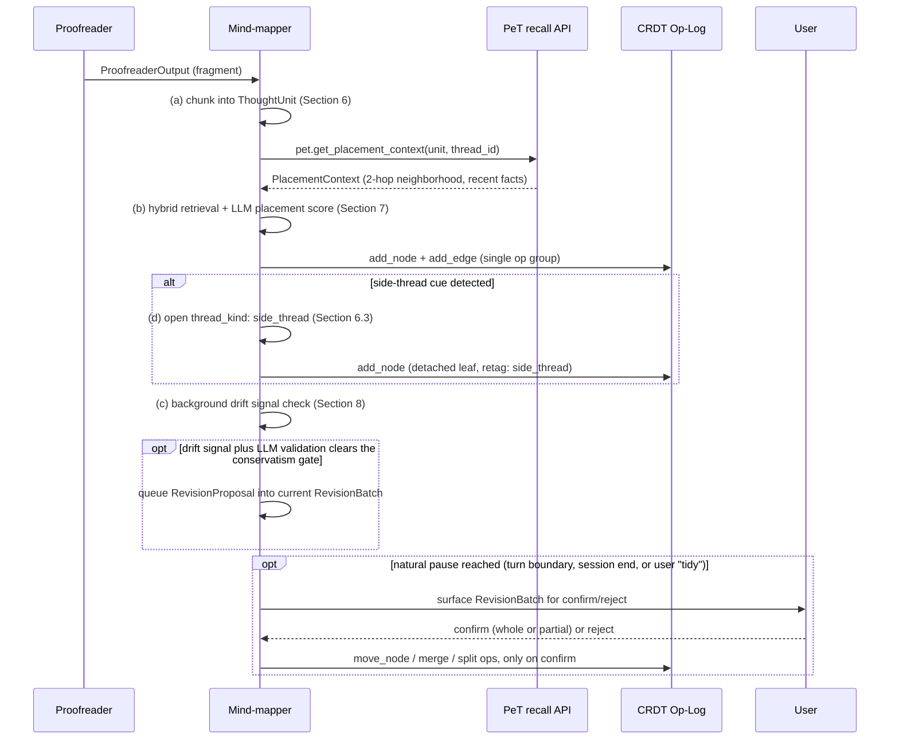

> **Status**: Draft v1
> **Date**: 2026-07-19
> **Author**: @shahin (agent-drafted, founder review pending)
> **Audience**: engineers
> **Tags**: `yar`, `mindmapper`, `brainmap`, `clustering`, `structure-inference`, `petkg`, `spec`

# SPEC: Yar Mind-mapper Agent

**Reading time:** about 17 minutes.
**If you only read one thing:** Section 5 (the conservatism contract). It is the promise the flagship brainmap depends on: a map that grows with a person's thinking without ever quietly reorganizing what that person built by hand.

---

## BLUF

**The Mind-mapper is Yar's flagship worker: it turns a stream of proofread transcript fragments into an evolving, branching thought map, placing each new thought where it belongs and only ever proposing, never silently applying, a restructure of the person's existing layout.** No adoptable library exists for the core structure-inference step; this spec adopts the shipped BM25-plus-RRF hybrid retrieval and an LLM placement scorer as the primary mechanism, evaluates a small set of incremental-clustering libraries as an optional, advisory background signal only, and builds the conservatism gate, chunking, and revision-proposal machinery as new Yar code. Everything in this spec is free, on-device-first, and open-licensed; nothing here requires a subscription or a metered API to work.

---

## 1. Problem

A person's thinking does not arrive in outline order. It arrives as a voice memo, doubles back, drops a side thought, picks the original thread back up three sentences later, and sometimes waits four days before the next related idea shows up. `YAR-CLIENT-EVAL.md` already confirms Yar ships a working spatial-canvas thought map backed by BM25 plus a hashing embedder plus reciprocal-rank-fusion (RRF) hybrid retrieval plus n-hop graph expansion: the placement half of this problem already runs in production code. What is missing is a plan for the two hardest parts: inferring when the map's own structure, not just the newest node, should change, and doing that without breaking the thing that makes a personal thought map trustworthy in the first place, that it still looks like the map the person built.

`EFFORT-ESTIMATES.md` (row 3) and `SPECS-INVENTORY.md` both reach the same conclusion independently: **no proven library exists for structure-preserving incremental clustering that respects a user's existing spatial layout.** This is confirmed, not merely assumed, by this spec's own research pass (Section 3). The honest answer is a hybrid: keep the shipped LLM-plus-hybrid-retrieval placement mechanism as the primary engine, since it already works and is validated independently by comparable systems in the field, and build the conservative revision layer as new, carefully scoped Yar code rather than searching further for a library that does not exist.

For a neurodivergent adult, a thought map that reorganizes itself without asking is worse than a map that never reorganizes at all: it converts a place of externalized, trusted memory back into one more system the person has to double-check. This spec's central design constraint follows directly from that: automation earns trust by proposing, in small batches, with an undo always in reach, never by acting first and explaining later.

---

## 2. Scope and boundaries

**In scope:** real-time chunking of proofread fragments into thought units; the placement mechanism (LLM scoring over PeT placement context and hybrid-retrieval candidates); the conservatism contract governing any automated structure revision (move, merge, split); side-thread capture for asides and TODOs that should not clutter the main narrative flow; the seam for linear-versus-branching thought support, explicitly not the full thread-disentangling feature; session resume so a map grows across days, not just within one sitting; the interface (not the internal template design) for turning a map subtree into a document; the op vocabulary the Mind-mapper emits onto the shared CRDT op-log.

**Out of scope:** the Transcriber's ASR pipeline (`SPEC-transcriber-agent`); the Proofreader's tiered NER and structured-extraction pipeline (`SPEC-proofreading-agent`), which this spec consumes but does not redefine; PeT's data model, substrate, and recall API (`SPEC-petkg-longmemory`), consumed unchanged; the routing decision function itself (`SPEC-cactus-routing`), consumed unchanged; the actual content and rendering of document templates for the map-to-document transform (a forthcoming, not-yet-scoped spec, Section 12); the full thread-disentangling feature (F47), which `FEATURE-VERIFICATION.md` already places in Wave 3 as research, not Wave 1 engineering; a schema editor or custom node-type UI (that is F09's territory, already flagged as design-note-only in `SPEC-proofreading-agent.md` Section 9).

**Relationship to the old "Placer" and "Reviser."** Per `SPEC-multi-agent.md` Section 2, the Mind-mapper subsumes both the prior Placer (insert new thought-nodes) and the structural half of the prior Reviser (move, merge, split, relink existing nodes). This spec does not reintroduce either name anywhere; where the two duties need distinguishing, this spec calls them the Mind-mapper's **placement** half and its **structure-revision** half, matching `SPEC-multi-agent.md` Section 12.3's naming rule exactly.

**Feature anchors.** This spec implements the CU-6 capability cluster in full, minus one deliberate seam:

| Feature | One-line scope | Status in this spec |
|---|---|---|
| **F13** Voice-grown thought map | A map that grows from voice capture without manual filing | Core loop, Sections 4, 6, 7 |
| **F14** Thought placement assistant | Each new thought gets attached where it belongs | Section 7 |
| **F15** Brainmap cluster feature | Supporting brainmap-cluster capability | Sections 6, 8 (clustering signal, structure revision) |
| **F31** Thought map reviewer | Background structural review of the map | Section 8, gated by Section 5's contract |
| **F60** Conversational thought map | Iterative, turn-by-turn growth and revision dialogue | Section 4's per-turn sequence |
| **F47** Untangling parallel thoughts | Full thread-disentangling | **Seam only.** Wave 3 research per `FEATURE-VERIFICATION.md`; Section 10 fixes the data shape F47 will need without building it |
| **F34 / F61** Map-to-document transform | Subtree to proposal, plan, or note | **Interface only**, Section 12; template content is a forthcoming spec's job |

**Yar is fully free, no subscription.** Every library this spec adopts or evaluates is open source and runs on-device or on the person's own local-supervisor laptop; nothing in the Mind-mapper's pipeline requires a metered third-party API to function at MVP, consistent with `SPEC-cactus-routing.md`'s license findings for the Gemma 4 model family this spec's LLM placement step depends on.

---

## 3. Research landscape (July 2026)

The founder's brief named six research directions: online and streaming HDBSCAN variants, `river` (online ML, incremental clustering), incremental BERTopic, streaming topic models, incremental community detection (dynamic Leiden and Louvain), hierarchical agglomerative approaches for evolving graphs, and LLM-based placement, the pattern Yar already ships. Every entry below was checked directly against its own repository or paper, not a secondary summary.

| System | What it is | License | Maturity signal (July 2026) | Verdict for the Mind-mapper |
|---|---|---|---|---|
| **hdbscan** (`scikit-learn-contrib/hdbscan`) | The reference HDBSCAN implementation; ships an `approximate_predict` function for assigning new points to an already-fitted clustering | BSD-3-Clause | Mature, widely used | **Not adopted for the live loop.** It is structurally batch-oriented: HDBSCAN and DBSCAN both require the full dataset to build their distance structures, so `approximate_predict` only classifies a new point against a clustering computed once, it does not update the clustering itself. A thought map that grows every turn cannot afford to refit from scratch on each new node. |
| **FISHDBC** (`matteodellamico/flexible-clustering`) | Flexible, Incremental, Scalable, Hierarchical density-based clustering; approximates HDBSCAN* while supporting one-item-at-a-time insertion and an expandable flat-to-tree hierarchy | BSD-3-Clause | Research-grade, single-maintainer project, arXiv 2019 origin; low ongoing commit velocity | **Evaluated, not adopted as primary.** Its incremental-insertion and hierarchical-expansion properties are exactly the shape this problem needs, but a single-maintainer, low-velocity dependency is a real continuity risk for a component this central. Noted as the strongest candidate if a background clustering signal (Section 6) is ever promoted beyond advisory status. |
| **river** (`online-ml/river`) | A general online-machine-learning library; its clustering module ships `DBSTREAM`, `DenStream`, and `TextClust`, all true streaming clustering algorithms designed for one-sample-at-a-time updates | BSD-3-Clause | Actively maintained, latest PyPI release 2026-05-31 | **Adopted, narrowly, as an optional background-drift signal (Section 6), not as the placement mechanism.** `DenStream`/`DBSTREAM` can run over the same embedding vectors the shipped hybrid retrieval already computes, producing a lightweight "this node may now fit better elsewhere" signal. This signal is advisory input to the LLM validation and conservatism gate (Section 5), never authoritative on its own. |
| **BERTopic** (`MaartenGr/BERTopic`) | A topic-modeling library; its `.partial_fit` and `.merge_models` methods are the closest published pattern to "grow a topic structure incrementally" | MIT | Actively maintained, v0.16-plus | **Not adopted; pattern borrowed, not the library.** BERTopic's own documentation is explicit that its default HDBSCAN and UMAP steps do not support true incremental learning; `.merge_models` works by periodically training a fresh model on new documents and reconciling it against the running one, a batch-reconciliation pattern, not a per-turn update. This spec borrows that shape for the periodic background pass (Section 6, "shadow-and-reconcile"), not the library itself, since Yar's thought units are far smaller and more frequent than BERTopic's document-corpus target. |
| **Dynamic community detection** (HIT-Leiden, DF-Leiden, LD-Leiden) | Incremental variants of the Leiden and Louvain graph-clustering algorithms for evolving graphs; HIT-Leiden (arXiv 2601.08554, January 2026) is the most recent and reports large speedups over prior incremental approaches | Research code only; no confirmed, maintained, permissively licensed public package as of this pass | Pre-production; HIT-Leiden is a January 2026 paper, not a shipped library. Louvain-based incremental techniques additionally do not extend cleanly to Leiden, since Leiden's refinement phase has no Louvain analog | **Not adopted.** This is genuinely new research ground, exactly as `EFFORT-ESTIMATES.md` and `SPECS-INVENTORY.md` already flag; revisit only if a maintained, open-licensed implementation of HIT-Leiden or a successor ships (Section 16, open question 6). |
| **A-Mem** (`agiresearch/A-mem`) | An agentic memory system for LLM agents, explicitly inspired by the Zettelkasten method: notes are interconnected atoms with LLM-generated keywords, tags, and links, and the system reorganizes its own linking as new notes arrive | MIT | Active, NeurIPS 2025 origin paper (arXiv 2502.12110) | **Not adopted as a dependency** (it assumes a server-side vector store, ChromaDB, that does not match Yar's on-device SQLite-plus-FTS5-plus-sqlite-vec architecture); **its design pattern is independent, external validation that LLM-driven, agentic placement and linking is a viable production pattern**, not a research dead end. This is the strongest confirmation available that Yar's shipped approach (LLM placement over hybrid-retrieval candidates) is the right primary mechanism, not a stopgap waiting for a "real" clustering algorithm. |

**Conclusion, matching `EFFORT-ESTIMATES.md` row 3 and `SPECS-INVENTORY.md` verbatim:** no single adoptable library exists for the core structure-inference step. The Mind-mapper's answer is a hybrid, not a discovery:

| Piece | Adopted or built | Source |
|---|---|---|
| Candidate retrieval for placement | **Adopted, already shipped.** BM25 plus hashing embedder plus RRF hybrid retrieval, `backend/knowledge/` | Yar's own code, per `YAR-CLIENT-EVAL.md` |
| Placement decision | **Built.** An LLM scoring step over retrieval candidates plus PeT placement context; the mechanism itself is the shipped pattern, validated independently by A-Mem's convergence on the same design | This spec, Section 7 |
| Background drift signal (advisory only) | **Adopted, narrowly.** `river`'s `DenStream`/`DBSTREAM` over existing embeddings | `online-ml/river`, BSD-3-Clause |
| Conservatism gate, batching, undo, budget | **Built.** No library expresses "propose, never apply automatically" as a first-class contract | This spec, Section 5 |
| Chunking into thought units | **Built.** Boundary detection combining Transcriber segment events, Proofreader revision cues, and a duration cap | This spec, Section 6 |
| A real embedder to replace the hashing placeholder | **Not yet adopted; tracked, not blocking.** `YAR-CLIENT-EVAL.md` recommendation 5 already flags this; Section 16 open question 1 | Deferred to a future benchmarking pass |

---

## 4. Core loop design

The Mind-mapper's per-turn loop extends `SPEC-multi-agent.md` Section 9's worked brainmap example unchanged in its actor sequence; this spec adds the internal detail that sequence left as a black box.



The four lettered steps from the founder's brief map onto this loop directly:

**(a) Chunking.** Every `ProofreaderOutput` event is buffered per `thread_id` until a boundary condition fires, producing a `ThoughtUnit` (Section 6).

**(b) Placement.** Each `ThoughtUnit` is placed by an LLM scoring step over hybrid-retrieval candidates and PeT's placement context (Section 7), writing exactly one `add_node`-plus-`add_edge` op group. This never requires user confirmation: it is additive and always reversible via undo, matching `SPEC-multi-agent.md` Section 9.4's existing undo-by-replay guarantee.

**(c) Conservative structure revision.** A background process, running inside the same Mind-mapper worker, watches for signs the map's existing structure could improve (a drift signal from clustering, or the LLM placement step itself flagging that a node no longer fits its thread). Every such signal passes through the conservatism gate (Section 5) before it becomes a proposal a person ever sees, and every proposal requires explicit confirmation before any `move_node`, `merge`, or `split` op is written.

**(d) Side-thread capture.** A cue in the Proofreader's `RevisionTag` output (a phrase like "separately," "remind me to," or a `retraction_candidate` that reads more like a new aside than a correction) opens a `thread_kind: side_thread` node: a detached leaf visually distinct from the main narrative thread, so a TODO or tangent does not clutter the primary flow (Section 6.3).

---

## 5. Conservatism contract

This is the section the flagship feature's trust depends on. The rule is simple and absolute: **placement (step b) can always add; only structure revision (step c) can rearrange what already exists, and structure revision never runs unsupervised.**

### 5.1 The five rules

| Rule | Statement | Enforcement point |
|---|---|---|
| **1. Manual placement is sticky** | A node the person has ever dragged, manually re-parented, or explicitly confirmed in a `RevisionBatch` is marked `manual_placement: true` and `last_touched_at`. Automated structure revision MUST NOT propose moving, merging, or splitting a `manual_placement` node until it has been dormant for at least 24 hours or 3 sessions, whichever is longer (Section 16, open question 3, tuned post-launch) | The drift-signal filter (Section 8.1), before any candidate ever reaches the LLM validation step |
| **2. Batch, never live** | Revision proposals accumulate into a `RevisionBatch` (Section 13.3) and are never applied or even surfaced mid-turn. They wait for a natural pause: a turn boundary with no pending user input, session end, or an explicit user-invoked "tidy" action | The batch-surfacing scheduler (Section 8.2) |
| **3. Undo is one action, always** | A confirmed `RevisionBatch` writes its `move_node`/`merge`/`split` ops as a single reversible op group. One undo action reverts the entire batch, reusing `SPEC-multi-agent.md` Section 9.4's `RevisionHistoryEntry` and CRDT replay guarantee unchanged, no new undo mechanism invented here | CRDT op-log, replay-based undo |
| **4. A revision budget per session** | No more than 3 `RevisionProposal`s are queued for surfacing per session by default (Section 16, open question 4), matching F24's own cap-at-three-anchors design philosophy elsewhere in Yar. Once the budget is spent, further drift signals are logged for the background clustering pass but not surfaced until the next session | The batch-surfacing scheduler (Section 8.2) |
| **5. A confidence floor, not a suggestion** | A drift signal or LLM-flagged structural mismatch below PeT's existing 0.6 inference-grade confidence default (`SPEC-petkg-longmemory.md` Section 4.3, `SPEC-multi-agent.md` Section 8.5) is discarded, never queued, never shown even as a soft suggestion | The drift-signal filter (Section 8.1) |

### 5.2 What never requires confirmation, and what always does

| Op type | Confirmation required? | Why |
|---|---|---|
| `add_node`, `add_edge` (placement, step b) | **No.** Always reversible via undo, additive only, never touches an existing node's position | Matches the shipped MVP's existing behavior; changing this would slow down the core capture loop for no safety benefit |
| `retag` | **No**, if applied to a node the Mind-mapper itself created and no person has touched; **Yes**, if the target node is `manual_placement: true` | A label change (for example, promoting a thought to a task) is low-risk on the Mind-mapper's own nodes, but still a structural opinion on a person's own placement |
| `move_node`, `merge`, `split` | **Always yes, no exceptions** | These are the three ops that can make a map stop looking like the one the person built. This is the one rule in this spec with zero carve-outs |

### 5.3 Acceptance criteria (EARS-style, matching the sibling routing spec's test style)

**CC-1 (ubiquitous).** THE MIND-MAPPER SHALL write every `move_node`, `merge`, and `split` op only after an explicit, session-scoped user confirmation of the `RevisionBatch` containing it.

**CC-2 (unwanted, if-then).** IF a candidate revision target carries `manual_placement: true` and `last_touched_at` within the dormancy window, THEN THE MIND-MAPPER SHALL discard the candidate before it reaches the LLM validation step, not merely rank it lower.

**CC-3 (state-driven).** WHILE a session's revision budget (default 3) is already spent, THE MIND-MAPPER SHALL log further drift signals without surfacing them until the next session.

**CC-4 (event-driven).** WHEN a `RevisionBatch` is confirmed, THE MIND-MAPPER SHALL write its ops as a single atomic, replay-undoable group, and SHALL NOT interleave unrelated placement ops inside that group.

**CC-5 (ubiquitous).** THE MIND-MAPPER SHALL discard, not surface, any revision candidate whose confidence is below 0.6.

---

## 6. Chunking and clustering

### 6.1 Real-time chunking into thought units

Every `ProofreaderOutput` event (`fragment_id`, `entities`, `revision_tags`, `structured_objects`, `context_degraded`, per `SPEC-proofreading-agent.md` Section 8.1) arrives keyed to a `thread_id`. The Mind-mapper buffers fragments per thread and closes a `ThoughtUnit` on the first of these boundary conditions to fire:

| Boundary signal | Source | Behavior |
|---|---|---|
| `segment_boundary: true` | The Transcriber's own voice-activity-detected turn boundary (`SPEC-multi-agent.md` Section 9.1) | Hard boundary; always closes the current unit |
| A discourse-marker cue | The Proofreader's `RevisionTag` output flagging phrases like "actually," "wait," "on a different note," or "separately" | Soft boundary; closes the current unit and, for cues that read as an aside rather than a correction, opens a side-thread (Section 6.3) |
| Semantic break | A hybrid-retrieval similarity score between the incoming fragment and the current unit's running text drops below a threshold | Soft boundary; the fragment starts a new unit rather than extending the current one |
| Duration or token cap | A per-unit ceiling (tuned to keep the downstream placement call inside the Mind-mapper's edge latency budget, `SPEC-cactus-routing.md` Section 4's under-200ms placement-op row) | Hard boundary; prevents a long, unbroken monologue from becoming one oversized node |

Chunking runs on every turn, not in a batch job; this is the "real-time" requirement the founder's brief specifies. A `ThoughtUnit` is the atomic input to placement (Section 7); it is never itself the final map node text unedited, it is normalized and de-duplicated against the fragments it aggregates.

### 6.2 The background clustering signal

Independent of the live chunking loop, a periodic, low-priority background pass runs `river`'s `DenStream` or `DBSTREAM` (Section 3) over the embedding vectors the shipped hybrid retrieval already maintains in `sqlite-vec`. This pass runs only during device idle or charging, following the same scheduling discipline `SPEC-petkg-longmemory.md` Section 12 (open question 1) already recommends for PeT's own fact-consolidation pass: **never synchronously in the write path.**

The output of this pass is a **drift signal**: a hint that a node's current position may no longer be its best semantic fit. A drift signal is never authoritative. It is one input, among several, to the LLM validation step in Section 8.1, and it is always subject to every rule in Section 5. A drift signal on a `manual_placement` node inside its dormancy window is discarded before an LLM ever evaluates it (Rule 1, Section 5.1); this is a hard filter, not a downweighting.

### 6.3 Side-thread capture

A `ThoughtUnit` whose closing boundary was a discourse-marker cue that reads as an aside (a TODO, a reminder, a tangential idea) rather than a correction to prior content opens a node with `thread_kind: side_thread` instead of continuing the active main thread. This node is:

- Placed as a **detached leaf**, linked to the point in the main thread where it branched off (a `RELATES_TO`-style edge, not a parent-child continuation edge), so it is discoverable but visually distinct in the spatial canvas.
- **Never auto-promoted.** A side-thread node that looks like an actionable item (a `structured_object` of type `Preference` or a task-shaped `FreeFact`, per `SPEC-petkg-longmemory.md` Section 4.1) is surfaced as a soft suggestion to promote it via `pet.assert_fact`, exactly like every other low-confidence PeT write; the person decides whether it becomes a tracked task or stays a map node.
- **Eligible for the same conservatism rules as any other node** once created; a side-thread the person later drags into the main thread becomes `manual_placement: true` like any manually placed node.

---

## 7. Placement

Placement is the Mind-mapper's already-shipped, primary mechanism, and this spec keeps it that way rather than replacing it with an unproven clustering algorithm.

### 7.1 Candidate generation

Unchanged from the shipped implementation: BM25 lexical match, a hashing embedder for vector similarity, and reciprocal rank fusion (RRF) to combine them, `backend/knowledge/` per `YAR-CLIENT-EVAL.md`. This spec does not replace the hashing embedder in this revision; Section 16, open question 1 tracks its eventual replacement with a real, benchmarked embedding model, following `YAR-CLIENT-EVAL.md`'s own recommendation 5.

### 7.2 PeT placement context

Per `SPEC-petkg-longmemory.md` Section 5.3 and `SPEC-multi-agent.md` Section 8.3, unchanged: `pet.get_placement_context(node_proposal, thread_id)` returns the 2-hop graph neighborhood of the thread's existing nodes, recent facts ranked by recency and confidence, and a short thread summary reusing `BrainmapSessionState`'s shape. If this call fails or times out, placement proceeds on hybrid retrieval alone, flagged `context_degraded: true`, matching `SPEC-multi-agent.md` Section 6.3's existing failure-handling row; no new degrade path is invented here.

### 7.3 The LLM placement score

The candidates from Section 7.1, enriched by Section 7.2's context, are scored by an LLM call structured as a `PlaceDirective` (`node_proposal`, `context`, `placement_strategy`), unchanged from `SPEC-multi-agent.md` Section 9.3. `placement_strategy` remains one of `auto`, `anchor_to_last`, `new_thread`, or `link_to_existing`. This call is routed per `SPEC-cactus-routing.md` Section 4's Mind-mapper row: simple placement stays edge-first and never escalates, since it operates only on local CRDT state; a placement decision that needs cross-session context (a `capability_gap` trigger) may escalate to `local_supervisor`, always within the `boundary_derived` privacy level, never with verbatim transcript text in the escalated payload.

### 7.4 The single write

A successful placement writes exactly one CRDT op group: `add_node` for the new `ThoughtNode`, `add_edge` for its connection to the chosen parent or related node. This is atomic, additive, and immediately undoable, matching Section 5.2's rule that placement never requires confirmation.

---

## 8. Structure revision

Structure revision is the Mind-mapper's conservative half: the mechanism that lets a map's organization actually improve over time without ever surprising the person who built it.

### 8.1 The drift-signal filter and LLM validation

A candidate for structural revision can originate from two sources: the background clustering pass (Section 6.2), or the placement LLM itself noticing, while scoring a new node, that an existing sibling no longer fits its current thread as well as it once did. Either source produces a raw candidate that must clear, in order:

1. **The manual-placement filter** (Rule 1, Section 5.1): discard if the target is `manual_placement: true` and still within its dormancy window.
2. **LLM validation**: a second, cheap LLM call confirms the proposed move is coherent (the target genuinely reads better under the proposed new parent) and produces a short, human-readable rationale string for the eventual proposal card.
3. **The confidence floor** (Rule 5, Section 5.1): discard if below 0.6.

Only a candidate that clears all three becomes a `RevisionProposal` (Section 13.3), queued into the session's current `RevisionBatch`.

### 8.2 Batch surfacing

`RevisionProposal`s accumulate silently until a natural pause: a turn boundary with no pending user input, the end of a capture session, or an explicit "tidy my map" action the person invokes themselves. At that point, up to the session's revision budget (default 3, Section 5.1 Rule 4) is surfaced as a single `RevisionBatch` card: each proposal shows its rationale, the nodes it touches, and a confirm-or-reject control, either per-proposal or for the whole batch at once.

### 8.3 What happens on confirm, partial confirm, or reject

| User action | Result |
|---|---|
| Confirm all | Every proposal in the batch writes its `move_node`/`merge`/`split` op as one atomic, undoable group |
| Confirm some | Only the confirmed proposals write ops; the rest are discarded, not re-queued, so a rejected proposal does not resurface identically next session |
| Reject all / dismiss | No ops written; the underlying drift signals are logged for tuning purposes only, never resurfaced verbatim |
| No response before session end | The batch persists as pending and resurfaces at the next session's first natural pause, up to a 7-day time-to-live, after which it expires unapplied (Section 9 covers session-resume handling of pending batches in more detail) |

### 8.4 Revision-history entry

A confirmed batch writes a `RevisionHistoryEntry` exactly as already defined in `SPEC-multi-agent.md` Section 9.4 (`turn_id`, `timestamp`, `ops_applied`, `revision_type`, `authored_by: yar.mindmapper.v1`, `undo_available: true`), with no new fields required: this spec's `RevisionBatch` is a grouping wrapper around one or more of these entries, not a replacement for them.

---

## 9. Linear and branching support today, and the F47 seam

The shipped MVP already supports both a simple linear thread (one narrative, one growing chain of nodes) and a branching thread (a node with more than one child, a side-thread leaf, multiple active `thread_id`s per session). This spec's `Thread` node (`thread_id`, `title`, `active`, `thread_kind: main | side`, per Section 13.1) and its edge vocabulary (`continues`, `relates_to`, `side_thread_of`, Section 13.2) are the direct substrate a full **F47** ("untangling parallel thoughts") would need.

**What this spec does not build:** automatically detecting that two currently-separate threads are actually one tangled narrative that should be split apart, or that one thread is secretly two interleaved topics that should be disentangled into two. `FEATURE-VERIFICATION.md` places F47 at Wave 3, explicitly as research, not Wave 1 engineering, and `SPEC-multi-agent.md` Section 2.1 reads the old "side-thread" gloss as exactly this capability, already correctly scoped out of the present build. This spec's contribution is making sure the data model does not have to change shape when F47 is eventually specced: `thread_id`, `thread_kind`, and the edge types above are the seam, not a partial implementation.

---

## 10. Session resume

A map that only grows within one sitting is not a long-term cognitive companion. Resume works in two layers, matching the two dependencies this capability actually has.

### 10.1 Local CRDT resume (available today, no external dependency)

On session start, the Mind-mapper reloads `BrainmapSessionState` (`node_count`, `active_threads`, `last_placed_id`, `mood_arc`, `pending_revisions`, per `SPEC-multi-agent.md` Section 9.5) from the CRDT projection, rebuilt by replaying the local op-log. Any `RevisionBatch` left pending from a prior session (Section 8.3) is re-surfaced at the first natural pause of the new session, not silently dropped, up to its 7-day time-to-live.

### 10.2 Cross-session PeT resume (depends on F67 landing)

Full growth across weeks, not just across a single device's local history, depends on `SPEC-petkg-longmemory.md`'s PeT layer (F67) actually being built. Once it is, the Mind-mapper re-warms each active thread's PeT placement context (`pet.get_placement_context`, Section 7.2) at session start, so a new thought placed today can land next to a related one from three weeks ago. Until F67 ships, the Mind-mapper degrades to Section 10.1's local-only resume, flagged `context_degraded: true`, exactly like every other PeT-dependent failure mode already defined in `SPEC-multi-agent.md` Section 6.3. No new degrade path is invented for this spec specifically.

---

## 11. Transform interface (F34 / F61, interface only)

`tana-outliner-deep-dive.md` and `EVAL-tana.md` both document template bundles and command nodes as the pattern for turning structured content into something else; this spec adopts the same "structure feeds a template" shape for turning a map subtree into a document, without designing the templates themselves, which belong to a forthcoming, not-yet-scoped document-templates spec (Section 16, open question 8).

### 11.1 What this spec fixes

```yaml
# Illustrative interface sketch; canonical schema lands with the forthcoming
# document-templates spec, not here.
TransformRequest:
  root_node_id:        { range: string, required: true }   # subtree root
  template_id:         { range: TemplateIdEnum, required: true }  # proposal | research_plan | structured_note
  include_side_threads: { range: boolean, required: true }
  output_format:       { range: OutputFormatEnum, required: true }  # markdown | structured

TransformResult:
  document_id:         { range: string, required: true }
  source_node_ids:     { range: string, multivalued: true }   # provenance: which nodes fed this document
  generated_at:        { range: datetime, required: true }
```

### 11.2 What this spec does not fix

The actual content, structure, and rendering rules for a `proposal`, `research_plan`, or `structured_note` template are out of scope here. This spec's job is limited to guaranteeing that a map subtree can be addressed, selected (with or without its side-threads), and handed to a template renderer with clean provenance back to the source nodes; the renderer itself is a separate deliverable.

---

## 12. Interfaces and schemas

### 12.1 ThoughtNode and Thread

```yaml
# Illustrative LinkML-style sketch; canonical schema lives alongside
# cytoskeleton.schemas.petkg per SPEC-petkg-longmemory Section 7.3, since
# a ThoughtNode is frequently the same entity a PeT fact is PLACED_IN.
ThoughtNode:
  node_id:            { range: string, required: true }
  text:                { range: string, required: true }
  node_type:           { range: NodeTypeEnum, required: true }   # thought | task | question | side_thread
  thread_id:           { range: string, required: true }
  created_at:           { range: datetime, required: true }
  updated_at:           { range: datetime, required: true }
  manual_placement:     { range: boolean, required: true }   # Section 5.1, rule 1
  last_touched_at:      { range: datetime }
  embedding_ref:        { range: string }   # pointer into sqlite-vec, not the vector itself

Thread:
  thread_id:            { range: string, required: true }
  title:                { range: string }
  active:               { range: boolean, required: true }
  thread_kind:          { range: ThreadKindEnum, required: true }   # main | side
```

### 12.2 Edge vocabulary

```yaml
ThoughtEdge:
  edge_id:              { range: string, required: true }
  from_id:               { range: string, required: true }
  to_id:                 { range: string, required: true }
  edge_type:             { range: EdgeTypeEnum, required: true }   # continues | relates_to | side_thread_of | supersedes
```

### 12.3 RevisionProposal and RevisionBatch

```yaml
RevisionProposal:
  proposal_id:          { range: string, required: true }
  revision_type:        { range: RevisionTypeEnum, required: true }   # move | merge | split | retag
  target_node_ids:      { range: string, multivalued: true }
  rationale:            { range: string, required: true }   # short, human-readable, LLM-generated
  confidence:           { range: float, required: true }    # discarded below 0.6, Section 5.1 rule 5
  drift_signal_source:  { range: DriftSourceEnum, required: true }   # llm_placement_conflict | background_clustering | user_request
  batch_id:             { range: string, required: true }
  status:               { range: ProposalStatusEnum, required: true }   # pending | confirmed | rejected | expired

RevisionBatch:
  batch_id:             { range: string, required: true }
  session_id:           { range: string, required: true }
  proposals:            { range: RevisionProposal, multivalued: true }
  surfaced_at:           { range: datetime, required: true }
  budget_consumed:       { range: integer, required: true }
  user_decision:         { range: BatchDecisionEnum }   # confirmed_all | confirmed_partial | rejected_all | dismissed
```

### 12.4 Map ops on the CRDT op-log

Every persistent change the Mind-mapper makes is an `OpEnvelope` op (`SPEC-petkg-longmemory.md` Section 8, `SPEC-sync-protocol.md` Section 6.2 shape reused unchanged), never a direct table write:

| Op | Written by | Requires confirmation? |
|---|---|---|
| `add_node` | Placement (Section 7.4) | No |
| `add_edge` | Placement (Section 7.4) | No |
| `retag` | Placement (auto-promote own node) or structure revision (on a manually placed node) | Only if the target is `manual_placement: true` |
| `move_node` | Structure revision (Section 8) | **Always** |
| `merge` | Structure revision (Section 8) | **Always** |
| `split` | Structure revision (Section 8) | **Always** |

Every op sets `actor: yar.mindmapper.v1`, distinct from `device_id`, per `SPEC-multi-agent.md` Section 12.3's naming rule and the `actor_id`/`device_id` discipline `SPEC-sync-protocol.md` Section 7.4 already requires.

### 12.5 CAP Directive targeting

The Mind-mapper's MCP tool endpoints are addressed as `mcp://yar.mindmapper.v1/place` and `mcp://yar.mindmapper.v1/propose_revision`, matching `SPEC-multi-agent.md` Section 12.3's agent-ID naming rule. Its `AgentCard` constraints include `no_external_write`, matching every other pipeline worker's constraint in `SPEC-multi-agent.md` Section 7.3.

---

## 13. Risks

| Risk | Description | Mitigation |
|---|---|---|
| **Hashing-embedder ceiling** | The shipped hashing embedder is a placeholder (`YAR-CLIENT-EVAL.md` recommendation 5); candidate-retrieval quality has a ceiling until it is replaced | Tracked as Section 16 open question 1; not blocking this spec, since placement already works acceptably in the shipped MVP |
| **Underestimated structure-inference effort** | `EFFORT-ESTIMATES.md` row 3's 24-to-40-eng-week range is a judgment call against a component with no adoptable library; real effort could exceed the high end | This spec's hybrid approach (adopt narrowly, build the conservatism gate) is designed to minimize the built surface area, not eliminate the risk |
| **A silent-apply code path erodes trust in one incident** | If any future refactor accidentally lets a `move_node`, `merge`, or `split` op skip the confirmation gate, the flagship feature's core promise breaks | Section 5.3's acceptance criteria (CC-1, CC-4) are the enforcement point; a scripted test asserting no structural op is ever written outside a confirmed batch is part of the test plan (Section 14) |
| **Background clustering mis-signals from embedding weakness** | `river`'s drift signal quality inherits the hashing embedder's weaknesses, compounding the first risk in this table | The drift signal is advisory only (Section 6.2); LLM validation and the conservatism gate (Section 8.1) catch a bad signal before it ever reaches a person |
| **Side-thread misclassification** | A TODO gets buried in the main thread, or an ordinary aside gets over-classified as a side-thread | `retag` is a cheap, always-available correction op for the Mind-mapper's own nodes (Section 12.4); misclassification is recoverable, not catastrophic |
| **Cross-session resume blocked on an unbuilt dependency** | Full PeT-backed resume depends on `SPEC-petkg-longmemory.md` (F67), itself Draft v1, not yet built | Section 10.1's local-only resume already covers the same-device case unconditionally; `context_degraded: true` is the defined degrade path, reused, not reinvented |
| **Revision budget miscalibration** | Too low a budget (default 3) makes the map feel like it never improves; too high erodes the "small batches" trust model | Section 16 open question 4 flags this as a post-launch tuning item, not an architectural decision to get exactly right pre-launch |
| **License and attribution drift on the two adopted libraries** | A future dependency bump could pull in a differently licensed fork of `river` or reintroduce `FISHDBC` beyond its evaluated, advisory-only role | CI license-scan step, matching the pattern `SPEC-cactus-routing.md` RT-7 and `SPEC-proofreading-agent.md`'s GLiNER check already establish, extended to cover this spec's two adopted libraries |
| **Latency budget breach on LLM placement calls under load** | A placement or revision-validation LLM call exceeds the edge latency ceiling | `SPEC-cactus-routing.md`'s existing fallback ladder (`deny`/`degrade`/`queue`) applies unchanged; this spec adds no new fallback behavior |

---

## 14. Test plan

| Test | What it verifies |
|---|---|
| **Chunking boundary correctness** | A scripted transcript with a hard segment boundary, a discourse-marker cue, a semantic break, and a duration-cap trigger each close a `ThoughtUnit` at the correct point |
| **Placement candidate and score** | A `ThoughtUnit` retrieves the expected candidates via hybrid retrieval and PeT placement context, and the LLM placement score selects the correct `placement_strategy` on a labeled fixture set |
| **No silent structural writes** | A fuzzed session generating drift signals and LLM placement conflicts never produces a `move_node`, `merge`, or `split` op outside a confirmed `RevisionBatch` (shared gate with Section 5.3 CC-1) |
| **Manual-placement stickiness** | A node marked `manual_placement: true` within its dormancy window is never proposed for revision, verified by asserting it never appears as a `target_node_id` in any queued proposal (CC-2) |
| **Confidence floor** | A candidate revision below 0.6 confidence is discarded before reaching the surfaced batch, never appearing even as a soft suggestion (CC-5) |
| **Revision budget enforcement** | No more than 3 proposals (default) surface per session; excess drift signals are logged, not surfaced, until the next session (CC-3) |
| **Batch atomicity and undo** | Confirming a `RevisionBatch` writes all its ops as one atomic, replay-undoable group; a single undo action reverts the entire batch, not a partial subset (CC-4) |
| **Partial confirm correctness** | Confirming a subset of a batch's proposals writes only the confirmed ops; rejected proposals do not resurface identically in a later session |
| **Side-thread detachment** | A scripted aside cue produces a `thread_kind: side_thread` node linked via `relates_to`, not `continues`, to its branch point |
| **Session resume, local** | `BrainmapSessionState` and any pending `RevisionBatch` correctly reload from the local CRDT projection at session start, without a PeT dependency |
| **Session resume, PeT-backed** | Once `SPEC-petkg-longmemory.md` lands, `pet.get_placement_context` correctly re-warms each active thread's context at session start; until then, this test is expected to run in degraded mode and is the honest baseline this spec records |
| **Transform interface provenance** | A `TransformRequest` against a labeled subtree produces a `TransformResult` whose `source_node_ids` correctly enumerates every node the subtree contained, including or excluding side-threads per the request flag |
| **License scan** | CI fails the build if a non-BSD-3-Clause fork of `river` is detected, or if `FISHDBC` is imported outside its evaluated, non-runtime research role |

---

## 15. Open questions (each with a recommendation)

1. **When should the hashing embedder be replaced with a real embedding model?**
   Recommendation: benchmark a small, on-device, permissively licensed sentence-embedding model against the current hashing embedder using the existing hybrid-retrieval test harness before committing to a replacement; not blocking this spec, tracked against `YAR-CLIENT-EVAL.md` recommendation 5.

2. **Should the `river`-based background clustering signal ship in v1 at all?**
   Recommendation: ship LLM-only placement and structure revision first, matching the already-shipped MVP's mechanism; add the clustering-based drift signal only after real usage data shows LLM validation alone under-surfaces genuinely reorganizable clusters. Do not add a second signal source speculatively.

3. **What is the exact dormancy window before a manually placed node becomes eligible for automated revision again?**
   Recommendation: start at 24 hours or 3 sessions, whichever is longer; this is a tuning parameter, not an architectural constant, and should move based on real usage rather than be fixed pre-launch.

4. **What is the correct revision budget per session?**
   Recommendation: start at 3, matching F24's own cap-at-three-anchors philosophy for consistency across Yar's "small batches, not walls of change" design language; revisit with real usage data, not a priori reasoning.

5. **Should side-threads be a distinct `thread_kind`, or just a tagged edge type on the main thread?**
   Recommendation: keep the distinct `thread_kind` modeled in this spec; it is cheap to maintain and gives the spatial-canvas UI a clean visual and filtering affordance. Revisit only if usage data shows it is unused complexity.

6. **Should dynamic Leiden or Louvain community detection ever be adopted?**
   Recommendation: not for v1 or v2. No maintained, openly licensed implementation exists in July 2026 (Section 3); revisit only if HIT-Leiden or a comparable successor ships a production-ready open-source package.

7. **How much of F47 (thread disentangling) should this spec anticipate?**
   Recommendation: none beyond the `thread_id`/`thread_kind`/edge-type substrate already fixed in Sections 9 and 12. F47 is Wave 3 research per `FEATURE-VERIFICATION.md`; building ahead of that scoping pass risks guessing wrong about what the actual disentangling algorithm needs.

8. **Who owns the document-template content for F34/F61?**
   Recommendation: a forthcoming, not-yet-scoped document-templates spec should own template content, rendering rules, and the `TemplateIdEnum` values; this spec fixes only the `TransformRequest`/`TransformResult` interface (Section 11) so that spec has a stable contract to build against.

---

## Cross-references

- `SPEC-multi-agent.md` : canonical agent naming (Section 2), the Mind-mapper's place in the brainmap loop and `BrainmapSessionState`/`RevisionHistoryEntry` shapes (Sections 8 to 9) this spec extends without redefining.
- `SPEC-petkg-longmemory.md` : the PeT data model, `pet.get_placement_context` recall API, bitemporal fact envelope, and confidence defaults this spec's Sections 7, 10, and 13 consume unchanged.
- `SPEC-proofreading-agent.md` : the `ProofreaderOutput`, `RevisionTag`, and `StructuredObjectCandidate` schemas this spec's Section 6 chunking step consumes as its direct upstream input.
- `SPEC-cactus-routing.md` : the `RoutingPolicy`, the Mind-mapper's specific routing row (its Section 4), and the license-verification pattern this spec's Section 3 research follows.
- `YAR-CLIENT-EVAL.md` : ground truth for the shipped BM25-plus-hashing-embedder-plus-RRF hybrid retrieval and spatial-canvas frontend this spec builds on directly.
- `tana-outliner-deep-dive.md`, `EVAL-tana.md` : the supertags, live-search, and template-bundle patterns this spec's Section 11 reads as the shape for the map-to-document transform interface.
- `MODULE-crisis-detection.md`, `privacy-boundary-spec.md` : the `CapLiteGuard` gate and data-classification rules that apply to every fragment before it ever reaches the Mind-mapper, unchanged from `SPEC-multi-agent.md` Section 7.4.
- `_planning-20260719/SPECS-INVENTORY.md`, `EFFORT-ESTIMATES.md` (row 3) : the Wave 0 build-order placement and the 24-to-40-eng-week, highest-risk-worker effort estimate this spec formalizes against.

---

<details>
<summary><strong>Glossary</strong></summary>

- **Mind-mapper:** The canonical name (per `SPEC-multi-agent.md` v0.2) for the worker that places new thought-nodes and conservatively revises the existing brainmap's structure. Subsumes the prior "Placer" and the structural half of the prior "Reviser." SHIPPED as an MVP for placement; structure revision is new in this spec.
- **ThoughtUnit:** The atomic chunked input to placement, produced by buffering `ProofreaderOutput` fragments until a boundary condition fires.
- **Drift signal:** An advisory-only hint, from background clustering or the placement LLM itself, that a node may fit better elsewhere. Never authoritative on its own.
- **RevisionProposal:** A single candidate structural change (move, merge, split, or retag) that has cleared the conservatism gate and awaits user confirmation.
- **RevisionBatch:** A group of `RevisionProposal`s surfaced together at a natural pause, confirmed or rejected as a set, written as one atomic, undoable op group.
- **Manual placement:** A node flag set whenever a person drags, re-parents, or explicitly confirms a node's position; makes the node immovable by automation until a dormancy window passes.
- **Side-thread:** A detached node representing an aside or TODO, distinguished from the main narrative thread by `thread_kind: side_thread`.
- **FISHDBC:** Flexible, Incremental, Scalable, Hierarchical Density-Based Clustering; a BSD-3-Clause, single-maintainer library evaluated but not adopted as the primary clustering mechanism (Section 3).
- **river:** A BSD-3-Clause online-machine-learning library; its `DenStream`/`DBSTREAM` streaming clustering algorithms are adopted narrowly as the background drift-signal source (Section 6.2).
- **A-Mem:** An MIT-licensed, Zettelkasten-inspired agentic memory system (NeurIPS 2025); cited as independent external validation of LLM-driven placement and linking as a viable production pattern, not adopted as a dependency.
- **F47:** "Untangling parallel thoughts," full thread-disentangling. Wave 3 research per `FEATURE-VERIFICATION.md`; this spec builds the data-shape seam, not the feature itself.
- **F34 / F61:** Map-to-document transform. This spec fixes the `TransformRequest`/`TransformResult` interface only; template content belongs to a forthcoming spec.

</details>
