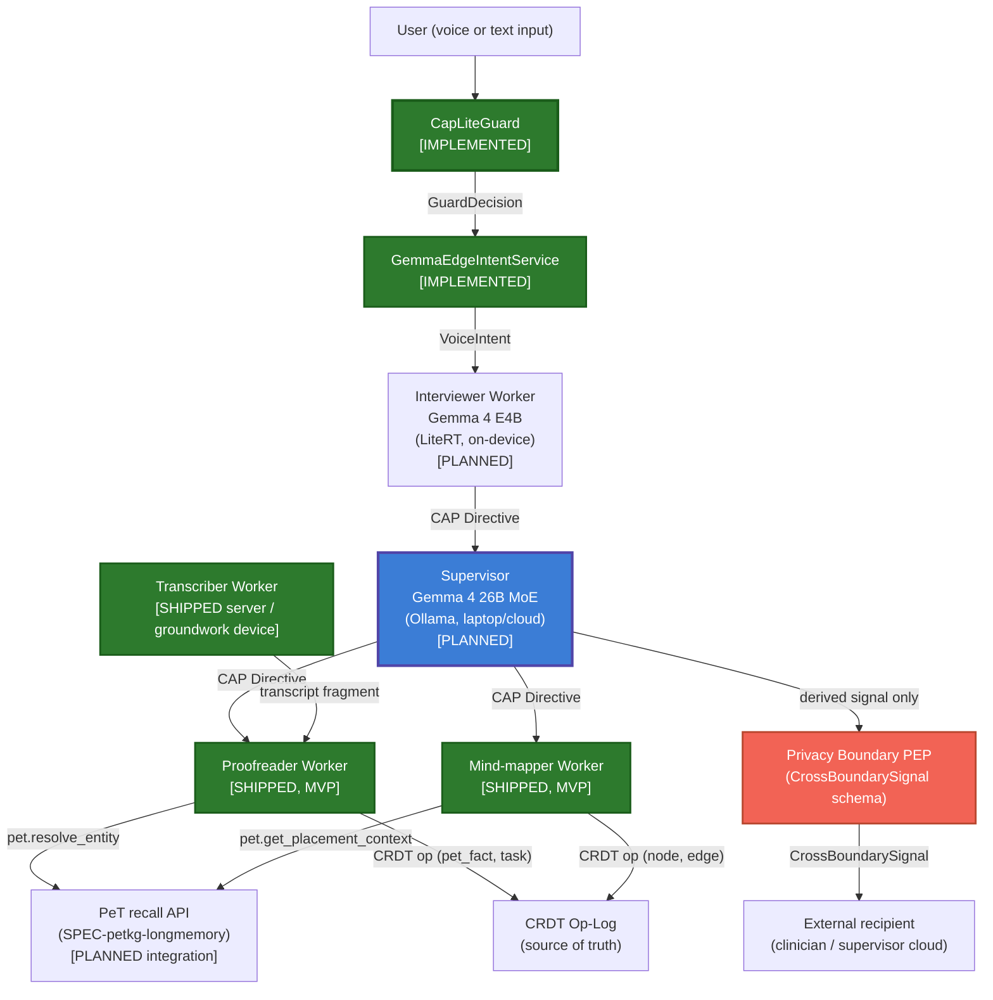
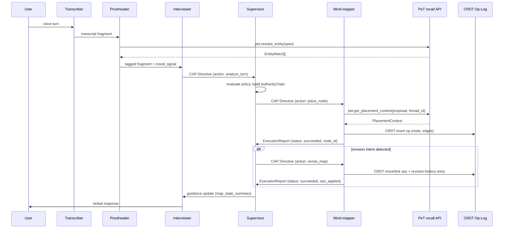

> **Status**: Draft v0.2
> **Date**: 2026-07-19
> **Author**: Cytognosis Foundation
> **Audience**: engineers
> **Tags**: `yar`, `multi-agent`, `orchestration`, `cap`, `naming`, `petkg`

# SPEC: Yar Multi-Agent System

> **Reading options:** An ADHD-friendly progressive-disclosure rendering is generated from this file. The hand-maintained ADHD twin (`spec/adhd/SPEC-multi-agent_adhd.md`) was retired 2026-07-16; see `_archive/cleanup_2026-07-16/adhd-twins/`.

> **Reading time**: ~18 minutes.
> **If you only read one thing**: Section 2 (the canonical naming table, which ends three months of drift across four different naming schemes) and Section 13 (implementation status against the shipped Tauri/Django reference client). The architecture still targets a supervisor-worker model with a CAP Directive envelope on every message; what changed this revision is that three of the five worker roles are now functionally shipped as an MVP, just not yet wired through CAP.

---

> **IMPLEMENTATION STATUS SUMMARY (2026-07-19)**
>
> | Component | Status |
> |---|---|
> | `CapLiteGuard` deterministic safety gate | **IMPLEMENTED**, ported into the YC Tauri reference client (`yar-code-20260705-2354/backend/cap/`, commit `068b10d`) |
> | `GemmaEdgeIntentService` on-device intent inference (mobile) | **IMPLEMENTED** |
> | **Transcriber** (server-tier ASR) | **SHIPPED (MVP)**, `backend/transcribe/`: mock and faster-whisper providers, content-hash blob archive |
> | **Transcriber** (device-tier ASR) | **GROUNDWORK**, whisper.cpp/WhisperKit seam documented, not bundled |
> | **Proofreader** (personal-NER, revision/tagging) | **SHIPPED (MVP)**, `backend/assistant/extraction.py` + `providers.py`, gazetteer NER |
> | **Mind-mapper** (placement, structural revision) | **SHIPPED (MVP)**, `backend/knowledge/`: BM25 + hashing embedder + RRF hybrid retrieval + n-hop graph expansion, frontend spatial canvas |
> | CAP Directive envelope wiring for the three shipped agents above | **NOT WIRED**. No `cytoplex` import exists anywhere in the reference client. This is the outstanding structural gap this revision closes on paper, not a new agent to invent |
> | **Supervisor** (Gemma 4 26B MoE, Ollama) | **PLANNED** |
> | **Interviewer** (real-time conversational response, mood-state inference, as a distinct CAP-governed process) | **PLANNED**. Grounded chat exists today (`backend/assistant/providers.py`) but without CAP wiring, mood-arc inference, or a separate process boundary |
> | Dapr and NATS orchestration runtime | **PLANNED**, not yet deployed. Dapr Agents v1.0 shipped in 2026 as a production-ready agent-orchestration framework with native NATS JetStream pub-sub, which confirms this is still the right pattern; it does not change Yar's own deployment status |
> | AgentCard registration and attestation | **PLANNED** |
> | PeT recall API integration for Proofreader and Mind-mapper | **PLANNED**, depends on `SPEC-petkg-longmemory` (itself Draft v1) |
> | `cytoplex/scenarios/therapist_supervisor/` | **REFERENCE**, the closest working implementation of the supervisor-worker CAP pattern |

---

## 1. Purpose, Scope, and the Problem

This spec defines the multi-agent architecture for the Yar cognitive companion: the runtime model for on-device worker agents, the supervisor agent, agent and tool discovery, the orchestration layer (Dapr and NATS), interaction contracts, how CAP governs every agent action, and how every agent reads and writes personalized long-term context through PeT (`SPEC-petkg-longmemory.md`).

**The problem this revision solves.** Three separate documents used three different names for what is, at the concept level, the same small set of worker roles, and a fourth planning pass used a fourth naming convention. Nobody outside this drafting session could tell a new engineer, with a straight face, whether "Reviser" and "revision-tagging" were the same job. Meanwhile, `YAR-CLIENT-EVAL.md` proved that a real, working, tested reference client already ships three of those roles as an MVP, which the prior draft of this spec described only as "PLANNED." A spec that is simultaneously wrong about names and wrong about what exists is worse than no spec. This revision fixes both problems in one pass: one canonical naming scheme (Section 2), and an implementation-status table that matches the shipped code (Section 13).

**In scope:** agent roles and ownership under one canonical naming scheme, discovery and registration via MCP, orchestration lifecycle and failure handling, the CAP Directive envelope as the inter-agent message format, the PeT recall API as the shared long-term-memory contract every worker reads and writes through, privacy-boundary and crisis-detection gates, the conversational brainmap loop and the F24 daily-plan refinement loop as concrete worked examples, edge versus supervisor split, and cross-cutting standards.

**Out of scope:** model weights and training; sensor signal schemas (`SPEC-CSP.md`); on-device versus cloud latency budgets (`SPEC-edge-ai-hybrid.md`); persona selection and voice synthesis (`SPEC-personas-voice.md`); neurobehavioral axis scoring (`SPEC-neurobehavioral-axes.md`); the detailed internal design of any single worker, which belongs to its own forthcoming spec (Section 4).

**Relationship to CAP:** CAP (Cytognosis Authority Protocol) is the authority protocol; this spec defines how Yar agents instantiate CAP roles and how the multi-agent runtime composes with CAP primitives. For CAP primitives themselves, see `Cytoplex/spec/03_primitives.md`. For CAP composition with MCP and A2A, see `Cytoplex/spec/05_integrations.md`. Yar is fully free with no subscription; every worker agent in this spec runs on open-weight models (Gemma, Whisper-family) that the person owns the inference for, on their own device or their own laptop-as-supervisor, not a metered cloud API a person must keep paying for.

---

## 2. Canonical Naming Reconciliation

Four documents named the same small set of roles four different ways. None of the four were wrong for their own purpose; they were written at different times for different audiences and never reconciled against each other. This section is the single reconciliation pass.

### 2.1 The four schemes, as they actually read

| Source | What it says | Read as of this revision |
|---|---|---|
| (a) `README.md` (spec-folder index) | "Three-agent brainmap loop (placer, reviser, side-thread)" | An early, informal gloss on this spec's own scope line. "Side-thread" was never defined anywhere else in the corpus; it is read here as a proto-name for thread and branch handling inside the brainmap, the exact capability F47 ("untangling parallel thoughts") and the Reviser's structural duties already covered |
| (b) This spec's own v0.1 topology | Supervisor, Interviewer, Transcriber, Placer, Reviser (5 roles) | The most detailed prior scheme, but it split one real job (turning a transcript into durable knowledge-graph structure) across two names, Placer and Reviser, and gave the Reviser two unrelated duties at once: text-level tagging and structural graph editing |
| (c) `YAR-CLIENT-EVAL.md` (shipped reference client) | transcription / revision-tagging / organization-into-KG (3 agents) | Ground truth for what actually runs today. "Revision-tagging" is the Reviser's text-side duty, shipped. "Organization-into-KG" is the Placer's placement duty plus the Reviser's structural duty, shipped together as one working pipeline |
| (d) Wave 0 planning naming (`SPECS-INVENTORY.md`, `FEATURE-VERIFICATION.md`) | transcriber / proofreading / mind-mapping (3 agents) | The naming this revision adopts almost verbatim, because it is the one scheme that already matches what is shipped: one agent per pipeline stage, not per data-structure operation |

### 2.2 Canonical scheme (this revision)

**Recommendation, adopted:** five roles total. Two are session-level and CAP-Lite/CAP-governed but not yet shipped (Supervisor, Interviewer). Three are pipeline workers, and all three already exist as shipped MVP functionality under different names (Transcriber, Proofreader, Mind-mapper). This is not a compromise between the four schemes; it is the reading that makes (b), (c), and (d) all true statements about the same five things.

| Canonical name | Old aliases | Shipped status | Spec home |
|---|---|---|---|
| **Supervisor** | Supervisor (scheme b); no equivalent in (a), (c), or (d) | **PLANNED**. No `cytoplex` import in the shipped client; this role does not exist as running code | This spec, Section 3 and Section 11 |
| **Interviewer** | Interviewer (scheme b); implicit in "conversational" framing (`FEATURE-VERIFICATION.md` item 4); no equivalent in (a) or (c) | **PLANNED** as a distinct CAP-governed process. Grounded chat exists today (`backend/assistant/providers.py`) without CAP wiring or a separate process boundary | This spec, Section 3 and Section 9 |
| **Transcriber** | Transcriber (scheme b); "transcription" (scheme c); "transcriber" (scheme d) | **SHIPPED (MVP, server-tier)**; device-tier is groundwork only | `SPEC-transcriber-agent` (forthcoming) |
| **Proofreader** | Reviser, text-side duties only (scheme b); "revision-tagging" (scheme c); "proofreading" (scheme d) | **SHIPPED (MVP)** | `SPEC-proofreading-agent` (forthcoming, being written next) |
| **Mind-mapper** | Placer, plus Reviser's structural duties (scheme b); "organization-into-KG" (scheme c); "mind-mapping" (scheme d); "placer/reviser/side-thread" (scheme a, with "side-thread" folded in as thread/branch handling) | **SHIPPED (MVP)** | `SPEC-mindmapping-agent` (forthcoming) |

**What this does to the old "Reviser" name specifically, since it is the one role that splits.** The v0.1 Reviser owned two duties that were never actually one job: (1) recognizing and correcting personal terms, names, and revision-style edits in text, which becomes the **Proofreader**; and (2) restructuring the brainmap graph, moves, renames, links, which becomes part of the **Mind-mapper**. `YAR-CLIENT-EVAL.md`'s own agent table independently drew this exact line ("Revision/Tagging" as one shipped module, "Organization/KG" as another), which is the strongest evidence that the split, not the merge, is the correct decomposition. Nothing about the CRDT op-log, the revision-history entry, or the undo-by-replay guarantee (Section 9.4 of the prior draft) changes; only the agent-ownership label on the structural half moves from "Reviser" to "Mind-mapper."

### 2.3 Updated agent inventory

| Agent | Model | Runs on | CAP role | Status | Owns |
|---|---|---|---|---|---|
| **CapLiteGuard** | Deterministic term-matching (no LLM) | Device | Guard | **IMPLEMENTED** | First-pass safety evaluation on every input and write |
| **GemmaEdgeIntentService** | Gemma 4 E4B (`flutter_gemma`) | Device (LiteRT) | Executor | **IMPLEMENTED** (mobile) | On-device intent classification and reply generation |
| **Supervisor** | Gemma 4 26B MoE | Laptop or cloud (Ollama) | Controller | **PLANNED** | Policy routing, cross-agent state, safety arbitration, crisis escalation, sole emitter of `CrossBoundarySignal` |
| **Interviewer** | Gemma 4 E4B | Device (LiteRT) | Controller + Executor | **PLANNED** as a CAP-governed process | Real-time conversational response, mood-state inference, crisis-detection trigger, F24 refinement dialogue (Section 10) |
| **Transcriber** | Whisper-family (server-tier: faster-whisper; device-tier: whisper.cpp/WhisperKit, seam only) | Server (shipped) / Device (groundwork) | Executor | **SHIPPED (MVP, server)**, groundwork (device) | Continuous ASR, voice-turn segmentation, transcript archival by content hash |
| **Proofreader** | Rule-based floor + OpenAI-compatible upgrade path; gazetteer NER | Server (shipped); device path PLANNED | Executor | **SHIPPED (MVP)** | Personal-NER resolution, transcript-to-task extraction, revision/correction tagging, structured output |
| **Mind-mapper** | BM25 + hashing embedder + RRF hybrid retrieval + n-hop expansion; frontend spatial canvas | Server (shipped); device path PLANNED | Executor | **SHIPPED (MVP)** | Node placement, graph restructuring (move, rename, link), revision-history entries, PeT placement context calls |

---

## 3. Architecture and Topology

Yar's multi-agent system targets a strict supervisor-worker topology. Workers run close to the user (on-device today for intent/guard, server-tier today for the three pipeline workers) and handle latency-sensitive or throughput-heavy tasks. The supervisor arbitrates policy, routes complex tasks, and manages cross-agent state. No worker communicates with another worker directly; all coordination passes through the supervisor. This invariant is unchanged from v0.1 and is not renegotiated by the naming reconciliation in Section 2.



Ownership boundaries follow the "Owns" column of Section 2.3's agent inventory directly: CapLiteGuard and GemmaEdgeIntentService are IMPLEMENTED; Supervisor and Interviewer are PLANNED; Transcriber, Proofreader, and Mind-mapper are SHIPPED (MVP) and detailed per-worker below. The Interviewer MAY issue Directives to the Supervisor but MUST NOT write directly to the CRDT store; the Transcriber MUST NOT retain raw audio beyond the retention policy `SPEC-storage-engine.md` sets.

---

## 4. Per-Worker Summaries

Full behavioral detail for each pipeline worker belongs in its own spec, not here; this spec fixes the name, the CAP role, the ownership boundary, and the PeT touchpoint, and points to the detail spec for everything else.

| Worker | One-line job | Detail spec | Status of that spec |
|---|---|---|---|
| **Transcriber** | Converts voice to text and segments turns | `SPEC-transcriber-agent` | Forthcoming |
| **Proofreader** | Resolves personal terms and names, tags revisions, produces structured output | `SPEC-proofreading-agent` | Forthcoming, being written next |
| **Mind-mapper** | Places new thoughts and restructures the existing brainmap | `SPEC-mindmapping-agent` | Forthcoming |

**Transcriber.** Converts a voice turn into a transcript fragment and a segment-boundary event. The shipped server-tier implementation uses a mock provider for tests and `faster-whisper` for real transcription, archiving audio by content hash in the blob store. The device-tier path (whisper.cpp on iOS/Android, WhisperKit on Apple platforms) is a documented seam, not bundled code, as of `YAR-CLIENT-EVAL.md`'s 2026-07-06 assessment. The Transcriber does not call the PeT recall API; it is upstream of every agent that does.

**Proofreader.** The new role this revision adds explicitly to the agent inventory (it did not exist as a named role in the prior draft; only "Reviser" existed, and only for its structural duties). The Proofreader's job is personal-NER: recognizing the user's own names, terms, and projects in a transcript fragment, correcting or tagging revisions to prior statements, and producing structured output an downstream agent or the CRDT op-log can consume directly. The shipped implementation (`backend/assistant/extraction.py`, `backend/assistant/providers.py`) already does transcript-to-task extraction and gazetteer-based NER; this is the Wave 1 floor the forthcoming `SPEC-proofreading-agent` formalizes and extends with the PeT-backed hybrid-match resolution described in Section 8.2.

**Mind-mapper.** Subsumes what the prior draft called the Placer (insert new thought-nodes) and the structural half of the Reviser (move, rename, link existing nodes). The shipped implementation already runs both halves as one working pipeline: BM25 plus a hashing embedder plus reciprocal-rank-fusion hybrid retrieval, n-hop graph expansion, and a spatial-canvas frontend. It is the CU-6 capability cluster's engine (F13, F14, F15, F31, F60) and the primary consumer of the PeT placement-context call (Section 8.3). The forthcoming `SPEC-mindmapping-agent` owns real-time chunking, the clustering approach used to infer structure, and conservative-revision rules that preserve a person's existing spatial layout rather than constantly reorganizing it.

---

## 5. Discovery: How Agents and Tools Are Found

All agent and tool discovery in Yar is MCP-based. Agents advertise their capabilities via MCP AgentCards; the Supervisor queries the registry at session start and maintains a live capability map. This section is unchanged in mechanism from v0.1; only the agent names and examples are updated.

### 5.1 MCP as the discovery layer

CAP wraps MCP tool invocations: `Directive.action.target` takes the form `mcp://<server>/<tool>`. A worker agent's capabilities are a set of MCP tool endpoints. The Supervisor resolves capabilities by consulting the local MCP registry before issuing any Directive.

### 5.2 AgentCard schema

```yaml
# Illustrative LinkML sketch (field names normative, syntax to finalize)
classes:
  YarAgentCard:
    attributes:
      agent_id:       { range: string, required: true }    # e.g. "yar.mindmapper.v1"
      display_name:   { range: string, required: true }
      cap_profile:    { range: CAPProfileEnum, required: true }  # cap_lite | cap_med
      tools:          { range: MCPToolRef, multivalued: true }
      constraints:    { range: CapabilityConstraint, multivalued: true }
      expiry:         { range: datetime, required: true }         # session-scoped
      attestation:    { range: string, required: true }           # detached JWS over card body
```

Cards are session-scoped and expire with the session; cross-session capability caching is not permitted. `constraints` lists what the agent explicitly CANNOT do (for example `no_external_write`, `no_raw_audio_retention`). The Supervisor enforces constraints before dispatching any Directive.

### 5.3 Capability advertisement

At session start, the Supervisor queries each known agent endpoint for its AgentCard. Agents not responding within 500ms are marked unavailable; the Supervisor degrades gracefully (for example, disabling brainmap features if the Mind-mapper is unavailable).

### 5.4 Reference implementation

The closest working example of the intended supervisor-worker pattern remains `cytoplex/src/cytoplex/scenarios/therapist_supervisor/`, with the `cap-med/therapist-supervisor/v1` profile (`cytoplex/src/cytoplex/profiles/cap_med.py`) as the reference for medical-domain constraints. The `SupervisorGateway` class (`cytoplex/src/cytoplex/runtime/supervisor_gateway.py`) implements the translate-and-veto pattern any Yar Supervisor must replicate.

---

## 6. Orchestration: Runtime, Scheduling, Lifecycle, Failure Handling

### 6.1 Runtime: Dapr and NATS

The orchestration layer is **Dapr** (service invocation, actor model, state management) running over **NATS** (messaging transport), decided at L7 per the data fabric stack. **Verification this revision:** Dapr Agents reached v1.0 in 2026 as a production-ready framework purpose-built for AI-agent orchestration, workflow-based and event-driven, with NATS JetStream as a supported pub-sub component out of the box. This confirms Dapr plus NATS is still the right choice for Yar's own orchestration; it does not change the fact that Yar has not deployed either yet.

| Component | Role in Yar |
|---|---|
| **Dapr service invocation** | Supervisor-to-worker Directive dispatch; at-most-once delivery with idempotency key |
| **Dapr actors** | Per-session Supervisor actor; per-agent worker actor; actors encapsulate the CAP state machine |
| **Dapr state** | Session-scoped guidance state for the Supervisor; CRDT op-log metadata (not the log itself) |
| **NATS subjects** | `yar.session.<id>.directive` (Supervisor outbound), `yar.session.<id>.report` (worker report), `yar.session.<id>.crisis` (crisis guard), `yar.session.<id>.boundary` (cross-boundary signals) |

**OPEN DECISION (O-1):** Dapr and NATS are the evaluated and decided components at L7 (now further reinforced by Dapr Agents v1.0). Precise version pins, deployment topology (embedded vs sidecar vs separate process), and mobile binding strategy are not yet specified. See Section 16.

### 6.2 Scheduling and lifecycle

```
INIT -> READY -> ACTIVE -> DRAINING -> TERMINATED
```

INIT: agent registers AgentCard, session keys generated (Ed25519), MCP tool manifest published. READY: Supervisor has verified attestation. ACTIVE: agent is dispatching and receiving Directives. DRAINING: Supervisor has issued a drain signal; agent completes in-flight Directives and emits final `ExecutionReport`s. TERMINATED: all CRDT ops flushed to the op-log; session audit record sealed. Workers do not transition themselves.

### 6.3 Failure handling

| Failure mode | Behavior |
|---|---|
| Worker unresponsive (>500ms) | Supervisor marks worker unavailable; degrades feature gracefully; logs availability event (no PHI) |
| Guard unavailable | Fail closed: no Directive dispatched until Guard responds or session terminates |
| Crisis guard error | Fail toward help: on internal error returns `tier: elevated` and surfaces resources (CD-7, `MODULE-crisis-detection.md`) |
| NATS publish failure | Retries with exponential backoff (max 3 retries, 50ms/100ms/200ms); after exhaustion, logs error and transitions session to DRAINING |
| CRDT write failure | Op buffered in a per-agent WAL; worker signals the Supervisor via a `failed_op` report |
| Schema validation failure at PEP | Fail closed: signal dropped, CAP policy violation raised, non-PHI error logged (PB-10) |
| PeT recall call fails or times out | Fail toward degraded, not toward blocked: Proofreader and Mind-mapper proceed without personalized context, flagged in the `ExecutionReport` as `context_degraded: true` |

---

## 7. Interaction Contracts: CAP Directive Envelope, Refusal, Privacy Gate, Crisis Gate

### 7.1 The CAP Directive as inter-agent envelope

Every message between the Supervisor and a worker is a `Directive` (CAP Primitive 1). No agent-to-agent channel bypasses the CAP envelope. **This remains the foundational invariant and the single largest gap between the target architecture and the shipped reference client** (Section 13): the shipped Transcriber, Proofreader, and Mind-mapper communicate today through direct backend function calls, not CAP Directives.

```yaml
# Illustrative structure (normative field names; see CAP 03_primitives.md for canonical schema)
Directive:
  id:              # UUID, idempotency key
  action:
    target:        # mcp://<agent_id>/<tool>
    parameters:    # tool-specific payload
  authority_chain: # AuthorityChain binding supervisor to worker under session keys
  policy_refs:     # list of CAP profile IDs enforced on this Directive
  expiry:          # UTC datetime; supervisor sets session TTL
  reversibility:   # boolean; true for CRDT ops (op-log allows undo)
  nonce:           # prevents replay
```

Workers MUST verify the `authority_chain` signature and expiry, verify `policy_refs` match their advertised CAP profile, and emit an `ExecutionReport` regardless of outcome. Workers MUST NOT accept a Directive targeting a tool outside their `ToolManifest`, execute a Directive denied by the Guard, or retain raw audio, raw transcripts, or free text beyond the scope of a single op.

### 7.2 Refusal handling

| Reason code | Supervisor response |
|---|---|
| `unauthorized` | Log, escalate to session-level audit, do not retry |
| `expired` | Reissue with refreshed expiry if the action is still valid |
| `missing_evidence` | Request evidence from the issuing Controller; retry with evidence ref |
| `forbidden_tool` | Log; do not retry; audit flag |
| `policy_denied` | Accept; do not override; the policy stands |
| `safety_denied` | Accept; surface appropriate response to user; do not retry |

### 7.3 Privacy-boundary gate on agent actions

The Privacy Boundary PEP intercepts every `CrossBoundarySignal` the Supervisor emits before it reaches an external recipient, validating against the schema in `privacy-boundary-spec.md`.

| Agent | Constraint |
|---|---|
| **Transcriber** | Raw audio and transcript buffers are Device-local. MUST NOT include transcript text in any Directive payload, `ExecutionReport`, or log entry |
| **Proofreader** | May write `pet_fact` ops (Device-local classification, per `SPEC-petkg-longmemory.md` Section 9); MUST NOT emit cross-boundary signals directly |
| **Mind-mapper** | All CRDT ops go to the local op-log; MUST NOT emit cross-boundary signals |
| **Interviewer** | May propose `stress_signal`, `mood_arc`, and `user_disengaged` signals, but only the Supervisor emits them, after PEP validation and only with an active `consent_ref` |
| **Supervisor** | Sole emitter of external `CrossBoundarySignal` messages; aggregates derived signals from workers and applies the PEP gate before emitting |

### 7.4 On-device safety gate: CapLiteGuard and the planned crisis-detection module

**Current implementation:** `CapLiteGuard` is a deterministic multilingual (English and Farsi) term-matching guard, not an LLM classifier, running synchronously before any model inference. It evaluates six boundary categories in priority order (crisis terms first, then diagnosis terms, treatment advice, intent claims, raw-data sharing, health-risk scoring) and never retains matched text. Crisis denial routes to 1480 (Iran Social Emergency) and findahelpline.com; the launch-market hotline set is an open founder decision shared with `MODULE-crisis-detection.md`.

```
User input -> CapLiteGuard.evaluate() -> GuardDecision
                                            |
                                     allow / allow_with_constraints
                                            -> GemmaEdgeIntentService
                                     deny (crisis terms matched)
                                            -> support message returned immediately
                                     deny (other boundary)
                                            -> refusal reason returned
```

The richer LLM/MoE supervisor-level safety arbitration described elsewhere in this spec, and the full tiered `CrisisDecision` module in `MODULE-crisis-detection.md`, remain **design-final, deferred post-YC** (decision D5). If `CapLiteGuard` is unavailable, the system fails toward help for crisis-adjacent inputs and fails closed for everything else.

---

## 8. PeT Integration: Personalized Context for Every Worker

`SPEC-petkg-longmemory.md` (finalized in parallel with this revision) defines PeT, the Personal Temporal knowledge graph: Yar's long-term memory layer. The coupling contract is fixed and this spec adopts it directly: **PeT facts are ops on the same CRDT op-log every other Yar write uses**, via the shared `OpEnvelope` (`SPEC-sync-protocol.md` Section 6.2), with `entity_type: pet_fact` and an `actor_id` that names the writing agent (for example `yar.proofreader.v1`), distinct from the `device_id` that ran it.

### 8.1 Recall API surface

```yaml
pet.recall(query: string, as_of: datetime | null, top_k: int) -> [RankedFact]
pet.resolve_entity(text_span: string, context: ThreadContext) -> [EntityMatch]
pet.get_placement_context(node_proposal: string, thread_id: string) -> PlacementContext
pet.assert_fact(fact: PetFact) -> fact_id           # writes a CRDT op; never a direct table write
pet.retract_fact(fact_id: string, reason: string) -> void
```

### 8.2 Proofreader: personal-NER context

The Proofreader calls `pet.resolve_entity` on each span it is uncertain about. Resolution runs a hybrid match: exact and fuzzy lexical match over `Term.canonical_name` and `aliases[]` via FTS5, combined with vector similarity via sqlite-vec, fused by reciprocal rank fusion (the same technique the Mind-mapper's shipped hybrid retrieval already validates). A match above threshold is surfaced as a suggested correction or expansion; a low-confidence match is a soft suggestion, never a silent rewrite.

### 8.3 Mind-mapper: placement context

The Mind-mapper calls `pet.get_placement_context` with the current node proposal and thread ID, receiving the 2-hop graph neighborhood of the thread's existing nodes, recent facts ranked by recency and confidence, and a short thread summary that reuses `BrainmapSessionState`'s shape (Section 9.5). This satisfies the constraint that placement decisions depend only on structured, derived context, never on raw transcript text beyond the current session.

### 8.4 Who does not call PeT directly

The **Transcriber** never calls the recall API; it is upstream of every consumer. The **Supervisor** does not call PeT directly either; it aggregates the structural state (`BrainmapSessionState`, guidance updates) that the Mind-mapper and Interviewer already produce, and PeT facts are classified Device-local exactly like raw transcript text, so they follow the same rule as Section 7.3: they never appear in a `Directive` payload, `ExecutionReport`, or `CrossBoundarySignal` bound for an external recipient.

### 8.5 Confidence defaults carried over from PeT

| Source | Default confidence |
|---|---|
| Explicit first-person user statement | 1.0 |
| Proofreader NER match against an existing Term or Person | 0.8 |
| Mind-mapper inference during placement | 0.6 |
| Derived signal crossing the privacy boundary | Per the signal's own confidence field, never upgraded |

A fact below threshold is never surfaced to the user or another agent as a settled statement; UI and agent-facing summaries hedge ("Yar thinks you might mean...").

---

## 9. The Conversational Brainmap Loop: A Worked Instance

This section implements F13 (Voice-grown thought map), F14 (Thought placement assistant), F31 (Thought map reviewer), and F60 (Conversational thought map), the CU-6 capability cluster, the highest-priority founder-elevated feature set. Agent names are updated to the canonical scheme (Section 2); the mechanics are unchanged from v0.1.

### 9.1 Agents in the loop

| Agent | Role in the loop | Trigger |
|---|---|---|
| Transcriber | Converts a voice turn to text; emits segment boundary event | Continuous; voice-activity detection |
| Proofreader | Resolves personal terms and names in the fragment before placement | Supervisor dispatch after each voice segment, before Mind-mapper |
| Mind-mapper | Inserts new thought-nodes; restructures existing nodes on revision intent | Supervisor dispatch after Proofreader; restructure branch when Interviewer detects revision intent |

### 9.2 Per-turn sequence



### 9.3 Placement logic

The Mind-mapper receives a `PlaceDirective` with a `node_proposal` (the extracted thought unit), `context` (current brainmap state summary, upgraded with the PeT placement context from Section 8.3), and `placement_strategy` (`auto`, `anchor_to_last`, `new_thread`, `link_to_existing`). It chooses a placement using the brainmap's CRDT tree structure (Loro `Tree` container, per `SPEC-sync-protocol.md` Section 5.1) and writes a single CRDT insert op.

### 9.4 Revision logic

Revision triggers when the Interviewer's mood-state inference or an explicit user phrase ("actually, that connects to...") flags revision intent. The Supervisor constructs a `ReviseDirective` (`revision_type`, `target_node_ids`, plus type-specific fields). The Mind-mapper applies ops atomically and writes a revision-history entry:

```yaml
RevisionHistoryEntry:
  turn_id:       { range: string, required: true }
  timestamp:     { range: datetime, required: true }
  ops_applied:   { range: CRDTOpRef, multivalued: true }
  revision_type: { range: RevisionTypeEnum, required: true }
  authored_by:   # agent_id of the Mind-mapper
  undo_available: { range: boolean, required: true }  # always true; op-log allows replay
```

Undo is always available: the CRDT op-log is the source of truth, and replaying ops up to any prior state restores the map. The UI exposes undo at the granularity of individual voice turns.

### 9.5 Map state as observed by the Supervisor

```yaml
BrainmapSessionState:
  node_count:       { range: integer }
  active_threads:   { range: string, multivalued: true }   # thread IDs, opaque
  last_placed_id:   { range: string }
  mood_arc:         { range: MoodArcEnum }   # improving | stable | declining
  pending_revisions: { range: integer }      # count of revision suggestions not yet applied
```

This state carries no raw text, only structural and derived signals, and is the same shape the Mind-mapper's PeT placement-context call (Section 8.3) reuses.

---

## 10. F24 Interactive Refinement: Supervisor-Mediated Daily-Plan Loop

`FEATURE-VERIFICATION.md` (row 1) confirms F24 (AI morning plan) currently ships a single-pass suggestion, not a back-and-forth refinement, and recommends extending F24's scope rather than minting a new feature id. **This spec is where that extension is architecturally grounded.**

The daily-plan refinement loop is a **Supervisor-mediated conversation** that reuses the Mind-mapper's conversational-iteration pattern (Section 9.2's per-turn Directive and `ExecutionReport` cycle) rather than inventing a new interaction shape:

1. The Interviewer opens the loop with the day's proposed anchors (from F24's existing prioritization, unchanged).
2. Each person response is a turn: the Interviewer issues a CAP Directive to the Supervisor exactly as it does mid-brainmap (Section 9.2), carrying the proposed change (reorder, drop, add-back).
3. The Supervisor evaluates policy (does the change violate a hard commitment, a clinician-set constraint, or a consent boundary) and returns a `guidance update`, the same message type the brainmap loop already uses.
4. No CRDT graph write occurs unless the person confirms a change; this differs from the Mind-mapper's placement loop only in that the target entity type is a daily-plan anchor list, not a brainmap node.

**No new agent role is required.** F24's refinement loop is a second worked instance of the same Supervisor-Interviewer conversational pattern Section 9 already establishes, not a sixth agent.

---

## 11. Edge and Supervisor Split

`SPEC-edge-ai-hybrid.md` is the sibling spec that owns the detailed latency budget, device-only fallback, and model deployment targets. This section states the boundary this spec depends on.

### 11.1 Split principle

**Everything that must respond in under 200ms runs on-device (edge). Everything that requires larger context windows, cross-session policy, or external tool access runs on the supervisor tier (laptop or cloud).**

| Tier | Runs | Latency target | Model |
|---|---|---|---|
| Edge (on-device) | Transcriber (device path), Mind-mapper (device path), Interviewer, Crisis Guard | Under 200ms per op | Gemma 4 E4B (LiteRT) |
| Server (shipped today) | Transcriber (server path), Proofreader, Mind-mapper (server path) | No hard RT constraint measured yet | faster-whisper; rule-based floor plus OpenAI-compatible upgrade path; BM25/RRF hybrid retrieval |
| Supervisor (cloud/laptop) | Policy evaluation, complex reasoning, cross-agent coordination, external tool Directives | No hard RT constraint | Gemma 4 26B MoE (Ollama) |

The middle row is new this revision: the shipped reference client's server tier is neither the edge tier nor the CAP-governed cloud Supervisor tier described in the target architecture. It is a third, already-real deployment shape that the edge-versus-supervisor split did not previously name. `SPEC-edge-ai-hybrid.md` should reconcile this explicitly in its own next revision.

### 11.2 Low-latency handoff

Workers emit `ExecutionReport`s asynchronously over NATS. The Supervisor processes these out-of-band and sends guidance updates back to the Interviewer, which does not block on Supervisor responses; it continues the conversational turn with the last-known guidance state and incorporates updates at the next turn boundary.

---

## 12. Cross-Cutting Standards

### 12.1 LinkML and Biolink schema foundation

All schemas defined in this spec (AgentCard, Directive payload types, `BrainmapSessionState`, `RevisionHistoryEntry`) MUST be expressed in LinkML syntax, with clinical or biological entities inheriting from Biolink Model where applicable. Canonical schema files live in `Yar/spec/schemas/multi-agent/`.

### 12.2 CRDT op-log as source of truth

Every persistent state change described in this spec is a CRDT operation on the op-log, not a direct database write: node placements and revisions (Mind-mapper), NER corrections and extracted structure (Proofreader, as `pet_fact` and task ops), revision history entries (append-only), and session-scoped guidance state (Supervisor actor, ephemeral Dapr state, clears on session end).

### 12.3 Naming rules

- Do not use "Substrate" as a noun for the data layer. Use "storage layer", "data layer", or "local runtime".
- The universal sensor protocol is **CSP** (Cytonome Sensor Protocol). Do not use the deprecated aliases USAP or UBAP.
- The governance protocol is **CAP** (Cytognosis Authority Protocol). Do not use "Cognitive Agent Protocol".
- **Cytoplex** is the product name; **CAP** is the protocol name.
- **Canonical worker names are Transcriber, Proofreader, and Mind-mapper (Section 2). Do not reintroduce "Placer" or "Reviser" in new code, specs, or product copy.** Existing shipped module paths (`backend/knowledge/`, `backend/assistant/`) are not required to rename immediately; see Open Decision O-8, Section 16.
- Agent IDs use the form `yar.<role>.<version>`: `yar.supervisor.v1`, `yar.interviewer.v1`, `yar.transcriber.v1`, `yar.proofreader.v1`, `yar.mindmapper.v1`.

### 12.4 CAP governance anchors

| This spec requires | CAP source |
|---|---|
| Directive envelope format | `03_primitives.md` (Primitive 1) |
| GuardDecision semantics (deny-wins) | `02_core_model.md` |
| RefusalMessage reason codes | `03_primitives.md` (Primitive 3) |
| AuthorityChain structure | `03_primitives.md` (Primitive 7) |
| MCP composition pattern | `05_integrations.md` |
| CAP-Lite profile constraints | `07_profiles_roadmap.md` |
| Crypto: Ed25519 mTLS, detached JWS | `04_security_trust_evidence.md` |
| Audit: hash-chain append-only | `02_core_model.md` |
| Edge-cloud `RoutingPolicy` concept (Cactus-style hybrid routing) | `cap-comprehensive.md` Section 5; formalized for Yar in a forthcoming `SPEC-cactus-routing` |

### 12.5 Affirming language

Any API response payload, UI string, or notification content generated by agents MUST use affirming, non-stigmatizing language: "elevated distress signal", not "abnormal affective state"; "lower focus today", not "impaired" or "bad day"; feedback compared to the user's own baseline, never a normative standard.

---

## 13. Implementation Status Against the Shipped Reference Client

`YAR-CLIENT-EVAL.md` (2026-07-06, evaluating `yar-code-20260705-2354`) is ground truth for this section. It recommends adopting that codebase as the Yar Wave 1 reference implementation, and this spec treats it as such.

| Canonical agent | Target architecture (this spec) | Shipped reality (`YAR-CLIENT-EVAL.md`) | Gap |
|---|---|---|---|
| **Transcriber** | On-device Whisper-compatible STT, CAP-governed Executor | Server-tier: mock and faster-whisper providers, content-hash blob archive. Device-tier whisper.cpp/WhisperKit seam documented, not bundled | No CAP wiring; no device-tier build yet |
| **Proofreader** | CAP-governed Executor, personal-NER, structured output, PeT-integrated | `backend/assistant/extraction.py` (transcript-to-task extraction), `backend/assistant/providers.py` (grounded chat, rule-based floor plus OpenAI-compatible upgrade), gazetteer NER | No CAP wiring; no PeT integration yet (blocked on `SPEC-petkg-longmemory` landing); NER is gazetteer-based, not yet the hybrid FTS5/sqlite-vec/RRF match Section 8.2 specifies |
| **Mind-mapper** | CAP-governed Executor, PeT-integrated placement and restructuring | `backend/knowledge/`: BM25 plus hashing embedder plus RRF hybrid retrieval plus n-hop graph expansion; `GraphEngine` seam for FalkorDB; `EmbeddingProvider` seam; frontend spatial canvas | No CAP wiring; hashing embedder is a placeholder for a real embedder (`YAR-CLIENT-EVAL.md` recommendation 5); no PeT placement-context call yet |
| **Supervisor** | Gemma 4 26B MoE, Ollama, owns AuthorityChain and cross-boundary emission | Not present. "No `cytoplex` import anywhere in the codebase," confirmed directly | Entire role unbuilt |
| **Interviewer** | CAP-governed conversational process, mood-arc inference | Grounded chat exists (`backend/assistant/providers.py`); no CAP wiring, no mood-arc inference, no separate process boundary | Functionally partial, structurally absent |
| **CapLiteGuard** | Deterministic on-device gate | Shipped, ported into the reference client (commit `068b10d`) | None; this is the one component fully aligned with the target |
| **Dapr and NATS orchestration** | Directive dispatch, actor model, interrupt stream | Not present | Entire orchestration layer unbuilt; Dapr Agents v1.0 (Section 6.1) is the recommended starting point when this work begins |

**Reading this table correctly:** the honest summary is not "little has been built." Three of five agent roles are shipped as working, tested MVP functionality, ahead of what the prior draft of this spec claimed. The real gap is narrower and more specific than "PLANNED": it is CAP envelope wiring, PeT integration, and the Supervisor/Interviewer/orchestration layer around already-working pipeline logic, not the pipeline logic itself.

---

## 14. Risks

| Risk | Description | Mitigation |
|---|---|---|
| **CAP envelope gap in shipped code** | The three shipped workers communicate through direct function calls, not CAP Directives; a naive reading of "SHIPPED" could imply CAP compliance that does not exist | Section 13's table states this explicitly; treat CAP wiring as a scoped follow-on task against already-working code, not a rewrite |
| **Naming migration drag** | Existing module paths, commit history, and prior docs still say "Placer" and "Reviser"; new engineers may reintroduce the old names | Section 12.3's naming rule is normative going forward; Open Decision O-8 (Section 16) sets the non-blocking migration policy |
| **PeT dependency is itself in-flight** | Proofreader and Mind-mapper's PeT integration depends on `SPEC-petkg-longmemory`, which is Draft v1, not yet built | Section 6.3's failure-handling row (`context_degraded: true`) means both agents already have a defined degrade path if PeT is unavailable or unbuilt |
| **Supervisor, Interviewer, and orchestration remain fully unbuilt** | Three of the five roles, and the entire Dapr/NATS layer, have zero shipped code | `cytoplex/scenarios/therapist_supervisor/` is a validated reference implementation to build from, not a blank-page design problem |
| **Third deployment tier not yet reconciled with edge/supervisor split** | The shipped server-tier workers are neither edge nor CAP-governed cloud Supervisor (Section 11.1) | Flagged explicitly for `SPEC-edge-ai-hybrid.md`'s next revision; not resolved in this spec |
| **`actor_id` vs `device_id` discipline** | Agent-authored ops (Proofreader, Mind-mapper) must set `actor_id` to the agent id, not the device id, or audit trails cannot distinguish person-authored from agent-inferred facts | `SPEC-sync-protocol.md` Section 7.4 already requires this; the cross-agent op interleaving test (Section 15) is the enforcement point |

---

## 15. Test Plan

| Test | What it verifies |
|---|---|
| Agent-rename regression scan | No new code, spec, or product copy under active development reintroduces "Placer" or "Reviser" as a role name (Section 12.3) |
| CAP envelope conformance (Transcriber, Proofreader, Mind-mapper) | Once wired, each shipped worker's calls become real `Directive`/`ExecutionReport` pairs verifiable against `03_primitives.md`; currently expected to fail, which is the honest baseline this revision records |
| PeT recall latency | `pet.get_placement_context` and `pet.resolve_entity` return within the 200ms edge budget (Section 11.1) once wired |
| PeT context-degraded fallback | Proofreader and Mind-mapper proceed correctly, without crashing or blocking, when PeT is unavailable (Section 6.3) |
| Cross-agent op interleaving | Mind-mapper and Proofreader ops interleaved with person-authored edits on the same brainmap session resolve deterministically; `actor_id` correctly distinguishes authorship (shared gate with `SPEC-sync-protocol.md` Section 12) |
| Brainmap loop end-to-end (renamed) | The Section 9.2 sequence runs correctly under the canonical names, including the Proofreader step now inserted before Mind-mapper placement |
| F24 refinement loop | A scripted multi-turn daily-plan negotiation resolves without an unintended CRDT write until the person confirms (Section 10) |
| Crisis interception | A scripted crisis-adjacent phrase is intercepted by `CapLiteGuard` before any of the three shipped workers see it |
| Dapr/NATS smoke test (once deployed) | Directive dispatch, actor lifecycle, and the interrupt stream behave per Section 6, using Dapr Agents v1.0's reference patterns |

---

## 16. Decided vs Open

### Decided

| Component | Decision |
|---|---|
| Supervisor-worker topology (no worker-to-worker direct communication) | Decided |
| CAP Directive as the universal inter-agent message envelope | Decided (not yet wired in shipped code, Section 13) |
| Canonical worker names: Transcriber, Proofreader, Mind-mapper, plus Supervisor and Interviewer | Decided this revision (Section 2) |
| Deny-wins semantics: any Guard deny blocks the Directive | Decided |
| MCP as the tool and agent discovery layer | Decided |
| AgentCard as the session-scoped capability advertisement unit | Decided |
| `CapLiteGuard` as the v0.1 on-device safety gate | Decided (IMPLEMENTED) |
| `GemmaEdgeIntentService` as the v0.1 on-device intent service | Decided (IMPLEMENTED) |
| Dapr and NATS as the orchestration runtime at L7 | Decided (PLANNED; reinforced by Dapr Agents v1.0) |
| CRDT op-log as the single source of truth for all persistent state, PeT facts included | Decided (from `SPEC-storage-engine.md` and `SPEC-petkg-longmemory.md`) |
| PeT recall API as the shared long-term-context contract for Proofreader and Mind-mapper | Decided this revision (Section 8) |
| Privacy Boundary PEP gates every outbound cross-boundary signal | Decided |
| Crisis Guard is synchronous, on-device, and non-bypassable | Decided |
| Three-worker pipeline (Transcriber, Proofreader, Mind-mapper) as the CU-6 brainmap loop and the general capture pipeline | Decided (this revision reconciles all four naming schemes to this) |
| F24 daily-plan refinement reuses the Supervisor-Interviewer conversational pattern; no new agent role | Decided this revision (Section 10) |
| Revision history per turn in the CRDT op-log; undo at voice-turn granularity | Decided |
| Edge latency target under 200ms per op | Decided (principle; budget in `SPEC-edge-ai-hybrid.md`) |
| LinkML as canonical schema language for all payload types | Decided (cross-cutting standard) |
| No "Substrate" naming in any spec or code identifier | Decided (naming rule) |

### Open

| # | Decision | Current leaning | Blocker or gate |
|---|---|---|---|
| **O-1** | Dapr and NATS version pins, deployment topology, mobile binding | Not specified; Dapr Agents v1.0 is the recommended starting point | Shared with `SPEC-edge-ai-hybrid.md` O-1 |
| **O-2** | AgentCard attestation key lifecycle: rotation during a session, recovery on restart | No leaning; borrow any-sync's per-space key model | Shared with `SPEC-sync-protocol.md` O-3 |
| **O-3** | Supervisor actor persistence: does Dapr actor state survive app backgrounding? | No leaning | Mobile lifecycle semantics; coordinate with `SPEC-edge-ai-hybrid.md` |
| **O-4** | Concurrent brainmap sessions: can a user have two active threads simultaneously? | Lean toward no for v1 | CRDT multi-root tree semantics; Mind-mapper conflict-resolution policy |
| **O-5** | Maximum op-log depth for undo: lifetime or session-bounded | No leaning | HIPAA data-retention rules; coordinate with counsel and `privacy-boundary-spec.md` |
| **O-6** | Paralinguistic signals from the Transcriber: which fields forward to the Interviewer within the on-device boundary | No leaning; no fields cross in v1 | Requires `SPEC-sensor-speech-mentalstate.md` |
| **O-7** | Supervisor location in v1: always local (Ollama) or optionally cloud-hosted | Lean toward local-only for v1 | Any cloud path must pass the same PEP gate |
| **O-8** | Migration policy for existing shipped module names (`backend/knowledge/`, the old "Reviser" references) | **Recommend: rename in specs and new code immediately (done, this revision); rename shipped module paths and identifiers opportunistically as those files are next touched, not as a blocking refactor.** A forced rename of working, tested code purely for naming consistency is not worth the regression risk this close to Wave 1 | Engineering discretion; revisit if naming drift causes an actual bug, not preemptively |
| **O-9** | Does the Proofreader need a CAP profile distinct from the Mind-mapper, given personal-NER touches Person-type PeT facts | **Recommend: no.** Reuse the CAP-Lite constraints already governing PeT writes (`SPEC-petkg-longmemory.md` Section 9); a second profile adds governance surface without a concrete requirement driving it | Revisit only if a specific Wave 2 feature needs a Proofreader capability the shared profile cannot express |

---

## 17. Cross-References

- `Cytoplex/spec/02_core_model.md`, `03_primitives.md`, `04_security_trust_evidence.md`, `05_integrations.md`, `07_profiles_roadmap.md` -- CAP primitives, roles, and profile constraints.
- `Cytoplex/spec/privacy-boundary-spec.md`, `Yar/spec/MODULE-crisis-detection.md` -- `CrossBoundarySignal` schema, PEP gate, PB-1 through PB-10; Crisis Guard API contract, CD-1 through CD-10, D5 deferral decision.
- `Yar/spec/SPEC-storage-engine.md`, `SPEC-sync-protocol.md`, `SPEC-petkg-longmemory.md` -- CRDT op-log source of truth; op envelope and `actor_id`/`device_id`; PeT data model, recall API, and cytomem convergence plan (the shared contract for Section 8).
- `Yar/spec/SPEC-edge-ai-hybrid.md` -- Latency budget, device-only fallback, model deployment; owes this spec a reconciliation of the third deployment tier (Section 11.1).
- `Yar/spec/YAR-CLIENT-EVAL.md`, `README.md` -- Ground truth for Section 13's implementation-status table; the spec-folder index whose "placer/reviser/side-thread" gloss is reconciled in Section 2.
- `docs/04-Engineering/cytoplex/research/cap-comprehensive.md` -- CAP v0.2 gap analysis; Section 5's `RoutingPolicy` sketch, the basis for a forthcoming `SPEC-cactus-routing`.
- `Yar/research/yar-unified-feature-comparison-v4.md`, `_planning-20260719/FEATURE-VERIFICATION.md`, `SPECS-INVENTORY.md` -- F13, F14, F15, F31, F60, F24, and the CU-6 cluster; the Transcriber/Interviewer, Proofreader, and Mind-mapper gap findings (rows 4, 7, 8) this revision resolves; the build-order rationale for this spec ahead of the three worker specs.
- `Yar/src/cap/guard.py`, `yar-code-20260705-2354/backend/cap/`, `Yar/apps/mobile/lib/src/services/gemma_edge_intent_service.dart` -- `CapLiteGuard` and `GemmaEdgeIntentService` implementations.
- `cytoplex/src/cytoplex/scenarios/therapist_supervisor/`, `cytoplex/src/cytoplex/profiles/cap_med.py` -- Reference supervisor-worker implementation and profile.
- `SPEC-transcriber-agent`, `SPEC-proofreading-agent`, `SPEC-mindmapping-agent`, `SPEC-personas-voice.md` -- Forthcoming per-worker detail specs (Section 4) and the persona scope-boundary note.

---

<details>
<summary><strong>Glossary</strong></summary>

- **AgentCard:** A session-scoped capability advertisement published by each agent at initialization. Embeds CAP metadata and is attested with a detached JWS.
- **AuthorityChain:** A CAP primitive (Primitive 7) that binds Controller, Guard, and Executor under session keys with temporal bounds.
- **CRDT op-log:** The single source of truth for all persistent Yar state, PeT facts included. The graph or storage engine is a derived index rebuilt by replaying the log.
- **CAP (Cytognosis Authority Protocol):** The transport-independent authority protocol governing what agents can do. Implemented in Cytoplex.
- **CAP-Lite:** Yar's default CAP safety profile. The v0.1 on-device enforcement is `CapLiteGuard`, a deterministic term-matching gate.
- **CrossBoundarySignal:** A derived, structured datum permitted to leave the on-device trust zone under consent and PEP validation.
- **CrisisDecision:** The output of the Crisis Guard: tier, matched signal codes, and recommended action codes. Never contains matched text.
- **Dapr:** Distributed application runtime providing service invocation, actor model, and state management. Dapr Agents v1.0 (2026) is its production-ready AI-agent orchestration layer.
- **Directive:** CAP Primitive 1. A bounded authorization request issued by a Controller to an Executor.
- **ExecutionReport:** CAP Primitive 4. Emitted by every Executor after any Directive, regardless of outcome.
- **GuardDecision:** CAP Primitive 2. Allow, deny, allow_with_constraints, escalate, require_more_evidence, require_human_review, or advisory_warning.
- **Interviewer:** The worker agent responsible for real-time conversational response, mood-state inference, and the F24 refinement dialogue. PLANNED as a distinct process.
- **Mind-mapper:** The canonical name (this revision) for the worker that places new thought-nodes and restructures the existing brainmap; subsumes the prior "Placer" and the structural half of the prior "Reviser". SHIPPED as an MVP.
- **MCP (Model Context Protocol):** The open standard for AI tool invocation. CAP wraps MCP tool calls via `Directive.action.target = mcp://server/tool`.
- **NATS:** Messaging transport for the Dapr orchestration layer.
- **PeT (Personal Temporal knowledge graph):** Yar's long-term personal memory layer, defined in `SPEC-petkg-longmemory.md`. Every worker's personalized context flows through its recall API.
- **Proofreader:** The canonical name (this revision) for the new worker role that resolves personal terms and names, tags revisions, and produces structured output; subsumes the prior "Reviser"'s text-side duties and `YAR-CLIENT-EVAL.md`'s "revision-tagging". SHIPPED as an MVP.
- **Supervisor:** The Gemma 4 26B MoE agent running on the laptop or cloud. Owns the AuthorityChain, policy routing, crisis escalation, and cross-agent state. PLANNED.
- **Transcriber:** The ASR worker. Converts voice to transcript fragments. SHIPPED at the server tier; device-tier is groundwork only.
- **VocalBiomarkerFrame:** A structured acoustic feature frame emitted by the Transcriber for longitudinal neuropsychiatric tracking, defined in the forthcoming `SPEC-sensor-speech-mentalstate.md`.

</details>
