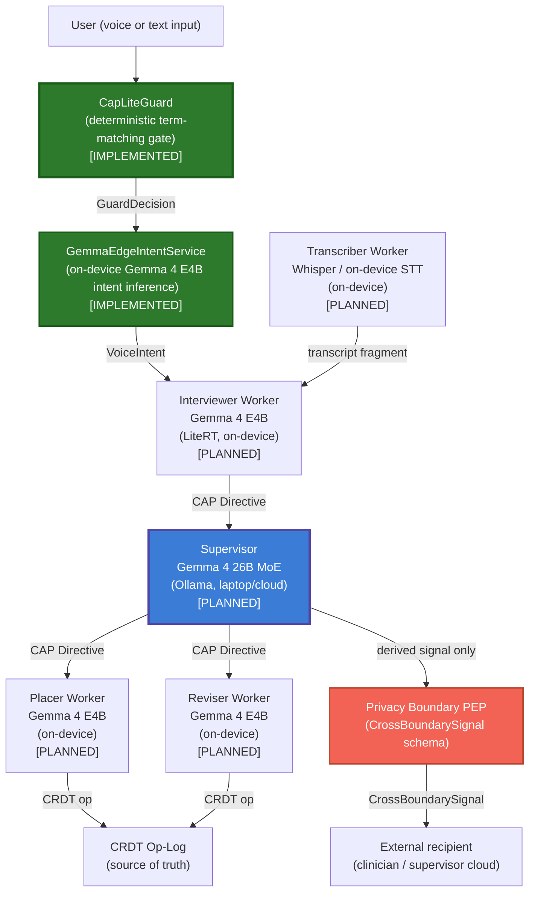
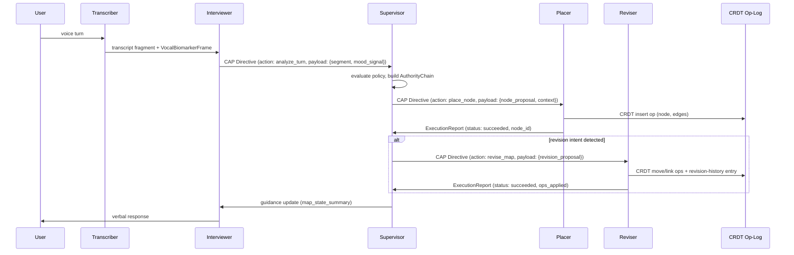

> **Status**: Draft
> **Date**: 2026-06-22
> **Author**: Cytognosis Foundation
> **Audience**: engineers
> **Tags**: `yar`, `multi-agent`, `orchestration`, `cap`

# SPEC: Yar Multi-Agent System

> **Reading options:** An ADHD-friendly progressive-disclosure rendering is generated from this file. The hand-maintained ADHD twin (`spec/adhd/SPEC-multi-agent_adhd.md`) was retired 2026-07-16; see `_archive/cleanup_2026-07-16/adhd-twins/`.

> **Reading time**: ~15 minutes.
> **If you only read one thing**: Section 2 (agent roles and the implementation-status distinction) and Section 6 (the brainmap loop as a worked example). The architecture targets a supervisor-worker model, but only the on-device CAP-Lite safety gate (`CapLiteGuard`) is implemented today. The Gemma E4B intent service is wired on mobile. No supervisor agent is running yet. Every future agent-to-agent message will be a CAP Directive envelope.

---

> **IMPLEMENTATION STATUS SUMMARY (2026-06-22)**
>
> | Component | Status |
> |---|---|
> | `CapLiteGuard` deterministic safety gate (`Yar/src/cap/guard.py`) | **IMPLEMENTED** |
> | `GemmaEdgeIntentService` on-device intent inference (`Yar/apps/mobile/lib/src/services/gemma_edge_intent_service.dart`) | **IMPLEMENTED** |
> | CAP-Lite sidecar concept (`:7100`) | **DESIGNED** (not yet running as a sidecar process) |
> | Supervisor agent (Gemma 4 26B MoE, Ollama) | **PLANNED** |
> | Worker agents: Placer, Reviser, Interviewer (as distinct agent processes) | **PLANNED** |
> | Dapr and NATS orchestration runtime | **PLANNED** |
> | AgentCard registration and attestation | **PLANNED** |
> | `cytoplex/scenarios/therapist_supervisor/` is the closest reference implementation of the supervisor-worker CAP pattern; it uses an Ollama-backed supervisor agent and a local therapist agent with full CAP envelope wiring | **REFERENCE** |

---

## 1. Purpose and Scope

This spec defines the multi-agent architecture for the Yar cognitive companion. It covers the runtime model for on-device worker agents, the supervisor agent, agent and tool discovery, the orchestration layer (Dapr and NATS), interaction contracts, and how CAP governs every agent action.

**In scope:** agent roles and ownership, discovery and registration via MCP, orchestration lifecycle and failure handling, the CAP Directive envelope as the inter-agent message format, privacy-boundary and crisis-detection gates, the conversational brainmap loop as a concrete worked example, edge versus supervisor split, and cross-cutting standards.

**Out of scope:** model weights and training, sensor signal schemas (see `SPEC-CSP.md`), on-device versus cloud latency budgets (see `SPEC-edge-ai-hybrid.md` when written), persona selection and voice synthesis (see `SPEC-personas-voice.md` when written), and neurobehavioral axis scoring (see `SPEC-neurobehavioral-axes.md` when written).

**Relationship to CAP:** CAP (Cytognosis Authority Protocol) is the authority protocol; this spec defines how Yar agents instantiate CAP roles and how the multi-agent runtime composes with CAP primitives. For CAP primitives themselves, see `Cytoplex/spec/03_primitives.md`. For CAP composition with MCP and A2A, see `Cytoplex/spec/05_integrations.md`.

---

## 2. Agent Roles and the Supervisor-Worker Model

Yar's multi-agent system targets a strict supervisor-worker topology. Workers run on-device and handle latency-sensitive, user-facing interactions. The supervisor arbitrates policy, routes complex tasks, and manages cross-agent state. No worker communicates with another worker directly; all coordination passes through the supervisor.

**Current state (v0.1):** The on-device safety gate (`CapLiteGuard`, `Yar/src/cap/guard.py`) is implemented. The `GemmaEdgeIntentService` (`Yar/apps/mobile/lib/src/services/gemma_edge_intent_service.dart`) is implemented for on-device intent inference. The full supervisor process and the separate worker-agent processes (Placer, Reviser, Interviewer) are PLANNED. The `cytoplex/src/cytoplex/scenarios/therapist_supervisor/` scenario is the working reference for the supervisor-worker CAP pattern and shows what the wired-up topology looks like.

### 2.1 Topology Diagram

> Note: diagram shows the target architecture. Components marked [PLANNED] are not yet wired up.



### 2.2 Agent Inventory

| Agent | Model | Runs on | CAP Role | Status | Owns |
|---|---|---|---|---|---|
| **CapLiteGuard** | Deterministic term-matching (no LLM) | Device | Guard | **IMPLEMENTED** (`Yar/src/cap/guard.py`) | Evaluates crisis, diagnosis, treatment, raw-data-sharing, and intent-claim boundaries before any model inference |
| **GemmaEdgeIntentService** | Gemma 4 E4B (flutter_gemma) | Device (LiteRT) | Executor | **IMPLEMENTED** (`Yar/apps/mobile/lib/src/services/gemma_edge_intent_service.dart`) | On-device intent classification and conversational reply generation |
| **Supervisor** | Gemma 4 26B MoE | Laptop or cloud (Ollama) | Controller | **PLANNED** | Policy routing, cross-agent state, safety arbitration, crisis escalation |
| **Interviewer** | Gemma 4 E4B | Device (LiteRT) | Controller + Executor | **PLANNED** | Real-time conversational response, mood-state inference, crisis-detection trigger |
| **Transcriber** | Whisper-compatible on-device STT | Device | Executor | **PLANNED** | Continuous ASR, voice-turn segmentation, VocalBiomarkerFrame emission |
| **Placer** | Gemma 4 E4B | Device (LiteRT) | Executor | **PLANNED** | Inserting new nodes and edges into the brainmap (CRDT insert ops) |
| **Reviser** | Gemma 4 E4B | Device (LiteRT) | Executor | **PLANNED** | Restructuring existing brainmap nodes (CRDT move, rename, link ops) |

### 2.3 Ownership Rules

Each agent owns a clearly bounded set of state and actions:

- **CapLiteGuard** (IMPLEMENTED): owns the first-pass safety evaluation. It runs synchronously before any model inference, on every user input and every proposed write. It evaluates crisis terms, diagnosis terms, treatment advice, intent claims, raw-data-sharing, and health-risk scoring using deterministic multilingual (English + Farsi) term-matching and regex patterns. It returns a `GuardDecision` (allow, allow_with_constraints, or deny) and never retains matched text. See `Yar/src/cap/guard.py`. Crisis message routes to 1480 (Iran Social Emergency) and findahelpline.com.
- **GemmaEdgeIntentService** (IMPLEMENTED): owns on-device intent classification (`inferIntent`) and conversational reply generation (`generateAssistantReply`). Both run through the `flutter_gemma` Gemma 4 E4B model with session-specific inference params. See `Yar/apps/mobile/lib/src/services/gemma_edge_intent_service.dart`.
- **Supervisor** (PLANNED): owns the active `AuthorityChain`, issues all Directives that target external tools or that require policy evaluation, holds the session-level guidance state, and is the only agent that may emit a `CrossBoundarySignal` to external recipients. Reference implementation: `cytoplex/src/cytoplex/scenarios/therapist_supervisor/supervisor_agent.py`.
- **Interviewer** (PLANNED): owns the conversational turn buffer, infers mood arc and engagement signals, and is the first responder to user input. It MAY issue Directives to the supervisor but MUST NOT write directly to the CRDT store.
- **Transcriber** (PLANNED): owns the raw audio stream and the ASR pipeline. It emits transcript fragments and `VocalBiomarkerFrame` structs. It MUST NOT retain raw audio after frame emission.
- **Placer** (PLANNED): owns node-placement proposals. It receives a `PlaceDirective` from the supervisor, validates it against the CRDT schema, writes insert ops to the op-log, and emits an `ExecutionReport`.
- **Reviser** (PLANNED): owns restructure proposals. It receives a `ReviseDirective` from the supervisor, validates it, writes move or link ops, and emits an `ExecutionReport`. It also writes a revision-history entry per turn.

---

## 3. Discovery: How Agents and Tools Are Found

All agent and tool discovery in Yar is MCP-based. Agents advertise their capabilities via MCP AgentCards; the supervisor queries the registry at session start and maintains a live capability map.

### 3.1 MCP as the Discovery Layer

CAP wraps MCP tool invocations: `Directive.action.target` takes the form `mcp://<server>/<tool>`. A worker agent's capabilities are a set of MCP tool endpoints. The supervisor resolves capabilities by consulting the local MCP registry before issuing any Directive.

### 3.2 AgentCard Schema

Every Yar agent publishes an AgentCard at session initialization. The card embeds CAP metadata so the supervisor can derive the authority chain without a separate negotiation round.

```yaml
# Illustrative LinkML sketch (field names normative, syntax to finalize)
classes:
  YarAgentCard:
    attributes:
      agent_id:       { range: string, required: true }    # e.g. "yar.placer.v1"
      display_name:   { range: string, required: true }
      cap_profile:    { range: CAPProfileEnum, required: true }  # cap_lite | cap_med
      tools:          { range: MCPToolRef, multivalued: true }
      constraints:    { range: CapabilityConstraint, multivalued: true }
      expiry:         { range: datetime, required: true }         # session-scoped
      attestation:    { range: string, required: true }           # detached JWS over card body
```

Key properties:
- Cards are **session-scoped** and expire with the session. Cross-session capability caching is not permitted.
- The `attestation` field is a detached JWS signed by the agent's Ed25519 key. The supervisor verifies this before adding the agent to the registry.
- `constraints` lists what the agent explicitly CANNOT do (e.g., `no_external_write`, `no_raw_audio_retention`). The supervisor enforces constraints before dispatching any Directive.

### 3.3 Capability Advertisement

At session start, the supervisor queries each known agent endpoint for its AgentCard. Agents not responding within 500ms are marked unavailable; the supervisor degrades gracefully (e.g., disabling brainmap features if the Placer is unavailable).

Tool endpoints use the MCP tool-discovery pattern. Each Yar worker exposes a standard `list_tools()` handler that returns a `ToolManifest`. The supervisor caches this manifest per session and invalidates on any agent restart.

### 3.4 Reference Implementation: therapist_supervisor and cap_med Profile

The closest working example of the intended Yar supervisor-worker pattern is in the Cytoplex library:

- **Scenario:** `cytoplex/src/cytoplex/scenarios/therapist_supervisor/` contains a complete therapist agent + supervisor agent pair with full CAP envelope wiring over an Ollama backend.
- **Profile:** `cytoplex/src/cytoplex/profiles/cap_med.py` defines the `cap-med/therapist-supervisor/v1` profile (`CAP_MED_PROFILE_ID`). This is the reference for how Yar's medical-domain constraints will be encoded, including `non_diagnostic_required`, `non_prescriptive_required`, `raw_transcript_upload_forbidden`, `local_pep_veto_required`, and `supervisor_overreach_veto_required`.
- **Policy JSON:** `cytoplex/policies/cap_med_policy.json` and the Yar-resident copy at `Yar/src/cap/data/cap_med_policy.json` (verify these are in sync; they are not auto-generated from a shared source).

When building the Yar supervisor agent, use `therapist_supervisor/supervisor_agent.py` as the behavioral template and `cap_med.py` as the profile constraints source. The `SupervisorGateway` class in `cytoplex/src/cytoplex/runtime/supervisor_gateway.py` implements the translate-and-veto pattern that any Yar supervisor must replicate.

---

## 4. Orchestration: Runtime, Scheduling, Lifecycle, Failure Handling

### 4.1 Runtime: Dapr and NATS

The orchestration layer is **Dapr** (service invocation, actor model, state management) running over **NATS** (messaging transport). This is a decided L7 component per the data fabric stack in `STORAGE_SYNC_DIGEST.md`.

| Component | Role in Yar |
|---|---|
| **Dapr service invocation** | Supervisor-to-worker Directive dispatch; at-most-once delivery with idempotency key |
| **Dapr actors** | Per-session supervisor actor; per-agent worker actor; actors encapsulate CAP state machine |
| **Dapr state** | Session-scoped guidance state for the supervisor; CRDT op-log metadata (not the log itself) |
| **NATS subjects** | `yar.session.<id>.directive` (supervisor outbound), `yar.session.<id>.report` (worker report), `yar.session.<id>.crisis` (crisis guard), `yar.session.<id>.boundary` (cross-boundary signals) |

**OPEN DECISION (O-1):** Dapr and NATS are the evaluated and decided components at L7. The precise version pins, deployment topology (embedded vs sidecar vs separate process), and mobile binding strategy are not yet specified. See Section 9.

### 4.2 Scheduling and Lifecycle

Agents follow a session lifecycle:

```
INIT -> READY -> ACTIVE -> DRAINING -> TERMINATED
```

- **INIT**: agent registers AgentCard, keys are generated (Ed25519 per session), MCP tool manifest is published.
- **READY**: supervisor has verified the attestation and added the agent to the registry.
- **ACTIVE**: agent is dispatching and receiving Directives.
- **DRAINING**: supervisor has issued a drain signal; agent completes in-flight Directives and emits final `ExecutionReport`s.
- **TERMINATED**: all CRDT ops flushed to op-log; session audit record sealed.

Workers transition from ACTIVE to DRAINING when the session ends or when the supervisor issues a `DRAIN` control Directive. Workers do not transition themselves.

### 4.3 Failure Handling

| Failure mode | Behavior |
|---|---|
| Worker unresponsive (>500ms) | Supervisor marks worker unavailable; degrades feature gracefully; logs availability event (no PHI) |
| Guard unavailable | Fail closed: no Directive dispatched until Guard responds or session terminates. CAP deny-wins semantics apply in all ambiguous states. |
| Crisis guard error | Fail toward help: on any internal error the crisis module returns `tier: elevated` and surfaces resources (CD-7 from `MODULE-crisis-detection.md`). |
| NATS publish failure | Supervisor retries with exponential backoff (max 3 retries, 50ms/100ms/200ms); after exhaustion, logs error and transitions session to DRAINING. |
| CRDT write failure | Op is buffered in a per-agent WAL. Worker signals the supervisor via a `failed_op` report. Supervisor decides whether to retry, skip, or abort the session. |
| Schema validation failure at PEB | Fail closed: signal is dropped, CAP policy violation is raised, non-PHI error is logged (PB-10 from `privacy-boundary-spec.md`). |

---

## 5. Interaction Contracts: Message Envelope, CAP Governance, Privacy Gate, Crisis Gate

### 5.1 The CAP Directive as Inter-Agent Envelope

Every message between the supervisor and a worker is a `Directive` (CAP primitive 1). No agent-to-agent channel bypasses the CAP envelope. This is the foundational invariant of the multi-agent system.

```yaml
# Illustrative structure (normative field names; see CAP 03_primitives.md for canonical schema)
Directive:
  id:              # UUID, idempotency key
  action:
    target:        # mcp://<agent_id>/<tool>
    parameters:    # tool-specific payload
  authority_chain: # AuthorityChain binding supervisor to worker under session keys
  policy_refs:     # list of CAP profile IDs enforced on this Directive
  expiry:          # UTC datetime; supervisor sets session TTL
  reversibility:   # boolean; true for CRDT ops (op-log allows undo)
  nonce:           # prevents replay
```

Workers MUST:
1. Verify the `authority_chain` signature before accepting the Directive.
2. Verify the Directive has not expired.
3. Verify the `policy_refs` match the CAP profile they advertise.
4. Emit an `ExecutionReport` regardless of outcome (success, failure, or refusal).

Workers MUST NOT:
- Accept a Directive whose `action.target` references a tool not in their published `ToolManifest`.
- Execute a Directive that has been denied by the Guard.
- Retain raw audio, raw transcripts, or free text beyond the scope of a single op.

### 5.2 Refusal Handling

Workers emit a `RefusalMessage` (CAP primitive 3) when they reject a Directive. The `reason_code` field uses one of CAP's 16 typed codes. The supervisor handles each code:

| Reason code | Supervisor response |
|---|---|
| `unauthorized` | Log, escalate to session-level audit, do not retry |
| `expired` | Reissue with refreshed expiry if the action is still valid |
| `missing_evidence` | Request evidence from the issuing Controller; retry with evidence ref |
| `forbidden_tool` | Log; do not retry; audit flag |
| `policy_denied` | Accept; do not override; the policy stands |
| `safety_denied` | Accept; surface appropriate response to user; do not retry |

### 5.3 Privacy-Boundary Gate on Agent Actions

The Privacy Boundary PEP (from `privacy-boundary-spec.md`) intercepts every `CrossBoundarySignal` emitted by the supervisor before it reaches any external recipient. The PEP validates the signal against the `CrossBoundarySignal` schema. Only the seven derived signal types in Section 3.1 of that spec may cross.

Agent-specific constraints:
- **Transcriber**: raw audio and transcript buffers are classified Device-local (Section 3.2 of `privacy-boundary-spec.md`). The Transcriber MUST NOT include transcript text in any Directive payload, `ExecutionReport`, or log entry.
- **Placer and Reviser**: all CRDT ops go to the local op-log. They MUST NOT emit cross-boundary signals.
- **Interviewer**: may emit `stress_signal`, `mood_arc`, and `user_disengaged` signals as `CrossBoundarySignal` payloads, but only after the PEP validates them and only when `consent_ref` is active.
- **Supervisor**: is the sole emitter of external `CrossBoundarySignal` messages. It aggregates derived signals from workers and applies the PEP gate before emitting.

### 5.4 On-Device Safety Gate: CapLiteGuard (v0.1) and Planned Crisis-Detection Module

**Current implementation (v0.1):** The on-device safety gate is `CapLiteGuard` (`Yar/src/cap/guard.py`), a deterministic multilingual (English + Farsi) term-matching guard. It is not an LLM-based classifier. It runs synchronously before any model inference, on every user input and every capture-level or write-level operation.

`CapLiteGuard` evaluates six boundary categories in priority order:

| Check order | Category | Enforcement |
|---|---|---|
| 1 (highest) | Crisis terms | Matches a hardcoded list of crisis phrases in English and Farsi; returns deny immediately with a support message pointing to 1480 (Iran Social Emergency) and findahelpline.com |
| 2 | Diagnosis terms | Term-matching (EN + Farsi); blocks diagnostic claim requests |
| 3 | Treatment advice | Term-matching and 4 compiled regex patterns; blocks prescriptive advice requests |
| 4 | Intent claims | Term-matching; blocks "knows their true intent" type requests |
| 5 | Raw-data sharing | Checks `raw_share_terms` + `user_confirmed_external_write` flag |
| 6 | Health-risk scoring | Term-matching; blocks health score requests |

Crisis denial includes an affirming support message. Matched terms are never retained in any `GuardDecision` field or audit log (consistent with CD-1 and CD-10 goals from `MODULE-crisis-detection.md`).

**The richer LLM/MoE supervisor-level safety arbitration described elsewhere in this spec is PLANNED, not yet implemented.** There is no wired-up supervisor agent. The `therapist_supervisor` scenario in `cytoplex/src/cytoplex/scenarios/therapist_supervisor/` is the reference pattern for what the future supervisor-side safety arbitration will look like.

```
User input -> CapLiteGuard.evaluate() -> GuardDecision
                                            |
                                     allow / allow_with_constraints
                                            -> GemmaEdgeIntentService
                                     deny (crisis terms matched)
                                            -> support message returned immediately
                                            -> no model inference
                                     deny (other boundary)
                                            -> refusal reason returned
                                            -> no model inference
```

If the `CapLiteGuard` is unavailable, the system fails toward help for crisis-adjacent inputs and fails closed for all other operations.

---

## 6. The Conversational Brainmap Loop: A Worked Instance

This section describes how features F13 (Voice-grown thought map), F14 (Thought placement assistant), F31 (Thought map reviewer), and F60 (Conversational thought map) from `yar-unified-feature-comparison-v4.md` are implemented as a three-agent coordination loop. This is the CU-6 capability cluster, the highest-priority founder-elevated feature set.

### 6.1 Agents in the Loop

| Agent | Role in the loop | Trigger |
|---|---|---|
| Transcriber | Converts voice turn to text fragment; emits segment boundary event | Continuous; voice-activity detection |
| Placer | Inserts new thought-nodes into the brainmap CRDT | Supervisor dispatch after each voice segment |
| Reviser | Restructures existing nodes: moves, renames, adds links | Supervisor dispatch when Interviewer detects revision intent |

### 6.2 Per-Turn Sequence Diagram



### 6.3 Placement Logic

The Placer receives a `PlaceDirective` with:
- `node_proposal`: the extracted thought unit (text, concept label, entity refs from the personal vocabulary)
- `context`: the current brainmap state summary (node count, recent nodes, active thread IDs)
- `placement_strategy`: one of `{auto, anchor_to_last, new_thread, link_to_existing}`

The Placer chooses a placement position using the brainmap's CRDT tree structure (Loro `Tree` container). It writes a single CRDT insert op and returns the `node_id`. The Placer MUST NOT make placement decisions that depend on the content of prior transcripts beyond the current session CRDT state.

### 6.4 Revision Logic

Revision is triggered when the Interviewer's mood-state inference or explicit user phrase ("actually, that connects to...") flags revision intent. The Supervisor constructs a `ReviseDirective` with:
- `revision_type`: one of `{move_node, rename_node, add_link, remove_link, merge_nodes}`
- `target_node_ids`: list of CRDT node IDs to operate on
- `new_parent_id` (for move), `new_label` (for rename), `link_type` (for add_link)

The Reviser applies ops atomically to the CRDT store and writes a revision-history entry:

```yaml
RevisionHistoryEntry:
  turn_id:       { range: string, required: true }
  timestamp:     { range: datetime, required: true }
  ops_applied:   { range: CRDTOpRef, multivalued: true }
  revision_type: { range: RevisionTypeEnum, required: true }
  authored_by:   # agent_id of the Reviser
  undo_available: { range: boolean, required: true }  # always true; op-log allows replay
```

Undo is always available: the CRDT op-log is the source of truth, and replaying ops up to any prior state restores the map. The UI exposes undo at the granularity of individual voice turns.

### 6.5 Map State as Observed by the Supervisor

After each turn, the Supervisor maintains a `BrainmapSessionState`:

```yaml
BrainmapSessionState:
  node_count:       { range: integer }
  active_threads:   { range: string, multivalued: true }   # thread IDs, opaque
  last_placed_id:   { range: string }
  mood_arc:         { range: MoodArcEnum }   # improving | stable | declining
  pending_revisions: { range: integer }      # count of revision suggestions not yet applied
```

This state is used to construct guidance updates sent back to the Interviewer. It contains no raw text, only structural and derived signals.

---

## 7. Edge and Supervisor Split

The edge-AI specification is a forthcoming sibling spec (`SPEC-edge-ai-hybrid.md`). This section establishes the architectural boundary this spec depends on.

### 7.1 Split Principle

**Everything that must respond in under 200ms runs on-device (edge).** Everything that requires larger context windows, cross-session policy, or external tool access runs on the supervisor tier (laptop or cloud).

| Tier | Runs | Latency target | Model |
|---|---|---|---|
| Edge (on-device) | Transcriber, Placer, Reviser, Interviewer, Crisis Guard | Under 200ms per op | Gemma 4 E4B (LiteRT) |
| Supervisor | Policy evaluation, complex reasoning, cross-agent coordination, external tool Directives | No hard RT constraint | Gemma 4 26B MoE (Ollama) |

### 7.2 Low-Latency Handoff

Workers emit `ExecutionReport`s asynchronously over NATS. The Supervisor processes these out-of-band and sends guidance updates back to the Interviewer. The Interviewer does not block on supervisor guidance; it continues the conversational turn with the last-known guidance state and incorporates updates at the next turn boundary.

The handoff contract:
- Interviewer reads from `yar.session.<id>.guidance` (NATS subject, retained last value).
- Supervisor writes to `yar.session.<id>.guidance` after processing each batch of `ExecutionReport`s.
- If no guidance has been received yet, Interviewer uses the session-default guidance (CAP-Lite defaults).

### 7.3 Dependency on Edge-AI Spec

`SPEC-edge-ai-hybrid.md` (not yet written; Batch 4b in `SPEC_CONSOLIDATION_PLAN.md`) must specify:
- The latency budget per agent and per op class.
- The fallback behavior when the supervisor is unreachable (device-only mode).
- The model quantization and LiteRT deployment targets.
- The supervisor interrupt protocol for injecting high-priority guidance mid-turn.

Until that spec is written, the split described in this section is a placeholder. Implementations MUST treat the edge vs supervisor boundary as a runtime configuration, not a hardcoded topology.

---

## 8. Cross-Cutting Standards

### 8.1 LinkML and Biolink Schema Foundation

All schemas defined in this spec (AgentCard, Directive payload types, BrainmapSessionState, RevisionHistoryEntry) MUST be expressed in LinkML syntax. Where biological or clinical entities appear in payload types (e.g., mood or physiological signal labels), those classes MUST inherit from Biolink Model (e.g., `biolink:PhenotypicFeature`) per Section 4b of `SPEC_CONSOLIDATION_PLAN.md`.

The canonical schema files will live in `Yar/spec/schemas/multi-agent/`. The JSON Schema runtime validators for the CAP envelope and `CrossBoundarySignal` are generated from the LinkML sources.

### 8.2 CRDT Op-Log as Source of Truth

Every persistent state change described in this spec is a CRDT operation on the op-log, not a direct database write. This applies to:
- Node placements (Placer): CRDT Tree insert.
- Node revisions (Reviser): CRDT Tree move, Map rename, edge link/unlink.
- Revision history entries: CRDT Map append (append-only; immutable once written).
- Session-scoped guidance state (Supervisor actor): Dapr state (ephemeral, not CRDT; clears on session end).

The op-log engine is TBD per `SPEC-storage-engine.md` open decisions O-1 through O-3. This spec is agnostic to which engine executes the op-log; all agents write through the op-log abstraction layer, not directly to the engine.

### 8.3 Naming Rules

- Do not use "Substrate" as a noun for the data layer. Use "storage layer", "data layer", or "local runtime".
- The universal sensor protocol is **CSP** (Cytonome Sensor Protocol). Do not use USAP.
- The governance protocol is **CAP** (Cytognosis Authority Protocol). Do not use "Cognitive Agent Protocol".
- **Cytoplex** is the product name; **CAP** is the protocol name.
- Agent IDs use the form `yar.<role>.<version>` (e.g., `yar.placer.v1`, `yar.supervisor.v1`).

### 8.4 CAP Governance Anchors

This spec implements the following CAP sections:

| This spec requires | CAP source |
|---|---|
| Directive envelope format | `03_primitives.md` (Primitive 1) |
| GuardDecision semantics (deny-wins) | `02_core_model.md` |
| RefusalMessage reason codes | `03_primitives.md` (Primitive 3) |
| AuthorityChain structure | `03_primitives.md` (Primitive 7) |
| MCP composition pattern | `05_integrations.md` |
| CAP-Lite profile constraints | `07_profiles_roadmap.md` |
| Crypto: Ed25519 mTLS, detached JWS | `04_security_trust_evidence.md` |
| Audit: hash-chain append-only | `02_core_model.md` |

The crisis-detection gate is governed by `MODULE-crisis-detection.md`. The cross-boundary signal schema is governed by `privacy-boundary-spec.md`. This spec does not redefine those; it wires them into the agent interaction flow.

### 8.5 Affirming Language

Any API response payload, UI string, or notification content generated by agents MUST use affirming, non-stigmatizing language:
- Use "elevated distress signal", not "abnormal affective state".
- Use "lower focus today", not "impaired" or "bad day".
- Agent-generated feedback is person-first and compared to the user's own baseline, never a normative standard.

---

## 9. Decided vs Open

### Decided

| Component | Decision |
|---|---|
| Supervisor-worker topology (no worker-to-worker direct communication) | Decided |
| CAP Directive as the universal inter-agent message envelope | Decided |
| Deny-wins semantics: any Guard deny blocks the Directive | Decided |
| MCP as the tool and agent discovery layer | Decided |
| AgentCard as the session-scoped capability advertisement unit | Decided |
| `CapLiteGuard` (deterministic multilingual term-matching, `Yar/src/cap/guard.py`) as the v0.1 on-device safety gate | Decided (IMPLEMENTED) |
| `GemmaEdgeIntentService` (Gemma 4 E4B, flutter_gemma) as the v0.1 on-device intent service (`Yar/apps/mobile/lib/src/services/gemma_edge_intent_service.dart`) | Decided (IMPLEMENTED) |
| Gemma 4 E4B (LiteRT, on-device) as the model for future worker agents | Decided (model choice; agent wiring PLANNED) |
| Gemma 4 26B MoE (Ollama) for the supervisor | Decided (model choice; supervisor agent PLANNED) |
| Dapr and NATS as the orchestration runtime at L7 | Decided (PLANNED; not yet deployed) |
| CRDT op-log as the single source of truth for all persistent state | Decided (from SPEC-storage-engine.md) |
| Privacy Boundary PEP gates every outbound cross-boundary signal | Decided (from privacy-boundary-spec.md) |
| Crisis Guard is synchronous, on-device, and non-bypassable | Decided (from MODULE-crisis-detection.md) |
| Fail-closed on Guard unavailability | Decided |
| Fail toward help on Crisis Guard error | Decided |
| Three-agent brainmap loop: Transcriber, Placer, Reviser | Decided (CU-6 from v4 feature matrix) |
| Revision history per turn in the CRDT op-log | Decided |
| Undo at voice-turn granularity via op-log replay | Decided |
| Edge latency target under 200ms per op | Decided (principle; budget in SPEC-edge-ai-hybrid.md) |
| LinkML as canonical schema language for all payload types | Decided (cross-cutting standard) |
| No "Substrate" naming in any spec or code identifier | Decided (naming rule) |

### Open

| # | Decision | Current leaning | Blocker or gate |
|---|---|---|---|
| **O-1** | Dapr and NATS version pins, deployment topology (embedded vs sidecar), and mobile binding | Not specified | Architecture decision; mobile-side Dapr binding may require a thin Rust or Dart shim; depends on SPEC-edge-ai-hybrid.md |
| **O-2** | AgentCard attestation key lifecycle: key rotation during a session, recovery on agent restart | No leaning; borrow any-sync per-space key model as design reference | Shared with key-custody open decision in SPEC-sync-protocol.md O-3 |
| **O-3** | Supervisor actor persistence: does the Dapr actor state survive app backgrounding? | No leaning | Mobile lifecycle semantics differ across iOS and Android; coordination with SPEC-edge-ai-hybrid.md |
| **O-4** | Concurrent brainmap sessions: can a user have two active brainmap threads simultaneously? | No leaning; lean toward no for v1 | CRDT multi-root tree semantics; Placer and Reviser conflict resolution policy |
| **O-5** | Maximum op-log depth for undo: lifetime or session-bounded? | No leaning | HIPAA data-retention rules apply; coordinate with Counsel (Duane Valz) and privacy-boundary-spec.md open decision 2 |
| **O-6** | Paralinguistic signals from the Transcriber: which `VocalBiomarkerFrame` fields are forwarded to the Interviewer within the on-device boundary? | No leaning; no fields cross the privacy boundary in v1 | Requires SPEC-sensor-speech-mentalstate.md to define the schema and the in-boundary vs cross-boundary classification |
| **O-7** | Supervisor location in v1: always local (Ollama on user laptop) or optionally cloud-hosted? | Lean toward local-only for v1 | Privacy-boundary schema applies to any cloud path; cloud supervisor must pass the same PEP gate as all external recipients |

---

## 10. Cross-References

- `Cytoplex/spec/02_core_model.md` -- CAP role definitions, CAPEnvelope FSM.
- `Cytoplex/spec/03_primitives.md` -- canonical Directive, GuardDecision, RefusalMessage, ExecutionReport, AuthorityChain schemas.
- `Cytoplex/spec/04_security_trust_evidence.md` -- Ed25519 mTLS, detached JWS, prompt-injection mitigation.
- `Cytoplex/spec/05_integrations.md` -- CAP composition with MCP, A2A, OPA, OpenTelemetry.
- `Cytoplex/spec/07_profiles_roadmap.md` -- CAP-Lite and CAP-Med profile constraints.
- `Cytoplex/spec/privacy-boundary-spec.md` -- `CrossBoundarySignal` schema; PEP gate details; EARS requirements PB-1 through PB-10.
- `Yar/spec/MODULE-crisis-detection.md` -- Crisis Guard API contract; EARS requirements CD-1 through CD-10.
- `Yar/spec/SPEC-storage-engine.md` -- CRDT op-log source of truth; L4 engine open decisions.
- `Yar/spec/SPEC-sync-protocol.md` -- L2 replication; L0 transport (mDNS, Tailscale, Iroh).
- `Yar/consolidation_2026-06-21/_storage/STORAGE_SYNC_DIGEST.md` -- Data fabric layer diagram; L7 agent stack (Gemma E2B and 26B MoE, Dapr, NATS) rationale.
- `Yar/research/yar-unified-feature-comparison-v4.md` -- F13, F14, F15, F31, F60 (brainmap features); CU-6 capability cluster; supervisor concept in Section 10.6.
- `Yar/research/cap-yar-comprehensive-reference.md` -- CAP primitives reference; Yar backend module inventory; CAP-Lite guard internals.
- `04-Engineering/cytoplex/reports/multi-agent-architecture-report.md` -- Validated edge-interviewer and center-supervisor test results (Level 12 Gemma); referenced as engineering evidence for the supervisor-worker topology.
- `Yar/src/cap/guard.py` -- `CapLiteGuard` implementation; the v0.1 on-device safety gate (IMPLEMENTED).
- `Yar/src/cap/models.py` -- `GuardDecision`, `GuardDecisionValue` types.
- `Yar/apps/mobile/lib/src/services/gemma_edge_intent_service.dart` -- `GemmaEdgeIntentService`; Gemma 4 E4B on-device intent inference (IMPLEMENTED).
- `cytoplex/src/cytoplex/scenarios/therapist_supervisor/` -- Reference supervisor-worker scenario using Ollama + CAP envelope wiring.
- `cytoplex/src/cytoplex/profiles/cap_med.py` -- CAP-Med profile (`cap-med/therapist-supervisor/v1`); reference for Yar medical-domain constraints.
- `cytoplex/policies/cap_med_policy.json` -- Medical-domain CAP policy rules.
- `SPEC-edge-ai-hybrid.md` (forthcoming, Batch 4b) -- Latency budget, device-only fallback, model deployment, supervisor interrupt protocol.
- `SPEC-personas-voice.md` (forthcoming, Batch 4a) -- Persona state as CRDT; ElevenLabs integration contract; dynamic persona selection.

---

<details>
<summary><strong>Glossary</strong></summary>

- **AgentCard:** A session-scoped capability advertisement published by each agent at initialization. Embeds CAP metadata and is attested with a detached JWS.
- **AuthorityChain:** A CAP primitive (Primitive 7) that binds Controller, Guard, and Executor under session keys with temporal bounds.
- **CRDT op-log:** The single source of truth for all persistent Yar state. The graph or storage engine is a derived index rebuilt by replaying the log.
- **CAP (Cytognosis Authority Protocol):** The transport-independent authority protocol governing what agents can do. Implemented in Cytoplex.
- **CAP-Lite:** The default CAP safety profile for Yar. Blocks diagnosis claims, treatment recommendations, raw data sharing without consent, and external writes without confirmation. The v0.1 on-device enforcement is `CapLiteGuard` (`Yar/src/cap/guard.py`), a deterministic term-matching gate. The full CAP-Lite sidecar process at `:7100` is PLANNED.
- **CrossBoundarySignal:** A derived, structured datum permitted to leave the on-device trust zone under consent and PEP validation. Only seven types are permitted (see privacy-boundary-spec.md Section 3.1).
- **CrisisDecision:** The output of the Crisis Guard: tier (none, elevated, acute), matched signal codes, and recommended action codes. Never contains matched text.
- **Dapr:** Distributed application runtime. Provides service invocation, actor model, and state management for the multi-agent orchestration layer.
- **Directive:** CAP Primitive 1. A bounded authorization request issued by a Controller to an Executor. Contains the action target, parameters, authority chain, policy refs, expiry, and reversibility flag.
- **ExecutionReport:** CAP Primitive 4. Emitted by every Executor after any Directive, regardless of outcome.
- **GuardDecision:** CAP Primitive 2. The output of a Guard check: allow, deny, allow_with_constraints, escalate, require_more_evidence, require_human_review, or advisory_warning.
- **Interviewer:** The on-device worker agent responsible for real-time conversational response and mood-state inference.
- **LiteRT:** Google's on-device ML runtime (formerly TensorFlow Lite). Runs Gemma 4 E4B on mobile hardware.
- **MCP (Model Context Protocol):** The open standard for AI tool invocation. CAP wraps MCP tool calls via Directive.action.target = mcp://server/tool.
- **NATS:** Messaging transport for the Dapr orchestration layer. Used for supervisor-to-worker Directive delivery and ExecutionReport collection.
- **Placer:** The on-device worker agent that inserts new thought-nodes into the brainmap CRDT.
- **Reviser:** The on-device worker agent that restructures existing brainmap nodes (move, rename, link).
- **Supervisor:** The Gemma 4 26B MoE agent running on the laptop or cloud. Owns the AuthorityChain, policy routing, crisis escalation, and cross-agent state.
- **Transcriber:** The on-device ASR worker. Converts voice to transcript fragments and emits VocalBiomarkerFrames. Never retains raw audio after frame emission.
- **VocalBiomarkerFrame:** A structured acoustic feature frame (jitter, shimmer, F0 contour, response latency) emitted by the Transcriber for longitudinal neuropsychiatric tracking. Defined in the forthcoming SPEC-sensor-speech-mentalstate.md.

</details>
