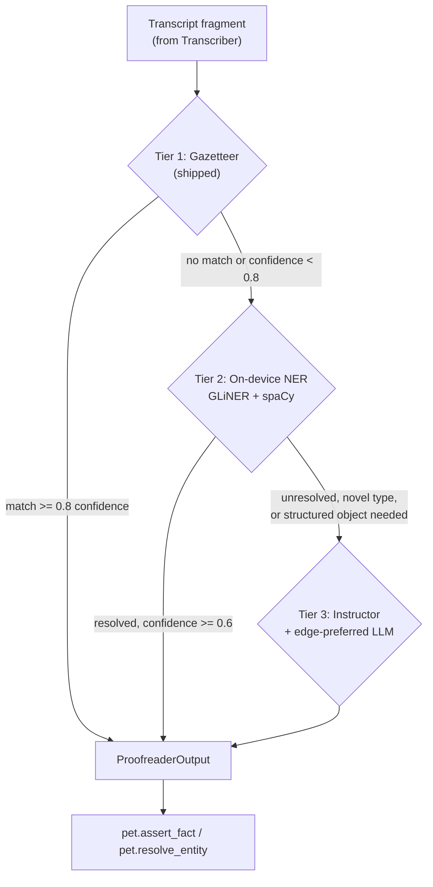

> **Status**: Draft v1
> **Date**: 2026-07-19
> **Author**: @shahin (agent-drafted, founder review pending)
> **Audience**: engineers
> **Tags**: `yar`, `proofreader`, `ner`, `structured-extraction`, `petkg`, `spec`

# SPEC: Yar Proofreader Agent

**Reading time:** about 14 minutes.
**If you only read one thing:** Section 5 (Pipeline design). It fixes the three-tier escalation ladder, gazetteer to on-device NER to structured extraction, that every other section in this spec exists to support.

---

## BLUF

**The Proofreader is Yar's personal-NER and structured-extraction worker: it corrects STT errors, resolves a person's own names and terms, and turns a transcript fragment into typed structured output, using a three-tier ladder that only escalates to a model call when a cheaper tier cannot resolve a span with confidence.** Tier 1 (gazetteer) already ships; this spec adds Tier 2 (GLiNER plus spaCy, on-device, Apache-2.0 and MIT) and Tier 3 (Instructor against a Pydantic schema codegen'd from PeT's own LinkML, edge-preferred per `SPEC-cactus-routing`). MedSpaCy is evaluated and not adopted; DSPy is adopted as an offline prompt-optimization tool only, never a runtime dependency.

---

## 1. Problem

The Proofreader already exists as shipped code (`backend/assistant/extraction.py`, `backend/assistant/providers.py`, `YAR-CLIENT-EVAL.md`), doing transcript-to-task extraction and gazetteer-based personal-NER. What it lacks is a plan for the next two tiers: recognizing a term or name the gazetteer has never seen, and producing typed structured output (a task, an event, a preference) rather than only tagging entities. `SPEC-multi-agent.md` v0.2 fixed the Proofreader's name and canonical duties; `SPEC-petkg-longmemory.md` fixed the recall API it must call; `20_structured_extraction.md` fixed the general Cytognosis pattern for schema-conditioned extraction. This spec is the point where those three land on one worker's actual pipeline.

A neurodivergent adult's own vocabulary, project nicknames, the names of people who matter, half-finished phrasings, is exactly the kind of detail working memory drops first. A cognitive companion that mishears a name every session and never learns it adds friction instead of removing it. The Proofreader's job is to make Yar sound like it has been paying attention.

---

## 2. Scope and boundaries

**In scope:** the tiered extraction pipeline (gazetteer, on-device NER, structured extraction); library selection and license verification for the two libraries the org's canonical pattern (`20_structured_extraction.md`) does not already cover, medSpaCy and DSPy, plus GLiNER as the on-device NER layer; the `pet.resolve_entity` and `pet.assert_fact` integration; the CAP-Lite and crisis-gate interaction on both input and output; the interface schemas between the Transcriber, the Proofreader, and the Mind-mapper; the design-only supertags seam for F09.

**Out of scope:** the Transcriber's own ASR pipeline (`SPEC-transcriber-agent`, forthcoming); the Mind-mapper's placement and clustering logic (`SPEC-mindmapping-agent`, forthcoming); PeT's data model and substrate, which this spec consumes but does not redefine (`SPEC-petkg-longmemory.md`); the routing decision function itself, which this spec consumes but does not redefine (`SPEC-cactus-routing.md`); model weights and training; the full clinically-owned crisis lexicon, which remains a deferred, clinical-advisor-gated build (`MODULE-crisis-detection.md`).

**Relationship to the old "Reviser."** Per `SPEC-multi-agent.md` Section 2, the Proofreader subsumes the prior Reviser's text-side duties: recognizing and correcting personal terms, and tagging revisions to prior statements. The Reviser's structural duties, moving and relinking brainmap nodes, belong to the Mind-mapper. This spec does not reintroduce "Reviser" anywhere.

**Yar is fully free, no subscription.** Every library this spec adopts is open source and self-hosted or on-device; nothing in the Proofreader's pipeline requires a metered API key to function at MVP. Where an edge-LLM call is needed (Tier 3), it runs against the already-decided Gemma 4 (Apache-2.0) edge or local-supervisor model, not a paid third-party API.

---

## 3. Library research (July 2026)

All five libraries named in the founder's brief were checked directly against their own license files and release history, not a secondary summary. `20_structured_extraction.md` already covers OntoGPT, Instructor, PydanticAI, and the spaCy/scispaCy pairing as the canonical Cytognosis extraction pattern; this section adapts that pattern to Yar and adds the two libraries the org pattern does not cover, medSpaCy and DSPy, plus GLiNER, which the org pattern predates.

### 3.1 Summary table

| Library | License (verified) | Maturity signal (July 2026) | Role in the Proofreader |
|---|---|---|---|
| **spaCy** | MIT | v3.8.14 (Mar 2026 release); used in 139k-plus public repos, the most mature tool in this table | Tier 2 classical NER backbone (`en_core_web_sm`/`trf`) for common entity spans (person, organization, date) alongside GLiNER |
| **sciSpaCy** | Apache-2.0 (AllenAI) | Model set at v0.5.4, compatible with spaCy 3.7.x and 3.8.x | Available if a future clinical-adjacent free-text need arises; **not wired into the MVP pipeline**, since Yar's personal entities (Person, Term, Project, Preference) are not biomedical entities |
| **medSpaCy** | MIT | **Inactive.** No new PyPI release in the past 12 months as of this research pass; latest is 1.3.1 | **Evaluated, not adopted** (Section 3.2) |
| **GLiNER** | Apache-2.0 (v2 and v2.1-plus checkpoints; older Base/Medium/Large checkpoints are CC-BY-NC-4.0 and must not be used) | Actively developed (`urchade/GLiNER`, NAACL 2024 origin paper; GLiNER2 schema-driven successor published 2025); 50M-parameter and 90M-parameter checkpoints run on CPU with no GPU required | Tier 2 zero-shot NER for the person's own free-form entity types (a project nickname, a coined term) that a fixed spaCy label set cannot express |
| **Instructor** | MIT | ~11k-12k stars, 3M-plus monthly downloads (`567-labs/instructor`) | Tier 3 typed extraction: Pydantic model in, Pydantic instance out, no ontology grounding required |
| **PydanticAI** | MIT | Official Pydantic-team agent framework; active 2026 release cadence | Reserved for a future Proofreader capability that needs mid-extraction tool use (for example, looking up a calendar date); not required for the MVP one-shot extraction case Instructor already covers |
| **DSPy** | MIT | Stanford NLP, 3.x line as of mid-2026, roughly 25k-34k stars depending on the count cited, in production use at several AI companies | **Offline prompt-program optimizer only** (Section 3.3); never a runtime import |
| **OntoGPT** | Apache-2.0 (existing org pattern, `20_structured_extraction.md`) | Canonical internal pattern; not re-researched here | **Not adopted for Yar's node types.** OntoGPT's value is ontology grounding against MONDO, HPO, and similar biomedical ontologies via OAK; PeT's node types (Person, Term, Project, Preference, Event, Organization, Thread, FreeFact) are not a biomedical ontology, so there is nothing for OAK to ground against. Yar reuses OntoGPT's underlying idea, schema as grammar, LinkML as the output contract, through Instructor instead |

### 3.2 medSpaCy verdict: evaluate, do not adopt for MVP

MedSpaCy is a clinical-note toolkit: section detection (chief complaint, past medical history), the ConText algorithm for negation and assertion status, and target-rule matching designed for hospital discharge summaries and EHR free text. **Yar is not a medical device**, and its consumer free-text captures (a voice memo, a brainmap thought) do not carry the structured section headers medSpaCy's core value depends on. Two independent reasons converge on the same answer:

1. **Domain mismatch.** medSpaCy's negation and assertion logic ("patient denies chest pain," "no evidence of X") is tuned for clinical narrative, not for a person narrating their own day. Applying it to Yar's captures would import clinical framing into a product whose voice must stay affirming and non-clinical (`SPEC-multi-agent.md` Section 12.5).
2. **Maintenance risk.** The repository shows no new PyPI release in the past 12 months as of this research pass, one signal short of calling it abandoned, but real enough that adopting it now means owning any future compatibility fix alone.

**Recommendation: evaluate later only if a specific feature needs clinical-style negation handling on user-disclosed health information (for example, a future medication-tracking feature), and re-run the maintenance check at that time. Do not adopt for the Wave 1 Proofreader.**

### 3.3 DSPy verdict: offline optimization, not a runtime dependency

DSPy replaces hand-written prompts with a compiled program: a `Signature` (typed input/output spec), a `Module` (a strategy such as `Predict` or `ChainOfThought`), and an `Optimizer` (MIPROv2, GEPA, SIMBA, or `BootstrapFewShot`) that searches for the best instruction and few-shot example set against a labeled training set and a metric function.

**This is exactly the shape of problem the Proofreader's Tier 3 extraction step has**: given a labeled set of transcript fragments and their correct structured outputs, DSPy can search for a better instruction and few-shot set than a hand-written prompt would produce. But that search is a **development-time, offline activity**, run against a curated evaluation set on a developer's machine, not something Yar ships to a person's device or calls at conversation time.

**Recommendation: adopt DSPy as an offline tooling dependency only.** The Proofreader's build pipeline runs a DSPy-compiled optimization pass against a labeled fixture set, the winning instruction and few-shot examples are frozen into a static prompt template, and that frozen template, not a DSPy runtime call, ships inside the Tier 3 Instructor call. No `dspy` import exists in the shipped runtime path. This keeps the on-device footprint unchanged and avoids adding a second LLM-orchestration framework (DSPy has its own module/optimizer runtime) into the same call path Instructor already owns.

### 3.4 GLiNER verdict: adopt for Tier 2

GLiNER's core property, zero-shot entity extraction against a label set defined at inference time rather than trained in, is the right fit for Yar's personal vocabulary problem: a person's own project nicknames and coined terms cannot be enumerated in advance the way `PERSON` or `ORG` can. Its smallest checkpoints (50M and 90M parameters) run on CPU without a GPU, fitting the under-200ms on-device budget `SPEC-cactus-routing.md` Section 4 sets for the Proofreader's edge-preferred tier. **Only Apache-2.0-licensed checkpoints (v2 and v2.1-plus) are approved; the older CC-BY-NC-4.0 Base/Medium/Large checkpoints must not be bundled**, since a non-commercial-only model license inside a product with a stated for-profit path is exactly the kind of risk `SPEC-cactus-routing.md` already flagged and resolved for the Cactus binary. GLiNER2, a 2025 schema-driven successor supporting joint entity, relation, and classification extraction, is noted as a future upgrade candidate, not adopted in this revision; it is read-list, matching the caution `SPEC-petkg-longmemory.md` already applies to research-stage systems.

---

## 4. What already ships (the Tier 1 floor)

`backend/assistant/extraction.py` and `backend/assistant/providers.py` already implement, per `YAR-CLIENT-EVAL.md` and `SPEC-multi-agent.md` Section 13: transcript-to-task extraction, a rule-based floor with an OpenAI-compatible upgrade path, and gazetteer-based personal-NER. This spec does not replace that code; it names it **Tier 1** and builds the next two tiers on top of it.

| Property | Tier 1 today |
|---|---|
| Match method | Exact and simple fuzzy string match against a maintained personal-term gazetteer |
| Cost | Near-zero; no model inference |
| Coverage | Only terms the gazetteer already knows |
| Confidence | Deterministic; a match either fires or does not |
| Gap this spec closes | No path for a term the gazetteer has never seen, and no path to typed structured output beyond task extraction |

---

## 5. Pipeline design (tiered)

### 5.1 The three-tier ladder



| Tier | Mechanism | License | Escalates when |
|---|---|---|---|
| **1: Gazetteer** | Exact and fuzzy match, shipped | N/A, internal code | A span has no gazetteer match, or the match confidence is below 0.8 |
| **2: On-device NER** | GLiNER (zero-shot, custom labels) plus spaCy (`en_core_web_sm`/`trf`, fixed common types) | Apache-2.0, MIT | A resolved span's confidence is below 0.6, the entity type is not in either model's label set, or the task requires more than a single-span tag (a structured object) |
| **3: Structured extraction** | Instructor against a Pydantic model codegen'd from PeT's LinkML schema, run edge-preferred per `SPEC-cactus-routing.md` | MIT (Instructor) | N/A; this is the ceiling tier |

**Confidence thresholds are not invented here.** They reuse `SPEC-petkg-longmemory.md` Section 4.3 and Section 8.5's existing defaults (0.8 for a Proofreader NER match, 0.6 for an inference-grade match), rather than defining a parallel scale.

### 5.2 Tier 2 detail: on-device NER

GLiNER runs first against the person's own configured entity types (drawn from PeT's `Term`, `Person`, `Project`, `Organization` node types, Section 6.1), since these are exactly the free-form, user-specific labels a fixed spaCy model cannot express. spaCy's classical NER runs alongside it for common, well-covered types (`PERSON`, `ORG`, `DATE`, `GPE`) where its accuracy on standard entity classes is well-established. Results from both are merged; a span both models tag is kept at the higher confidence; a span only one model tags is kept as-is. Neither model call ever leaves the device: this is the on-device edge tier per `SPEC-cactus-routing.md` Section 4's Proofreader row (edge-preferred, under 200ms).

### 5.3 Tier 3 detail: structured extraction

Tier 3 adapts the canonical Cytognosis pattern from `20_structured_extraction.md` with one substitution: **the LinkML schema is PeT's own `cytoskeleton.schemas.petkg` module (`SPEC-petkg-longmemory.md` Section 4.3), not a biomedical ontology template.** The same `gen-pydantic` to Instructor pipeline applies unchanged:

```bash
gen-pydantic schemas/petkg/pet_fact.yaml > build/petkg/pet_fact_pydantic.py
```

```python
import instructor
from anthropic import Anthropic  # or the routed edge/local-supervisor model client
from build.petkg.pet_fact_pydantic import PetFactCandidate

client = instructor.from_anthropic(Anthropic())

candidate = client.messages.create(
    model=routed_model,          # resolved by SPEC-cactus-routing's evaluate_routing_policy()
    max_tokens=512,
    temperature=0,                # typed extraction: always zero-temperature
    messages=[{"role": "user", "content": (
        "Extract a PetFactCandidate from this transcript fragment. "
        "If a field is not stated, omit it; do not guess.\n\n" + fragment_text
    )}],
    response_model=PetFactCandidate,
)
```

The frozen instruction text and any few-shot examples embedded in this prompt are the output of the offline DSPy optimization pass (Section 3.3), not composed by hand at ship time and not recomposed at runtime.

**Routing.** Every Tier 3 call is a Directive evaluated by `evaluate_routing_policy()` (`SPEC-cactus-routing.md` Section 6.1) before dispatch. The Proofreader's row in that spec's Section 4 table applies unchanged: edge-preferred, escalating on `capability_gap` (cross-session personal-term lookup, Section 6.2 below) or `confidence_low`, staying within a `boundary_derived` privacy level (structured signal only, never verbatim transcript text) on escalation.

### 5.4 What never escalates

Raw transcript text is `device_only` per `privacy-boundary-spec.md` Section 3.2, at every tier. Escalating a span to Tier 2 or Tier 3 means escalating the *processing*, not the *data boundary*: both tiers run on-device by default, and even a `local_supervisor` escalation (the user's own laptop via Ollama, per `SPEC-multi-agent.md` O-7) never sends raw text to a third-party service. No tier in this pipeline ever produces a payload destined for a `CrossBoundarySignal`; only the Supervisor emits those, and only from already-derived signals, never from Proofreader entity or fact text (`SPEC-multi-agent.md` Section 8.4).

---

## 6. PeT integration

### 6.1 Recall calls the Proofreader makes

Per `SPEC-petkg-longmemory.md` Section 5.1 and 5.2, unchanged here:

```yaml
pet.resolve_entity(text_span: string, context: ThreadContext) -> [EntityMatch]
pet.assert_fact(fact: PetFact) -> fact_id
```

`pet.resolve_entity` is called on each span Tier 1 could not confidently resolve, before escalating to Tier 2. The hybrid match (exact and fuzzy lexical via FTS5, vector similarity via sqlite-vec, fused by reciprocal rank fusion) is PeT's own mechanism, not reimplemented here; a match above threshold becomes a suggested correction or expansion, a low-confidence match becomes a soft, hedged suggestion, and neither is ever a silent rewrite.

### 6.2 Writing new facts

Every new entity or structured object the Proofreader resolves with sufficient confidence becomes a `pet.assert_fact` call, which writes a CRDT op, never a direct table write, with:

| Field | Value for a Proofreader-authored fact |
|---|---|
| `asserted_by` | `yar.proofreader.v1` |
| `confidence` | 0.8 for a Tier 1 or Tier 2 NER match against an existing Term or Person; per-field confidence from the Instructor call for a Tier 3 structured object, never auto-upgraded |
| `source_capture_id` | The transcript fragment's own ID |
| `status` | `active`, unless the new fact carries a `supersedes_id` |

A fact below the surfacing threshold (Section 5.1's 0.6 floor) is never shown to the user or another agent as a settled statement; UI and agent-facing summaries hedge, matching `SPEC-petkg-longmemory.md` Section 4.3 and `SPEC-multi-agent.md` Section 12.5's affirming-language rule.

### 6.3 Degraded mode

If a PeT recall call fails or times out, the Proofreader proceeds on Tier 1 and Tier 2 alone, flags its output `context_degraded: true`, and does not block the pipeline. This reuses `SPEC-multi-agent.md` Section 6.3's existing failure-handling row unchanged; no new degrade path is invented here.

---

## 7. CAP and crisis-gate interaction

The Proofreader sits inside a fragment stream, not only a single query-response turn, so this spec makes explicit what `SPEC-multi-agent.md` Section 7.4 states for conversational input: the same gate applies to every transcript fragment before the Proofreader ever runs on it, and a second gate applies at the moment the Proofreader is about to write.

### 7.1 Input gate: before extraction runs at all

```
Transcript fragment (from Transcriber)
   -> CapLiteGuard.evaluate()
        -> allow / allow_with_constraints -> Proofreader pipeline (Tier 1-3) runs
        -> deny (crisis terms matched) -> Proofreader is NOT invoked for this fragment;
                                           support message path returned immediately (MODULE-crisis-detection CD-2)
        -> deny (other boundary category) -> Proofreader is NOT invoked; refusal reason logged
```

A crisis-tier match short-circuits before any NER or extraction runs, matching `MODULE-crisis-detection.md`'s CD-2 (surface resources before continuing any other flow) and CD-7 (fail toward help on ambiguity). Today this means the shipped 22-term English and Farsi keyword gate; the richer `elevated`/`acute` tiered `CrisisDecision` remains deferred post-YC (decision D5), and the Proofreader's input-gate contract does not change shape when that fuller module ships, only the gate's own internal sensitivity does.

### 7.2 Output gate: before any PeT write

```
Proofreader-resolved fact or structured object, about to call pet.assert_fact()
   -> CapLiteGuard boundary-category check (diagnosis terms, treatment advice, health-risk scoring)
        -> pass -> pet.assert_fact() writes the CRDT op
        -> match -> write blocked (fail closed, PB-10); non-PHI policy-violation logged; fact discarded, not queued
```

This is not a second, new safety gate. `SPEC-petkg-longmemory.md` Section 9 already states that CapLiteGuard's existing boundary categories extend naturally to PeT writes, "PeT does not need a second safety gate, it sits behind the one that already exists." This spec's contribution is making explicit that the Proofreader is the concrete agent that must call the gate a second time, at assertion, not only at input.

### 7.3 What this rules out

The Proofreader must never construct a durable `Person`, `Term`, or `FreeFact` node that encodes a diagnosis, a treatment claim, or crisis content, even as a low-confidence FreeFact. A crisis-adjacent fragment stops at Section 7.1's input gate; it never reaches a state where Section 7.2's output gate would need to catch it a second time, but the second gate exists precisely because a diagnosis-shaped statement (for example, "my therapist says I have X") is not itself a crisis-tier phrase and would otherwise pass the input gate cleanly.

---

## 8. Interfaces and schemas

### 8.1 ProofreaderInput and ProofreaderOutput

```yaml
# Illustrative LinkML-style sketch; canonical schema lives alongside
# cytoskeleton.schemas.petkg per SPEC-petkg-longmemory Section 7.3
ProofreaderInput:
  fragment_id:        { range: string, required: true }
  transcript_text:    { range: string, required: true }   # device-local; never crosses a boundary
  thread_id:          { range: string, required: true }
  segment_boundary:   { range: boolean, required: true }

ProofreaderOutput:
  fragment_id:        { range: string, required: true }
  entities:            { range: EntityMatch, multivalued: true }
  revision_tags:       { range: RevisionTag, multivalued: true }
  structured_objects:  { range: StructuredObjectCandidate, multivalued: true }
  context_degraded:    { range: boolean, required: true }   # true when PeT was unavailable, Section 6.3
```

### 8.2 RevisionTag

The Proofreader's subsumed revision-tagging duty (Section 2), unchanged in shape from `YAR-CLIENT-EVAL.md`'s shipped "revision-tagging" module, formalized here:

```yaml
RevisionTag:
  target_span:      { range: string, required: true }
  revision_type:    { range: RevisionTypeEnum, required: true }   # correction | expansion | retraction_candidate
  suggested_text:   { range: string, required: true }
  confidence:       { range: float, required: true }
  source_tier:      { range: SourceTierEnum, required: true }     # gazetteer | ner_ondevice | structured_extraction
```

A `retraction_candidate` never auto-retracts a PeT fact; it surfaces as a soft suggestion the person confirms, consistent with `SPEC-petkg-longmemory.md`'s "retraction is a right, not a delete" principle.

### 8.3 StructuredObjectCandidate

A thin wrapper around whatever Pydantic model Tier 3's `gen-pydantic` step produced for the target PeT node type (Section 5.3); its `payload` is opaque at this schema's level by design, since each PeT node type carries its own field set:

```yaml
StructuredObjectCandidate:
  node_type:      { range: PetNodeTypeEnum, required: true }   # Person | Term | Project | Preference | Event | Organization | Thread | FreeFact
  payload:        { range: JSON, required: true }
  confidence:     { range: float, required: true }
  source_tier:    { range: SourceTierEnum, required: true }
```

### 8.4 CAP Directive targeting

The Proofreader's MCP tool endpoint is addressed as `mcp://yar.proofreader.v1/extract`, matching `SPEC-multi-agent.md` Section 12.3's agent-ID naming rule. Its `AgentCard` constraints include `no_external_write` (Section 5.4) unconditionally.

---

## 9. Supertags seam (design note, F09)

`tana-outliner-deep-dive.md` documents Tana's **supertag** pattern: a schema applied to a node that gives it typed fields, with inheritance (Extend) and composition (multiple supertags on one node). PeT's fixed node types, `Person`, `Term`, `Project`, `Preference`, `Event`, `Organization`, `Thread`, already play the role Tana calls **base types**, built-in supertags with specialized handling. `FreeFact` plays the role of Tana's untagged plain node: a safety valve that guarantees the Proofreader is never blocked from recording something true just because no typed schema fits it yet.

**The seam this spec identifies, and does not build:** Tier 3's `gen-pydantic` plus Instructor pipeline (Section 5.3) is the same mechanism a future F09 ("structured note types") would need to let a person define their own supertag, for example, tagging a recurring FreeFact pattern ("started taking X", repeated across sessions) as a new typed `#Medication` node. `SPEC-petkg-longmemory.md`'s own open question 2 already flags "a fact that recurs in FreeFact form across sessions is a signal that it deserves a typed promotion" without designing the promotion mechanism; this spec's answer is that the promotion mechanism, when built, is a new LinkML class fed through the exact `gen-pydantic` to Instructor pipeline this spec already stands up for the eight fixed node types, not a new extraction technology.

**This is a design note, not a Wave 0 or Wave 1 deliverable.** No custom-supertag UI, no schema editor, and no user-facing "create a new note type" flow exist in this spec. Building those is out of scope until F09 itself is scheped and specced.

---

## 10. Risks

| Risk | Description | Mitigation |
|---|---|---|
| **Gazetteer false-positive rewrite** | Tier 1 auto-expands a nickname to the wrong canonical name | Match above threshold is a suggested correction, never a silent rewrite (Section 6.1, inherited from `SPEC-petkg-longmemory.md`) |
| **Hallucinated structured object** | Tier 3's Instructor call invents a field value not actually stated | `temperature=0`; the prompt instructs the model to omit unstated fields rather than guess (Section 5.3); Pydantic's own type and pattern constraints reject malformed output before it reaches PeT |
| **Latency budget breach on escalation** | A Tier 3 call exceeds the edge latency ceiling under load | `SPEC-cactus-routing.md`'s existing fallback ladder (`deny`/`degrade`/`queue`) applies unchanged; this spec adds no new fallback behavior |
| **GLiNER license drift** | A future dependency bump silently pulls in a CC-BY-NC-4.0 checkpoint | CI license-scan step, matching the pattern `SPEC-cactus-routing.md` RT-7 already establishes for the Cactus binary, extended to GLiNER checkpoint filenames |
| **DSPy runtime leakage** | A developer imports `dspy` directly in a runtime code path during a future refactor | Code review gate: no `dspy` import outside the offline optimization tooling directory; Section 3.3's frozen-prompt boundary is the enforcement point |
| **medSpaCy scope creep** | A future feature quietly adds a medSpaCy dependency without revisiting Section 3.2's verdict | Section 3.2's recommendation is the standing answer until a specific feature and a fresh maintenance check justify revisiting it |
| **Cross-boundary leakage via a careless payload builder** | A Tier 3 escalation accidentally includes raw transcript text in a boundary-derived payload | Same enforcement point as `SPEC-petkg-longmemory.md` Section 9's leakage test; extended here to cover `StructuredObjectCandidate.payload` specifically |
| **PeT unavailable during a long capture session** | Extended `context_degraded: true` operation reduces resolution quality without the person knowing why | UI surfaces a subtle "working with less context right now" state when `context_degraded` is true for more than one fragment in a row |

---

## 11. Test plan

| Test | What it verifies |
|---|---|
| **Tier escalation ladder** | A span with no gazetteer match correctly escalates to Tier 2; a span Tier 2 cannot resolve or type correctly escalates to Tier 3; a confident Tier 1 match never escalates |
| **Input-gate interception** | A scripted crisis-tier fragment never reaches the Tier 1-3 pipeline; the Proofreader is not invoked (Section 7.1) |
| **Output-gate interception** | A scripted diagnosis-shaped or health-risk-shaped candidate fact is blocked at `pet.assert_fact()` time, not only at input (Section 7.2) |
| **GLiNER custom-label accuracy** | Zero-shot extraction of a seeded set of personal project nicknames and coined terms meets a minimum precision and recall bar on the Apache-2.0 checkpoint |
| **Structured-object schema validation** | Instructor's Pydantic enforcement rejects a deliberately malformed model response before it reaches PeT |
| **PeT resolution accuracy** | `pet.resolve_entity` correctly resolves aliases, nicknames, and typos against seeded Person and Term nodes (shared gate with `SPEC-petkg-longmemory.md` Section 11) |
| **Context-degraded fallback** | The Proofreader completes Tier 1 and Tier 2 processing and flags `context_degraded: true` when PeT is unavailable, without blocking or crashing |
| **Routing conformance** | Every Tier 3 Directive is evaluated by `evaluate_routing_policy()` before dispatch, with no code path that skips it (shared gate with `SPEC-cactus-routing.md` RT-1) |
| **License scan** | CI fails the build if a non-Apache-2.0 GLiNER checkpoint or a runtime `dspy` import is detected |
| **Offline DSPy harness** | The optimization pass runs against a labeled fixture set and produces a frozen prompt artifact; this test never runs on-device or at conversation time |
| **Revision-tag correctness** | A scripted correction ("actually, I meant...") produces a `RevisionTag` with the right `revision_type` and never auto-retracts the prior PeT fact |

---

## 12. Open questions (each with a recommendation)

1. **Should Yar bundle medSpaCy for a future clinical-adjacent free-text need (for example, medication tracking)?**
   Recommendation: not for MVP (Section 3.2). Revisit only if a specific future feature needs clinical-style negation or assertion handling, and re-check its maintenance status at that time; a 12-month PyPI silence today may or may not have resolved.

2. **Should DSPy ever run at runtime, for example to re-optimize a prompt against a person's own recent corrections?**
   Recommendation: no, not in this spec's scope. Keep the offline-only boundary (Section 3.3) until there is a concrete, tested need for on-device or session-time prompt adaptation, which is a materially different engineering and privacy problem (it would mean training against a person's own captured text) than the developer-time optimization this spec adopts.

3. **Which GLiNER checkpoint size, 50M or 90M, for Tier 2?**
   Recommendation: start with the 50M checkpoint for the widest device compatibility; benchmark the 90M checkpoint's accuracy-versus-latency tradeoff on representative low-end hardware before considering it the default.

4. **Should Tier 3 ever invoke OntoGPT-style ontology grounding for a specific PeT node type (for example, grounding a Preference against a controlled vocabulary)?**
   Recommendation: no. PeT's node types are Yar's own schema, not a biomedical ontology; introducing OAK-based grounding here would import a dependency and a research pattern this spec's Section 3.1 already found is not the right fit for a non-clinical consumer product.

5. **Should the Proofreader's confidence thresholds diverge from PeT's general defaults as usage data accumulates?**
   Recommendation: not yet. Reuse `SPEC-petkg-longmemory.md`'s existing defaults (Section 5.1 of this spec) until real usage data justifies a Proofreader-specific tuning pass, matching that spec's own open question 2 recommendation to avoid building a learned model before data exists.

6. **Does F09 (structured note types) need its own spec before the supertag seam (Section 9) is built?**
   Recommendation: yes. This spec deliberately stops at identifying the mechanism; F09 itself needs its own scoping pass (user-facing schema creation UX, storage implications, Mind-mapper interaction) before any implementation begins.

---

## Cross-references

- `SPEC-multi-agent.md` -- canonical agent naming (Section 2), the Proofreader's place in the brainmap loop (Section 9), the CAP Directive envelope and CapLiteGuard mechanics (Sections 7, 5.4) this spec's Section 7 extends.
- `SPEC-petkg-longmemory.md` -- the PeT data model, recall API, and confidence defaults this spec's Section 6 consumes without redefining.
- `SPEC-cactus-routing.md` -- the `RoutingPolicy`, the Proofreader's specific routing row (Section 4), and the license-verification pattern this spec's GLiNER and DSPy findings follow.
- `MODULE-crisis-detection.md` -- the shipped `CapLiteGuard` keyword gate and the deferred, clinical-advisor-gated `CrisisDecision` tiers this spec's Section 7.1 gates against.
- `privacy-boundary-spec.md` -- the device-local versus boundary-derived data classification this spec's Section 5.4 and Section 8 rely on.
- `20_structured_extraction.md` -- the canonical Cytognosis tiered extraction pattern (OntoGPT, Instructor/PydanticAI, spaCy/scispaCy) this spec adapts rather than re-derives.
- `YAR-CLIENT-EVAL.md` -- ground truth for the shipped Tier 1 gazetteer and revision-tagging module.
- `tana-outliner-deep-dive.md`, `EVAL-tana.md` -- the supertags pattern this spec's Section 9 reads as a design seam for F09.
- `_planning-20260719/SPECS-INVENTORY.md`, `EFFORT-ESTIMATES.md` (row 2) -- the Wave 0 build-order placement and prior effort estimate (6-12 eng-weeks) this spec formalizes against.

---

<details>
<summary><strong>Glossary</strong></summary>

- **Proofreader:** The canonical name (per `SPEC-multi-agent.md` v0.2) for the worker that resolves personal terms and names, tags revisions, and produces structured output. Subsumes the prior "Reviser"'s text-side duties.
- **Gazetteer (Tier 1):** The shipped exact and fuzzy string-match layer against a maintained personal-term list.
- **GLiNER:** A zero-shot named-entity-recognition model family; Apache-2.0-licensed checkpoints (v2 and later) run on CPU with no GPU required.
- **DSPy:** A framework for compiling LLM prompts against a training set and a metric, rather than hand-writing them. Used here only as an offline, developer-time optimization tool.
- **medSpaCy:** A clinical-note NLP toolkit built on spaCy. Evaluated and not adopted for Yar's non-clinical consumer domain (Section 3.2).
- **Instructor:** A thin library that makes an LLM return a typed Pydantic instance matching a given schema.
- **PetFact / PeT:** The Personal Temporal knowledge graph and its fact envelope, defined in `SPEC-petkg-longmemory.md`.
- **Supertag:** Tana's term for a schema applied to a node, giving it typed fields; the design pattern Section 9 reads onto PeT's node types and a future F09.
- **Tier 3 / structured extraction:** The Instructor-plus-edge-LLM step that produces a typed `StructuredObjectCandidate` when Tiers 1 and 2 cannot resolve a span with confidence.

</details>
