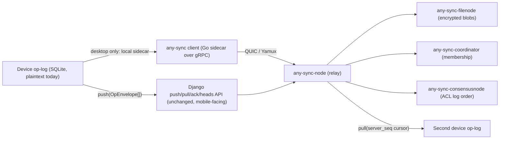

> **Related:** [storage-engine spec](./SPEC-storage-engine.md) (v0.2, ACTIVE); [data-sovereignty spec](./SPEC-data-sovereignty.md) (ACTIVE); [CSP spec](./SPEC-CSP.md); [multi-agent spec](./SPEC-multi-agent.md); `SPEC-petkg-longmemory.md` (sibling, drafted in parallel)

> **Status**: Active (founder-approved 2026-07-19)
> **Date**: 2026-07-19
> **Author**: @shahin (agent-drafted, founder review pending)
> **Audience**: engineers and reviewers
> **Tags**: `yar`, `sync`, `crdt`, `any-sync`, `loro`, `iroh`, `solid`, `identity`, `hipaa`, `op-log`, `pet-kg`

> **Implementation status**: Yar's op-log is real code today, not a design sketch. `backend/sync/models.py` and `views.py` (in `yar-code-20260705-2354`) implement an append-only `Operation` table keyed by a global `server_seq` pull cursor, `op_id` uniqueness for idempotent push, a Lamport clock plus deterministic `sort_key` tie-break for total order, and a pure-function reducer (`core.reducer.project`, `sort_key`, `projection_hash`) that any device or the server can replay to reach a bit-identical projection. `tests.py` verifies all 12 sync edge cases against this contract. Blobs are a flat sha256 content-addressed store, decoupled from the op-log, currently unencrypted. No real any-sync, Iroh, or Loro adapter is wired to this contract yet; the sync benchmark harness (`yar_supervisor_reproducible_benchmark_package/sync_benchmark/yar_sync_edge_bench.py`) simulates all 12 cases against the wire-format contract, not against a live transport. **O-1 (sync protocol choice) is resolved in this revision: adopt any-sync, narrowly scoped, MIT-licensed.**

# SPEC: Yar Sync Protocol

> **Reading options:** An ADHD-friendly progressive-disclosure rendering is generated from this file. The hand-maintained ADHD twin (`spec/adhd/SPEC-sync-protocol_adhd.md`) was retired 2026-07-16; see `_archive/cleanup_2026-07-16/adhd-twins/`.

**Reading time:** approximately 20 minutes.

**If you only read one thing:** Section 5 (Recommendation) and Section 7 (Coupling contract). The recommendation is to adopt `any-sync`'s MIT-licensed server components now, scoped only to transport, relay, ACL, and blob duties, while Yar's own already-tested reducer stays the sole authority on what a valid state transition is. Nothing in Yar's data model changes to accommodate this. The exit path to Loro plus Iroh, if the founder wants it later, is a transport swap, not a rewrite.

**BLUF:** Yar's CRDT op-log is the single source of truth, and it already exists as working code with 12/12 edge cases passing; the open question was only which transport replicates that log across devices. After broad research across ten-plus sync engines, this spec recommends **any-sync** (MIT, all server-node components) adopted narrowly for transport, relay, ACL, key custody, and blobs, with Yar's reducer kept authoritative and transport-agnostic so a later swap to Loro plus Iroh costs a new adapter, not a rewrite.

---

## 1. Problem

Yar runs on a person's phone and laptop. Both devices must converge to the same personal knowledge graph, task list, and brainmap without either one being a required always-on server. The person may be offline on a train, may reinstall a device, may run two devices that have not spoken to each other in three weeks, and may never touch a Yar-hosted server at all. Feature **F68** names this requirement directly: cross-device sync, offline-friendly, with no single required server holding the one true copy.

Three architectural commitments already exist and are not renegotiated here (see `SPEC-storage-engine.md`, ACTIVE):

1. The **CRDT op-log is the single source of truth**. The graph or query engine at L4 is a derived, rebuildable projection.
2. **SQLite plus FTS5 plus sqlite-vec** is the decided on-device engine (phone and laptop). **FalkorDB** is the decided server-tier engine, used only for an optional read projection, never as the source of truth.
3. Sync (L2, this spec) replicates the op-log. It does not replicate the derived engine state directly.

What was open, and what this spec resolves, is the transport, ACL, key-custody, and conflict-resolution layer that moves op-log entries between devices and, optionally, through a relay the person controls.

---

## 2. Requirements

| # | Requirement | Source |
|---|---|---|
| R1 | Converges deterministically; no primary node, no write lock, no ambiguous last-write-wins | `SPEC-storage-engine.md` architecture principle |
| R2 | Works fully offline; sync is an enhancement, never a dependency | F68; `SPEC-data-sovereignty.md` P2 |
| R3 | Server, if used, is optional and zero-knowledge (ciphertext only) | `SPEC-data-sovereignty.md` P3 |
| R4 | Mobile (Flutter) and desktop (Tauri plus Rust) both participate; mobile OS background limits are respected | `SPEC-sync-protocol.md` (prior draft); `ANYSYNC-FIT-ASSESSMENT` Section 3 |
| R5 | Commercially usable license (no ASAL, no copyleft that blocks static linking into a distributed app, no per-seat fee); Yar is fully free, no subscription | Org-wide licensing rule |
| R6 | Op-log format is stable and coupled coherently with the PeT temporal-KG's fact-assertion model (see Section 7) | This spec, new requirement |
| R7 | Passes the existing 12-case sync edge-benchmark against a **real** adapter, not only the simulated harness | `STORAGE_BENCHMARK_TRACKER.md` |
| R8 | HIPAA pathway: encryption at rest and in transit, audit trail, BAA-eligible hosting if a server is used for PHI-adjacent data | `SPEC-data-sovereignty.md` Section 6 |
| R9 | Reversible engineering bet: if the chosen transport proves wrong, the cost of switching is bounded | `SPEC-storage-engine.md` reversibility principle, applied to L2 |

---

## 3. Candidate Landscape (Research, July 2026)

Research was not limited to any-sync versus Loro plus Iroh. The table below reflects live verification against each project's current state as of July 2026, not the June 2026 snapshot in the prior draft.

### 3.1 Summary Table

| Candidate | License | July 2026 status | Fit for Yar |
|---|---|---|---|
| **any-sync** (server nodes + protocol) | MIT (all server components) | Production-proven at Anytype's userbase; active commits; four-node reference topology plus a lighter community single-binary bundle | Strong. Ships ACL, per-space keys, and a relay in one package |
| **Loro** | MIT | v1.13.x as of June 2026; fastest CRDT in public benchmarks; smaller ecosystem (~12k monthly downloads) than Yjs; actively maintained | Strong as an in-process CRDT library; no ACL/relay/key model of its own |
| **Iroh** | Dual MIT/Apache-2.0 | **v1.0 shipped June 15, 2026**; wire protocol and language API now declared stable; "hundreds of thousands of devices" in production per n0 | Strong transport primitive; still needs an app-level ACL and space model built on top |
| **Automerge 3.0** | MIT | Shipped; cuts memory use roughly 10x by using a compressed run-time representation; same file format and largely backward-compatible API vs Automerge 2 | Strong CRDT-library fallback to Loro; same gap as Loro (no ACL/relay of its own) |
| **Yjs / yrs** | MIT | Yjs remains the production default (~17k stars, ~920k weekly downloads); yrs (Rust port) actively released (0.27.2 as of mid-July 2026) | Mature and safe, but lowest stack-fit; deprioritized, not ruled out |
| **cr-sqlite (vlcn)** | MIT | Confirmed **stalled**: latest `@vlcn.io/crsqlite` npm publish is from mid-2024, no 2026 release; GitHub discussion activity has gone quiet | Ruled out for the sync layer |
| **ElectricSQL** | Apache-2.0 (Electric Next) | Pivoted (2024-2025) to a server-only Postgres-sync model ("Electric Next"): streams Postgres tables to clients over HTTP, no client-side CRDTs, no device-to-device sync | Ruled out: requires an always-on Postgres backend, violating R2 and F68's "no single required server" clause |
| **PowerSync** | Source-available core; Apache-2.0 client SDKs | Actively shipping in 2026 (SOC 2 and HIPAA attestation Jan 2026; JS SDK v1.39.0 Jul 10, 2026; .NET and SQL Server backends reached beta) | Not selected for L2: requires a always-on backend Postgres/MySQL/MongoDB/SQL Server; good pattern for a future *optional* cloud-projection sync (distinct from P2P device sync), not for the P2P core |
| **p2panda** | Dual MIT/Apache-2.0 (core); some components GPL-3.0 | Active; `p2panda-net` ships local-first sync, confidential discovery, and gossip as of 2026 | Promising, smaller ecosystem and less mobile-FFI polish than Loro or Iroh today; flagged as a watch item, not chosen |
| **Willow protocol / Earthstar** | LGPL-3.0 (willow-js, meadowcap) | Active development on Willow integration into Earthstar; capability-based access control (Meadowcap) is a genuinely good sovereignty fit | Not selected: LGPL-3.0 raises static-linking compliance overhead for a distributed mobile binary; also early-stage relative to any-sync or Iroh |
| **Ditto** | Proprietary, commercial pricing (ditto.live) | Actively funded ($82M round, March 2025) edge-sync platform with P2P mesh (Bluetooth, Wi-Fi Direct, LAN) | Ruled out on licensing alone: Yar is fully free with no subscription; embedding a paid SDK as a load-bearing dependency is incompatible with that constraint |
| **Cloudflare Agent Memory** (Apr 2026) | Proprietary (Cloudflare platform) | Durable-Object-per-agent SQLite pattern; interesting architecture, not a portable library | Not applicable: ties Yar to a single cloud vendor, contradicts device-first and self-host requirements |

### 3.2 any-sync in Depth

`ANYSYNC-FIT-ASSESSMENT_2026-07-16.md` (internal, dated three days before this spec) ran the most concrete verification available: it read Yar's actual `backend/sync/models.py`, `views.py`, and `tests.py`, and checked license metadata directly against each repository.

**Licensing (verified against GitHub license API, 2026-07-16):**

| Repo | Role | License | Commercially self-hostable, free? |
|---|---|---|---|
| `any-sync` | Core protocol: commonspace, ACL, consensus, net | MIT | Yes |
| `any-sync-node` | Sync and relay node | MIT | Yes |
| `any-sync-filenode` | Encrypted, content-addressed blob node | MIT | Yes |
| `any-sync-coordinator` | Membership and directory | MIT | Yes |
| `any-sync-consensusnode` | ACL log ordering | MIT | Yes |
| `any-store` | Embedded SQLite-backed doc store (pre-1.0, optional) | MIT | Yes, not load-bearing |
| `anytype-heart`, `anytype-ts/swift/kotlin` | Anytype's own client middleware and apps | ASAL 1.0 (source-available, non-commercial-leaning) | **No. Excluded, never touched.** |

The license boundary in the `anyproto` org runs exactly where the prior draft already drew it. Every server-node repo Yar would touch is unrestricted MIT; the restriction lives entirely in Anytype's own client middleware, which this plan never adopts.

**Maturity:** roughly 1 GB RAM for the full four-node reference stack (MongoDB, Redis, MinIO-compatible storage), or a single Go binary via the community `any-sync-bundle`. Official docs explicitly scope Docker Compose to "personal self-hosted any-sync networks," which is exactly Yar's deployment shape: a single-tenant, personal relay. There is no premature-scale mismatch.

**Protocol fit versus Yar's actual contract:** any-sync's per-object Merkle-DAG tree model does not map one-to-one onto Yar's single global `server_seq` cursor. That mismatch is real but bounded, because Yar's reducer already isolates all application logic behind pure functions (`project`, `sort_key`, `projection_hash`) that accept a plain list of wire-format ops and do not care which transport delivered them. The genuinely expensive part any-sync would require, a full ACL, per-space key, and membership model, is a cost Yar would carry under *any* production sync backend; any-sync gives it away as a working, MIT, battle-tested component instead of custom-built.

**Mobile path:** any-sync's client is Go, and Yar's mobile stack is Flutter plus a Rust core via `flutter_rust_bridge`. There is no Rust any-sync client. Running two native runtimes in one Flutter app before YC is avoidable complexity. The narrow-scope plan holds mobile back as a thin HTTP or gRPC client against the self-hosted any-sync node fleet, and gives desktop (Tauri) a local Go sidecar process, mirroring how Anytype's own desktop app is built.

Sources: [any-sync](https://github.com/anyproto/any-sync), [any-sync-node](https://github.com/anyproto/any-sync-node), [any-sync-filenode license](https://api.github.com/repos/anyproto/any-sync-filenode/license), [anytype-heart LICENSE.md](https://github.com/anyproto/anytype-heart/blob/main/LICENSE.md), [any-sync-dockercompose](https://github.com/anyproto/any-sync-dockercompose), [any-sync-bundle](https://github.com/grishy/any-sync-bundle), internal `ANYSYNC-FIT-ASSESSMENT_2026-07-16.md`.

### 3.3 Loro and Iroh in Depth

**Loro** (MIT): Rust crate, mobile bindings via Swift and `flutter_rust_bridge`. Container types: Text (Fugue algorithm), List, MovableList, Map, Tree, Counter. The movable Tree CRDT is the natural fit for the brainmap's graph adjacency (nodes as Tree entries, edges as Map entries), and built-in version-DAG time-travel is directly useful for PeT's temporal-fact history. As of June 2026, Loro is the fastest CRDT library in public benchmarks but has the smallest ecosystem of the three MIT options (Yjs, Automerge, Loro): roughly 12k monthly downloads versus Yjs's 920k. Actively maintained (releases through June 2026).

**Iroh** (dual MIT/Apache-2.0): shipped **v1.0 on June 15, 2026**, its first release with a formally stable wire protocol and language API: "an iroh v1 endpoint will be able to communicate with another iroh v1 endpoint, regardless of minor version or language." This closes the "pre-1.0" risk flagged in the prior draft. Iroh dials by public key rather than IP address, using QUIC with hole-punching and relay fallback, and is already in production on "hundreds of thousands of devices" per n0's own announcement.

**What Iroh's 1.0 stability does not solve:** Iroh and Loro together are a transport plus CRDT-library pair, not an ACL, space, or key-custody system. Building that layer from parts remains the same cost it was in the prior draft; Iroh's new stability makes the transport half of Option B materially safer, but does not close the gap that made any-sync attractive in the first place.

Sources: [Loro GitHub](https://github.com/loro-dev/loro), [Loro vs Yjs vs Automerge 2026](https://www.pkgpulse.com/guides/yjs-vs-automerge-vs-loro-crdt-libraries-2026), [Iroh 1.0 announcement](https://www.iroh.computer/blog/v1), [Iroh GitHub](https://github.com/n0-computer/iroh), [Iroh 1.0 coverage](https://www.techtimes.com/articles/318490/20260616/peer-peer-library-iroh-10-ships-dial-devices-key-not-ip-address.htm).

### 3.4 Automerge 3.0 and Yjs/yrs

**Automerge 3.0** shipped and cut memory usage roughly 10x by using a compressed runtime representation; a document that consumed 700 MB in Automerge 2 uses about 1.3 MB in Automerge 3. Same file format, largely backward-compatible API. MIT licensed. Remains the designated fallback if Loro integration proves too costly.

**Yjs / yrs**: Yjs is the de facto production default in the wider ecosystem (~17k GitHub stars, ~920k weekly downloads), MIT licensed, maintained continuously since 2015. `yrs`, the Rust port, is actively released (0.27.2 mid-July 2026). Both remain deprioritized for Yar specifically: they add no capability over Loro or Automerge for this stack and score lowest on Flutter and mobile-FFI fit.

Sources: [Automerge 3.0 blog](https://automerge.org/blog/automerge-3/), [Automerge GitHub](https://github.com/automerge/automerge), [Yjs GitHub](https://github.com/yjs/yjs), [y-crdt / yrs GitHub](https://github.com/y-crdt/y-crdt), [Yjs license](https://docs.yjs.dev/license).

### 3.5 Ruled Out, With Reasons

| Candidate | Reason ruled out |
|---|---|
| **cr-sqlite (vlcn)** | Confirmed stalled: no 2026 release found; last npm publish mid-2024. Already flagged in `SPEC-storage-engine.md`; this research confirms it independently |
| **ElectricSQL** | Requires an always-on Postgres backend; no client-side CRDT or device-to-device path; violates R2 and F68 |
| **PowerSync** | Same shape as ElectricSQL: a managed client-server sync engine against a backend SQL database, not a P2P device mesh. Good pattern to revisit if Yar ever wants an *optional* cloud-projection sync layer, but not the L2 core |
| **Ditto** | Proprietary, paid SDK; incompatible with "Yar is fully free, no subscription" |
| **Willow / Earthstar** | LGPL-3.0 static-linking compliance overhead; earlier-stage than any-sync or Iroh |
| **p2panda** | Promising design, smaller mobile-FFI ecosystem than the chosen stack today; kept as a watch item for a future major revision |
| **Cloudflare Agent Memory** | Proprietary, single-cloud-vendor; contradicts device-first and self-host requirements |

---

## 4. O-1 Scoring Table

Scored 1 to 5 per criterion (5 is best fit for Yar), against the two live contenders plus the two next-closest alternatives, for transparency.

| Criterion | any-sync | Loro + Iroh | Automerge 3 + Iroh | PowerSync |
|---|:--:|:--:|:--:|:--:|
| License (commercial, no copyleft, no fee) | 5 | 5 | 5 | 3 (source-available core) |
| Ships ACL + key custody + relay as one package | 5 | 1 (must build) | 1 (must build) | 3 (has auth, not P2P ACL) |
| P2P, offline-first, no required server | 5 | 5 | 5 | 1 (requires backend DB) |
| Production maturity at meaningful scale | 5 | 3 | 4 | 4 |
| Mobile (Flutter) fit today | 3 (thin client only) | 4 (`flutter_rust_bridge`) | 4 | 3 |
| Time to ship before YC (effort) | 5 (4-6 eng-weeks per internal assessment) | 2 (ACL/key build is the long pole) | 2 | 3 |
| Reversibility if wrong | 5 (reducer stays authoritative; swap is a transport adapter) | 4 | 4 | 3 |
| **Total (out of 35)** | **33** | **24** | **25** | **20** |

The gap is not close. any-sync wins on the two dimensions that dominate a pre-YC timeline: it ships the ACL, key-custody, and relay package that every other option requires Yar to build from scratch, and Yar's own reducer contract already makes the choice reversible.

---

## 5. Recommendation

**Conclusion:** adopt **any-sync** now, narrowly scoped to transport, relay, ACL, key custody, and blob duties. Yar's own reducer (`project`, `sort_key`, `projection_hash`) stays authoritative and transport-agnostic. any-sync never becomes the source of truth for conflict resolution; it is a pipe.

**Licenses in this stack:**

| Component | License |
|---|---|
| `any-sync` (protocol) | MIT |
| `any-sync-node` | MIT |
| `any-sync-filenode` | MIT |
| `any-sync-coordinator` | MIT |
| `any-sync-consensusnode` | MIT |
| Loro (op-payload CRDT library, decoupled decision, see Section 5.2) | MIT |
| Automerge 3.0 (fallback to Loro) | MIT |

**Rationale, in order of weight:**

1. **The expensive part was coming regardless.** ACL, per-space keys, and a membership model are open item O-3 in the prior draft under *any* sync backend. Borrowing any-sync's proven design is reuse, not new scope.
2. **Licensing is clean at exactly the boundary Yar needs.** Every component touched is MIT; the one real restriction (ASAL on Anytype's own client) is never touched.
3. **Maturity matches Yar's actual deployment shape.** any-sync's own docs scope self-hosting to "personal" networks; Yar's relay is explicitly a single-tenant personal relay already (see `RegisterView` docstring: "Personal relay, MVP trust model").
4. **Yar's reducer is already transport-agnostic by construction.** `project()`, `sort_key()`, and `projection_hash()` take a plain list of wire-format ops. Nothing about them assumes a transport. any-sync sits behind that contract without displacing it.
5. **Effort is bounded and estimated.** 4 to 6 engineer-weeks for a 2-person team to reach a real adapter passing the 12-case edge benchmark (Phases 0 to 2 of the integration plan in Section 6.4). This is not YC-blocking.
6. **Iroh's new v1.0 stability is a reason to keep the exit door open, not a reason to walk through it now.** It removes the pre-1.0 risk from Option B, but does not remove the ACL-and-keys cost, which remains the deciding factor.

**What would change this recommendation:**

- If any-sync's ACL or space model proves to fight Yar's single global `server_seq` cursor harder than the Phase 1 prototype suggests (i.e., the aggregation-layer cost in Section 3.2 turns out to be weeks, not days), fall back to Loro plus Iroh, now materially de-risked by Iroh 1.0.
- If Anytype or the Any Association materially changes the license or governance of the MIT server-node repos, re-evaluate immediately; the fork-or-replace option stays open exactly because Yar's reducer, not any-sync's, remains authoritative.
- If Yar ever needs true mobile P2P embedding (not a thin client against a self-hosted node fleet) and the team is willing to run two native runtimes (Go and Rust) in the Flutter app, that changes the mobile-fit score in Section 4 and merits revisiting.
- If a future major revision of p2panda or Willow closes their current mobile-FFI and licensing gaps, they become worth a fresh scoring pass.

### 5.1 Decoupled Decision: CRDT Container Library for Op Payloads

any-sync accepts Yar's existing wire-format ops as **opaque change payloads** inside an any-sync object tree; it does not care what is inside the payload. This decouples the transport decision (Section 5, above) from the question of what encodes an op's content, especially for the brainmap's graph structure and PeT's fact history.

**Recommendation:** use **Loro's Tree and Map containers** (MIT) as the in-process representation for brainmap nodes and edges, serialized into the op payload's `payload` field. Loro's movable-Tree CRDT is a materially better fit for a graph that gets restructured (moved, relinked) than a flat JSON diff would be, and its built-in time-travel is directly useful for PeT's longitudinal fact history. This is a library choice inside Yar's own process, not a transport choice; it ships behind the same reducer contract and never talks to any-sync's network layer directly. If Loro integration proves too costly, Automerge 3.0 is the documented drop-in fallback for the same role.

### 5.2 Mobile and Desktop Split (Phase 1)

| Platform | Path | Rationale |
|---|---|---|
| **Desktop** (Tauri plus Rust) | Local Go sidecar process runs the any-sync client over localhost gRPC or a Unix socket | Mirrors Anytype's own proven desktop architecture; low bridging risk |
| **Mobile** (Flutter plus `flutter_rust_bridge`) | Thin HTTP or gRPC client against the self-hosted any-sync node fleet; no embedded Go runtime in phase 1 | Avoids running two native runtimes (Go, Rust) in one mobile app before YC; matches `ANYSYNC-FIT-ASSESSMENT`'s explicit recommendation |
| **Server relay** (optional, person's own) | any-sync-node plus any-sync-filenode plus any-sync-coordinator plus any-sync-consensusnode, self-hosted, single-tenant | Zero-knowledge target once E2E encryption (Section 8) lands; until then, plaintext transition period per `SPEC-data-sovereignty.md` |

---

## 6. Architecture and Wire Protocol

### 6.1 Layer Placement (Unchanged Data Fabric)

| Layer | Label | Status after this revision |
|---|---|---|
| L7 | Agents and UI | Decided (unchanged) |
| L6 | Consent and Access (WAC now, ACP later, Solid pods as portability mirror) | Decided (unchanged) |
| L5 | Vectors and GraphRAG (sqlite-vec) | Follows L4 |
| L4 | Graph index (SQLite device, FalkorDB server) | Decided, ACTIVE per `SPEC-storage-engine.md` |
| **L3** | Storage; encrypted blob store | **Decided this revision: `any-sync-filenode`** |
| **L2** | Replication and convergence (CRDT op-log = source of truth) | **Decided this revision: `any-sync` transport** |
| L1 | Identity and keys (WebID, Solid-OIDC, did:web) | Decided (unchanged); any-sync per-space symmetric keys layered underneath, see Section 8 |
| L0 | Transport and discovery | **Decided this revision: any-sync's QUIC/Yamux transport for the relay path; mDNS and Tailscale retained for LAN and overlay discovery of Yar devices themselves** |

### 6.2 Op Envelope (Wire Format)

This is the schema every op carries, whether it originates from a task edit, a note edit, a brainmap Placer or Reviser action, or a CSP sensor observation. It formalizes the fields already implemented in `backend/sync/models.py` and extends them for the coupling contract in Section 7.

```yaml
OpEnvelope:
  op_id:        { type: string, required: true }   # content-derived UUID; idempotency key
  device_id:    { type: string, required: true }   # actor; maps to any-sync member identity
  actor_id:     { type: string, required: true }   # person or agent that authored the op (may differ from device_id for agent-authored ops, e.g. yar.placer.v1)
  lamport:      { type: integer, required: true }  # Lamport clock, existing field
  hlc:          { type: string, required: true }   # NEW: hybrid logical clock (physical_ms << 20 | logical_counter), for human-legible ordering and debugging; sort_key tie-break stays Lamport + device_id, unchanged
  entity_type:  { type: enum, required: true }     # task | note | brainmap_node | brainmap_edge | pet_fact | consent_grant | csp_observation | revision_history
  op_type:      { type: enum, required: true }     # create | update | delete | move | link | unlink | assert | retract
  object_id:    { type: string, required: true }   # target entity's stable id
  payload:      { type: bytes, required: true }    # today: plaintext JSON; target: NaCl crypto_box ciphertext (see Section 8)
  consent_ref:  { type: string, required: false }  # required when entity_type = csp_observation, per SPEC-CSP Section 4.1
  space_id:     { type: string, required: true }   # NEW: any-sync space id; single-tenant personal space by default
  signature:    { type: string, required: true }   # Ed25519 over canonical envelope bytes
```

### 6.3 Transport Path



The existing Django `push`, `pull`, `ack`, and `heads` HTTP API stays exactly as built. any-sync sits behind it (desktop sidecar) or beside it (mobile thin client), never in front of it. Each `OpEnvelope` becomes the opaque payload of an any-sync tree change; any-sync's own Merkle-DAG per object provides transport-level integrity and ordering, while Yar's reducer computes the authoritative total order and projection hash independent of what any-sync's own merge would produce.

### 6.4 Integration Plan (Unchanged From Internal Assessment)

| Phase | Work | Duration |
|---|---|---|
| 0 | Stand up the four-node any-sync network locally (`any-sync-dockercompose` or the lighter `any-sync-bundle`); confirm the ~1 GB RAM footprint | 2 to 3 days |
| 1 | Minimal Go adapter: one space, push/pull Yar's existing `OpEnvelope`s as opaque tree-change payloads; re-run the 12-case edge benchmark against this real backend | 1 to 2 weeks |
| 2 | Desktop sidecar integration (Tauri spawns or connects to the any-sync client); Django API stays alive as the mobile-facing thin-client surface | 1 to 2 weeks |
| 3 (post-YC, deferred) | Full ACL and per-space key wrapping in Yar's own domain model, `any-sync-filenode` blob migration, true mobile P2P embedding if ever wanted | Not scoped here |

**Total: 4 to 6 engineer-weeks for Phases 0 to 2**, matching the internal assessment's estimate and not YC-blocking.

---

## 7. Coupling Contract (Sync x Storage x PeT)

This section is the interface contract between this spec, `SPEC-storage-engine.md`, and the parallel `SPEC-petkg-longmemory.md`. All three specs must agree on this without restating it three different ways.

### 7.1 The Invariant

> **The Yar reducer is the sole authority on what a valid, converged state is, for every data type this spec touches, regardless of which sync engine transports the op-log or which storage engine materializes the read projection.**

Concretely:

- `any-sync` (or any future transport) never decides whether an op is valid, never resolves a conflict, and never determines the projected state. It moves bytes.
- SQLite and FalkorDB (Section 6.1, `SPEC-storage-engine.md`) never originate state; they are rebuilt by replaying the op-log through the reducer.
- The PeT temporal-KG (`SPEC-petkg-longmemory.md`) is not a separate data store with its own write path. **PeT facts are `OpEnvelope`s with `entity_type: pet_fact`**, riding the identical op-log, replicated by the identical transport, subject to the identical reducer.

### 7.2 PeT Fact Assertion and Retraction as Ops

PeT nodes carry predefined types or free-form facts, and capture the temporal evolution of those facts (REMem-style: nothing is overwritten, everything is dated). This maps directly onto the op envelope:

```yaml
# op_type: assert
entity_type: pet_fact
object_id: "fact:person.energy_level:2026-07-19T14:00Z"   # stable per-assertion id
payload:
  subject: "user"
  predicate: "yar.energy_level"        # AxisRef per SPEC-CSP, or a free-form predicate
  object: { scalar: 3, unit: null }
  asserted_at: "2026-07-19T14:00:00Z"  # matches hlc physical component
  valid_from: "2026-07-19T14:00:00Z"
  valid_until: null                     # null = still current
  provenance: { source: "csp_observation:org.cytognosis.yar.selfreport", op_id: "..." }

# op_type: retract (a later, separate op; never mutates the original)
entity_type: pet_fact
object_id: "fact:person.energy_level:2026-07-19T14:00Z"    # references the asserted fact's object_id
payload:
  retracted_at: "2026-07-19T18:30:00Z"
  reason: "user_correction"             # or superseded_by_new_assertion, consent_withdrawn
```

**Rule:** assertions are append-only and immutable once written. A retraction is always a new op that references the original fact's `object_id`; it never edits or deletes the original envelope. This gives PeT its full temporal history for free, as a direct consequence of the op-log's own append-only design, with no separate versioning mechanism to build or keep in sync.

**Rule:** "current state" for any fact key is computed by the reducer as the latest non-retracted assertion at a given point in time, exactly the same pattern Yar's reducer already uses for `object.tombstoned` precedence on tasks and notes (Section 9.4).

### 7.3 CSP Observations Ride the Same Log

Per `SPEC-CSP.md` Section 2: "Every observation produced by a CSP adapter becomes a CRDT operation on the op-log. Adapters do not write directly to the graph engine." This spec's op envelope is exactly that entry point: `entity_type: csp_observation`, with `consent_ref` mandatory (default-deny, per CSP PB-4), and `payload.privacy_tier` inherited from the adapter's `SensorDescriptor`. Raw signals never appear in `payload`; only `boundary_derived` or `on_device_only`-tagged structured results do, consistent with CSP's own hard-reject pattern (`VoiceAffectPolicy`, Section 5.4 of `SPEC-CSP.md`).

### 7.4 Multi-Agent Writes Ride the Same Log

Per `SPEC-multi-agent.md` Section 8.2: Placer's Tree inserts, Reviser's Tree moves and Map renames, and revision-history Map appends are all CRDT ops, not direct database writes. Under this spec, that means every Placer and Reviser action is an `OpEnvelope` with `actor_id` set to the agent's id (for example `yar.placer.v1`), not a device id, while `device_id` still records which physical device ran the agent. This distinction (`actor_id` versus `device_id`) is new in this revision and is required for audit: it lets the reducer and any future audit trail distinguish "the person typed this" from "the Placer agent inferred this."

### 7.5 What Storage Consumes, What Sync Delivers

| Concern | Owned by | Consumed by |
|---|---|---|
| Op validity, ordering, conflict resolution | This spec's reducer contract (`project`, `sort_key`, `projection_hash`) | Both SQLite (device) and FalkorDB (server) projections |
| Transport, delivery, retry, idempotency | any-sync (this spec, Section 6) | The reducer, which never sees transport-layer detail |
| Graph traversal, vector search, full-text search | `SPEC-storage-engine.md` (SQLite plus FTS5 plus sqlite-vec; FalkorDB) | End-user features, never the sync layer |
| Temporal fact history, retrieval quality | `SPEC-petkg-longmemory.md` | Reads the reducer's projection; never writes around it |

---

## 8. ACL, Identity, and Keys

### 8.1 Layered Identity Model (Mostly Unchanged)

| Layer | Component | Status |
|---|---|---|
| Person-level identity | WebID, Solid-OIDC, `did:web` | Decided, unchanged from prior draft |
| Device-level identity | any-sync member identity, Ed25519 keypair generated on first launch | New this revision: any-sync's per-member identity model is adopted as the device-identity mechanism underneath WebID |
| Space-level access | any-sync per-space symmetric key, wrapped to member identities | New this revision, borrowed directly from any-sync's design per the prior draft's own O-3 leaning |
| Op-level authorship | `actor_id` field in the op envelope (Section 6.2) | New this revision, needed for agent-authored ops (Section 7.4) |

### 8.2 Key Custody

| Concern | Design |
|---|---|
| Key generation | Device-local; NaCl keypair generated on first launch, per `SPEC-data-sovereignty.md` Section 4.3 |
| Key storage | OS keychain (macOS Keychain, Windows DPAPI, Linux Secret Service, iOS/Android keystore) |
| Space membership | Single-tenant personal space by default; the person's own devices are the only members. Multi-member spaces (shared family, clinician access) are explicitly out of scope for v1 and tracked as an open decision (O-6, Section 13) |
| Key rotation | Re-encrypt the local op-log; re-push under the new key; invalidate the old device token at the any-sync coordinator |
| Key recovery | Export a recovery key to the person (paper or password manager); **no server-side recovery**, consistent with zero-knowledge relay (`SPEC-data-sovereignty.md` P3) |
| Multi-device pairing | QR-code or out-of-band secret exchange during device pairing (`SPEC-data-sovereignty.md` DS-2) |
| Break-glass (clinical emergency override) | Deferred; shared open decision with `privacy-boundary-spec.md`'s PAP (policy administration point) problem. Not resolved by this spec |

### 8.3 E2E Encryption Status (Honesty Check)

`SPEC-data-sovereignty.md` states the target plainly: "the server should hold encrypted op payloads (ciphertext)". As of this revision, `Operation.payload` is a **plaintext** `JSONField` in the live codebase. Calling the current server relay "zero-knowledge" would not be accurate yet. **Phasing (founder decision, 2026-07-19):** in the early phase, where all agents run locally and any relay is self-hosted and single-tenant (the person's own infrastructure), plaintext transition builds are acceptable, provided documentation and in-app copy label them clearly as transition-period builds, never as zero-knowledge. E2E encryption (NaCl `crypto_box`, per `SPEC-data-sovereignty.md` DS-1) becomes a **hard prerequisite before any Cytognosis-hosted relay or central/cloud agent ships** (for example agents running on Cytognosis infrastructure). Schedule the encryption work with the cloud-agent milestone, not the local-first launch.

### 8.4 Access Control at L6 (Unchanged)

WAC now, ACP at approximately 6 months, Solid pods as the portability mirror at L6. This spec does not change the L6 decisions from the prior draft. Solid stays the portability and consent layer, never the hot path; the hot path is the op-log (L2) and the graph engine (L4).

---

## 9. Conflict Resolution Semantics

All four data types share the same underlying mechanism (deterministic reducer over a totally ordered op-log) but differ in the concurrency pattern each needs to handle gracefully.

### 9.1 Tasks

| Concern | Rule |
|---|---|
| Field-level concurrent edit | Last-write-wins per field, tie-broken by `sort_key` (Lamport, then `device_id`) |
| Completion state | Monotonic by default: a `done` op wins over a concurrent `not done` op at the same or earlier lamport. An explicit `reopen` op with a strictly later lamport can un-complete a task |
| Delete versus update race | Tombstone-beats-update at equal or later lamport (already implemented and tested: `delete_update_race_delete_wins`); an update with a strictly later lamport than the tombstone revives the task (`delete_update_race_update_wins`) |

### 9.2 Notes (Free Text)

| Concern | Rule |
|---|---|
| Single-device edits | Whole-note LWW today (matches the live `Operation` model) |
| Concurrent multi-device character-level edits | Target state once Loro is integrated (Section 5.1): Loro's Fugue text CRDT merges concurrent edits at the character level, no data loss on concurrent typing |
| Interim state (Loro not yet wired) | Block-level merge: concurrent edits to disjoint paragraphs both survive; edits to the same paragraph fall back to whole-paragraph LWW, flagged to the user as a soft merge conflict in the UI |

### 9.3 Brainmap Nodes and Edges

| Concern | Rule |
|---|---|
| Node move | Movable-Tree CRDT semantics (Loro `Tree`): last mover wins by lamport, then `device_id`, matching Section 5.1 |
| Node rename | LWW on the label field, same tie-break |
| Edge add versus remove race | Add-wins set semantics: a concurrent add and remove of the same edge resolve to present unless the remove's lamport strictly follows the add's |
| Node delete versus update race | Same tombstone-beats-update rule as tasks (Section 9.1), since Placer and Reviser writes go through the identical reducer |
| Revision history | Append-only CRDT Map; never merged or rewritten, only added to, per `SPEC-multi-agent.md` Section 6.4 |

### 9.4 PeT Facts

| Concern | Rule |
|---|---|
| Concurrent assertions of the same predicate from two devices | Both survive as distinct, timestamped assertions; PeT is temporal by design, so there is no "conflict" to resolve, only two facts that are both true at their respective `valid_from` times |
| Retraction racing a new assertion | The reducer computes "current" as the latest non-retracted assertion by `hlc`; a retraction of an older assertion never affects a newer one |
| Query semantics | "What did the person believe as of time T" is always answerable by replaying the op-log up to T and reducing; this is the same replay mechanism the op-log already provides for undo (Section 9.3, revision history) |

---

## 10. Failure Modes and Offline Behavior

| Failure mode | Behavior |
|---|---|
| Fully offline (no network) | All four data types remain fully functional; ops accumulate in the local SQLite op-log; sync is not required for any core feature, per R2 and F68 |
| Reconnect after long partition | Devices exchange missing ops via `pull(server_seq)` or any-sync's per-tree head reconciliation; the 12-case benchmark's `network_partition_bridge` case covers this; no manual merge step is exposed to the person |
| Duplicate delivery | `op_id` uniqueness makes replay idempotent (`duplicate_replay` case) |
| Out-of-order delivery | `sort_key` total order is computed independent of arrival order (`out_of_order_chunks` case) |
| New device bootstrap | Full op-log replay from the relay, or from any already-synced peer device directly, per `new_device_bootstrap` |
| Device reinstall | Treated as a new actor with a fresh keypair; old device token is invalidated at the coordinator (`device_reinstall_new_actor`) |
| Mobile OS background execution limits | Sync is deferred to app-foreground sessions or platform background-fetch windows (iOS BGTaskScheduler, Android WorkManager); this is a known, tracked conformance gap, not yet solved by a real adapter |
| Guard or relay unavailable | Fails toward local-only: the app continues fully functional device-locally; sync silently queues and retries with backoff, never blocking a user action |
| Malicious or Byzantine peer | Out of scope for a single-tenant personal relay in v1; any-sync's own signed Merkle-DAG provides tamper evidence at the transport layer as a secondary defense, not Yar's primary trust model |
| Server-side data purge on request | Per `SPEC-data-sovereignty.md` DS-3: purge after all devices confirm receipt; sync protocol must support a purge-confirmation round-trip (open item, Section 13) |

---

## 11. Risks

| Risk | Mitigation |
|---|---|
| any-sync's client is Go-only; no Rust FFI exists | Desktop sidecar (Section 5.2) avoids embedding Go in the Rust core; mobile stays a thin remote client in phase 1 |
| E2E encryption is not yet implemented; current relay is plaintext | Phased per Section 8.3: acceptable for self-hosted single-tenant early builds with clear labeling; hard prerequisite before any Cytognosis-hosted relay or cloud agent ships |
| Vendor continuity: any-sync's MIT repos are steered by one company (Anytype / Any Association) | Mitigated structurally: Yar's reducer, not any-sync's object model, is the source of truth, so a fork or full replacement of the transport remains possible without an application rewrite |
| Single-tenant assumption may not hold if Yar ever adds shared spaces (family, clinician) | Tracked as an explicit open decision (O-6, Section 13); any-sync's space model can extend to this, but it is out of scope for v1 |
| Loro's smaller ecosystem versus Yjs | Automerge 3.0 is the documented, MIT, memory-efficient fallback; this is a decoupled decision from the transport choice (Section 5.1) and low-stakes by the founder's own prior framing |
| Mobile background execution limits are unresolved | Explicitly named as an open conformance gap (Section 10); needs `SPEC-edge-ai-hybrid.md` coordination, not solvable inside this spec alone |
| PAP (runtime-updatable access policy) is deferred, shared with `privacy-boundary-spec.md` | Resolve in one place; do not let this spec or CSP each invent a separate answer |

---

## 12. Test Plan

| Test | Scope | Gate |
|---|---|---|
| 12-case edge benchmark against the real any-sync adapter (not just the simulated harness) | Idempotency, ordering, chunking, crash-resume, device lifecycle, tombstone races, tie-breaking, partition healing, blob transfer, anti-pattern guard | Must pass 12/12 before Phase 2 (Section 6.4) is considered done |
| PeT assert/retract ordering test | New: concurrent assertion plus retraction across two devices resolves to the rule in Section 9.4 | Blocks `SPEC-petkg-longmemory.md` sign-off |
| Cross-agent op interleaving test | New: Placer and Reviser ops interleaved with person-authored edits on the same brainmap session resolve deterministically, `actor_id` correctly distinguishes authorship | Blocks Wave 0 multi-agent integration |
| E2E encryption round-trip test | Payload encrypted on-device, opaque at relay, decrypted correctly on a second device | Hard gate before any Cytognosis-hosted relay or cloud agent ships (Section 8.3) |
| Key rotation test | Rotate a device's key mid-session; old token invalidated; no data loss | Required before multi-device GA |
| ACL and space membership test | Add and remove a device from a personal space; confirm access revocation takes effect within one sync round-trip | Required before multi-device GA |
| Mobile background-limit soak test | iOS and Android background fetch windows; confirm no silent data loss when the app is backgrounded mid-sync | Required before mobile GA; currently unresolved (Section 10) |
| NAT traversal and relay fallback chaos test | Kill the relay mid-sync; confirm devices queue and recover without corruption | Required before production relay deployment |
| Solid pod export round-trip test | Full op-log and blob export in JSON and Markdown; re-import to a second Yar instance | Required for `SPEC-data-sovereignty.md` P4 (export as a right) |

---

## 13. Open Questions

Each item states a recommendation; none are left as a bare menu.

| # | Question | Recommendation |
|---|---|---|
| **O-1** | Sync protocol: any-sync vs Loro plus Iroh | **Resolved in this revision: any-sync**, narrowly scoped (Section 5). Revisit only if the Phase 1 prototype (Section 6.4) shows the ACL/space aggregation cost is materially higher than estimated |
| **O-2** | CRDT container library for op payloads (brainmap Tree, note Text) | **Recommend Loro**, MIT, decoupled from O-1 (Section 5.1). Fallback to Automerge 3.0 if Loro integration proves costly; both are drop-in at the payload-encoding layer, not the transport layer |
| **O-3** | Key custody and ACL design | **Recommend adopting any-sync's per-space key-wrapping and member-identity model directly** (Section 8.1-8.2), reimplemented against Yar's own privacy-boundary schema rather than Anytype's object model. Break-glass and PAP stay a shared open item with `privacy-boundary-spec.md` |
| **O-4** | Encrypted blob store | **Resolved: `any-sync-filenode`**, following O-1. Applies directly to CSP's `waveform_ref` blobs (`SPEC-CSP.md` O-5) once this spec's O-1 was decided |
| **O-5** | Enterprise pod hosting for the L6 Solid portability layer | Community Solid Server for prototype; Inrupt ESS or self-hosted CSS for production. No public pod provider offers a HIPAA BAA; self-host is required for PHI-adjacent data. Unchanged from the prior draft |
| **O-6** | Multi-member spaces (shared family access, clinician access) | **Recommend deferring past v1.** Single-tenant personal space covers F68 fully. Revisit only if a specific Wave 2 or Wave 3 feature needs shared write access to the same space |
| **O-7** | Server-side purge confirmation round-trip (`SPEC-data-sovereignty.md` DS-3) | **Recommend a simple three-state protocol**: `purge_requested` -> `all_devices_acked` -> `purged`, implemented as ops on the same log, so the purge request and its confirmations are themselves auditable. Needs a short design pass before DS-3 can close |
| **O-8** | Mobile true P2P embedding (versus thin client against self-hosted node fleet) | **Recommend staying with the thin-client pattern through YC.** Revisit only if the founder decides a second native runtime (Go alongside Rust) in the Flutter app is worth the maintenance cost; no current feature requires it |

---

## 14. Cross-References

- `SPEC-storage-engine.md` (v0.2, ACTIVE) -- L4 engine details (SQLite device, FalkorDB server); this spec is the source layer L4 consumes.
- `SPEC-data-sovereignty.md` (ACTIVE) -- device-first trust boundary, zero-knowledge relay target, encryption requirements this spec must satisfy before any production relay ships.
- `SPEC-CSP.md` -- sensor observation schema; CSP observations enter the system as `OpEnvelope`s per Section 7.3 of this spec.
- `SPEC-multi-agent.md` -- Placer, Reviser, and revision-history writes as `OpEnvelope`s per Section 7.4 of this spec; `actor_id` distinguishes agent-authored from person-authored ops.
- `SPEC-petkg-longmemory.md` (sibling, drafted in parallel) -- PeT fact assertion and retraction schema; this spec's Section 7.2 is the shared contract both documents must agree on verbatim.
- `STORAGE_BENCHMARK_TRACKER.md` -- living status table for engine and sync options; O-5 through O-8 there map to this spec's O-1, O-3, and O-4.
- `ANYSYNC-FIT-ASSESSMENT_2026-07-16.md` -- the concrete any-sync fit analysis against Yar's actual codebase that this spec's recommendation is built on.
- `privacy-boundary-spec.md` -- shared PAP (policy administration point) open decision; resolve in one place, reflected here and in `SPEC-CSP.md`.
- `docs/04-Engineering/yar/research/solid-pods-comprehensive.md` -- detailed Solid server comparison for O-5.
- `EFFORT-ESTIMATES.md` -- cross-node sync effort estimate (28 to 48 engineer-weeks, high end assumes a fully custom protocol regardless of which library wins; the any-sync path in this spec targets the low end of that range for Phases 0 to 2).
- `DEPENDENCY-GRAPH.md` -- T01 (cross-node sync) has zero hard dependencies and blocks T04 (multi-agent orchestration); this spec closing O-1 unblocks that downstream work.
