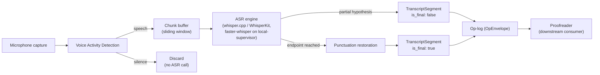

> **Status**: Draft v1
> **Date**: 2026-07-19
> **Author**: @shahin (agent-drafted, founder review pending)
> **Audience**: engineers
> **Tags**: `yar`, `transcriber`, `asr`, `stt`, `streaming`, `edge-ai`, `cap`

# SPEC: Yar Transcriber Agent

**Reading time**: about 15 minutes.

**BLUF**: The **Transcriber** is Yar's ASR and segmentation worker; it converts a voice turn into `TranscriptSegment` events on the shared op-log and does nothing else, no conversational response, no affect sensing, no diarization. The server tier already ships this today with mock and **faster-whisper** providers (MIT); this spec recommends **whisper.cpp** (MIT) plus **WhisperKit** (MIT) for the device tier once that work starts, keeps the Transcriber edge-first and never cloud-escalating for raw audio, and defines the streaming, partial-transcript, and schema contract the **Proofreader** consumes downstream.

**If you only read one thing**: Section 3 (model recommendation, both tiers) and Section 5 (the `TranscriptSegment` schema). Everything else in this spec exists to support those two decisions.

---

> **Implementation status (2026-07-19)**
>
> | Component | Status |
> |---|---|
> | Server-tier ASR (`backend/transcribe/`, mock + faster-whisper providers, content-hash blob archive) | **SHIPPED (MVP)**, per `YAR-CLIENT-EVAL.md` |
> | Device-tier ASR (whisper.cpp / WhisperKit seam) | **GROUNDWORK**, documented, not bundled |
> | Streaming partial-transcript UX (chunked re-decode, no native incremental transducer) | **PARTIAL**, inherits Whisper's chunked-window limitation (Section 4.2) |
> | `TranscriptSegment` schema and op-log emission (this spec) | **DESIGN, this revision** |
> | CAP Directive wiring for the Transcriber | **NOT WIRED**, tracked as the same structural gap `SPEC-multi-agent.md` Section 13 already records |
> | `speaker_hint` diarization field | **SEAM ONLY**, no diarization model integrated; see Section 2.3 |

---

## 1. Problem

Yar has an ASR pipeline that works. What it does not have is a name-scoped, schema-defined contract for what that pipeline emits, or a documented reason for which STT model runs where. `YAR-CLIENT-EVAL.md` confirms the server tier already ships mock and **faster-whisper** providers with a content-hash blob archive, and that the device tier (whisper.cpp on Android and iOS, WhisperKit on Apple platforms) is a documented seam, not bundled code. `SPEC-multi-agent.md` v0.2 fixes the agent's name (**Transcriber**, never "Placer" or the old three-agent gloss) and its one job: convert voice to transcript fragments and segment-boundary events, nothing more. `SPEC-cactus-routing.md` fixes the Transcriber's routing row as edge-first and never escalating, because raw audio is `device_only` under the privacy boundary and no confidence score changes that.

What was still missing, and what this spec closes: a concrete model recommendation per tier with verified July 2026 licenses, a streaming design that names how partial and finalized segments are told apart, and the exact schema the **Proofreader** reads off the op-log. `EFFORT-ESTIMATES.md` row 1 already flagged the open items this spec resolves: whisper.cpp, faster-whisper, and OpenAI Whisper's licenses needed direct verification rather than secondary-source claims, and the Interviewer's conversational role does not exist yet, only the ASR role does, which is exactly the boundary Section 2 draws formally.

---

## 2. Scope and boundaries

### 2.1 In scope

- Model selection for on-device (edge) and server/local-supervisor (self-hosted) ASR, with verified licenses.
- Streaming architecture: voice-activity detection (VAD), chunking, partial versus finalized segments, punctuation restoration, backpressure.
- The `TranscriptSegment` event schema and its place on the shared op-log (`OpEnvelope`, per `SPEC-petkg-longmemory.md` Section 8).
- The routing posture for the Transcriber specifically, inheriting and restating `SPEC-cactus-routing.md` Section 4's per-agent row rather than re-deriving it.
- The `speaker_hint` seam: a placeholder field that exists today so a future diarization pass does not require a schema migration.

### 2.2 Explicitly out of scope

| Boundary | Owned by | Why it is not here |
|---|---|---|
| **Speech-affect sensing** (prosody, jitter, shimmer, valence/arousal, clinically-comparable emotion features) | `SPEC-sensor-speech-mentalstate.md` (Cytoscope science, CSP adapter class 6.4) | `EVAL-voice-models.md` and `voice_model_deep_evaluation.md` concluded **Gemma 4 E4B** for speech understanding plus **HuBERT and openSMILE** as a parallel emotion sensor. This is a different pipeline, running on different models, producing a different output type (`VocalBiomarkerFrame`, not `TranscriptSegment`), for a different purpose (longitudinal clinical tracking, not dictation). The Transcriber does not emit affect features, and this spec does not re-litigate that model choice. |
| **Conversational response** | The **Interviewer** (`SPEC-multi-agent.md` Section 3, Section 9) | The Transcriber has no dialogue turn, no mood-state inference, and no reply-generation duty. It converts speech to text and stops. |
| **Speaker diarization** ("who said what") | `SPEC-meeting-diarization.md` (forthcoming, F69) | The Transcriber leaves the `speaker_hint` field on every `TranscriptSegment` (Section 5.1) so diarization can be layered on without a schema change, but it does not run a diarization model itself in v1. F69 also carries a legal gate (multi-party recording consent varies by U.S. state, per `EFFORT-ESTIMATES.md` row 12) that this spec does not attempt to resolve. |
| **Personal-NER, revision tagging, structured extraction** | The **Proofreader** (`SPEC-proofreading-agent.md`, forthcoming) | The Transcriber's output is the Proofreader's input. The Transcriber does not resolve entities, correct terms, or extract tasks; it only produces text and timing. |
| **Node placement and brainmap structure** | The **Mind-mapper** (`SPEC-mindmapping-agent.md`, forthcoming) | Downstream of the Proofreader, further downstream of the Transcriber. |

### 2.3 The `speaker_hint` seam, stated precisely

`TranscriptSegment.speaker_hint` (Section 5.1) is a nullable, opaque local identifier (`"speaker_0"`, `"speaker_1"`, or `null`). In v1 it is always `null`, or, if a future single-pass VAD-based turn-splitter is added ahead of full diarization, a coarse same-device/different-turn signal, never a resolved identity. No diarization model (pyannote.audio, WhisperX-bundled diarization, or WhisperKit's own `SpeakerKit`, all noted in Section 3.3) is wired to populate it in this revision. This mirrors the same seam-not-implementation pattern `SPEC-CSP.md` already uses for its Future-maturity adapter classes.

---

## 3. Model research and recommendation

Both tiers were evaluated against the July 2026 state of the field. The device tier optimizes for zero marginal cost, on-device privacy, and the sub-200ms edge latency budget from `SPEC-edge-ai-hybrid.md` Section 5.1. The server or local-supervisor tier optimizes for accuracy and throughput on hardware the user already owns (their own laptop), consistent with Yar being fully free with no subscription.

### 3.1 On-device (edge tier) candidates

| Model / library | License (verified) | Maturity, July 2026 | Streaming behavior | Fit for Yar |
|---|---|---|---|---|
| **whisper.cpp** | MIT | Mature; CPU, Metal, CUDA, Vulkan backends, the only cross-platform embedded option among the Whisper-family runtimes | Chunked-window re-decode via `--stream`; practical latency 0.5 to 2 seconds behind live speech, [per a 2026 local-STT benchmark comparison](https://www.promptquorum.com/power-local-llm/local-whisper-stt-comparison-2026) | **Recommended, primary.** Already the documented seam in `YAR-CLIENT-EVAL.md`; shares model weights with the server-tier faster-whisper path |
| **WhisperKit** | MIT | As of v1.0.0 (May 2026) the repository was renamed `argmaxinc/argmax-oss-swift` and now ships WhisperKit plus `SpeakerKit` (pyannote-based diarization) and `TTSKit` in one package, [per Whipscribe's tooling notes](https://whipscribe.com/tools/whisperkit) | The audio encoder natively supports streaming inference and the decoder yields accurate text on partial audio, [per the WhisperKit paper](https://arxiv.org/html/2507.10860v1); faster than whisper.cpp on Apple Silicon due to deep Neural Engine tuning by ex-Apple engineers | **Recommended, Apple-platform swap-in.** Use for iOS and macOS specifically; `SpeakerKit`'s bundling is a convenient, license-clean future path to F69 diarization, though not adopted in this revision (Section 2.3) |
| **faster-whisper** (CTranslate2) | MIT | Mature; ~4x faster than reference `openai-whisper` across hardware, [per multiple 2026 benchmark write-ups](https://localaimaster.com/blog/faster-whisper-guide) | Built-in VAD pipeline; roughly 200 to 300ms latency when paired with VAD streaming | **Already shipped** at the server tier (Section 3.2); not the device-tier recommendation because it is a Python and native-library wrapper, heavier than whisper.cpp/WhisperKit for phone deployment |
| **Moonshine / Moonshine Streaming** (Useful Sensors) | MIT | Active; Moonshine Streaming pairs a lightweight 50Hz audio frontend with a sliding-window "ergodic" transformer encoder for low-latency streaming on 0.1 to 1 TOPS, sub-1GB-memory hardware, [per the arXiv description](https://arxiv.org/abs/2602.12241) | Native incremental streaming, not a chunked re-decode; no positional embeddings, bounded local attention | **Forward-looking evaluation candidate**, not the v1 pick. English-first, smaller model family (as small as 27M parameters), genuinely better partial-transcript stability than Whisper's chunking trick (Section 4.2), but less battle-tested in Yar's own stack than whisper.cpp/WhisperKit today |
| **NVIDIA Parakeet / Nemotron ASR Streaming** | Model weights **CC-BY-4.0**; NeMo toolkit code **Apache-2.0** | Active; Nemotron 3.5 ASR Streaming 0.6B (June 2026) extends to 40 language-locales in a single 600M-parameter model with configurable low-latency chunk sizes, [per NVIDIA's model card](https://huggingface.co/nvidia/nemotron-3.5-asr-streaming-0.6b) | Native streaming transducer, purpose-built for on-device low latency at the higher end of the "edge" weight class | **Forward-looking evaluation candidate.** Best-documented multilingual native-streaming option, but 0.6B parameters is heavier than a phone-first budget without further profiling; better positioned as a local-supervisor (laptop) upgrade path than a phone-edge default |
| **Vosk** | Apache-2.0 | Mature but aging; per-language models as small as 50MB, [per AlphaCephei's own project page](https://alphacephei.com/vosk/) | Native streaming API, designed for lightweight devices | **Not recommended.** Lower accuracy than modern end-to-end neural ASR options above; kept only as a name-checked fallback for extremely constrained hardware, not a default |
| **sherpa-onnx** (k2-fsa, Next-gen Kaldi) | Apache-2.0, [confirmed directly against the repository's `LICENSE` file](https://github.com/k2-fsa/sherpa-onnx/blob/master/LICENSE) | Very active; streaming Zipformer-transducer models, built-in VAD, speaker diarization, and speech enhancement, runs on embedded systems, Android, iOS, HarmonyOS, RK/Axera/Ascend NPUs | Native streaming transducer with punctuation-aware decoding | **Recommended as the cross-platform fallback runtime.** Where whisper.cpp's chunked-window approach is not acceptable on non-Apple embedded hardware, or where native NPU acceleration matters more than sharing model weights with the server tier, sherpa-onnx is the license-clean, actively maintained second source |
| **April-ASR** | **GPL-3.0**, [confirmed by the project's own attribution and community references](https://github.com/abb128/april-asr) | Small, single-maintainer C library | Native offline streaming | **Excluded.** GPL-3.0 is copyleft and creates a licensing obligation Yar's permissive-license posture (mirroring the same diligence `SPEC-cactus-routing.md` Section 2 applied to Cactus) should not take on for a core dependency, especially given the org's own stated Summer 2026 YC for-profit spinout plan |

### 3.2 Server / local-supervisor tier candidates

The server tier here means the user's own machine (self-hosted Django backend, or, per `SPEC-cactus-routing.md` Section 3.2, the `local_supervisor` Ollama laptop process), never a Cytognosis-hosted or metered vendor.

| Model / library | License | Why it is the pick |
|---|---|---|
| **faster-whisper** (CTranslate2) | MIT | **Already shipped** (`backend/transcribe/`, per `YAR-CLIENT-EVAL.md`). Roughly 4x the throughput of reference Whisper, INT8/FP16 quantization, VAD-integrated streaming at 200 to 300ms latency. This spec confirms rather than replaces the existing choice: it is the correct pick under fresh 2026 research too, not merely inertia |
| **OpenAI Whisper (reference weights)** | MIT | The weights faster-whisper and whisper.cpp both consume. Not run directly in production; the upstream source of the model, name-checked for completeness |

### 3.3 Cloud vendor survey (researched, not adopted for raw audio)

The mission required evaluating Deepgram, AssemblyAI, OpenAI's realtime endpoint, and Groq-hosted Whisper. All four were verified for July 2026 pricing and latency, and all four are explicitly **not adopted** as a live data path for raw audio, for a reason stronger than preference: `SPEC-cactus-routing.md` Section 3.2 and Section 4 already classify raw audio as `device_only`, and state plainly that this "can never resolve to a cloud target, regardless of every other input." That is not this spec's decision to reopen; it is inherited.

| Vendor | Streaming latency | Pricing (2026) | License / model | Verdict for Yar |
|---|---|---|---|---|
| **Deepgram** (Nova-3, Flux Multilingual) | 150 to 300ms server-side, 200 to 500ms total client-side; Flux's end-of-turn detection median is under 300ms, [per a 2026 STT provider benchmark roundup](https://www.coval.ai/blog/best-speech-to-text-providers-in-2026-independent-benchmarks-and-how-to-choose/) | Nova-3 batch $0.0043/min, streaming $0.0077/min | Proprietary, metered API | Best latency in the survey; not adopted because it is a metered subscription-shaped dependency, in tension with "fully free, no subscription" |
| **AssemblyAI** (Universal-3 Pro Streaming) | P50 about 150ms, P90 about 240ms after VAD endpoint detection, 5.6% mean WER, [per the same 2026 roundup](https://futureagi.com/blog/speech-to-text-apis-in-2026-benchmarks-pricing-developer-s-decision-guide/) | About $0.37/hr | Proprietary, metered API | Best accuracy and keyterm-prompting in the survey; same metered-dependency objection applies |
| **OpenAI GPT-Realtime-Whisper** | First true streaming-optimized Whisper endpoint, shipped May 7, 2026, separate from the batch Whisper API | $0.017/min streaming; batch Whisper API remains $0.006/min but is batch-only, no true streaming | Proprietary, metered API | Notable because it is the first OpenAI endpoint that actually streams; still a metered cloud dependency |
| **Groq-hosted Whisper** (Whisper-v3) | Fast inference via Groq's LPU hardware; cheapest of the four | About $0.02 to $0.04/hr | Proprietary hosting of an open-weight model | Cheapest cloud option surveyed; still a network round-trip for raw audio, still excluded on the same privacy-invariant grounds |

**Where a cloud vendor could matter for Yar without touching raw audio:** none of these four apply, because every one of them requires raw audio as input by construction. If a future feature needs cloud-side text enhancement (for example, punctuation cleanup on an already-local transcript), that is a derived-text operation on already-transcribed content, a different privacy classification, and out of this spec's scope; it would be a Proofreader-side decision, not a Transcriber one.

---

## 4. Streaming architecture

### 4.1 Pipeline shape



### 4.2 Partial versus finalized segments, and the Whisper caveat

**A partial segment** (`is_final: false`) is an in-progress hypothesis, emitted as speech continues, useful for showing live captions but not yet safe for the Proofreader to act on. **A finalized segment** (`is_final: true`) is emitted once VAD detects an endpoint (a pause past a configured threshold) or the session ends. Only finalized segments are safe inputs to entity resolution and task extraction; the Proofreader MUST NOT run personal-NER or task extraction against a partial segment, because Whisper-family partials can still change.

**The honest caveat this spec must state plainly:** whisper.cpp, WhisperKit, and faster-whisper are all encoder-decoder chunked-window models, not native streaming transducers. Their "streaming" mode works by re-decoding an expanding or sliding audio window, which means a partial hypothesis can be revised, sometimes substantially, as more audio arrives, a visible "flicker" in a live-caption UI. Native streaming transducers (sherpa-onnx's Zipformer models, Moonshine Streaming, NVIDIA's Parakeet and Nemotron ASR Streaming, Section 3.1) do not have this problem to the same degree, because they commit to output incrementally rather than re-decoding a window. This spec recommends shipping the chunked-window approach for v1, because it reuses the model family already shipped at the server tier and already seamed at the device tier, and treats the native-streaming-transducer families as the documented upgrade path for a future revision once phone-hardware profiling exists (the same Level 16 milestone `SPEC-edge-ai-hybrid.md` Section 5.2 already flags as outstanding).

### 4.3 Voice activity detection

VAD runs before any ASR call, discarding silence so the ASR engine is never invoked on non-speech audio, the same pattern OMI validated at scale (Silero VAD cutting processing costs 60 to 80 percent, per `EVAL-omi-ai.md`). Yar's VAD choice is not re-litigated here; whisper.cpp's own bundled VAD gate or a standalone Silero VAD pass ahead of it are both acceptable, and the decision is left to the device-tier implementation task, not fixed in this spec.

### 4.4 Punctuation restoration

Native streaming transducers (Section 3.1's forward-looking candidates) restore punctuation as part of decoding. The chunked-window Whisper family also emits punctuation natively as part of its training objective, so no separate punctuation-restoration model is required for v1. This differs from OMI's pipeline, which treats punctuation and diarization as later pipeline stages layered on top of a punctuation-free STT provider; Yar does not need that extra stage because the recommended models already produce punctuated text.

### 4.5 Latency budget

| Op | Target | Source |
|---|---|---|
| VAD speech/silence decision | Under 10ms | Consistent with the CAP-Lite guard-check budget class in `SPEC-edge-ai-hybrid.md` Section 5.1 |
| Partial hypothesis emission cadence | Every 200 to 300ms of new audio | Matches faster-whisper's already-measured VAD-streaming latency (Section 3.1) and the external cloud benchmarks used only as a sanity check (AssemblyAI P50 about 150ms, Deepgram median end-of-turn under 300ms, Section 3.3), not as a target Yar depends on a network vendor to hit |
| Endpoint-to-finalized-segment latency | Under 300ms after VAD detects a pause | Same external benchmarks as a sanity ceiling; not a hard SLA against a vendor Yar does not call |
| Full conversational turn (voice input through Interviewer response) | Under 200ms end-to-end | `SPEC-edge-ai-hybrid.md` Section 5.1, inherited whole, not re-derived; the Transcriber's own budget is a sub-budget within this ceiling, not a separate number |
| CAP streaming buffer hold, maximum | 250ms | `SPEC-edge-ai-hybrid.md` Section 5.1, `max_buffer_ms: 250`, inherited |

### 4.6 Backpressure

If the ASR engine falls behind the incoming audio stream (a slow device, thermal throttling, or a burst of speech after silence), the chunk buffer grows rather than dropping audio silently. Once the buffer exceeds a configured ceiling (implementation-specific, not fixed in this spec), the Transcriber degrades by widening its chunk interval, emitting partials less often while still finalizing correctly, rather than dropping audio or blocking the UI thread. This mirrors `SPEC-edge-ai-hybrid.md` Section 5.4's device-only degraded-mode philosophy: degrade gracefully, never fail silently, never lose the underlying audio before a finalized segment is produced.

---

## 5. Interfaces and schemas

### 5.1 `TranscriptSegment`

```yaml
# LinkML sketch (field names normative; canonical schema lives alongside
# the other multi-agent schemas per SPEC-multi-agent.md Section 12.1)
classes:
  TranscriptSegment:
    attributes:
      segment_id:      { range: string, required: true, identifier: true }   # UUID
      capture_id:      { range: string, required: true }    # the voice-turn or session this segment belongs to
      t0:              { range: float, required: true }     # start offset, ms, relative to capture start
      t1:              { range: float, required: true }     # end offset, ms, relative to capture start
      text:            { range: string, required: true }
      is_final:        { range: boolean, required: true }    # false: partial hypothesis; true: finalized
      confidence:      { range: float }                      # 0.0-1.0, engine-reported, omitted if unavailable
      speaker_hint:    { range: string }                      # nullable; opaque local id; seam for future F69 (Section 2.3)
      language:        { range: string }                      # detected or configured language code, e.g. "en"
      adapter_id:      { range: string, required: true }      # e.g. "yar.transcriber.v1"
      model_id:        { range: string, required: true }      # e.g. "whisper.cpp-base.en-q5" or "faster-whisper-medium"
      device_tier:      { range: DeviceTierEnum, required: true }  # edge | local_supervisor

enums:
  DeviceTierEnum:
    permissible_values:
      edge:              { description: "On-device ASR (whisper.cpp, WhisperKit)" }
      local_supervisor:  { description: "Self-hosted ASR on the user's own laptop or Django backend (faster-whisper)" }
```

**`speaker_hint` is populated `null` in v1**, per Section 2.3. It is present in the schema now specifically so a future diarization pass is a value-population change, not a migration.

### 5.2 Op-log emission

Every `TranscriptSegment`, partial and finalized alike, is an operation on the shared op-log, using the same `OpEnvelope` shape `SPEC-petkg-longmemory.md` Section 8 already defines for PeT facts:

```yaml
# Op envelope, shared across all Yar op types (SPEC-petkg-longmemory.md Section 8)
Op:
  id:          # UUID, idempotency key
  device:      # device_id that originated the op
  timestamp:   # HLC (hybrid logical clock) timestamp
  actor:       # "yar.transcriber.v1"
  entity_type: # "transcript_segment"
  payload:     # the TranscriptSegment body, Section 5.1
```

**Partial segments are ephemeral ops.** They are written to the op-log so a live-caption UI can subscribe to them, but they are superseded in place as later partials and the eventual finalized segment arrive for the same `t0`-anchored span; they are not durable facts and the Proofreader ignores any op where `is_final: false`. Finalized segments are durable and are the only `TranscriptSegment` ops the Proofreader consumes for entity resolution and task extraction (`SPEC-multi-agent.md` Section 9.2's per-turn sequence).

### 5.3 Raw audio archival

The shipped server-tier pattern (content-hash blob archive, per `YAR-CLIENT-EVAL.md`) is retained: raw audio is archived on-device (or on the user's own local-supervisor machine) keyed by content hash, never transmitted, and never included in any `Directive` payload, `ExecutionReport`, or `CrossBoundarySignal`, per `SPEC-multi-agent.md` Section 7.3's existing Transcriber constraint. This spec does not change that constraint; it restates it because the schema in Section 5.1 makes explicit that `TranscriptSegment.text` is the only text payload that crosses agent boundaries, never a reference to the raw audio blob itself.

### 5.4 Downstream: the Proofreader

The Proofreader (`SPEC-multi-agent.md` Section 9.1, `SPEC-proofreading-agent.md` forthcoming) subscribes to finalized `TranscriptSegment` ops, resolves personal terms and names via `pet.resolve_entity` (`SPEC-petkg-longmemory.md` Section 5.2), and produces its own structured output. The Transcriber has no knowledge of, and no dependency on, what the Proofreader does with a finalized segment; the `TranscriptSegment` schema is the entire contract between the two agents.

---

## 6. Routing and privacy

### 6.1 The Transcriber's routing row, inherited

`SPEC-cactus-routing.md` Section 4 already fixes this; this spec restates it rather than re-deriving it, per that spec's own Section 5 boundary rule ("if a future revision changes a latency budget number, it changes in `SPEC-edge-ai-hybrid.md`... not maintained independently").

| Field | Value |
|---|---|
| Default tier | Edge-first, never escalates |
| Escalation trigger | None; raw audio is `device_only` |
| Latency budget | Sub-budget within the 200ms full-conversational-turn ceiling (Section 4.5) |
| Privacy level | `device_only` |
| Consent tier interaction | Irrelevant to the Transcriber specifically; `device_only` data cannot resolve to `local_supervisor` or `cloud_supervisor` regardless of `consent_tier` (`SPEC-cactus-routing.md` Section 3.2) |

### 6.2 What "local_supervisor" means for the Transcriber specifically

Today's shipped reality is that the server-tier faster-whisper path runs on the user's own self-hosted Django backend, which is the `local_supervisor` tier in `SPEC-cactus-routing.md`'s three-target model (`edge_model` / `local_supervisor` / `cloud_supervisor`), not a cloud escalation. Audio travels from the Tauri client to a process the user runs themselves, on hardware they own, with no metered vendor in between. This is consistent with the routing invariant in Section 6.1: the audio never leaves a boundary the user controls, and no `CrossBoundarySignal` is emitted for it. `SPEC-multi-agent.md` Section 11.1 flags this third tier as not yet reconciled with the pure edge-versus-supervisor split; this spec's contribution is confirming that the Transcriber's server-tier deployment already fits cleanly inside the `local_supervisor` category `SPEC-cactus-routing.md` defines, no new tier needed.

### 6.3 CAP-Lite and consent

The Transcriber's observations are not CSP sensor observations in the `SPEC-CSP.md` sense (Section 2.2 draws this boundary against the speech-affect sensor explicitly), so it does not register a `SensorDescriptor`. It is, however, still subject to the same CAP-Lite gate every worker passes through: `CapLiteGuard` evaluates any proposed Directive before dispatch, and the Transcriber MUST NOT emit a `TranscriptSegment` whose text has not first cleared the crisis-term and boundary-term checks that gate every input, per `SPEC-multi-agent.md` Section 7.4. Consent for microphone capture itself is a platform-level (iOS/Android microphone permission) and CSP-adjacent concern, not redefined here.

### 6.4 Why cloud STT vendors stay off the table

Restated once more, because it is the single fact in this spec most likely to be second-guessed by a future engineer under latency or accuracy pressure: `SPEC-cactus-routing.md` Section 3.5 states the non-negotiable invariant that routing determines where compute happens, never whether governance applies, and Section 3.2's data table makes raw audio's `device_only` classification absolute regardless of confidence, battery, thermal, or connectivity inputs. A future team that wants Deepgram-grade latency or AssemblyAI-grade accuracy must reopen that invariant explicitly, as a founder-level privacy-policy decision with counsel input, not as a Transcriber implementation detail.

---

## 7. Risks

| Risk | Description | Mitigation |
|---|---|---|
| **Whisper-family partial-transcript flicker** | Chunked-window re-decode means live captions can visibly revise mid-utterance, a worse UX than a native streaming transducer | Section 4.2 states this honestly; UI should visually distinguish partial from finalized text (for example, dimmed or lower-contrast styling) so revision does not read as an error |
| **Device-tier profiling gap** | No production mobile-hardware latency numbers exist yet for whisper.cpp or WhisperKit at Yar's target quantization; `SPEC-edge-ai-hybrid.md` O-2 already flags this as an open Level 16 milestone | Do not commit to a specific quantization level (INT4 vs INT8) before that profiling exists; ship whisper.cpp's base or small model as the conservative default and revisit |
| **Model-family divergence between tiers** | Edge tier (whisper.cpp/WhisperKit) and local-supervisor tier (faster-whisper) are different runtimes around the same Whisper weights, which means two codepaths to maintain and two places accuracy can drift | Share evaluation fixtures and WER benchmarks across both runtimes; treat divergence as a test-plan gate (Section 8), not an assumption |
| **April-ASR and Vosk license/quality traps** | An engineer under time pressure could reach for April-ASR (GPL-3.0) for its simplicity or Vosk for its small footprint without re-checking Section 3.1's findings | This spec's license table is the citable record; treat any PR introducing April-ASR as a license-review blocker, matching the CI-gate pattern `SPEC-cactus-routing.md` RT-7 already establishes for the Cactus binary |
| **Pressure to add cloud STT for accuracy** | A future contributor optimizing for WER or latency alone could quietly wire in Deepgram or AssemblyAI without recognizing the privacy-invariant conflict | Section 6.4 states the escalation path explicitly: this requires a founder-level, counsel-reviewed policy change, not an engineering default |
| **`speaker_hint` seam misuse** | An engineer could populate `speaker_hint` with a real, cross-session-resolved identity ahead of `SPEC-meeting-diarization.md` landing, effectively shipping diarization without its legal-review gate | Section 2.3 states the field is opaque and per-session only in v1; code review should reject any PR that persists `speaker_hint` as a durable cross-session identity before F69 lands |

---

## 8. Test plan

| Test | What it verifies |
|---|---|
| **WER benchmark parity, both tiers** | whisper.cpp/WhisperKit (edge) and faster-whisper (local-supervisor) are benchmarked against the same held-out audio set; divergence beyond an agreed threshold is a release blocker, not a footnote |
| **Partial-to-final convergence** | A scripted utterance's sequence of partial `TranscriptSegment` ops converges to a stable finalized segment; the test asserts the finalized segment's `t0`/`t1` and text match ground truth, not that partials never change |
| **Proofreader ignores partials** | A scripted session confirms the Proofreader never calls `pet.resolve_entity` or extracts a task from a `TranscriptSegment` where `is_final: false` |
| **Latency budget conformance** | Endpoint-to-finalized-segment latency stays under the Section 4.5 ceiling on reference hardware; full-turn latency stays under the inherited 200ms ceiling from `SPEC-edge-ai-hybrid.md` |
| **Backpressure degrade path** | Under simulated thermal throttling or CPU contention, the Transcriber widens its partial-emission cadence rather than dropping audio or blocking the UI thread (Section 4.6) |
| **Raw audio never crosses** | A scripted multi-agent session asserts no `Directive`, `ExecutionReport`, or `CrossBoundarySignal` payload ever contains raw audio, a waveform reference, or a `TranscriptSegment.text` field bound for an external recipient outside the `local_supervisor` boundary |
| **`speaker_hint` stays a seam** | A test asserts `speaker_hint` is always `null` or an opaque per-session token in the current build, never a resolved cross-session identity, until `SPEC-meeting-diarization.md` explicitly changes this |
| **License-scan gate** | CI greps build manifests and dependency lockfiles for April-ASR (GPL-3.0) and fails the build if found without a signed-off exception, matching the pattern `SPEC-cactus-routing.md` RT-7 already establishes |
| **CAP-Lite interception on transcript text** | A scripted crisis-adjacent or boundary-term phrase, once transcribed, is intercepted by `CapLiteGuard` before the Proofreader or any downstream agent sees it, per `SPEC-multi-agent.md` Section 7.4 |

---

## 9. Open questions (each with a recommendation)

| # | Question | Recommendation | Blocker |
|---|---|---|---|
| **OQ-1** | Which whisper.cpp quantization level (INT4, INT8, base vs small model) ships as the device-tier default? | Ship the smallest model that clears an internally-set WER bar on representative ND-adult speech patterns (including disfluency-heavy speech, per the ADHD/ASD vocal-marker context in `voice_model_deep_evaluation.md`); do not guess ahead of production device profiling | Shared with `SPEC-edge-ai-hybrid.md` O-2, the Level 16 milestone |
| **OQ-2** | Should sherpa-onnx replace whisper.cpp as the primary device-tier engine rather than staying a fallback, given its native streaming transducer avoids the partial-flicker problem (Section 4.2)? | Not yet. whisper.cpp/WhisperKit shares model weights with the already-shipped server tier, which lowers total maintenance surface; revisit once native-streaming-transducer partial-transcript UX is validated as materially better in user testing, not merely benchmark-better | Requires a device-tier build to exist first; currently groundwork only |
| **OQ-3** | Should Moonshine Streaming or NVIDIA Parakeet/Nemotron replace whisper.cpp once phone-hardware profiling exists? | Track as a fast-follow evaluation, not a v1 commitment. Both are credible upgrades (Section 3.1) but neither has been run against Yar's own audio or device targets yet | Depends on OQ-1's profiling work landing first |
| **OQ-4** | What VAD implementation (whisper.cpp's bundled gate vs a standalone Silero VAD pass) does the device tier use? | Not fixed in this spec; left to the device-tier implementation task. Either choice is compatible with the schema and latency budget above | Engineering discretion at implementation time |
| **OQ-5** | Should Yar ever expose a bring-your-own-key cloud STT option (Deepgram, AssemblyAI, OpenAI, Groq) as an opt-in power-user setting? | Not in this spec. Section 6.4 already states this requires reopening `SPEC-cactus-routing.md`'s `device_only` invariant for raw audio at a founder and counsel level; this spec surveys the vendors (Section 3.3) for completeness but does not recommend building the feature | Founder decision, counsel review; not an engineering default |
| **OQ-6** | Where does punctuation restoration live if a future native-streaming-transducer swap (OQ-3) needs a separate punctuation model? | No leaning yet; both Whisper-family and the evaluated transducer alternatives restore punctuation natively (Section 4.4), so this only becomes live if a future model choice regresses on that property | Revisit only if OQ-3 resolves toward a model that lacks native punctuation |

---

## Cross-references

- `SPEC-multi-agent.md` Section 2, Section 4, Section 9: canonical agent naming, the Transcriber's one-line job description, and the per-turn brainmap-loop sequence this spec's schema slots into.
- `SPEC-cactus-routing.md` Section 3, Section 4: the `RoutingPolicy` shape, the three-target model (`edge_model` / `local_supervisor` / `cloud_supervisor`), and the Transcriber's specific never-escalates row, restated in Section 6.
- `SPEC-edge-ai-hybrid.md` Section 5: the latency budget this spec's Section 4.5 sub-budgets, and the O-2 device-profiling open item OQ-1 and OQ-3 depend on.
- `SPEC-petkg-longmemory.md` Section 5, Section 8: the `pet.resolve_entity` call the downstream Proofreader makes, and the `OpEnvelope` shape this spec's Section 5.2 reuses directly.
- `SPEC-CSP.md` Section 6.4: the speech-affect sensor adapter class, explicitly not this spec (Section 2.2); the boundary statement both specs must keep consistent.
- `YAR-CLIENT-EVAL.md`: ground truth for the shipped server-tier faster-whisper and mock providers, and the content-hash blob archive pattern Section 5.3 restates.
- `EVAL-omi-ai.md`, `omi-ai-deep-dive.md`: the Capture, Structure, Retrieval, Action loop and Silero-VAD cost-reduction pattern Section 4.3 references; OMI's modular, bring-your-own-provider STT architecture as the design precedent Section 6.4's OQ-5 explicitly declines to build on for now.
- `EVAL-voice-models.md`, `voice_model_deep_evaluation.md`: the Gemma 4 E4B plus HuBERT/openSMILE speech-affect pipeline this spec's Section 2.2 draws a hard boundary against.
- `SPEC-proofreading-agent.md`, `SPEC-mindmapping-agent.md` (forthcoming): downstream consumers of `TranscriptSegment`.
- `SPEC-meeting-diarization.md` (forthcoming, F69): the eventual consumer of the `speaker_hint` seam (Section 2.3); carries its own legal-review gate per `EFFORT-ESTIMATES.md` row 12.
- `EFFORT-ESTIMATES.md` row 1: the prior effort estimate (15 to 25 eng-weeks) and the license-verification gaps this spec closes for whisper.cpp, faster-whisper, and Gemma 4.
- `SPECS-INVENTORY.md`: places this spec in Tier 3 of the Wave 0 build order, first in pipeline order among the three worker-detail specs.

---

<details>
<summary><strong>Glossary</strong></summary>

- **Transcriber**: The canonical agent name (per `SPEC-multi-agent.md` Section 2) for Yar's ASR and segmentation worker. Converts voice to `TranscriptSegment` events; does not converse, sense affect, resolve entities, or diarize.
- **Partial segment**: A `TranscriptSegment` with `is_final: false`; an in-progress ASR hypothesis, safe for live-caption display, not safe for downstream entity resolution or task extraction.
- **Finalized segment**: A `TranscriptSegment` with `is_final: true`; emitted once VAD detects an endpoint. The only kind the Proofreader acts on.
- **Chunked-window streaming**: The Whisper-family approach to "streaming," re-decoding an expanding or sliding audio window rather than committing to output incrementally like a native streaming transducer. Can cause partial-hypothesis flicker (Section 4.2).
- **Native streaming transducer**: An ASR architecture (Zipformer in sherpa-onnx, Moonshine Streaming, NVIDIA Parakeet/Nemotron ASR Streaming) that emits output incrementally without re-decoding, generally more stable for live partials than chunked-window Whisper.
- **`local_supervisor`**: Per `SPEC-cactus-routing.md`, the user's own laptop or self-hosted backend process (today: Django running faster-whisper). Distinct from a hosted, metered `cloud_supervisor`, which the Transcriber never uses for raw audio (Section 6.4).
- **`speaker_hint`**: A nullable, opaque per-session placeholder field on `TranscriptSegment`, reserved for a future diarization pass (`SPEC-meeting-diarization.md`, F69). Not populated with a resolved identity in this revision.
- **VAD (Voice Activity Detection)**: The gate that decides whether incoming audio is speech before any ASR call runs, avoiding wasted inference on silence.
- **CSP (Cytonome Sensor Protocol)**: The universal sensor adapter contract, owned by `SPEC-CSP.md`. The Transcriber is not a CSP adapter; the speech-affect sensor that CSP does govern is a separate pipeline (Section 2.2).

</details>
