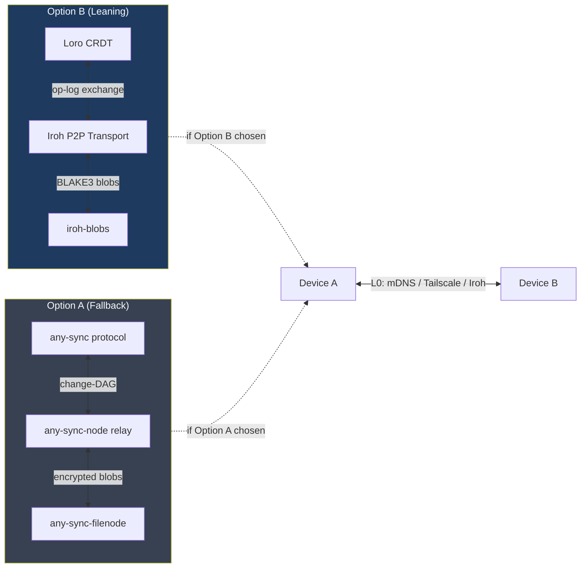

> **Status**: Draft
> **Date**: 2026-06-22
> **Author**: Cytognosis Foundation
> **Audience**: stakeholders
> **Tags**: `yar`, `sync`, `crdt`, `loro`, `iroh`, `any-sync`, `solid`, `hipaa`, `adhd-friendly`

# Yar Sync Protocol

**Technical source**: [../SPEC-sync-protocol.md](../SPEC-sync-protocol.md)

**Reading time**: ~6 minutes.
**If you only read one thing**: The CRDT op-log replicates at L2. The protocol choice (Loro + Iroh vs any-sync) is open, leaning Loro + Iroh. No real adapter is wired to Yar yet. Any adapter must pass the 12/12 edge-case conformance matrix before production.

---

> [!NOTE]
> **TL;DR**: Cross-node sync is a CRDT op-log at L2. The hot-path runtime is the CRDT log plus graph engine. Solid is the user-data-portability layer, not the hot path. The sync protocol (Loro + Iroh vs any-sync) is open; leaning Loro + Iroh (36/45 vs 35/45). Neither is committed. The 12/12 conformance matrix is verified; no real adapter is wired yet.

---

> [!IMPORTANT]
> **Conformance requirement**: Any sync adapter must pass all 12/12 edge cases in the Yar sync conformance matrix before being considered for production. Six named gaps (real-tool integration) still need to be addressed. See Section 3.

---

## 🔍 Overview

The sync layer replicates Yar's CRDT op-log across devices and nodes. Two properties are non-negotiable:

1. **Convergence is mathematical, not operational.** Any device with the full op-log history converges to identical state. No primary node, no write lock, no "last write wins."
2. **The L4 graph engine is a derived view.** Sync operates on the op-log. The graph index is rebuilt from it.

> [!TIP]
> **Key takeaway**: The CRDT op-log is what syncs. The graph engine is a local read index that gets rebuilt from it. Sync architecture decisions are about the op-log, not the graph engine.

---

> [!NOTE]
> **What is CRDT?** (101)
> **CRDT (Conflict-free Replicated Data Type)** is a data structure where any two replicas that receive the same operations converge to identical state, with no coordination needed. No conflicts, no master node. Used here so multiple devices (phone, laptop, tablet) can all write locally and merge later without data loss.

> [!NOTE]
> **What is Loro?** (101)
> **Loro** is a Rust CRDT library with first-class mobile bindings (Swift, Flutter). It supports text, lists, maps, trees, and counters as CRDT types. The movable Tree CRDT maps naturally to graph adjacency. Built-in time-travel is useful for longitudinal health data. MIT licensed. Current leaning for the L2 sync layer.

> [!NOTE]
> **What is Iroh?** (101)
> **Iroh** is a modular Rust networking stack. "Dial keys, not IP addresses." It handles QUIC transport, hole-punching, and relay fallback. `iroh-blobs` provides BLAKE3-verified content-addressed encrypted blob transfer. v0.95 (November 2025), actively developed. Pairs with Loro in the Option B leaning.

> [!NOTE]
> **What is any-sync?** (101)
> **any-sync** is Anytype's complete local-first P2P end-to-end protocol plus four self-hostable Go server nodes. Production-proven at Anytype's full userbase. The MIT-licensed protocol components are adoptable; the ASAL-licensed Anytype client apps are not. Option A (fallback) in the sync decision.

---

## 📖 Eight-Layer Data Fabric

The sync spec covers layers L0 through L3 and the L6 consent integration.

| Layer | Label | Status |
|---|---|---|
| L7 | Agents and UI | Decided |
| L6 | Consent and Access (WAC now, ACP at ~6 months, Solid pods) | Core decided; ACP scheduled |
| L5 | Vectors and GraphRAG | Follows L4 engine choice |
| **L4** | Graph index and query | Open; see storage-engine spec |
| **L3** | Storage (local store + encrypted blob store) | Tied to sync choice |
| **L2** | Replication and Convergence (CRDT op-log; **sync protocol open**) | Principle decided; protocol open |
| **L1** | Identity and Keys (WebID, Solid-OIDC, did:web) | Core decided |
| **L0** | Transport and Discovery (mDNS, Tailscale, Iroh) | mDNS + Tailscale decided |

---

## 📖 Sync Candidates

Scored on nine criteria (1-5 each, max 45). Scores are within one point; the decision is about risk profile and language ecosystem, not raw capability.

| Option | Mobile | P2P/CRDT | E2E | Self-host | License | Maturity | Composability | Effort | Stack-fit | Total |
|---|:--:|:--:|:--:|:--:|:--:|:--:|:--:|:--:|:--:|:--:|
| **Loro + Iroh (Option B, leaning)** | 4 | 4 | 3 | 4 | 5 | 3 | 5 | 3 | 5 | **36** |
| **any-sync (Option A, fallback)** | 3 | 5 | 5 | 5 | 4 | 4 | 3 | 3 | 3 | **35** |
| Automerge 3.0 | 4 | 4 | 3 | 4 | 5 | 4 | 5 | 3 | 4 | **36** |
| Yjs / yrs | 4 | 4 | 3 | 4 | 5 | 4 | 4 | 3 | 3 | **34** |

### Option B: Loro + Iroh (Current Leaning)

Why Loro is the leaning choice over Automerge 3.0:

| Dimension | Loro | Automerge 3.0 |
|---|---|---|
| Distinguishing feature | Movable-Tree CRDT + built-in time-travel | Memory efficiency (~10x reduction in v3.0) |
| Maturity | Newer, less battle-tested | More mature |
| Language | Rust with Flutter/Swift bindings | Rust with broad WASM support |
| Role if leaning fails | -- | Drop-in fallback within Option B |

**Recommendation**: prototype Loro first. If Loro integration proves too costly, drop to Automerge 3.0. This is an operational decision, not strategic.

### Option A: any-sync (Fallback and Escape Hatch)

What makes any-sync attractive:

- Production-proven at Anytype's full userbase. Most mature option.
- Complete stack: protocol + relay node + blob node + consensus node.
- Merkle-DAG of operations per object: content-addressed, tamper-evident, proven convergence.

What requires reimplementation (to avoid ASAL license entanglement):

- Object/type/space/relation model (do not use Anytype's model directly).
- Key-custody specifics.
- ACL semantics mapped to Yar's privacy-boundary schema.

**Do not adopt**: `anytype-ts`, `anytype-swift`, `anytype-kotlin` (all ASAL-licensed; cannot be used in a commercial product). Do not adopt `anytype-mcp` or the Anytype query surface.

🔬 Deep Dive: Yjs / yrs (Deprioritized)

Yjs/yrs scores 34/45 (lowest stack-fit). It is mature, widely used, and WASM-ready. The Rust port is `yrs`. Deprioritized because it does not add capabilities over Loro or Automerge 3.0 and scores lower on stack-fit. Not ruled out; could be reconsidered if both Option B CRDT libraries fail in prototyping.

---

## 📖 Conformance Matrix

> [!IMPORTANT]
> **Any sync adapter must pass all 12/12 edge cases before production.** The benchmark harness is at `yar_supervisor_reproducible_benchmark_package/sync_benchmark/yar_sync_edge_bench.py`. The conformance is currently verified against the Yar sync contract simulation (12/12 passed), but no real Iroh, Loro, or Automerge adapter is wired to Yar's storage layer yet.

**Current status: 12/12 edge cases verified (contract simulation).**

| Category | Edge Cases Covered |
|---|---|
| Idempotency | `duplicate_replay`, `partial_crash_resume` |
| Delivery ordering | `out_of_order_chunks` |
| Chunking/backpressure | `chunk_limit_many_small_ops` |
| Crash/resume | `partial_crash_resume` |
| Device lifecycle | `new_device_bootstrap`, `device_reinstall_new_actor` |
| Conflict/tombstone | `delete_update_race_delete_wins`, `delete_update_race_update_wins` |
| Deterministic tie-breaking | `same_lamport_tie_break` |
| Partition healing | `network_partition_bridge` |
| Blob/encrypted DAG | `star_hub_blob_archive` |
| Anti-pattern guard | `snapshot_badness_guard` |

**Named gaps (real-tool integration, not yet covered):**

Any real adapter must address ALL of these before being declared production-ready:

1. Real any-sync cluster latency and failure under self-host deployment
2. Real Iroh blob transfer over LAN, WAN, and NAT traversal
3. Real Loro, Yjs, or Automerge document adapters against Yar object schema
4. Mobile OS background execution limits on iOS and Android
5. Encrypted key rotation and account recovery flows
6. Malicious peer and Byzantine validation rules

---

## 📖 Transport and Discovery (L0)

| Component | Status | Use case |
|---|---|---|
| **mDNS / DNS-SD** | Decided | LAN peer discovery; zero-config |
| **Tailscale** | Decided | Overlay network for routed sync between devices off-LAN |
| **Iroh** | In stack (explored) | QUIC by public key; hole-punching; relay fallback; already used for distributed session state |

Transport selection per context:

- Same LAN: mDNS.
- Cross-network: Tailscale overlay.
- Hole-punching needed or ephemeral P2P: Iroh.

---

## 📖 Identity (L1)

| Component | Status | Notes |
|---|---|---|
| **WebID** | Decided | User identity anchor; dereferenceable URI |
| **Solid-OIDC** | Decided | OpenID Connect profile for Solid; issues DPoP-bound access tokens |
| **did:web** | Decided | DID method for machine-readable identity |
| **Solid DID Method** | Deferred | Unofficial draft; not yet widely implemented; use `did:web` instead |
| **Per-space symmetric keys** | Design adopted | Keys wrapped to member identities; servers see ciphertext only |

> [!NOTE]
> **What is WebID?** (101)
> **WebID** is a dereferenceable URI that uniquely identifies a user. Fetching the URI returns a machine-readable profile. Used as the identity anchor in Solid and the Yar ecosystem. Example: `https://pod.example.org/user#me`.

> [!NOTE]
> **What is Solid-OIDC?** (101)
> **Solid-OIDC** is an OpenID Connect profile for Solid. It issues DPoP-bound access tokens that prove the holder controls a specific key. Used alongside WebID for authenticated access to Solid pods.

---

## 📖 Consent and Access (L6)

> [!NOTE]
> **What is Solid?** (101)
> **Solid** is a W3C-based open standard for decentralized data pods. Users own their data in a personal pod and grant or revoke access per app. In Yar, Solid is the **portability and patient-ownership layer**, not the hot-path runtime. The hot path is the CRDT op-log at L2 and the graph engine at L4.

### Access Control Sequencing

| Horizon | Implement |
|---|---|
| **Now (stable)** | WAC (Web Access Control): simple owner/group/public ACLs; supported by all major Solid servers |
| **~6 months** | ACP (Access Control Policy) v0.9.0: fine-grained, contextual policies |
| **Defer** | SAI v0.1.0 (too complex, too early); Shape Trees (sparse implementations) |

### Solid Positioning

| Horizon | Implement |
|---|---|
| **Now** | Core Solid Protocol (resource model, export, portability); WebID; Solid-OIDC; WAC; self-hosted pod (CSS for prototype) |
| **~6 months** | ACP; Solid Notifications (WebSocket and Webhook); Type Indexes |
| **Do not build** | SAI v0.1.0; Shape Trees; Solid DID Method; HTTPSig; Solid-PREP; Solid-Chat; Solid-ERP |

> [!WARNING]
> **No public pod provider offers a HIPAA BAA.** For PHI, Cytognosis must operate enterprise-hosted pods. Self-hosting is required; Inrupt, SolidCommunity, and other public providers are not viable for health data.

---

## 📖 What Is Decided vs Open

### Decided

| Component | Decision |
|---|---|
| CRDT op-log = single source of truth | Decided |
| L2 = CRDT op-log replication | Decided |
| L0: mDNS + Tailscale | Decided |
| L1: WebID + Solid-OIDC + did:web | Decided |
| Use `did:web`, not Solid DID Method | Decided |
| L6: WAC now; ACP at ~6 months | Decided sequence |
| Solid = portability layer, not hot-path | Decided |
| No public HIPAA pod provider; self-host PHI | Decided |
| Do not adopt ASAL-licensed Anytype clients | Decided |
| any-sync MIT protocol components = adoptable | Decided |
| Yjs/yrs = deprioritized | Decided |
| SOSA/SSN for sensor data vocabulary | Decided |

### Open

| # | Decision | Leaning | Blocker |
|---|---|---|---|
| **O-1** | Sync protocol: any-sync vs Loro + Iroh | Loro + Iroh (36 vs 35); any-sync is fallback | Go vs Rust backend preference; appetite for building ACL/key-custody from parts vs adopting four-node topology |
| **O-2** | CRDT library in Option B: Loro vs Automerge 3.0 | Prototype Loro first | Both score 36/45; low-stakes; resolved by prototyping |
| **O-3** | Key custody + ACL design | Borrow any-sync per-space key-wrapping; reimplement against privacy-boundary schema | Healthcare break-glass + PAP are load-bearing sub-problems; PAP tracked jointly with privacy-boundary-spec.md |
| **O-4** | Encrypted blob store | iroh-blobs (Option B) or any-sync-filenode (Option A) | Follows O-1; both pre-1.0, require own soak test |
| **O-5** | Enterprise pod hosting platform | CSS for prototype; Inrupt ESS or self-hosted CSS for production | BAA availability must be confirmed with any third-party provider |

---

## ⚠️ Common Pitfalls

- **Treating 12/12 conformance as production-ready**: the harness tests the Yar sync contract simulation, not real Iroh/Loro/Automerge adapters. The six named gaps remain.
- **Using Solid as the hot-path runtime**: Solid is the portability and patient-ownership layer only. The hot path is the CRDT op-log.
- **Using a public Solid pod provider for health data**: no public provider has a HIPAA BAA. Self-host is required for PHI.
- **Using CR-SQLite for sync**: stalled as of mid-2026. Use Loro or any-sync at L2.
- **Treating any-sync client apps as adoptable**: `anytype-ts`, `anytype-swift`, `anytype-kotlin` are ASAL-licensed and cannot be used in a commercial product.

---

## ➡️ What's Next?

- **Immediate (unblocked)**: use the conformance harness at `yar_supervisor_reproducible_benchmark_package/sync_benchmark/yar_sync_edge_bench.py` to test any new adapter.
- **Before sync protocol decision (O-1)**: prototype Loro integration; benchmark real Iroh blob transfer.
- **Before pod hosting decision (O-5)**: confirm BAA availability with any third-party provider.
- **Shared open decision**: PAP (Policy Administration Point) is tracked jointly with [privacy-boundary-spec.md](../../Cytoplex/spec/privacy-boundary-spec.md); resolve in one place.
- **For L4 engine details**: read [SPEC-storage-engine_adhd.md](./SPEC-storage-engine_adhd.md).

---

📚 Glossary

| Term | Definition |
|---|---|
| **ACP** | Access Control Policy. Fine-grained, contextual Solid access control. More expressive than WAC. Scheduled for ~6 months. |
| **any-sync** | Anytype's complete MIT-licensed local-first P2P sync protocol. Production-proven. Option A (fallback) for Yar sync. |
| **ASAL** | Anytype Source Available License. Applied to Anytype client apps (`anytype-ts`, etc.). Cannot be used in a commercial product. |
| **Automerge 3.0** | Mature Rust CRDT library with ~10x memory reduction in v3.0. Drop-in fallback within Option B if Loro fails. |
| **BAA** | Business Associate Agreement. HIPAA-required contract with any vendor that handles PHI. No public Solid pod provider offers one. |
| **CRDT** | Conflict-free Replicated Data Type. Data structure where any two replicas with the same operations converge to identical state. |
| **CSS** | Community Solid Server. Open-source reference Solid server. Used for prototype pod hosting. |
| **DPoP** | Demonstration of Proof of Possession. Token binding mechanism in Solid-OIDC proving the holder controls a specific key. |
| **did:web** | DID (Decentralized Identifier) method using HTTPS. Preferred over Solid DID Method for machine-readable identity. |
| **Iroh** | Modular Rust networking stack. QUIC by public key, hole-punching, relay fallback. v0.95 (Nov 2025). |
| **iroh-blobs** | Iroh module for BLAKE3-verified content-addressed encrypted blob transfer. Pre-1.0; requires own soak test. |
| **L2** | The replication and convergence layer in Yar's eight-layer data fabric. CRDT op-log replication. |
| **Loro** | Rust CRDT library with mobile bindings (Swift, Flutter). Movable-Tree CRDT, built-in time-travel. MIT licensed. |
| **mDNS** | Multicast DNS. Zero-config LAN peer discovery. Decided for same-LAN sync. |
| **PAP** | Policy Administration Point. Runtime-updatable access policy sub-problem. Tracked jointly with privacy-boundary-spec.md. |
| **PHI** | Protected Health Information. US HIPAA term for individually identifiable health data. |
| **Solid** | W3C-based open standard for decentralized personal data pods. Portability and patient-ownership layer in Yar (not hot-path runtime). |
| **Solid-OIDC** | OpenID Connect profile for Solid. Issues DPoP-bound access tokens. |
| **SOSA/SSN** | Sensor/Observation/Sample/Actuator ontology + Semantic Sensor Network. W3C standard. Decided vocabulary for Yar sensor data. |
| **Tailscale** | VPN overlay network. Decided for cross-network (off-LAN) device sync. |
| **WAC** | Web Access Control. Simple owner/group/public ACLs. Supported by all major Solid servers. Implemented now. |
| **WebID** | Dereferenceable URI uniquely identifying a user. Returns a machine-readable profile. Identity anchor for Solid and Yar. |
| **Yjs / yrs** | Mature JavaScript CRDT library (yrs = Rust port). Deprioritized (score 34/45, lowest stack-fit). |

