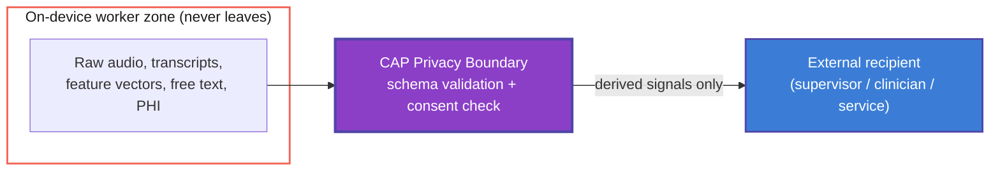

> **Status**: Draft
> **Date**: 2026-06-22
> **Author**: Cytognosis Foundation
> **Audience**: engineers, reviewers, counsel
> **Tags**: `cytoplex`, `cap`, `privacy`, `schema`, `requirements`, `adhd-friendly`, `v0`

Technical source: ../../Cytoplex/spec/privacy-boundary-spec.md

# 🔍 CAP Privacy-Boundary Schema and Requirements

> [!NOTE]
> **TL;DR**: This spec defines which data may leave Yar's on-device trust zone and which data must never leave. The rule is simple: only derived, structured signals cross the boundary; raw content never does. Enforcement is PLANNED; the only current gate is `CapLiteGuard`.
> **Full source**: [privacy-boundary-spec.md](../../Cytoplex/spec/privacy-boundary-spec.md)

**Reading time**: ~6 minutes.

**If you only read one thing**: the data-classification tables in Section 3. They contain the core rule: derived signals are allowed; raw audio, transcripts, free text, and PHI are not.

> [!IMPORTANT]
> **Design spec. Enforcement is PLANNED.** The only currently built boundary gate is the deterministic `CapLiteGuard` in `Yar/src/cap/guard.py`, which runs before model inference and blocks raw-data sharing, diagnosis advice, and crisis signals. Full `CrossBoundarySignal` schema validation, the PDP/PAP runtime, and consent-ref checking are not yet implemented.

---

## 🔍 1. Purpose and Scope

This spec defines the **privacy boundary** that governs which information may cross from Yar's on-device trust zone to any external recipient.

An **external recipient** is any of:
- A cloud supervisor process
- An opted-in clinician integration
- Any networked service

**In scope**: data classes, cross-boundary signal schema, retention and consent rules, acceptance criteria.

**Out of scope**: encryption and transport security, model architecture, the clinician-alert experience (see [MODULE-crisis-detection](../MODULE-crisis-detection.md)).

> [!NOTE]
> **What is a CrossBoundarySignal?** (101)
> A derived, structured datum that CAP permits to leave the device. It carries only scalars, enums, opaque hashes, and timestamps. No raw content is ever included.

---

## 📖 2. Where This Boundary Sits

Yar runs **local-first**. Raw signals stay on the device. Only derived, structured signals may cross to a supervisor or external recipient, and only under CAP policy and explicit user consent.



> [!NOTE]
> **What is CAP?** (101)
> Controller-Authority Protocol. Yar's policy layer with four roles: PEP (enforcement), PDP (decision), PAP (administration), PIP (information). CAP-Lite is the currently shipped minimal gate.

> [!NOTE]
> **PAP is not implemented yet.** If policy must be updatable without redeploying the app, the PAP is a new architectural component. Flagged as an open decision.

---

## 📖 3. Data Classification

Every datum in Yar is exactly one of two classes.

### ✅ Boundary-crossing (derived, allowed under consent)

| Field | Type | Why it is safe to cross |
|---|---|---|
| `stress_signal` | `{ level: float [0-1], timestamp: datetime }` | Scalar level; not the audio or words that produced it |
| `topic_shift` | `{ from_topic_id: opaque hash, to_topic_id: opaque hash, timestamp }` | Opaque references; never topic text |
| `user_disengaged` | `{ timestamp, severity: low/medium/high }` | Coarse engagement signal; no content |
| `session_phase` | `enum {opening, working, winding_down, closed}` | Structural state; no content |
| `mood_arc` | `{ trajectory: improving/stable/declining, confidence: float [0-1] }` | Derived trajectory; no raw mood text |
| `guidance_hint` | `{ hint_code: enum (controlled vocabulary) }` | Controlled codes only; no free text |
| `supervisor_interrupt` | `{ signal_code: enum, timestamp }` | Control signal; no content |

### 🚫 Device-local (never crosses, default-deny)

| Data | Reason it stays on device |
|---|---|
| Raw audio and audio fragments | Direct biometric and content exposure |
| Transcripts | Verbatim content |
| Raw feature vectors | Invertible to content or biometrics |
| Free-text user input | Verbatim content |
| PHI identifiers | Legal and ethical exposure |

> [!WARNING]
> **`topic_shift` IDs must be opaque hashes, never the topic text.** A label like "my divorce" is content. The boundary leaks if topic identifiers carry meaning; enforce hashing at the PEP.

---

## 📖 4. Requirements (EARS Notation)

<details>
<summary>🔬 Deep Dive: All 10 EARS Requirements</summary>

| ID | Requirement |
|---|---|
| **PB-1** | THE SYSTEM SHALL keep all device-local data within the on-device trust zone at all times |
| **PB-2** | WHEN a worker emits a cross-boundary message, THE SYSTEM SHALL validate it against the `CrossBoundarySignal` schema before transmission |
| **PB-3** | IF a cross-boundary message contains any undeclared field, THEN THE SYSTEM SHALL drop the message, raise a CAP policy violation, and log a non-PHI validation error |
| **PB-4** | WHILE no explicit user consent is active, THE SYSTEM SHALL operate in local-only mode and emit zero cross-boundary messages |
| **PB-5** | WHEN a `topic_shift` signal is constructed, THE SYSTEM SHALL replace topic content with a one-way opaque hash before the value leaves the worker |
| **PB-6** | WHERE a clinician integration is enabled and consented, THE SYSTEM SHALL transmit only the minimum-necessary derived signals |
| **PB-7** | THE SYSTEM SHALL exclude all PHI identifiers and free text from every log, metric, and crash report |
| **PB-8** | WHEN user consent is withdrawn, THE SYSTEM SHALL stop all cross-boundary emission within one session and retain no queued payloads |
| **PB-9** | WHILE a cross-boundary payload is at rest pending transmission, THE SYSTEM SHALL store it encrypted subject to the retention TTL |
| **PB-10** | IF schema validation is unavailable or fails to load, THEN THE SYSTEM SHALL fail closed (emit nothing), not fail open |

</details>

> [!TIP]
> **Key takeaway**: PB-10 is the most critical requirement. The system fails **closed** on any validation error. It never fails open.

---

## 📖 5. Cross-Boundary Signal Schema (v0)

One envelope type, `CrossBoundarySignal`, whose payload is one of the Section 3 allowed types. Canonical schema language: **LinkML**, with generated JSON Schema used for runtime validation at the PEP.

```yaml
# Illustrative LinkML sketch (v0; field names normative, syntax to finalize)
classes:
  CrossBoundarySignal:
    attributes:
      signal_type: { range: SignalTypeEnum, required: true }
      timestamp:   { range: datetime, required: true }    # UTC, millisecond precision
      payload:     { range: SignalPayload, required: true }
      consent_ref: { range: string, required: true }       # references the active consent grant
```

Every payload variant is **closed**: validators reject unknown fields. No variant may contain a string field carrying user content.

> [!NOTE]
> **What is LinkML?** (101)
> Linked data Modeling Language. A schema language that generates JSON Schema, Python dataclasses, and other formats from one source. Cytognosis uses it as the unified schema foundation across TAs.

---

## 📖 6. Retention and Consent Rules

| Rule | Detail |
|---|---|
| **Default-deny** | Nothing crosses without an active, specific consent grant referenced by `consent_ref` |
| **Local-only baseline** | With no consent, Yar emits zero cross-boundary messages and functions fully on device |
| **Minimum-necessary** | Each external feature receives only the signal types it needs, not the full set |
| **Retention TTL** | Cross-boundary signals expire after 30 days at the recipient; on-device pending queue clears within one session |
| **No PHI in telemetry** | Logs, metrics, and crash reports carry signal types and error codes only |

---

## ✅ 7. Acceptance Criteria

| ID | Test | Pass condition |
|---|---|---|
| AC-1 | Fuzz the emitter with device-local field payloads | 100% dropped, policy violation raised (PB-1, PB-3) |
| AC-2 | Run with consent off | Zero cross-boundary messages observed (PB-4) |
| AC-3 | Inspect emitted `topic_shift` values | All IDs are opaque hashes, no recoverable text (PB-5) |
| AC-4 | Scan logs and crash reports during a session | No PHI, no free text, no transcripts (PB-7) |
| AC-5 | Disable the schema validator | System emits nothing (fails closed) (PB-10) |
| AC-6 | Withdraw consent mid-session | Emission stops, queue cleared (PB-8) |

---

## ⚠️ 8. Open Decisions

| # | Decision | Recommendation | Owner |
|---|---|---|---|
| 1 | Schema serialization format | LinkML canonical, generate JSON Schema for runtime | Engineering |
| 2 | Retention TTLs for crossed signals and logs | Adopt the Section 6 defaults pending review | Counsel (Duane Valz) |
| 3 | PAP implementation for updatable policy | Decide whether runtime-updatable policy is required for v1 | Architecture |
| 4 | Clinician-path HIPAA posture | Scope minimum-necessary and BAA requirements before enabling | Counsel (Duane Valz) |
| 5 | Formal PHI definition for Yar | Define the PHI identifier set explicitly so PB-7 is testable | Counsel + Shahin |

---

## ➡️ What's Next?

- **Crisis-detection alerts**: the crisis module (see [MODULE-crisis-detection](../MODULE-crisis-detection.md)) depends on this spec for its clinician-alert payload.
- **HIPAA posture review**: open decisions 2, 4, and 5 require Duane Valz before enabling any clinician integration.
- **Schema finalization**: open decision 1 gates the PEP runtime implementation.

---

<details>
<summary>📚 Glossary</summary>

| Term | Definition |
|------|-----------|
| **CAP** | Controller-Authority Protocol; Yar's policy layer that authorizes or blocks actions and data flows |
| **CAP-Lite** | The shipped lightweight enforcement gate |
| **CrossBoundarySignal** | A derived, structured datum permitted to leave the device under consent |
| **Cytoplex** | The CAP runtime and policy enforcement layer; previously called "CAP" in some early drafts |
| **Fail closed** | On error, deny by default (emit nothing) rather than allow |
| **LinkML** | Linked data Modeling Language; Cytognosis's canonical schema language |
| **Minimum-necessary** | Transmit only the data a given feature requires |
| **PAP** | Policy Administration Point; manages updatable policy rules |
| **PDP** | Policy Decision Point; evaluates a request against policy |
| **PEP** | Policy Enforcement Point; blocks or allows each boundary crossing |
| **PHI** | Protected health information |
| **PIP** | Policy Information Point; supplies context to the PDP |

</details>
