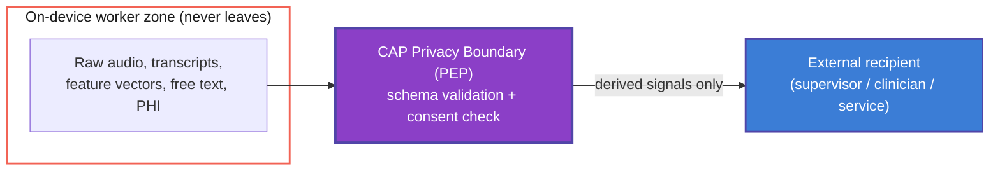

> **Related:** CAP primitives at `Cytoplex/spec/03_primitives.md`; CAP conformance at `Cytoplex/spec/06_conformance.md`

> **Status**: Draft
> **Date**: 2026-06-22
> **Author**: Cytognosis Foundation
> **Audience**: engineers, reviewers, counsel
> **Tags**: `cytoplex`, `cap`, `privacy`, `schema`, `requirements`, `ears`, `v0`
> **Related**: `cytonome-master-reference.md` §4.2, `Cytoplex/steering/cytoplex-tech.md`, `Yar/research/yar-unified-feature-comparison-v4.md` (F12, F18)

> **Implementation status**: Design spec, finalized 2026-07-16 for a post-YC build (decision D5). The only currently built boundary gate is the deterministic `CapLiteGuard`, originally at `Yar/src/cap/guard.py` and, as of 2026-07-16, ported into the YC Tauri base at `yar_revisions/yar-code-20260705-2354/backend/cap/` (commit `068b10d`), wired as a pre-response gate in `backend/assistant/views.py`. It runs before model inference and blocks raw-data sharing, diagnosis advice, and crisis signals. Full schema-validated `CrossBoundarySignal` enforcement, the PDP/PAP runtime, and consent-ref checking are not yet implemented and are deferred to post-YC. See the "Implementation Status — 2026-07-16" section below and `spec/SAFETY-CHECKPOINT_2026-07-16.md` for the full resume plan.

# CAP Privacy-Boundary Schema and Requirements (v0)

> **Reading options:** An ADHD-friendly progressive-disclosure rendering is generated from this file. The hand-maintained ADHD twin (`spec/adhd/privacy-boundary-spec_adhd.md`) was retired 2026-07-16; see `_archive/cleanup_2026-07-16/adhd-twins/`.

> **Reading time**: ~9 minutes.
> **If you only read one thing**: the data-classification table in Section 3 and the cross-boundary schema in Section 5. The rule is simple: **only derived, structured signals leave the device; raw content never does.**

> [!IMPORTANT]
> This spec closes CRITICAL gap D2 from the v4 feature comparison. It is a **first draft** of the data contract; it does not specify transport security or CAP runtime internals. Distributed-runtime work should block on acceptance of this spec.

---

## 0. Implementation Status — 2026-07-16 (D5 Checkpoint)

> **Decision D5:** build the full CAP privacy-boundary runtime **post-YC**. Keep the lightweight `CapLiteGuard` keyword gate live for beta. This section is the authoritative implementation-status record as of 2026-07-16; see `spec/SAFETY-CHECKPOINT_2026-07-16.md` for the full resume plan.

**Shipped today:**

- `CapLiteGuard` (deterministic keyword gate) is live in the YC Tauri base at `yar_revisions/yar-code-20260705-2354/backend/cap/`, ported from the legacy `Yar/src/cap/` implementation (commit `068b10d`, 2026-07-16).
- Wired as a pre-response gate in `backend/assistant/views.py` (`ChatView`, `ExtractTasksView`) via `backend/assistant/safety.py`. It runs before any provider/LLM call; on `deny` it short-circuits and returns the guard's own refusal message without touching `get_provider()`.
- 41 backend tests pass, including `SafetyGateTests` covering English and Farsi crisis phrasing, diagnosis requests, and benign pass-through.

**Deferred to post-YC:** the full `CrossBoundarySignal` schema-validated PEP (Sections 3-6), the PDP runtime driving it, and consent-ref checking.

**Reuse correction.** Earlier drafts of this spec implied the full CAP runtime would be built from nothing. That is inaccurate: Cytoplex already ships four **Production** runtime components (in `cytoplex/src/cytoplex/runtime/`) that the full implementation **must reuse**, not rebuild:

| File | Role |
|---|---|
| `local_pep.py` | Local Policy Enforcement Point — capture-level guard evaluating operational constraints and the privacy boundary before a capture is used |
| `edge_pep.py` | Edge/boundary PEP — validates CAP envelope structure, authority chains, and privacy boundary at the network edge |
| `privacy_pdp.py` | Privacy Policy Decision Point — evaluates the privacy-boundary dimensions (classification, movement, transformation, retention, logging, audit visibility, allowed recipients, raw-data egress, minimization) that this spec's Section 3 data-classification table maps onto |
| `pdp_adapters.py` | Adapters bridging directive envelopes (`CAPPolicyRequest`) into PDP calls |

These are the PEP and PDP referenced throughout this document — they are not net-new work.

**PAP is the one gap.** No Policy Administration Point exists anywhere in Cytoplex or Yar today. It is genuinely **net-new and currently unowned**. If runtime-updatable policy is required for v1 (Open Decision #3, Section 8), a PAP must be designed and built from scratch, and an owner must be assigned before work starts.

---

## 1. Purpose and Scope

This spec defines the **privacy boundary** that governs which information may cross from Yar's on-device trust zone to any external recipient, and which information must never cross. An external recipient is a cloud supervisor process, an opted-in clinician integration, or any networked service. The spec turns the two-column boundary table in `cytonome-master-reference.md` §4.2 into a typed schema and a set of testable EARS requirements that CAP enforces.

**In scope:** data classes, the cross-boundary signal schema, retention and consent rules, and acceptance criteria.
**Out of scope:** encryption and transport security, model architecture, and the clinician-alert experience (see the crisis-detection spec).

## 2. Background: Where This Boundary Sits

Yar runs **local-first**. Raw signals stay on the device in the worker zone; only derived, structured signals may cross to a supervisor or external recipient, and only under CAP policy and explicit user consent. CAP, the Controller-Authority Protocol, enforces this with four roles: the **PEP** (Policy Enforcement Point) blocks or allows each crossing, the **PDP** (Policy Decision Point) decides against policy, the **PAP** (Policy Administration Point) administers policy, and the **PIP** (Policy Information Point) supplies context. **CAP-Lite**, already shipped, enforces a hard gate today; this schema is the data contract that CAP-Lite and full CAP validate against.



> [!NOTE]
> **PAP is not implemented yet, and unlike the PEP and PDP below, it has no existing Cytoplex component to reuse — it is net-new and currently unowned.** The PEP and PDP roles are already implemented in Cytoplex Production (`local_pep.py`, `edge_pep.py`, `privacy_pdp.py`, `pdp_adapters.py` — see Section 0). If policy must be updatable without redeploying the app, the PAP is a new architectural component that must be designed and built from scratch. Flagged as an open decision (Section 8).

## 3. Data Classification

Every datum in Yar is exactly one of two classes. This expands the §4.2 table with types and rationale.

### 3.1 Boundary-crossing (derived, allowed under consent)

| Field | Type | Why it is safe to cross |
|---|---|---|
| `stress_signal` | `{ level: float [0.0-1.0], timestamp: datetime }` | A scalar level, not the audio or words that produced it |
| `topic_shift` | `{ from_topic_id: string (opaque hash), to_topic_id: string (opaque hash), timestamp }` | Opaque references, never topic text |
| `user_disengaged` | `{ timestamp, severity: enum {low, medium, high} }` | A coarse engagement signal, no content |
| `session_phase` | `enum {opening, working, winding_down, closed}` | Structural state, no content |
| `mood_arc` | `{ trajectory: enum {improving, stable, declining}, confidence: float [0.0-1.0] }` | Derived trajectory, no raw mood text |
| `guidance_hint` | `{ hint_code: enum (controlled vocabulary) }` | Controlled codes only, no free text |
| `supervisor_interrupt` | `{ signal_code: enum, timestamp }` | A control signal, no content |

### 3.2 Device-local (never crosses, default-deny)

| Field | Reason |
|---|---|
| Raw audio and audio fragments | Direct biometric and content exposure |
| Transcripts | Verbatim content |
| Raw feature vectors | Invertible to content or biometrics |
| Free-text user input | Verbatim content |
| PHI identifiers | Legal and ethical exposure |

> [!WARNING]
> **`topic_shift` IDs must be opaque hashes, never the topic text.** A topic label like "my divorce" is content. The boundary leaks if topic identifiers carry meaning; enforce hashing at the PEP.

## 4. Requirements (EARS Notation)

- **PB-1 (ubiquitous):** THE SYSTEM SHALL keep all Section 3.2 data classes within the on-device trust zone at all times.
- **PB-2 (event-driven):** WHEN a worker emits a cross-boundary message, THE SYSTEM SHALL validate it against the `CrossBoundarySignal` schema before transmission.
- **PB-3 (unwanted, if-then):** IF a cross-boundary message contains any field not declared in Section 3.1, THEN THE SYSTEM SHALL drop the message, raise a CAP policy violation, and log a non-PHI validation error.
- **PB-4 (state-driven):** WHILE no explicit user consent for external features is active, THE SYSTEM SHALL operate in local-only mode and emit zero cross-boundary messages.
- **PB-5 (event-driven):** WHEN a `topic_shift` signal is constructed, THE SYSTEM SHALL replace topic content with a one-way opaque hash before the value leaves the worker.
- **PB-6 (optional, where):** WHERE a clinician integration is enabled and consented, THE SYSTEM SHALL transmit only the minimum-necessary derived signals defined in Section 3.1.
- **PB-7 (ubiquitous):** THE SYSTEM SHALL exclude all PHI identifiers and free text from every log, metric, and crash report.
- **PB-8 (event-driven):** WHEN user consent is withdrawn, THE SYSTEM SHALL stop all cross-boundary emission within one session and retain no queued payloads.
- **PB-9 (state-driven):** WHILE a cross-boundary payload is at rest pending transmission, THE SYSTEM SHALL store it encrypted and subject to the retention rule in Section 6.
- **PB-10 (unwanted, if-then):** IF schema validation is unavailable or fails to load, THEN THE SYSTEM SHALL fail closed (emit nothing), not fail open.

## 5. Cross-Boundary Signal Schema (v0)

Define one envelope type, `CrossBoundarySignal`, whose payload is one of the Section 3.1 types. **Recommended canonical schema language: LinkML**, consistent with the Cytognosis LinkML and Biolink foundation, with a generated JSON Schema used for runtime validation at the PEP.

```yaml
# Illustrative LinkML sketch (v0; field names normative, syntax to finalize)
classes:
  CrossBoundarySignal:
    attributes:
      signal_type: { range: SignalTypeEnum, required: true }
      timestamp:   { range: datetime, required: true }    # UTC, millisecond precision
      payload:     { range: SignalPayload, required: true }
      consent_ref: { range: string, required: true }       # references the active consent grant
  # payload variants: StressSignal, TopicShift, UserDisengaged,
  #                   SessionPhase, MoodArc, GuidanceHint, SupervisorInterrupt
```

Every payload variant is closed: validators reject unknown fields. No variant may contain a string field that carries user content; only enums, opaque hashes, scalars, and timestamps are permitted.

## 6. Retention and Consent Rules

- **Default-deny.** Nothing crosses without an active, specific consent grant referenced by `consent_ref`.
- **Local-only baseline.** With no consent, Yar emits zero cross-boundary messages and functions fully on device.
- **Minimum-necessary.** Each external feature receives only the signal types it needs, not the full set.
- **Retention TTL.** Proposed defaults: cross-boundary signals expire after **30 days** at the recipient; on-device pending queue clears within **one session**. Final TTLs are a legal decision (Section 8).
- **No PHI in telemetry.** Logs, metrics, and crash reports carry signal types and error codes only.

## 7. Acceptance Criteria

| ID | Check | Pass condition |
|---|---|---|
| AC-1 | Fuzz the emitter with payloads containing Section 3.2 fields | 100 percent dropped, policy violation raised (PB-1, PB-3) |
| AC-2 | Run with consent off | Zero cross-boundary messages observed (PB-4) |
| AC-3 | Inspect emitted `topic_shift` values | All IDs are opaque hashes, no recoverable text (PB-5) |
| AC-4 | Scan logs and crash reports during a session | No PHI, no free text, no transcripts (PB-7) |
| AC-5 | Disable the schema validator | System emits nothing (fails closed) (PB-10) |
| AC-6 | Withdraw consent mid-session | Emission stops, queue cleared (PB-8) |

## 8. Open Decisions (Flagged, Not Resolved)

| # | Decision | Recommendation | Owner |
|---|---|---|---|
| 1 | Schema serialization format | **LinkML** as canonical, generate JSON Schema for runtime | Engineering |
| 2 | Retention TTLs for crossed signals and logs | Adopt the Section 6 defaults pending review | Counsel (Duane Valz) |
| 3 | PAP implementation for updatable policy — **net-new, no owner assigned as of 2026-07-16** | Decide whether runtime-updatable policy is required for v1; if yes, assign an owner and scope the build from scratch (the PEP/PDP have Cytoplex components to reuse, the PAP does not) | Architecture (unassigned) |
| 4 | Clinician-path HIPAA posture | Scope minimum-necessary and BAA requirements before enabling | Counsel (Duane Valz) |
| 5 | Formal PHI definition for Yar | Define the PHI identifier set explicitly so PB-7 is testable | Counsel + Shahin |

---

<details>
<summary><strong>Glossary</strong></summary>

- **CAP (Controller-Authority Protocol):** Yar's policy layer that authorizes or blocks actions and data flows.
- **CAP-Lite:** the shipped lightweight enforcement gate.
- **PEP / PDP / PAP / PIP:** policy enforcement, decision, administration, and information points.
- **Cross-boundary signal:** a derived, structured datum permitted to leave the device under consent.
- **Fail closed:** on error, deny by default (emit nothing) rather than allow.
- **Minimum-necessary:** transmit only the data a given feature requires.
- **PHI:** protected health information.

</details>
