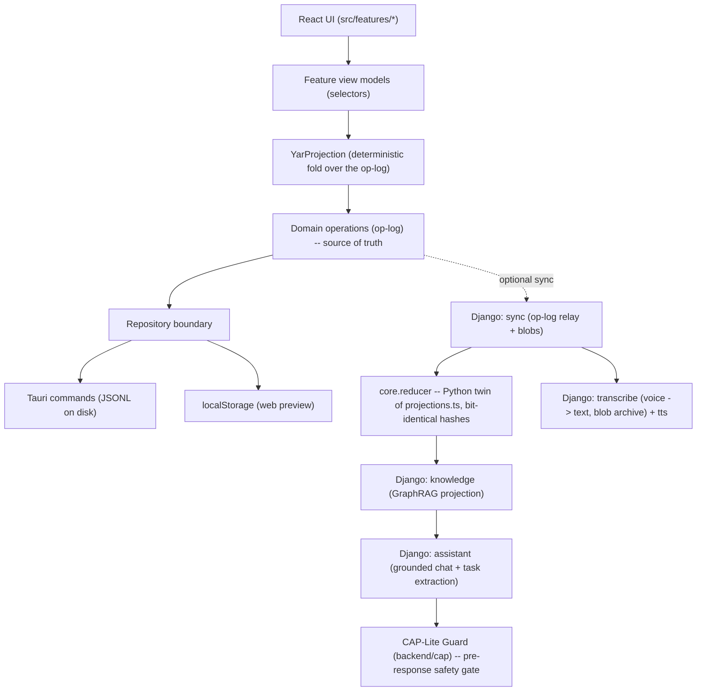

# Architecture

## The one rule

Do not sync database files, and do not make SQLite, FalkorDB, or any other engine the source of truth. Sync Yar domain operations. Rebuild deterministic projections locally. Everything in this codebase follows from that rule.

## Layers

**UI** -- React + TypeScript + Vite, styled through Cytostyle, shell packaged with Tauri v2. Screens (`src/features/*`) render view models only; they never touch a storage engine directly.

**Op-log** -- `YarOperation` = metadata (opId, actorId, lamport clock, wallClock, schema) + a typed body (`capture.created`, `task.scheduled`, `thought.placed`, `mood.checked_in`, `settings.updated`, `object.tombstoned`, ...). Total order for replay is `(lamport, actorId, opId)`, so `project(ops)` is deterministic on every device. Replay never throws; unknown op types are skipped. Deletion is a tombstone op, not a special case.

**Projections** -- `src/domain/projections.ts` is the only reducer; it produces captures, tasks, thoughts, map links, check-ins, focus sessions, and settings, plus pure selectors used as feature view models. A future SQLite+FTS5+sqlite-vec index and a server-side graph engine (FalkorDB) are additional projections of the same log, not the source of truth.

**Persistence** -- `YarOpRepository` has two implementations: `TauriOpRepository` (Rust commands append to an on-disk JSONL file; corrupt lines are skipped, not fatal) and `WebStorageOpRepository` (localStorage, so `npm run dev` runs in a plain browser with zero native deps).

**Tauri shell** -- one window, one capability granting `core:default` only, no filesystem/shell/http plugin permissions, CSP locked to `'self'`. Commands: `health_check`, `save_operation`, `load_operations`, `export_data`, `get_privacy_settings`, `set_privacy_settings`, `clear_local_data`.

**The personal server (Django, optional)** -- a relay and projection host, never the source of truth. `sync` implements `central_oplog_pull_since_seq` (register/heads/push/pull/ack + a content-addressed blob store) with idempotent import, deterministic tie-break, tombstone-wins fold, and projection-hash convergence, so a device and the server can verify they hold the same state. `knowledge` rebuilds a GraphRAG projection from ops (BM25 + a deterministic hashing embedder, fused with RRF, then n-hop expansion). `assistant` answers only from that projection, cites sources, and suggests tasks; it is gated by the CAP-Lite guard before any model call. `transcribe` wraps STT providers (`mock` or `faster-whisper`) and a TTS tier (`mock` WAV or an OpenAI-compatible endpoint such as Kokoro-FastAPI); raw audio is archived by content hash.

**Safety** -- `backend/cap/guard.py` (`CapLiteGuard`) is a deterministic, non-ML term-matching gate: it refuses diagnosis and treatment requests and crisis language (English and Persian) before any model call, and returns a real-support message rather than a generic error. It is wired into the assistant's chat and task-extraction endpoints as a pre-response gate. It is a minimal beta safety net, not a clinically reviewed crisis system; the full CAP protocol (Controller-Authority Protocol) lives separately under Cytoplex and is scoped for after this beta.

**AI runtime tiers** -- each capability (STT, LLM, TTS) is placeable per the person's choice in Settings, on a spectrum from this device (seam, not bundled yet) to a LAN laptop (OpenAI-compatible endpoint, e.g. local Ollama) to the personal server. Every unavailable tier fails with a calm, actionable message rather than an error state.
