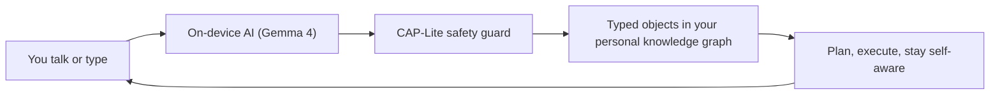

# Yar Product Spec (readable)

> **Status**: Active
> **Date**: 2026-07-10
> **Author**: @shahin
> **Audience**: engineers, stakeholders
> **Tags**: `yar`, `product`
> **Variants**: Technical (this doc) - Readable (Obsidian twin optional, same filename) - Agent (n/a)

> **Variants**: Technical (this doc) - Readable (Obsidian twin optional, same filename) - Agent (yar-product-spec_prompt.md)

> **Status:** Active · **Date:** 2026-07-01 · ADHD-friendly variant of `yar-product-spec.md` (the canonical technical version). Mirrored to Obsidian.

> [!IMPORTANT]
> **If you only read one thing:** Yar is a **local-first, voice-aware AI companion built by and for neurodivergent adults**. You talk; it turns the mess into organized, typed notes and tasks that stay **on your device**, behind a hard safety line (**CAP**). It is Cytonome v0.1, the first Cytognosis product.

## The one-sentence pitch

Yar replaces the seven or eight apps a neurodivergent adult juggles with **one** companion that captures, organizes, plans, and stays emotionally aware, keeps data private, adapts to your brain, and never charges a subscription.

## How it works (the loop)

Raw input stays local. The AI structures it. CAP blocks anything unsafe (no diagnosis, no unconfirmed sharing). You always confirm before anything leaves your device.

## The three pillars

| Pillar | Plain-English | Feature IDs |
|---|---|---|
| **Adaptive personas** | A companion that tunes itself to you (coach, buddy, guardian), no setup tax | F11, F29, F45, F57 |
| **CSP, an "MCP for sensors"** | Plug any sensor (voice, wearable, future brain sensors) into one private, typed pipeline | F12, F55, F30, F46 |
| **Branching brainmap (flagship)** | Think out loud; a living thought-tree grows and reorganizes itself, a GPS for your thoughts | F13, F14, F15, F31, F60 |

## The features, by wave

- **Build first (infrastructure):** safety layer (F18), on-device AI (F19), local store (F52), annotation (F50), schema translation (F51).
- **Wave 1, the wedge (25 features):** energy/mood map, flexible plans with backup, rest-day support, focus companion, voice capture, task-from-speech, the voice-grown thought map, and more.
- **Wave 2, the moat (24 features).**
- **Wave 3, sensors and research (6 features).**

Full list: `YAR_FEATURE_CATALOG.md`. Scored evidence: `research/yar-unified-feature-comparison-v4.md`.

> [!NOTE]
> **North star:** the Chen, Meng, and Nie (2026) ADHD study. Use its words: **Brain Weather, gentle streaks, pause days, body-doubling, co-regulation**.

## Key decisions (2026-07-01)

> [!TIP]
> - **On-device TTS is Kokoro** (not ElevenLabs) for persona voices.
> - **Storage engine is undecided** (`SPEC-storage-engine` is DRAFT) until the **SurrealDB v3.1.5 retest**. The MVP used SQLite plus an Anytype write path.
> - **Sensor science moves to Cytoscope**; Yar keeps the in-app surface and voice-as-persona.

## What Yar is NOT

> [!WARNING]
> Not a therapist. Not a diagnostic tool. Not a medical device. Not surveillance. Not a subscription. It reduces the invisible tax of living in systems not built for neurodivergent minds.

## Where to go next

- Canonical spec: `yar-product-spec.md`
- Safety protocol: `Cytoplex/cap-readme.md`
- Identity and YC: `cytonome-track.md`
- Fresh-agent brief: `yar-product-spec_prompt.md`
