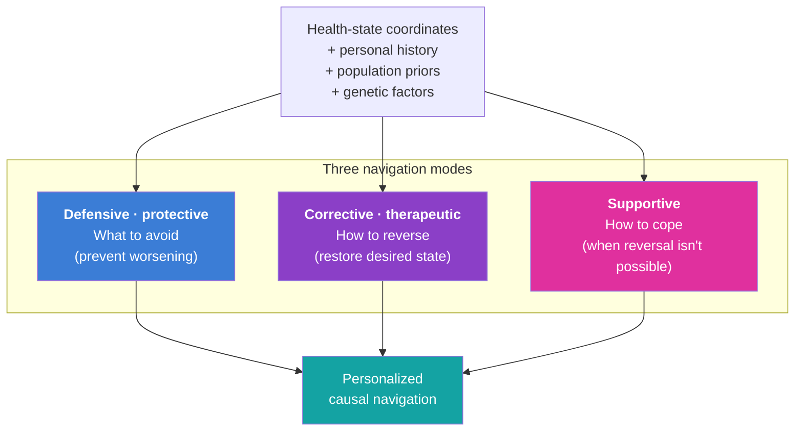

> **Status**: Active
> **Date**: 2026-06-14
> **Author**: @mohammadi
> **Audience**: engineers, stakeholders
> **Tags**: `cytonome`, `causal-ai`, `recommendations`

# Navigation: Causal Recommendation Framework

**Companion to:** `10_platform_architecture.md`, `13_sensor_ecosystem.md`, `15_app_design.md`, `16_patient_safety_architecture.md`

Cytonome converts a person's continuous health-state coordinates into actionable recommendations. The recommendation taxonomy in this document, defensive, corrective, supportive, is the canonical framework across the entire master plan and is what we use in app design, clinical trial protocols, grant narratives, and PAC review.

## Three modes of navigation

Causal recommendation operates in three distinct modes, each tied to a different relationship between current state and desired state.

### Defensive (protective)

What to avoid: behaviors, exposures, environments, social interactions, and contexts that, given the current state and personal history, are likely to worsen the trajectory. Learned both from population-level evidence (general patterns) and from personalized history (what has previously triggered this individual).

**Examples:**

- A person with a history of social-anxiety spikes after specific kinds of meetings receives an early warning when a similar meeting is upcoming, with concrete suggestions: arrive earlier to acclimate, take a brief recovery break afterward, plan a calming activity post-meeting.
- A person with a metabolic genotype showing strong evening-meal-glucose coupling receives a default "eat earlier today" recommendation when the day's pattern looks similar to past spike days.
- A person with sleep-mood coupling and a poor sleep night receives a defensive recommendation to skip a particular high-stakes meeting if it can be moved.

### Corrective (therapeutic)

How to reverse, when reversal is possible. Suggestions tailored to the unique biology, biotype, and current health state of the individual that aim to restore a desired state.

**Examples:**

- A person with prediabetes, given their genotype and previous dietary outcomes on observable biomarkers, receives a personalized diet plan tuned to their specific glucose response (the post-CGM finding that potato-spikers respond differently from grape-spikers, but extended to the full molecular orchestra and individual genome).
- A person with a depression biotype that maps to BDNF signaling receives an indication that this biotype responds to specific therapies (such as psilocybin in clinical-trial settings, where appropriate, or evidence-based interventions like exercise that affect the same pathway).
- A person whose connectomic biotype matches a TMS-responsive depression subtype receives a targeted recommendation, with the connectomic detail prepared for a clinician's review, to enable precise targeting of brain regions.

### Supportive

When reversal is not possible (or a negative outcome is imminent), supportive recommendations equip the person to cope, manage, or live well with the trajectory.

**Examples:**

- For people whose psychiatric symptoms are recurrent and not currently reversible, evidence-based skills (CBT, DBT, ACT) delivered through trusted partners or partner-built plug-ins, tailored to the specific symptom profile.
- For autistic individuals, skills training to recognize facial emotions or read social cues in the contexts they identify as challenging.
- For chronic-pain or fatigue trajectories, pacing strategies, energy-budget awareness, and matching to support communities of similar biotype.
- For people facing acute medical news, practical coping tools, decision-support resources, and matching to peer communities who have navigated similar trajectories.

## How recommendations are generated

The navigator's causal-recommendation engine, `SI-Causal-Recommendation`, due M42 in Y4. Per `02_Cytognosis_Phase1_Operational_Plan.md` `P3.O6`, the engine combines:

- **Causal inference layer** using do-calculus and structural causal models for proposed lifestyle and pharmacological actions, with counterfactual logging on every recommendation.
- **Delayed-reward reinforcement learning** using CATE (Conditional Average Treatment Effect) or equivalent uplift modeling. Reward signal is user-reported outcome on validated scales, with clinical-partner review.
- **Personalized prior** from the genome, distilled per-individual from a centralized genotypic FM, telling the engine which biology to focus on for this person.
- **Population-level evidence** from the open Cytoverse map: what works in general for this biotype.
- **Personal-history signal** from the long-term memory module: what has actually worked or not worked for this specific person.

The engine integrates all five into a navigation decision. The decision is presented to the user with explicit reasoning, not as an oracle.

## Safety envelope

Recommendation modes are not all equally safe to deliver autonomously. Safety envelopes:

| Recommendation type | Default behavior | Escalation path |
|---|---|---|
| Lifestyle (diet, exercise, sleep, social) | Direct recommendation | None unless user opts to share with clinician |
| Coping skills (CBT, DBT, ACT exercises) | Direct delivery | None |
| Behavioral interventions (consultation prompts, support-community matching) | Direct prompt | None |
| Medication adherence or timing within prescribed bounds | Direct prompt | Notifies clinician on consistent miss |
| Medication dose changes or new prescriptions | **Never autonomous** | Always routed through prescribing clinician via the Patient Care section of the app |
| Clinical-trial matching | Direct recommendation | Connects to the clinician or trial coordinator |
| Crisis indications | **Always escalates** | Hard-coded crisis-detection module (see `15_app_design.md` and `16_patient_safety_architecture.md`) |

This envelope is not a finished product. PAC reviews it annually; clinical advisors review it on every release.

## Why this is causal, not associational

A purely associational recommender ("people with this profile took action X and felt better") fails in two known ways: confounding (the action and the outcome may share an unmeasured cause) and counterfactual unavailability (the user wants to know what would happen specifically to them, not what happened on average).

The navigator addresses both by:

- using the Cytoverse map as a **mediator state** in a structural causal model. Interventions and genetic factors are causes; outcomes are effects; the map sits between them. With the mediator fixed in interpretation, counterfactual estimation is well-defined.
- using **delayed-reward reinforcement learning** that treats lifestyle and treatment changes as actions with lagged consequences, not instantaneous effects.
- using **conditional flow matching** (per `11_technical_track_FMs.md`) to generate counterfactual states that the engine can evaluate against, rather than relying solely on observed comparison groups.

This is harder than associational recommendation. It is also the only approach that can responsibly say "given your current state and history, this action has X probability of moving you toward your goal." The navigator never claims certainty; it always presents probability with uncertainty.

## Recommendation sources, transparency

Every recommendation surfaced to the user carries a transparent source:

- **Population evidence:** which study or trial supports this recommendation in general?
- **Personal history:** what in this user's recorded history backs this recommendation?
- **Genome / biotype:** what aspect of this user's biology makes this a personalized recommendation?
- **Confidence:** how confident is the engine in this recommendation, with uncertainty visible?
- **Counterfactual:** what would happen if the user did not follow this recommendation? (Where the engine has the data to estimate.)

Users can explore any recommendation's source. PAC reviews recommendation transparency at every annual release.

## Cross-references

- The Cytonome runtime that delivers these recommendations: `10_platform_architecture.md`, `15_app_design.md`.
- The privacy and safety architecture that gates how data flows: `16_patient_safety_architecture.md`.
- The technical FM stack that powers causal inference: `11_technical_track_FMs.md`.
- The PAC charter that holds the navigator accountable: `21_patient_advocacy_council.md`.
