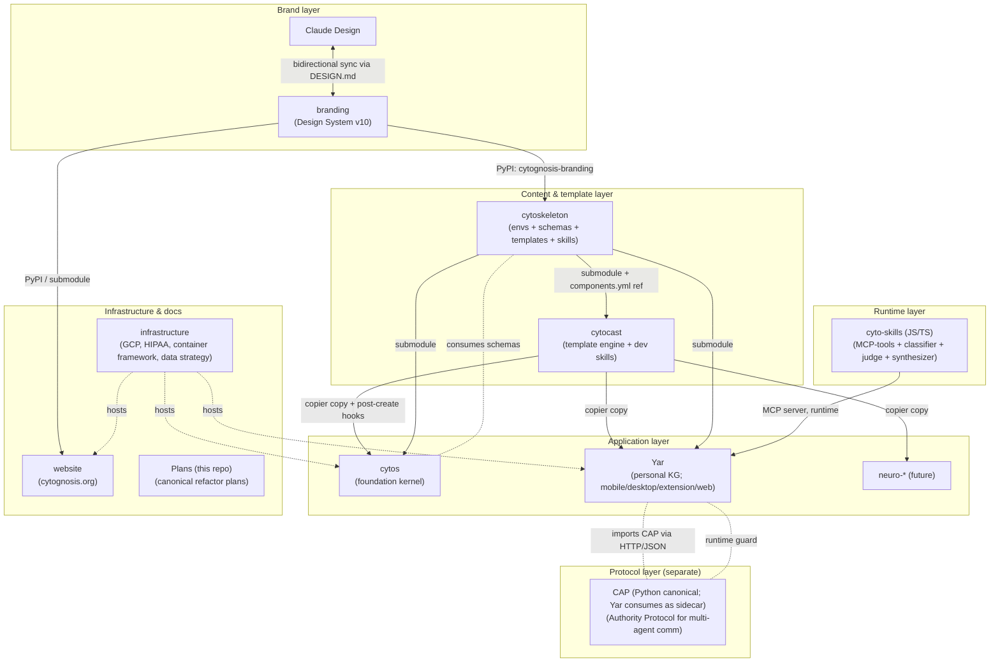
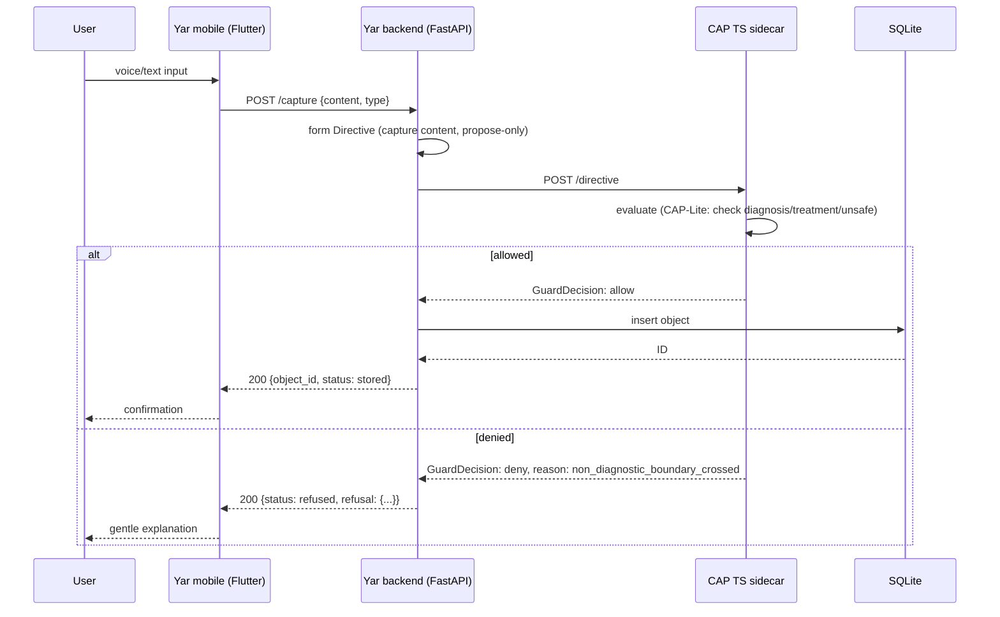
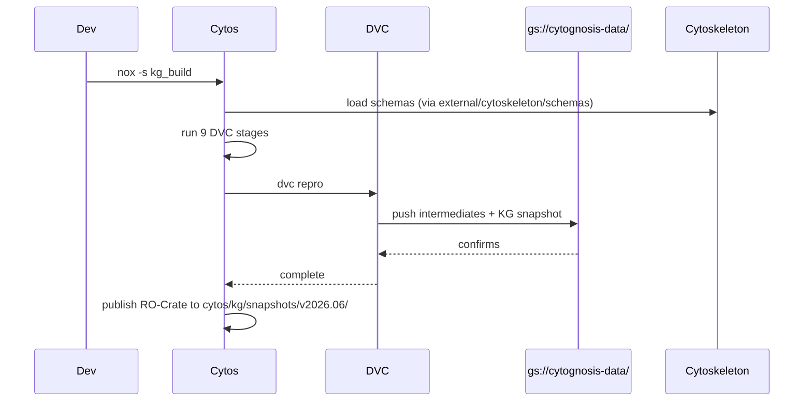
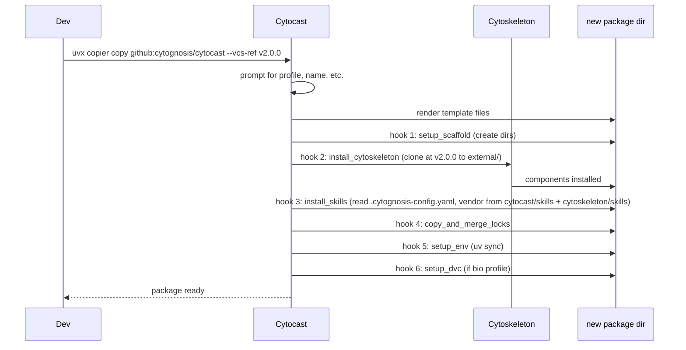
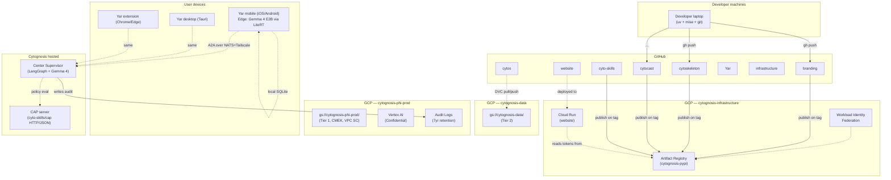

> **Status**: Active
> **Date**: 2026-06-14
> **Author**: @mohammadi
> **Audience**: engineers, stakeholders
> **Tags**: `cytonome`, `architecture`, `cross-system`

# Cytognosis Cross-System Architecture

**Last reviewed**: 2026-05-17
**Status**: post-refactor target (subplans 01-08 implement)

## 1. The eight systems



## 2. Per-system role

| System | Role | Language | Repo |
|---|---|---|---|
| **branding** | Cytognosis Design System (tokens, profiles, components, assets, voice). Paired with Claude Design. | Markdown + CSS + SVG + PyPI Python pkg | `cytognosis/branding` |
| **cytoskeleton** | Upstream content hub: envs + schemas + templates + skills (universal, operational, meta, personas, template-usage). | Python (mostly), YAML, multi-language components | `cytognosis/cytoskeleton` |
| **cytocast** | Package-template engine (Copier-based) + dev skills + `_shared/` payload. | Python + YAML + workflows | `cytognosis/cytocast` |
| **cyto-skills** | JS/TS runtime: MCP-aligned skill registry + classifier + judge + synthesizer + IDE deploy. Does **NOT** include CAP. | TypeScript / Node.js | `cytognosis/cyto-skills` (renamed from cytoagent) |
| **CAP** | Cytognosis Authority Protocol — standalone multi-layer communication protocol. Separate product from cyto-skills. | Python (canonical); optional TS port deferred | `/Infra/CAP/cytognosis_cap_v01_production_candidate/` (canonical); future `cytognosis/cap` repo (TBD) |
| **cytos** | Foundation biomedical kernel: ingests 50+ sources, builds KG (10.7M nodes × 118.5M edges), provides query services + modeling stubs. | Python 3.13+ | `cytognosis/cytos` |
| **Yar** | Personal knowledge graph capture system; multi-app (mobile/desktop/extension/web). | Python (backend), Dart (mobile), Rust (Tauri desktop), TS (extension, web) | `cytognosis/Yar` |
| **infrastructure** | GCP, HIPAA SOPs, container framework, data strategy. | Markdown + Python (stack_manager.py) + YAML | `cytognosis/infrastructure` |
| **website** | cytognosis.org — FastAPI + vanilla HTML/JS. | Python + HTML/CSS/JS | `cytognosis/website` |
| **neuro-*** (future) | Domain-specific packages built from cytocast template, consuming cytos + cytoskeleton. | Python + R | `cytognosis/neuro-*` |

## 3. Dependency graph (version-pinned)

```
cytognosis-branding v2.x      ← Source of truth: branding repo
   ├─→ cytoskeleton (PyPI dep)
   └─→ website (PyPI dep + submodule for static assets)

cytoskeleton v2.x             ← Upstream submodule for everyone
   ├─→ cytocast (modules/cytoskeleton submodule + components.yml ref)
   ├─→ cytos (external/cytoskeleton submodule)
   ├─→ Yar (external/cytoskeleton submodule)
   └─→ neuro-* (external/cytoskeleton submodule)

cytocast v2.x                 ← Template engine + dev skills
   └─→ (used at scaffold time + via copier update)

cyto-skills v1.x              ← JS/TS skill runtime (no CAP)
   ├─→ Yar (external/cyto-skills submodule)
   └─→ (deployed alongside any agent that needs MCP)

CAP v0.1.x                    ← Standalone protocol, separate from cyto-skills
   ├─→ Yar (external/cap submodule; HTTP/JSON sidecar at localhost:7100)
   ├─→ Center Supervisor agents (separate Cytognosis service)
   └─→ Any agent that needs explicit authority semantics
```

**No circular dependencies**. Cytocast no longer depends on cyto-skills (the legacy cytoagent dep is broken; see Phase 3). CAP and cyto-skills are INDEPENDENT peer dependencies for Yar — neither contains the other.

## 4. Skill phase model (canonical)

```mermaid
flowchart LR
  A["Brand-phase<br/>branding/skills/"] --> Stage1[Design / brand identity]
  B["Template-phase<br/>cytoskeleton/skills/"] --> Stage2[Scaffold time<br/>(universal, operational, meta, personas, template-usage)]
  C["Dev-phase<br/>cytocast/skills/"] --> Stage3[Coding time<br/>(languages, backend, frontend, ai-ml, devops, engineering, documents, research, science)]
  D["Runtime-phase<br/>cyto-skills/skills/"] --> Stage4[Deployed agent invocation<br/>(MCP tools + CAP guard)]
```

Skills are vendored into generated packages at scaffold time (cytocast invokes install_skills, which pulls from cytoskeleton + cytocast skills/ dirs + cyto-skills MCP server registry).

## 5. Data flow scenarios

### Scenario A: User capture → CAP-guarded storage in Yar



### Scenario B: New cytos KG snapshot generation



### Scenario C: Cytoskeleton v2 release propagates to cytos

```mermaid
sequenceDiagram
  participant Maintainer
  participant Cytoskeleton
  participant Cytocast
  participant Cytos

  Maintainer->>Cytoskeleton: merge PR, tag v2.1.0
  Cytoskeleton->>Cytoskeleton: notify-downstream.yml fires
  Cytoskeleton->>Cytocast: repository_dispatch event
  Cytocast->>Cytocast: template-update.yml; bump components.yml ref to v2.1.0
  Cytocast->>Cytocast: open PR
  Cytocast->>Cytos: repository_dispatch (cytocast tagged new version)
  Cytos->>Cytos: template-update.yml; copier update --vcs-ref v2.1.0
  Cytos->>Cytos: open PR
  Maintainer->>Cytos: review + merge PR
```

### Scenario D: New package generated from cytocast



## 6. Deployment topology



## 7. Cross-cutting concerns

### 7.1 Branch naming + CI

Per master plan §6.1: `feat/`, `refactor/v<N>-`, `fix/`, `chore/`, `auto/`, `release/`. Every Cytognosis repo has the `_shared/.github/workflows/` payload (inherited from cytocast) for: ci, publish-dev, publish-release, release-please, security, deps, template-update, notify-downstream.

### 7.2 Versioning

SemVer everywhere. release-please + Conventional Commits drives version bumps.

### 7.3 Auth

GH Actions ↔ GCP via Workload Identity Federation. No long-lived service account keys checked into repos.

### 7.4 HIPAA

Tier 1 data (PHI) → cytognosis-phi-prod bucket, CMEK, VPC SC, audit logs 7yr. See `infrastructure/docs/data-strategy/compliance/` for the 9 SOPs.

### 7.5 Observability

OpenTelemetry from every Cytognosis package. Spans cross CAP boundaries (annotated by CAP audit layer). Cloud Monitoring alerts on: bucket anomaly, IAM change, geo deviation.

### 7.6 Docs

cytognosis-doc skill drives all structured technical writing. New templates added per `09_cross_cutting_standards/03_doc_skill_enhancements.md`.

## 8. Why this architecture?

### Why eight systems?

We considered a monorepo. Rejected because:
- Different velocities (branding evolves with design; cytos with KG; Yar with apps).
- Different access controls (branding mostly public; phi-* repos may stay private).
- Different toolchains (Python + TS + Dart + Rust).
- Different release cadences.

We considered fewer systems (e.g., merge cytoskeleton + cytocast). Rejected because:
- Cytoskeleton is content (declarative); cytocast is engine (imperative). Conflating them loses the separation of concerns.

### Why four-phase skill model?

To prevent "where does this skill live?" debates. Every skill maps to one phase:
- Brand-phase: design system
- Template-phase: scaffold time
- Dev-phase: coding time
- Runtime-phase: deployed agent

### Why CAP as a separate layer?

CAP is transport- and language-agnostic. Embedding it in any one system would couple guard semantics to that system's lifecycle. Hosting CAP in cyto-skills/cap/ workspace package keeps it co-located with the runtime layer but separately versionable.

### Why JS/TS for cyto-skills (not Python)?

- MCP SDK and agent ecosystems are TS-first in 2026.
- Vercel AI SDK, LangChain.js, Cloudflare Workers Agents — TS ecosystem.
- Browser/extension/Tauri can run cyto-skills directly.
- Python adapter (`cytognosis-cap-py`) covers Python clients.

## 9. Risks + mitigations

| Risk | Likelihood | Mitigation |
|---|---|---|
| Branding/Claude Design drift | Medium | Weekly drift detection cron + PR-mediated sync |
| Cytoskeleton breaking change cascade | Medium | Pin downstream to release tags; auto-merge patch updates only after green CI |
| CAP performance | Low | Benchmark target < 50ms p95; revisit Rust if missed |
| HIPAA non-compliance | Medium | 9 operational SOPs + audit log review quarterly |
| Multi-language monorepo (Yar) coordination | Medium | mise + prek + workspace tooling |
| Vendor lock-in (GCP) | Low | Standards-based interfaces (PostgreSQL, S3-compatible) where possible |

## 10. References

- Master plan: `~/Documents/Cytognosis/Plans/design/00_master_plan.md`
- Decision log: `~/Documents/Cytognosis/Plans/design/09_decision_log.md`
- Standards inventory: `../02_standards_inventory.md`
- Per-system docs: `01_cytocast.md`, `02_cytos.md`, `03_cyto_skills.md`, `04_cap.md`, `05_yar.md`
