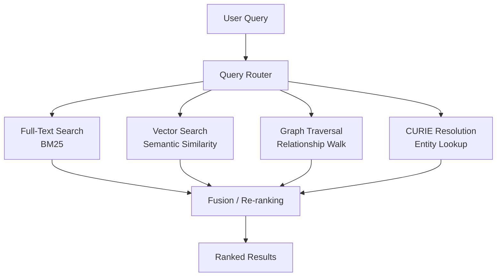

# CytoExplorer Interface Research

> **Status**: Active
> **Date**: 2026-07-10
> **Author**: @shahin
> **Audience**: engineers
> **Tags**: `engineering`
> **Variants**: Technical (this doc) - Readable (Obsidian twin optional, same filename) - Agent (n/a)

> Research document for the CytoExplorer web interface: the browsing, search, and discovery layer for the Cytognosis central asset repository.

---

## Table of Contents

1. [Executive Summary](#1-executive-summary)
2. [Existing Scaffold Analysis](#2-existing-scaffold-analysis)
3. [InfraNodus Evaluation](#3-infranodus-evaluation)
4. [Knowledge Graph Visualization Tools Comparison](#4-knowledge-graph-visualization-tools-comparison)
5. [Asset Browsing Interface Design](#5-asset-browsing-interface-design)
6. [Search and Discovery](#6-search-and-discovery)
7. [TileDB Cloud Data Exploration Patterns](#7-tiledb-cloud-data-exploration-patterns)
8. [Implementation Recommendations](#8-implementation-recommendations)
9. [Open Questions](#9-open-questions)
10. [Next Steps](#10-next-steps)

---

## 1. Executive Summary

CytoExplorer is the web interface for browsing, searching, and discovering assets in the Cytognosis central asset repository. It is distinct from the experiment management interface (which covers MLflow/WandB-style experiment tracking). CytoExplorer surfaces the Cytos Knowledge Graph, a 10.7M-node, 118.5M-edge graph, through an intuitive browsing UI with knowledge graph visualization, faceted search, and semantic discovery.

This document evaluates tools and design patterns across six areas:

1. **InfraNodus** as a KG visualization and gap analysis engine
2. **Open-source and commercial KG visualization libraries** for embedding in our React app
3. **Asset browsing interface patterns** for heterogeneous scientific assets
4. **Search and discovery** across full-text, faceted, semantic, and graph-traversal modalities
5. **TileDB Cloud exploration patterns** that inform our data browsing UX
6. **Implementation recommendations** for the existing Vite + React + TypeScript scaffold

Primary recommendation: adopt **Sigma.js + Graphology** (via `@react-sigma/core`) for graph visualization, **Meilisearch** for full-text/faceted search, and a hybrid search architecture combining BM25, vector embeddings, and graph traversal for comprehensive discovery.

---

## 2. Existing Scaffold Analysis

The CytoExplorer scaffold lives at `/repos/cytognosis/cytoexplorer` and is a standard Vite + React + TypeScript application.

### Current Technology Stack

| Layer | Technology | Version |
|-------|-----------|---------|
| Build tool | Vite | ^8.0.12 |
| Framework | React | ^19.2.6 |
| Language | TypeScript | ~6.0.2 |
| Routing | react-router-dom | ^7.15.0 |
| Data fetching | @tanstack/react-query | ^5.100.10 |
| State management | Zustand | ^5.0.13 |
| Styling | CSS (custom properties) + clsx + tailwind-merge | — |
| Icons | lucide-react | ^1.14.0 |
| Linting | ESLint + typescript-eslint | ^10.3.0 |

### Current Application Structure

```
src/
├── App.tsx                    # BrowserRouter with routes
├── main.tsx                   # React entry point
├── components/
│   ├── assets/
│   │   ├── AssetCard.tsx      # Card component for all asset types
│   │   └── AssetCard.css
│   └── layout/
│       ├── AppShell.tsx       # Main layout wrapper
│       ├── AppShell.css
│       ├── SearchBar.tsx      # Global search (Cmd+K)
│       ├── SearchBar.css
│       ├── Sidebar.tsx        # Navigation + asset type filters
│       └── Sidebar.css
├── pages/
│   ├── ExplorePage.tsx        # Browse/search grid view
│   ├── ExplorePage.css
│   ├── AssetDetailPage.tsx    # Full asset view with tabs
│   └── AssetDetailPage.css
├── lib/
│   ├── types.ts               # TypeScript types from cytos-scholarly LinkML schema
│   ├── api.ts                 # ApiClient class (FastAPI backend)
│   ├── constants.ts           # Asset type config, sort options
│   └── demo-data.ts           # Sample assets for development
└── styles/
    └── globals.css            # Design tokens + global styles
```

### Current Routes

| Path | Component | Description |
|------|-----------|-------------|
| `/` | ExplorePage | Main browse/search view |
| `/asset/:id` | AssetDetailPage | Full asset detail with tabs (Overview, Lineage, Annotations, Related) |
| `/favorites` | ExplorePage | Favorited assets |
| `/collections` | ExplorePage | User collections |
| `/recent` | ExplorePage | Recently viewed |

### Current Asset Types

The scaffold defines five asset types with color-coded badges:

| Type | Icon | Description |
|------|------|-------------|
| paper | FileText | Scholarly publications, preprints, articles |
| dataset | Database | Scientific datasets, data catalogs |
| model | Brain | Machine learning models, pre-trained weights |
| code | Code2 | Software source code, libraries, tools |
| protocol | FlaskConical | Laboratory and computational protocols |

### Key Observations

- Types are generated from the cytos-scholarly LinkML schema, ensuring schema-first consistency
- The API client targets a FastAPI backend at `localhost:8000/api`
- Demo data uses `cytos:` CURIE prefixes (e.g., `cytos:paper:W4390142217`)
- The AssetDetailPage has tabs for Lineage and Related, but these are not yet implemented
- The Sidebar footer displays KG stats (10.7M nodes, 118.5M edges)
- The search is currently client-side filtering against demo data

---

## 3. InfraNodus Evaluation

### Overview

InfraNodus is an AI-powered text network analysis and knowledge graph visualization tool developed by Nodus Labs. It transforms unstructured text into interactive network graphs, revealing topical clusters, influential concepts, and structural gaps in discourse.

### Architecture

| Component | Technology |
|-----------|-----------|
| Backend (legacy) | Node.js + Express |
| Backend (modern) | NestJS |
| Database (legacy) | Neo4j (graph database) |
| Database (modern) | PostgreSQL + Prisma |
| Frontend visualization | Sigma.js + Graphology |
| Graph analysis | Cytoscape, Graphology |
| Text processing | Textexture algorithm |
| AI integration | GPT-4o, GraphRAG |

InfraNodus has undergone a significant architectural evolution. The legacy open-source version (available at `noduslabs/infranodus` on GitHub) was built on Node.js + Express with a Neo4j backend. The modern commercial version has migrated to NestJS with PostgreSQL + Prisma for improved speed and resilience, while retaining Sigma.js and Graphology on the frontend.

### Core Capabilities

#### Graph Construction
InfraNodus represents text as a network where **nodes** are concepts (words or named entities) and **edges** represent co-occurrence within a sliding context window (typically a 4-gram window). This approach goes beyond simple keyword extraction by analyzing relational structure.

#### Network Analysis Algorithms
- **Betweenness centrality**: ranks nodes by their influence as bridges between topical clusters
- **Community detection**: Louvain algorithm identifies and color-codes topical communities
- **Force-directed layout**: ForceAtlas algorithm positions nodes to make community structure visually readable
- **Modularity**: quantifies the degree of separation between detected communities

#### Structural Gap Detection
InfraNodus's signature feature identifies disconnected or weakly connected regions of the discourse graph. These "structural gaps" represent blind spots where distinct topical clusters could potentially be bridged. This feature is used for:
- Identifying missing connections in research literature
- Generating novel research questions at the intersection of topics
- Discovering content gaps in competitive analysis
- Fostering creative ideation by revealing non-obvious relationships

#### AI-Enhanced Insights
- Integration with LLMs (GPT-4o) for graph-aware analysis
- GraphRAG workflows that incorporate KG structure into AI prompts
- Automated research question generation from identified gaps
- Structured ontology creation from textual data

### Licensing and Self-Hosting

| Aspect | Detail |
|--------|--------|
| License | Sustainable Personal Use License (SPUL) / AGPL |
| Commercial use | Prohibited under open-source license |
| SaaS hosting | Prohibited under open-source license |
| Self-hosting (legacy) | Possible but unsupported; requires Neo4j 3.x, Node.js |
| Self-hosting (enterprise) | Available via Enterprise account (€9,900/year + setup fee) |
| API access | Available on cloud platform; requires subscription for production use |
| MCP server | Available for AI agent integration |

### Evaluation for CytoExplorer

#### Strengths
- Proven text-to-graph transformation pipeline
- Sophisticated gap analysis algorithms that could reveal blind spots in the Cytos KG
- Uses Sigma.js + Graphology internally, validating our library choice
- GraphRAG capabilities align with our AI-assisted discovery goals

#### Limitations
- **License restrictions**: SPUL/AGPL prohibits embedding in our application or offering as SaaS
- **Architecture mismatch**: InfraNodus is designed for text-to-graph workflows, not for browsing an existing KG
- **Neo4j dependency (legacy)**: The open-source version requires Neo4j 3.x, which is outdated
- **No React embedding**: InfraNodus is a standalone application, not a component library
- **Enterprise cost**: €9,900/year for self-hosted enterprise, which is prohibitive for a nonprofit

#### Recommendation

> [!IMPORTANT]
> **Do not embed InfraNodus directly.** Instead, extract and reimplement the key algorithmic concepts (gap analysis via betweenness centrality, community detection, structural hole identification) using the same underlying libraries (Sigma.js + Graphology) that InfraNodus uses internally. This gives us the analytical power without the licensing constraints.

Specific concepts to reimplement:
1. **Gap analysis**: Use Graphology's centrality and community detection algorithms to identify weakly connected subgraphs in the Cytos KG
2. **Discourse clustering**: Apply Louvain community detection to visualize thematic groupings of assets
3. **Bridge detection**: Compute betweenness centrality to highlight assets that connect otherwise isolated research domains
4. **AI-assisted exploration**: Integrate our own LLM layer (via Cytonome) for graph-aware question generation

---

## 4. Knowledge Graph Visualization Tools Comparison

### Open-Source Libraries

#### Sigma.js + Graphology

| Aspect | Detail |
|--------|--------|
| Rendering engine | WebGL |
| Performance | Best-in-class; handles 100K+ nodes smoothly |
| React integration | `@react-sigma/core` v5.0.6 |
| Data model | Graphology (separate concern from rendering) |
| Layout algorithms | ForceAtlas2, circular, random (via graphology-layout-*) |
| Customization | GLSL shaders for advanced node/edge rendering |
| License | MIT |
| Best for | Large-scale network exploration with high frame rates |

**Architecture**: Sigma.js handles rendering (WebGL batched draw calls) while Graphology manages data structures and algorithms. This separation of concerns maps well to React's component model. The `@react-sigma/core` library provides `<SigmaContainer>` and hooks like `useLoadGraph` for reactive graph management.

**Installation**:
```bash
npm install @react-sigma/core sigma graphology graphology-layout-forceatlas2
```

#### Cytoscape.js

| Aspect | Detail |
|--------|--------|
| Rendering engine | Canvas / WebGL / SVG |
| Performance | Excellent up to ~10K nodes; degrades beyond that |
| React integration | `react-cytoscapejs` (thin wrapper) |
| Built-in algorithms | Shortest path, centrality, clustering, pathfinding |
| Layout algorithms | Extensive built-in library (cola, dagre, cose, etc.) |
| Customization | CSS-like stylesheet for graph elements |
| License | MIT |
| Best for | Graph theory and complex network analysis |

**Strength**: Cytoscape.js is the most "out-of-the-box ready" for scientific and data analysis applications. It includes a vast library of built-in layout algorithms, pathfinding, and centrality measures. The CSS-like styling system is approachable for web developers.

**Limitation**: The `react-cytoscapejs` wrapper is thinner than `@react-sigma/core`. Many developers use the core `cytoscape` library directly within a `useEffect` hook for full control over its imperative API.

#### D3.js (Force-Directed)

| Aspect | Detail |
|--------|--------|
| Rendering engine | SVG (default), Canvas/WebGL (custom) |
| Performance | Moderate; struggles at a few thousand nodes with SVG |
| React integration | Manual (DOM manipulation conflicts with React's VDOM) |
| Customization | Unparalleled granular control over every pixel |
| License | ISC |
| Best for | Highly custom, branded, bespoke visualizations |

**Strength**: Unmatched flexibility for unique visual representations. If you have a specific vision that no library can deliver, D3 gives you control over every DOM element.

**Limitation**: D3's imperative DOM manipulation conflicts with React's declarative paradigm. Using D3 with SVG for large KGs creates severe performance bottlenecks. Developers must manually implement Canvas or WebGL rendering, which significantly increases development time.

### Comparison Matrix

| Feature | Sigma.js | Cytoscape.js | D3.js |
|---------|----------|-------------|-------|
| **Performance (large graphs)** | ★★★★★ | ★★★☆☆ | ★★☆☆☆ |
| **Built-in graph algorithms** | ★★☆☆☆ | ★★★★★ | ★☆☆☆☆ |
| **React integration** | ★★★★★ | ★★★☆☆ | ★★☆☆☆ |
| **Customization** | ★★★☆☆ | ★★★★☆ | ★★★★★ |
| **Learning curve** | ★★★★☆ | ★★★★☆ | ★★☆☆☆ |
| **Community/ecosystem** | ★★★★☆ | ★★★★★ | ★★★★★ |
| **WebGL support** | Native | Optional | Manual |
| **Bioinformatics use** | Growing | Dominant | Common |

### Commercial and Proprietary Tools

#### Neo4j Bloom

| Aspect | Detail |
|--------|--------|
| Type | Integrated exploration UI for Neo4j |
| Strengths | Near-natural language search, perspective-based views, GDS integration |
| React integration | Not embeddable; standalone application |
| Limitations | Neo4j-exclusive; cannot visualize other databases |
| Licensing | Bundled with Neo4j Enterprise / AuraDB |
| Alternative | Neo4j Visualization Library (NVL) for custom React UIs |

Bloom is excellent for ad-hoc graph exploration by non-technical users but cannot be embedded into CytoExplorer. **Neo4j NVL** (the underlying library powering Bloom) provides an official React wrapper and is the recommended path for Neo4j-native custom frontends.

#### Graphistry

| Aspect | Detail |
|--------|--------|
| Type | GPU-accelerated visual graph intelligence platform |
| Performance | Handles millions to billions of edges via GPU acceleration |
| React integration | `@graphistry/client-api-react` (iframe-based embedding) |
| Key feature | GFQL (Graphistry Graph Query Language) on GPUs |
| Strengths | Unified memory for graphs larger than GPU RAM; RAPIDS integration |
| Licensing | Commercial; free tier available |
| Architecture | Server-side rendering streamed to client via iframe |

Graphistry is the performance leader for extremely large graphs. Its React integration works by embedding an iframe that streams live data from a Graphistry server. This is suitable for exploratory dashboards but introduces a server dependency.

#### yFiles for HTML

| Aspect | Detail |
|--------|--------|
| Type | Premium graph visualization SDK |
| Strengths | Industry-leading layout algorithms, extreme flexibility |
| React integration | Full TypeScript/JavaScript API |
| Licensing | Commercial (per-developer license) |
| Best for | Complex diagramming, workflow editors, org charts |

yFiles is the industry standard for professional graph diagrams with complex layouts. Its cost makes it appropriate for enterprise applications but may be prohibitive for an open-source nonprofit project.

#### ReGraph (Cambridge Intelligence)

| Aspect | Detail |
|--------|--------|
| Type | React-native graph visualization SDK |
| Strengths | Built specifically for React's component paradigm |
| React integration | React-first architecture |
| Licensing | Commercial |
| Best for | Complex interactive graph UIs in React |

#### Gephi Lite

| Aspect | Detail |
|--------|--------|
| Type | Web version of the Gephi desktop application |
| Strengths | Familiar to network science researchers |
| React integration | Standalone web application, not a component library |
| Licensing | Open source |
| Best for | One-off network analysis, not production embedding |

### Recommendation

> [!TIP]
> **Primary: Sigma.js + Graphology** via `@react-sigma/core` for all graph visualization in CytoExplorer. Supplement with Graphology's algorithm suite for centrality, community detection, and shortest-path computations. Reserve Cytoscape.js as a fallback for specialized bioinformatics layouts (e.g., hierarchical ontology trees) if Graphology's layout options prove insufficient.

Rationale:
1. **Performance**: Our KG has 10.7M nodes and 118.5M edges. Even after filtering to a subgraph, we need WebGL rendering for smooth interaction.
2. **React integration**: `@react-sigma/core` is the most React-idiomatic graph library, with proper hooks and reactive data binding.
3. **InfraNodus validation**: InfraNodus itself uses Sigma.js + Graphology internally, confirming the technology choice for KG visualization.
4. **Open source**: MIT license is compatible with our nonprofit mission.
5. **Separation of concerns**: Graphology handles data/algorithms while Sigma handles rendering, which aligns with clean architecture principles.

---

## 5. Asset Browsing Interface Design

### Asset Type Taxonomy

CytoExplorer must support browsing seven categories of assets from the central asset registry:

| Asset Type | Primary Backend | Key Metadata | Browse Pattern |
|-----------|----------------|-------------|---------------|
| **Models** | LEGO model registry | Parameters, framework, task, modality | Card grid with model cards |
| **Datasets** | LaminDB / VFS | Size, format, species, tissue, assay | Table + preview |
| **Schemas/ontologies** | Git + SurrealDB | Version, namespace, class count | Tree browser |
| **Published experiments** | RO-Crates | Status, authors, metrics, artifacts | Timeline + detail |
| **Workflows** | Git + WDL/Nextflow | Steps, inputs, outputs, runtime | DAG view |
| **Skills** | Git + agents repo | Category, triggers, dependencies | Card grid |
| **Components/envs** | Git + Docker registry | Base image, packages, size | Table view |

### UI Design Patterns

#### Layout Architecture

```
┌─────────────────────────────────────────────────────┐
│  AppShell                                           │
│  ┌──────────┬──────────────────────────────────────┐ │
│  │ Sidebar  │  Header (SearchBar + breadcrumbs)    │ │
│  │          ├──────────────────────────────────────┤ │
│  │ Nav      │  Filters (chips, facets, sort)       │ │
│  │ Types    ├──────────────────────────────────────┤ │
│  │ Favs     │  Content area                        │ │
│  │ Recent   │  ┌──────────┐ ┌──────────┐          │ │
│  │          │  │AssetCard │ │AssetCard │  ...      │ │
│  │ ──────── │  └──────────┘ └──────────┘          │ │
│  │ KG Stats │  ┌──────────┐ ┌──────────┐          │ │
│  └──────────┴──┴──────────┴─┴──────────┴──────────┘ │
└─────────────────────────────────────────────────────┘
```

#### Compound Components Pattern

Build the filtering interface using compound components for flexibility:

```tsx
<FilterGroup>
  <TypeFilter types={['model', 'dataset', 'paper']} />
  <FacetFilter field="species" ontology="NCBITaxon" />
  <RangeFilter field="date_published" />
  <TagFilter field="keywords" />
</FilterGroup>
```

#### View Modes

1. **Grid view**: Card-based layout for visual browsing (current default)
2. **List view**: Dense table with sortable columns for metadata-heavy comparison
3. **Graph view**: Sigma.js visualization showing asset relationships
4. **Timeline view**: Chronological display for temporal exploration

#### Progressive Disclosure

- **Level 1**: Asset cards showing type badge, title, authors, date, key stats
- **Level 2**: Expanded card or hover preview with abstract, keywords, related count
- **Level 3**: Full detail page with tabs (Overview, Lineage, Annotations, Related, Graph)

### Asset Detail Page Design

The existing `AssetDetailPage` has four tabs. Extend to six:

| Tab | Content | Data Source |
|-----|---------|-------------|
| **Overview** | Full metadata, abstract, stats, external links | Asset registry API |
| **Lineage** | Provenance DAG (how this asset was created/derived) | Cytos KG traversal |
| **Annotations** | W3C annotations, notes, highlights | Annotation service |
| **Related** | Similar and connected assets | KG traversal + embedding similarity |
| **Graph** | Local KG neighborhood visualization (Sigma.js) | Cytos KG subgraph query |
| **Versions** | Version history, diffs, changelog | Git / VFS |

### Cross-Referencing Across Types

Assets in the Cytos KG are densely connected. The UI should surface these connections:

- **Paper → Dataset**: "uses data from"
- **Paper → Model**: "adopts model from"
- **Paper → Code**: "uses software"
- **Model → Dataset**: "trained on"
- **Workflow → Dataset + Model**: "consumes / produces"
- **Protocol → Dataset**: "generates"
- **Schema → all types**: "classifies"

Display these as typed relationship badges in the Related tab, with clickable navigation to the connected asset.

---

## 6. Search and Discovery

### Search Architecture Overview

CytoExplorer requires a hybrid search architecture that combines four retrieval modalities:



### Full-Text Search

#### Engine Selection

| Engine | Architecture | Best For | License |
|--------|-------------|----------|---------|
| **Meilisearch** | Disk-based (mmap) | Large catalogs, rapid prototyping | MIT (community) |
| **Typesense** | In-memory (RAM) | Sub-50ms latency, Algolia compatibility | GPL-3 |
| **Elasticsearch** | Distributed (Lucene) | Enterprise scale, complex analytics | SSPL / Apache 2 |
| **OpenSearch** | Distributed (Lucene) | AWS-native, Elasticsearch fork | Apache 2 |

**Recommendation: Meilisearch** for CytoExplorer's primary search engine.

Rationale:
- Disk-based storage handles our growing catalog without RAM constraints
- MIT license is compatible with our open-source mission
- Superior developer experience and "time-to-first-query"
- Automatic language detection handles multilingual scientific terminology
- Built-in faceted search support via the InstantSearch ecosystem

**React integration**:
```bash
npm install @meilisearch/instant-meilisearch react-instantsearch
```

#### Indexed Fields

| Field | Weight | Type |
|-------|--------|------|
| name/title | Highest | Text |
| abstract/description | High | Text |
| authors | Medium | Text array |
| keywords | Medium | Text array |
| mesh_terms | Medium | Text array |
| doi / id | Exact match | Keyword |
| venue | Low | Text |

### Faceted Search

Faceted search enables users to progressively narrow results using ontology-backed filters. The filter state should be reflected in the URL for shareability.

#### Core Facets

| Facet | Type | Source |
|-------|------|--------|
| Asset type | Enum chips | `_type` field |
| Date range | Range slider | `date_published` |
| Species/organism | Hierarchical select | NCBITaxon ontology |
| Tissue/cell type | Hierarchical select | UBERON/CL ontology |
| Assay type | Multi-select | OBI ontology |
| Disease | Multi-select | MONDO ontology |
| Open access | Toggle | `is_oa` boolean |
| Programming language | Multi-select | Enum |
| Framework | Multi-select | Enum |
| License | Multi-select | SPDX identifiers |

#### Dynamic Facet Counts

Facet values should display real-time counts reflecting the current filter state:

```
Species ▾
  ☑ Homo sapiens (1,247)
  ☐ Mus musculus (834)
  ☐ Drosophila melanogaster (156)
```

### Semantic Search

Semantic search uses embedding vectors to find conceptually similar assets, handling synonyms, paraphrases, and cross-lingual queries.

#### Architecture

1. **Embedding model**: Use a domain-specific model (e.g., BioLinkBERT, PubMedBERT) to embed asset metadata (title + abstract + keywords)
2. **Vector store**: Store embeddings alongside asset records, queryable via Meilisearch's built-in vector search or a dedicated vector store
3. **Query embedding**: Embed the user's search query at query time using the same model
4. **Hybrid retrieval**: Combine BM25 scores with cosine similarity scores using reciprocal rank fusion (RRF)

#### Implementation Strategy

```
Query: "gene expression in lung cancer"

BM25 results (exact terms):
  1. "Lung cancer gene expression profiling..."
  2. "Gene expression analysis in NSCLC..."

Vector results (semantic similarity):
  1. "Transcriptomic landscape of pulmonary carcinoma..."
  2. "RNA-seq atlas of bronchogenic neoplasm..."

Fused results (RRF):
  1. "Lung cancer gene expression profiling..."
  2. "Transcriptomic landscape of pulmonary carcinoma..."
  3. "Gene expression analysis in NSCLC..."
  4. "RNA-seq atlas of bronchogenic neoplasm..."
```

### CURIE-Based Entity Resolution

The Cytos KG uses CURIEs (Compact URIs) as canonical identifiers. CytoExplorer must resolve CURIEs to their display representations and enable CURIE-based lookup.

#### Supported Prefixes

| Prefix | Example | Resolves To |
|--------|---------|-------------|
| `cytos:` | `cytos:paper:W4390142217` | Internal asset |
| `doi:` | `doi:10.1038/s41591-023-02327-2` | DOI resolution |
| `openalex:` | `openalex:W4390142217` | OpenAlex work |
| `ncbitaxon:` | `ncbitaxon:9606` | NCBI Taxonomy |
| `uberon:` | `uberon:0002048` | UBERON anatomy |
| `cl:` | `cl:0000235` | Cell Ontology |
| `go:` | `go:0006915` | Gene Ontology |
| `hgnc:` | `hgnc:11998` | HGNC gene symbol |

#### Resolution Flow

1. User types a CURIE in the search bar (e.g., `doi:10.1038/s41591-023-02327-2`)
2. Query router detects the CURIE prefix pattern
3. Resolver looks up the entity in the Cytos KG
4. If found, navigates directly to the asset detail page
5. If not found, offers to import the entity (via DOI resolver, OpenAlex API, etc.)

### Graph Traversal Queries

For "Related" and "Lineage" views, CytoExplorer needs to execute graph traversal queries against the Cytos KG.

#### Query Patterns

| Pattern | Description | Example |
|---------|-------------|---------|
| **Neighborhood** | All assets 1-2 hops away | "Show everything connected to this paper" |
| **Path** | Shortest path between two assets | "How is this dataset related to that model?" |
| **Subgraph** | Extract a topic-specific subgraph | "All single-cell lung cancer assets" |
| **Lineage** | Trace provenance chain | "What datasets were used to train this model?" |
| **Co-citation** | Assets cited together | "Papers frequently cited alongside this one" |

#### API Design

```typescript
// Graph traversal API endpoints
GET /api/graph/neighborhood/:id?depth=2&types=paper,dataset
GET /api/graph/path?from=cytos:paper:X&to=cytos:model:Y
GET /api/graph/subgraph?topic=single-cell&types=paper,dataset,model
GET /api/graph/lineage/:id?direction=upstream
GET /api/graph/co-citation/:id?min_count=3
```

---

## 7. TileDB Cloud Data Exploration Patterns

### Relevance to CytoExplorer

TileDB Cloud provides patterns for cloud-native data exploration that inform CytoExplorer's design, particularly for dataset browsing and compute integration.

### Key Patterns

#### Array Browsing

TileDB stores data as multi-dimensional arrays. Their exploration UX provides:
- **Schema inspection**: View array dimensions, attributes, and types before querying
- **Slice previews**: Query a subset of the array (e.g., first 100 rows) to preview data shape
- **Metadata display**: Show array-level metadata (creation date, size, tile extents)

**Application to CytoExplorer**: For dataset assets, provide a "Preview" tab that shows:
- Schema/column definitions
- Row count and size estimate
- Sample rows (first N or random sample)
- Distribution histograms for key columns

#### TileDB-SOMA Integration

TileDB-SOMA (Stack Of Matrices, Annotated) is purpose-built for single-cell data exploration:

- **Cloud-native slicing**: Filter cells or features by metadata directly from remote storage (S3, GCS) without loading entire datasets into memory
- **Axis queries**: Extract specific slices (e.g., only macrophages from a lung atlas) with `axis_query`
- **Interoperability**: Convert between SOMA experiments and AnnData/Scanpy (Python) or Seurat/Bioconductor (R)
- **Spatial data**: Support for high-resolution tissue images and spatial coordinates (10X Visium)

**Application to CytoExplorer**: For single-cell datasets stored as TileDB-SOMA experiments:
1. Display experiment metadata (cell count, gene count, modalities)
2. Show available cell-type annotations and their distributions
3. Provide a "Launch in Notebook" button that opens a pre-configured TileDB Cloud notebook
4. Embed UMAP/t-SNE previews as static images with drill-down to interactive exploration

#### Notebook Integration

TileDB Cloud's notebook integration pattern:
- One-click launch from dataset browser to a Jupyter environment with pre-installed libraries
- Automatic authentication (REST API token handling)
- Pre-configured environments per dataset type

**Application to CytoExplorer**: Integrate a "Compute" action on dataset and model detail pages:
- "Open in JupyterLab" with the asset pre-loaded
- "Run analysis" with a curated set of analysis templates
- "Export to" with format options (AnnData, Seurat, CSV)

#### REST API Patterns

TileDB Cloud's REST API provides a reference for our API design:

| TileDB Pattern | CytoExplorer Equivalent |
|---------------|------------------------|
| Array listing with filters | Asset listing with facets |
| Array schema endpoint | Asset metadata endpoint |
| Slice query endpoint | Dataset preview endpoint |
| UDF execution | Workflow trigger endpoint |
| Task graph visualization | Pipeline lineage view |

### Task Graph Visualization

TileDB Cloud visualizes serverless task graphs (DAGs of UDF executions). This pattern directly applies to CytoExplorer's workflow visualization:

- Display workflow steps as a DAG using Sigma.js or a dedicated DAG library (e.g., `dagre`)
- Show execution status (pending, running, completed, failed) with color coding
- Enable click-through from DAG nodes to their input/output artifacts

---

## 8. Implementation Recommendations

### Graph Visualization Stack

#### Primary: Sigma.js + Graphology

```bash
npm install @react-sigma/core sigma graphology
npm install graphology-layout-forceatlas2 graphology-communities-louvain
npm install graphology-metrics graphology-shortest-path
```

#### Component Architecture

```tsx
// src/components/graph/KnowledgeGraph.tsx
import { SigmaContainer, useLoadGraph } from '@react-sigma/core';
import Graph from 'graphology';
import forceAtlas2 from 'graphology-layout-forceatlas2';

interface KnowledgeGraphProps {
  subgraph: { nodes: GraphNode[]; edges: GraphEdge[] };
  onNodeClick?: (nodeId: string) => void;
  layout?: 'force' | 'circular' | 'random';
}

export function KnowledgeGraph({ subgraph, onNodeClick, layout = 'force' }: KnowledgeGraphProps) {
  return (
    <SigmaContainer style={{ height: '600px' }}>
      <GraphLoader subgraph={subgraph} layout={layout} />
      <GraphEvents onNodeClick={onNodeClick} />
    </SigmaContainer>
  );
}
```

#### Graph Analysis Hooks

```tsx
// src/hooks/useGraphAnalysis.ts
import Graph from 'graphology';
import louvain from 'graphology-communities-louvain';
import { betweennessCentrality } from 'graphology-metrics/centrality';

export function useGraphAnalysis(graph: Graph) {
  const communities = useMemo(() => louvain(graph), [graph]);
  const centrality = useMemo(() => betweennessCentrality(graph), [graph]);

  const gapNodes = useMemo(() => {
    // Identify nodes with high betweenness centrality
    // that bridge otherwise disconnected communities
    return Object.entries(centrality)
      .filter(([_, score]) => score > threshold)
      .map(([nodeId]) => nodeId);
  }, [centrality]);

  return { communities, centrality, gapNodes };
}
```

### Search Integration

#### Meilisearch Setup

```bash
# Add Meilisearch client
npm install meilisearch @meilisearch/instant-meilisearch react-instantsearch
```

#### Search Component

```tsx
// src/components/search/SearchPanel.tsx
import { InstantSearch, SearchBox, RefinementList, Hits } from 'react-instantsearch';
import { instantMeiliSearch } from '@meilisearch/instant-meilisearch';

const { searchClient } = instantMeiliSearch(
  import.meta.env.VITE_MEILI_URL,
  import.meta.env.VITE_MEILI_KEY,
);

export function SearchPanel() {
  return (
    <InstantSearch searchClient={searchClient} indexName="assets">
      <SearchBox placeholder="Search papers, datasets, models..." />
      <RefinementList attribute="_type" />
      <RefinementList attribute="species" />
      <Hits hitComponent={AssetCard} />
    </InstantSearch>
  );
}
```

### State Management

The scaffold already uses **Zustand** for global state. Extend with domain-specific stores:

```tsx
// src/stores/searchStore.ts
import { create } from 'zustand';

interface SearchState {
  query: string;
  filters: Record<string, string[]>;
  viewMode: 'grid' | 'list' | 'graph';
  sortBy: string;
  setQuery: (query: string) => void;
  toggleFilter: (field: string, value: string) => void;
  setViewMode: (mode: 'grid' | 'list' | 'graph') => void;
}

export const useSearchStore = create<SearchState>((set) => ({
  query: '',
  filters: {},
  viewMode: 'grid',
  sortBy: 'relevance',
  setQuery: (query) => set({ query }),
  toggleFilter: (field, value) =>
    set((state) => {
      const current = state.filters[field] || [];
      const next = current.includes(value)
        ? current.filter((v) => v !== value)
        : [...current, value];
      return { filters: { ...state.filters, [field]: next } };
    }),
  setViewMode: (viewMode) => set({ viewMode }),
}));
```

### API Design

#### REST vs. GraphQL

| Aspect | REST | GraphQL |
|--------|------|---------|
| Asset listing | `GET /api/assets?type=paper&q=lung` | `query { assets(type: PAPER, q: "lung") { ... } }` |
| Asset detail | `GET /api/assets/:id` | `query { asset(id: "cytos:paper:X") { ... } }` |
| Graph traversal | `GET /api/graph/neighborhood/:id` | `query { asset(id: "X") { neighbors { ... } } }` |
| Faceted search | `GET /api/search?q=lung&facets=species,type` | `query { search(q: "lung") { facets { ... } } }` |

**Recommendation: REST for asset CRUD, GraphQL for graph traversal.**

- REST is simpler for standard CRUD operations and integrates naturally with TanStack Query
- GraphQL excels for graph data where clients need flexible, nested queries without over-fetching
- The existing `ApiClient` class uses REST conventions, minimizing migration effort

### Authentication Integration

```tsx
// src/lib/auth.ts
// Integrate with the Cytognosis auth service (Keycloak / Auth0)
import { create } from 'zustand';

interface AuthState {
  token: string | null;
  user: { id: string; name: string; roles: string[] } | null;
  login: () => Promise<void>;
  logout: () => void;
}

export const useAuthStore = create<AuthState>((set) => ({
  token: null,
  user: null,
  login: async () => {
    // Redirect to OAuth2 provider
    window.location.href = `${AUTH_URL}/authorize?client_id=${CLIENT_ID}`;
  },
  logout: () => set({ token: null, user: null }),
}));
```

### New Routes

Extend the routing to support new views:

```tsx
// Updated App.tsx routes
<Routes>
  <Route path="/" element={<ExplorePage />} />
  <Route path="/asset/:id" element={<AssetDetailPage />} />
  <Route path="/graph" element={<GraphExplorerPage />} />       {/* New: full KG explorer */}
  <Route path="/graph/:id" element={<GraphNeighborhoodPage />} /> {/* New: asset neighborhood */}
  <Route path="/favorites" element={<ExplorePage />} />
  <Route path="/collections" element={<ExplorePage />} />
  <Route path="/collections/:id" element={<CollectionPage />} />  {/* New: collection detail */}
  <Route path="/recent" element={<ExplorePage />} />
  <Route path="/import" element={<ImportPage />} />               {/* New: import wizard */}
</Routes>
```

### Directory Structure Extension

```
src/
├── components/
│   ├── assets/           # Asset display components
│   ├── graph/            # NEW: Sigma.js graph components
│   │   ├── KnowledgeGraph.tsx
│   │   ├── GraphControls.tsx
│   │   ├── NodeTooltip.tsx
│   │   └── GraphLegend.tsx
│   ├── search/           # NEW: Search and filter components
│   │   ├── SearchPanel.tsx
│   │   ├── FacetFilter.tsx
│   │   ├── TypeFilter.tsx
│   │   └── DateRangeFilter.tsx
│   └── layout/           # Layout components
├── hooks/                # NEW: Custom hooks
│   ├── useGraphAnalysis.ts
│   ├── useAssetSearch.ts
│   └── useCurieResolver.ts
├── stores/               # NEW: Zustand stores
│   ├── searchStore.ts
│   ├── graphStore.ts
│   └── authStore.ts
├── pages/
│   ├── GraphExplorerPage.tsx   # NEW
│   ├── CollectionPage.tsx      # NEW
│   └── ImportPage.tsx          # NEW
└── lib/
    ├── curie.ts           # NEW: CURIE parsing and resolution
    └── graph-utils.ts     # NEW: Graph data transformation utilities
```

### Dependency Additions

```json
{
  "dependencies": {
    "@react-sigma/core": "^5.0.6",
    "sigma": "^2.x",
    "graphology": "^0.25.x",
    "graphology-layout-forceatlas2": "^0.10.x",
    "graphology-communities-louvain": "^2.0.x",
    "graphology-metrics": "^2.0.x",
    "meilisearch": "^0.40.x",
    "@meilisearch/instant-meilisearch": "^0.18.x",
    "react-instantsearch": "^7.x"
  }
}
```

---

## 9. Open Questions

> [!IMPORTANT]
> **Graph database choice**: The central asset registry research document leaves the Neo4j vs. SurrealDB decision open (pending LaminDB analysis). CytoExplorer's graph traversal API must abstract over this choice. Design the API contract first, then implement backend adapters.

> [!IMPORTANT]
> **Subgraph extraction strategy**: With 10.7M nodes and 118.5M edges, we cannot render the full graph client-side. Define the server-side subgraph extraction API (max nodes per query, aggregation strategies for dense regions, progressive loading for large neighborhoods).

> [!WARNING]
> **InfraNodus gap analysis reimplementation**: The gap analysis concept is valuable but needs adaptation. InfraNodus finds gaps in text-derived networks (co-occurrence graphs). Our KG is entity-relationship-based. The betweenness centrality approach transfers, but community detection parameters and gap significance thresholds need empirical tuning against the Cytos KG.

> [!NOTE]
> **Search engine hosting**: Meilisearch requires a running server. Evaluate whether to self-host on our GCP infrastructure or use Meilisearch Cloud. For development, a local instance suffices; for production, consider the managed service to reduce operational burden.

> [!NOTE]
> **Embedding model selection**: The choice of embedding model for semantic search affects retrieval quality. Evaluate BioLinkBERT, PubMedBERT, and domain-specific models fine-tuned on biomedical literature. Consider using the same embeddings that power the Cytonome reasoning engine for consistency.

---

## 10. Next Steps

1. **Install Sigma.js + Graphology** in the CytoExplorer scaffold and build a proof-of-concept `<KnowledgeGraph>` component rendering a sample subgraph from the demo data
2. **Set up Meilisearch** locally and index the demo assets; replace the client-side search with InstantSearch components
3. **Define the graph traversal API contract** (OpenAPI spec) for neighborhood, path, and lineage queries
4. **Implement CURIE resolution** in the search bar so typing a DOI or CURIE navigates directly to the asset
5. **Extend asset types** to include schemas, workflows, skills, and components (currently only paper, dataset, model, code, protocol)
6. **Design the Graph Explorer page** with full-screen Sigma.js visualization, community detection coloring, and gap analysis highlighting
7. **Integrate TanStack Query** with the FastAPI backend for server-side search, replacing demo data filtering
8. **Build the faceted search sidebar** with ontology-backed hierarchical filters
