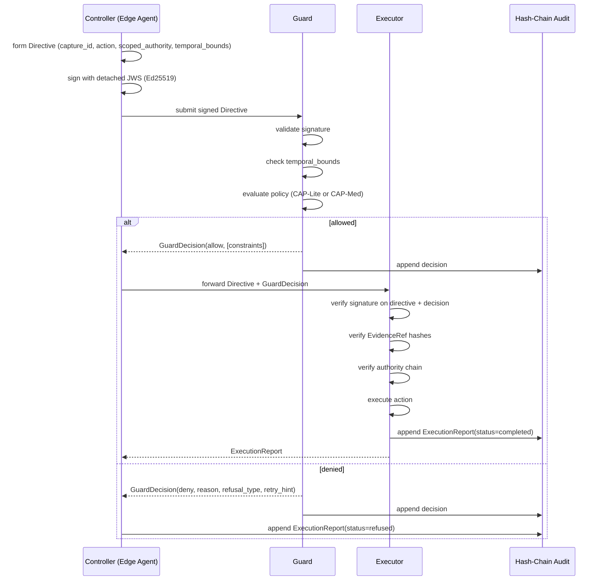

> **Status**: Active
> **Date**: 2026-06-14
> **Author**: @mohammadi
> **Audience**: engineers
> **Tags**: `cytoplex`, `cap`, `system-doc`

# CAP — System Doc

**Status**: v0.1 Production Candidate (Python canonical implementation)
**Version**: 0.1
**Canonical implementation**: `/home/mohammadi/Documents/Cytognosis/Infra and design/CAP/cytognosis_cap_v01_production_candidate/`
**Yar-side integration**: `/home/mohammadi/repos/cytognosis/Yar/CAP/`
**Future repo (Phase 7+)**: `github.com/cytognosis/cap` (TBD)

## 1. Purpose and scope

CAP — **Cytognosis Authority Protocol** — is a **standalone product**, separate from cyto-skills. It implements the multi-layer communication protocol for the interviewer/supervisor agent architecture in Cytognosis (and is consumable by any other multi-agent system).

It defines explicit authority boundaries between three roles:

- **Controller**: forms intent (Directive)
- **Guard**: evaluates policy, returns typed GuardDecision
- **Executor**: verifies authority before acting; refuses if not permitted

Core innovation: **asymmetric authority with deny-wins semantics**. Refusals are machine-actionable (typed RefusalMessage), auditable (hash-chain), and compositional with adjacent protocols (A2A, MCP, OPA, OTel, PROV, DSSE, in-toto, domain schemas).

**Out of scope for CAP**: agent skills (those live in cyto-skills); design system (branding); environment management (cytoskeleton); package templating (cytocast).

**Relationship to cyto-skills**: cyto-skills hosts the runtime layer for agentic skills. CAP is a SEPARATE protocol layer that any agent (including cyto-skills-powered agents) can adopt for authority enforcement. cyto-skills does NOT contain CAP; CAP is imported as a peer dependency by the consuming agent.

## 2. Standards and protocols used

| Standard | Use |
|---|---|
| mTLS (RFC 5246+) | Transport authentication |
| Ed25519 (RFC 8032) | Crypto primitive (mTLS + JWS) |
| Detached JWS (RFC 7515) | Directive + ExecutionReport signing |
| DSSE | Signing envelope |
| in-toto | Attestation linking |
| OPA / Rego | Optional dynamic policy evaluation |
| OpenTelemetry | Observability |
| W3C PROV-O | Evidence chain export |
| SSSOM | Domain entity mapping |
| **A2A (Agent-to-Agent Protocol)** | **CAP primitives transit over A2A messages** (already used in Cytognosis multi-agent architecture; from `/curations/tools/`) |
| MCP | CAP optionally wraps MCP tool invocations (when agent decides to enforce authority on tool calls) |
| gRPC + protobuf | Reference transport binding |
| HTTP/JSON | Independent second transport binding |
| SHA-256 | Hash chain for audit |
| **Tailscale** | **Mesh networking with mTLS** (from `/curations/tools/`) |
| **NATS JetStream** | **Async messaging for CAP-wrapped A2A traffic** (from `/curations/tools/`) |

CAP COMPOSES with these protocols rather than replacing them. The CAP report in `/Infra/CAP/cytognosis_multi_agent_architecture_report.md` describes the multi-layer stack in detail.

See [`02_standards_inventory.md`](../02_standards_inventory.md) for full context.

## 3. Architecture and assumptions

### 3.1 11-layer architecture

1. **Core primitives**: Directive, GuardDecision, RefusalMessage, ExecutionReport, DecisionRecord, EvidenceRef, AuthorityChain.
2. **Guard semantics**: CAP-Lite (general); CAP-Med (medical, blocks diagnosis/treatment); custom profiles via policy-as-data JSON.
3. **Transport bindings**: gRPC/protobuf reference + HTTP/JSON second (proves transport independence).
4. **Cryptographic verification**: mTLS (Ed25519), detached JWS, DSSE, in-toto attestation.
5. **Audit & observability**: hash-chain append-only audit store, OTel.
6. **Policy integration**: policy-as-data JSON + optional OPA hook.
7. **Evidence linking**: W3C PROV-O + SSSOM for domain mappings.
8. **Object graph integration**: Anytype MCP, SQLite — CAP guards object creation.
9. **Domain-specific constraints**: psychometric profiles, etc.
10. **Executor verification**: signature + decision + evidence + authority chain checks.
11. **Reporting**: ExecutionReport (always emitted), optional supervisor review.

### 3.2 Sequence diagram



### 3.3 Composition with adjacent protocols (curated)

CAP doesn't operate in isolation. From `/curations/tools/`:

- **A2A (Agent-to-Agent)**: CAP Directives and GuardDecisions are transported between agents over A2A. CAP doesn't replace A2A; it adds authority semantics on top.
- **MCP**: CAP optionally guards MCP tool invocations. The tool call passes through CAP Guard first; only allowed calls reach the MCP tool.
- **NATS JetStream**: ordered messaging for CAP traffic between Edge and Center.
- **Tailscale**: provides mTLS at the network layer; CAP adds its own mTLS at the protocol layer for end-to-end authentication.
- **Iroh CRDT**: optional state sync; CAP audit logs can be CRDT-replicated for distributed audit.
- **OPA**: dynamic policy evaluation via Rego rules; CAP delegates complex policy logic to OPA.
- **OTel**: instrumentation for guard decisions; latency tracking.

### 3.4 Assumptions

- All parties have Ed25519 keypairs; public keys exchanged at handshake.
- mTLS established before any Directive submission.
- Hash chain is append-only (filesystem or DB enforcement).
- Time is approximately synchronized (NTP within seconds).
- For OPA hook: opa CLI installed OR @openpolicyagent/opa-wasm available.
- For A2A transport: NATS broker reachable; Tailscale connected (for production deployments).

## 4. Implementation plan

### 4.1 Phase mapping

- **Phase I (now)**: Final docs for CAP at `/refactor/phases/docs/CAP/`. NO code changes. Compare/consolidate with curated protocols. Update Yar/CAP/ docs.
- **Phase 7 (later)**: Optional decision: move CAP to dedicated repo `github.com/cytognosis/cap`. Optional TypeScript or Rust re-implementation.
- **Phase 8+**: Production deployment + monitoring.

### 4.2 Phase I work (CAP track)

See [`/Plans/design/07_yar/02_checklist.md`](../../../07_yar/02_checklist.md) and `/refactor/phases/docs/phase1.md`.

Key Phase I CAP tasks:
1. Consolidate `Yar/CAP/` (older sketch) with `/Infra/CAP/cytognosis_cap_v01_production_candidate/` (canonical).
2. Author 3 doc artifacts at `/refactor/phases/docs/CAP/`:
   - Technical full doc.
   - ADHD-friendly version (diagrams, GitHub Alerts, 101 sections).
   - Dedicated prompt for Antigravity (links to technical docs).
3. Document composition with A2A and other curated protocols.

### 4.3 Out of scope (deferred)

- TypeScript or Rust re-implementation (Phase 7+).
- Multi-tenant CAP runtime (single-tenant v1).
- Per-tenant key rotation automation.
- KMS/HSM integration at scale.
- Real-time policy hot-reload.
- Third-party security audit (required before production-scale deployment).

## 5. Current implementation

### 5.1 Source of truth (Phase I)

- **Canonical**: Python implementation at `/home/mohammadi/Documents/Cytognosis/Infra and design/CAP/cytognosis_cap_v01_production_candidate/`.
- **Yar-side integration**: `/home/mohammadi/repos/cytognosis/Yar/CAP/` (older; will consolidate into canonical).
- **Supervisor report**: `/Infra/CAP/CAP_v0.1_Production_Candidate_Supervisor_Report.md`.
- **Multi-agent architecture report**: `/Infra/CAP/cytognosis_multi_agent_architecture_report.md`.

### 5.2 Features (v0.1 Production Candidate)

- 7 core primitives, all typed.
- 2 transport bindings (gRPC + HTTP/JSON) with semantic parity.
- CAP-Lite + CAP-Med policy profiles (policy-as-data JSON).
- mTLS (runtime Ed25519 cert generation; no packaged private keys).
- Detached JWS (EdDSA) for Directives + ExecutionReports.
- DSSE envelopes for attestation.
- in-toto link model for decision chains.
- Hash-chain append-only audit (.jsonl format).
- Optional OPA hook (subprocess or WASM).
- OpenTelemetry instrumentation.
- Conformance suite: 28/28 PASS per binding.
- Hardening suite: 33/33 PASS.

### 5.3 Interfaces

#### HTTP/JSON binding (Python client)

```python
import httpx

CAP_HTTP_URL = "http://localhost:7100"

directive = {
    "capture_id": "abc123",
    "directive_action": "capture_note",
    "user_id": "user@example.com",
    "scoped_authority": "yar:propose-only",
    "temporal_bounds": {
        "valid_from": "2026-05-17T10:00:00Z",
        "valid_until": "2026-05-17T10:05:00Z",
    },
}

async with httpx.AsyncClient() as client:
    r = await client.post(f"{CAP_HTTP_URL}/directive", json=directive)
    decision = r.json()
    if decision["guard_decision"] == "allow":
        pass  # proceed
```

#### gRPC binding

```python
import grpc
from cap_pb2 import Directive
from cap_pb2_grpc import CapServiceStub

with grpc.secure_channel("localhost:7101", grpc.ssl_channel_credentials(...)) as channel:
    stub = CapServiceStub(channel)
    decision = stub.SubmitDirective(directive)
```

#### Conformance + Hardening test runners (Python)

```bash
cd /Infra/CAP/cytognosis_cap_v01_production_candidate
python -m cap_conformance.runner
# Output: 28/28 PASS for http_json binding; 28/28 PASS for grpc binding

python run_production_hardening.py
# Output: 33/33 PASS
```

### 5.4 Configuration

```json
// policies/cap_lite.json
{
  "name": "cap-lite",
  "version": "0.1.0",
  "rules": [
    {
      "id": "no_diagnosis",
      "match": {"directive_action_pattern": ".*"},
      "constraint": {
        "type": "content_filter",
        "deny_phrases": ["you have depression", "diagnosed with"]
      },
      "on_violation": {
        "decision": "deny",
        "refusal_type": "non_diagnostic_boundary_crossed",
        "retry_hint": "Rephrase to describe observations, not diagnoses."
      }
    }
  ]
}
```

## 6. Future / missing / suggestions

### 6.1 Known gaps

- Multi-tenant runtime (single-tenant in v0.1).
- Production KMS/HSM integration for key rotation at scale.
- Live policy hot-reload (currently restart required).
- Distributed audit replication (single-node audit store).
- TypeScript or Rust re-implementation (Python canonical for now).

### 6.2 Suggestions

- Add `cytognosis-cap-py` PyPI adapter package for cleaner client integration.
- Performance benchmarks with target < 50ms p95 guard latency.
- Federated CAP profiles (org-A defines cap-med; org-B inherits + overrides).
- Threat model update for multi-tenant deployment.
- Integration with sigstore for code signing of policies.

### 6.3 Open RFCs / decisions

- Move CAP to dedicated repo `github.com/cytognosis/cap` (Phase 7+)?
- TypeScript port priority (vs. staying Python-only)?
- Multi-tenant CAP (deferred to v2).

## 7. Cross-references

- [Cross-system architecture](00_cross_system_architecture.md)
- [Cyto-skills system doc](03_cyto_skills.md) — peer system (NOT parent)
- [Yar system doc](05_yar.md) — main consumer
- [Phase 7 subplan](../../../07_yar/) — Yar refactor + CAP consolidation
- Original Python ref: `/Infra and design/CAP/cytognosis_cap_v01_production_candidate/`
- Supervisor report: `/Infra/CAP/CAP_v0.1_Production_Candidate_Supervisor_Report.md`
- Multi-agent architecture: `/Infra/CAP/cytognosis_multi_agent_architecture_report.md`
- Curated tools: `/home/mohammadi/Documents/Cytognosis/curations/tools/`
- Phase I CAP docs: `/home/mohammadi/repos/cytognosis/refactor/phases/docs/CAP/`
