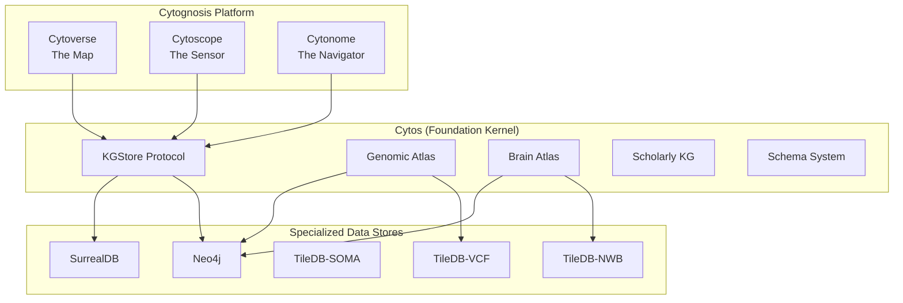
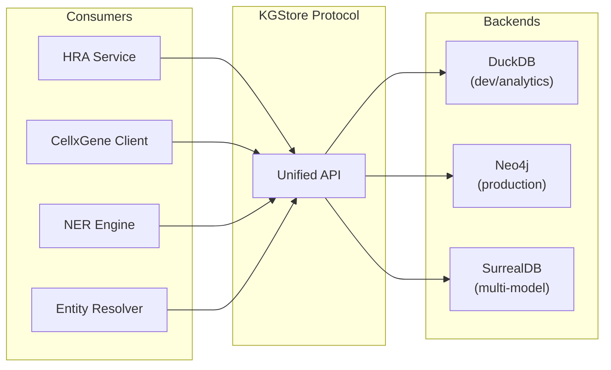
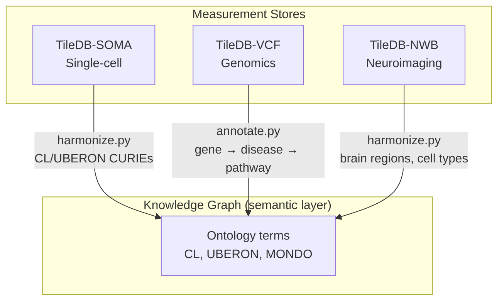
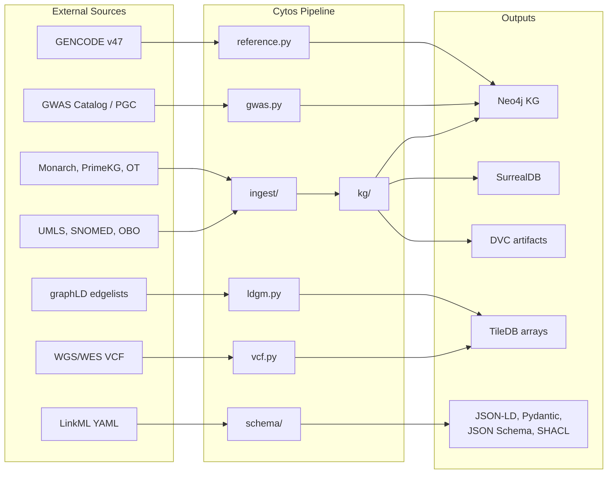

# Cytos System Architecture

> **Status**: Active
> **Date**: 2026-07-10
> **Author**: @shahin
> **Audience**: engineers
> **Tags**: `engineering`
> **Variants**: Technical (this doc) - Readable (Obsidian twin optional, same filename) - Agent (n/a)

> v4.0 | Last updated: 2026-05-26

Cytos is the foundation kernel of the Cytognosis platform. It handles data engineering, knowledge graph construction, genomic infrastructure, and cross-modal harmonization. Cytos is a Python library and CLI consumed by Cytoverse (The Map), Cytoscope (The Sensor), and Cytonome (The Navigator).

## Platform Position



## Three Constituent Graphs

Cytos builds a unified biomedical KG composed of three subgraphs:

| Subgraph | Purpose | Sources | Node Examples |
|----------|---------|---------|---------------|
| **Ontology Graph (OG)** | Definitional relationships (is_a, part_of) | UMLS, SNOMED, 37 OBO ontologies, HRA, UniChem, Ensembl | Disease, Gene, Protein, AnatomicalEntity |
| **Catalog Graph (CG)** | Publication and artifact metadata | PKG2.0, PlaNet, OpenAlex | Publication, ClinicalTrial |
| **Observation Graph (ObG)** | Measured associations | Monarch, PrimeKG, Open Targets, GWAS | GWASHit, Trait |
| **GenomeKG** | Genomic coordinates and variant data | GENCODE, GWAS Catalog, PGC, WGS VCF | Gene, Chromosome, Variant |

**Current KG size**: 9.3M nodes, 53M edges, 52 node labels, 200+ edge types.

## KGStore Protocol

All graph queries go through the KGStore protocol, which provides a backend-agnostic interface:



Two protocol layers exist:

| Layer | Location | Interface | Purpose |
|-------|----------|-----------|---------|
| **Sync Protocol** | `cytos.kg.store.KGStore` | Sync, DuckDB-backed | Development, analytics, KG construction |
| **Async Protocol** | `cytos.db.interface.KGStore` | Async, context manager | Production graph queries (Neo4j, SurrealDB) |

See [KGStore API Reference](kgstore-api.md) for full method signatures.

## Specialized Data Stores

Measurement data lives in dedicated backends, not the KG. The KG standardizes the *meaning* of measurements (cell types, tissues, species).



| Store | Format | Engine | Use Case | Status |
|-------|--------|--------|----------|--------|
| TileDB-SOMA | H5AD → SOMA | TileDB | scRNA-seq count matrices | 🔧 Building |
| TileDB-VCF | VCF/BCF | TileDB | Genotype arrays, GWAS | 🔧 Building |
| TileDB-NWB | NWB/BIDS | TileDB + HDMF | fMRI, EEG, connectomes | 🔧 Building |

See [Data Stores Reference](data-stores.md) for API details.

## Atlas Integrations

### Brain Atlas

Cytos integrates multiple brain atlas systems into a unified coordinate framework:

| Atlas | Module | Data |
|-------|--------|------|
| Human Reference Atlas (HRA) | `services/hra.py`, `kg/hra_ingest.py` | Anatomical structures, cell types, spatial data |
| Allen Brain Atlas | `services/rest_apis.py` | Gene expression, connectivity |
| neuromaps | `genomics/regions.py` | Brain parcellations, coordinate transforms |
| siibra | Planned | Multilevel brain atlas API |

See [Brain Atlas Guide](brain-atlas.md) for details.

### Genomic Atlas

The genomic subsystem handles gene queries, variant annotation, GWAS, and eQTL:

| Module | Purpose |
|--------|---------|
| `genomics/reference.py` | GRCh38 chromosome table, GENCODE GTF parser |
| `genomics/gwas.py` | GWAS-SSF 1.0 loader, Neo4j writer |
| `genomics/eqtl.py` | GTEx + PsychENCODE eQTL loaders |
| `genomics/vcf.py` | TileDB-VCF wrapper, CRAM functions |
| `genomics/vrs.py` | GA4GH VRS 2.0 allele identification |
| `genomics/prs.py` | Polygenic risk score computation |
| `genomics/graphld/` | LDGM precision matrices, heritability |

See [Genomic Atlas Guide](genomic-atlas.md) for details.

## Pipeline Stack

| Layer | Tool | Purpose |
|-------|------|---------|
| Pipeline framework | Kedro | Data catalog + DAG + node composition |
| Data versioning | DVC | Large artifact tracking (10 stages) |
| Experiment tracking | MLflow | Training runs (future use) |
| Orchestration | Dagster | Production scheduling (kedro-dagster) |
| Graph DB (primary) | Neo4j 2026.04.0 | Biomedical KG + GenomeKG |
| Graph DB (secondary) | SurrealDB v2 | Document+graph for clinical/sensor data |
| Array storage | TileDB | VCF genotypes + LDGM precision matrices |
| Local analytics | DuckDB | LDGM block index + KGBuilder intermediate |
| Schema language | LinkML | Source of truth for all data models |

## Key Data Flows



## Module Map

```
src/cytos/
├── cli/            CLI entry point (cytos command)
├── db/             Database backends (Neo4j, SurrealDB, KGStore Protocol)
├── genomics/       Genomic data (VCF, GWAS, eQTL, LD, pangenome, PRS)
│   └── graphld/    LDGM precision matrices and heritability
├── harmonize/      Cross-source alignment
├── ingest/         Source parsers (UMLS, SNOMED, Ensembl, OWL)
├── kg/             KG builder, exporter, HRA ingest, SSSOM
├── nbb/            Neuroimaging data mapping
├── ontology/       Ontology manager (fetch, validate, reason)
├── pipelines/      Dagster/Kedro orchestration
├── publish/        RO-Crate packaging, asset publishing
├── schema/         LinkML schema system, code generation
├── scholarly/      PDF parsing, NER, author identity, citation graph
├── services/       External API clients (CellxGene, HRA, OLS4)
├── sources/        Source registry and downloaders
├── tagging/        Entity tagging
├── utils/          Shared utilities
└── validate/       Multi-engine validation
```

## Architecture Decisions

| Decision | Rationale |
|----------|-----------|
| No NPZ format | TileDB for all array storage (language-agnostic, cloud-native) |
| Data-only scope | ML models are external consumers; modeling stubs deferred |
| LinkML as schema truth | All formats generated, never hand-written |
| Neo4j owns genomics graph | SurrealDB for clinical/sensor workloads |
| graphLD sparse format | Ω precision matrices, not dense R matrices |
| GWAS-SSF 1.0 standard | Auto-detection of PGC/harmonized variants |
| VRS 2.0 IDs | For all Variant nodes (requires seqrepo) |
| HANCESTRO for ancestry | Standardized population labels in LDGM index |

## Dependency Groups

```toml
[project.optional-dependencies]
genomics = ["tiledb", "tiledbvcf", "duckdb", "graphld", "pysam", "pronto", "networkx"]
ga4gh    = ["ga4gh-vrs[extras]", "biocommons.seqrepo"]
graphld  = ["graphld @ git+https://github.com/oclb/graphld.git", "scikit-sparse>=0.4"]
vcf      = ["tiledbvcf>=0.28"]
schemas  = ["linkml>=1.7", "linkml-runtime"]
kg_neo4j = ["neo4j>=5.0"]
kg_surreal = ["surrealdb>=1.0"]
scholarly = ["docling", "marker-pdf", "scispacy", "spacy"]
```

## Related Documentation

- [KGStore API Reference](kgstore-api.md)
- [Data Stores Reference](data-stores.md)
- [Brain Atlas Guide](brain-atlas.md)
- [Genomic Atlas Guide](genomic-atlas.md)
- [Getting Started](getting-started.md)
- [Tutorials](tutorials/)
