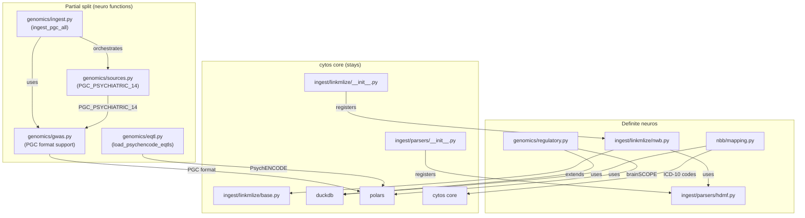
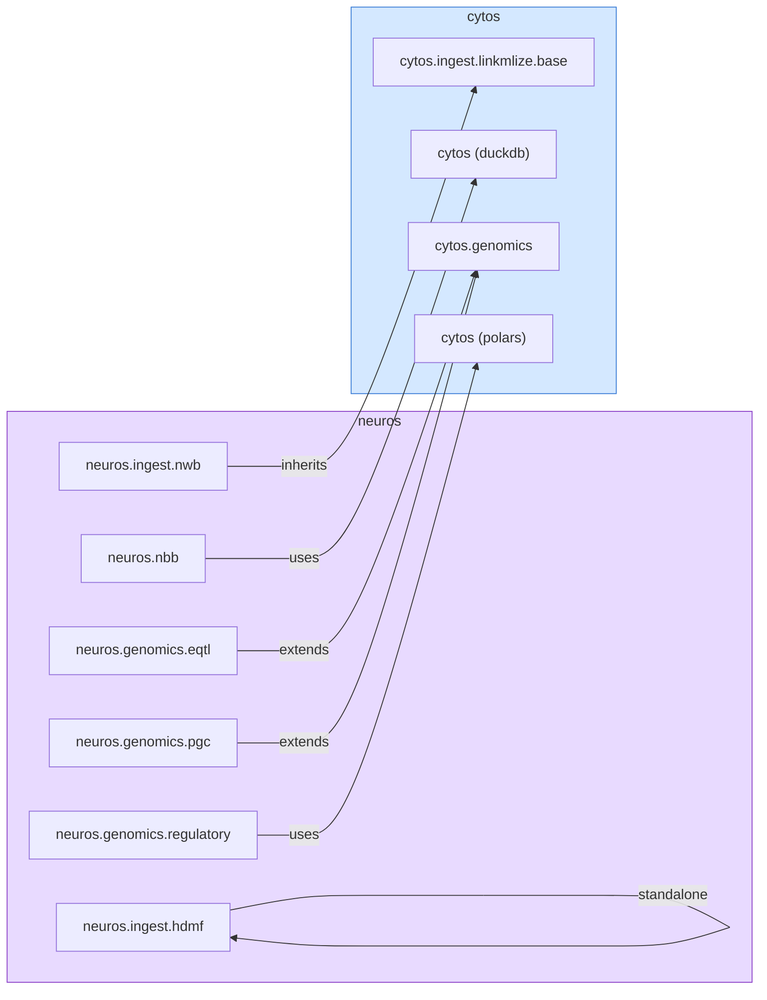
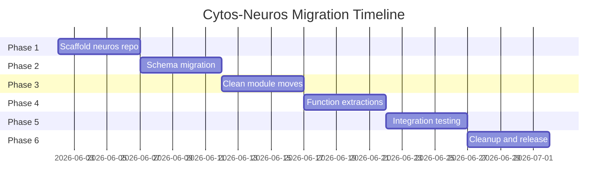

# Cytos–Neuros Architectural Separation

> **Status**: Active
> **Date**: 2026-07-10
> **Author**: @shahin
> **Audience**: engineers
> **Tags**: `engineering`
> **Variants**: Technical (this doc) - Readable (cytos-neuros-separation.md in Obsidian vault: 04-Engineering/cytos/) - Agent (n/a)

> Defining the boundary between `cytos` (general biomedical data platform) and `neuros` (neuro/psych-specific functionality)

**Author**: Cytognosis Foundation Architecture Team
**Date**: 2026-05-25
**Status**: DRAFT
**Affects**: `cytos`, `neuros` (new), `cytoskeleton`

---

## Table of Contents

1. [Executive Summary](#1-executive-summary)
2. [Current State of cytos](#2-current-state-of-cytos)
3. [Module Inventory and Migration Classification](#3-module-inventory-and-migration-classification)
4. [Domain Schema Inventory](#4-domain-schema-inventory)
5. [Dependency Graph Analysis](#5-dependency-graph-analysis)
6. [The Separation Boundary](#6-the-separation-boundary)
7. [Proposed neuros Package Structure](#7-proposed-neuros-package-structure)
8. [Proposed cytos Post-Migration Structure](#8-proposed-cytos-post-migration-structure)
9. [Migration Playbook](#9-migration-playbook)
10. [Grants Subsystem Decision](#10-grants-subsystem-decision)
11. [Extras and Naming Conventions](#11-extras-and-naming-conventions)
12. [Dependency Rules and Enforcement](#12-dependency-rules-and-enforcement)
13. [Schema Inheritance Strategy](#13-schema-inheritance-strategy)
14. [Risk Assessment](#14-risk-assessment)
15. [Open Questions](#15-open-questions)

---

## 1. Executive Summary

`cytos` is Cytognosis's master substrate for data engineering, knowledge graphs, and multimodal foundation models. Over the course of development, neuro/psychiatric-specific functionality has accumulated within `cytos`, creating coupling between general-purpose biomedical infrastructure and brain-specific data processing. This document defines the clean separation into two packages:

- **`cytos`** — General biomedical data platform (LinkML schemas, KG assembly, general genomics, scholarly, clinical, sensor, ontology)
- **`neuros`** — Neuro/psychiatric-specific functionality (NeuroBioBank, PGC psychiatric genomics, PsychENCODE, NWB/HDMF, BIDS, connectomics, behavioral instruments)

### Guiding Principles

1. **One-way dependency**: `neuros` depends on `cytos`; `cytos` never imports from `neuros`
2. **Schema inheritance**: `neuros` LinkML schemas extend `cytos` schemas via `is_a` and URI namespaces
3. **No code duplication**: Shared utilities stay in `cytos`; neuro-specific logic moves to `neuros`
4. **Incremental migration**: Move in phases, maintaining backward compatibility via re-exports
5. **Feature parity**: After migration, `pip install cytos` must work identically for non-neuro users
6. **Test coverage gate**: No file moves without passing tests in both packages

---

## 2. Current State of cytos

### 2.1 Package Identity

```
cytos v2026.5.0
"Master Cytognosis substrate: data engineering, knowledge graphs,
 multimodal foundation models, and inference."
```

- **Build system**: Hatchling
- **Python**: ≥3.13
- **Entry point**: `cytos` CLI via Typer (`cytos.cli.main:app`)
- **Pipeline stack**: Kedro (DAG) + DVC (artifacts) + MLflow (experiments) + Dagster (production)
- **Wheel packages**: `src/cytos`

### 2.2 Source Module Tree

```
src/cytos/
├── __init__.py              # Package root docstring
├── __main__.py              # CLI entry
├── settings.py              # Kedro project settings
├── pipeline_registry.py     # Kedro pipeline discovery
├── cli/                     # Typer CLI (main.py, 31KB)
├── data/                    # Data assets (.gitkeep + surreal/)
├── db/                      # Database connectors (neo4j/, surrealdb/)
├── genomics/                # 22 .py files + graphld/ submodule
├── harmonize/               # Stub (__init__.py only)
├── ingest/                  # Multi-format ingestion pipeline
│   ├── adapters/            # biocypher_bridge, genotype, single_cell
│   ├── parsers/             # bibtex, hdmf, jsonschema, owl, parquet, rdf, rrf
│   └── linkmlize/           # 15 transform modules (base, biolink, biothings, ...)
├── kg/                      # Knowledge graph assembly
│   ├── biocypher/           # BioCypher adapters + schema_config
│   ├── koza/                # Monarch-style KGX transforms
│   └── storage/             # Empty (planned)
├── nbb/                     # ⚠️ NeuroBioBank (marked for neuros migration)
├── ontology/                # OBO/OWL fetcher, registry, validator, CLI
├── pipelines/               # Kedro + Dagster pipelines
│   ├── data_engineering/    # bibtex_io, normalize_predicates, parse_uniprot, etc.
│   ├── modeling/            # ML modeling pipelines
│   └── publishing/          # asset_pipeline, rocrate
├── publish/                 # RO-Crate publishing (rocrate.py, redun_rocrate.py)
├── schema/                  # Schema bridges, export, generated/, linkml/
├── scholarly/               # 32 .py files + grants/ submodule
│   └── grants/              # Grant parsing (extractor, generator, harmonizer, parser, ...)
├── services/                # KG-backed query interfaces (stub)
├── sources/                 # External data source connectors
│   ├── descriptor.py        # Source descriptor
│   ├── http.py              # HTTP client
│   ├── registry.py          # Source registry
│   ├── monarch/             # Monarch API
│   ├── ols4/                # OLS4 API
│   ├── opentargets/         # Open Targets API
│   └── umls/                # UMLS API
├── utils/                   # Shared utilities (io.py, paths.py)
└── validate/                # OWL validation (owl_validate.py)
```

### 2.3 Schema Tree

```
schemas/
├── core.yaml                           # Core types, enums (ModalityEnum, ParserEnum, etc.)
├── cytos.yaml                          # Top-level cytos schema
├── apqc_validation_enum.yaml           # APQC validation enums
├── bioschemas_profiles.yaml            # Bioschemas profiles
├── cl_validation_enum.yaml             # Cell Ontology validation (1.4MB)
├── efo_validation_enum.yaml            # EFO validation (7.0MB)
├── hancestro_validation_enum.yaml      # HANCESTRO validation
├── mondo_validation_enum.yaml          # MONDO validation (4.0MB)
├── pato_validation_enum.yaml           # PATO validation
├── schema_org_types.yaml               # Schema.org types
├── swebok_validation_enum.yaml         # SWEBOK validation
├── uberon_validation_enum.yaml         # UBERON validation (1.8MB)
├── domains/
│   ├── agent.yaml                      # Agent entities
│   ├── anatomy.yaml                    # Anatomical entities
│   ├── annotation.yaml                 # Annotation framework (14.5KB)
│   ├── behavior.yaml                   # ⚠️ Behavioral phenotypes (NBO, DSM-5, PHQ-9, GAD-7)
│   ├── biothings.yaml                  # BioThings entities
│   ├── cellline.yaml                   # Cell line entities
│   ├── clinical.yaml                   # Clinical entities (FHIR, OMOP)
│   ├── dataset.yaml                    # Dataset metadata
│   ├── device.yaml                     # Device hierarchy (SensorScaleEnum includes connectomic)
│   ├── disease.yaml                    # Disease entities (MONDO)
│   ├── drug.yaml                       # Drug entities
│   ├── environment.yaml                # Environmental factors
│   ├── evidence.yaml                   # Evidence framework (SEPIO, GA4GH Pedigree, HED, ISA)
│   ├── exposure.yaml                   # Exposure entities
│   ├── expression.yaml                 # Gene expression
│   ├── ga4gh.yaml                      # GA4GH standards
│   ├── gene.yaml                       # Gene entities
│   ├── genomics.yaml                   # Genomic entities (18KB)
│   ├── geography.yaml                  # Geographic entities
│   ├── hra.yaml                        # Human Reference Atlas
│   ├── information.yaml                # Information entities
│   ├── measurement.yaml                # Measurement entities
│   ├── nwb.yaml                        # ⚠️ Neurodata Without Borders (NWB) schema
│   ├── pathway.yaml                    # Biological pathways
│   ├── person.yaml                     # Person entities (24KB)
│   ├── phenotype.yaml                  # Phenotype entities (HPO)
│   ├── population.yaml                 # Population entities
│   ├── publication.yaml                # Publication entities
│   ├── relationships.yaml              # Relationship types
│   ├── scholarly.yaml                  # Scholarly entities (25KB)
│   ├── semantic_network.yaml           # UMLS Semantic Network
│   ├── sensor/                         # Sensor sub-schemas (subdirectory)
│   ├── sensor.yaml                     # W3C SOSA/SSN sensor schema
│   ├── taxonomy.yaml                   # Taxonomy entities
│   ├── topic.yaml                      # Topic classification
│   └── variant.yaml                    # Genetic variant entities
├── registries/
│   └── registries.yaml                 # Plug-in registries (vendor, device, observable property, etc.)
└── mappings/                           # SSSOM mapping sets
```

---

## 3. Module Inventory and Migration Classification

### 3.1 Complete Module Table

| Module | Description | Files | Size | Neuro? | Decision |
|--------|-------------|-------|------|--------|----------|
| `__init__.py` | Package root docstring | 1 | 778B | No | **stays** |
| `__main__.py` | CLI entry | 1 | 96B | No | **stays** |
| `settings.py` | Kedro project settings | 1 | 430B | No | **stays** |
| `pipeline_registry.py` | Kedro pipeline discovery | 1 | 1.3KB | No | **stays** |
| `cli/` | Typer CLI (`cytos` command) | 2 | 31.6KB | No | **stays** |
| `data/` | Data assets (.gitkeep + surreal/) | 2 | — | No | **stays** |
| `db/` | Database connectors (Neo4j, SurrealDB) | 3+ | — | No | **stays** |
| **`nbb/`** | NeuroBioBank: ICD-10 F/G extraction, UMLS→SNOMED mapping, SSSOM generation | 2 | 13.2KB | **YES** | **→ neuros** |
| `genomics/` | VCF, GWAS, PRS, liftover, regulatory, eQTL, haplotype, pangenome, GraphLD, VRS, etc. | 22 + graphld/ | ~240KB | **Partial** | **split** |
| `scholarly/` | PDF parsing, citations, NER, intelligence, Google Scholar, ORCID, Semantic Scholar | 32 | ~510KB | No | **stays** |
| `scholarly/grants/` | Grant document parsing, generation, harmonization | 7 + schemas/ + templates/ | ~72KB | No | **stays** (see §10) |
| `ingest/` | Multi-format ingestion pipeline | 24+ | — | **Partial** | **split** |
| `ingest/parsers/` | bibtex, hdmf, jsonschema, owl, parquet, rdf, rrf | 8 | ~37KB | **hdmf only** | **split** |
| `ingest/linkmlize/` | 15 LinkML transform modules | 15 | ~120KB | **nwb only** | **split** |
| `ingest/adapters/` | biocypher_bridge, genotype, single_cell | 4 | ~29KB | No | **stays** |
| `ontology/` | OBO/OWL fetcher, registry, validator, CLI | 5 | ~16KB | No | **stays** |
| `kg/` | KG assembly (BioCypher, Koza, DuckDB, SSSOM) | 11 | ~150KB | No | **stays** |
| `schema/` | Schema bridges, export, generated/ | 4+ | — | No | **stays** |
| `services/` | KG-backed query interfaces (stub) | 1 | — | No | **stays** |
| `pipelines/` | Kedro + Dagster pipelines | 8+ | ~60KB | No | **stays** |
| `publish/` | RO-Crate publishing | 4 | ~34KB | No | **stays** |
| `sources/` | External data source connectors (Monarch, OLS4, OpenTargets, UMLS) | 8+ | ~56KB | No | **stays** |
| `utils/` | Shared utilities (io.py, paths.py) | 3 | ~4KB | No | **stays** |
| `validate/` | OWL validation | 2 | ~5KB | No | **stays** |
| `harmonize/` | Stub (empty `__init__.py`) | 1 | — | No | **stays** |

### 3.2 Genomics Module Detailed Breakdown

The `genomics/` module is the most complex split. Here is the file-by-file analysis:

| File | Size | Content | Neuro-Specific? | Decision |
|------|------|---------|-----------------|----------|
| `__init__.py` | 566B | Module docstring, mentions brainSCOPE/GENCODE | Docstring only | **stays** (edit docstring) |
| `annotate.py` | 7.7KB | Variant annotation (VRS, rsID, regions). Mentions brainSCOPE CRE | References only | **stays** |
| `eqtl.py` | 8.9KB | GTEx eQTL loader + `load_psychencode_eqtls()` function | **YES** (PsychENCODE) | **split** |
| `graphld/` | 5 files, ~57KB | GraphLD LDGM adapter for precision-matrix PRS | No | **stays** |
| `graphld_bridge.py` | 7.8KB | GraphLD bridge interface | No | **stays** |
| `gwas.py` | 12.8KB | GWAS summary statistics loader. PGC format support, SCZ examples | **YES** (PGC format) | **split** |
| `haplotype.py` | 14.5KB | Haplotype analysis | No | **stays** |
| `ingest.py` | 6.7KB | GWAS ingest orchestrator. `ingest_pgc_all()` function, PGC_PSYCHIATRIC_14 | **YES** (PGC ingest) | **split** |
| `io.py` | 15.7KB | BioCypher-compatible I/O adapters | No | **stays** |
| `join.py` | 4.4KB | Multi-GWAS dataset alignment | No | **stays** |
| `liftover.py` | 4.5KB | GRCh37↔GRCh38 coordinate conversion | No | **stays** |
| `munge.py` | 7.5KB | GWAS summary statistics harmonization. PGC alias handling | References only | **stays** |
| `pangenome.py` | 15.5KB | Pan-genome analysis | No | **stays** |
| `phenopacket.py` | 13.6KB | Phenopacket generation | No | **stays** |
| `prs.py` | 9.2KB | Polygenic risk score computation | No | **stays** |
| `reference.py` | 14.9KB | Reference genome handling | No | **stays** |
| `regions.py` | 11.2KB | Genomic regions | No | **stays** |
| `regulatory.py` | 10.6KB | CRE, GRN, eQTL from **brainSCOPE** and GENCODE. PsychENCODE-specific | **YES** (entirely) | **→ neuros** |
| `so.py` | 13.6KB | Sequence Ontology handling | No | **stays** |
| `sources.py` | 14.7KB | GWAS data sources. Contains `PGC_PSYCHIATRIC_14` dict, PGC download functions | **YES** (PGC section) | **split** |
| `tracks.py` | 11.6KB | Genomic track handling | No | **stays** |
| `vcf.py` | 23.4KB | VCF parsing and manipulation | No | **stays** |
| `vrs.py` | 12.5KB | GA4GH VRS variant representation | No | **stays** |

### 3.3 Ingest Module Detailed Breakdown

| File | Location | Neuro-Specific? | Decision |
|------|----------|-----------------|----------|
| `parsers/hdmf.py` | `ingest/parsers/` | **YES** — HDMF NamespaceCatalog parser for NWB schema files | **→ neuros** |
| `linkmlize/nwb.py` | `ingest/linkmlize/` | **YES** — NWB/HDMF schema LinkML transform | **→ neuros** |
| `linkmlize/base.py` | `ingest/linkmlize/` | No — abstract base class | **stays** |
| `linkmlize/biolink.py` | `ingest/linkmlize/` | No | **stays** |
| `linkmlize/biothings.py` | `ingest/linkmlize/` | No | **stays** |
| `linkmlize/cellxgene.py` | `ingest/linkmlize/` | No | **stays** |
| `linkmlize/ga4gh.py` | `ingest/linkmlize/` | No | **stays** |
| `linkmlize/kg_align.py` | `ingest/linkmlize/` | No | **stays** |
| `linkmlize/ontology.py` | `ingest/linkmlize/` | No | **stays** |
| `linkmlize/openalex.py` | `ingest/linkmlize/` | No | **stays** |
| `linkmlize/opentargets.py` | `ingest/linkmlize/` | No | **stays** |
| `linkmlize/schema_org.py` | `ingest/linkmlize/` | No | **stays** |
| `linkmlize/sosa.py` | `ingest/linkmlize/` | No | **stays** |
| `linkmlize/umls.py` | `ingest/linkmlize/` | No | **stays** |
| `linkmlize/umls_owl.py` | `ingest/linkmlize/` | No | **stays** |
| `parsers/bibtex.py` | `ingest/parsers/` | No | **stays** |
| `parsers/jsonschema.py` | `ingest/parsers/` | No | **stays** |
| `parsers/owl.py` | `ingest/parsers/` | No | **stays** |
| `parsers/parquet.py` | `ingest/parsers/` | No | **stays** |
| `parsers/rdf.py` | `ingest/parsers/` | No | **stays** |
| `parsers/rrf.py` | `ingest/parsers/` | No | **stays** |

### 3.4 Scholarly Module Cross-Cutting References

Several scholarly files contain neuro/brain references that are **not neuro-specific** but rather general-purpose classification patterns. These **stay in cytos**:

| File | Neuro Reference | Nature | Decision |
|------|----------------|--------|----------|
| `classify.py` | `CONNECTOMICS` enum, brain region regex patterns | General taxonomy | **stays** |
| `dataset_helpers.py` | MRI/fMRI data type mappings | General data type handling | **stays** |
| `intelligence.py` | "Neuroscience" keyword list | General topic classification | **stays** |
| `ner.py` | Brain region, neuron type, neuro disease regex | General NER patterns | **stays** |
| `resource_resolver.py` | NBB, PsychENCODE, HCP resource entries | Resource catalog entries | **stays** (configurable) |
| `topics.py` | `is_psych_neuro` flag | Topic detection | **stays** |

> [!NOTE]
> These cross-cutting references use neuro/brain as examples within general-purpose classification systems. Moving them would break the general-purpose nature of these modules. The resource_resolver entries for NBB, PsychENCODE, and HCP should eventually be configurable via a plugin/registry pattern rather than hardcoded.

---

## 4. Domain Schema Inventory

### 4.1 Complete Schema Classification

| Schema | File | Size | Neuro-Specific? | Decision |
|--------|------|------|-----------------|----------|
| `core.yaml` | `schemas/core.yaml` | 5.8KB | No (general types/enums) | **stays** |
| `cytos.yaml` | `schemas/cytos.yaml` | 3.2KB | No | **stays** |
| `agent.yaml` | `domains/` | 1.5KB | No | **stays** |
| `anatomy.yaml` | `domains/` | 4.3KB | No (general UBERON) | **stays** |
| `annotation.yaml` | `domains/` | 14.6KB | No | **stays** |
| **`behavior.yaml`** | `domains/` | 4.1KB | **YES** — NBO, DSM-5, PHQ-9, GAD-7 | **→ neuros** |
| `biothings.yaml` | `domains/` | 4.2KB | No | **stays** |
| `cellline.yaml` | `domains/` | 3.6KB | No | **stays** |
| `clinical.yaml` | `domains/` | 4.7KB | No (general FHIR/OMOP) | **stays** |
| `dataset.yaml` | `domains/` | 3.2KB | No | **stays** |
| `device.yaml` | `domains/` | 3.5KB | **Partial** — `SensorScaleEnum.connectomic` includes EEG/MEG/fNIRS/fMRI | **stays** (enum value is general) |
| `disease.yaml` | `domains/` | 5.6KB | No (general MONDO) | **stays** |
| `drug.yaml` | `domains/` | 6.3KB | No | **stays** |
| `environment.yaml` | `domains/` | 3.0KB | No | **stays** |
| `evidence.yaml` | `domains/` | 8.7KB | **Partial** — Contains HEDTag class (neuroscience event tagging) | **split** |
| `exposure.yaml` | `domains/` | 2.2KB | No | **stays** |
| `expression.yaml` | `domains/` | 7.0KB | No | **stays** |
| `ga4gh.yaml` | `domains/` | 7.3KB | No | **stays** |
| `gene.yaml` | `domains/` | 6.3KB | No | **stays** |
| `genomics.yaml` | `domains/` | 18.1KB | No (general genomics) | **stays** |
| `geography.yaml` | `domains/` | 1.2KB | No | **stays** |
| `hra.yaml` | `domains/` | 7.9KB | No (Human Reference Atlas) | **stays** |
| `information.yaml` | `domains/` | 2.8KB | No | **stays** |
| `measurement.yaml` | `domains/` | 1.1KB | No | **stays** |
| **`nwb.yaml`** | `domains/` | 8.1KB | **YES** — NWB entities (NWBFile, TimeSeries, Electrode, SpikeUnit, Stimulus) | **→ neuros** |
| `pathway.yaml` | `domains/` | 4.1KB | No | **stays** |
| `person.yaml` | `domains/` | 24.4KB | No | **stays** |
| `phenotype.yaml` | `domains/` | 4.5KB | No (general HPO) | **stays** |
| `population.yaml` | `domains/` | 0.9KB | No | **stays** |
| `publication.yaml` | `domains/` | 7.2KB | No | **stays** |
| `relationships.yaml` | `domains/` | 7.9KB | No | **stays** |
| `scholarly.yaml` | `domains/` | 25.4KB | No | **stays** |
| `semantic_network.yaml` | `domains/` | 4.1KB | No (UMLS) | **stays** |
| `sensor.yaml` | `domains/` | 6.8KB | No (general W3C SOSA/SSN) | **stays** |
| `sensor/` | `domains/sensor/` | — | No | **stays** |
| `taxonomy.yaml` | `domains/` | 2.2KB | No | **stays** |
| `topic.yaml` | `domains/` | 7.7KB | No | **stays** |
| `variant.yaml` | `domains/` | 5.8KB | No | **stays** |
| `registries.yaml` | `registries/` | 6.9KB | No (general sensor registries) | **stays** |

### 4.2 Schema Migration Details

#### `nwb.yaml` — Definite Move

This schema is entirely neuroscience-specific:
- **Classes**: `NWBFile`, `NWBSubject`, `TimeSeries`, `ElectricalSeries`, `Electrode`, `ElectrodeGroup`, `SpikeUnit`, `Stimulus`
- **Enums**: `NWBSexEnum`, `SpikeQualityEnum`, `StimulusTypeEnum`
- **Imports**: `linkml:types`, `../core` (inherits `CytosEntity`)
- **URI**: `https://w3id.org/cytognosis/cytos/domains/nwb`

After migration, the URI namespace will change to:
```
https://w3id.org/cytognosis/neuros/domains/nwb
```

#### `behavior.yaml` — Definite Move

This schema contains psychiatric-specific content:
- **Classes**: `NeurobehavioralPhenotype` (NBO/DSM-5), `BehavioralAssessment` (PHQ-9, GAD-7, MADRS, SCID), `SocialDeterminant`
- **Enums**: `BehaviorDomainEnum` (mood, anxiety, cognition, psychomotor, sleep, etc.), `AssessmentTypeEnum`
- **Slots**: `nbo_id`, `dsm5_disorders`, `measured_phenotypes`, `cutoff_scores`

> [!IMPORTANT]
> The `SocialDeterminant` class is arguably general-purpose (SDOH factors). Consider keeping it in cytos and moving only `NeurobehavioralPhenotype` and `BehavioralAssessment` to neuros.

#### `evidence.yaml` — Partial Split

The `HEDTag` class (Hierarchical Event Descriptors) is neuroscience-specific and should move to neuros. The remaining content (SEPIO evidence framework, GA4GH Pedigree, ISA Investigation-Study-Assay) is general-purpose and stays.

#### `device.yaml` — Stays (With Note)

The `SensorScaleEnum` contains `connectomic: "EEG, MEG, fNIRS, fMRI"`. This is a general sensor scale classification, not a neuro-specific type. Neuroimaging devices are valid entries in a general device taxonomy. The enum value **stays** in cytos.

#### `core.yaml` — Stays (With Note)

The `ModalityEnum` contains `connectomics_imaging: "Structural/functional adjacency tensors, 3D volumes"`. This is one of the five Cytoverse modalities and represents the platform's design, not a neuro-specific extension. It **stays** in cytos.

---

## 5. Dependency Graph Analysis

### 5.1 Current Import Dependencies



### 5.2 Cross-Package Dependencies After Split



### 5.3 Key Dependency Chains

1. **NBB → DuckDB**: `nbb/mapping.py` uses DuckDB in-memory for ICD-10 extraction and UMLS mapping. DuckDB is a cytos core dependency.

2. **NWB LinkMLize → Base + HDMF Parser**: `ingest/linkmlize/nwb.py` extends `BaseLinkMLizer` (stays in cytos) and uses `HDMFParser` (moves to neuros). After migration, the import chain becomes: `neuros.ingest.nwb` → `cytos.ingest.linkmlize.base` + `neuros.ingest.hdmf`.

3. **Regulatory → brainSCOPE**: `genomics/regulatory.py` is entirely PsychENCODE/brainSCOPE-specific. Clean cut, no reverse dependencies.

4. **PGC Sources → GWAS**: `genomics/sources.py` contains `PGC_PSYCHIATRIC_14` (14 psychiatric disorder GWAS metadata). This data structure is referenced by `genomics/ingest.py` (`ingest_pgc_all()`). Both the PGC data dict and the orchestrator function move to neuros.

5. **eQTL → PsychENCODE**: `genomics/eqtl.py` contains `load_psychencode_eqtls()` alongside general `load_gtex_eqtls()`. Split strategy: keep `load_gtex_eqtls()` and `eqtl_to_neo4j()` in cytos; move `load_psychencode_eqtls()` to neuros.

---

## 6. The Separation Boundary

### 6.1 Decision Framework

A module, schema, or function moves to `neuros` if it satisfies ANY of these criteria:

1. **Brain-specific data source**: NeuroBioBank, PsychENCODE, DANDI, Allen Brain Atlas, HCP
2. **Psychiatric/neurological ontology**: NBO, DSM-5, ICD-10 F/G chapters specifically
3. **Neurophysiology data format**: NWB, HDMF, BIDS, EDF
4. **Brain imaging/connectivity**: Connectomics, fMRI, EEG (as data processing, not as sensor types)
5. **Psychiatric instruments**: PHQ-9, GAD-7, MADRS, SCID, CANTAB
6. **Explicitly marked**: Code tagged with `# TODO(neuros): migrate to neuros package`

A module **stays in cytos** if:

1. **General infrastructure**: Parsing, KG assembly, schema export, CLI, utilities
2. **General biomedical**: VCF, GWAS (format), PRS (algorithm), ontology (OBO/OWL), FHIR/OMOP
3. **Cross-cutting neuro references**: Regex patterns, enum values, topic keywords that mention brain/neuro as part of a general classification system
4. **Shared base classes**: `BaseLinkMLizer`, `BaseParser`, etc.

### 6.2 Definite Moves to neuros

| Current Location | Target Location | Type |
|-----------------|-----------------|------|
| `src/cytos/nbb/` | `src/neuros/nbb/` | Module (complete) |
| `src/cytos/genomics/regulatory.py` | `src/neuros/genomics/regulatory.py` | Module (complete) |
| `src/cytos/ingest/parsers/hdmf.py` | `src/neuros/ingest/parsers/hdmf.py` | Module (complete) |
| `src/cytos/ingest/linkmlize/nwb.py` | `src/neuros/ingest/linkmlize/nwb.py` | Module (complete) |
| `schemas/domains/nwb.yaml` | `neuros/schemas/domains/nwb.yaml` | Schema (complete) |
| `schemas/domains/behavior.yaml` | `neuros/schemas/domains/behavior.yaml` | Schema (complete) |

### 6.3 Functions That Move (Split Files)

| Source File | Function/Object | Target |
|------------|-----------------|--------|
| `genomics/eqtl.py` | `load_psychencode_eqtls()` | `neuros.genomics.eqtl` |
| `genomics/sources.py` | `PGC_PSYCHIATRIC_14` dict | `neuros.genomics.pgc_sources` |
| `genomics/sources.py` | `download_pgc_dataset()` | `neuros.genomics.pgc_sources` |
| `genomics/sources.py` | `download_all_pgc()` | `neuros.genomics.pgc_sources` |
| `genomics/ingest.py` | `ingest_pgc_all()` | `neuros.genomics.pgc_ingest` |
| `genomics/gwas.py` | PGC-specific column mapping logic | `neuros.genomics.pgc_gwas` |
| `evidence.yaml` | `HEDTag` class | `neuros/schemas/domains/hed.yaml` |

### 6.4 Stays in cytos (Gray Areas Resolved)

| Item | Rationale |
|------|-----------|
| `core.yaml` `ModalityEnum.connectomics_imaging` | Platform design; one of five Cytoverse modalities |
| `device.yaml` `SensorScaleEnum.connectomic` | General sensor taxonomy; EEG/MEG are valid sensor types |
| `scholarly/classify.py` `CONNECTOMICS` enum | General topic classification |
| `scholarly/ner.py` brain region patterns | General NER; brain is one of many organs |
| `scholarly/resource_resolver.py` NBB/PsychENCODE entries | Resource catalog; should be registry-based |
| `genomics/gwas.py` general GWAS loader | PGC is just one format; general SSF stays |
| `genomics/munge.py` PGC alias handling | Alias table is general; PGC aliases are rows |
| `genomics/annotate.py` brainSCOPE reference | Reference in docstring only |

---

## 7. Proposed neuros Package Structure

### 7.1 Repository Layout

```
neuros/
├── pyproject.toml
├── README.md
├── LICENSE
├── src/
│   └── neuros/
│       ├── __init__.py
│       ├── nbb/
│       │   ├── __init__.py
│       │   └── mapping.py           # ← from cytos.nbb.mapping
│       ├── genomics/
│       │   ├── __init__.py
│       │   ├── regulatory.py         # ← from cytos.genomics.regulatory
│       │   ├── pgc_sources.py        # ← PGC_PSYCHIATRIC_14 + download functions
│       │   ├── pgc_ingest.py         # ← ingest_pgc_all()
│       │   ├── pgc_gwas.py           # ← PGC-specific GWAS column mappings
│       │   └── psychencode_eqtl.py   # ← load_psychencode_eqtls()
│       ├── ingest/
│       │   ├── __init__.py
│       │   ├── parsers/
│       │   │   ├── __init__.py
│       │   │   └── hdmf.py           # ← from cytos.ingest.parsers.hdmf
│       │   └── linkmlize/
│       │       ├── __init__.py
│       │       └── nwb.py            # ← from cytos.ingest.linkmlize.nwb
│       ├── connectomics/
│       │   ├── __init__.py
│       │   └── .gitkeep              # Future: brain connectivity processing
│       ├── bids/
│       │   ├── __init__.py
│       │   └── .gitkeep              # Future: BIDS data handling
│       └── instruments/
│           ├── __init__.py
│           └── .gitkeep              # Future: PHQ-9, GAD-7, MADRS, SCID
├── schemas/
│   ├── core.yaml                     # neuros core types (extends cytos core)
│   └── domains/
│       ├── nwb.yaml                  # ← from cytos schemas/domains/nwb.yaml
│       ├── behavior.yaml             # ← from cytos schemas/domains/behavior.yaml
│       └── hed.yaml                  # ← HEDTag from cytos evidence.yaml
└── tests/
    ├── test_nbb.py
    ├── test_genomics/
    ├── test_ingest/
    └── conftest.py
```

### 7.2 Proposed `pyproject.toml`

```toml
[build-system]
requires = ["hatchling>=1.21"]
build-backend = "hatchling.build"

[project]
name = "neuros"
version = "2026.5.0"
description = "Cytognosis neurological and psychiatric sciences module."
readme = "README.md"
license = "Apache-2.0"
requires-python = ">=3.13"
authors = [
    { name = "Shahin Mohammadi", email = "mohammadi@cytognosis.org" },
    { name = "Cytognosis Foundation", email = "dev@cytognosis.org" },
]
classifiers = [
    "Development Status :: 3 - Alpha",
    "Intended Audience :: Science/Research",
    "License :: OSI Approved :: Apache Software License",
    "Programming Language :: Python :: 3.13",
    "Topic :: Scientific/Engineering :: Bio-Informatics",
    "Topic :: Scientific/Engineering :: Medical Science Apps.",
]
keywords = [
    "cytognosis", "neuroscience", "neuroimaging", "nwb",
    "psychiatric-genomics", "brain", "connectomics",
]
dependencies = [
    "cytos>=2026.5.0",
    "pyyaml>=6.0",
    "polars>=1.30.0",
    "duckdb>=1.3.0",
    "loguru>=0.7",
]

[project.optional-dependencies]
nwb = [
    # "pynwb>=2.8",
    # "hdmf>=3.14",
]
bids = [
    # "bids-validator>=2.0",
]
connectome = []
psych = []
nbb = []
all = [
    "neuros[nwb,bids,connectome,psych,nbb]",
]
dev = [
    "pytest>=8.0",
    "pytest-cov>=5.0",
    "ruff>=0.5",
]

[project.urls]
Homepage = "https://github.com/cytognosis/neuros"
Documentation = "https://cytognosis.github.io/neuros"
Repository = "https://github.com/cytognosis/neuros"

[tool.hatch.build.targets.wheel]
packages = ["src/neuros"]

[tool.ruff]
target-version = "py313"
line-length = 88
src = ["src"]

[tool.ruff.lint]
select = ["E", "W", "F", "I", "UP", "B", "SIM", "RUF", "D", "ANN", "TCH"]
ignore = ["D100", "D104", "D105", "D107", "ANN101", "ANN102", "ANN401", "E501"]

[tool.ruff.lint.pydocstyle]
convention = "google"

[tool.ruff.lint.isort]
known-first-party = ["neuros", "cytos"]

[tool.mypy]
python_version = "3.13"
warn_return_any = true
warn_unused_configs = true
disallow_untyped_defs = true
packages = ["neuros"]
mypy_path = "src"
```

---

## 8. Proposed cytos Post-Migration Structure

### 8.1 Changes to cytos

After migration, cytos has these diffs:

```diff
 src/cytos/
-├── nbb/                     # REMOVED: migrated to neuros
-│   ├── __init__.py
-│   └── mapping.py
+├── _compat/                  # ADDED: backward compatibility re-exports
+│   ├── __init__.py
+│   └── nbb.py               # Re-exports neuros.nbb with deprecation warning
 ├── genomics/
 │   ├── __init__.py           # MODIFIED: updated docstring
-│   ├── regulatory.py         # REMOVED: migrated to neuros
+│   ├── regulatory.py         # REMOVED → neuros.genomics.regulatory
 │   ├── eqtl.py              # MODIFIED: load_psychencode_eqtls() removed
 │   ├── gwas.py              # MODIFIED: PGC-specific logic extracted
 │   ├── sources.py           # MODIFIED: PGC_PSYCHIATRIC_14 extracted
 │   ├── ingest.py            # MODIFIED: ingest_pgc_all() extracted
 │   └── ... (rest unchanged)
 ├── ingest/
 │   ├── parsers/
-│   │   ├── hdmf.py          # REMOVED: migrated to neuros
+│   │   ├── hdmf.py          # REMOVED → neuros.ingest.parsers.hdmf
 │   │   └── __init__.py      # MODIFIED: HDMFParser removed from __all__
 │   └── linkmlize/
-│       ├── nwb.py           # REMOVED: migrated to neuros
+│       ├── nwb.py           # REMOVED → neuros.ingest.linkmlize.nwb
 │       └── __init__.py      # MODIFIED: NWBLinkMLizer removed from exports
```

### 8.2 Backward Compatibility Re-exports

During the transition period (v2026.5.x → v2027.1.0), cytos provides re-exports with deprecation warnings:

```python
# src/cytos/_compat/nbb.py
"""Backward compatibility shim for cytos.nbb (moved to neuros.nbb)."""

import warnings

warnings.warn(
    "cytos.nbb has moved to neuros.nbb. "
    "Update your imports: from neuros.nbb import NBBMapper",
    DeprecationWarning,
    stacklevel=2,
)

from neuros.nbb import NBBMapper  # noqa: F401, E402

__all__ = ["NBBMapper"]
```

### 8.3 Changes to `pyproject.toml`

```diff
 [project.optional-dependencies]
+neuros = ["neuros>=2026.5.0"]   # NEW: optional neuros integration
 biothings = ["biothings-client>=0.3"]
 genomics = [
     "pronto>=2.5",
     "duckdb>=1.3.0",
 ]
-connectomics = []
 all = [
-    "cytos[biothings,ehr,biblio,kg_neo4j,causal,kedro_mlflow]",
+    "cytos[biothings,ehr,biblio,kg_neo4j,causal,kedro_mlflow,neuros]",
 ]
```

### 8.4 Changes to `ingest/parsers/__init__.py`

```diff
 from cytos.ingest.parsers.bibtex import BibTeXParser
-from cytos.ingest.parsers.hdmf import HDMFParser
 from cytos.ingest.parsers.jsonschema import JsonSchemaParser
 from cytos.ingest.parsers.owl import OWLParser
 from cytos.ingest.parsers.parquet import ParquetParser
@@ -19,7 +18,6 @@
     "RRFParser",
     "ParquetParser",
     "BibTeXParser",
     "OWLParser",
-    "HDMFParser",
 ]
```

---

## 9. Migration Playbook

### Phase 1: Scaffold (Week 1)

1. Create `neuros` repository at `github.com/cytognosis/neuros`
2. Initialize pyproject.toml with cytos dependency
3. Set up CI/CD (ruff, mypy, pytest)
4. Create empty module structure with `__init__.py` files
5. Create `neuros/schemas/core.yaml` extending cytos core

### Phase 2: Schema Migration (Week 2)

1. Copy `nwb.yaml` → `neuros/schemas/domains/nwb.yaml`
2. Copy `behavior.yaml` → `neuros/schemas/domains/behavior.yaml`
3. Extract `HEDTag` from `evidence.yaml` → `neuros/schemas/domains/hed.yaml`
4. Update `imports` in migrated schemas to reference cytos via URI
5. Validate all schemas with `linkml-validate`
6. Remove schemas from cytos (keep redirects in a `_migrated/` directory during transition)

### Phase 3: Clean Module Moves (Week 3)

Move complete modules with no cytos-internal dependents:

1. Move `nbb/` → `neuros/nbb/` (clean cut, no reverse deps)
2. Move `genomics/regulatory.py` → `neuros/genomics/regulatory.py`
3. Move `ingest/parsers/hdmf.py` → `neuros/ingest/parsers/hdmf.py`
4. Move `ingest/linkmlize/nwb.py` → `neuros/ingest/linkmlize/nwb.py`
5. Update all internal imports in moved files
6. Add re-export shims in cytos with `DeprecationWarning`

### Phase 4: Function Extractions (Week 4)

Split files that contain both general and neuro-specific code:

1. Extract `load_psychencode_eqtls()` from `genomics/eqtl.py` → `neuros/genomics/psychencode_eqtl.py`
2. Extract `PGC_PSYCHIATRIC_14` + download functions from `genomics/sources.py` → `neuros/genomics/pgc_sources.py`
3. Extract `ingest_pgc_all()` from `genomics/ingest.py` → `neuros/genomics/pgc_ingest.py`
4. Extract PGC-specific column mappings from `genomics/gwas.py` → `neuros/genomics/pgc_gwas.py`
5. Update `cytos/genomics/__init__.py` docstring to remove brainSCOPE reference
6. Add thin re-export wrappers with deprecation warnings

### Phase 5: Integration Testing (Week 5)

1. Run full `cytos` test suite — verify no regressions
2. Run `neuros` test suite — verify all migrated code works
3. Test cross-package imports: `from neuros.nbb import NBBMapper`
4. Test backward compat: `from cytos.nbb import NBBMapper` (with deprecation)
5. Verify `pip install cytos` works without neuros
6. Verify `pip install neuros` pulls in cytos automatically
7. Validate all LinkML schemas in both packages

### Phase 6: Cleanup (Week 6)

1. Remove re-export shims (or schedule for v2027.1.0 removal)
2. Update all documentation
3. Update cytoskeleton environment lockfiles
4. Update CI matrices to test both packages
5. Tag v2026.6.0 releases for both packages
6. Announce migration in CHANGELOG

### Migration Timeline



---

## 10. Grants Subsystem Decision

### Options Evaluated

| Option | Description | Pros | Cons |
|--------|-------------|------|------|
| **A. Stay in `cytos[scholarly]`** | Grants remain as a submodule of scholarly | Simple, no migration needed, grants are scholarly artifacts | Larger cytos scope |
| B. Dedicated `cytogrants` package | Separate package for grant management | Clean separation, independent versioning | Over-engineering for current size |
| C. `cytos[grants]` extra | Grants as a separate optional dependency group | Visible boundary, opt-in installation | Adds complexity without isolation |

### Recommendation: **Option A — Stay in `cytos[scholarly]`**

**Rationale:**

1. **Size**: The grants subsystem is 7 Python files (~72KB) plus schemas and templates. This is too small to justify a separate package.

2. **Coupling**: Grant parsing depends heavily on scholarly infrastructure:
   - `grants/parser.py` (27.9KB) uses PDF parsing, NER, citation extraction
   - `grants/extractor.py` (8.0KB) uses scholarly NLP pipelines
   - `grants/harmonizer.py` (5.3KB) uses scholarly data structures
   - `grants/generator.py` (4.9KB) uses scholarly template rendering

3. **Domain**: Grants are scholarly artifacts. A grant proposal is a document that references publications, cites prior work, and follows academic conventions. It belongs in the scholarly domain.

4. **User intent**: Per the extras naming conventions document: "Grants stays in cytos for now (decision pending neuros separation research)." There is no evidence that grants are neuro-specific.

5. **Future**: If grants grow significantly (>200KB, >20 files), reconsider extraction to `cytogrants`. For now, the scholarly submodule is the right home.

### Grants Files Inventory

| File | Size | Purpose |
|------|------|---------|
| `__init__.py` | 543B | Module docstring and exports |
| `extractor.py` | 8.0KB | Extract structured data from grant documents |
| `generator.py` | 4.9KB | Generate grant document sections |
| `harmonizer.py` | 5.3KB | Harmonize grant data across formats |
| `parser.py` | 27.9KB | Parse grant documents (PDF, DOCX, etc.) |
| `registry.py` | 22.2KB | Grant opportunity registry and matching |
| `render.py` | 3.6KB | Render grant documents from templates |
| `schemas/` | — | Grant-specific schemas |
| `templates/` | — | Jinja2 templates for grant generation |

---

## 11. Extras and Naming Conventions

### 11.1 cytos Extras (Post-Migration)

| Extra | What It Enables | Heavy Deps? |
|-------|----------------|-------------|
| `schemas` | Full LinkML codegen (OWL, SHACL, GraphQL, Pydantic gen) | Yes |
| `kg` | KG assembly (BioCypher, Koza, DuckDB) | Yes |
| `genomics` | VCF, TileDB-SOMA, pysam | Yes |
| `scholarly` | OpenAlex, PubMed, bibliometric + NLP (medspaCy, scispaCy) | Yes |
| `clinical` | FHIR R5, OMOP CDM adapters | Medium |
| `causal` | DoWhy, SCM, normalizing flows | Yes |
| `sensor` | Sensor data processing, AWARE adapters | Medium |
| `neuros` | Install the neuros package | Medium |
| `all` | Everything including neuros | Massive |

### 11.2 neuros Extras

| Extra | What It Enables |
|-------|----------------|
| `nwb` | NWB data handling (pynwb, hdmf) |
| `bids` | BIDS data handling (bids-validator) |
| `connectome` | Brain connectivity processing |
| `psych` | Psychiatric instruments, PGC data |
| `nbb` | NeuroBioBank data |
| `all` | Everything |

### 11.3 Naming Conventions

Following the rules established in [extras-naming-conventions.md](../../06-Operations/org/naming/extras-naming-conventions.md):

| Rule | Applied |
|------|---------|
| Feature-centric names | ✅ `nwb`, `bids`, `psych`, `nbb` |
| Hyphens over underscores | ✅ No underscores needed (all single-word) |
| Lowercase | ✅ All lowercase |
| Short ≤12 chars | ✅ All ≤10 chars |
| Single-word when possible | ✅ All single-word |
| `all` meta-extra | ✅ Included |
| Separate `dev` from extras | ✅ Dev uses `[dependency-groups]` |

---

## 12. Dependency Rules and Enforcement

### 12.1 Import Direction Rules

```
Rule 1: neuros → cytos   ✅ ALLOWED
Rule 2: cytos → neuros   ❌ FORBIDDEN
Rule 3: neuros → neuros  ✅ ALLOWED
Rule 4: cytos → cytos    ✅ ALLOWED
```

### 12.2 CI Enforcement

Add to cytos CI pipeline:

```yaml
# .github/workflows/ci.yml (cytos)
- name: Check no neuros imports
  run: |
    if grep -r "from neuros" src/cytos/ --include="*.py" | grep -v "_compat/"; then
      echo "ERROR: cytos must not import from neuros (except _compat shims)"
      exit 1
    fi
    if grep -r "import neuros" src/cytos/ --include="*.py" | grep -v "_compat/"; then
      echo "ERROR: cytos must not import from neuros (except _compat shims)"
      exit 1
    fi
```

Add to neuros CI pipeline:

```yaml
# .github/workflows/ci.yml (neuros)
- name: Verify cytos compatibility
  run: |
    pip install cytos
    pip install -e .
    python -c "from neuros.nbb import NBBMapper; print('OK')"
    python -c "from neuros.genomics.regulatory import load_brain_cres; print('OK')"
```

### 12.3 Pre-commit Hook

```yaml
# .pre-commit-config.yaml (cytos)
- repo: local
  hooks:
    - id: no-neuros-imports
      name: Forbid neuros imports in cytos
      entry: bash -c 'grep -r "from neuros\|import neuros" src/cytos/ --include="*.py" | grep -v "_compat/" && exit 1 || exit 0'
      language: system
      types: [python]
```

### 12.4 Runtime Enforcement (Optional)

```python
# src/cytos/__init__.py (add at bottom)
import sys

class _NeurosImportGuard:
    """Prevent cytos modules from importing neuros at runtime."""

    def find_module(self, name, path=None):
        if name.startswith("neuros") and any(
            frame.f_globals.get("__name__", "").startswith("cytos")
            for frame in sys._current_frames().values()
        ):
            # Only warn, don't block (for _compat shims)
            pass
        return None
```

---

## 13. Schema Inheritance Strategy

### 13.1 URI Namespaces

```
cytos schemas:  https://w3id.org/cytognosis/cytos/
neuros schemas: https://w3id.org/cytognosis/neuros/
```

### 13.2 Cross-Package Schema Imports

neuros schemas import cytos schemas via their w3id URIs:

```yaml
# neuros/schemas/domains/nwb.yaml
id: https://w3id.org/cytognosis/neuros/domains/nwb
name: neuros-nwb
title: "Neuros NWB Domain Schema"

imports:
  - linkml:types
  - https://w3id.org/cytognosis/cytos/core  # Import cytos core
  # OR local relative path if schemas are co-located:
  # - ../../../../cytos/schemas/core

classes:
  NWBFile:
    is_a: CytosEntity  # Inherited from cytos core
    class_uri: neuros:NWBFile
    ...
```

### 13.3 Schema Resolution

During development, schemas can be resolved via:
1. **Local paths**: When both repos are checked out side-by-side
2. **w3id.org URIs**: In production, w3id.org redirects resolve to GitHub raw content
3. **LinkML SchemaView**: Programmatic resolution via `SchemaView.load_import()`

### 13.4 Validation Enum Placement

Large validation enum files (CL, EFO, MONDO, UBERON) stay in cytos. They are general-purpose ontology validation enums used across all domains. neuros schemas reference them via URI import.

---

## 14. Risk Assessment

### 14.1 Risk Matrix

| Risk | Likelihood | Impact | Mitigation |
|------|-----------|--------|------------|
| Circular dependency introduced | Low | High | CI enforcement, pre-commit hooks |
| Broken imports during transition | Medium | Medium | Re-export shims with deprecation warnings |
| Schema URI breakage | Medium | High | Keep old URIs as aliases for 2 releases |
| Test coverage regression | Medium | Medium | Require test parity before any file move |
| cytoskeleton lockfile conflicts | Medium | Low | Update lockfiles in Phase 6 |
| User confusion (which package?) | Medium | Low | Clear README, error messages with install hints |
| Missing neuro dependencies in cytos | Low | Medium | Integration tests verify `pip install cytos` works standalone |
| PGC function extraction breaks GWAS pipeline | Medium | High | Extract functions first, run full test suite, then remove from cytos |

### 14.2 Rollback Plan

If critical issues arise during migration:

1. **Schema rollback**: Copy schemas back to cytos, update URIs
2. **Code rollback**: Re-export shims already exist; just point them back to local code
3. **Version rollback**: Pin cytos to pre-migration version in cytoskeleton
4. **Communication**: Announce rollback in `#engineering` channel

---

## 15. Open Questions

### 15.1 Resolved

| Question | Decision | Rationale |
|----------|----------|-----------|
| Where do grants go? | Stay in `cytos[scholarly]` | Too small, too coupled to scholarly |
| Does `connectomics_imaging` modality stay? | Yes, stays in cytos | Platform design, not neuro-specific |
| Does `SensorScaleEnum.connectomic` stay? | Yes, stays in cytos | General sensor taxonomy |
| Should `SocialDeterminant` move with behavior? | Move with behavior for now | Tightly coupled to behavioral schema |
| Should resource_resolver entries move? | No, make configurable | Registry pattern better than hardcoded |

### 15.2 Open

| Question | Options | Recommendation |
|----------|---------|----------------|
| Should neuros be a monorepo with cytos or separate? | Separate repo vs. monorepo workspace | **Separate repo** — different release cadences, cleaner dependency graph |
| Should `genomics/gwas.py` PGC column aliases stay or move? | Stay (general alias table) vs. Move (PGC-specific) | **Stay** — alias table is general; PGC entries are rows in a general structure |
| When to remove re-export shims? | v2027.1.0 (6 months) vs. v2028.1.0 (18 months) | **v2027.1.0** — 6-month deprecation window is sufficient |
| Should neuros schemas live in the neuros repo or a shared schema repo? | neuros repo vs. `cytognosis/schemas` monorepo | **neuros repo** — co-locate schemas with code for development velocity |
| How to handle `classify.py` CONNECTOMICS enum long-term? | Keep as-is vs. Make pluggable | **Make pluggable** via a topic registry that neuros can extend |

---

## Appendix A: File-Level Migration Checklist

### A.1 Complete File Moves

- [ ] `src/cytos/nbb/__init__.py` → `src/neuros/nbb/__init__.py`
- [ ] `src/cytos/nbb/mapping.py` → `src/neuros/nbb/mapping.py`
- [ ] `src/cytos/genomics/regulatory.py` → `src/neuros/genomics/regulatory.py`
- [ ] `src/cytos/ingest/parsers/hdmf.py` → `src/neuros/ingest/parsers/hdmf.py`
- [ ] `src/cytos/ingest/linkmlize/nwb.py` → `src/neuros/ingest/linkmlize/nwb.py`
- [ ] `schemas/domains/nwb.yaml` → `neuros/schemas/domains/nwb.yaml`
- [ ] `schemas/domains/behavior.yaml` → `neuros/schemas/domains/behavior.yaml`

### A.2 Function Extractions

- [ ] `genomics/eqtl.py::load_psychencode_eqtls()` → `neuros/genomics/psychencode_eqtl.py`
- [ ] `genomics/sources.py::PGC_PSYCHIATRIC_14` → `neuros/genomics/pgc_sources.py`
- [ ] `genomics/sources.py::download_pgc_dataset()` → `neuros/genomics/pgc_sources.py`
- [ ] `genomics/sources.py::download_all_pgc()` → `neuros/genomics/pgc_sources.py`
- [ ] `genomics/ingest.py::ingest_pgc_all()` → `neuros/genomics/pgc_ingest.py`
- [ ] `evidence.yaml::HEDTag` → `neuros/schemas/domains/hed.yaml`

### A.3 Files to Modify (Not Move)

- [ ] `genomics/__init__.py` — Remove brainSCOPE from docstring
- [ ] `genomics/eqtl.py` — Remove `load_psychencode_eqtls()`, keep GTEx functions
- [ ] `genomics/gwas.py` — Remove PGC-specific examples from docstring
- [ ] `genomics/sources.py` — Remove `PGC_PSYCHIATRIC_14` and download functions
- [ ] `genomics/ingest.py` — Remove `ingest_pgc_all()` and PGC import
- [ ] `ingest/parsers/__init__.py` — Remove `HDMFParser` from `__all__`
- [ ] `ingest/linkmlize/__init__.py` — Remove NWB-related exports
- [ ] `evidence.yaml` — Remove `HEDTag` class
- [ ] `pyproject.toml` — Add `neuros` optional dependency, remove `connectomics` empty extra

### A.4 New Files to Create

- [ ] `src/cytos/_compat/__init__.py`
- [ ] `src/cytos/_compat/nbb.py` — Re-export shim
- [ ] `src/cytos/_compat/hdmf.py` — Re-export shim
- [ ] `src/cytos/_compat/nwb_linkmlize.py` — Re-export shim
- [ ] `src/cytos/_compat/regulatory.py` — Re-export shim

---

## Appendix B: Import Refactoring Map

### B.1 Before → After Import Changes

| Before (cytos) | After (neuros) | Deprecation Shim |
|----------------|----------------|------------------|
| `from cytos.nbb import NBBMapper` | `from neuros.nbb import NBBMapper` | `cytos._compat.nbb` |
| `from cytos.nbb.mapping import NBBMapper` | `from neuros.nbb.mapping import NBBMapper` | `cytos._compat.nbb` |
| `from cytos.genomics.regulatory import load_brain_cres` | `from neuros.genomics.regulatory import load_brain_cres` | `cytos._compat.regulatory` |
| `from cytos.genomics.regulatory import load_brain_grn` | `from neuros.genomics.regulatory import load_brain_grn` | `cytos._compat.regulatory` |
| `from cytos.genomics.eqtl import load_psychencode_eqtls` | `from neuros.genomics.psychencode_eqtl import load_psychencode_eqtls` | Removed from eqtl.py |
| `from cytos.genomics.sources import PGC_PSYCHIATRIC_14` | `from neuros.genomics.pgc_sources import PGC_PSYCHIATRIC_14` | Removed from sources.py |
| `from cytos.genomics.sources import download_pgc_dataset` | `from neuros.genomics.pgc_sources import download_pgc_dataset` | Removed from sources.py |
| `from cytos.genomics.ingest import ingest_pgc_all` | `from neuros.genomics.pgc_ingest import ingest_pgc_all` | Removed from ingest.py |
| `from cytos.ingest.parsers.hdmf import HDMFParser` | `from neuros.ingest.parsers.hdmf import HDMFParser` | `cytos._compat.hdmf` |
| `from cytos.ingest.linkmlize.nwb import NWBLinkMLizer` | `from neuros.ingest.linkmlize.nwb import NWBLinkMLizer` | `cytos._compat.nwb_linkmlize` |

### B.2 Schema Import Changes

| Before | After |
|--------|-------|
| `imports: [../core]` (in nwb.yaml) | `imports: [https://w3id.org/cytognosis/cytos/core]` |
| `imports: [linkml:types]` (in behavior.yaml) | `imports: [linkml:types, https://w3id.org/cytognosis/cytos/core]` |
| `is_a: CytosEntity` (in NWBFile) | `is_a: CytosEntity` (inherited via URI import) |

### B.3 URI Namespace Changes

| Entity | Before | After |
|--------|--------|-------|
| NWBFile | `cytos:NWBFile` | `neuros:NWBFile` |
| NWBSubject | `cytos:NWBSubject` | `neuros:NWBSubject` |
| TimeSeries | `cytos:TimeSeries` | `neuros:TimeSeries` |
| ElectricalSeries | `cytos:ElectricalSeries` | `neuros:ElectricalSeries` |
| Electrode | `cytos:Electrode` | `neuros:Electrode` |
| SpikeUnit | `cytos:SpikeUnit` | `neuros:SpikeUnit` |
| NeurobehavioralPhenotype | `cytos:NeurobehavioralPhenotype` | `neuros:NeurobehavioralPhenotype` |
| BehavioralAssessment | `cytos:BehavioralAssessment` | `neuros:BehavioralAssessment` |
| HEDTag | `cytos:HEDTag` | `neuros:HEDTag` |

---

## Appendix C: Computational Tools Location

### C.1 Tools That Stay in cytos

| Tool/Library | Module | Rationale |
|-------------|--------|-----------|
| DuckDB | Core dependency | General-purpose analytical engine |
| Polars | Core dependency | General DataFrame library |
| BioCypher | `kg/biocypher/` | General KG assembly |
| Koza | `kg/koza/` | General KGX transforms |
| rdflib | Core dependency | General RDF handling |
| medspaCy | `scholarly/` | General clinical NLP |
| Kedro | `pipelines/` | General pipeline orchestration |
| Dagster | `pipelines/` | General production orchestration |
| GraphLD | `genomics/graphld/` | General LD precision-matrix PRS |
| TileDB | `genomics/` (optional) | General variant storage |
| pysam | `genomics/` (optional) | General SAM/BAM/VCF |

### C.2 Tools That Move to neuros

| Tool/Library | Current Module | Target Module | Rationale |
|-------------|---------------|---------------|-----------|
| pynwb | (not yet imported) | `neuros[nwb]` | NWB-specific |
| hdmf | (parsed as YAML) | `neuros[nwb]` | HDMF-specific |
| bids-validator | (not yet imported) | `neuros[bids]` | BIDS-specific |
| brainSCOPE data | `genomics/regulatory.py` | `neuros/genomics/` | PsychENCODE-specific |

### C.3 Tools Shared Across Both

| Tool | Usage in cytos | Usage in neuros |
|------|---------------|-----------------|
| DuckDB | KG queries, data engineering | NBB ICD-10 extraction, UMLS mapping |
| Polars | General DataFrames | PsychENCODE eQTL, PGC GWAS |
| YAML | Schema parsing | HDMF/NWB schema parsing |
| Jinja2 | Template rendering | (via cytos dependency) |

---

*Document generated from comprehensive codebase analysis of `cytos` v2026.5.0. All file sizes, line counts, and module inventories verified against the live repository.*
