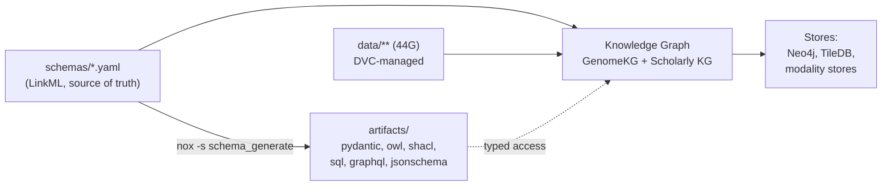

# Cytos pillar — readable guide

> **Status:** Active · **Date:** 2026-07-01 · **Audience:** ADHD-friendly quick read · **Reading time:** ~3 min

> [!IMPORTANT]
> **TL;DR:** Cytos is the **engineering engine** of Cytoverse. You write **schemas** (LinkML YAML), and Cytos turns them into everything else: Python types, JSON Schema, OWL, SHACL, SQL, GraphQL, plus a knowledge graph. Data is versioned with DVC. The generated stuff is never committed; you regenerate it with one command.

## The one mental model

## What lives where

| You want... | Look at |
|---|---|
| The big picture | `architecture.md` (v4.0) |
| Which Python module does what | `module-map.md` |
| How schemas become artifacts | `README.md` + `cytos-pillar.technical.md` |
| Genomics (genes, variants, GWAS) | `genomic-atlas.md`, `genomekg/` |
| Sensors and data formats | `sensing-schema/unified-sensor-report.md` |
| What data we have and how it is versioned | `data-lifecycle-architecture.md`, `../../../Cytos/00-CONSOLIDATION/DATA-MANIFEST.md` |

## The rules that keep it clean

> [!WARNING]
> **Never hand-edit generated artifacts.** Edit the schema, then run `nox -s schema_generate`. The `artifacts/` folder is disposable and gitignored.

> [!TIP]
> **One exception:** `src/cytos/schema/generated/genomics.py` is hand-written on purpose (a LinkML generator bug). It is tracked in git and labeled at the top. Leave it alone unless you know why.

> [!NOTE]
> **Boundary with Neuroverse:** Cytos = the platform and code. Neuroverse = the research and the science story. If a doc is about BDNF axes, bipolar geometry, or the disease map, it belongs to Neuroverse and should be linked, not copied here.

## Start here (5 minutes)

1. Read `architecture.md` for the shape of the system.
2. Skim `module-map.md` to see the code.
3. Open `~/repos/cytognosis/cytos`, run `nox -s schema_generate` to see the pipeline work.

## What just changed (2026-07-01 consolidation)

- Removed duplicates: two identical `architecture-overview` files and a `module-map-v2` twin moved to `_archive/` with forward links.
- Kept the newer schema: `scholarly-kg-v0.4.0.yaml` is canonical; v0.3.0 is archived.
- Added this three-variant entry doc and the layer `README.md`.
- Flagged (not moved) four docs that sit on the Neuroverse boundary; see `OPEN_QUESTIONS.md`.
