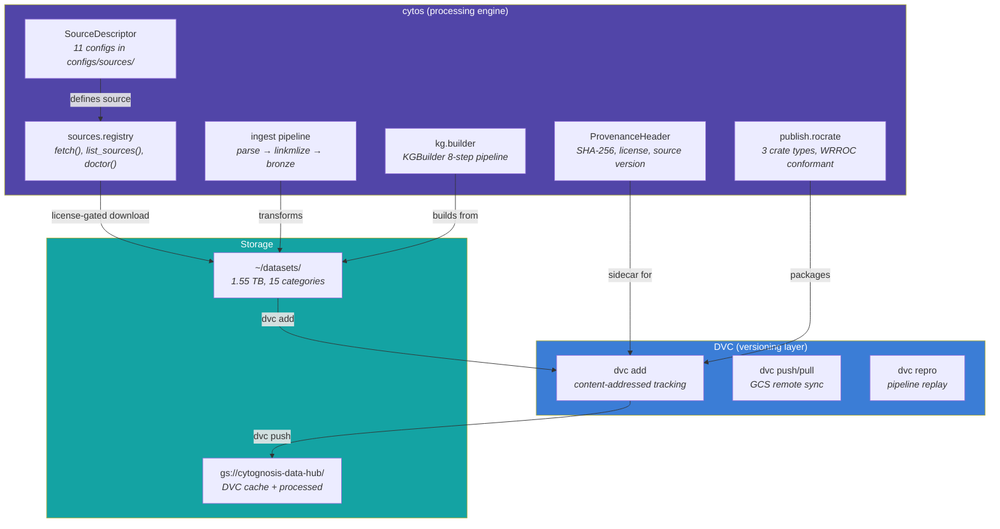

# Data Lifecycle Architecture

> **Status**: DRAFT — Needs review before implementation
> **Date**: 2026-05-26
> **Variants**: Technical (this doc) - Readable (data-lifecycle-architecture.md in Obsidian vault: 04-Engineering/cytos/) - Agent (n/a)

---

## Core Principle: Local-First, Git-Like

Data follows the same commit/push model as code:

```
Local work (untracked) → Stage → Commit (local DVC) → Push (GCS remote)
                                 ↑                      ↑
                           permanent ID assigned    released for others
```

All processing between commits is tracked locally. You explicitly choose when to release.

---

## Three Data Tiers

### Tier 1: Untracked (Dev/Test/Scratch)

**What**: Data used only for development, debugging, testing. Throwaway.

**Rules**:
- Lives anywhere in `~/datasets/` physically, but is NOT `dvc add`-ed
- No metadata, no provenance, no remote sync
- Can be deleted without consequence
- Useful for: exploring a new dataset, testing a parser, quick experiments

**Mechanism**: Just files on disk. `.dvcignore` or `.gitignore` can exclude specific paths if needed, but by default anything not explicitly staged is untracked.

**Examples**: A quick download of a paper's supplementary CSV to check format. A subset of UMLS for testing a parser. Toy data for unit tests.

---

### Tier 2: Tracked (Staged + Committed)

**What**: Data explicitly marked for versioning. Has metadata, permanent IDs, provenance. This is the "source of truth" for a dataset.

**Two sub-states**:

#### 2a. Staged (metadata created, not yet pushed)

When you say "track this dataset", the system:

1. **Creates or validates a `SourceDescriptor`** at [configs/sources/\<id\>.yaml](file:///home/mohammadi/repos/cytognosis/cytos/configs/sources/)
   - Download URL, license, version, format, contacts
   - This is the canonical metadata schema — already 11 configs exist
2. **Computes content hash** (SHA-256)
3. **Generates `ProvenanceHeader` sidecar** (`.provenance.yaml` next to the data)
   - Source, version, retrieval date, license class, SHA-256, transform commit
4. **Runs `dvc add <path>`** → creates `.dvc` pointer file
5. **Assigns permanent ID**: The DVC content hash (MD5 of file/dir) + SHA-256 in provenance sidecar

At this point the data is **locally committed** — it has an identity, metadata, and is version-controlled. But it hasn't been pushed to GCS.

#### 2b. Released (pushed to remote)

When you're ready:

1. **`dvc push`** → data goes to `gs://cytognosis-data-hub/dvc-cache/`
2. **`git commit` + `git push`** → `.dvc` file + provenance sidecar go to GitHub
3. Data is now available to any machine that can `dvc pull`

**This is like `git push` for data.**

---

### Tier 3: Production Pipeline Outputs

**What**: Derived data produced by processing Tier 2 data. Every transformation is provenance-tracked.

**Mechanism**: `dvc.yaml` pipeline stages in the cytos repo. Each stage declares:
- `deps`: input files (Tier 2 data or other stage outputs)
- `cmd`: the processing command
- `outs`: output files

DVC automatically tracks the dependency graph. `dvc repro` replays only changed stages.

**The git analogy extends**:
- Processing happens locally → outputs cached in local DVC cache
- `dvc push` → releases outputs to GCS
- `dvc pull` on another machine → restores exact outputs
- `dvc diff` → shows what changed between commits

---

## How It Maps to Existing Tools

### What Already Exists



### Tool → Lifecycle Stage Mapping

| Lifecycle Stage | Tool | What It Does |
|---|---|---|
| **Fetch raw data** | `cytos sources fetch <id>` | License-gated download from canonical URL per `SourceDescriptor` |
| **Create metadata** | `SourceDescriptor` YAML | Captures source URL, license, version, format, contacts |
| **Compute identity** | `ProvenanceHeader` sidecar | SHA-256 hash, retrieval date, license class, agent |
| **Version locally** | `dvc add <path>` | Content-addressed pointer file (`.dvc`), local cache |
| **Release to remote** | `dvc push` + `git push` | Data → GCS, metadata → GitHub |
| **Process** | `cytos ingest parse/linkmlize` | Parse raw → LinkML-conformant artifacts |
| **Build KG** | `cytos kg build` / `dvc repro` | Assemble knowledge graph from processed sources |
| **Validate** | `cytos validate` | Schema + range + referential + semantic checks |
| **Harmonize** | `cytos harmonize` | Cross-source identifier alignment (SSSOM) |
| **Package for publication** | `cytos publish rocrate` | WRROC-compliant RO-Crate with full provenance |
| **Mint DOI** | `cytos publish zenodo` | Deposit RO-Crate → Zenodo DOI |

---

## Concrete Workflow Examples

### Example 1: Track UMLS (data already downloaded)

UMLS parquets already exist at `~/datasets/02-vocabularies/UMLS/parquet/2026AA/` with 56 provenance sidecars.

```bash
# 1. SourceDescriptor already exists
cat configs/sources/umls.yaml  # ✅ has download URL, license, version

# 2. ProvenanceHeader sidecars already exist (56 of them)
ls ~/datasets/02-vocabularies/UMLS/parquet/2026AA/*.provenance.yaml

# 3. Stage for DVC tracking (you explicitly ask for this)
cd ~/datasets
dvc add 02-vocabularies/UMLS/parquet/2026AA/

# 4. Commit locally
git add 02-vocabularies/UMLS/parquet/2026AA.dvc .gitignore
git commit -m "data: track UMLS 2026AA parquets"

# 5. Release when ready
dvc push    # 60 parquets → GCS
git push    # .dvc pointer → GitHub
```

### Example 2: Fresh download for production (e.g., Open Targets)

```bash
# 1. SourceDescriptor exists
cat configs/sources/opentargets.yaml

# 2. Fetch from canonical source (license-gated)
cytos sources fetch opentargets
# → downloads to ~/datasets/03-knowledge-graphs/open-targets/
# → generates ProvenanceHeader sidecar automatically

# 3. Stage
cd ~/datasets
dvc add 03-knowledge-graphs/open-targets/

# 4. Commit locally
git add 03-knowledge-graphs/open-targets.dvc .gitignore
git commit -m "data: track Open Targets 26.03"

# 5. Process (tracked by dvc.yaml pipeline)
cd ~/repos/cytognosis/cytos
dvc repro stages/opentargets   # runs ingest → linkmlize → kg-merge

# 6. Release everything
cd ~/datasets && dvc push && git push
cd ~/repos/cytognosis/cytos && dvc push && git push
```

### Example 3: Dev/test use only

```bash
# Just download and use — NO tracking
wget https://example.com/test-data.csv -O ~/datasets/11-benchmarks/scratch/test.csv
# Use in notebook, delete when done
# Nothing to commit, nothing to push
```

---

## Where Things Live

### Single Data Lake: `~/datasets/`

This is the ONE location for all data. It's a git+DVC repo.

```
~/datasets/                          ← git + DVC repo
├── .dvc/config                      ← remote: gs://cytognosis-data-hub/dvc-cache/
├── .dvcignore                       ← exclude scratch/temp from DVC
├── 00-archive/          (2.8 GB)    ← old/superseded data (mostly untracked)
├── 01-ontologies/       (85 GB)     ← OWL/OBO files
├── 02-vocabularies/     (77 GB)     ← UMLS, SnomedCT, LOINC, MeSH
├── 03-knowledge-graphs/ (440 GB)    ← Monarch, PrimeKG, Open Targets, etc.
├── 04-identifiers/      (178 GB)    ← SSSOM mappings, bioregistry
├── 05-annotations/      (12 GB)     ← topic areas, NER corpora
├── 06-genotype/         (105 GB)    ← VCF, GWAS, PGC
├── 07-single-cell/      (75 GB)     ← h5ad, SOMA stores
├── 08-neuroimaging/     (319 GB)    ← NIfTI, BIDS
├── 09-literature/       (tiny)      ← paper metadata
├── 10-embeddings/       (34 GB)     ← vector stores
├── 11-benchmarks/       (23 GB)     ← evaluation datasets
├── 12-network/          (200 GB)    ← PPI, STRING, STITCH
├── 13-cell-lines/       (tiny)      ← cell line metadata
├── 14-cohort-metadata/  (tiny)      ← NBB, PEC manifests
└── sensors/             (3.5 GB)    ← T1D-UOM sensor data
```

**What gets DVC-tracked**: Only what you explicitly `dvc add`. Everything else is just local files.

### Processing Engine: `~/repos/cytognosis/cytos/`

This is a CODE repo. It should NOT store data long-term.

**Current problem**: `cytos/data/` has KG outputs (nodes.tsv, edges.tsv), GWAS data, SurrealDB files, and 40+ `.dvc` files including HRA-KG third-party assets. This mixes data and code.

**Proposed resolution**:

| What | Current Location | Proposed Location |
|---|---|---|
| KG build outputs (nodes.tsv, edges.tsv) | `cytos/data/kg/` | `~/datasets/03-knowledge-graphs/cytos-kg/` |
| GWAS processed data | `cytos/data/gwas/` | `~/datasets/06-genotype/gwas/` |
| HRA-KG third-party assets | `cytos/third_party/hra-kg/` | `~/datasets/05-annotations/hra-kg/` |
| Pipeline definitions (dvc.yaml) | `cytos/dvc.yaml` | **stays** — this is code |
| Source configs | `cytos/configs/sources/*.yaml` | **stays** — this is metadata schema |
| Processing scripts | `cytos/scripts/` | **stays** — this is code |

The `dvc.yaml` in cytos would reference `~/datasets/` paths via DVC params for inputs and outputs.

### Remote Storage: `gs://cytognosis-data-hub/`

```
gs://cytognosis-data-hub/
├── dvc-cache/           ← content-addressed DVC cache (all pushed data)
└── manifests/           ← (optional) catalog snapshots
```

DVC cache is content-addressed (files stored by MD5 hash). No directory structure needed — DVC handles the mapping between `.dvc` pointer files and cache entries.

---

## What About `cytognosis/datasets` GitHub Repo?

**Current state**: I created this repo to hold the `.dvc` files and git metadata for `~/datasets/`. This is where the pointer files, `.gitignore` updates from `dvc add`, and the `.dvc/config` live.

**Question for you**: Is this the right place, or should this tracking metadata go elsewhere (e.g., infrastructure repo)?

**Arguments for keeping it separate**:
- `~/datasets/` has its own lifecycle independent of infrastructure config
- Git history tracks exactly which data was tracked/released and when
- DVC requires a git repo to function — it stores `.dvc` files in git

**Arguments against**:
- Another repo to maintain
- Catalog/data-strategy docs are in the infrastructure repo

> [!IMPORTANT]
> **Decision needed**: Keep `cytognosis/datasets` as the DVC tracking repo, or merge into infrastructure?

---

## The `SourceDescriptor` IS the Catalog

You are correct that `configs/sources/*.yaml` in cytos is the canonical dataset registry. These files follow the `SourceDescriptor` Pydantic schema with fields for:

- `id`, `name`, `homepage` — identity
- `license`, `license_class` — access control
- `version_policy.current` — current version
- `download.uris`, `download.format` — where to get it (this IS `download-sources.yaml`)
- `ingest.parser`, `ingest.linkml_target_class` — how to process it
- `kg.framework`, `kg.adapter_path` — KG integration
- `update_cadence`, `contacts`, `notes` — operational metadata

**11 sources already defined**: biolink, biothings_mygene, cellxgene, ga4gh_vrs, monarch_kg, nwb_core, openalex, opentargets, snomed_ct, sosa_ssn, umls

**What might be missing from `SourceDescriptor`** (check if these need adding):

| Field | Purpose | Currently in Schema? |
|---|---|---|
| `local_path` | Where data lives on disk | ✅ Yes |
| `size_bytes` / `size_gb` | Expected size | ❌ Only in `DownloadSpec.expected_size_bytes` |
| `ingestion_status` | raw → parsed → harmonized → kg-integrated → validated | ❌ No |
| `dvc_tracked` | Whether this source is DVC-tracked | ❌ No |
| `access_tier` | T1-T4 unified tier | Maps to `license_class` (open/attribution/controlled/restricted) |
| `provenance_coverage` | % of files with provenance sidecars | ❌ No |
| `wave` | Which ingestion wave this belongs to | ❌ No |

> [!IMPORTANT]
> **Decision needed**: Should we add `ingestion_status`, `dvc_tracked`, `provenance_coverage`, and `wave` fields to `SourceDescriptor`? Or keep them in a separate operational tracker?

---

## Provenance Chain

Every piece of tracked data has a provenance chain:

```
SourceDescriptor (where it came from)
  → ProvenanceHeader (SHA-256, retrieval date, license)
    → DVC pointer (.dvc file with content hash)
      → Processing logs (dvc.yaml stage with deps/cmd/outs)
        → RO-Crate (WRROC package for publication)
```

### Local vs Remote Provenance

| State | What's Tracked | Where |
|---|---|---|
| **Local uncommitted** | Nothing — Tier 1 dev data | Just files on disk |
| **Local committed** | `.dvc` file + provenance sidecar | Local git + local DVC cache |
| **Remote released** | Same + data blob | GitHub (git) + GCS (DVC cache) |
| **Published** | RO-Crate with DOI | Zenodo / WorkflowHub |

---

## Open Questions

1. **`cytognosis/datasets` repo**: Keep or merge into infrastructure?

2. **`cytos/data/` cleanup**: Move KG outputs, GWAS, HRA-KG to `~/datasets/`? This is a significant refactor of `dvc.yaml` pipeline paths.

3. **Container strategy**: Podman (already available, rootless, preferred by stack_manager) vs Docker (also available) vs Toolbx (not installed). Containerfiles should live in the infrastructure repo under `container_framework/`. Should we standardize on Podman?

4. **sys-\* projects**: Delete all of them? They're Google-managed system projects for Apps Script triggers. The forms still work regardless.

5. **`catalog.yaml` in infra repo**: Delete it? It's a redundant copy of what `configs/sources/*.yaml` already captures via `SourceDescriptor`. Or keep as a human-readable summary?
