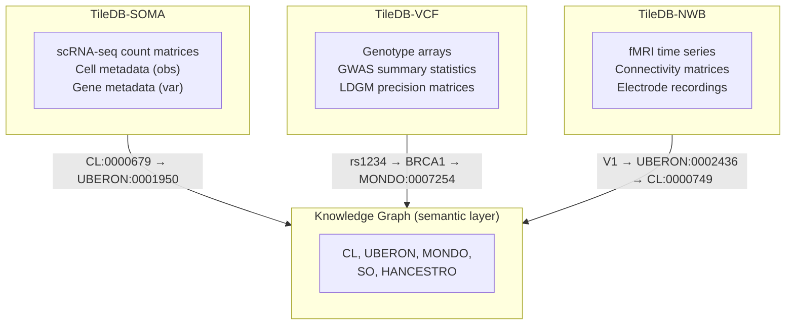

# Specialized Data Stores

> **Status**: Active
> **Date**: 2026-07-10
> **Author**: @shahin
> **Audience**: engineers
> **Tags**: `engineering`
> **Variants**: Technical (this doc) - Readable (data-stores.md in Obsidian vault: 04-Engineering/cytos/) - Agent (n/a)

> v1.0 | Last updated: 2026-05-26

Cytos uses three specialized data stores for measurement data. These stores handle high-volume, modality-specific data. The Knowledge Graph stores only the *meaning* of measurements (ontology terms, cell types, tissues), while raw counts, genotypes, and signals live here.

## Architecture



## Module Pattern

Each store follows a consistent module structure:

```
cytos/db/<store>/
├── __init__.py
├── store.py       # Collection/dataset management
├── ingest.py      # Format conversion (H5AD → SOMA, VCF → TileDB, etc.)
├── query.py       # Domain-specific queries
└── harmonize.py   # Map native identifiers to KG ontology CURIEs
```

## 1. TileDB-SOMA (Single-Cell)

**Purpose**: Store and query scRNA-seq count matrices, cell metadata, and gene annotations in a cloud-native columnar format.

**Input**: H5AD files (AnnData), CellxGene Census

**Install**: `uv pip install 'cytos[genomics]'`

### Key Concepts

| Concept | Description |
|---------|-------------|
| **Experiment** | Top-level container (one per dataset) |
| **obs** | Cell/observation metadata (cell_type, tissue, donor) |
| **var** | Gene/variable metadata (gene_id, gene_name) |
| **X** | Sparse count matrix (cells × genes) |

### Usage

```python
import tiledbsoma

# Open a SOMA experiment
exp = tiledbsoma.Experiment.open("data/soma/hbca_neuronal")

# Query cell metadata
obs = exp.obs.read(
    column_names=["cell_type", "tissue", "donor_id"],
    value_filter="cell_type == 'L2/3 IT'"
).concat().to_pandas()

# Read expression for specific genes
var_filter = "gene_name in ['SNAP25', 'SYN1', 'MAP2']"
X = exp.ms["RNA"].X["raw"].read(
    coords=(obs.index.tolist(), None),
).concat().to_scipy()
```

### Ingestion (H5AD → SOMA)

```python
from cytos.db.soma.ingest import h5ad_to_soma

h5ad_to_soma(
    input_path="data/raw/hbca_neuronal.h5ad",
    output_uri="data/soma/hbca_neuronal",
    measurement_name="RNA",
)
```

### Harmonization

```python
from cytos.db.soma.harmonize import harmonize_soma_obs

# Map cell_type strings to Cell Ontology CURIEs
harmonized = harmonize_soma_obs(
    obs_df=obs,
    cell_type_col="cell_type",
    tissue_col="tissue",
    kg_store=store,  # KGStore instance
)
# Result: obs with added 'cell_type_curie' and 'tissue_curie' columns
```

### Test Dataset

| Dataset | Source | Size | Description |
|---------|--------|------|-------------|
| Human Brain Cell Atlas v1.0 (neuronal) | CellxGene 283d65eb | ~286 MB | Neuronal subtypes |

## 2. TileDB-VCF (Genomics)

**Purpose**: Store and query variant genotypes from VCF/BCF files with region-based access, plus GWAS summary statistics and LDGM precision matrices.

**Input**: VCF, BCF, GWAS-SSF Parquet, graphLD edgelists

**Install**: `uv pip install 'cytos[vcf]'`

### Key Concepts

| Concept | Description |
|---------|-------------|
| **Dataset** | Collection of samples with shared reference |
| **Sample** | One individual's genotype calls |
| **Region query** | Fast access by genomic coordinates (chr:start-end) |
| **VRS Allele ID** | GA4GH Variant Representation Standard identifier |

### VCF Usage

```python
from cytos.genomics.vcf import open_vcf_store

# Open or create a TileDB-VCF dataset
ds = open_vcf_store("data/tiledb_vcf/wgs")

# Ingest a VCF
ds.ingest_samples(["data/raw/sample1.vcf.gz"])

# Query by region
variants = ds.query(
    regions=["chr17:43044295-43125364"],  # BRCA1 locus
    samples=["sample1"],
)
```

### GWAS Loader

```python
from cytos.genomics.gwas import load_gwas_ssf, filter_genome_wide_sig, gwas_to_neo4j

# Load GWAS summary statistics (auto-detects format)
df = load_gwas_ssf("data/raw/PGC_SCZ3.gwas.tsv.gz")

# Filter to genome-wide significant
sig = filter_genome_wide_sig(df, threshold=5e-8)

# Write to Neo4j
gwas_to_neo4j(sig, trait="schizophrenia", source="PGC_SCZ3")
```

### LDGM Precision Matrices

```python
from cytos.genomics.graphld.interface import (
    load_block_precision,
    align_block_sumstats,
    run_graphreml,
)

# Load a precision matrix block
omega = load_block_precision(block_id=42)

# Align GWAS sumstats to block
z_aligned = align_block_sumstats(sumstats_df, block_id=42)

# Estimate heritability
h2 = run_graphreml(z_aligned, omega)
```

### Test Dataset

| Dataset | Source | Size | Description |
|---------|--------|------|-------------|
| Pan-UKBB GWAS summary stats | Broad Institute | ~26 GB | 7,221 phenotypes |

## 3. TileDB-NWB (Neuroimaging)

**Purpose**: Store and query neuroimaging data in NWB (Neurodata Without Borders) format, including fMRI time series, connectivity matrices, and electrode recordings.

**Input**: NWB files, BIDS datasets

**Install**: `uv pip install 'cytos[genomics]'` (uses HDMF + TileDB)

### Key Concepts

| Concept | Description |
|---------|-------------|
| **NWBFile** | Top-level container for one session |
| **Acquisition** | Raw data (electrode recordings, imaging) |
| **Processing** | Derived data (filtered signals, connectivity) |
| **Epochs/Trials** | Temporal segmentation of experiments |

### Usage

```python
from cytos.db.neuro_store.query import query_brain_region

# Query data for a specific brain region
data = query_brain_region(
    region="V1",
    modality="fmri",
    dataset="transdiagnostic_connectome",
)
```

### Harmonization

```python
from cytos.db.neuro_store.harmonize import map_brain_regions_to_kg

# Map electrode locations to KG ontology CURIEs
mapped = map_brain_regions_to_kg(
    regions=["V1", "hippocampus", "prefrontal cortex"],
    kg_store=store,
)
# Result: {"V1": "UBERON:0002436", "hippocampus": "UBERON:0002421", ...}
```

### Test Dataset

| Dataset | Source | Size | Description |
|---------|--------|------|-------------|
| Transdiagnostic Connectome Project | OpenNeuro ds005237 | Download needed | Multi-disorder connectivity |

## Cross-Store Queries

The KG acts as the bridge between stores. A typical cross-modal query:

```python
# 1. Find genes associated with schizophrenia in the KG
scz_genes = store.get_edges(
    predicate="biolink:gene_associated_with_condition",
    object_="MONDO:0005090",
)

# 2. Check expression in specific brain cell types (SOMA)
gene_ids = [g["subject"] for g in scz_genes]
expression = soma_query(genes=gene_ids, cell_type="CL:0000540")

# 3. Check variant effects (VCF)
variants = vcf_query(genes=gene_ids, maf_threshold=0.01)

# 4. Check brain connectivity (NWB)
connectivity = nwb_query(region="UBERON:0001870", modality="fmri")
```

## Related Documentation

- [Architecture Overview](architecture.md)
- [KGStore API Reference](kgstore-api.md)
- [Brain Atlas Guide](brain-atlas.md)
- [Genomic Atlas Guide](genomic-atlas.md)
