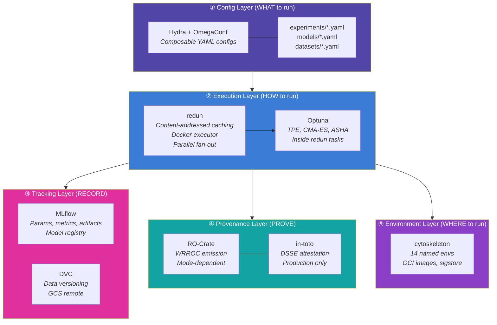

# Experiment Management Architecture: Analysis & Recommendation

> **Status**: DRAFT — Awaiting your review
> **Date**: 2026-05-26
> **Variants**: Technical (this doc) - Readable (experiment-management-architecture.md in Obsidian vault: 04-Engineering/cytos/) - Agent (n/a)

---

## 1. What We Already Have

Before recommending anything new, here's what actually exists in the codebase:

| Layer | Tool | Status | Location |
|---|---|---|---|
| **Pipeline DAG** | Kedro | ❌ **Previously rejected** (redundant with redun + LaminDB) | [pipeline_registry.py](file:///home/mohammadi/repos/cytognosis/cytos/src/cytos/pipeline_registry.py) — stubs remain |
| **Data pipeline** | DVC | ✅ Working | [dvc.yaml](file:///home/mohammadi/repos/cytognosis/cytos/dvc.yaml) — 10+ stages |
| **RO-Crate bridge** | redun → WRROC | ✅ MVP (124 LOC) | [redun_rocrate.py](file:///home/mohammadi/repos/cytognosis/cytos/src/cytos/publish/redun_rocrate.py) |
| **Provenance design** | 4-tool stack | ✅ Designed (466 lines) | [provenance-lineage.md](../infrastructure/reproducibility/provenance-lineage.md) |
| **Environment matrix** | cytoskeleton | ✅ Designed (66 cells) | [envs-containers.md](../infrastructure/reproducibility/envs-containers.md) |
| **Experiment tracking** | MLflow | ✅ Deployed | cytohost |
| **Data versioning** | DVC | ✅ Working | `~/datasets/.dvc/config` → GCS |

> [!IMPORTANT]
> **Kedro was rejected** in a prior evaluation (conversation `30e4c8ce`) as "redundant with redun + LaminDB + copier." The existing Kedro pipeline stubs in cytos should be removed or migrated to redun tasks. The provenance-lineage.md doc already commits to redun as the primary workflow engine.

---

## 2. The Gap You Identified

You asked: "What is our actual everyday experiment description/execution engine?"

We have data versioning and provenance packaging. We do NOT have:

| Capability | What It Means | Currently? |
|---|---|---|
| **Experiment description** | "Run models A, B, C with these hyperparameters over datasets X, Y" | ❌ Nothing |
| **HPO** | Automated search over hyperparameter space per model×dataset | ❌ Nothing |
| **Multi-run orchestration** | Fan-out a config grid, parallelize, collect results | ❌ Nothing |
| **Selective provenance** | Dev runs = no tracking; prod runs = full WRROC + attestation | ❌ No mode switch |
| **Experiment comparison** | Structured comparison across grid cells | ❌ Nothing |

---

## 3. Tool Landscape (Research Findings)

Eight tools were evaluated for the specific scenario: *"2-3 models, each HPO-optimized, over multiple datasets, each with its own preprocessing flow, selective provenance."*

### Comparison Matrix

| Tool | Grid Def | HPO | Env Mgmt | Provenance | MLflow | Team Fit | Verdict |
|---|:---:|:---:|:---:|:---:|:---:|:---:|---|
| **redun** | ✅ Native fan-out | ⚠️ Via Optuna | ✅ Docker exec | ✅✅ AST+data hash | ✅ | ✅ Committed | **Use — orchestration** |
| **Hydra+Optuna** | ✅ Config multirun | ✅✅ Native | ❌ Manual | ⚠️ Config only | ✅ | ✅ Lightweight | **Use — config + HPO** |
| **DVC exp** | ✅ Queue+grid | ⚠️ Via Optuna | ❌ Manual | ✅ Git-based | ✅ DVCLive | ✅ Committed | **Use — quick sweeps** |
| **Ray Tune** | ✅ Distributed | ✅✅✅ Best | ⚠️ Ray cluster | ⚠️ Via MLflow | ✅ | ⚠️ Overkill | **Defer** — add when scaling |
| **Nextflow** | ✅ Channels | ❌ Awkward | ✅✅ Container | ✅✅ RO-Crate | ⚠️ | ⚠️ Groovy DSL | **Keep for genomics only** |
| **Snakemake** | ✅ Wildcards | ❌ Manual | ✅ Per-rule Conda | ✅ Reports | ⚠️ | ⚠️ Academic | **Skip** |
| **Kedro** | ⚠️ Namespacing | ❌ None | ❌ Manual | ❌ None | ✅ Plugin | ❌ Rejected | **Remove stubs** |
| **Guild AI** | ✅ CLI flags | ✅ Built-in | ❌ Manual | ⚠️ Local | ❌ | ❌❌ Abandoned | **Never use** |

### How Comparable Organizations Solve This

| Organization | Workflow | HPO | Tracking | Data | Env |
|---|---|---|---|---|---|
| **insitro** | redun | Optuna/Ray | W&B | S3 | Docker |
| **Broad / Terra** | WDL + Cromwell | Manual | FireCloud | TDR | Docker |
| **Allen Institute** | Nextflow + AICS pipeline | Optuna | LIMS | S3 | Docker |
| **Recursion** | Prefect/Dagster | Optuna | MLflow | S3 | Docker |
| **DeepMind** | XManager | Built-in | TensorBoard | TFDS | Borg |
| **Open Targets** | Nextflow + Spark | N/A | Custom | GCS | Docker |
| **CZ Biohub** | Nextflow | N/A | Custom | S3 | Docker |

**Pattern**: Every serious biomedical AI org uses a workflow engine (redun/Nextflow/WDL) + a separate HPO layer (Optuna/Ray) + a tracking system (MLflow/W&B) + container-native execution. Nobody uses a single monolithic tool for everything.

---

## 4. Recommended Stack



### Why This Combination

- **Hydra** = lightweight config composition. Defines experiments declaratively. Does NOT manage execution. Complements redun.
- **redun** = the execution engine. Content-addressed caching (hashes Python ASTs AND data). Docker-native. Parallel fan-out. Already committed in our architecture docs.
- **Optuna** = HPO inside redun tasks. Pluggable samplers, pruning, MLflow integration. Simple API.
- **MLflow** = already deployed. Records all trials. Model registry for graduated models.
- **DVC** = already working. Versions data. GCS remote. `dvc exp` for quick ad-hoc sweeps.
- **RO-Crate** = already have the bridge. Mode switch controls emission.

### What Gets Dropped

- **Kedro**: Remove stubs from cytos. Redundant with redun.
- **Guild AI**: Dead project, never use.
- **Ray Tune**: Defer. Add only when scaling to multi-node GPU clusters.
- **Snakemake**: Skip. Nextflow covers bioinformatics workflows.

---

## 5. Selective Provenance: Three Modes

This addresses your core question about tracked vs untracked experiments.

```yaml
# experiments/modes.yaml — built into every experiment config
modes:
  dev:
    description: "Fast iteration. No overhead. Throwaway."
    redun_cache: disabled        # no caching, fresh every time
    mlflow: disabled             # no tracking
    rocrate: disabled            # no provenance packaging
    dvc_push: never              # nothing goes to GCS
    container: optional          # can run in local env
    use_case: "Testing a parser, debugging model code, quick sanity checks"

  tracked:
    description: "Serious experiments. Local provenance. Git-like 'commit'."
    redun_cache: content_addressed  # full AST+data hash caching
    mlflow: enabled                 # log params, metrics, artifacts
    rocrate: process_run_crate      # lightweight crate, no attestation
    dvc_push: on_request            # push when YOU decide
    container: recommended          # should use cytoskeleton env
    use_case: "HPO sweeps, model comparisons, result tables for papers"

  production:
    description: "Release quality. Full provenance. Git-like 'push'."
    redun_cache: content_addressed
    mlflow: enabled
    rocrate: workflow_run_crate     # full WRROC + in-toto attestation
    dvc_push: automatic             # push outputs immediately
    container: required             # MUST use signed OCI image
    attestation: dsse_signed        # SLSA L3 attestation chain
    use_case: "Published results, benchmark submissions, DOI-minted releases"
```

**Usage**:
```bash
# Quick test — no overhead
cytos experiment run experiments/neuro-pilot.yaml --mode dev

# Real experiment — tracking, caching, but local
cytos experiment run experiments/neuro-pilot.yaml --mode tracked

# Publication-ready — full provenance, remote push
cytos experiment run experiments/neuro-pilot.yaml --mode production
```

**The git analogy is exact**:
| Git | Data (DVC) | Experiments |
|---|---|---|
| Untracked files | Tier 1 (dev data) | `--mode dev` |
| `git add` + `git commit` | `dvc add` + local cache | `--mode tracked` |
| `git push` | `dvc push` to GCS | `--mode production` |

---

## 6. Your Specific Scenario: Concrete Implementation

> "Run 2-3 models, each hyper-param optimized, over multiple datasets, each with its own preprocessing flow."

### Step 1: Define Experiment Config (Hydra)

```yaml
# cytos/experiments/neuro-pilot-v1.yaml
defaults:
  - /models: [gnn_linkpred, transformer_embed, linear_baseline]
  - /datasets: [nbb_cohort, pec_cohort]

experiment:
  name: neuro-pilot-v1
  mode: tracked
  description: "Compare 3 architectures on NBB + PEC cohorts"
  objective: val_mrr
  direction: maximize
```

```yaml
# cytos/experiments/models/gnn_linkpred.yaml
model:
  class: cytos.models.GNNLinkPredictor
  env: cytognosis-genomics        # cytoskeleton named env → OCI digest
  hpo:
    n_trials: 50
    sampler: tpe
    search_space:
      lr: {type: log_uniform, low: 1e-5, high: 1e-2}
      hidden_dim: {type: categorical, choices: [64, 128, 256]}
      num_layers: {type: int, low: 2, high: 6}
      dropout: {type: uniform, low: 0.0, high: 0.5}
```

```yaml
# cytos/experiments/datasets/nbb_cohort.yaml
dataset:
  name: nbb-cohort
  source: ~/datasets/14-cohort-metadata/nbb/
  preprocessing:
    steps:
      - name: extract_phenotypes
        task: cytos.ingest.parse
        params: {source_id: nbb}
      - name: harmonize_ids
        task: cytos.harmonize.align
        params: {target_namespace: HP}
      - name: build_subgraph
        task: cytos.kg.extract_subgraph
        params: {seed_nodes_from: phenotypes}
```

### Step 2: Execution (redun)

```python
# cytos/src/cytos/experiment/runner.py
from redun import task, File, Scheduler
from optuna import create_study
import mlflow

@task(cache=True)  # content-addressed: same data+code = cache hit
def preprocess_dataset(dataset_config: dict) -> File:
    """Run dataset-specific preprocessing pipeline."""
    for step in dataset_config["preprocessing"]["steps"]:
        # Each step is a redun task — cached independently
        run_step(step["task"], step["params"])
    return File(f"data/processed/{dataset_config['name']}/")

@task(cache=True)
def run_hpo(model_config: dict, dataset: File, mode: str) -> dict:
    """Run Optuna HPO for one model×dataset cell."""
    study = create_study(
        direction=model_config["hpo"].get("direction", "maximize"),
        sampler=get_sampler(model_config["hpo"]["sampler"]),
    )

    def objective(trial):
        hparams = sample_hparams(trial, model_config["hpo"]["search_space"])
        with mlflow.start_run(nested=True) if mode != "dev" else nullcontext():
            metrics = train_and_evaluate(model_config, dataset, hparams)
            if mode != "dev":
                mlflow.log_params(hparams)
                mlflow.log_metrics(metrics)
            return metrics["val_mrr"]

    study.optimize(objective, n_trials=model_config["hpo"]["n_trials"])
    return {"best_params": study.best_params, "best_value": study.best_value}

@task
def run_experiment(experiment_config: dict) -> dict:
    """Top-level: expand grid, fan-out, collect."""
    mode = experiment_config["experiment"]["mode"]
    models = experiment_config["models"]
    datasets = experiment_config["datasets"]

    # Fan-out: all preprocessing runs in parallel (cached)
    processed = {
        ds["name"]: preprocess_dataset(ds)
        for ds in datasets
    }

    # Fan-out: all model×dataset HPO runs in parallel
    results = {}
    for model in models:
        for ds_name, ds_file in processed.items():
            key = f"{model['class']}×{ds_name}"
            results[key] = run_hpo(model, ds_file, mode)

    # Collect and compare
    return compare_results(results)
```

### Step 3: What redun's Caching Gives You

```
Scenario: You change GNN code, rerun the experiment.

✅ preprocess_nbb_cohort  → CACHE HIT (data unchanged)
✅ preprocess_pec_cohort  → CACHE HIT (data unchanged)
🔄 hpo_gnn × nbb         → RE-RUNS (code changed, AST hash differs)
🔄 hpo_gnn × pec         → RE-RUNS
✅ hpo_transformer × nbb  → CACHE HIT (code+data unchanged)
✅ hpo_transformer × pec  → CACHE HIT
✅ hpo_linear × nbb       → CACHE HIT
✅ hpo_linear × pec       → CACHE HIT
🔄 compare_results        → RE-RUNS (input changed)
```

This is the killer feature of redun over every other tool. No other workflow engine hashes Python ASTs.

---

## 7. RO-Crate: Not Just Post-Hoc

The [provenance-lineage.md](../infrastructure/reproducibility/provenance-lineage.md) design already makes RO-Crate a **per-run emission**, not post-hoc packaging. The `CytognosisExecutor` emits a crate as step 5 of every task execution:

```
1. Resolve inputs via VFS, verify hashes
2. Pull signed container image
3. Execute in container
4. Hash outputs
5. Emit Workflow Run Crate ← happens DURING execution
6. Attestation (DSSE envelope)
7. Log to LaminDB + MLflow
```

The mode switch controls steps 5-7:
- `dev` → skip 5, 6, 7
- `tracked` → emit lightweight Process Run Crate (step 5), skip 6, do 7
- `production` → full WRROC (step 5), DSSE attestation (step 6), do 7

Nextflow's `nf-prov` plugin does the same thing — emitting WRROC per run, not post-hoc. This is the ELIXIR/WorkflowHub community best practice.

---

## 8. DVC Experiments as Quick-Sweep Layer

For quick ad-hoc sweeps that don't need the full redun orchestration:

```bash
# Quick sweep without the overhead of experiment configs
dvc exp run --queue \
  -S model.lr=0.001,0.0001 \
  -S model.hidden_dim=64,128 \
  -S data.source=nbb

dvc exp run --run-all --parallel 4

# Compare results
dvc exp show --sort-by metrics.val_mrr --sort-order desc
```

This complements redun for the case where you just want to tweak a few params and see what happens, without writing a full experiment config. Think of it as the "scratch paper" equivalent.

---

## 9. What Needs Building (Prioritized)

| # | Task | Effort | Dependencies | Why |
|---|---|---|---|---|
| 1 | **Install redun**, convert 2-3 DVC stages to `@task` | 2-3 days | None | Foundation for everything else |
| 2 | **Install Hydra + OmegaConf**, create config schema | 1-2 days | None | Parallel with #1 |
| 3 | **Install Optuna**, wire into redun task with MLflow | 1 day | #1 | HPO integration |
| 4 | **Implement mode switch** (dev/tracked/production) | 1 day | #1 | Selective provenance |
| 5 | **Create `cytos experiment run` CLI** | 1 day | #1, #2 | User-facing command |
| 6 | **Remove Kedro stubs** from cytos | 0.5 day | #1 | Cleanup |
| 7 | **Wire WRROC emission** to mode switch | 1 day | #1, #4 | Connect existing bridge |
| 8 | **Build first OCI images** from cytoskeleton envs | 2-3 days | None (parallel) | Container execution |

**Total**: ~10-12 days of focused work.

---

## 10. Open Questions

1. **Hydra scope**: Use Hydra only for experiment configs, or also replace `cytos/configs/` parameter management? Hydra's `ConfigStore` can merge with existing YAML configs.

2. **Optuna storage**: SQLite (local, zero setup) vs PostgreSQL (shared)? SQLite now, migrate when team grows.

3. **redun backend**: Local SQLite backend (default) vs PostgreSQL? Same answer — start local.

4. **DVC pipeline vs redun**: Do we keep `dvc.yaml` for the KG build pipeline, or migrate everything to redun? Recommendation: keep `dvc.yaml` for data-only pipelines (simple deps/outs), use redun for compute-heavy ML experiments. They coexist.

5. **Nextflow role**: Keep Nextflow specifically for genomics preprocessing (VCF processing, BIDS pipelines) that benefit from nf-core curated workflows. Do NOT use for ML training.

6. **Experiment config location**: `cytos/experiments/` (alongside code) or separate? Recommendation: `cytos/experiments/` — they're tightly coupled to model code.
