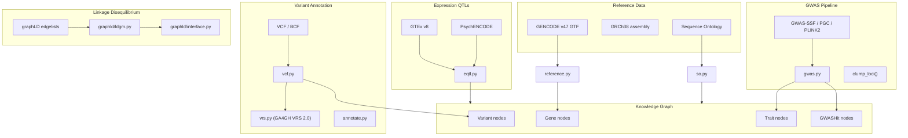

# Genomic Atlas Interface

> **Status**: Active
> **Date**: 2026-07-10
> **Author**: @shahin
> **Audience**: engineers
> **Tags**: `engineering`
> **Variants**: Technical (this doc) - Readable (genomic-atlas.md in Obsidian vault: 04-Engineering/cytos/) - Agent (n/a)

> v1.0 | Last updated: 2026-05-26

The genomic subsystem in Cytos handles gene queries, variant annotation, GWAS associations, eQTL lookups, linkage disequilibrium, and polygenic risk scores. All genomic data integrates with the Knowledge Graph via standard ontology CURIEs (HGNC, MONDO, SO, HANCESTRO).

## Module Overview



## 1. Gene Queries

### Reference Genome (`reference.py`)

Loads GRCh38 chromosome metadata and GENCODE gene annotations into the KG:

```python
from cytos.genomics.reference import (
    load_chromosome_table,
    parse_gencode_gtf,
    load_genes_to_neo4j,
)

# Load GRCh38 chromosome table
chroms = load_chromosome_table()
# DataFrame: chrom, length, centromere_start, centromere_end

# Parse GENCODE GTF for gene annotations
genes = parse_gencode_gtf("data/raw/gencode.v47.annotation.gtf.gz")
# DataFrame: gene_id, gene_name, chrom, start, end, strand, gene_type

# Load into Neo4j as Gene and Chromosome nodes
load_genes_to_neo4j(genes, chroms, driver=neo4j_driver)
```

### KG Gene Queries

```python
# Look up a gene by HGNC ID
gene = store.get_node("HGNC:1100")  # BRCA1
print(f"{gene.name}: {gene.description}")

# Find disease associations for a gene
diseases = store.get_edges(
    subject="HGNC:1100",
    predicate="biolink:gene_associated_with_condition",
)

# Find pathways for a gene
pathways = store.get_edges(
    subject="HGNC:1100",
    predicate="biolink:participates_in",
)

# Map between gene identifiers
ensembl_id = store.map_curie("HGNC:1100", target_prefix="ENSEMBL")
# Returns: "ENSEMBL:ENSG00000012048"
```

## 2. Variant Annotation

### VCF Handling (`vcf.py`)

```python
from cytos.genomics.vcf import (
    open_vcf_store,
    validate_tbx1_insertion,
    open_cram,
    fetch_reads,
)

# Create/open a TileDB-VCF dataset
ds = open_vcf_store("data/tiledb_vcf/wgs")
ds.ingest_samples(["data/raw/sample1.vcf.gz"])

# Query variants by region
variants = ds.query(
    regions=["chr22:19744227-19744228"],  # TBX1 region
    samples=["sample1"],
)

# Validate TBX1 insertion (founder's variant)
result = validate_tbx1_insertion(
    vcf_path="data/raw/sample1.vcf.gz",
    expected_region="chr22:19744227",
)
```

### VRS Identification (`vrs.py`)

GA4GH Variant Representation Standard (VRS 2.0) for globally unique allele IDs:

```python
from cytos.genomics.vrs import compute_vrs_id

# Compute VRS allele ID
vrs_id = compute_vrs_id(
    chrom="chr17",
    pos=43044295,
    ref="A",
    alt="T",
    assembly="GRCh38",
)
# Returns: "ga4gh:VA.abc123..."
```

### Variant Annotation (`annotate.py`)

```python
from cytos.genomics.annotate import annotate_variants

# Annotate variants with consequence predictions
annotated = annotate_variants(
    variants_df=variants,
    reference="GRCh38",
    include_regulatory=True,
)
```

## 3. GWAS Associations

### Loading GWAS Data (`gwas.py`)

Supports multiple GWAS formats with auto-detection:

| Format | Columns | Source |
|--------|---------|--------|
| GWAS-SSF 1.0 | chromosome, base_pair_location, effect_allele, ... | GA4GH standard |
| GWAS Catalog harmonized | hm_chrom, hm_pos, hm_effect_allele, ... | EBI GWAS Catalog |
| PGC minimal | CHR, BP, A1, A2, BETA, SE, P | Psychiatric Genomics Consortium |
| PLINK2 | #CHROM, POS, ID, REF, ALT, BETA, SE, P | PLINK2 output |

```python
from cytos.genomics.gwas import (
    load_gwas_ssf,
    load_plink2_assoc,
    filter_genome_wide_sig,
    clump_loci,
    gwas_to_neo4j,
    to_gwas_ssf_parquet,
)

# Load (auto-detects format)
df = load_gwas_ssf("data/raw/PGC_SCZ3.gwas.tsv.gz")

# Filter to genome-wide significant (p < 5e-8)
sig = filter_genome_wide_sig(df)

# Clump to independent loci (500kb window)
loci = clump_loci(sig, window_kb=500)

# Write to Neo4j
n_written = gwas_to_neo4j(sig, trait="schizophrenia", source="PGC_SCZ3")

# Export in standardized format
to_gwas_ssf_parquet(df, "output/SCZ3_gwas_ssf.parquet")
```

### Neo4j Schema

```
(Variant {rsid, chrom, pos})
    -[:ASSOCIATED_WITH {beta, se, pval, n, source}]->
(Trait {name: "schizophrenia"})
    -[:NEAR_GENE {distance}]->
(Gene {id: "HGNC:...", name, chrom, start, end})
```

## 4. eQTL Lookups

### eQTL Module (`eqtl.py`)

Loads expression QTL data from GTEx and PsychENCODE, linking variants to gene expression changes in specific tissues.

```python
from cytos.genomics.eqtl import (
    load_gtex_eqtls,
    load_pec_eqtls,
    eqtl_to_kg,
)

# Load GTEx cis-eQTLs for brain tissues
eqtls = load_gtex_eqtls(
    tissue="Brain_Hippocampus",
    pval_threshold=1e-5,
)

# Load PsychENCODE eQTLs
pec_eqtls = load_pec_eqtls(
    dataset="CMC",
    cell_type="excitatory_neurons",
)

# Bridge to KG
eqtl_to_kg(eqtls, tissue="UBERON:0002421", kg_store=store)
```

### KG Relationships

```
(Variant)-[:REGULATES {tissue, pval, beta, slope}]->(Gene)
```

## 5. Linkage Disequilibrium (graphLD)

### LDGM Precision Matrices

The graphLD module stores and queries LD precision matrices in TileDB sparse arrays:

```python
from cytos.genomics.graphld.ldgm import (
    ingest_edgelist,
    build_block_index,
)
from cytos.genomics.graphld.interface import (
    load_block_precision,
    align_block_sumstats,
    run_graphreml,
    compute_blup_scores,
)

# Ingest graphLD edgelist into TileDB sparse array
ingest_edgelist(
    edgelist_path="data/raw/ldgm/EUR_block42.edgelist",
    snplist_path="data/raw/ldgm/EUR_block42.snplist",
    output_uri="data/tiledb/ldgm/EUR_block42",
)

# Build DuckDB block index
build_block_index(
    ldgm_dir="data/tiledb/ldgm/",
    output_db="data/ld_blocks.duckdb",
)

# Load precision matrix for a block
omega = load_block_precision(block_id=42)

# Align GWAS sumstats to block
z_aligned = align_block_sumstats(sumstats_df, block_id=42)

# Estimate heritability
h2 = run_graphreml(z_aligned, omega)

# Compute BLUP scores
blup = compute_blup_scores(z_aligned, omega)
```

### Data Flow

```
graphLD edgelist + snplist
    → ingest_edgelist() → TileDB sparse Ω array
    → build_block_index() → DuckDB ld_blocks table
    → load_block_precision(block_id) → PrecisionOperator
    → align_block_sumstats() → aligned z-scores
    → run_graphreml() → heritability estimate
```

## 6. Polygenic Risk Scores (`prs.py`)

```python
from cytos.genomics.prs import compute_prs

# Compute PRS from GWAS weights + individual genotypes
scores = compute_prs(
    weights_df=gwas_weights,
    genotypes=tiledb_vcf_dataset,
    samples=["sample1", "sample2"],
)
```

## Sequence Ontology (`so.py`)

Manages variant consequence terms via the Sequence Ontology:

```python
from cytos.genomics.so import load_so, get_impact_ranking

# Load SO from OBO file
so = load_so("data/raw/so.obo")

# Get consequence hierarchy
impact = get_impact_ranking("SO:0001583")  # missense_variant
```

## Architecture Decisions

| Decision | Rationale |
|----------|-----------|
| GWAS-SSF 1.0 standard | GA4GH standard; auto-detect PGC/harmonized for compatibility |
| VRS 2.0 for variant IDs | Globally unique, computed identifiers (requires seqrepo) |
| HANCESTRO for ancestry | Standardized population labels in LDGM index |
| TileDB for genotypes | Language-agnostic, cloud-native, region-indexed |
| graphLD sparse format | Ω precision matrices (not dense R correlation matrices) |
| DuckDB for block index | Fast local analytics on LD block metadata |

## Related Documentation

- [Architecture Overview](architecture.md)
- [Data Stores Reference](data-stores.md)
- [Brain Atlas Guide](brain-atlas.md)
- [Tutorial: Variant Analysis](tutorials/variant-analysis.md)
