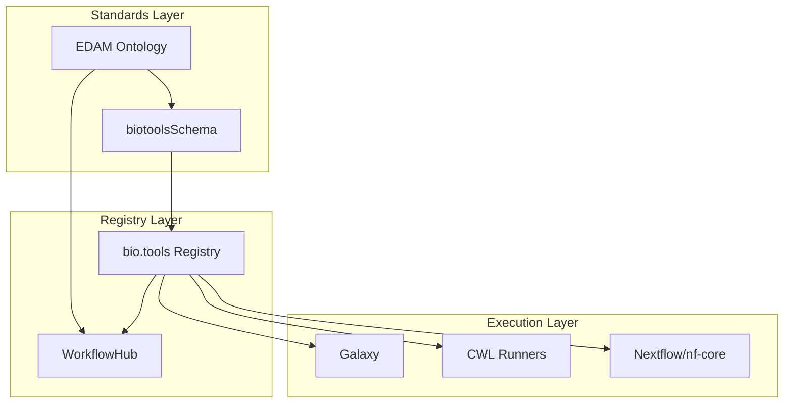

> **Status**: Active
> **Date**: 2026-05-24
> **Author**: @mohammadi
> **Audience**: engineers
> **Tags**: `engineering`, `schemas`, `research`, `biotools`, `edam`
> **Variants**: Technical (this doc) - Readable (biotools-schema-edam-research.md in Obsidian vault: 04-Engineering/cytos/schemas-ontologies/) - Agent (n/a)


# biotoolsSchema, EDAM Ontology, and bio.tools Registry: Research Analysis

> **Owner**: Shahin Mohammadi · **Created**: 2026-05-24 · **Status**: DRAFT
> **Canonical location**: `~/repos/cytognosis/org/plans/research/biotools-schema-edam-research.md`

---

## Section Map

| # | Section | Purpose |
|---|---------|---------|
| 1 | [Executive Summary](#1-executive-summary) | Key findings and relevance to Cytognosis |
| 2 | [biotoolsSchema Specification](#2-biotoolsschema-specification) | Full schema structure and controlled vocabularies |
| 3 | [EDAM Ontology](#3-edam-ontology) | Four branches, hierarchy, and classification system |
| 4 | [bio.tools Registry](#4-biotools-registry) | Registration, API, curation model, and statistics |
| 5 | [Ecosystem Integration](#5-ecosystem-integration) | How these components connect to workflow systems |
| 6 | [Integration with Cytognosis](#6-integration-with-cytognosis) | Mapping to our schemas, registries, and platform |
| 7 | [Recommendations](#7-recommendations) | Concrete next steps |

---

## 1. Executive Summary

The biotoolsSchema, EDAM ontology, and bio.tools registry form a tightly integrated "stack" for describing, classifying, and discovering bioinformatics software. Together they represent the ELIXIR research infrastructure's answer to FAIR software principles.

### Key Findings

1. **biotoolsSchema** defines 50+ attributes organized into 9 logical groupings, with only 3 mandatory fields (name, description, homepage). It provides 17 internal controlled vocabularies for technical metadata and relies on EDAM for scientific classification.

2. **EDAM** (EMBRACE Data and Methods) is a domain ontology with ~3,400+ concepts organized into four branches: Topic, Operation, Data (including Identifiers), and Format. Each forms a directed acyclic graph (DAG) of `is_a` relationships.

3. **bio.tools** hosts 33,000+ tool entries with 564,000+ metadata annotations and 211,000+ EDAM annotations from 15,595 contributors. It provides a REST API for programmatic search and registration.

4. **Relevance to Cytognosis**: These standards directly inform our LEGO biological model registry design, skill-tagging ontology, and experiment orchestration system. EDAM concepts map naturally to our existing LinkML schemas and topic hierarchy.

---

## 2. biotoolsSchema Specification

### 2.1 Overview

biotoolsSchema is a formalized description model for bioinformatics software, available as both XML Schema (XSD) and JSON Schema. It defines the syntax, structure, and semantics for cataloging computational tools in the bio.tools registry.

The schema is part of a broader technology stack:

| Component | Role |
|-----------|------|
| **biotoolsCore** | Flat list of 50+ attributes |
| **biotoolsSchema** | Formal technical implementation (XSD/JSON Schema) |
| **EDAM Ontology** | Semantic layer for standardized terminology |
| **Curation Guidelines** | Human-readable conventions for quality/consistency |

### 2.2 Attribute Groupings

The ~50 attributes are organized into 9 logical groupings:

| # | Group | Key Attributes | Purpose |
|---|-------|---------------|---------|
| 1 | **Summary** | name, description, homepage, biotoolsID, biotoolsCURIE, version, otherID | Basic identification |
| 2 | **Function** | operation, input, output (each with EDAM data + format) | What the tool does |
| 3 | **Labels** | topic, toolType, operatingSystem, language, license, cost, maturity, accessibility | Classification metadata |
| 4 | **Links** | issue tracker, repository, social media, mailing list | External resources |
| 5 | **Download** | source code, container image, VM image, Galaxy wrapper | Acquisition methods |
| 6 | **Documentation** | API docs, user manual, training material | Learning resources |
| 7 | **Publication** | primary publication, review, method, usage | Literature citations |
| 8 | **Relation** | isNewVersionOf, hasNewVersion, uses, usedBy | Tool relationships |
| 9 | **Credit** | developer, maintainer, provider, funder, contributor | Attribution |

### 2.3 Minimal Requirements

Only three attributes are mandatory for registration:

- **name**: Canonical name of the tool
- **description**: Short textual description
- **homepage**: URL to the tool's homepage

This low barrier enables rapid registration while encouraging progressive enrichment.

### 2.4 Function Model (Input/Output Typing)

The Function group is the core of biotoolsSchema. Software is described as having one or more "functions," each containing:

```
Function
├── Operation (1..n) → EDAM Operation terms
│   e.g., "Sequence alignment" (operation_0292)
├── Input (0..n)
│   ├── Data → EDAM Data type
│   │   e.g., "Sequence" (data_2044)
│   └── Format → EDAM Format type
│       e.g., "FASTA" (format_1929)
└── Output (0..n)
    ├── Data → EDAM Data type
    │   e.g., "Sequence alignment" (data_0863)
    └── Format → EDAM Format type
        e.g., "ClustalW format" (format_1982)
```

| Field | Cardinality | Requirement | Source |
|-------|-------------|-------------|--------|
| Function | 1..n | Required | Schema |
| Operation | 1..n per function | Required | EDAM |
| Input | 0..n per function | Optional | EDAM |
| Output | 0..n per function | Optional | EDAM |
| Topic | 0..n per tool | Optional | EDAM |

### 2.5 Controlled Vocabularies

biotoolsSchema defines 17 internal controlled vocabularies for technical aspects:

#### Core Technical Vocabularies

| Vocabulary | Values (examples) | Purpose |
|-----------|-------------------|---------|
| **Tool type** | Command-line tool, Web application, Database portal, Web API, Workflow, Suite, Library, Plugin, Script, Desktop application, Bioinformatics portal, Ontology, SPARQL endpoint, Workbench, Web service | Software classification |
| **Operating system** | Linux, Windows, macOS | Platform support |
| **Programming language** | C, Python, Java, R, Perl, etc. | Implementation language |
| **License** | SPDX identifiers (GPL-3.0, MIT, Apache-2.0) | Usage terms |
| **Maturity** | Mature, Emerging, Deprecated | Development stage |
| **Cost** | Free of charge, Commercial | Monetary cost |
| **Accessibility** | Open access, Open access (with restrictions), Restricted access | Non-monetary access barriers |

#### Supporting Vocabularies

| Vocabulary | Purpose |
|-----------|---------|
| Link type | Helpdesk, Repository, Social media, Issue tracker |
| Download type | Source code, VM image, Galaxy wrapper, Container |
| Documentation type | API documentation, Manual, Training material |
| Publication type | Primary publication, Review, Method, Usage |
| Relation type | isNewVersionOf, hasNewVersion, uses, usedBy |
| Entity type | Person, Project, Institute, Division, Funding agency |
| Entity role | Developer, Maintainer, Provider, Documentor, Contributor |

### 2.6 Scope and Limitations

biotoolsSchema focuses on **metadata for discovery and description**, not execution-layer information. It describes *what* a tool does, not *how* to invoke it. This makes it complementary to:

- **CWL** (Common Workflow Language): Execution semantics
- **OpenAPI**: API endpoint specification
- **Dockerfile/Conda**: Environment specification

---

## 3. EDAM Ontology

### 3.1 Overview

EDAM (EMBRACE Data and Methods) is a community-developed domain ontology for bioinformatics, computational biology, and bioimage informatics. It provides standardized terminology for the semantic annotation of tools, workflows, datasets, and services.

**Statistics:**
- ~3,472 defined concepts
- Four primary branches (sub-ontologies)
- Maintained in OWL format (also available in OBO and TSV)
- Active community-driven development on GitHub
- Versioned with stable (e.g., 1.25) and rolling releases

### 3.2 Four Main Branches

#### Topic Branch

Broad domains or fields of interest, study, or technology.

| Level | Example Terms |
|-------|--------------|
| Top-level | Biology, Computer science |
| Mid-level | Genomics, Proteomics, Structural biology |
| Specific | Sequence analysis, Molecular genetics, Image analysis |

**Purpose**: Categorizes the subject matter of a resource. Used for coarse-grained classification and discovery.

#### Operation Branch

Functions or processes performed by a tool. Describes *what* a tool does, not how or in what context.

| Level | Example Terms |
|-------|--------------|
| Top-level | Analysis, Prediction |
| Mid-level | Sequence analysis, Structure analysis |
| Specific | Sequence alignment, Variant calling, Genome indexing |
| Leaf | Pairwise sequence alignment, Constrained sequence alignment |

**Hierarchy example:**
```
Analysis
└── Sequence analysis
    └── Sequence comparison
        └── Sequence alignment
            ├── Pairwise sequence alignment
            ├── Multiple sequence alignment
            └── Constrained sequence alignment
```

#### Data Branch

Types of information consumed or produced by tools. Focuses on the *semantic content* of data rather than its technical representation.

| Level | Example Terms |
|-------|--------------|
| Top-level | Data |
| Mid-level | Sequence, Structure |
| Specific | Sequence record, Sequence alignment, Phylogenetic tree |
| Identifiers | UniProt accession, EC number, Gene symbol |

The **Identifier** sub-branch is rooted under Data and catalogs types of identifiers used in bioinformatics. Identifiers often include metadata like regular expressions to validate their syntax.

#### Format Branch

Specific layouts or structures for representing data in files, strings, or messages.

| Level | Example Terms |
|-------|--------------|
| Top-level | Format |
| Mid-level | Textual format, Binary format, XML |
| Specific | FASTA format, PDB format, FASTQ, VCF, BAM |

**Cross-branch relationships**: Format concepts are formally related to Data concepts via `is_format_of` relations (e.g., FASTA format `is_format_of` Sequence).

### 3.3 Concept Identifiers

EDAM concepts use persistent URIs:

```
Pattern: http://edamontology.org/<subontology>_<localId>
Example: http://edamontology.org/data_0849 → "Sequence record"
Example: http://edamontology.org/operation_0292 → "Sequence alignment"
Example: http://edamontology.org/format_1929 → "FASTA"
Example: http://edamontology.org/topic_3510 → "Proteomics"
```

### 3.4 Relationship Types

Primary relationship: `is_a` (specialization/generalization), forming DAG hierarchies.

Cross-branch relations include:
- `has_input` / `has_output` (Operation → Data)
- `is_format_of` (Format → Data)
- `has_topic` (Operation → Topic)

### 3.5 Comparison with Other Classification Systems

| Feature | EDAM Ontology | MeSH | OpenAlex Concepts |
|---------|--------------|------|-------------------|
| **Primary Scope** | Bioinformatics (tools, data, operations) | Biomedical & Life Sciences | All Scientific Disciplines |
| **Curation** | Expert-curated / Community | Expert-curated (NLM) | Automated (ML / Clustering) |
| **Structure** | Hierarchical (DAG) | Poly-hierarchical | Hierarchical (5 levels) |
| **Main Use Case** | Annotating tools, workflows, & data | Indexing literature (PubMed) | Bibliometric & landscape analysis |
| **Term Count** | ~3,472 | ~30,000+ | ~65,000+ |
| **Coverage** | Deep in bioinformatics | Broad in biomedicine | All sciences |

**Mapping efforts**: Projects like the "Science Data Lake" have used embedding-based techniques to align OpenAlex topics with EDAM and MeSH. Direct perfect mapping is constrained by the different semantic axes each system uses.

---

## 4. bio.tools Registry

### 4.1 Overview and Statistics

bio.tools is the ELIXIR Tools & Data Services Registry, a comprehensive, community-driven catalog for bioinformatics software and data resources.

**Statistics (May 2026):**

| Metric | Value |
|--------|-------|
| Total entries | 33,010 |
| Total metadata annotations | 564,000+ |
| EDAM ontology annotations | 211,000+ |
| Contributors | 15,595 |

### 4.2 Registration Process

1. **Create account**: Users register at bio.tools
2. **Add content**: Fill structured metadata via web interface or API
3. **Assign biotoolsID**: Each tool receives a human-readable, URL-safe identifier (e.g., `biotools:signalp`)
4. **EDAM annotation**: Add topic, operation, data type, and format terms
5. **Quality enrichment**: Progressive curation following the Curators Guide

Registration methods:
- **Manual curation** via web interface
- **API submission** via REST endpoints
- **Literature mining** via Pub2Tools (automated extraction from publications)
- **LLM-aided scoring** followed by manual revision

### 4.3 REST API

**Base URL**: `https://bio.tools/api/`

#### Key Endpoints

| Method | Endpoint | Purpose |
|--------|----------|---------|
| `GET` | `/api/tool/` (or `/api/t/`) | List and search tools |
| `POST` | `/api/tool/` | Register new tool (auth required) |
| `PUT` | `/api/tool/<biotoolsID>/` | Update existing tool (auth required) |
| `DELETE` | `/api/tool/<biotoolsID>/` | Delete tool (auth required) |
| `POST` | `/api/rest-auth/login/` | Obtain auth token |
| `GET` | `/api/rest-auth/user/` | Get authenticated user info |

#### Search Parameters

| Parameter | Purpose | Example |
|-----------|---------|---------|
| `q` | General query (matches all attributes) | `?q=alignment` |
| `name` | Search by tool name | `?name=signalp` |
| `topic` | Filter by EDAM topic term | `?topic=Proteomics` |
| `topicID` | Filter by EDAM topic URI/ID | `?topicID=topic_3510` |
| `description` | Search within descriptions | `?description=variant` |
| `version` | Exact version match | `?version=5.0` |
| `homepage` | Exact homepage URL match | `?homepage=https://...` |
| `page` | Result page number (default: 1) | `?page=2` |
| `per_page` | Results per page (default: 50) | `?per_page=100` |
| `sort` | Sort field | `?sort=lastUpdate` |
| `ord` | Sort order | `?ord=desc` |

Sort options: `lastUpdate`, `additionDate`, `name`, `score`.

#### Example API Calls

```bash
# Search for tools related to Proteomics
GET https://bio.tools/api/t/?topic=Proteomics&format=json

# Search for tools performing sequence alignment
GET https://bio.tools/api/t/?q=sequence+alignment&format=json

# Get details for a specific tool
GET https://bio.tools/api/tool/signalp/?format=json
```

### 4.4 Data Formats

The API supports:
- **JSON** (default): For machine-readable access
- **XML**: For legacy system compatibility

All data follows the biotoolsSchema, including EDAM annotations for operations, data types, formats, and topics.

---

## 5. Ecosystem Integration

### 5.1 ELIXIR Infrastructure

bio.tools, biotoolsSchema, and EDAM form a foundational pillar of the ELIXIR research infrastructure. The integration extends to:

- **Galaxy**: Maps bio.tools EDAM annotations to internal tool metadata
- **CWL**: ToolDog generates CWL descriptors from bio.tools entries
- **Nextflow**: nf-core modules can reference bio.tools identifiers
- **WorkflowHub**: Uses EDAM for workflow classification

### 5.2 Workflow System Integration



### 5.3 Automated Descriptor Generation

Tools like **ToolDog** leverage bio.tools metadata to automatically generate or enrich tool description templates for workflow languages:

1. Query bio.tools for tool metadata
2. Extract EDAM annotations (operations, inputs, outputs)
3. Generate CWL/Galaxy tool descriptors with pre-filled type information
4. Developers complete execution-specific details (command line, arguments)

---

## 6. Integration with Cytognosis

### 6.1 Mapping to Existing Schemas

The Cytognosis platform uses LinkML schemas in the `cytos` knowledge graph. Several existing schemas directly overlap with biotoolsSchema/EDAM concepts:

| Cytognosis Schema | biotoolsSchema / EDAM Equivalent |
|------------------|----------------------------------|
| `cytos-topic` (ResearchTopic) | EDAM Topic branch + OpenAlex + MeSH |
| `cytos-core` (DatasetRegistryEntry) | biotoolsSchema Summary + Labels groups |
| `cytos-registries` (plug-in registries) | bio.tools registry pattern |
| `cytos-annotation` (Annotation) | bio.tools curation model |
| `ModalityEnum` (phenotype, genotype, sc_omics, biosignal, imaging) | EDAM Data branch (partially) |
| `ParserEnum` (format handling) | EDAM Format branch |

### 6.2 EDAM as Skill-Tagging Ontology

The existing Cytognosis skill-tagging system uses a two-axis approach:

- **Axis A** (coding/use-case): `cyto:se/*` — SWEBOK-derived
- **Axis B** (org function): `apqc:pcf:*` — APQC PCF

EDAM could serve as a **third axis** for scientific operations:

- **Axis C** (scientific function): `edam:operation/*` — EDAM operations

This maps directly to the cytoskills system. Each skill could declare:
- Which EDAM operations it performs
- Which EDAM data types it consumes/produces
- Which EDAM formats it supports
- Which EDAM topics it relates to

### 6.3 biotoolsSchema for the LEGO Model Registry

The Cytognosis "LEGO biological model" concept (composable computational biology modules) can adopt biotoolsSchema patterns:

1. **Function model**: Each LEGO block declares its operations, inputs, and outputs using EDAM terms
2. **Composability**: EDAM data type matching enables automatic compatibility checking between blocks
3. **Discovery**: EDAM topic classification enables researchers to find relevant blocks
4. **Provenance**: biotoolsSchema credit model tracks contributors

```yaml
# Example: Cytognosis LEGO block described with biotoolsSchema concepts
lego_block:
  name: "CytoVCF Variant Annotator"
  description: "Annotates VCF variants with clinical significance"
  function:
    - operation:
        - uri: edam:operation_3661  # SNP annotation
        - uri: edam:operation_3672  # Gene functional annotation
      input:
        - data: edam:data_3498  # Sequence variations
          format: edam:format_3016  # VCF
      output:
        - data: edam:data_3498  # Sequence variations (annotated)
          format: edam:format_3016  # VCF
  topic:
    - edam:topic_3325  # Rare diseases
    - edam:topic_3577  # Personalised medicine
  toolType: library
  language: Python
  license: Apache-2.0
```

### 6.4 Experiment Orchestration

biotoolsSchema's function model maps to our experiment orchestration system:

| Experiment System Concept | biotoolsSchema Equivalent |
|--------------------------|---------------------------|
| Pipeline step | biotoolsSchema Function |
| Step operation | EDAM Operation |
| Step input data type | EDAM Data + Format |
| Step output data type | EDAM Data + Format |
| Pipeline topic area | EDAM Topic |

This enables:
- **Automatic type checking**: Verify that one step's output format matches the next step's input format
- **Pipeline discovery**: Find relevant pipeline steps by EDAM operation
- **Interoperability**: Exchange pipeline definitions with Galaxy, CWL, Nextflow ecosystems

### 6.5 Should We Register Tools in bio.tools?

**Recommendation: Yes, after MVP launch.**

Benefits:
- Visibility in the ELIXIR ecosystem
- Discoverability by 15,000+ bio.tools contributors
- Standardized citation via biotoolsID
- Integration with Galaxy, CWL, WorkflowHub
- FAIR software compliance

Timing: Register after our first public tools are stable. Start with:
1. Cytos KG query tools
2. LEGO biological model blocks
3. Experiment orchestration pipeline components

### 6.6 Relationship to Topic Schema

The existing `cytos-topic` schema integrates OpenAlex (4-level hierarchy), OpenAlex Concepts (6-level tree), UMLS Semantic Network, MeSH, and ASJC. EDAM Topics represent a complementary axis:

```
Existing topic sources (cytos-topic):
├── openalex_topic (4,516 topics)
├── openalex_concept (65K+ concepts)
├── mesh (NLM Subject Headings)
├── umls_semantic_network (UMLS types)
├── asjc (Elsevier ASJC)
└── custom (Cytos-defined)

Proposed addition:
└── edam_topic (~3,472 terms, bioinformatics-specific)
```

Adding EDAM as a TopicSource would provide precise bioinformatics-specific classification complementing the broader MeSH and OpenAlex coverage.

---

## 7. Recommendations

### Immediate Actions (Phase 0)

1. **Add EDAM to TopicSource enum** in `cytos-topic.yaml`:
   ```yaml
   edam_topic:
     description: "EDAM ontology bioinformatics topic."
   edam_operation:
     description: "EDAM ontology operation type."
   ```

2. **Generate EDAM validation enum** analogous to existing `efo_validation_enum.yaml` and `mondo_validation_enum.yaml` for EDAM terms

3. **Design LEGO block metadata schema** using biotoolsSchema Function model as template, implemented in LinkML

### Near-Term Actions (Phase 1)

4. **Implement EDAM-based skill tagging** as Axis C in the cytoskills system
5. **Build bio.tools API client** in cytoskeleton for querying existing tools
6. **Create mapping file** between EDAM Topics and existing OpenAlex/MeSH terms in cytos-topic

### Medium-Term Actions (Phase 2)

7. **Register Cytognosis tools in bio.tools** after public release
8. **Integrate EDAM type checking** into experiment orchestration pipeline validation
9. **Generate CWL descriptors** from LEGO block biotoolsSchema metadata via ToolDog patterns

---

**Document Version**: 1.0
**Last Updated**: 2026-05-24
**Next Review**: After Phase 1 completion
**Owner**: Shahin Mohammadi, Cytognosis Foundation


---

## See Also

| Doc | Relationship |
|-----|-------------|
| [`linkml-playbook/README.md`](./linkml-playbook/README.md) | Practical implementation guide; the LinkML playbook is the hands-on counterpart to this schema survey |
| [`05-Research/neuroverse/datasets-cohorts.md`](../../../05-Research/neuroverse/datasets-cohorts.md) | Neuroverse datasets; the primary Cytognosis use-case for applying biotoolsSchema/EDAM registration |
| [`04-Engineering/cytos/schemas-ontologies/linkml-playbook/04_biolink_and_core_schemas.md`](./linkml-playbook/04_biolink_and_core_schemas.md) | Biolink and core schemas chapter; extends the EDAM landscape covered here |
