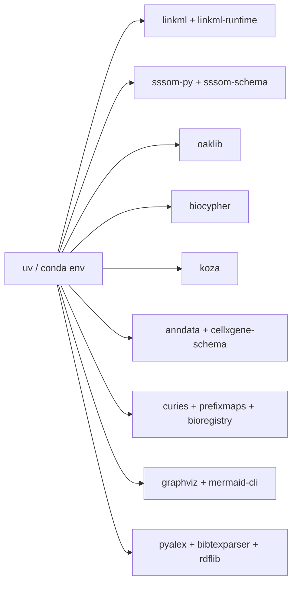

# 00 — Environment Setup

> **Status**: Active
> **Date**: 2026-07-10
> **Author**: @shahin
> **Audience**: engineers
> **Tags**: `engineering`
> **Variants**: Technical (this doc) - Readable (Obsidian twin optional, same filename) - Agent (n/a)

> **Goal** – have a clean Python env with every tool the rest of this
> playbook calls, plus a project skeleton.
> **Time** – 20 minutes.
> **Prereqs** – Python 3.11+, git, curl, ~5 GB free disk.

---

## What you're building



---

## 1. Pick a Python env manager

Either is fine. `uv` is faster.

```bash
# Option A: uv (recommended, fast)
curl -LsSf https://astral.sh/uv/install.sh | sh
uv venv .venv --python 3.11
source .venv/bin/activate

# Option B: conda
conda create -n cyto-kg python=3.11 -y
conda activate cyto-kg
```

---

## 2. Install everything

Save this as `bin/setup_env.sh` and run it.

```bash
#!/usr/bin/env bash
set -euo pipefail

# Core LinkML + schema importers
pip install \
  "linkml>=1.7" \
  "linkml-runtime>=1.7" \
  "linkml-map" \
  "schemasheets" \
  "schema-automator"

# SSSOM + ontology access
pip install \
  "sssom>=0.4" \
  "sssom-schema" \
  "oaklib>=0.6" \
  "curies" \
  "prefixmaps" \
  "bioregistry"

# Knowledge graph frameworks
pip install \
  "biocypher>=0.7" \
  "koza>=0.6" \
  "kgx" \
  "bmt"            # biolink model toolkit

# Single-cell
pip install \
  "anndata>=0.10" \
  "cellxgene-schema>=5.2" \
  "scanpy"

# Sources / parsers
pip install \
  "pyalex" \
  "bibtexparser" \
  "rdflib" \
  "pyyaml" \
  "pandas" \
  "duckdb"          # for Open Targets parquet

# BioThings (APIs + JSON-LD schema engine + DDE interop)
pip install \
  "biothings-client" \
  "biothings-schema"

# GA4GH (VRS Pydantic + Phenopackets Protobuf bindings + LinkML port)
pip install \
  "ga4gh-vrs" \
  "phenopackets" \
  "linkml-phenopackets"

# HDMF / NWB stack
pip install \
  "hdmf" \
  "pynwb" \
  "hdmf-zarr" \
  "nwbinspector" \
  "linkml-arrays"

# Optional but useful for diagrams
pip install "linkml-renderer"
# Mermaid CLI (Node) — optional, for PNG export
# npm i -g @mermaid-js/mermaid-cli
```

Make it executable and run:

```bash
chmod +x bin/setup_env.sh
bin/setup_env.sh
```

---

## 3. Project skeleton

```bash
mkdir -p Infrastructure\ and\ Tooling/linkml_kg_playbook/{schemas,downloads,build,scripts,sssom}

cd "Infrastructure and Tooling/linkml_kg_playbook"

# Subfolders we'll fill chapter by chapter
mkdir -p schemas/{schema_org,bioschemas,biolink,sssom,sosa_ssn,cellxgene,opentargets,openalex,bibtex,cytognosis}
mkdir -p downloads/{schema_org,bioschemas,biolink,sssom,sosa_ssn,cellxgene,opentargets}
```

| Folder | Holds |
| --- | --- |
| `downloads/` | Untouched upstream files (JSON-LD, OWL, TSV, parquet) |
| `schemas/` | Your LinkML YAML — converted, customized, or hand-written |
| `build/` | Codegen output (Pydantic, JSON Schema, OWL, ERD) |
| `sssom/` | Mapping TSVs by source ontology |
| `scripts/` | One-off conversion scripts you'll write per chapter |

---

## 4. Verify

```bash
python -c "
import linkml, sssom, oaklib, biocypher, koza, anndata, cellxgene_schema
print('linkml          ', linkml.__version__)
print('sssom           ', sssom.__version__)
print('oaklib          ', oaklib.__version__)
print('biocypher       ', biocypher.__version__)
print('koza            ', koza.__version__)
print('anndata         ', anndata.__version__)
print('cellxgene_schema', cellxgene_schema.__version__)
"

# CLIs
linkml-validate --version
runoak --help | head -5
sssom --help | head -5
biocypher --help 2>/dev/null | head -5 || echo "biocypher CLI ok"
koza --help | head -5
cellxgene-schema --help | head -5
```

> **Checkpoint** – every line above prints a version or a help banner
> with no `ImportError`.

---

## 5. Pitfalls

- **Mixing pip and conda for `oaklib`** sometimes leaves an old `obographs`
  pinned. If `runoak` errors on import, `pip install -U obographs oaklib`.
- **Apple Silicon + `rdflib-jsonld`** is no longer needed (rdflib ≥ 6
  handles JSON-LD natively). If you see deprecation warnings, ignore.
- **`cellxgene-schema` pulls a big ontology cache** on first run (CL,
  MONDO, NCBITaxon) — let it finish before using.
- **`uv pip install`** is faster than vanilla `pip` if you're on uv.

---

## Further reading

- LinkML install: https://linkml.io/linkml/intro/install.html
- BioCypher install: https://biocypher.org/installation.html
- Koza quickstart: https://koza.monarchinitiative.org/Usage/quickstart/
