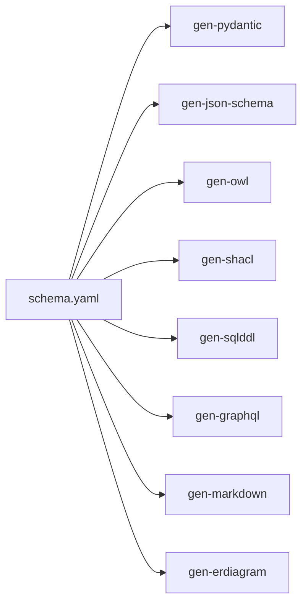
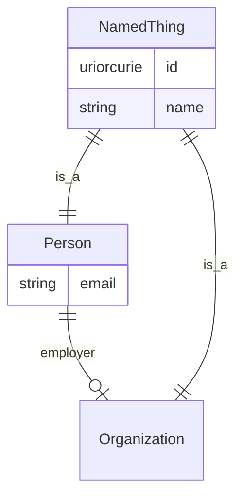

# 01 — LinkML in an Hour

> **Status**: Active
> **Date**: 2026-07-10
> **Author**: @shahin
> **Audience**: engineers
> **Tags**: `engineering`
> **Variants**: Technical (this doc) - Readable (01_linkml_in_an_hour.md in Obsidian vault: 04-Engineering/cytos/schemas-ontologies/linkml-playbook/) - Agent (n/a)

> **Goal** – read any LinkML schema, write a small one, validate data,
> and codegen Pydantic + JSON Schema + OWL + ERD.
> **Time** – 60 minutes.
> **Prereqs** – chapter 00 finished.

---

## The 30-second pitch

LinkML is a **YAML-native schema language** that compiles to almost any
target you might want: Pydantic, JSON Schema, OWL/SHACL, SQL DDL,
GraphQL, Markdown docs, ER diagrams. One source, many shapes.



---

## 1. Anatomy of a schema

A LinkML schema has five sections. Memorize this skeleton.

```yaml
id: https://example.org/cyto/demo
name: cyto_demo
description: Smallest schema that demonstrates every section.
license: CC0-1.0

prefixes:                       # 1. CURIE namespaces
  cyto: https://cytognosis.org/
  schema: http://schema.org/
  linkml: https://w3id.org/linkml/
default_prefix: cyto
default_range: string

imports:                        # 2. reuse other schemas
  - linkml:types

classes:                        # 3. nouns
  NamedThing:
    description: Anything with an identifier and a label.
    slots: [id, name]
    abstract: true

  Person:
    is_a: NamedThing
    slots: [email, employer]
    class_uri: schema:Person

  Organization:
    is_a: NamedThing
    class_uri: schema:Organization

slots:                          # 4. attributes / edges
  id:
    identifier: true
    range: uriorcurie
  name:
    range: string
  email:
    pattern: "^\\S+@\\S+\\.\\S+$"
  employer:
    range: Organization

enums:                          # 5. controlled vocabularies
  Role:
    permissible_values:
      RESEARCHER:
      ENGINEER:
```

| Section | Purpose | Mental model |
| --- | --- | --- |
| `prefixes` | Map short names → full URIs | Like Python `import as` |
| `imports` | Pull in other LinkML schemas | Like Python `from x import *` |
| `classes` | Nouns, with inheritance via `is_a` | Like dataclass / Pydantic |
| `slots` | Reusable attributes and edges | Like fields, but reusable |
| `enums` | Controlled vocabularies | Like Python `Enum` |

---

## 2. Inheritance, mixins, slot_usage

```yaml
classes:
  HasIdentifier:
    mixin: true
    slots: [id]

  HasROCrateMetadata:
    mixin: true
    slots: [conforms_to, sd_publisher]

  Paper:
    is_a: NamedThing
    mixins: [HasROCrateMetadata]
    slots: [authors, doi]
    slot_usage:                 # tighten a slot for this class only
      doi:
        required: true
        pattern: "^10\\..+"
```

- `is_a` – single inheritance.
- `mixins` – multiple inheritance, no diamond pain.
- `slot_usage` – override slot constraints per class without redefining.

---

## 3. Slots are first-class

Slots can be declared once and reused across classes. This is the killer
LinkML feature people miss when they hand-roll Pydantic.

```yaml
slots:
  authors:
    multivalued: true
    range: Person
    inlined_as_list: true       # serialize as JSON list, not dict-of-id
  doi:
    range: string
```

`inlined_as_list` controls JSON shape:
- `false` (default) → object keyed by id.
- `true` → list of objects, ordering preserved.

---

## 4. Validate data against a schema

Save sample data:

```yaml
# data/people.yaml
- id: cyto:Person/shahin
  name: Shahin Mohammadi
  email: shahin@cytognosis.org
- id: cyto:Person/badmember
  name: ""
  email: not-an-email
```

Validate:

```bash
linkml-validate \
  --schema schemas/cyto_demo.yaml \
  --target-class Person \
  data/people.yaml
```

Expected output: it finds two errors on the second record (empty name,
bad email pattern).

> **Checkpoint** – fix the second record, re-run, get clean exit.

---

## 5. Codegen targets

```bash
SCHEMA=schemas/cyto_demo.yaml

# Pydantic v2
gen-pydantic "$SCHEMA" > build/cyto_demo_pydantic.py

# JSON Schema
gen-json-schema "$SCHEMA" > build/cyto_demo.schema.json

# OWL (Turtle)
gen-owl "$SCHEMA" > build/cyto_demo.owl.ttl

# SHACL
gen-shacl "$SCHEMA" > build/cyto_demo.shacl.ttl

# SQL DDL (Postgres flavor)
gen-sqlddl "$SCHEMA" > build/cyto_demo.sql

# Markdown docs
gen-doc "$SCHEMA" --directory build/docs

# ER diagram (Mermaid)
gen-erdiagram "$SCHEMA" > build/cyto_demo.mmd
```

The Mermaid ER diagram drops straight into a markdown doc and renders
on GitHub:



---

## 6. Use the codegen output

```python
from build.cyto_demo_pydantic import Person

p = Person(
    id="cyto:Person/shahin",
    name="Shahin Mohammadi",
    email="shahin@cytognosis.org",
)
print(p.model_dump_json(indent=2))
```

Pydantic gives you parsing, validation, JSON in/out, and IDE autocomplete
for free — all derived from the YAML schema.

---

## 7. Hands-on mini-exercise

Build a 3-class schema and round-trip it.

1. Create `schemas/scratch.yaml` with `NamedThing`, `Paper`, `Person`,
   and a `created_by` slot of range `Person`.
2. Add a tiny YAML dataset.
3. Validate.
4. Generate Pydantic.
5. Round-trip a record through the Pydantic class.

When all five steps pass, you're past the LinkML beginner cliff.

---

## 8. Pitfalls

- **`default_range` is sticky.** Every slot without `range:` uses it.
  Set it explicitly to `string` or you'll spend an hour debugging
  weirdly-typed columns.
- **`identifier: true` must appear on a slot, not on the class.**
  And only one slot per class can have it.
- **CURIE prefix collisions** – if two `prefixes:` entries map to the
  same short name, the last one wins silently.
- **`mixins:` order matters.** The first mixin's slot definitions win on
  conflict.
- **`inlined: true` vs `inlined_as_list: true`** – they look similar but
  produce different JSON shapes. Test both before committing.

---

## Further reading

- LinkML overview: https://linkml.io/linkml/intro/overview.html
- LinkML metamodel (the LinkML schema for LinkML itself):
  https://linkml.io/linkml-model/
- LinkML cookbook: https://linkml.io/linkml/howtos/index.html
