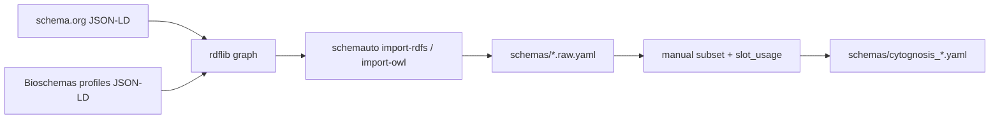

# 03 — schema.org and Bioschemas → LinkML

> **Status**: Active
> **Date**: 2026-07-10
> **Author**: @shahin
> **Audience**: engineers
> **Tags**: `engineering`
> **Variants**: Technical (this doc) - Readable (Obsidian twin optional, same filename) - Agent (n/a)

> **Goal** – pull schema.org and Bioschemas into LinkML form so you can
> import them into the Cytognosis schema instead of redefining classes.
> **Time** – 45 minutes.
> **Prereqs** – chapters 01, 02.

---

## The big picture



You will rarely want **all** of schema.org. The typical play is: download
everything, subset to the slice you need, then `import:` it from your
master schema.

---

## 1. schema.org

### 1.1 Download

`bin/download_schemas.sh` from chapter 00 already grabbed it, but
manually:

```bash
curl -L -o downloads/schema_org/schemaorg-current-https.jsonld \
  https://schema.org/version/latest/schemaorg-current-https.jsonld
```

This is a single ~9 MB JSON-LD file with every schema.org class, property,
and enum.

### 1.2 Convert to LinkML (option A: `schemauto import-rdfs`)

> **Note** – `gen-linkml` is *not* a multi-format importer; it only
> reloads existing LinkML schemas. The actual import path is via the
> separate **`schema-automator`** package (CLI: `schemauto`).

```bash
pip install schema-automator
```

`schemauto` doesn't read JSON-LD directly, but rdflib does. Convert to
Turtle once, then run the RDFS importer:

```bash
# JSON-LD -> Turtle (one-liner via rdflib)
python -c "
import rdflib
g = rdflib.Graph()
g.parse('downloads/schema_org/schemaorg-current-https.jsonld', format='json-ld')
g.serialize('downloads/schema_org/schemaorg-current.ttl', format='turtle')
"

# RDFS -> LinkML
schemauto import-rdfs \
  downloads/schema_org/schemaorg-current.ttl \
  --output schemas/schema_org/schema_org_full.yaml
```

Output: a single ~12 MB LinkML YAML with every schema.org class.

If you only need OWL classes (no RDFS-only constructs), `schemauto
import-owl` is an alternative that handles `owl:Class` /
`owl:ObjectProperty` more strictly.

### 1.3 Convert (option B: rdflib + custom subset)

For a controlled subset, pull only the types you actually use.

```python
# scripts/subset_schema_org.py
import rdflib
from rdflib.namespace import RDFS, OWL, RDF
import yaml

g = rdflib.Graph()
g.parse("downloads/schema_org/schemaorg-current-https.jsonld", format="json-ld")

WANTED = {
    "http://schema.org/Person",
    "http://schema.org/Organization",
    "http://schema.org/CreativeWork",
    "http://schema.org/ScholarlyArticle",
    "http://schema.org/Dataset",
    "http://schema.org/SoftwareSourceCode",
    "http://schema.org/PresentationDigitalDocument",
}

classes = {}
for cls in WANTED:
    cls_ref = rdflib.URIRef(cls)
    label = g.value(cls_ref, RDFS.label) or cls.split("/")[-1]
    parents = [str(p) for p in g.objects(cls_ref, RDFS.subClassOf)
               if isinstance(p, rdflib.URIRef)]
    classes[str(label)] = {
        "class_uri": f"schema:{str(label)}",
        "is_a": next((p.split("/")[-1] for p in parents if "schema.org" in p), None),
        "description": str(g.value(cls_ref, rdflib.term.URIRef('http://schema.org/description')) or "").strip(),
    }

linkml = {
    "id": "https://cytognosis.org/schemas/schema_org_subset",
    "name": "schema_org_subset",
    "prefixes": {"schema": "http://schema.org/", "linkml": "https://w3id.org/linkml/"},
    "default_prefix": "schema",
    "imports": ["linkml:types"],
    "classes": classes,
}
with open("schemas/schema_org/schema_org_subset.yaml", "w") as f:
    yaml.safe_dump(linkml, f, sort_keys=False)
```

Run it; you'll get a tight ~50-line LinkML file with just the schema.org
types Cytognosis already mentions in v0.4.0.

### 1.4 Slot extraction

The above only pulls classes. To pull properties (slots), iterate over
`rdf:Property` triples:

```python
slots = {}
for s in g.subjects(RDF.type, rdflib.URIRef("http://schema.org/Property")):
    label = str(g.value(s, RDFS.label) or "").strip()
    if not label:
        continue
    slots[label] = {
        "slot_uri": f"schema:{label}",
        "description": str(g.value(s, rdflib.term.URIRef('http://schema.org/description')) or "").strip(),
    }
linkml["slots"] = slots
```

---

## 2. Bioschemas

Bioschemas extends schema.org with life-science-specific *profiles*: each
profile is a JSON-LD document specifying which schema.org properties are
required/recommended/optional for a given biology entity (Gene, Protein,
Sample, Dataset, etc.).

### 2.1 Clone the specs

```bash
git clone --depth 1 https://github.com/BioSchemas/specifications \
  downloads/bioschemas/specifications
ls downloads/bioschemas/specifications/
# Gene/  Protein/  Sample/  Dataset/  ComputationalWorkflow/  ...
```

### 2.2 Inspect a profile

Each profile lives at `<Type>/jsonld/<Type>_<version>-<status>.json-ld`.

```bash
jq '.["@graph"] | length' \
  downloads/bioschemas/specifications/Gene/jsonld/Gene_1.0-RELEASE.json-ld
# -> 30 (or so)
```

The graph nodes are schema.org properties annotated with Bioschemas
marginality (`bsc:Minimum` / `Recommended` / `Optional`).

### 2.3 Convert one profile to LinkML

```python
# scripts/bioschemas_profile_to_linkml.py
import json, sys, yaml
from pathlib import Path

profile_path = Path(sys.argv[1])
profile = json.loads(profile_path.read_text())

cls_name = profile_path.stem.split("_")[0]
classes = {cls_name: {"is_a": "NamedThing",
                     "class_uri": f"schema:{cls_name}",
                     "slots": []}}
slots = {}

for node in profile.get("@graph", []):
    if node.get("@type") not in ("rdf:Property", ["rdf:Property"]):
        continue
    name = node.get("rdfs:label") or node["@id"].split("/")[-1]
    name = name.replace(" ", "_")
    marg = node.get("marginality", "Optional")
    slot = {
        "slot_uri": f"schema:{name}",
        "description": node.get("rdfs:comment", ""),
        "required": marg == "Minimum",
        "recommended": marg == "Recommended",
    }
    slots[name] = slot
    classes[cls_name]["slots"].append(name)

doc = {
    "id": f"https://cytognosis.org/schemas/bioschemas_{cls_name.lower()}",
    "name": f"bioschemas_{cls_name.lower()}",
    "prefixes": {"schema": "http://schema.org/",
                 "bsc": "https://bioschemas.org/",
                 "linkml": "https://w3id.org/linkml/"},
    "default_prefix": "bsc",
    "imports": ["linkml:types"],
    "classes": classes,
    "slots": slots,
}
out = Path(f"schemas/bioschemas/{cls_name.lower()}.yaml")
out.parent.mkdir(parents=True, exist_ok=True)
out.write_text(yaml.safe_dump(doc, sort_keys=False))
print(f"Wrote {out}")
```

Run it on each profile you care about:

```bash
for p in Gene Protein Sample Dataset ComputationalWorkflow; do
  python scripts/bioschemas_profile_to_linkml.py \
    downloads/bioschemas/specifications/$p/jsonld/${p}_*-RELEASE.json-ld
done
```

### 2.4 Reuse upstream LinkML port (if available)

Watch this repo: https://github.com/linkml/linkml-model-bioschemas — when
present, prefer it over hand-conversion.

### 2.5 Cross-reference: biothings_schema.py and DDE

The schema.org / Bioschemas world has its own non-LinkML schema engine:
**`biothings_schema.py`** plus the **Data Discovery Engine** (DDE).
That toolkit is where you go for JSON-LD-native validation, walking
schema.org class hierarchies programmatically, and publishing schemas to
external registries (NIAID / N3C / Outbreak ecosystems). It complements
LinkML — see [06_biothings.md](06_biothings.md) for the full story
and the LinkML-↔-DDE round-trip pattern.

---

## 3. Wire it into your Cytognosis schema

```yaml
# schemas/cytognosis/master.yaml
imports:
  - linkml:types
  - ../schema_org/schema_org_subset
  - ../bioschemas/dataset
  - ../bioschemas/computationalworkflow
  - ../bioschemas/protein

classes:
  CytognosisDataset:
    is_a: Dataset                # from bioschemas/dataset.yaml
    slot_usage:
      identifier:
        pattern: "^cyto:Dataset/"
```

Run `linkml-validate` against your master file to confirm imports
resolve.

---

## 4. Hands-on

1. Download `schemaorg-current-https.jsonld` (already done by setup script).
2. Run `subset_schema_org.py` — verify output has 7 classes.
3. Convert at least the Gene and Dataset Bioschemas profiles.
4. Add the imports to a tiny `master.yaml` and validate it.

---

## 5. Pitfalls

- **schema.org IRIs flip-flop between `http://` and `https://`.** Pick one
  in your prefix map and normalize incoming JSON-LD before processing.
- **Bioschemas profiles are versioned per-type** (`Gene` is at 1.0 while
  `Sample` may be at 0.2-DRAFT). Pin versions in your downloads.
- **Don't import the full `schema_org_full.yaml` into your runtime
  schema.** It's huge and slows codegen. Subset first.
- **Bioschemas marginality (`Minimum`/`Recommended`)** doesn't map cleanly
  to LinkML `required`/`recommended` — Recommended is informational. The
  conversion above approximates; tune as needed.

---

## Further reading

- schema.org developer overview: https://schema.org/docs/developers.html
- Bioschemas profiles: https://bioschemas.org/profiles/
- LinkML's RDF/OWL importer: https://linkml.io/linkml/generators/owl.html
