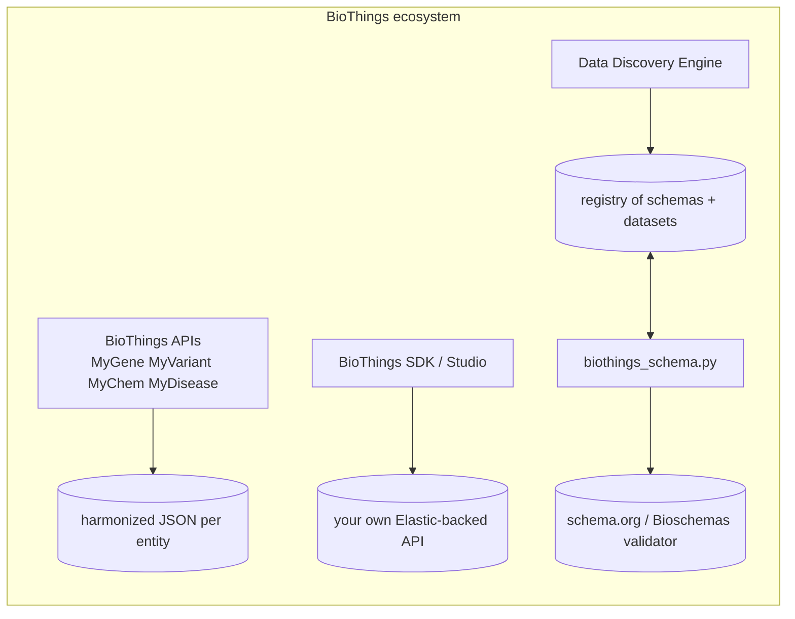
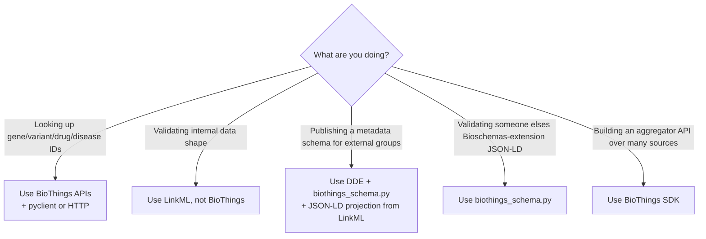
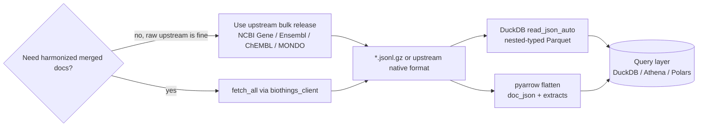
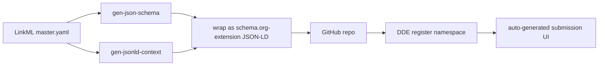

# 06 — BioThings: APIs, biothings_schema.py, and the Data Discovery Engine

> **Status**: Active
> **Date**: 2026-07-10
> **Author**: @shahin
> **Audience**: engineers
> **Tags**: `engineering`
> **Variants**: Technical (this doc) - Readable (Obsidian twin optional, same filename) - Agent (n/a)

> **Goal** – know what BioThings is (it's four things), figure out which
> piece you need, and use them alongside (not instead of) LinkML.
> **Time** – 50 minutes.
> **Prereqs** – chapters 01, 02, 04 (Biolink helps but isn't required).

---

## BioThings is four things



| Piece | What it is | What you do with it | Replaces? |
| --- | --- | --- | --- |
| **APIs** (My*) | REST endpoints, JSON, public | Resolve free-text → canonical IDs; pull harmonized records | No — they're upstream sources |
| **SDK / Studio** | Aggregator framework for building your own My-API | Stand up an internal Cytognosis-API for your own corpora | Optional alternative to a custom KG service |
| **biothings_schema.py** | Python lib for schema.org-style JSON-LD schemas | Validate JSON-LD docs; walk class hierarchies; codegen JSON Schema | **No** — complements LinkML on the JSON-LD track |
| **Data Discovery Engine (DDE)** | Hosted registry of schema.org extension schemas | Publish/find dataset-metadata schemas; validate submissions | No — it's a registry, like Bioregistry but for *schemas* |

---

## Decision: which piece(s) do I touch?



For Cytognosis specifically:

- **APIs** → ingest sources for BioCypher/Koza adapters and for harmonization tier 2.
- **biothings_schema.py** → validation layer for any DDE submission or for interop with N3C/NIAID-style ecosystems.
- **DDE** → publish a Cytognosis-flavored Dataset/Workflow schema there once it's stable.
- **SDK / Studio** → only if you decide to host a public MyCytognosis API. Out of scope for now.

---

## 1. The BioThings APIs

There's a thin Python client (`biothings_client`), but plain HTTP is
fine.

```python
from biothings_client import get_client

mg = get_client("gene")
print(mg.querymany(["BRCA1", "TP53"], scopes="symbol", fields="ensembl,uniprot,entrezgene"))

mv = get_client("variant")
print(mv.getvariant("chr7:g.140453136A>T", fields="dbsnp,clinvar,gnomad_genome"))

md = get_client("drug")
print(md.querymany(["aspirin"], scopes="chembl.molecule_chembl_id,chebi.id,name", fields="chembl"))
```

| API | Endpoint | What it harmonizes |
| --- | --- | --- |
| MyGene | https://mygene.info | Ensembl, Entrez, HGNC, UniProt, NCBI, Reactome, GO, ... |
| MyVariant | https://myvariant.info | dbSNP, ClinVar, gnomAD, COSMIC, CADD, ... |
| MyChem | https://mychem.info | ChEMBL, CHEBI, DrugBank, UNII, PubChem, ... |
| MyDisease | https://mydisease.info | MONDO, DOID, OMIM, Orphanet, MeSH, UMLS, ... |

### 1.1 Use as a Koza/BioCypher source

```python
# adapters/mygene_adapter.py
from biothings_client import get_client

class MyGeneAdapter:
    def __init__(self, gene_symbols):
        self.symbols = gene_symbols
        self.mg = get_client("gene")

    def get_nodes(self):
        for chunk in (self.symbols[i:i+1000] for i in range(0, len(self.symbols), 1000)):
            for rec in self.mg.querymany(chunk, scopes="symbol",
                                         fields="ensembl,uniprot,name,summary",
                                         species="human"):
                if "notfound" in rec:
                    continue
                yield (
                    f"ENSEMBL:{rec['ensembl']['gene']}" if rec.get("ensembl") else f"NCBIGene:{rec['_id']}",
                    "gene",
                    {
                        "symbol": rec.get("symbol"),
                        "name": rec.get("name"),
                        "uniprot": (rec.get("uniprot") or {}).get("Swiss-Prot"),
                        "summary": rec.get("summary"),
                    },
                )

    def get_edges(self):
        return iter([])
```

Drop into the same BioCypher harness you'll build in chapter 15.

### 1.2 Use as a harmonization tier

In the chapter 18 pipeline, BioThings is a clean Tier 2.5 between OAK and
embeddings:

```python
# Resolve "BRCA1" -> Ensembl ID without scraping HGNC
from biothings_client import get_client
mg = get_client("gene")
def symbol_to_ensembl(sym):
    rec = mg.querymany([sym], scopes="symbol",
                        fields="ensembl.gene", species="human")[0]
    return f"ENSEMBL:{rec['ensembl']['gene']}" if rec.get("ensembl") else None
```

This is faster and more accurate than asking an LLM, and free.

### 1.3 Bulk-extract harmonized backends to Parquet

Sometimes you want the whole BioThings document store as a local file
you can query offline (DuckDB / Athena / Polars) without hammering the
public API. Feasibility varies wildly by API.

#### Sizing reality check

| API | Doc count | Approx full size (JSONL) | Approx Parquet (zstd) | Bulk via public API? | Recommended path |
| --- | --- | --- | --- | --- | --- |
| MyDisease | ~30 k | ~500 MB | ~80 MB | Easy | `fetch_all` + DuckDB |
| MyTaxon | ~2 M | ~2 GB | ~300 MB | Easy | `fetch_all` |
| MyGene (human) | ~70 k | ~1 GB | ~150 MB | Easy | `fetch_all` species=human |
| MyGene (all species) | ~30 M | ~50 GB | ~7 GB | A few hours, polite throttle | `fetch_all` partitioned by `taxid` |
| MyChem | ~26 M | ~200 GB | ~30 GB | Painful (~24 h+) | Targeted query (drugs only) or upstream |
| MyVariant | ~200 M+ | TB scale | hundreds of GB | **Don't.** | Upstream dbSNP/ClinVar/gnomAD, or targeted by gene |

> **For MyVariant specifically: don't bulk-dump from the public API.**
> The harmonized merger for MyVariant pulls from dbSNP, ClinVar, gnomAD,
> COSMIC, CADD, etc. Those are the real sources — go there directly with
> their bulk releases, then re-harmonize on your side. Use MyVariant as a
> lookup service, not a data lake.

#### Pre-built bulk dumps (the honest story)

There is **no consistently-maintained public URL** that hosts the
harmonized BioThings backend as downloadable tarballs. Earlier drafts
of this chapter pointed at `https://biothings.io/data/` — that URL is
unreliable and you should not depend on it.

What does exist:

- **The BioThings data hub** is the internal merger pipeline that
  builds the harmonized JSON store powering each My-API. It runs on
  Scripps infrastructure and snapshots are *not* generally
  redistributed.
- **Per-API documentation pages** (`docs.mygene.info`,
  `docs.mychem.info`, `docs.mydisease.info`, `docs.myvariant.info`)
  list the upstream sources that fed the merger and sometimes describe
  download formats — but these point at the *upstream* sources, not at
  the harmonized output.
- **GitHub releases** under https://github.com/biothings occasionally
  attach JSON snapshots for individual data plugins (`mygene.info`,
  `mychem.info`, etc.). Worth a `git ls-remote --tags` plus a glance at
  the Releases tab when you start a fresh ingest.
- **The BioThings team is responsive on GitHub.** If you have a
  legitimate research use case and need a snapshot, file an issue at
  https://github.com/biothings/biothings.api/issues — they have
  granted ad-hoc dumps and elevated rate limits in the past.

In practice that means: for the harmonized merged backend, the
`fetch_all` path below *is* the path. Plan accordingly.

If your needs are actually upstream-source-shaped (raw NCBI Gene, raw
Ensembl, raw ChEMBL, raw MONDO) you should always go there first —
those projects publish reliable bulk releases and BioThings is then
adding harmonization value on top, which you may not need.

#### Recipe (when no bulk dump is available): `fetch_all` → JSONL → Parquet

```python
# scripts/biothings_dump.py
"""
Stream a BioThings API to JSONL, then convert to Parquet via DuckDB.
Resumable: we record the last seen _id in a checkpoint file.
"""
import argparse, gzip, json, os, sys, time
from pathlib import Path
from biothings_client import get_client

ap = argparse.ArgumentParser()
ap.add_argument("--api", required=True,
                choices=["gene", "disease", "drug", "taxon", "variant"])
ap.add_argument("--query", default="*",
                help='ES query; e.g. "*" for everything, '
                     '"taxid:9606" for human-only on MyGene')
ap.add_argument("--fields", default="all")
ap.add_argument("--out", required=True, help="output JSONL.gz path")
ap.add_argument("--batch", type=int, default=1000)
ap.add_argument("--resume", action="store_true")
args = ap.parse_args()

client = get_client(args.api)
out = Path(args.out); out.parent.mkdir(parents=True, exist_ok=True)
ckpt = out.with_suffix(out.suffix + ".ckpt")
seen = set()
if args.resume and ckpt.exists():
    seen = set(ckpt.read_text().splitlines())
    print(f"Resuming, skipping {len(seen):,} already-seen ids", file=sys.stderr)

mode = "ab" if args.resume and out.exists() else "wb"
n = 0
t0 = time.time()
with gzip.open(out, mode) as f, ckpt.open("a") as ck:
    for doc in client.query(args.query,
                            fetch_all=True,
                            fields=args.fields,
                            size=args.batch):
        _id = doc.get("_id")
        if _id in seen:
            continue
        f.write(json.dumps(doc, default=str).encode() + b"\n")
        ck.write(_id + "\n")
        n += 1
        if n % 10000 == 0:
            rate = n / (time.time() - t0)
            print(f"  {n:>10,} docs   {rate:.0f} docs/s", file=sys.stderr)
print(f"Done: {n:,} docs to {out}", file=sys.stderr)
```

Run it (each API gets its own JSONL):

```bash
mkdir -p downloads/biothings

# Small + fast (do these first to validate the pipeline)
python scripts/biothings_dump.py --api disease \
    --out downloads/biothings/mydisease.jsonl.gz

python scripts/biothings_dump.py --api gene --query "taxid:9606" \
    --out downloads/biothings/mygene_human.jsonl.gz

python scripts/biothings_dump.py --api taxon \
    --out downloads/biothings/mytaxon.jsonl.gz

# Large but feasible — overnight run
python scripts/biothings_dump.py --api gene \
    --out downloads/biothings/mygene_all.jsonl.gz

# MyChem: prefer a targeted query unless you really need everything
python scripts/biothings_dump.py --api drug \
    --query "_exists_:chembl" \
    --out downloads/biothings/mychem_chembl.jsonl.gz
```

#### Convert JSONL → Parquet with DuckDB

DuckDB infers the (deeply nested) schema and writes a strongly-typed
Parquet file in one statement.

```bash
duckdb -c "
COPY (
  SELECT * FROM read_json_auto(
    'downloads/biothings/mygene_human.jsonl.gz',
    maximum_object_size = 100000000,    -- some MyGene docs are huge
    union_by_name = true,                -- merge schemas across docs
    ignore_errors = true
  )
) TO 'downloads/biothings/mygene_human.parquet'
  (FORMAT PARQUET, COMPRESSION 'zstd', ROW_GROUP_SIZE 100000);
"
```

The output is queryable directly:

```bash
duckdb -c "
  SELECT symbol, _id, ensembl.gene
  FROM 'downloads/biothings/mygene_human.parquet'
  WHERE 'BRCA' = ANY(SELECT unnest(string_split(symbol, '|')))
  LIMIT 10;
"
```

#### Schema flattening: when DuckDB struggles

Some BioThings docs (especially MyChem) have wildly heterogeneous nested
fields where `union_by_name` produces an unwieldy mega-struct. Two options:

**Option A — keep doc as JSON string + extract a few flat columns.**
This is the "bronze layer" pattern and is by far the most robust:

```python
# scripts/jsonl_to_parquet_flat.py
import gzip, json, sys
import pyarrow as pa
import pyarrow.parquet as pq

src, dst = sys.argv[1], sys.argv[2]
schema = pa.schema([
    ("_id",       pa.string()),
    ("symbol",    pa.string()),
    ("name",      pa.string()),
    ("taxid",     pa.int64()),
    ("entrezgene",pa.string()),
    ("ensembl",   pa.string()),     # keep as JSON string
    ("doc_json",  pa.string()),     # full document as JSON
])
writer = pq.ParquetWriter(dst, schema, compression="zstd")

batch = {k: [] for k in schema.names}
with gzip.open(src, "rt") as f:
    for line in f:
        d = json.loads(line)
        batch["_id"].append(d.get("_id"))
        batch["symbol"].append(d.get("symbol"))
        batch["name"].append(d.get("name"))
        batch["taxid"].append(d.get("taxid"))
        batch["entrezgene"].append(str(d.get("entrezgene") or ""))
        batch["ensembl"].append(json.dumps(d.get("ensembl")))
        batch["doc_json"].append(line.rstrip())
        if len(batch["_id"]) >= 50000:
            writer.write_table(pa.table(batch, schema=schema))
            batch = {k: [] for k in schema.names}
if batch["_id"]:
    writer.write_table(pa.table(batch, schema=schema))
writer.close()
```

```bash
python scripts/jsonl_to_parquet_flat.py \
  downloads/biothings/mygene_all.jsonl.gz \
  downloads/biothings/mygene_all.flat.parquet
```

You query with `json_extract(doc_json, '$.go.BP[0].id')` etc. when you
need a deep field. Slower than typed columns, but it never breaks.

**Option B — partition during dump.**
For MyGene, partition by `taxid`; for MyChem, by source (`_exists_:chembl`,
`_exists_:drugbank`, etc.). Smaller per-file schemas → DuckDB's inference
behaves much better, and you can query partitions independently.

```bash
mkdir -p downloads/biothings/mygene_by_taxid
duckdb -c "
COPY (SELECT * FROM read_json_auto(
        'downloads/biothings/mygene_all.jsonl.gz',
        union_by_name=true, ignore_errors=true))
  TO 'downloads/biothings/mygene_by_taxid'
  (FORMAT PARQUET, PARTITION_BY (taxid),
   COMPRESSION 'zstd', OVERWRITE_OR_IGNORE);
"
```

Result: `mygene_by_taxid/taxid=9606/data_*.parquet`,
`taxid=10090/...`, etc. — the standard Hive layout.

#### Putting it all together



#### Etiquette

- **Set `size=1000` and don't add concurrency on the public endpoint.**
  The defaults are tuned to be polite. If you need more throughput,
  email the BioThings team — they're responsive about granting higher
  quotas for legitimate research use.
- **Cache aggressively.** A given release of MyGene doesn't change for
  months. Stamp your Parquet filenames with the BioThings release date
  (`mygene_human_2026-04-15.parquet`).
- **Don't try to dump MyVariant.** Repeating because it bears repeating.

---

## 2. `biothings_schema.py`

Repo: https://github.com/biothings/biothings_schema.py
Install: `pip install biothings-schema`

### 2.1 What it actually does

It loads a schema.org-style JSON-LD schema document and lets you:

- list and traverse classes and properties
- describe one class (parents, descendants, defined properties, used-in)
- validate JSON instance documents against the schema
- export the schema as JSON Schema for downstream consumers

The schema docs themselves look like this (truncated):

```json
{
  "@context": {"schema": "http://schema.org/", "n3c": "https://n3c.ncats.io/"},
  "@graph": [
    {"@id": "n3c:Cohort", "@type": "rdfs:Class",
     "rdfs:subClassOf": {"@id": "schema:Dataset"},
     "rdfs:label": "Cohort"},
    {"@id": "n3c:hasDiagnosis", "@type": "rdf:Property",
     "schema:domainIncludes": {"@id": "n3c:Cohort"},
     "schema:rangeIncludes": {"@id": "schema:MedicalCondition"},
     "rdfs:label": "hasDiagnosis"}
  ]
}
```

### 2.2 Hands-on: load and inspect a DDE schema

```python
from biothings_schema import Schema

# A real DDE-registered schema
url = "https://discovery.biothings.io/api/registry/dde-bts/dde-bts.jsonld"
S = Schema(url)

print(len(S.list_all_classes()), "classes")
print(len(S.list_all_properties()), "properties")

cls = S.get_class("bts:BioSample")
print(cls.describe())
print(cls.parent_classes)
print(cls.list_properties(group_by_class=False))
```

### 2.3 Hands-on: validate a JSON instance document

```python
from biothings_schema import Schema
S = Schema("https://discovery.biothings.io/api/registry/dde-bts/dde-bts.jsonld")

instance = {
    "@type": "BioSample",
    "identifier": "SAMN12345678",
    "name": "Whole blood, donor 042",
    "isPartOf": {"@type": "Dataset", "identifier": "GSE99999"}
}
report = S.validate_against_schema_class(instance, "BioSample")
for err in report:
    print(err)
```

### 2.4 Generate JSON Schema from the JSON-LD schema

```python
js = S.get_class("BioSample").get_validation_schema()
import json; print(json.dumps(js, indent=2)[:500])
```

That JSON Schema is what DDE uses to validate submissions in the
browser. You can also feed it to `schemauto import-jsonschema` to drop
the same definitions into your LinkML if you prefer one source of
truth.

---

## 3. Data Discovery Engine (DDE)

DDE is a hosted registry at https://discovery.biothings.io/. Three things
live there:

1. **Schema namespaces** — versioned schema.org extensions (e.g.,
   `n3c:`, `outbreak:`, `niaid:`, `dde-bts:`).
2. **Datasets/Resources** — instances submitted against a registered
   schema.
3. **A submission UI** — auto-generated from the schema's JSON Schema.

### 3.1 Use cases for Cytognosis

- **Discover existing schemas** before reinventing. Search DDE for the
  entity you want; if `niaid:Cohort` already exists and matches, reuse.
- **Publish a Cytognosis schema** when you want grant reviewers, ARPA-H
  collaborators, or NIAID partners to see it via standard tooling.
- **Submit datasets** under a published schema so they're crawlable
  alongside other NIH-affiliated assets.

### 3.2 Publishing flow (high level)



### 3.3 LinkML → DDE-ready JSON-LD

```bash
SCHEMA=schemas/cytognosis/master.yaml

gen-json-schema "$SCHEMA"          > build/master.schema.json
gen-jsonld-context "$SCHEMA"       > build/master.context.jsonld

python scripts/wrap_for_dde.py \
  --schema-json build/master.schema.json \
  --context     build/master.context.jsonld \
  --namespace   "cyto" \
  --base-iri    "https://cytognosis.org/" \
  --output      build/cytognosis.dde.jsonld
```

The `wrap_for_dde.py` is a small (~50 line) script that:

1. Reads your JSON Schema.
2. Walks each class definition.
3. Emits one `rdfs:Class` node + one `rdf:Property` per property in the
   `@graph`.
4. Inlines your context.
5. Writes a single JSON-LD document conformant with the DDE's expected
   shape.

Once you have that file, register it on DDE under your namespace and
test with `biothings_schema.py`:

```python
from biothings_schema import Schema
S = Schema("file://build/cytognosis.dde.jsonld")
print(S.list_all_classes()[:10])
```

### 3.4 Round-trip back: DDE → LinkML

If a partner registers a schema you want to ingest:

```bash
# Pull the DDE schema as JSON-LD
curl -L -o downloads/dde/n3c.jsonld \
  https://discovery.biothings.io/api/registry/n3c/n3c.jsonld

# Convert via rdflib + schemauto (same recipe as schema.org)
python -c "
import rdflib
g = rdflib.Graph()
g.parse('downloads/dde/n3c.jsonld', format='json-ld')
g.serialize('downloads/dde/n3c.ttl', format='turtle')
"
schemauto import-rdfs downloads/dde/n3c.ttl --output schemas/dde/n3c.yaml
```

### 3.5 Bulk discovery: dump every DDE schema to LinkML

Before extending anything in Cytognosis, you want to know what already
exists. The DDE registry exposes a JSON API listing every namespace.

```bash
# 1) Enumerate all registered namespaces
curl -s https://discovery.biothings.io/api/registry \
  | python -c "
import sys, json
for s in json.load(sys.stdin):
    print(s.get('namespace'), s.get('url'))
"
```

The output looks like:

```
n3c        https://raw.githubusercontent.com/.../n3c.jsonld
niaid      https://raw.githubusercontent.com/.../niaid.jsonld
outbreak   https://raw.githubusercontent.com/.../outbreak.jsonld
dde-bts    https://raw.githubusercontent.com/.../dde-bts.jsonld
ctsa       ...
nde        ...
```

Each `url` is the canonical JSON-LD location (typically a GitHub raw
URL). Two flavors of detail endpoint also exist:

| Endpoint | Returns |
| --- | --- |
| `https://discovery.biothings.io/api/registry` | List of all namespaces |
| `https://discovery.biothings.io/api/registry/<ns>` | Metadata for one namespace + class list |
| `<ns_url>` (the `url` field above) | The actual JSON-LD schema document |

#### Bulk converter script

```python
# scripts/dde_dump_to_linkml.py
"""Download every DDE schema and convert to LinkML for inventory."""
import json, subprocess, urllib.request, pathlib, rdflib, sys

OUT = pathlib.Path("schemas/dde")
DL  = pathlib.Path("downloads/dde")
OUT.mkdir(parents=True, exist_ok=True)
DL.mkdir(parents=True, exist_ok=True)

reg = json.loads(urllib.request.urlopen(
    "https://discovery.biothings.io/api/registry").read())

failures = []
for entry in reg:
    ns  = entry["namespace"]
    url = entry.get("url")
    if not url:
        continue
    print(f"==> {ns}")
    try:
        jsonld_path = DL / f"{ns}.jsonld"
        ttl_path    = DL / f"{ns}.ttl"
        yaml_path   = OUT / f"{ns}.yaml"

        urllib.request.urlretrieve(url, jsonld_path)

        g = rdflib.Graph()
        g.parse(jsonld_path, format="json-ld")
        g.serialize(ttl_path, format="turtle")

        subprocess.check_call([
            "schemauto", "import-rdfs",
            str(ttl_path), "--output", str(yaml_path),
        ])
    except Exception as e:
        failures.append((ns, str(e)))
        print(f"   FAILED: {e}", file=sys.stderr)

print(f"\nWrote {len(list(OUT.glob('*.yaml')))} LinkML schemas to {OUT}")
print(f"Failures: {len(failures)}")
for ns, err in failures:
    print(f"  - {ns}: {err}")
```

Run it:

```bash
python scripts/dde_dump_to_linkml.py
ls schemas/dde/
# n3c.yaml  niaid.yaml  outbreak.yaml  dde-bts.yaml  ctsa.yaml  nde.yaml ...
```

Now you have a `schemas/dde/` folder with every public DDE schema as
LinkML, ready for inventory and gap analysis against Cytognosis's own
schema.

#### Inventory pass

```python
# scripts/dde_inventory.py
import yaml, pathlib, csv

rows = []
for p in pathlib.Path("schemas/dde").glob("*.yaml"):
    s = yaml.safe_load(p.read_text())
    rows.append({
        "namespace": p.stem,
        "n_classes": len(s.get("classes") or {}),
        "n_slots":   len(s.get("slots") or {}),
        "n_enums":   len(s.get("enums") or {}),
        "top_classes": ", ".join(sorted((s.get("classes") or {}).keys())[:5]),
    })
with open("build/dde_inventory.csv", "w", newline="") as f:
    w = csv.DictWriter(f, fieldnames=rows[0].keys())
    w.writeheader(); w.writerows(rows)
print(f"Inventory written to build/dde_inventory.csv ({len(rows)} schemas)")
```

The CSV gives you a fast eyeball: how many classes per registered
schema, what they're called, whether `n3c:Cohort` already covers what
you'd otherwise build as `cyto:Cohort`.

> **Checkpoint** – `schemas/dde/` has at least ~10 YAML files; the
> inventory CSV opens cleanly; you can answer "is there a registered
> Bioschemas-extension class for Dataset / Sample / Workflow / Cohort
> already?" in under five minutes.

#### Common failure modes and fixes

| Symptom | Cause | Fix |
| --- | --- | --- |
| `urllib.error.HTTPError: 404` | namespace's `url` points to a moved GitHub file | Resolve the namespace metadata first via `/api/registry/<ns>` and use that document's `schema_url` |
| `rdflib.plugins.parsers.notation3.BadSyntax` on JSON-LD | Schema document missing `@context`, malformed JSON | Skip the namespace, log it, file an upstream issue |
| `schemauto` emits 0 classes | Document had only `rdf:Property` nodes (no `rdfs:Class`) | This is a *vocabulary*, not a schema; treat it as a slot dictionary |
| Duplicate prefix mappings between two DDE schemas | Each schema declares its own prefix table | Don't bulk-import all of them into one master; keep them in `schemas/dde/` for reference |

---

## 4. biothings_schema.py vs LinkML — when to reach for which

| Situation | Tool |
| --- | --- |
| Internal data shape, codegen, OWL/SHACL/SQL targets | **LinkML** |
| Pydantic models for an internal API | **LinkML** (`gen-pydantic`) |
| Validating JSON-LD docs received from a Bioschemas-aware partner | **biothings_schema.py** |
| Publishing a schema to DDE for external discovery | **biothings_schema.py** + DDE |
| Walking schema.org class trees programmatically | **biothings_schema.py** (`get_class().list_descendant_classes()`) |
| Authoring a brand-new domain schema | **LinkML** (then project to JSON-LD if needed) |
| Cross-source entity resolution (gene symbol → Ensembl) | **BioThings APIs** (MyGene/MyChem/MyDisease) |
| Standing up your own aggregator REST API over a corpus | **BioThings SDK** |

---

## 5. The recommended Cytognosis pattern

1. **Author once in LinkML** (chapters 01–13).
2. **Codegen Pydantic / JSON Schema / OWL / SHACL** for internal services.
3. **Project to JSON-LD** (`gen-jsonld-context` + `wrap_for_dde.py`) when
   external publishing matters.
4. **Use BioThings APIs as sources** in BioCypher/Koza adapters and as a
   harmonization tier in chapter 18.
5. **Use `biothings_schema.py`** to validate any JSON-LD payload coming
   from or going to DDE / N3C / NIAID Data Ecosystem.

This keeps LinkML as the single source of truth and slots BioThings in
as the JSON-LD-native publishing/consumption layer where it shines.

---

## 6. Hands-on

1. `pip install biothings-client biothings-schema`.
2. Use `mg.querymany(["BRCA1", "TP53"], scopes="symbol", fields="ensembl")`
   and confirm both resolve.
3. Load a DDE schema (`niaid` or `n3c`) with `Schema()`, list its top
   10 classes.
4. Validate a tiny JSON instance against one of those classes.
5. Generate `master.context.jsonld` from your Cytognosis LinkML and
   load it with `Schema("file://...")` to confirm round-trip.

---

## 7. Pitfalls

- **biothings_schema.py is JSON-LD-strict.** Schemas missing
  `@context` or `@graph` will fail to load — that's why our chapter 03
  recipe converts JSON-LD → TTL before importing into LinkML, not the
  other way.
- **DDE namespaces are case-sensitive** and the prefix has to match
  the URL. Pick once and don't rename.
- **MyGene rate limits**: the public endpoint is generous but not
  unlimited. Batch with `querymany` (1000 IDs per call) instead of N
  separate `getgene` calls.
- **`get_class("Foo")` vs `get_class("schema:Foo")`** — both work for
  schema.org core classes, but Bioschemas and DDE-namespace classes
  *require* the prefixed form.
- **`biothings_schema.py` vs `bioschemas-py`** — the latter is a
  thinner JSON-LD parser; the former is what you want if you'll do
  validation or hierarchy traversal.

---

## Further reading

- BioThings home: https://biothings.io/
- biothings_schema.py: https://github.com/biothings/biothings_schema.py
- Data Discovery Engine: https://discovery.biothings.io/
- DDE getting-started: https://discovery.biothings.io/guide
- Schema.org developer guide: https://schema.org/docs/developers.html
- N3C metadata schema (DDE example):
  https://discovery.biothings.io/view/n3c
