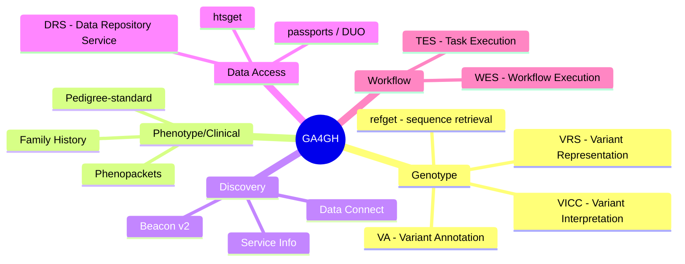
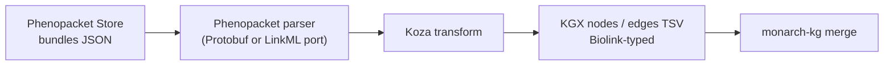

# 07 — GA4GH: VRS, VA, Phenopackets, Pedigree, Beacon → LinkML

> **Status**: Active
> **Date**: 2026-07-10
> **Author**: @shahin
> **Audience**: engineers
> **Tags**: `engineering`
> **Variants**: Technical (this doc) - Readable (07_ga4gh.md in Obsidian vault: 04-Engineering/cytos/schemas-ontologies/linkml-playbook/) - Agent (n/a)

> **Goal** – inventory and convert the GA4GH schema family (genotype +
> phenotype + clinical) to LinkML so you know what's already covered
> before extending Cytognosis.
> **Time** – 90 minutes.
> **Prereqs** – chapters 01, 02, 04 (Biolink). Chapter 06 (BioThings)
> is optional context.

---

## What GA4GH ships

GA4GH (the Global Alliance for Genomics & Health) maintains a family of
data and API standards. Most are JSON-Schema-based; a few have native
LinkML ports.



### The four you actually need first

| Standard | Domain | Source format | Status |
| --- | --- | --- | --- |
| **VRS** | Variant representation (alleles, locations, copies) | YAML JSON Schema | Stable (2.x) |
| **VA** | Variant annotation / interpretation | YAML JSON Schema | Active draft |
| **Phenopackets** | Per-patient clinical phenotype packet | Protobuf + LinkML port | Stable (2.0) |
| **Pedigree** | Family relationships / inheritance | JSON Schema | Stable |

Plus one bonus you'll trip over the moment you ingest variant data:

- **Beacon v2** — discovery API; OpenAPI + JSON Schemas. Useful if you
  expose Cytognosis variant data externally.

---

## 1. VRS — Variant Representation Specification

VRS is the GA4GH standard for canonically representing genomic variants:
alleles, copy-number changes, haplotypes, genotypes, and their precise
locations on a reference sequence. Anything that ingests variant data
should land in VRS shapes — it's the gravity well in this corner of
the standards landscape.

Repo: https://github.com/ga4gh/vrs
Python: `pip install ga4gh-vrs`

### 1.1 Pull the schema

```bash
mkdir -p downloads/ga4gh/vrs
git clone --depth 1 https://github.com/ga4gh/vrs downloads/ga4gh/vrs/src
ls downloads/ga4gh/vrs/src/schema/
# vrs/  (YAML JSON Schema source)
ls downloads/ga4gh/vrs/src/schema/vrs/
# vrs-source.yaml   <-- canonical
# json/             <-- compiled JSON Schema bundles
```

### 1.2 Convert to LinkML

VRS ships its source as YAML-flavored JSON Schema (one file with
`$defs` for every class). `schemauto` reads JSON Schema directly:

```bash
# Convert YAML JSON Schema → JSON JSON Schema (schemauto wants json)
python -c "
import yaml, json
src = yaml.safe_load(open('downloads/ga4gh/vrs/src/schema/vrs/vrs-source.yaml'))
json.dump(src, open('downloads/ga4gh/vrs/vrs-source.json', 'w'), indent=2)
"

schemauto import-jsonschema \
  downloads/ga4gh/vrs/vrs-source.json \
  --output schemas/ga4gh/vrs.yaml \
  --use-attributes      # keeps nested types inline; tidier first pass
```

### 1.3 What you get

VRS classes (after conversion):

| Class | Purpose |
| --- | --- |
| `Allele` | A specific sequence change at a Location |
| `CopyNumberCount` | Discrete CN value at a location |
| `CopyNumberChange` | Categorical CN change (gain/loss) |
| `Haplotype` | Set of co-occurring alleles in cis |
| `Genotype` | Set of haplotypes/alleles in a sample |
| `SequenceLocation` | Position on a reference sequence |
| `LiteralSequenceExpression` | The actual nucleotide(s) |
| `ReferenceLengthExpression` | Reference-relative changes |

### 1.4 Use VRS Pydantic from `ga4gh-vrs`

Don't always re-codegen from your converted LinkML — for VRS you
can take the official Python bindings and treat them as your runtime
model, while keeping the LinkML version for documentation/ERD/SHACL.

```python
from ga4gh.vrs import models

a = models.Allele(
    location=models.SequenceLocation(
        sequenceReference=models.SequenceReference(refgetAccession="SQ.IIB53T8CNeJJdUqzn9V_JnRtQadwWCbl"),
        start=140453135,
        end=140453136,
    ),
    state=models.LiteralSequenceExpression(sequence="T"),
)
print(a.model_dump_json(indent=2))
```

For Cytognosis: import VRS into your master schema as a subschema,
codegen Pydantic, and then inherit your domain classes from VRS classes
where they apply (e.g., `CytoVariantCall is_a: ga4gh:Allele`).

---

## 2. VA — Variant Annotation Specification

Repo: https://github.com/ga4gh/va-spec

VA layers on top of VRS to express *what we know about a variant*:
clinical significance, drug response, oncogenicity, functional
impact — all as typed, evidence-bearing statements.

```bash
git clone --depth 1 https://github.com/ga4gh/va-spec downloads/ga4gh/va-spec
# Schema lives at:
ls downloads/ga4gh/va-spec/schema/va-spec/
```

VA is in earlier maturity than VRS and the schema layout has been
moving. Recipe is the same:

```bash
python -c "
import yaml, json, glob, os
for y in glob.glob('downloads/ga4gh/va-spec/schema/**/*.yaml', recursive=True):
    src = yaml.safe_load(open(y))
    j = y.replace('.yaml', '.json')
    json.dump(src, open(j, 'w'), indent=2)
"
schemauto import-jsonschema \
  downloads/ga4gh/va-spec/schema/va-spec/profiles/study-statements.json \
  --output schemas/ga4gh/va_statements.yaml
```

Key VA concepts you'll convert: `Statement`, `Evidence`, `Method`,
`VariantPathogenicityProposition`, `VariantTherapeuticResponseProposition`.
These are the right citizens to align Cytognosis's clinical-evidence
edges to.

---

## 3. Phenopackets

Repos:
- Upstream Protobuf source: https://github.com/phenopackets/phenopacket-schema
- **Community LinkML port (use this): https://github.com/cmungall/linkml-phenopackets**
  - Docs site: https://cmungall.github.io/linkml-phenopackets/

Python:
- `pip install phenopackets` — Protobuf-generated bindings.
- `pip install linkml-phenopackets` (or install from the repo) — LinkML-derived
  Pydantic + the canonical LinkML YAML.

A Phenopacket bundles, for one subject:

- demographics
- phenotypic features (HPO terms with onset/severity)
- diseases (MONDO/OMIM)
- genomic interpretations (variants, including VRS expressions)
- biosamples
- pedigree relationships
- meta-data (resources, ontologies used)

### 3.1 LinkML route (preferred): cmungall/linkml-phenopackets

Chris Mungall (Berkeley Lab / Monarch) maintains a working LinkML port
of the Phenopacket schema. It mirrors the Protobuf model 1:1 in LinkML
YAML and is the cleanest way to bring Phenopackets into a LinkML-first
stack like Cytognosis.

```bash
git clone --depth 1 https://github.com/cmungall/linkml-phenopackets \
  downloads/ga4gh/linkml-phenopackets

# Canonical schema files live here:
ls downloads/ga4gh/linkml-phenopackets/src/linkml_phenopackets/schema/
# phenopackets.yaml  base.yaml  individual.yaml  measurement.yaml ...
```

Copy the YAML you want into your `schemas/` tree, or import directly:

```yaml
# schemas/cytognosis/master.yaml (delta)
imports:
  - file:./../downloads/ga4gh/linkml-phenopackets/src/linkml_phenopackets/schema/phenopackets
```

Then codegen Pydantic and validate as usual:

```bash
gen-pydantic downloads/ga4gh/linkml-phenopackets/src/linkml_phenopackets/schema/phenopackets.yaml \
  > build/phenopackets_pydantic.py

linkml-validate \
  --schema downloads/ga4gh/linkml-phenopackets/src/linkml_phenopackets/schema/phenopackets.yaml \
  --target-class Phenopacket \
  data/sample_phenopacket.json
```

### 3.2 Why this beats hand-converting

- **Already 1:1 with the upstream Protobuf** — Chris's port keeps
  alignment with the GA4GH releases, so you don't rebuild from scratch
  every time `phenopacket-schema` bumps a minor.
- **Has a hosted docs site** — https://cmungall.github.io/linkml-phenopackets/
  with class/slot reference pages that mirror the LinkML source.
- **Plays nicely with VRS** — when you wire VRS into your master
  schema, the Phenopacket `VariationDescriptor` slots that reference
  alleles can be re-pointed at `ga4gh:Allele` directly.

### 3.3 Protobuf fallback (only if you need a feature not yet in the LinkML port)

```bash
# Compile .proto -> JSON Schema, then schemauto
pip install protobuf-jsonschema
protoc --jsonschema_out=downloads/ga4gh/phenopacket-jsonschema/ \
       downloads/ga4gh/phenopacket-schema/src/main/proto/*.proto

schemauto import-jsonschema \
  downloads/ga4gh/phenopacket-jsonschema/Phenopacket.json \
  --output schemas/ga4gh/phenopacket/phenopackets.yaml
```

If you find yourself doing this, file an issue at
https://github.com/cmungall/linkml-phenopackets — it's likely just a
release-lag thing.

### 3.4 phenopacket-ingest — Monarch's production ingest pipeline

Repo: https://github.com/monarch-initiative/phenopacket-ingest

`phenopacket-ingest` is the canonical example of *Phenopackets-as-data
into a Biolink-shaped KG*. It's worth knowing about even if you don't
adopt it directly, because it's the cleanest reference architecture for
how clinical cases enter Monarch (and could enter Cytognosis).

**What it does, in three steps:**

1. Pulls phenopacket JSON bundles from upstream sources — Phenopacket
   Store, ClinGen, GA4GH catalog repositories.
2. Per phenopacket, materializes a small Biolink subgraph:
   `Case → has_phenotype → PhenotypicFeature`, `has_disease → Disease`,
   optional `Variant` nodes with `affects` edges, sometimes
   `Interpretation` and `BiologicalSample` nodes.
3. Emits **Biolink-conformant KGX TSVs** ready for `kgx merge` into the
   Monarch KG.



**Where LinkML sits in this pipeline:**

| Layer | LinkML status |
| --- | --- |
| **Output (KGX nodes/edges)** | **Already LinkML / Biolink** — Koza emits Biolink Pydantic instances, which serialize to KGX TSV that re-validates against the Biolink LinkML schema. |
| **Transform configs** | **Already LinkML-driven** — Koza is built on LinkML's runtime, with `transform_source.yaml` being a LinkML-validated Koza config. |
| **Input parsing** | **In transition.** Historic transforms used the GA4GH Protobuf bindings (`from phenopackets import Phenopacket`). The LinkML-native path is to swap that for `cmungall/linkml-phenopackets` Pydantic models and `linkml-validate` on the JSON before parsing. As of writing, the upstream repo has issues open exploring exactly this swap; the migration isn't fully complete. |

So the answer to "is phenopacket-ingest LinkML?" is: yes for output and
configs, in-progress for input parsing. The substitution is mechanical
once the LinkML port reaches feature parity.

**What that means for Cytognosis:**

- If you build a clinical-cohort ingest from EHR-exported phenopackets,
  the right pattern is exactly the one in `phenopacket-ingest`:
  Koza source config + per-phenopacket transform → KGX → merge with
  `cytognosis-kg`.
- For input parsing, prefer **`linkml-phenopackets` Pydantic** over
  Protobuf — clean Pydantic v2, built-in pattern/range validation, and
  it slots into your existing LinkML stack rather than introducing
  Protobuf-only dependencies.
- For output, you get Biolink-shaped data for free — that's the whole
  point of using Koza.

**Pre-ingest validation hook (worth wiring into CI):**

```bash
linkml-validate \
  --schema downloads/ga4gh/linkml-phenopackets/src/linkml_phenopackets/schema/phenopackets.yaml \
  --target-class Phenopacket \
  data/inbound_phenopackets/*.json
```

Reject malformed bundles before Koza ever sees them.

**Deeper dive:** chapter 16 walks through the ingest end-to-end with a
runnable Koza example. This section is about *placement* in the GA4GH
landscape; chapter 16 is about *building one*.

---

## 4. Pedigree Standard

Repo: https://github.com/ga4gh/pedigree-standard

Encodes family relationships, sex, affected status, twin/triplet
groupings, and the inheritance hypotheses behind clinical
interpretations.

### 4.1 Pull and convert

```bash
git clone --depth 1 https://github.com/ga4gh/pedigree-standard \
  downloads/ga4gh/pedigree-standard
ls downloads/ga4gh/pedigree-standard/schema/

# Schema is JSON Schema (sometimes wrapped in YAML) — same recipe
python -c "
import yaml, json
src = yaml.safe_load(open('downloads/ga4gh/pedigree-standard/schema/pedigree.yaml'))
json.dump(src, open('downloads/ga4gh/pedigree-standard/schema/pedigree.json','w'), indent=2)
"
schemauto import-jsonschema \
  downloads/ga4gh/pedigree-standard/schema/pedigree.json \
  --output schemas/ga4gh/pedigree.yaml
```

### 4.2 Key classes

| Class | Purpose |
| --- | --- |
| `Pedigree` | Top-level family + relationships container |
| `Individual` | One person; sex, vital status, affected status |
| `RelationshipBetweenIndividuals` | Parent-of, twin-of, sibling-of, ... |
| `FamilyHistory` | Conditions reported but not directly observed |

For Cytognosis: a `CohortMember` could `is_a: ga4gh:Individual`, and
patient-pedigree contributions naturally use the `Pedigree` shape.

---

## 5. Beacon v2 (bonus)

Repo: https://github.com/ga4gh-beacon/beacon-v2

Beacon is the GA4GH discovery protocol — "do you have any individuals
with this variant?" The v2 spec is OpenAPI + a set of JSON Schemas for
its entities (Cohort, Individual, Biosample, GenomicVariation, Run,
Analysis).

```bash
git clone --depth 1 https://github.com/ga4gh-beacon/beacon-v2 downloads/ga4gh/beacon-v2

for y in downloads/ga4gh/beacon-v2/models/json/beacon-v2-default-model/*/defaultSchema.json; do
  name=$(basename $(dirname "$y"))
  schemauto import-jsonschema "$y" \
    --output "schemas/ga4gh/beacon/${name}.yaml"
done
```

The Beacon entities reuse VRS for variation, so once you've imported
VRS you can edit Beacon's `GenomicVariation` slot ranges to point at
`ga4gh:Allele` directly.

---

## 6. Master integration

```yaml
# schemas/cytognosis/master.yaml (delta)
imports:
  - linkml:types
  - https://w3id.org/biolink/biolink-model
  - sssom_schema:sssom_schema
  - ../ga4gh/vrs                  # genotype core
  - ../ga4gh/va_statements        # clinical evidence statements
  - ../ga4gh/phenopacket/phenopackets
  - ../ga4gh/pedigree
  - ../ga4gh/beacon/individual
  - ../ga4gh/beacon/biosample
  - ./scholarly
  - ./artifacts
  - ./cell
  - ./mappings
```

Your Cytognosis-specific subclasses then attach:

```yaml
classes:
  CytoVariantCall:
    is_a: ga4gh:Allele
    description: A variant call observed in a Cytognosis cohort.
    slots:
      - cohort_id
      - sample_id
      - vaf            # variant allele frequency

  CytoCohortMember:
    is_a: ga4gh:Individual
    mixins: [HasROCrateMetadata]

  CytoClinicalStatement:
    is_a: ga4gh:Statement
    description: Cohort-derived pathogenicity / response statement.
```

---

## 7. Bulk converter (mirrors the DDE pattern)

```python
# scripts/ga4gh_dump_to_linkml.py
"""Convert a curated set of GA4GH schemas to LinkML in one pass."""
import subprocess, json, yaml, pathlib, glob, sys

JOBS = [
    # (jsonschema_path, output_yaml_path)
    ("downloads/ga4gh/vrs/vrs-source.json",
     "schemas/ga4gh/vrs.yaml"),
    ("downloads/ga4gh/pedigree-standard/schema/pedigree.json",
     "schemas/ga4gh/pedigree.yaml"),
    *[
        (j, f"schemas/ga4gh/beacon/{pathlib.Path(j).parent.name}.yaml")
        for j in glob.glob("downloads/ga4gh/beacon-v2/models/json/"
                            "beacon-v2-default-model/*/defaultSchema.json")
    ],
]

# YAML -> JSON conversion for sources that ship YAML JSON Schema
def yaml_to_json(yaml_path):
    j = yaml_path.replace(".yaml", ".json")
    json.dump(yaml.safe_load(open(yaml_path)), open(j, "w"), indent=2)
    return j

failures = []
for src, out in JOBS:
    pathlib.Path(out).parent.mkdir(parents=True, exist_ok=True)
    try:
        subprocess.check_call(
            ["schemauto", "import-jsonschema", src,
             "--output", out, "--use-attributes"])
        print(f"OK  {src}  ->  {out}")
    except Exception as e:
        failures.append((src, str(e)))
        print(f"!!  {src}: {e}", file=sys.stderr)
print(f"\n{len(JOBS)-len(failures)}/{len(JOBS)} ok")
```

---

## 8. Hands-on

1. Clone VRS and convert to LinkML; codegen Pydantic; round-trip the
   `Allele` example from §1.4 through your generated class (it should
   match `ga4gh.vrs.models.Allele.model_dump()`).
2. Pull the Phenopackets repo; check whether `src/schema/*.yaml` ships
   LinkML in your release. If yes, import directly; if no, use the
   Protobuf-via-JSON-Schema fallback.
3. Convert pedigree.yaml → LinkML.
4. Add the imports to a `schemas/ga4gh/master.yaml` and run
   `gen-erdiagram` — verify VRS, Phenopacket, and Pedigree classes are
   all in the diagram.
5. Define `CytoVariantCall` and validate one example call against it.

---

## 9. Pitfalls

- **VRS 1.x vs 2.x** — the breaking change moved IDs from `_id` to a
  digest-based `id`. Pin the VRS major version in `pyproject.toml`.
- **`ga4gh-vrs` Pydantic vs LinkML-codegen Pydantic** — both exist;
  pick one as the runtime authority and stick with it.
- **Phenopackets has multiple "schema" representations**: Protobuf
  (`phenopackets` PyPI), LinkML (in-repo), JSON Schema (compiled). Pick
  one as your import source; document the choice.
- **Pedigree has GA4GH and ClinGen flavors.** Use the GA4GH
  `pedigree-standard` repo, not the ClinGen branch, unless you have a
  ClinGen-specific reason.
- **Beacon JSON Schemas use `$ref` heavily across files.** Bundle with
  `json-dereference-cli` first, or `schemauto` will choke on cross-file
  refs.
- **VRS uses content-derived IDs.** Don't manually mint
  `ga4gh:VA.<digest>` IDs — let `ga4gh.vrs` compute them.

---

## Further reading

- GA4GH home: https://www.ga4gh.org/
- VRS: https://vrs.ga4gh.org/
- VA spec: https://va-ga4gh.readthedocs.io/
- Phenopackets (Protobuf upstream): https://phenopacket-schema.readthedocs.io/
- Phenopackets (LinkML port, **use this**): https://cmungall.github.io/linkml-phenopackets/ — repo https://github.com/cmungall/linkml-phenopackets
- Pedigree standard: https://github.com/ga4gh/pedigree-standard
- Beacon v2: https://docs.genomebeacons.org/
- ga4gh-vrs Python: https://github.com/ga4gh/vrs-python
- All GA4GH products index: https://www.ga4gh.org/our-products/
