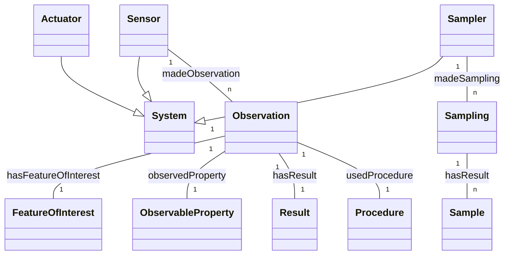

# 08 — SOSA / SSN → LinkML

> **Status**: Active
> **Date**: 2026-07-10
> **Author**: @shahin
> **Audience**: engineers
> **Tags**: `engineering`
> **Variants**: Technical (this doc) - Readable (Obsidian twin optional, same filename) - Agent (n/a)

> **Goal** – take W3C's SOSA (Sensors, Observations, Samples, Actuators)
> and SSN (Semantic Sensor Network) and produce a LinkML schema for
> instrument/observation modeling in the Cytognosis KG.
> **Time** – 40 minutes.
> **Prereqs** – chapters 01, 02, 04 (Biolink).

---

## Why SOSA/SSN

Cytognosis v0.4.0 already has an `Instrument` class. SOSA gives you the
W3C-blessed vocabulary for *what an instrument does*: it makes
`Observations` of `Properties` of `FeatureOfInterest`s, with
`Procedure`s, generating `Results`. Adopting SOSA means your instrument
metadata is interoperable with environmental, IoT, and biomedical
sensor data.



---

## 1. Pull the OWL/TTL sources

```bash
mkdir -p downloads/sosa_ssn
curl -L -o downloads/sosa_ssn/sosa.ttl  https://www.w3.org/ns/sosa/
curl -L -o downloads/sosa_ssn/ssn.ttl   https://www.w3.org/ns/ssn/
```

Inspect:

```bash
rapper -i turtle -c downloads/sosa_ssn/sosa.ttl    # row count
head -60 downloads/sosa_ssn/sosa.ttl
```

---

## 2. Convert with `schemauto import-rdfs`

The OWL/RDFS importer lives in **`schema-automator`** (CLI: `schemauto`),
not core LinkML — `gen-linkml` only re-emits existing LinkML YAML/JSON.

```bash
pip install schema-automator

schemauto import-rdfs \
  downloads/sosa_ssn/sosa.ttl \
  --output schemas/sosa_ssn/sosa.yaml

schemauto import-rdfs \
  downloads/sosa_ssn/ssn.ttl \
  --output schemas/sosa_ssn/ssn.yaml
```

For OWL-strict semantics (treats `owl:Class` and `owl:ObjectProperty`
explicitly, ignores RDFS-only constructs), use `schemauto import-owl`
instead.

Then merge or import-chain them. SSN already extends SOSA, so:

```yaml
# schemas/sosa_ssn/sosa_ssn.yaml
id: https://cytognosis.org/schemas/sosa_ssn
name: sosa_ssn
prefixes:
  sosa:   http://www.w3.org/ns/sosa/
  ssn:    http://www.w3.org/ns/ssn/
  linkml: https://w3id.org/linkml/
default_prefix: sosa
imports:
  - linkml:types
  - ./sosa
  - ./ssn
```

---

## 3. Tighten the auto-generated YAML

Auto-conversion gives you all classes/properties but no domain-specific
constraints. Layer a Cytognosis subclass on top.

```yaml
# schemas/cytognosis/instruments.yaml
imports:
  - linkml:types
  - ../sosa_ssn/sosa_ssn

classes:
  CytoSensor:
    is_a: sosa:Sensor
    description: A laboratory instrument acting as a SOSA Sensor.
    slots:
      - manufacturer
      - model
      - serial_number
      - calibration_protocol
    slot_usage:
      id:
        pattern: "^cyto:Instrument/"

  CytoObservation:
    is_a: sosa:Observation
    description: A measurement event produced by a CytoSensor.
    slot_usage:
      hasFeatureOfInterest:
        range: BiologicalSample
      observedProperty:
        range: AssayProperty
      usedProcedure:
        range: Protocol

  AssayProperty:
    is_a: sosa:ObservableProperty
    slots: [unit, ontology_term]
    slot_usage:
      ontology_term:
        range: uriorcurie
        pattern: "^(NCIT|EFO|OBI):[0-9]+$"

  BiologicalSample:
    is_a: sosa:FeatureOfInterest
    slots: [donor_id, tissue_ontology_term_id, processing_date]
```

---

## 4. Validate a sample observation record

```yaml
# data/observation.yaml
id: cyto:Observation/0001
hasFeatureOfInterest:
  id: cyto:Sample/AML-12
  donor_id: D001
  tissue_ontology_term_id: UBERON:0002371   # bone marrow
  processing_date: 2026-04-30
observedProperty:
  id: cyto:Property/cell_count
  ontology_term: NCIT:C25463
  unit: cells/uL
hasResult:
  numericalValue: 4250
usedProcedure:
  id: cyto:Protocol/flow_cytometry_v3
madeBySensor:
  id: cyto:Instrument/cytof-helios-001
  manufacturer: Standard BioTools
  model: Helios
  serial_number: HE-12345
```

```bash
linkml-validate \
  --schema schemas/cytognosis/master.yaml \
  --target-class CytoObservation \
  data/observation.yaml
```

---

## 5. Codegen

```bash
gen-pydantic schemas/cytognosis/master.yaml > build/cyto.py
gen-erdiagram schemas/cytognosis/master.yaml > build/cyto.mmd
```

The ER diagram now shows your `CytoSensor` plugged cleanly into the
SOSA hierarchy.

---

## 6. Hands-on

1. Run `schemauto import-rdfs` on `sosa.ttl` and `ssn.ttl`.
2. Skim the produced YAMLs — note the `class_uri` mappings to W3C IRIs.
3. Define `CytoSensor` and `CytoObservation` in
   `schemas/cytognosis/instruments.yaml`.
4. Validate the `observation.yaml` example above.

---

## 7. Pitfalls

- **OWL property direction** — `schemauto import-rdfs` may emit slots on
  the inverse class. Double-check `madeObservation` / `madeBySensor` direction.
- **`xsd:dateTime` vs LinkML `datetime`** — handled, but if you see
  `xsd:dateTime` raw in the YAML, upgrade `schema-automator`.
- **SOSA's `hasResult`** is a deliberately abstract slot. Subclass it
  per assay (`CountResult`, `ConcentrationResult`).
- **Don't redeclare SOSA properties.** Use `slot_usage` to constrain;
  the original `sosa:hasResult` URI must be preserved for interop.

---

## Further reading

- SOSA/SSN W3C Rec: https://www.w3.org/TR/vocab-ssn/
- LinkML OWL generator: https://linkml.io/linkml/generators/owl.html
- The W3C/OGC SDW WG SOSA repo: https://github.com/w3c/sdw-sosa-ssn
