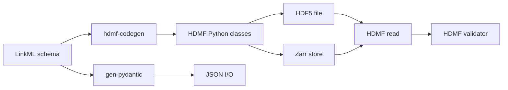
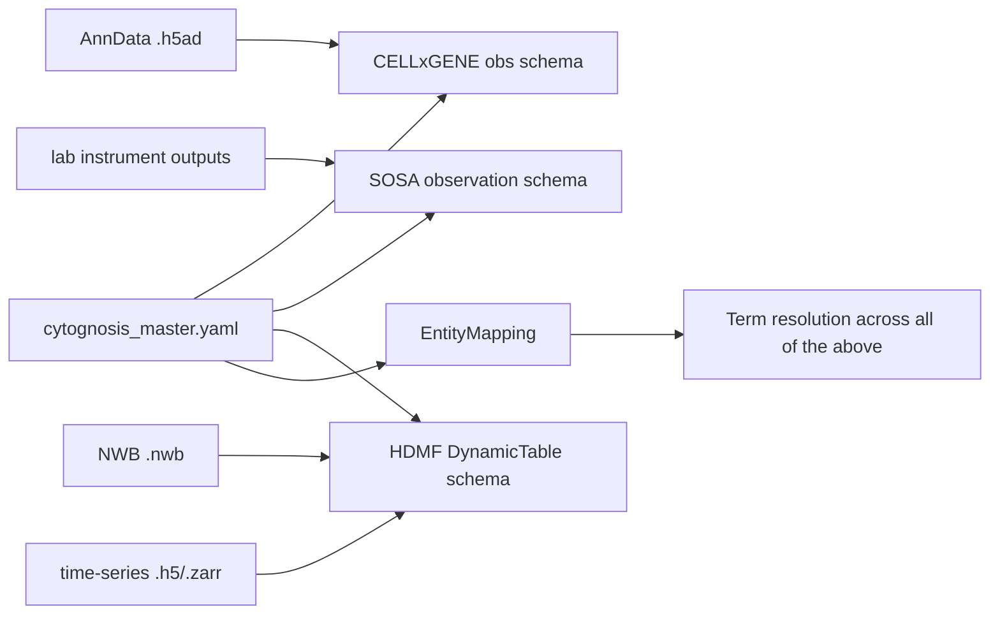

# 10 — HDMF and NWB: schema-driven hierarchical scientific data

> **Status**: Active
> **Date**: 2026-07-10
> **Author**: @shahin
> **Audience**: engineers
> **Tags**: `engineering`
> **Variants**: Technical (this doc) - Readable (Obsidian twin optional, same filename) - Agent (n/a)

> **Goal** – understand HDMF (the Hierarchical Data Modeling Framework
> behind NWB), where it overlaps with LinkML, and how to integrate it
> into a LinkML-first Cytognosis stack for HDF5/Zarr-backed scientific
> data.
> **Time** – 60 minutes.
> **Prereqs** – chapters 01, 02, 04 (Biolink), 08 (CELLxGENE).

---

## Why this chapter exists

`AnnData` (chapter 10) is great for single-cell tabular metadata in an
HDF5 container. The moment you need anything richer — neurophysiology
recordings, time-series imaging, electrophysiology traces, multi-modal
hierarchical experiments — you're in HDMF/NWB territory. HDMF predates
LinkML's wide adoption but the two are converging: HDMF schemas can now
be expressed in LinkML, and HDMF's I/O backends give you something
LinkML alone doesn't — *strongly-typed read/write of HDF5/Zarr files
against a schema*.



LinkML defines the schema; HDMF turns that schema into hierarchical
binary I/O.

---

## What ships under the HDMF umbrella

| Component | What it is | Repo |
| --- | --- | --- |
| **HDMF core** | Schema language, container model, HDF5/Zarr I/O | https://github.com/hdmf-dev/hdmf |
| **hdmf-common-schema** | Standard data types: `DynamicTable`, `VectorData`, `CSRMatrix`, etc. | https://github.com/hdmf-dev/hdmf-common-schema |
| **hdmf-experimental** | Newer types not yet in common (e.g., enum support) | https://github.com/hdmf-dev/hdmf-experimental |
| **HERD** (HDMF External Resources Database) | Cross-reference datasets with terminologies/ontologies (think: SSSOM for HDF5) | https://github.com/hdmf-dev/hdmf in the `hdmf.term_set` module |
| **HDMF Schema Language (HDMF-SLF)** | The original YAML format for defining HDMF schemas | https://hdmf-schema-language.readthedocs.io/ |
| **HDMF-Z (zarr-io)** | Zarr backend for HDMF files | https://github.com/hdmf-dev/hdmf-zarr |
| **NWB Schema** | The neurophysiology-specific schema built on HDMF | https://github.com/NeurodataWithoutBorders/nwb-schema |
| **PyNWB** | Python NWB API built on HDMF | https://github.com/NeurodataWithoutBorders/pynwb |
| **MatNWB** | MATLAB NWB API | https://github.com/NeurodataWithoutBorders/matnwb |
| **NWB Inspector** | Validation + best-practice linter | https://github.com/NeurodataWithoutBorders/nwbinspector |
| **DANDI** | NWB data archive + CLI | https://dandiarchive.org/ |

---

## 1. The HDMF data model in 60 seconds

HDMF describes hierarchical scientific data with three primitives:

| Primitive | Maps to (HDF5) | Mental model |
| --- | --- | --- |
| **Group** | HDF5 group | Folder / container |
| **Dataset** | HDF5 dataset | N-dimensional array |
| **Attribute** | HDF5 attribute | Inline metadata |

Plus three abstractions HDMF layers on top:

| Abstraction | Purpose |
| --- | --- |
| **Container** | Python-side object wrapping a Group; has typed slots |
| **DynamicTable** | Tabular data with extensible columns; one of the most useful HDMF types |
| **VectorData / VectorIndex** | Ragged columns (variable-length per row) inside a DynamicTable |

`DynamicTable` is the HDMF answer to pandas DataFrames inside HDF5 with
schema-validated columns and ragged-array support. Once you internalize
it, a lot of "where do I put this metadata in my HDF5?" problems
collapse.

---

## 2. HDMF schemas vs LinkML

HDMF historically used its own schema language (HDMF-SLF, also known as
the HDMF Schema Language). It looks like this:

```yaml
groups:
  - neurodata_type_def: TimeSeries
    neurodata_type_inc: NWBDataInterface
    doc: General time-series data
    datasets:
      - name: data
        dtype: numeric
        dims: [num_times, num_channels]
      - name: timestamps
        dtype: float64
        dims: [num_times]
    attributes:
      - name: unit
        dtype: text
```

That's its own DSL — purpose-built for HDF5 hierarchical data, but
incompatible with the rest of the LinkML ecosystem.

The bridges:

| Direction | Tool | Status |
| --- | --- | --- |
| HDMF-SLF → LinkML | `hdmf2linkml` (community) | Working for many schemas; edge cases for complex includes |
| LinkML → HDMF-SLF | `linkml2hdmf` (community) | Earlier maturity |
| LinkML → HDF5 directly | `linkml-arrays` | Active development; bypasses HDMF |
| HDMF Python classes | hand-written + `pynwb` codegen | Mature |

For Cytognosis the practical recipe is: keep your authoritative schema
in LinkML, convert to HDMF-SLF when you need HDMF I/O, regenerate on
schema changes.

---

## 3. Hands-on: install + inspect

```bash
pip install hdmf pynwb hdmf-zarr nwbinspector dandi
python -c "
import hdmf, pynwb
print('hdmf  ', hdmf.__version__)
print('pynwb ', pynwb.__version__)
"
```

Pull the canonical schemas:

```bash
mkdir -p downloads/hdmf
git clone --depth 1 https://github.com/hdmf-dev/hdmf-common-schema downloads/hdmf/common
git clone --depth 1 https://github.com/NeurodataWithoutBorders/nwb-schema downloads/hdmf/nwb-schema
ls downloads/hdmf/common/common/
# base.yaml  table.yaml  resources.yaml  ...
```

---

## 4. Read/write a DynamicTable (the everyday case)

```python
# scripts/dynamic_table_demo.py
from datetime import datetime
import numpy as np
from hdmf.common import DynamicTable, VectorData
from hdmf.backends.hdf5 import HDF5IO
from hdmf.common import get_manager

# 1. Build a DynamicTable in memory
table = DynamicTable(
    name="cell_metadata",
    description="Per-cell harmonized metadata",
    columns=[
        VectorData(name="cell_id",
                   description="Cell identifier",
                   data=["c001", "c002", "c003"]),
        VectorData(name="cell_type_ontology_term_id",
                   description="CL term ID",
                   data=["CL:0000084", "CL:0000236", "CL:0000084"]),
        VectorData(name="umi_count",
                   description="Total UMI counts",
                   data=np.array([42513, 31108, 38990])),
    ],
)

# 2. Write to HDF5
with HDF5IO("build/cell_metadata.h5", mode="w", manager=get_manager()) as io:
    io.write(table)

# 3. Read back
with HDF5IO("build/cell_metadata.h5", mode="r", manager=get_manager()) as io:
    t = io.read()
    print(t.to_dataframe())
```

> **Checkpoint** – the file is ~tens of KB; reading it round-trips to a
> pandas DataFrame.

---

## 5. HERD: external-resource references inside HDMF files

HERD lets you attach **typed, validated terminology references** to any
slot in an HDMF file — the equivalent of an SSSOM mapping but stored
inline in the binary container.

```python
from hdmf.term_set import TermSet, TermSetWrapper
from hdmf.common import VectorData

# Define a TermSet from an external ontology (here: a tiny CL subset)
cl_terms = TermSet(term_schema_path="schemas/cl_terms.yaml")
# Wrap a column so values must come from the term set
col = VectorData(
    name="cell_type",
    description="Cell type from CL",
    data=TermSetWrapper(value=["CL:0000084", "CL:0000236"], termset=cl_terms),
)
```

Why this matters for Cytognosis: combined with chapter 14's SSSOM work,
HERD gives you a way to enforce that a column in an HDF5 file uses
controlled-vocabulary IDs that you've already mapped/validated upstream.

---

## 6. NWB as a worked HDMF use case

NWB (Neurodata Without Borders) is the largest production HDMF schema.
It defines neurophysiology types: `TimeSeries`, `ElectricalSeries`,
`BehavioralEvents`, `OpticalChannel`, `Subject`, `Session`, etc.

```python
from datetime import datetime
from pynwb import NWBFile, TimeSeries, NWBHDF5IO
import numpy as np

nwbfile = NWBFile(
    session_description="Demo recording",
    identifier="abc-123",
    session_start_time=datetime.now().astimezone(),
)
ts = TimeSeries(
    name="V1_response",
    data=np.random.randn(1000, 8),
    unit="V",
    timestamps=np.arange(1000) * 0.001,
)
nwbfile.add_acquisition(ts)
with NWBHDF5IO("build/demo.nwb", mode="w") as io:
    io.write(nwbfile)
```

For Cytognosis-relevant workloads, NWB is overkill — but its
*infrastructure* (DynamicTable + HERD + schema-driven HDF5) is the
exact pattern we'd want for richly-annotated single-cell-plus-imaging
data sets that don't fit AnnData's two-axis world.

---

## 7. Convert HDMF schemas to LinkML

Two paths.

### 7.1 Path A — community tool

```bash
pip install hdmf-linkml          # name varies; see PR/repo links below
hdmf2linkml \
  downloads/hdmf/common/common/table.yaml \
  --output schemas/hdmf/dynamic_table.yaml
```

This converter is community-maintained and not always perfectly aligned
with the latest HDMF-SLF features. Inspect the output and tighten by
hand.

### 7.2 Path B — script using HDMF's own loader

If the converter package isn't installable in your environment, you can
walk HDMF's loaded schemas with HDMF's Python API and emit LinkML:

```python
# scripts/hdmf_to_linkml.py (sketch)
from hdmf.spec import NamespaceCatalog, SpecReader
from pathlib import Path
import yaml

ns_path = "downloads/hdmf/common/common/namespace.yaml"
catalog = NamespaceCatalog()
catalog.load_namespaces(ns_path)

linkml_classes = {}
for spec in catalog.get_namespace("hdmf-common").get_registered_types():
    typ_spec = catalog.get_spec("hdmf-common", spec)
    linkml_classes[spec] = {
        "is_a": typ_spec.get("neurodata_type_inc", "Container"),
        "description": typ_spec.get("doc"),
        # walk datasets/attributes -> slots …
    }

doc = {
    "id": "https://cytognosis.org/schemas/hdmf_common",
    "name": "hdmf_common",
    "imports": ["linkml:types"],
    "classes": linkml_classes,
}
Path("schemas/hdmf/hdmf_common.yaml").write_text(yaml.safe_dump(doc, sort_keys=False))
```

Output is rough; treat it as a starting point and curate.

---

## 8. The other direction: LinkML → HDF5

If your authoritative schema is LinkML and you want HDF5 I/O without
detouring through HDMF-SLF, look at `linkml-arrays`:

- Repo: https://github.com/linkml/linkml-arrays
- Targets HDF5 and Zarr backends from LinkML class definitions
- Currently best for array-heavy schemas (less feature-complete than HDMF)

```bash
pip install linkml-arrays

# Generate HDF5 I/O classes from a LinkML schema with array slots
gen-array-classes schemas/cytognosis/cell.yaml \
  --output build/cell_io.py
```

Where this fits the decision matrix:

| Need | Pick |
| --- | --- |
| Pure tabular AnnData | `anndata` (chapter 10) |
| Hierarchical time-series, multi-modal experiments | **HDMF / NWB** |
| LinkML-first schema, simple HDF5 array I/O | **linkml-arrays** |
| LinkML-first schema, complex HDMF-style hierarchy | **LinkML → hdmf2linkml round-trip** (acknowledge sharp edges) |
| Cross-species KG nodes/edges | BioCypher (chapter 16), Koza (chapter 18) |

---

## 9. Where this slots into the Cytognosis stack



For the practical near-term:

1. Author cell-metadata schemas in LinkML.
2. Project to HDMF-SLF only if a partner pipeline expects an NWB-like
   binary format.
3. Use HERD for any HDMF file that carries ontology-bound columns —
   it's how you keep the binary representation honest about the SSSOM
   mappings you generated upstream.
4. Reach for `linkml-arrays` first, HDMF second, when you need new
   HDF5 I/O. HDMF is the right answer when you want NWB-ecosystem
   interop; `linkml-arrays` when you don't.

---

## 10. Hands-on

1. `pip install hdmf pynwb hdmf-zarr nwbinspector`.
2. Run §4's DynamicTable demo end-to-end.
3. Run §6's NWB demo and validate with
   `nwbinspector build/demo.nwb`.
4. Pull `hdmf-common-schema` and convert one schema file
   (`table.yaml`) to LinkML using the path-A tool or path-B script.
5. Define one Cytognosis class as a LinkML mirror of HDMF's
   `DynamicTable` and codegen Pydantic.

---

## 11. Pitfalls

- **HDMF-SLF and LinkML use different inheritance vocab.**
  `neurodata_type_inc` (HDMF) ≈ `is_a` (LinkML), but with extra rules
  about extensions vs. inclusions. Read both specs before round-tripping.
- **DynamicTable column ordering matters** for HDMF I/O — pandas'
  unordered DataFrame round-trip can shuffle column order; pin it
  explicitly.
- **Ragged arrays** (`VectorIndex` / `VectorData` pairs) are HDMF's
  killer feature but the HDF5 layout is non-obvious. Use the helper
  constructors (`add_column(..., index=True)`), don't hand-roll.
- **HDMF and LinkML both want to own validation.** If you wire both,
  pick the LinkML schema as primary, reduce HDMF to I/O.
- **HERD term sets aren't propagated through `pandas.to_csv`.** Round-
  tripping NWB → CSV loses the controlled-vocabulary constraints.
- **`linkml-arrays` is younger than HDMF.** Verify it covers your
  array shapes before committing.
- **NWB extensions**: don't fork `nwb-schema`. Build an extension via
  the NWB extension catalog (`ndx-template`) — these are first-class,
  shareable, and don't break upstream NWB tooling.

---

## Further reading

- HDMF docs: https://hdmf.readthedocs.io/
- HDMF-SLF: https://hdmf-schema-language.readthedocs.io/
- hdmf-common-schema: https://hdmf-common-schema.readthedocs.io/
- PyNWB: https://pynwb.readthedocs.io/
- NWB schema browser: https://nwb-schema.readthedocs.io/
- DANDI archive (NWB datasets): https://dandiarchive.org/
- linkml-arrays: https://github.com/linkml/linkml-arrays
- NWB extension template: https://github.com/nwb-extensions/ndx-template
- HERD overview: https://hdmf.readthedocs.io/en/stable/term_set.html
