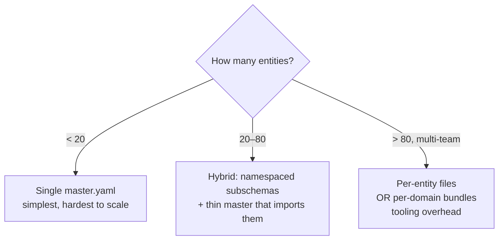
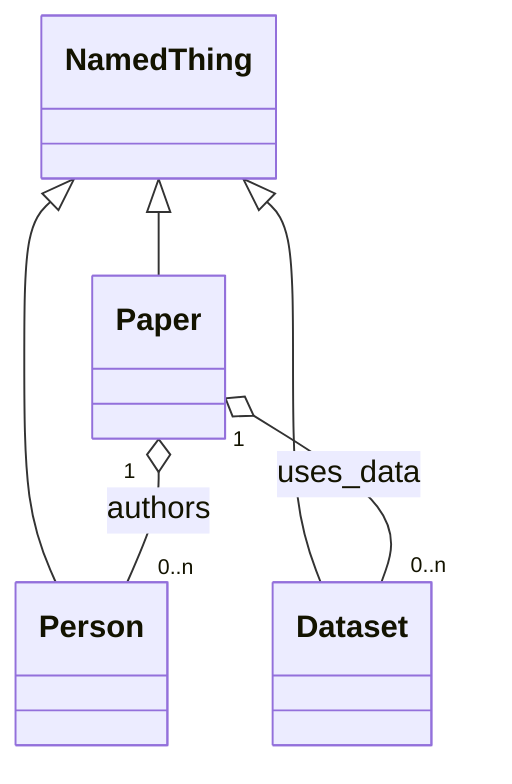

# 13 — Organize and Visualize Your Schemas

> **Status**: Active
> **Date**: 2026-07-10
> **Author**: @shahin
> **Audience**: engineers
> **Tags**: `engineering`
> **Variants**: Technical (this doc) - Readable (Obsidian twin optional, same filename) - Agent (n/a)

> **Goal** – pick a layout that scales (per-entity vs master-file vs
> hybrid), then *see* the inheritance tree to find gaps.
> **Time** – 40 minutes.
> **Prereqs** – chapters 01–12 (you've pulled all the upstream schemas
> and the domain data; now you're organizing them).

---

## The choice you're making



**Recommendation for Cytognosis: hybrid.** Each domain (scholarly,
artifacts, cell, mappings, instruments) is its own subschema YAML. A
thin `master.yaml` imports them all. This is exactly how Biolink, NMDC,
MIxS, and the OBO Foundry organize their LinkML.

---

## 1. The hybrid layout

```
schemas/cytognosis/
├── master.yaml                       # imports everything; defines no slots itself
├── core.yaml                         # NamedThing, identifiers, mixins
├── scholarly.yaml                    # Paper, Author, Citation
├── artifacts.yaml                    # Code, Dataset, Model, Workflow
├── cell.yaml                         # CellMetadata, AnnDataDescriptor
├── mappings.yaml                     # EntityMapping (extends sssom:Mapping)
├── instruments.yaml                  # Instrument, Protocol, Sample
└── presentations.yaml                # Presentation, Slide, Talk
```

Each subschema:
- declares its own `id`, `name`, `default_prefix`
- imports `linkml:types` and `./core` (and other peers it needs)
- defines only the classes/slots/enums in its domain

`master.yaml` is the only file external consumers reference.

---

## 2. Master template

```yaml
id: https://cytognosis.org/schemas/master
name: cytognosis_master
description: |
  Cytognosis Foundation scholarly + artifact KG schema.
  Compiles to JSON Schema, OWL, SHACL, Pydantic, SQL DDL, Cypher.
license: CC-BY-4.0
prefixes:
  cyto: https://cytognosis.org/
  linkml: https://w3id.org/linkml/
  schema: http://schema.org/
  biolink: https://w3id.org/biolink/
  sssom: https://w3id.org/sssom/
default_prefix: cyto
default_range: string
imports:
  - linkml:types
  - https://w3id.org/biolink/biolink-model
  - sssom_schema:sssom_schema
  - ./core
  - ./scholarly
  - ./artifacts
  - ./cell
  - ./mappings
  - ./instruments
  - ./presentations
```

---

## 3. Per-entity layout (when you need it)

If you're committing ontology-style governance — every class versioned
independently, owned by a different team — go even finer:

```
schemas/cytognosis/
├── classes/
│   ├── Paper.yaml
│   ├── CellMetadata.yaml
│   └── ...
└── master.yaml             # imports every classes/*.yaml
```

But: LinkML doesn't natively glob imports. You'd write a tiny script to
regenerate `master.yaml` whenever a new class file appears:

```python
# scripts/regenerate_master.py
from pathlib import Path
import yaml

classes_dir = Path("schemas/cytognosis/classes")
imports = sorted(f"./classes/{p.stem}" for p in classes_dir.glob("*.yaml"))
master = yaml.safe_load(Path("schemas/cytognosis/master.yaml").read_text())
master["imports"] = [i for i in master["imports"]
                     if not i.startswith("./classes/")] + imports
Path("schemas/cytognosis/master.yaml").write_text(
    yaml.safe_dump(master, sort_keys=False))
```

Run it in CI. Most teams don't need this; the hybrid is enough.

---

## 4. Visualizing the inheritance tree

Three tools, in order of usefulness for ADHD-friendly review.

### 4.1 `gen-erdiagram` (Mermaid, GitHub-renderable)

```bash
gen-erdiagram schemas/cytognosis/master.yaml > build/master.mmd
```

Drop the contents into a markdown file. GitHub will render it inline.

### 4.2 `gen-mermaid-class-diagram`

Class diagram (with inheritance arrows) instead of ER diagram (with
foreign-key relations).

```bash
gen-mermaid-class-diagram schemas/cytognosis/master.yaml > build/master.classes.mmd
```

Example output snippet:



### 4.3 `gen-yuml` and `linkml-renderer`

For PNG/SVG output suitable for slides:

```bash
gen-yuml schemas/cytognosis/master.yaml > build/master.yuml
# or use linkml-renderer:
linkml-renderer erdiagram schemas/cytognosis/master.yaml \
  --output build/master.svg
```

---

## 5. Finding gaps and candidates for expansion

The Mermaid class diagram makes it easy to spot:

| Smell | What to do |
| --- | --- |
| Class with no parent and no children | Should it be a `mixin`? Or `is_a: NamedThing`? |
| Two classes with overlapping slots | Pull the overlap into a mixin |
| A leaf class with 30+ slots | Probably 2 conflated concepts; split |
| No `slot_usage` anywhere | You're under-constraining; review for required/pattern |
| Free-text slot that should be ontology-bound | Add `range: uriorcurie` + `pattern` |

Run `gen-mermaid-class-diagram` after any structural change. Diff the
output against the previous run with `git diff` to see exactly what
inheritance moved.

---

## 6. Schemasheets — spreadsheets for editing schemas

Sometimes a non-engineer wants to edit a schema. `schemasheets` projects
the schema to/from Excel.

```bash
# YAML -> Excel
linkml2sheets schemas/cytognosis/master.yaml -o build/master.xlsx

# Excel edits -> YAML
sheets2linkml build/master.xlsx -o schemas/cytognosis/master.yaml
```

This is how NMDC and Monarch let curators contribute without learning
LinkML syntax.

---

## 7. Hands-on

1. Restructure your existing `cytognosis_scholarly_kg_v0.4.0.yaml` into
   the hybrid layout. (Tip: split by enum/class topical clusters first;
   slots can stay in `core.yaml`.)
2. Generate a Mermaid class diagram and paste it into
   `build/master.classes.md`.
3. List the top 3 gaps you see (e.g., "no mixin for `HasROCrateMetadata`
   on artifacts").

---

## 8. Pitfalls

- **Circular imports** – LinkML doesn't error loudly on circular imports
  but codegen behaves oddly. Keep your `core.yaml` dependency-free.
- **Per-entity files for `slots`** – just don't. Slots are shared by
  definition; they belong in 1–2 files at most.
- **`gen-erdiagram` truncates labels** at ~30 chars. Use shorter slot
  names or pass `--no-snake-case`.

---

## Further reading

- LinkML imports: https://linkml.io/linkml/schemas/imports.html
- Biolink's modular layout (excellent reference):
  https://github.com/biolink/biolink-model/tree/master/src/biolink_model/schema
- schemasheets: https://linkml.io/schemasheets/
