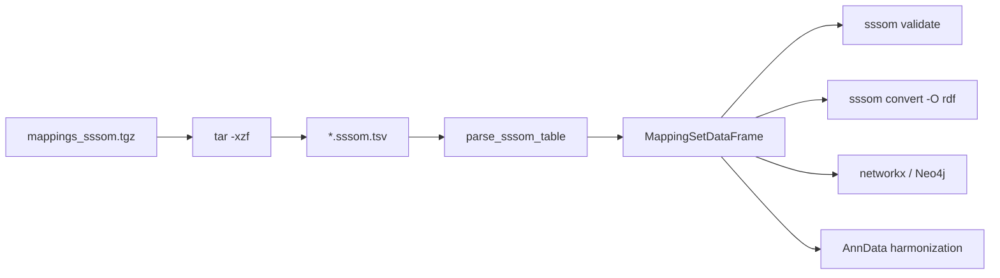

# 14 — OLS4 SSSOM: SnomedCT End-to-End

> **Status**: Active
> **Date**: 2026-07-10
> **Author**: @shahin
> **Audience**: engineers
> **Tags**: `engineering`
> **Variants**: Technical (this doc) - Readable (Obsidian twin optional, same filename) - Agent (n/a)

> **Goal** – take the OLS4 mappings tarball, load the SNOMED CT TSV,
> validate it, convert it, build a tiny graph from it, and use it for
> single-cell harmonization.
> **Time** – 60 minutes.
> **Prereqs** – chapters 01, 02, 04 (Biolink + SSSOM imports), and
> `sssom_tooling_for_cytognosis.md`.

---

## Pipeline



---

## 1. Get the bulk SSSOM tarball

```bash
mkdir -p downloads/sssom && cd downloads/sssom
curl -L -O https://ftp.ebi.ac.uk/pub/databases/spot/ols/latest/mappings_sssom.tgz
tar -tzf mappings_sssom.tgz | head
# extracted/snomed.ols.sssom.tsv
# extracted/mondo.ols.sssom.tsv
# ...
mkdir -p extracted && tar -xzf mappings_sssom.tgz -C extracted
ls extracted/ | wc -l   # ~200 mapping sets, one per OLS4 ontology
```

Each file is a SSSOM TSV:
- YAML header (lines starting with `#`) — metadata + `curie_map`.
- Tab-separated rows: `subject_id`, `subject_label`, `predicate_id`,
  `object_id`, `object_label`, `mapping_justification`,
  `mapping_tool`, `confidence`, …

Inspect one:

```bash
head -40 extracted/snomed.ols.sssom.tsv
```

---

## 2. Load SnomedCT into Python

```python
from sssom.parsers import parse_sssom_table
from sssom.util import MappingSetDataFrame

msdf: MappingSetDataFrame = parse_sssom_table(
    "downloads/sssom/extracted/snomed.ols.sssom.tsv"
)

# Header (CURIE map, license, version, source)
print(msdf.metadata)
print({k: msdf.prefix_map[k] for k in ("SNOMED", "MONDO", "ICD10CM")
       if k in msdf.prefix_map})

# DataFrame
df = msdf.df
print(df.shape, df.columns.tolist())
df.head()
```

---

## 3. Validate

```bash
sssom validate downloads/sssom/extracted/snomed.ols.sssom.tsv
```

If any rows fail, the message will tell you whether it's a CURIE-prefix
issue (most common — fix the `curie_map` header) or a missing required
column.

For deeper schema-level validation:

```bash
linkml-validate \
  --schema "$(python -c 'import sssom_schema, os; \
    print(os.path.dirname(sssom_schema.__file__) + "/schema/sssom_schema.yaml")')" \
  --target-class MappingSet \
  downloads/sssom/extracted/snomed.ols.sssom.tsv
```

---

## 4. Convert to other formats

```bash
# RDF (Turtle) — for triplestore ingest
sssom convert -O rdf downloads/sssom/extracted/snomed.ols.sssom.tsv \
  -o build/snomed.sssom.ttl

# OWL — for ontology editor merge
sssom convert -O owl downloads/sssom/extracted/snomed.ols.sssom.tsv \
  -o build/snomed.sssom.owl

# JSON — for programmatic consumers
sssom convert -O json downloads/sssom/extracted/snomed.ols.sssom.tsv \
  -o build/snomed.sssom.json

# FHIR R4 — for clinical interop
sssom convert -O fhir-r4 downloads/sssom/extracted/snomed.ols.sssom.tsv \
  -o build/snomed.sssom.fhir.json
```

---

## 5. Set algebra: merge, diff, filter

```bash
# Merge two related mapping sets
sssom merge \
  downloads/sssom/extracted/snomed.ols.sssom.tsv \
  downloads/sssom/extracted/mondo.ols.sssom.tsv \
  -o build/clinical-merged.sssom.tsv

# Compare against a previous version
sssom diff \
  build/clinical-merged.sssom.tsv \
  build/clinical-merged.last.sssom.tsv

# Keep only exactMatches with confidence ≥ 0.8
sssom filter \
  --predicate-id "skos:exactMatch" \
  --min-confidence 0.8 \
  downloads/sssom/extracted/snomed.ols.sssom.tsv \
  -o build/snomed.exact.sssom.tsv
```

---

## 6. Turn the SSSOM into a graph

### 6.1 networkx (quick)

```python
import networkx as nx
from sssom.parsers import parse_sssom_table

msdf = parse_sssom_table("downloads/sssom/extracted/snomed.ols.sssom.tsv")
df = msdf.df
exact = df[df["predicate_id"] == "skos:exactMatch"]

g = nx.MultiDiGraph()
for _, row in exact.iterrows():
    g.add_node(row["subject_id"], label=row.get("subject_label"))
    g.add_node(row["object_id"],  label=row.get("object_label"))
    g.add_edge(row["subject_id"], row["object_id"],
               key=row["predicate_id"],
               confidence=row.get("confidence"))

print(g.number_of_nodes(), g.number_of_edges())
```

### 6.2 Neo4j (production)

```python
from neo4j import GraphDatabase
drv = GraphDatabase.driver("bolt://localhost:7687", auth=("neo4j", "neo4j"))

with drv.session() as s:
    s.run("CREATE CONSTRAINT IF NOT EXISTS FOR (n:Concept) REQUIRE n.id IS UNIQUE")
    for chunk in (df[i:i+5000] for i in range(0, len(df), 5000)):
        s.run("""
            UNWIND $rows AS r
            MERGE (a:Concept {id: r.subject_id})
              ON CREATE SET a.label = r.subject_label
            MERGE (b:Concept {id: r.object_id})
              ON CREATE SET b.label = r.object_label
            MERGE (a)-[m:MAPS_TO {predicate: r.predicate_id}]->(b)
              ON CREATE SET m.confidence = r.confidence,
                            m.justification = r.mapping_justification
        """, rows=chunk.to_dict("records"))
```

### 6.3 KGX

```python
from sssom.io import sssom_to_kgx
sssom_to_kgx(
    msdf,
    nodes_path="build/snomed.kgx_nodes.tsv",
    edges_path="build/snomed.kgx_edges.tsv",
)
```

---

## 7. Use it for single-cell harmonization

This closes the loop with chapter 18.

```python
import anndata as ad
from sssom.parsers import parse_sssom_table

adata = ad.read_h5ad("dataset.h5ad")

msdf = parse_sssom_table("downloads/sssom/extracted/snomed.ols.sssom.tsv")
df = msdf.df
exact_mondo = df[(df["predicate_id"] == "skos:exactMatch")
                 & df["object_id"].str.startswith("MONDO:")]
lookup = dict(zip(exact_mondo["subject_id"], exact_mondo["object_id"]))

adata.obs["disease_ontology_term_id"] = (
    adata.obs["snomed_disease_code"].map(lookup)
)
unmapped = adata.obs.loc[
    adata.obs["disease_ontology_term_id"].isna(),
    "snomed_disease_code"
].dropna().unique()
print(f"{len(unmapped)} SNOMED codes still unmapped — escalate to OAK lexmatch.")
```

---

## 8. Hands-on

1. Extract `mappings_sssom.tgz`.
2. `parse_sssom_table` on `snomed.ols.sssom.tsv` and print the metadata.
3. `sssom validate` — fix any header issues.
4. `sssom convert -O rdf` and load into a triplestore (or just inspect).
5. Build the networkx graph and find the longest exactMatch chain.
6. Apply to a fake `adata.obs` with a `snomed_disease_code` column.

---

## 9. Pitfalls

- **OLS4 SSSOM headers can be missing `license`** — `sssom validate`
  yells about it. Patch the header before validation.
- **Some predicates are not `skos:*`** — `oboInOwl:hasDbXref` and
  `semapv:HasDbXref` show up. Decide your filter.
- **Concept IDs without prefix** (a bare `44054006` instead of
  `SNOMED:44054006`) appear in older sets. Either reject or post-process.
- **`mapping_justification` is required** in the SSSOM 1.0 spec. Older
  files use `match_type` — `sssom-py` migrates on read.

---

## Further reading

- SSSOM spec: https://mapping-commons.github.io/sssom/
- OLS4: https://www.ebi.ac.uk/ols4/
- OLS4 mapping bulk: https://ftp.ebi.ac.uk/pub/databases/spot/ols/latest/
- Companion deep-dive: `sssom_tooling_for_cytognosis.md`
