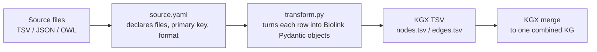
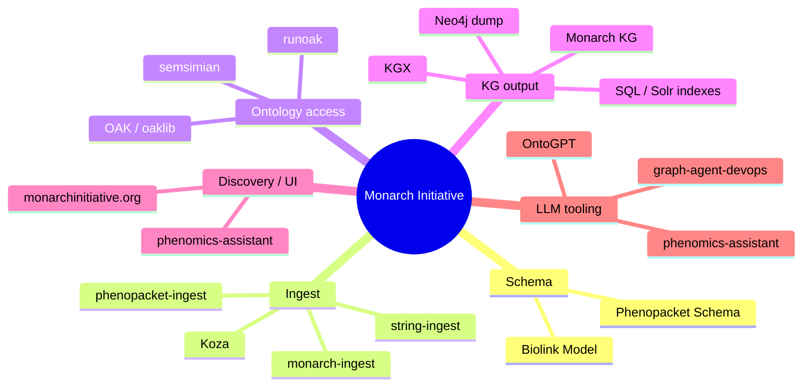
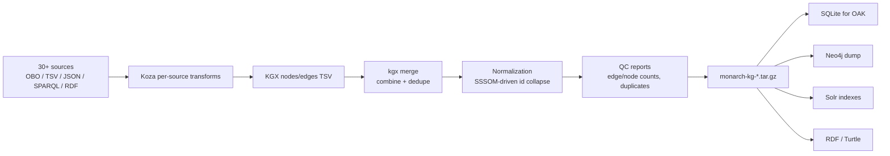

# 16 — Koza and the Monarch Initiative Ecosystem

> **Status**: Active
> **Date**: 2026-07-10
> **Author**: @shahin
> **Audience**: engineers
> **Tags**: `engineering`
> **Variants**: Technical (this doc) - Readable (Obsidian twin optional, same filename) - Agent (n/a)

> **Goal** – understand the Koza ingest tool, the broader Monarch
> Initiative ecosystem, the `monarch-ingest` pipeline, the Monarch
> Knowledge Graph itself, and how Cytognosis can plug in.
> **Time** – 90 minutes.
> **Prereqs** – chapters 01–13.

---

## The vocabulary distinction

A common confusion that bites people:

| Name | What it is |
| --- | --- |
| **Koza** | A *tool*. LinkML-driven ingest framework. Lives at `monarch-initiative/koza`. Used by Monarch and others. |
| **Monarch Initiative** | An *ecosystem*. The umbrella project (Berkeley/JAX/Oregon/EBI) that builds biomedical KGs and tooling. Hosts Koza, monarch-ingest, the Monarch KG, OAK, and many other tools. |
| **monarch-ingest** | A *project*. The production ETL pipeline that uses Koza to build the Monarch KG from 30+ sources. |
| **Monarch KG** | A *deliverable*. The actual graph (nodes + edges TSVs / Neo4j dump / Solr index) that monarch-ingest produces. |

In other words: Koza is the engine, monarch-ingest is the train, the
Monarch KG is the freight.

---

## Koza vs BioCypher in one table

| | **BioCypher** (chapter 15) | **Koza** |
| --- | --- | --- |
| Output | Neo4j CSV / RDF / KGX / CSV | KGX TSV (nodes/edges) |
| Schema source | Biolink + LinkML (your subschemas) | Biolink (LinkML) |
| Adapter unit | Python class with `get_nodes`/`get_edges` | Python transform fn + YAML source/transform configs |
| Best for | Direct-to-Neo4j ETL, polymorphic adapters | Many heterogeneous sources funneling into one Biolink-shaped KG |
| Used by | BioCypher community + custom projects | Monarch Initiative |

Chapter 17 does the full side-by-side with use cases.

---

## 1. Koza in 90 seconds



Each source has two files:

- `<source>/transform_source.yaml` — declares input file format, primary
  key, columns, optional filters.
- `<source>/transform.py` — receives one row at a time, emits Biolink
  Pydantic instances.

Koza handles streaming, validation, deduplication, and KGX writing.

### 1.1 A minimal Koza source

```yaml
# ingests/example_disease/transform_source.yaml
name: example_disease
format: csv
delimiter: ","
files:
  - data/example_disease.csv
columns:
  - id
  - name
  - mondo_xref
node_properties:
  - id
  - name
edge_properties: []
```

```python
# ingests/example_disease/transform.py
import uuid
from biolink_model.datamodel.pydanticmodel_v2 import Disease
from koza.cli_utils import get_koza_app

koza_app = get_koza_app("example_disease")
while (row := koza_app.get_row()) is not None:
    disease = Disease(
        id=row["mondo_xref"] or row["id"],
        name=row["name"],
        category=["biolink:Disease"],
    )
    koza_app.write(disease)
```

Run it:

```bash
koza transform --source ingests/example_disease/transform_source.yaml \
               --output-dir output/example_disease
ls output/example_disease/
# example_disease_nodes.tsv  example_disease_edges.tsv
```

---

## 2. The Monarch Initiative ecosystem

Beyond Koza, Monarch maintains a constellation of tools that fit
together into an ontology-aware KG stack:



Cytognosis already touches several pieces:

| Monarch tool | Where in this playbook |
| --- | --- |
| Biolink Model | chapter 04 |
| OAK / oaklib | chapter 14 (SSSOM) and chapter 18 (harmonization) |
| Koza | this chapter |
| monarch-ingest | this chapter, §3 |
| Monarch KG | this chapter, §4 |
| phenopacket-ingest | this chapter §5 + chapter 07 §3.4 |
| OntoGPT | chapter 20 |
| phenomics-assistant / graph-agent-devops | chapter 19 |

---

## 3. monarch-ingest deep dive

Repo: https://github.com/monarch-initiative/monarch-ingest

`monarch-ingest` is the production ETL pipeline that ingests 30+
biomedical sources into the Monarch Knowledge Graph. It's the
canonical example of a Koza-driven multi-source KG build.

### 3.1 Layout

```
monarch-ingest/
├── src/monarch_ingest/
│   ├── ingests/
│   │   ├── alliance/                  # gene, disease, phenotype
│   │   ├── ctd/                       # chemical-disease assoc
│   │   ├── flybase/
│   │   ├── hpoa/                      # human phenotype-disease
│   │   ├── mgi/
│   │   ├── reactome/
│   │   ├── string/                    # protein-protein interactions
│   │   └── ...                        # 30+ sources
│   ├── translation_table.yaml         # predicate normalization
│   └── monarch.yaml                   # top-level pipeline config
├── tests/
└── pyproject.toml
```

Each `ingests/<source>/` folder is a Koza ingest with the
`transform_source.yaml` + `transform.py` pattern from §1.

### 3.2 Pipeline architecture



### 3.3 SSSOM in monarch-ingest

Mappings live in `monarch-ingest/src/monarch_ingest/mappings/` and
are applied during normalization to collapse equivalent identifiers
across sources (e.g., DOID → MONDO, OMIM → MONDO) so a single
`Disease` node represents both. This is one of the cleanest
production SSSOM applications you can study — chapter 14's SSSOM
workflow is essentially a small-scale mirror of what monarch-ingest
does at scale.

### 3.4 Hands-on: run a single source locally

```bash
git clone https://github.com/monarch-initiative/monarch-ingest
cd monarch-ingest && poetry install

# List available sources
poetry run ingest list

# Download just one source (e.g., HPOA — phenotype-disease associations)
poetry run ingest download --tag hpoa

# Transform it
poetry run ingest transform --tag hpoa

ls output/transform_output/hpoa/
# hpoa_nodes.tsv  hpoa_edges.tsv

# Inspect
head output/transform_output/hpoa/hpoa_edges.tsv | column -t -s $'\t'
```

> **Checkpoint** — you should see ~150k phenotype-to-disease edges,
> each one a `biolink:HasPhenotype` association linking a `MONDO:*`
> subject to an `HP:*` object.

### 3.5 Run the full pipeline (heavy)

```bash
# All sources — ~6 hours, ~30 GB intermediate files
poetry run ingest download --all
poetry run ingest transform --all
poetry run ingest merge

# Output
ls output/monarch-kg/
# monarch-kg_nodes.tsv  monarch-kg_edges.tsv  monarch-kg.tar.gz
```

Don't run this until you've tested individual sources.

### 3.6 What to copy for Cytognosis

- `ingests/<source>/` per-source layout. Mirror this in
  `cytognosis-ingest/` for any clinical or scholarly sources you
  bring in.
- `translation_table.yaml` for predicate normalization. Hand-curated
  but high leverage.
- The QC report step. Don't skip it — running counts after every
  source build catches silent regressions.
- The SSSOM-driven normalization at merge time.

---

## 4. The Monarch Knowledge Graph

About: https://monarchinitiative.org/kg/about

The Monarch KG is the public deliverable: a Biolink-shaped graph of
~80M+ edges across genes, diseases, phenotypes, drugs, anatomy,
pathways, model organisms, publications, and clinical observations.

### 4.1 What's in it

| Domain | Source contributions |
| --- | --- |
| Genes & gene products | Alliance, NCBI Gene, HGNC, Ensembl, UniProt |
| Diseases | MONDO, OMIM, Orphanet (via MONDO) |
| Phenotypes | HPO, HPOA |
| Variants | ClinVar, gnomAD (selected) |
| Chemicals/drugs | CTD, ChEMBL, DrugCentral |
| Model organisms | MGI, RGD, FlyBase, ZFIN, WormBase |
| Pathways | Reactome |
| Anatomy | Uberon, CL |
| Publications | EuropePMC links |

All harmonized to Biolink Model classes/predicates with SSSOM-driven
identifier normalization.

### 4.2 How it's built

`monarch-ingest` (§3) produces the per-source KGX TSVs, KGX merge
combines them, normalization collapses equivalent IDs, QC reports run,
and the final tarball is published as `monarch-kg-<date>.tar.gz` with
companion artifacts:

- **KGX TSV** — the canonical form
- **Neo4j dump** — for property-graph queries
- **SQLite (semsql / OAK-compatible)** — for ontology-aware reasoning
- **Solr indexes** — for the public web UI search
- **RDF/Turtle** — for SPARQL endpoints

All releases live at https://data.monarchinitiative.org/.

### 4.3 Schemas it uses

The KG is **fully Biolink-typed** — every node has a `biolink:*`
category, every edge a `biolink:*` predicate. Identifier prefixes
follow Bioregistry conventions.

For sources whose native schemas weren't already LinkML, conversion
goes through one of the chapter 03/04/05 paths:

- Ontologies → OWL → schemauto import-owl → LinkML
- Tabular sources (TSV/CSV) → Koza source config → Biolink Pydantic
- JSON sources (Phenopackets, etc.) → LinkML port → Pydantic → Koza

### 4.4 Hands-on: download and explore

```bash
# Latest KG release
mkdir -p downloads/monarch-kg && cd downloads/monarch-kg
curl -L -O https://data.monarchinitiative.org/monarch-kg/latest/monarch-kg.tar.gz
tar -xzf monarch-kg.tar.gz
ls
# monarch-kg_nodes.tsv  monarch-kg_edges.tsv

# Quick stats
wc -l monarch-kg_*.tsv
# ~3M nodes, ~80M+ edges (varies by release)

# DuckDB for ad-hoc exploration
duckdb -c "
  SELECT category, COUNT(*) n
  FROM read_csv_auto('monarch-kg_nodes.tsv', delim='\t', header=true)
  GROUP BY category ORDER BY n DESC LIMIT 10;
"
```

### 4.5 Hands-on: load into Neo4j

```bash
# Pre-built Neo4j dump
curl -L -O https://data.monarchinitiative.org/monarch-kg/latest/monarch-kg.neo4j.dump

# Load (assumes a stopped Neo4j 5.x)
neo4j-admin database load --from-path=. --overwrite-destination=true monarch
neo4j start

# Cypher query — phenotypes of cystic fibrosis
echo "
MATCH (d:Disease {id:'MONDO:0009061'})-[:has_phenotype]->(p:PhenotypicFeature)
RETURN p.id, p.name LIMIT 25;
" | cypher-shell
```

### 4.6 Hands-on: ontology-aware queries via OAK

```bash
# Build the SQLite version monarch ships
runoak -i sqlite:obo:monarch.db ancestors MONDO:0009061
runoak -i sqlite:obo:monarch.db relationships --predicates biolink:has_phenotype \
  --subjects MONDO:0009061
```

### 4.7 Where Cytognosis fits

Two integration patterns:

1. **Reuse Monarch KG as a substrate.** Pull `monarch-kg.tar.gz`,
   merge with your Cytognosis-specific KGX (cohort/EHR/scholarly
   layers), and you instantly have biomedical context for free.
2. **Build a parallel `cytognosis-ingest`.** Mirror the
   monarch-ingest layout for Cytognosis-internal sources (cohort
   metadata, scholarly artifacts, instrument data), then `kgx merge`
   the result with the Monarch KG at delivery time.

Pattern 1 is faster; pattern 2 keeps cleaner provenance separation.
Most teams end up with both.

---

## 5. `phenopacket-ingest` (recap)

Repo: https://github.com/monarch-initiative/phenopacket-ingest

Already covered in detail in chapter 07 §3.4 (placement in the GA4GH
landscape) and §4–4.4 below. Short version: it's the Koza ingest that
materializes per-patient phenopacket JSON into Biolink-shaped nodes
(`Case`, `PhenotypicFeature`, `Disease`, `Variant`) and edges
(`has_phenotype`, `has_disease`, `affects`).

### 5.1 LinkML status

Three layers, three states:

| Layer | LinkML status |
| --- | --- |
| Output (KGX) | **Already LinkML/Biolink** |
| Transform configs | **Already LinkML-driven** (Koza is LinkML-native) |
| Input parsing | **In transition** from GA4GH Protobuf bindings to `cmungall/linkml-phenopackets` Pydantic |

### 5.2 Transform — Protobuf input (current upstream)

```python
import uuid
from phenopackets import Phenopacket
from biolink_model.datamodel.pydanticmodel_v2 import (
    Case, Disease, PhenotypicFeature, CaseToPhenotypicFeatureAssociation,
)
from koza.cli_utils import get_koza_app

app = get_koza_app("phenopacket")
while (row := app.get_row()) is not None:
    pp = Phenopacket.FromJsonString(row["phenopacket_json"])
    case = Case(id=f"PP:{pp.id}", name=pp.subject.id)
    app.write(case)
    for ph in pp.phenotypic_features:
        feat = PhenotypicFeature(id=ph.type.id, name=ph.type.label)
        app.write(feat)
        app.write(CaseToPhenotypicFeatureAssociation(
            id=f"uuid:{uuid.uuid4()}",
            subject=case.id,
            predicate="biolink:has_phenotype",
            object=feat.id,
        ))
```

### 5.3 Transform — LinkML input (recommended for new code)

```python
import uuid, json
from linkml_phenopackets.datamodel.phenopackets import Phenopacket
from biolink_model.datamodel.pydanticmodel_v2 import (
    Case, Disease, PhenotypicFeature, CaseToPhenotypicFeatureAssociation,
)
from koza.cli_utils import get_koza_app

app = get_koza_app("phenopacket")
while (row := app.get_row()) is not None:
    pp = Phenopacket.model_validate_json(row["phenopacket_json"])
    case = Case(id=f"PP:{pp.id}", name=pp.subject.id)
    app.write(case)
    for ph in pp.phenotypic_features or []:
        feat = PhenotypicFeature(id=ph.type.id, name=ph.type.label)
        app.write(feat)
        app.write(CaseToPhenotypicFeatureAssociation(
            id=f"uuid:{uuid.uuid4()}",
            subject=case.id,
            predicate="biolink:has_phenotype",
            object=feat.id,
        ))
```

### 5.4 Where this fits Cytognosis

Phenopackets are how clinical cases enter your KG cleanly. If you
start ingesting EHR-derived patient cohorts, mirror this exact
pattern: Koza source config + per-phenopacket transform → KGX → merge
with your master KG. Use the LinkML-input variant unless something in
your release of `linkml-phenopackets` is missing.

---

## 6. Pitfalls

- **`get_koza_app` requires the `--source` flag** — running the
  transform script directly will error.
- **Biolink Pydantic v2 names are CamelCase** but YAML keys in
  `schema_config` use spaces. Don't mix.
- **`koza transform` writes to `output/transform_output/<source>/`**
  by default — check there before suspecting failure.
- **`monarch-ingest` poetry install is heavy** (~5 GB of dependencies
  including ROBOT). Use a dedicated env.
- **The full Monarch KG is large** — ~30 GB extracted. Don't load it
  on a laptop without thinking about disk first.
- **Phenopacket schema has both Protobuf and LinkML versions.** The
  upstream `phenopackets` PyPI package gives you the Protobuf
  bindings; for the LinkML-derived Pydantic v2 use
  `cmungall/linkml-phenopackets` (`pip install linkml-phenopackets`).
  See §5.1–5.3 above for when to pick each.
- **Don't confuse Monarch the ecosystem with Koza the tool.** Many
  blog posts and slides refer to "Monarch ingest" loosely; if someone
  says they "use Monarch", clarify whether they mean Koza, the KG, or
  both.

---

## Further reading

- Koza docs: https://koza.monarchinitiative.org/
- monarch-ingest repo: https://github.com/monarch-initiative/monarch-ingest
- Monarch KG about: https://monarchinitiative.org/kg/about
- Monarch KG downloads: https://data.monarchinitiative.org/
- phenopacket-ingest: https://github.com/monarch-initiative/phenopacket-ingest
- string-ingest (Monarch's STRING ingest): https://github.com/monarch-initiative/string-ingest
- Biolink Model: https://biolink.github.io/biolink-model/
- KGX: https://github.com/biolink/kgx
