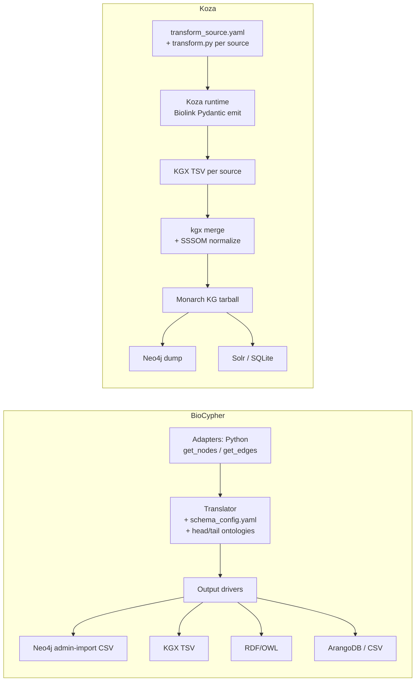
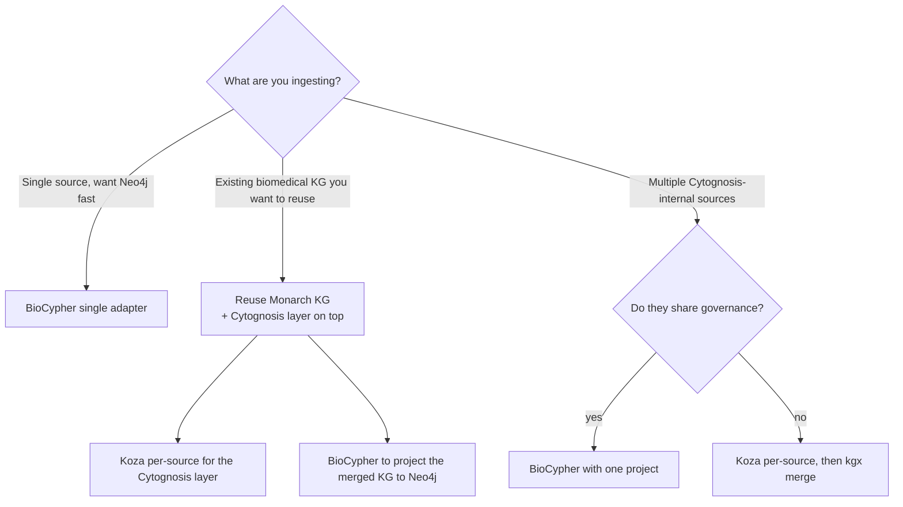

# 17 — BioCypher vs Monarch (Koza): a side-by-side ingest comparison

> **Status**: Active
> **Date**: 2026-07-10
> **Author**: @shahin
> **Audience**: engineers
> **Tags**: `engineering`
> **Variants**: Technical (this doc) - Readable (Obsidian twin optional, same filename) - Agent (n/a)

> **Goal** – decide which framework to use when, with concrete
> side-by-side examples on Open Targets and protein-protein
> interactions (STRING).
> **Time** – 60 minutes.
> **Prereqs** – chapters 15 (BioCypher), 16 (Koza/Monarch).

---

## Why this chapter exists

Both BioCypher and Monarch's Koza-based stack solve the same job: turn
heterogeneous biomedical sources into a Biolink-typed knowledge graph.
But they make different architectural choices, and Cytognosis will
benefit from picking deliberately rather than by tradition.

Bottom line up front:

| If you need… | Reach for |
| --- | --- |
| Direct-to-Neo4j with minimal ceremony | **BioCypher** |
| Many sources merged into one canonical Biolink-shaped tarball | **Koza + monarch-ingest** |
| Polymorphic adapters where one source emits 5+ entity types | **BioCypher** |
| Per-source ingest pipelines you can ship independently | **Koza** |
| Maximum reuse of existing Monarch infra (Monarch KG as substrate) | **Koza** |
| Tail-ontology grafting (e.g., MONDO under Biolink Disease) | **BioCypher** |
| LLM/RAG layer (chapter 19) | **BioCypher** has biochatter; Monarch has phenomics-assistant |
| Cytognosis recommendation | **Both, with clear roles** (§4) |

---

## 1. Side-by-side architecture



The fundamental difference: **BioCypher centralizes the schema/ontology
decisions inside one Python process; Koza decentralizes them per-source
and merges later.**

---

## 2. Inputs — schema/ontology integration

| Aspect | BioCypher | Koza |
| --- | --- | --- |
| Where the schema lives | One `schema_config.yaml` for the whole KG | Implicit in each source's `transform.py` (Biolink Pydantic) |
| Head ontology | Configurable; default Biolink | Always Biolink |
| Tail ontologies | First-class (head/tail join nodes) | Implicit — sources emit Biolink-typed nodes that already carry MONDO/CL/UBERON IDs |
| LinkML schema validation | Optional but typical | Built in (Koza is LinkML-native) |
| Custom Cytognosis types | `is_a:` extension in schema_config | Subclass Biolink Pydantic in your transform |

---

## 3. Inputs — identifier resolution and conflict handling

This is where the frameworks diverge most.

### 3.1 BioCypher

- **`preferred_id`** declares the canonical identifier system per
  entity (`mondo` for diseases, `ensembl` for genes).
- **Multi-`input_label`** lets the schema accept the same logical
  entity from different upstream prefixes (`mondo_disease` and
  `doid_disease` both become `disease`).
- **Cross-source ID resolution** is your responsibility — typical
  pattern is a SSSOM-driven adapter pre-pass that rewrites IDs before
  emission.
- **Conflicts** (same id, different properties) are resolved by the
  output driver — last-writer-wins with a warning.

```yaml
disease:
  represented_as: node
  preferred_id: mondo
  input_label: [mondo_disease, doid_disease, omim_disease]
  is_a: biolink:Disease
```

### 3.2 Koza / monarch-ingest

- **Per-source emission** in source-native IDs.
- **Identifier collapsing** happens at `kgx merge` time, driven by
  SSSOM mappings in `monarch-ingest/src/monarch_ingest/mappings/`.
- **Conflicts** are resolved by predefined precedence rules in the
  translation table.

```yaml
# monarch-ingest/src/monarch_ingest/mappings/mondo.sssom.tsv
DOID:9352  skos:exactMatch  MONDO:0005148  ...
OMIM:222100 skos:exactMatch MONDO:0005148  ...
```

When the merge runs, all three IDs collapse into `MONDO:0005148`, and
properties from the three sources combine.

### 3.3 Which model is better?

Neither — they're optimized for different scales:

- **BioCypher's per-process model** is great for medium-scale KGs (10s
  of M edges) where you want one tight pipeline.
- **Koza's emit-then-merge model** scales better for many-source
  builds (Monarch KG has 80M+ edges from 30+ sources) where each
  source's curation cycle is independent.

Cytognosis is closer to BioCypher's sweet spot for now (a few sources,
one team) but Koza's pattern is what you'd grow into.

---

## 4. Outputs — formats and automation

### 4.1 Output formats

| Format | BioCypher | Koza |
| --- | --- | --- |
| KGX TSV | yes | **native** |
| Neo4j admin-import CSV | **native** | via KGX-to-Neo4j |
| RDF / OWL | yes | via KGX-to-RDF |
| ArangoDB | yes | no |
| Plain CSV / Parquet | yes | via KGX |
| SQLite (semsql) | no | via KGX |
| Solr indexes | no | yes (Monarch's web UI uses this) |

### 4.2 Automation and update triggers

| | BioCypher | Koza/monarch-ingest |
| --- | --- | --- |
| Scheduled rebuilds | Up to you (cron / GitHub Actions) | Monarch publishes monthly KG releases automatically |
| Source freshness checks | Hand-written in the adapter | `download.yaml` + dvc-style checksum tracking |
| Per-source CI | Per-project | Built-in: each source has its own CI on the monarch-ingest repo |
| Public release pipeline | Per-project | `monarch-kg-<date>.tar.gz` + multiple format variants posted to data.monarchinitiative.org |

If you want production update cadence without writing cron
infrastructure, lean on Monarch's release process by ingesting the
already-built Monarch KG and only running BioCypher/Koza for your
Cytognosis-specific layers on top.

---

## 5. Use case A — Open Targets

Both frameworks have demonstrated this. They produce structurally
similar but operationally different pipelines.

### 5.1 BioCypher path

Repo: https://github.com/biocypher/open-targets

```python
# Single Python process; one schema_config; many adapters
from biocypher import BioCypher
from adapters.target_adapter import TargetAdapter
from adapters.disease_adapter import DiseaseAdapter
from adapters.evidence_adapter import EvidenceAdapter

bc = BioCypher(schema_config_path="config/schema_config.yaml",
               biocypher_config_path="config/biocypher_config.yaml")
for AdapterCls, path in [
    (TargetAdapter,   "data/targets/*.parquet"),
    (DiseaseAdapter,  "data/diseases/*.parquet"),
    (EvidenceAdapter, "data/evidence/*.parquet"),
]:
    a = AdapterCls(path)
    bc.write_nodes(a.get_nodes())
    bc.write_edges(a.get_edges())
bc.write_import_call()
```

**Result**: `biocypher-out/` with Neo4j-admin-import CSVs ready to load
in one shell command.

**Strength**: tight pipeline, easy to evolve, leverages BioCypher's
tail-ontology mechanism (MONDO under Biolink:Disease).

### 5.2 Koza path

There isn't a canonical Koza-based Open Targets ingest yet (Open
Targets isn't currently in monarch-ingest), but the structural
equivalent would be:

```yaml
# ingests/opentargets_target/transform_source.yaml
name: opentargets_target
format: parquet
files:
  - data/targets/*.parquet
node_properties:
  - id
  - approvedSymbol
  - biotype
```

```python
# ingests/opentargets_target/transform.py
from biolink_model.datamodel.pydanticmodel_v2 import Gene
from koza.cli_utils import get_koza_app

app = get_koza_app("opentargets_target")
while (row := app.get_row()) is not None:
    app.write(Gene(
        id=f"ENSEMBL:{row['id']}",
        symbol=row["approvedSymbol"],
        category=["biolink:Gene"],
    ))
```

**Result**: per-source KGX TSVs to merge later.

**Strength**: independent CI per source; easy to add to a Monarch-style
pipeline.

### 5.3 Verdict — Open Targets

For Cytognosis, **prefer BioCypher** for Open Targets. The polymorphic
adapter pattern fits OT's per-entity Parquet layout naturally, and
direct-to-Neo4j is what we want for the analytics layer. Use the
existing `biocypher/open-targets` adapter as the starting point.

---

## 6. Use case B — Interactome (protein-protein interactions, STRING)

STRING is the canonical PPI source. Both frameworks have ingest
adapters in active use.

### 6.1 BioCypher path — CROssBARv2 STRING adapter

Reference adapter: https://github.com/HUBioDataLab/CROssBARv2-KG/blob/main/bccb/string_adapter.py

```python
# Sketch; read the real one for production details
class StringAdapter:
    def __init__(self, organism="9606"):
        self.organism = organism
        # downloads STRING flatfiles to a local cache

    def get_nodes(self):
        # Optional — STRING nodes are usually emitted by a separate
        # protein/gene adapter; this adapter mostly emits edges
        return iter([])

    def get_edges(self):
        for prot_a, prot_b, score, *channels in self._iter_links():
            if score < 700:
                continue   # filter to high-confidence
            yield (
                None,
                f"STRING:{prot_a}",
                f"STRING:{prot_b}",
                "protein protein interaction",
                {
                    "combined_score": score / 1000,
                    "experimental_score": int(channels[6]) / 1000,
                    "database_score": int(channels[7]) / 1000,
                },
            )
```

Tutorial reference for the BioCypher offline-Neo4j workflow this fits
into: https://biocypher.org/BioCypher/learn/tutorials/tutorial_basics_neo4j_offline/tutorial_004_neo4j_offline/

### 6.2 Koza path — Monarch's `string-ingest`

Repo: https://github.com/monarch-initiative/string-ingest

```yaml
# transform_source.yaml (excerpt)
name: string
format: tsv
files:
  - data/9606.protein.links.detailed.v12.0.txt.gz
columns: [protein1, protein2, ..., combined_score]
filters:
  - column: combined_score
    inclusion: include
    filter_code: gt
    value: 700
```

```python
# transform.py (excerpt)
from biolink_model.datamodel.pydanticmodel_v2 import (
    Protein, PairwiseGeneToGeneInteraction,
)
from koza.cli_utils import get_koza_app

app = get_koza_app("string")
while (row := app.get_row()) is not None:
    a = Protein(id=f"STRING:{row['protein1']}", category=["biolink:Protein"])
    b = Protein(id=f"STRING:{row['protein2']}", category=["biolink:Protein"])
    app.write(a); app.write(b)
    app.write(PairwiseGeneToGeneInteraction(
        id=f"uuid:{uuid.uuid4()}",
        subject=a.id, predicate="biolink:interacts_with", object=b.id,
        knowledge_source="infores:string",
        has_evidence_count=int(row["combined_score"]),
    ))
```

### 6.3 Side-by-side

| | BioCypher (CROssBARv2) | Koza (string-ingest) |
| --- | --- | --- |
| Where it lives | Inside a multi-source BioCypher project | Standalone repo, one source |
| Output | Neo4j CSVs | KGX nodes/edges TSV |
| Filtering | Inline in adapter | Declarative in `transform_source.yaml` |
| Reuse | Within CROssBARv2 only (unless you fork) | Plugs into any KGX-based pipeline; merged into Monarch KG |
| Lines of code | ~200 (adapter only) | ~50 (transform) + 30 (config) |

### 6.4 Verdict — Interactome

For Cytognosis, **either works**, but if you want STRING data combined
with the rest of the Monarch KG, the Koza path lets you reuse Monarch's
already-merged graph. If you only need STRING in a Cytognosis-specific
context (e.g., a small clinical cohort + PPI sub-graph), the BioCypher
in-process path is faster to set up.

---

## 7. The decision matrix for Cytognosis



The pragmatic Cytognosis stack — covered earlier in chapter 16 §4.7
— is:

1. **Pull the Monarch KG** as the biomedical substrate.
2. **Use Koza** for any Cytognosis-internal sources where you want
   per-source CI and independent release cadence (cohort metadata,
   scholarly artifacts, clinical observations).
3. **Use BioCypher** for the projection layer that materializes the
   merged graph into Neo4j with tail ontologies grafted.
4. **Layer biochatter / phenomics-assistant** on top for query (chapter
   19).

You don't have to pick one — most production stacks end up using both
where they're each strongest.

---

## 8. Hands-on

1. Run the BioCypher Open Targets adapter end-to-end (chapter 15 §5).
2. Clone `monarch-initiative/string-ingest`, run it, inspect the KGX.
3. Compare the two outputs: which one would you rather merge with a
   Cytognosis cohort graph for an interactome view?
4. Write down your answer; revisit after chapter 19's LLM section.

---

## 9. Pitfalls

- **Treating them as competitors.** They're complementary. The biggest
  productivity wins come from using both.
- **Picking BioCypher because adapters look smaller** — they don't
  scale operationally. If you're running 30+ sources, Koza's pipeline
  model is much cheaper to maintain.
- **Picking Koza because Monarch uses it** — if you only have 2
  sources and need Neo4j now, BioCypher gets you there in a day.
- **Merging too eagerly.** Keep per-source KGX intermediate files
  around — they're invaluable for debugging the merge.
- **Cross-framework data flow** is fine but document it well.
  Cytognosis-Koza-output → BioCypher input is a perfectly reasonable
  pattern.

---

## Further reading

- BioCypher (chapter 15) — full coverage of the tool
- Monarch + Koza (chapter 16) — full coverage of the ecosystem
- BioCypher Neo4j offline tutorial: https://biocypher.org/BioCypher/learn/tutorials/tutorial_basics_neo4j_offline/tutorial_004_neo4j_offline/
- CROssBARv2 STRING adapter: https://github.com/HUBioDataLab/CROssBARv2-KG/blob/main/bccb/string_adapter.py
- Monarch string-ingest: https://github.com/monarch-initiative/string-ingest
- Open Targets BioCypher adapter: https://github.com/biocypher/open-targets
