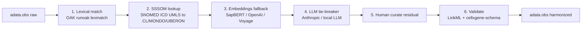

# 18 — Harmonizing AnnData to CELLxGENE Compliance

> **Status**: Active
> **Date**: 2026-07-10
> **Author**: @shahin
> **Audience**: engineers
> **Tags**: `engineering`
> **Variants**: Technical (this doc) - Readable (18_anndata_harmonization.md in Obsidian vault: 04-Engineering/cytos/schemas-ontologies/linkml-playbook/) - Agent (n/a)

> **Goal** – take a real-world `.h5ad` with messy `obs` (free-text cell
> types, SNOMED clinical codes, mixed casing) and produce a
> CELLxGENE-compliant version, using OAK + SSSOM + LLM-assisted fallback.
> **Time** – 90 minutes.
> **Prereqs** – chapters 08 (CELLxGENE schema), 13 (SSSOM workflow).
> Chapters 09 (HDMF) and 14–15 (BioCypher / Koza) are useful context.

---

## The harmonization stack



Tier 1–2 should clear ≥ 80% of cells on most datasets. Tier 3–4 handles
the long tail. Tier 5 is the irreducible curator queue.

---

## 1. Tier 1: OAK lexical matching

```python
# scripts/harmonize_obs.py
import anndata as ad, pandas as pd
from oaklib import get_adapter

adata = ad.read_h5ad("dataset.h5ad")
cl = get_adapter("sqlite:obo:cl")          # auto-downloads on first run

unique_terms = adata.obs["cell_type_freetext"].dropna().unique()

resolved = {}
for term in unique_terms:
    hits = list(cl.basic_search(term))
    resolved[term] = hits[0] if hits else None

adata.obs["cell_type_ontology_term_id"] = (
    adata.obs["cell_type_freetext"].map(resolved)
)
print(f"Tier 1 resolved {sum(v is not None for v in resolved.values())}/{len(resolved)}")
```

---

## 2. Tier 2: SSSOM lookup for clinical codes

If the source uses SNOMED for diagnoses, apply the OLS4 SSSOM file
from chapter 14:

```python
from sssom.parsers import parse_sssom_table

msdf = parse_sssom_table("downloads/sssom/extracted/snomed.ols.sssom.tsv")
df = msdf.df
exact = df[(df["predicate_id"] == "skos:exactMatch")
           & df["object_id"].str.startswith("MONDO:")]
snomed_to_mondo = dict(zip(exact["subject_id"], exact["object_id"]))

adata.obs["disease_ontology_term_id"] = (
    adata.obs["snomed_disease_code"].map(snomed_to_mondo)
)
```

For tissue codes (e.g. SNOMED → UBERON):

```python
exact_uberon = df[(df["predicate_id"] == "skos:exactMatch")
                  & df["object_id"].str.startswith("UBERON:")]
snomed_to_uberon = dict(zip(exact_uberon["subject_id"], exact_uberon["object_id"]))
adata.obs["tissue_ontology_term_id"] = (
    adata.obs["snomed_tissue_code"].map(snomed_to_uberon)
)
```

---

## 3. Tier 3: embedding-based nearest-neighbor

For free-text terms OAK didn't catch, encode all CL labels and the
unmatched terms with a sentence-embedding model and rank cosine
similarity.

```python
from oaklib import get_adapter
from sentence_transformers import SentenceTransformer
import numpy as np

cl = get_adapter("sqlite:obo:cl")
labels = list(cl.entities(filter_obsoletes=True))
texts  = [cl.label(e) for e in labels]
model  = SentenceTransformer("cambridgeltl/SapBERT-from-PubMedBERT-fulltext")
emb_cl = model.encode(texts, normalize_embeddings=True, batch_size=64)

unmatched = [t for t in unique_terms if resolved[t] is None]
emb_un    = model.encode(unmatched, normalize_embeddings=True)

sims = emb_un @ emb_cl.T
top  = sims.argmax(axis=1)
for term, idx, score in zip(unmatched, top, sims.max(axis=1)):
    if score > 0.85:
        resolved[term] = labels[idx]
```

Threshold ≥ 0.85 cosine is a reasonable starting point for SapBERT;
tune on a labeled holdout.

---

## 4. Tier 4: LLM tie-breaker

For ambiguous cases (top-2 scores within 0.05 of each other), an LLM is
better than picking blindly.

```python
import anthropic
client = anthropic.Anthropic()

def llm_disambiguate(term, candidates):
    msg = client.messages.create(
        model="claude-sonnet-4-6",
        max_tokens=200,
        messages=[{"role": "user", "content": f"""
A pathologist wrote "{term}" in a single-cell metadata column.
Choose the SINGLE best match from this list of Cell Ontology candidates,
or reply 'unknown' if none fit.
Candidates:
{chr(10).join(f"- {cid} :: {label}" for cid, label in candidates)}

Reply with just the chosen CL ID (e.g., CL:0000084) or 'unknown'.
"""}]
    )
    txt = msg.content[0].text.strip()
    return None if txt.lower() == "unknown" else txt

ambiguous = [t for t in unmatched if abs(sims[unmatched.index(t)].max() -
            sorted(sims[unmatched.index(t)])[-2]) < 0.05]

for term in ambiguous:
    idxs = sims[unmatched.index(term)].argsort()[-5:][::-1]
    cands = [(labels[i], texts[i]) for i in idxs]
    resolved[term] = llm_disambiguate(term, cands)
```

> **Cost note** – Sonnet 4.6 at ~$3 per million input tokens makes a
> 5,000-term dataset cost cents. Don't over-think this.

---

## 5. Tier 5: residual curator queue

```python
unresolved = [t for t in unique_terms if not resolved.get(t)]
pd.Series(unresolved).to_csv("build/cell_type_curator_queue.csv",
                              index=False, header=["freetext_term"])
print(f"{len(unresolved)} terms need human curation")
```

Hand the CSV to a curator. When they fill it in, merge back:

```python
curated = pd.read_csv("build/cell_type_curator_queue.completed.csv")
resolved.update(dict(zip(curated["freetext_term"], curated["cl_id"])))
```

---

## 6. Apply, validate, write

```python
adata.obs["cell_type_ontology_term_id"] = (
    adata.obs["cell_type_freetext"].map(resolved)
)

# Required pinned columns the schema demands
adata.obs["organism_ontology_term_id"] = "NCBITaxon:9606"
adata.obs["assay_ontology_term_id"]    = "EFO:0009922"        # 10x 3' v3
adata.obs["sex_ontology_term_id"]      = "unknown"
adata.obs["self_reported_ethnicity_ontology_term_id"] = "unknown"
adata.obs["development_stage_ontology_term_id"] = "unknown"
adata.obs["is_primary_data"] = True
adata.obs["suspension_type"] = "cell"

adata.write_h5ad("dataset.harmonized.h5ad")

# Then: dual validation
import subprocess
subprocess.check_call(["cellxgene-schema", "validate",
                       "dataset.harmonized.h5ad"])
subprocess.check_call(["python", "scripts/validate_obs.py",
                       "dataset.harmonized.h5ad"])
```

> **Checkpoint** – both validators exit 0.

---

## 7. Curation provenance

For every harmonized cell, you want to record *how* it was harmonized.
Add a sidecar SSSOM file:

```python
from sssom.util import MappingSetDataFrame
import pandas as pd

rows = []
for term, cl_id in resolved.items():
    if cl_id is None:
        continue
    rows.append({
        "subject_id":             f"freetext:{term}",
        "subject_label":          term,
        "predicate_id":           "skos:exactMatch",
        "object_id":              cl_id,
        "mapping_justification":  "semapv:LexicalMatching",   # or ManualMapping/MachineLearningPrediction
        "confidence":             1.0,
        "mapping_tool":           "oaklib.basic_search v0.6"
    })
msdf = MappingSetDataFrame(df=pd.DataFrame(rows),
                           prefix_map={"CL": "http://purl.obolibrary.org/obo/CL_",
                                       "freetext": "https://cytognosis.org/freetext/"},
                           metadata={"mapping_set_id": "cyto:harmonization/dataset123"})
from sssom.writers import write_table
write_table(msdf, "build/dataset123.harmonization.sssom.tsv")
```

Now your harmonization is auditable, diff-able, and replayable.

---

## 8. Pipeline as one script

```bash
python scripts/harmonize_obs.py \
  --input  dataset.h5ad \
  --output dataset.harmonized.h5ad \
  --sssom-snomed downloads/sssom/extracted/snomed.ols.sssom.tsv \
  --provenance build/dataset123.harmonization.sssom.tsv \
  --queue build/cell_type_curator_queue.csv
```

Wrap the tier logic above into argparse; all the heavy lifting is the
same code.

---

## 9. Hands-on

1. Take a free `.h5ad` from CZI's CELLxGENE Discover (an old version
   that fails current validation makes a great test case).
2. Run tiers 1 → 4 in sequence; record clearance per tier.
3. Output the harmonized file and validate with both tools.
4. Save the SSSOM provenance file.

---

## 10. Pitfalls

- **`oaklib` first-run downloads ~ 200 MB per ontology** — pre-warm in
  CI.
- **SapBERT scores are not probabilities.** A 0.92 cosine doesn't mean
  92% likely correct. Calibrate against a labeled holdout.
- **LLM determinism** — with `temperature` defaults you'll get drift on
  re-runs. Pin `temperature=0` for reproducibility.
- **CL/MONDO obsolete terms** — OAK can return obsolete IDs. Filter:
  `cl.basic_search(term, filter_obsoletes=True)`.
- **`is_primary_data`** is required even for derived datasets — set
  `False` for re-uploads of others' data.

---

## Further reading

- OAK basic-search & lexmatch:
  https://incatools.github.io/ontology-access-kit/howtos/index.html
- SapBERT: https://github.com/cambridgeltl/sapbert
- CELLxGENE harmonization examples:
  https://github.com/chanzuckerberg/single-cell-curation/tree/main/notebooks
