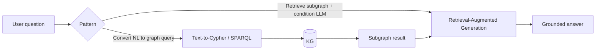
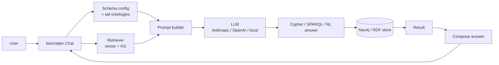
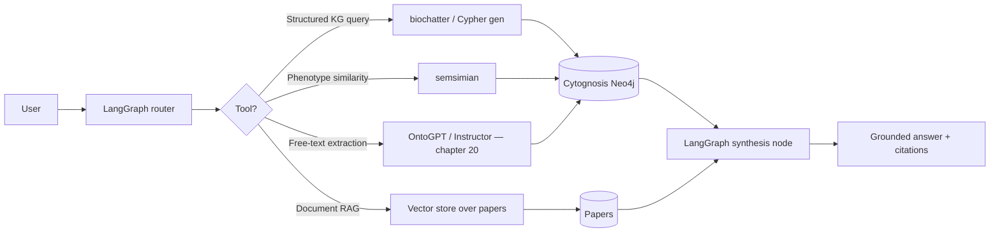

# 19 — LLMs and RAG over the Cytognosis KG

> **Status**: Active
> **Date**: 2026-07-10
> **Author**: @shahin
> **Audience**: engineers
> **Tags**: `engineering`
> **Variants**: Technical (this doc) - Readable (19_llm_rag_for_biology.md in Obsidian vault: 04-Engineering/cytos/schemas-ontologies/linkml-playbook/) - Agent (n/a)

> **Goal** – wire LLMs to the schemas and KG you've built — natural-
> language query, conversational assistants, agentic workflows — using
> BioCypher's biochatter, Monarch's phenomics-assistant /
> graph-agent-devops, and LangChain/LangGraph as the connective tissue.
> **Time** – 90 minutes.
> **Prereqs** – chapters 15 (BioCypher), 16 (Monarch), 18 (AnnData
> harmonization). Familiarity with LangChain helps.

---

## The landscape

Two distinct LLM patterns over biomedical KGs:



Both BioCypher and Monarch have first-class implementations of these.
The frameworks differ in surface area but agree on the underlying
architecture: **schema-aware retrieval first, then LLM generation
conditioned on the retrieved subgraph**. That's the only pattern that
doesn't hallucinate biology.

| Framework | LLM tooling | Maintainer |
| --- | --- | --- |
| BioCypher | `biochatter` (https://github.com/biocypher/biochatter) | Saez-Rodriguez Lab |
| Monarch | `phenomics-assistant`, `graph-agent-devops` | Monarch Initiative |
| Cross-cutting | LangChain / LangGraph | LangChain Inc |

---

## 1. BioCypher's `biochatter`

References:
- https://biocypher.org/BioCypher/llms/
- https://biocypher.org/BioCypher/biocypher-project/biochatter-integration/
- Repo: https://github.com/biocypher/biochatter

`biochatter` is BioCypher's **conversational query layer**. It uses your
BioCypher schema config and the Biolink/tail-ontology graph as
grounding, so the LLM knows what types and predicates are valid before
it generates a query.

### 1.1 Architecture



Three things `biochatter` does that hand-rolling LangChain doesn't give
you for free:

1. **Schema-conditioned generation.** The LLM prompt always includes
   the BioCypher schema, so generated Cypher uses real labels and
   predicates.
2. **Ontology-aware retrieval.** Vector search hits subgraphs, not
   isolated nodes — the retriever expands hits via tail-ontology IS-A
   so a query about "diabetes" pulls relevant MONDO descendants too.
3. **Provenance-aware output.** Answers cite the exact node IDs and
   edge sources used, so users can verify in Neo4j.

### 1.2 Install + minimal usage

```bash
pip install biochatter
```

```python
from biochatter.llm_connect import AnthropicConversation
from biochatter.kg_langgraph_agent import KGLangGraphAgent
from biocypher import BioCypher

bc = BioCypher(schema_config_path="config/schema_config.yaml",
               biocypher_config_path="config/biocypher_config.yaml")

agent = KGLangGraphAgent(
    biocypher=bc,
    llm=AnthropicConversation(model_name="claude-sonnet-4-6"),
    neo4j_uri="bolt://localhost:7687",
    neo4j_auth=("neo4j", "neo4j"),
)

answer = agent.run("Which drugs target genes implicated in cystic fibrosis?")
print(answer.text)
print(answer.cypher)        # the generated query
print(answer.evidence)      # cited node/edge IDs
```

### 1.3 Modes

`biochatter` supports several interaction modes:

| Mode | Use case |
| --- | --- |
| **Q&A over KG** | "What's the evidence for drug X in disease Y?" |
| **Cypher generator** | "Show me the Cypher for: ..." |
| **Vector RAG over docs** | Pulls supporting publications and conditions the answer |
| **Hybrid (KG + docs)** | RAG over both Neo4j and a paper corpus |
| **Agentic** | Multi-step planning with tool use |

The agentic mode uses LangGraph (§3) under the hood.

---

## 2. Monarch's LLM tooling

### 2.1 phenomics-assistant

Repo: https://github.com/monarch-initiative/phenomics-assistant

A clinician-facing assistant for **rare disease and phenotype
reasoning** built on top of the Monarch KG. Uses the KG as grounding
and is tuned for HPO/MONDO-flavored queries:

> "What are the most common phenotypes for Bardet-Biedl syndrome?"
> "Which genes are associated with phenotypes that overlap a child
>  presenting with X, Y, Z?"

Architecture is similar to `biochatter` but specialized:

- KG: Monarch KG (chapter 16 §4)
- Retrieval: phenotype semantic similarity (using `semsimian`)
- LLM: configurable
- UI: web-based clinician workflow

### 2.2 graph-agent-devops

Repo: https://github.com/monarch-initiative/graph-agent-devops

Monarch's exploration of **agentic workflows over the KG** — multi-
step LLM agents that plan, execute, and reflect on KG queries. Less
mature than phenomics-assistant; useful as a reference for what
agentic patterns over Biolink-shaped KGs look like.

### 2.3 What to copy from Monarch

- The semsimian-driven retrieval — it's the right primitive for
  phenotype-driven KG queries that pure vector search butchers.
- The grounded-answer protocol (every claim cites a Monarch node ID).
- The query-template gallery — common clinical questions with their
  KG-query expansions.

---

## 3. LangChain / LangGraph as the connective tissue

Both `biochatter` and `phenomics-assistant` are eventually building on
LangChain/LangGraph primitives. Direct LangChain use is fine when you
want maximum control or when you're integrating Cytognosis with
non-KG tools (e.g., a calculator, a PubMed fetcher, a Code Interpreter).

### 3.1 LangChain pattern — text-to-Cypher

```python
from langchain_anthropic import ChatAnthropic
from langchain_community.graphs import Neo4jGraph
from langchain.chains import GraphCypherQAChain

graph = Neo4jGraph(url="bolt://localhost:7687", username="neo4j", password="neo4j")
llm = ChatAnthropic(model="claude-sonnet-4-6")

chain = GraphCypherQAChain.from_llm(
    llm,
    graph=graph,
    verbose=True,
    return_intermediate_steps=True,
    cypher_prompt=...,    # inject the BioCypher schema_config here for grounding
)

result = chain.invoke({"query": "Drugs targeting CFTR-pathway genes?"})
print(result["result"])
```

Inject the schema as a system-prompt block:

```python
SCHEMA_PRIMER = """
You are querying a Biolink-typed Neo4j graph. Available node labels:
- Gene (preferred id: ENSEMBL)
- Disease (preferred id: MONDO)
- Drug (preferred id: CHEMBL)
- ...

Available edge types:
- gene_to_disease_association
- chemical_to_gene_association
- has_phenotype
- ...

Generate Cypher that uses ONLY these labels and edges.
"""
```

### 3.2 LangGraph pattern — agentic multi-step

LangGraph adds explicit state machines on top of LangChain — useful
when an answer requires multiple KG queries plus reasoning:

```python
from langgraph.graph import StateGraph, END
from typing import TypedDict, List

class State(TypedDict):
    question: str
    plan: List[str]
    cypher_results: List[dict]
    answer: str

def plan_node(state):
    # LLM decomposes the question into a list of subquestions
    state["plan"] = llm.invoke(f"Decompose: {state['question']}").content.split("\n")
    return state

def execute_node(state):
    # Run each subquestion as Cypher, collect results
    for subq in state["plan"]:
        cypher = generate_cypher(subq, schema=bc.schema)
        state["cypher_results"].append(graph.query(cypher))
    return state

def synthesize_node(state):
    state["answer"] = llm.invoke(
        f"Question: {state['question']}\n"
        f"Evidence: {state['cypher_results']}\n"
        "Answer with citations:"
    ).content
    return state

graph = StateGraph(State)
graph.add_node("plan", plan_node)
graph.add_node("execute", execute_node)
graph.add_node("synthesize", synthesize_node)
graph.set_entry_point("plan")
graph.add_edge("plan", "execute")
graph.add_edge("execute", "synthesize")
graph.add_edge("synthesize", END)

app = graph.compile()
result = app.invoke({"question": "...", "plan": [], "cypher_results": [], "answer": ""})
```

This is what `biochatter`'s agentic mode looks like under the hood.

---

## 4. Building a Cytognosis bio-agent

Putting it together. A minimal but production-shaped agent for the
Cytognosis KG:



### 4.1 Tools

```python
from langchain.tools import tool

@tool
def cypher_query(question: str) -> str:
    """Run a natural-language question against the Cytognosis Neo4j KG."""
    return biochatter_agent.run(question).text

@tool
def phenotype_similarity(hpo_ids: list[str]) -> list[str]:
    """Find diseases matching a phenotype profile via semsimian."""
    from semsimian import Semsimian
    sm = Semsimian()
    return sm.termset_pairwise_similarity(hpo_ids, ["MONDO:*"])[:10]

@tool
def paper_search(query: str) -> list[dict]:
    """Vector RAG over the scholarly KG papers."""
    return vector_store.similarity_search(query, k=5)

@tool
def extract_from_text(text: str, schema: str) -> dict:
    """Extract structured fields from free text — see chapter 20."""
    from ontogpt.engines.knowledge_engine import KnowledgeEngine
    ke = KnowledgeEngine(schema=schema)
    return ke.extract_from_text(text).model_dump()
```

### 4.2 LangGraph router

```python
from langchain_anthropic import ChatAnthropic
from langgraph.prebuilt import create_react_agent

llm = ChatAnthropic(model="claude-sonnet-4-6")
agent = create_react_agent(
    llm,
    tools=[cypher_query, phenotype_similarity, paper_search, extract_from_text],
    state_modifier=(
        "You are a Cytognosis bio-research assistant. Always cite KG node IDs "
        "and paper DOIs in answers. Use the tools provided; do not hallucinate."
    ),
)

response = agent.invoke({
    "messages": [{"role": "user",
                  "content": "What's the evidence for IL-6 in long COVID?"}]
})
print(response["messages"][-1].content)
```

This composes BioCypher's grounding with LangGraph's orchestration in
a way that scales to add new tools (PubMed search, ChEMBL lookup,
custom Cytognosis cohort queries) without rewriting the core.

---

## 5. Hands-on

1. Stand up a small BioCypher Neo4j (chapter 15 §5) with the Open
   Targets adapter.
2. `pip install biochatter` and run the §1.2 minimal example.
3. Run a phenomics-assistant query against the Monarch KG endpoint.
4. Build the LangGraph agent in §4 with at least two of the tools.
5. Compare answer quality across `biochatter` direct vs. the
   LangGraph-wrapped version with multiple tools.

---

## 6. Pitfalls

- **Schema injection bloats the prompt.** For a large schema, send a
  pruned/relevant subset based on simple keyword matching to the
  question. `biochatter` does this automatically.
- **Cypher hallucination.** LLMs invent labels that look plausible.
  Always validate generated Cypher against the schema before
  executing — `biochatter`'s Cypher generator does, hand-rolled
  LangChain often doesn't.
- **No grounding = no trust.** Refuse to answer if no KG evidence is
  retrieved. Don't let the LLM fall back on its training.
- **Embedding the wrong corpus.** RAG over PubMed abstracts is
  generic; RAG over your own scholarly KG (chapter 12) is much more
  on-topic. Use the latter when you have it.
- **Cost vs. latency.** Agentic LangGraph workflows can fan out to 5–10
  LLM calls per question. Pin a smaller model (Haiku 4.5) for routing
  and use Sonnet 4.6 only on the final synthesis.

---

## Further reading

- BioCypher LLM page: https://biocypher.org/BioCypher/llms/
- biochatter integration: https://biocypher.org/BioCypher/biocypher-project/biochatter-integration/
- biochatter repo: https://github.com/biocypher/biochatter
- phenomics-assistant: https://github.com/monarch-initiative/phenomics-assistant
- graph-agent-devops: https://github.com/monarch-initiative/graph-agent-devops
- LangChain GraphCypherQAChain: https://python.langchain.com/docs/integrations/graphs/neo4j_cypher/
- LangGraph: https://langchain-ai.github.io/langgraph/
- semsimian: https://github.com/monarch-initiative/semsimian
