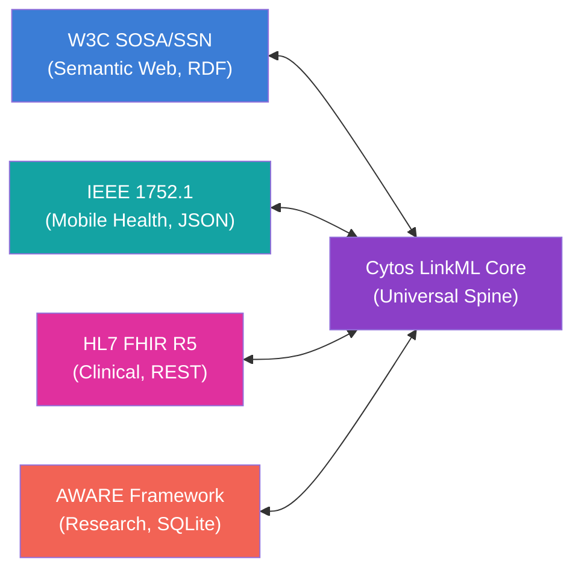
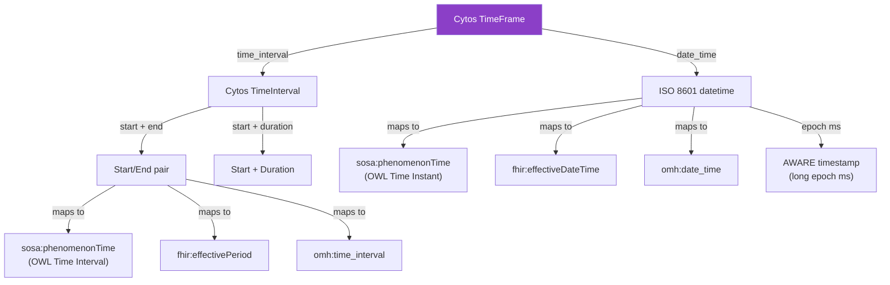

# Semantic Alignment Specification: SOSA/SSN · IEEE 1752 · FHIR · AWARE

> **Status**: v1.0
> **Date**: 2026-05-31
> **Scope**: Defines the formal crosswalk between four health data standards through the Cytos LinkML spine
> **Companion**: [Consolidated Sensor Reference](unified-sensor-report.md)
> **Variants**: Technical (this doc) - Readable (semantic-alignment.md in Obsidian vault: 04-Engineering/cytos/sensing-schema/) - Agent (n/a)

---

## 1. Purpose

The Cytos sensor schema uses LinkML as a universal adapter layer, binding to four external standards via `class_uri` and `slot_uri` annotations. This document specifies exactly how concepts map across standards, where gaps exist, and how the SSSOM framework formalizes these crosswalks as machine-readable mapping sets.



---

## 2. Concept-Level Crosswalk

### 2.1 Observation (The Central Entity)

| Concept | Cytos Core | SOSA/SSN | IEEE 1752.1 / Open mHealth | FHIR R5 | AWARE |
|---|---|---|---|---|---|
| **Single measurement** | `Observation` | `sosa:Observation` | DataPoint (header + body) | `Observation` | Table row with `_id`, `timestamp`, `device_id`, columns |
| **Grouped measurements** | `ObservationCollection` | `sosa:ObservationCollection` | Array of DataPoints | `DiagnosticReport` or `Bundle` | Full table export |
| **Time-series stream** | `Stream` | (no direct) | Data-series envelope | `SampledData` (waveforms) | Continuous table rows |

### 2.2 Sensing Device

| Concept | Cytos Core | SOSA/SSN | IEEE 1752.1 | FHIR R5 | AWARE |
|---|---|---|---|---|---|
| **Physical device** | `Device` | (no direct; SSN `System`) | (no direct class) | `Device` | (implicit, no class) |
| **Sensing capability** | `Sensor` | `sosa:Sensor` | `acquisition_provenance.source_name` | `DeviceMetric` | ContentProvider per sensor |
| **Channel** | `Channel` | `ssn:System` (sub-system) | (no direct) | `Observation.component` | Column per axis |
| **Platform/host** | `Platform` | `sosa:Platform` | (no direct) | (no direct) | Smartphone device |
| **Deployment** | `Deployment` | `ssn:Deployment` | (no direct) | `DeviceUsage` | Study join event |
| **Capability specs** | `SystemCapability` | `ssn-system:SystemCapability` | (no direct) | `DeviceMetric` properties | (no direct) |

### 2.3 Subject and Feature of Interest

| Concept | Cytos Core | SOSA/SSN | IEEE 1752.1 | FHIR R5 | AWARE |
|---|---|---|---|---|---|
| **Person observed** | `Subject` | `sosa:FeatureOfInterest` | `header.user_id` | `Patient` | `device_id` (one device per person) |
| **Biological sample** | `BiologicalSample` | `sosa:Sample` | (no direct) | `Specimen` | (no direct) |
| **Body site** | `anatomical_site` (UBERON) | (via FeatureOfInterest) | (implicit in schema name) | `Observation.bodySite` | (no direct) |

### 2.4 What Is Being Measured

| Concept | Cytos Core | SOSA/SSN | IEEE 1752.1 | FHIR R5 | AWARE |
|---|---|---|---|---|---|
| **Observable property** | `ObservableProperty` | `sosa:ObservableProperty` | `schema_id.name` | `Observation.code` (LOINC) | Table name + column name |
| **Property codes** | `property_codes` (LOINC, SNOMED, MDC) | (via external ontologies) | `schema_id.namespace` + `.name` | `Observation.code.coding[]` | (implicit, no codes) |
| **Unit** | `UnitValue` (UCUM) | (via QUDT or UCUM) | Unit field in body | `Quantity.unit` (UCUM) | (implicit per sensor) |

### 2.5 Measurement Protocol

| Concept | Cytos Core | SOSA/SSN | IEEE 1752.1 | FHIR R5 | AWARE |
|---|---|---|---|---|---|
| **Procedure/method** | `Procedure` | `sosa:Procedure` | (implicit in schema) | `Observation.method` | (implicit in plugin) |
| **Survey instrument** | `SurveyInstrument` | `sosa:Procedure` | Survey package | `Questionnaire` | ESM XML config |
| **Survey response** | `SurveyResponse` | `sosa:Observation` | Survey data point | `QuestionnaireResponse` | ESM answer table |

### 2.6 Temporal Properties

| Concept | Cytos Core | SOSA/SSN | IEEE 1752.1 | FHIR R5 | AWARE |
|---|---|---|---|---|---|
| **When measured** | `phenomenon_time` (TimeFrame) | `sosa:phenomenonTime` | `effective_time_frame` | `Observation.effective[x]` | `timestamp` (epoch ms) |
| **When result available** | `result_time` (datetime) | `sosa:resultTime` | `header.creation_date_time` | `Observation.issued` | (same as timestamp) |
| **Duration** | `TimeInterval.duration_seconds` | OWL Time `time:Duration` | `time_interval.duration` | `Observation.effectivePeriod` | (computed from rows) |
| **Sampling rate** | `sampling_rate_hz` (Hertz) | `ssn:MeasurementFrequency` | (implicit per schema) | (no direct) | Configurable per plugin |

### 2.7 Result Values

| Concept | Cytos Core | SOSA/SSN | IEEE 1752.1 | FHIR R5 | AWARE |
|---|---|---|---|---|---|
| **Scalar value** | `Result.numerical_value` | `sosa:hasSimpleResult` | Body measure fields | `Observation.valueQuantity` | Typed column value |
| **Coded value** | `Result.coded_value` | `sosa:hasResult` | (via schema definition) | `Observation.valueCodeableConcept` | (no direct) |
| **Range value** | `Result.range_value` | (via Result) | (no direct) | `Observation.valueRange` | (no direct) |
| **Waveform** | `WaveformResult` | (via Result) | (no direct) | `Observation.valueSampledData` | (no direct) |
| **Reference range** | `ReferenceRange` | (no direct) | (no direct) | `Observation.referenceRange` | (no direct) |
| **Quality/status** | `ObservationQuality` | (via SSN quality) | (no direct) | `Observation.status` + `.dataAbsentReason` | (no direct) |

### 2.8 Provenance

| Concept | Cytos Core | SOSA/SSN | IEEE 1752.1 | FHIR R5 | AWARE |
|---|---|---|---|---|---|
| **Who created** | `source` + `source_version` | `sosa:madeBySensor` | `acquisition_provenance` | `Observation.device` + `.performer` | `device_id` column |
| **Modality** | `header.modality` | (inferred from Sensor type) | `acquisition_provenance.modality` | (inferred from category) | (inferred from table) |
| **Session context** | `Session` | (no direct) | (no direct) | `Encounter` | Study session |
| **Full provenance** | `prov:Bundle` | PROV-O aligned | (minimal) | `Provenance` resource | (no direct) |

---

## 3. Property-Level Slot URI Alignment

This table shows how each Cytos core slot maps to each standard via `slot_uri` declarations:

| Cytos Slot | `slot_uri` | SOSA | IEEE 1752 | FHIR | AWARE Equivalent |
|---|---|---|---|---|---|
| `Observation.made_by_sensor` | `sosa:madeBySensor` | ✅ native | `acquisition_provenance.source_name` | `Observation.device` | `device_id` |
| `Observation.observed_property` | `sosa:observedProperty` | ✅ native | `schema_id.name` | `Observation.code` | table/column name |
| `Observation.has_feature_of_interest` | `sosa:hasFeatureOfInterest` | ✅ native | `header.user_id` | `Observation.subject` | implicit |
| `Observation.result` | `sosa:hasResult` | ✅ native | body measure | `Observation.value[x]` | column value |
| `Observation.phenomenon_time` | `sosa:phenomenonTime` | ✅ native | `effective_time_frame` | `Observation.effective[x]` | `timestamp` |
| `Observation.result_time` | `sosa:resultTime` | ✅ native | `header.creation_date_time` | `Observation.issued` | `timestamp` |
| `Observation.used_procedure` | `sosa:usedProcedure` | ✅ native | implicit | `Observation.method` | implicit |
| `Sensor.observes` | `sosa:observes` | ✅ native | N/A | N/A | N/A |
| `Sensor.implemented_by` | `ssn:implementedBy` | ✅ native | N/A | N/A | N/A |
| `Platform.hosts` | `sosa:hosts` | ✅ native | N/A | N/A | N/A |
| `Deployment.deployed_system` | `ssn:deployedSystem` | ✅ native | N/A | `DeviceUsage` | N/A |
| `Device.model` | `fhir:Device.modelNumber` | N/A | N/A | ✅ native | N/A |
| `Device.serial_number` | `fhir:Device.serialNumber` | N/A | N/A | ✅ native | N/A |
| `UnitValue.value` | `fhir:Quantity.value` | N/A | body decimal | ✅ native | column float |
| `UnitValue.unit` | `fhir:Quantity.unit` | N/A | unit string | ✅ native | implicit |
| `SurveyInstrument` | `fhir:Questionnaire` | Procedure | Survey package | ✅ native | ESM config |
| `SurveyResponse` | `fhir:QuestionnaireResponse` | Observation | Survey data point | ✅ native | ESM answer |

---

## 4. Unit Alignment

All standards converge on UCUM as the canonical unit system, but each has different binding strength:

| Standard | Unit System | UCUM Binding | Gaps |
|---|---|---|---|
| **SOSA/SSN** | QUDT or UCUM (no mandate) | Optional | No unit vocabulary mandated |
| **IEEE 1752** | Custom strings in body schemas | Implicit | Uses strings like "beats/min" not UCUM codes |
| **FHIR** | UCUM (mandated for Quantity) | Required | Full coverage |
| **AWARE** | Implicit per sensor | None | No unit metadata in SQLite schema |
| **Cytos Core** | UCUM via `UCUMCode` type | Required | Full coverage via `UnitValue.unit` |

### Unit Translation Table

| Measurement | UCUM Code | IEEE 1752 String | FHIR UCUM | AWARE Column |
|---|---|---|---|---|
| Heart rate | `/min` | `beats/min` | `/min` | (implicit bpm) |
| Temperature | `Cel` | `C` or `F` | `Cel` | `double_temperature_celsius` |
| Blood glucose | `mg/dL` | `mg/dL` | `mg/dL` | N/A |
| Steps | `{steps}` | N/A (integer count) | `{steps}` | (implicit count) |
| SpO2 | `%` | `%` | `%` | N/A |
| Acceleration | `m/s2` | N/A | N/A | `double_accelerometer_x` (m/s²) |
| Light | `lx` | N/A | N/A | `double_light_lux` |
| HRV (RMSSD) | `ms` | `ms` | `ms` | N/A |

---

## 5. Temporal Alignment

The four standards represent time differently. The Cytos `TimeFrame` class unifies them:



### Conversion Rules

| From | To | Conversion |
|---|---|---|
| AWARE `timestamp` (epoch ms) | Cytos `TimeFrame.date_time` | `datetime.fromtimestamp(ts / 1000, tz=UTC).isoformat()` |
| IEEE 1752 `effective_time_frame.date_time` | Cytos `TimeFrame.date_time` | Direct ISO 8601 copy |
| IEEE 1752 `time_interval` | Cytos `TimeFrame.time_interval` | Map `start_date_time` + `end_date_time` |
| FHIR `effectiveDateTime` | Cytos `TimeFrame.date_time` | Direct ISO 8601 copy |
| FHIR `effectivePeriod` | Cytos `TimeFrame.time_interval` | Map `start` + `end` |
| SOSA `phenomenonTime` (Instant) | Cytos `TimeFrame.date_time` | Extract `time:inXSDDateTimeStamp` |
| SOSA `phenomenonTime` (Interval) | Cytos `TimeFrame.time_interval` | Extract `time:hasBeginning` + `time:hasEnd` |

---

## 6. SSSOM Crosswalk Mapping Sets

Machine-readable crosswalks are maintained as SSSOM TSV files:

### Location

```
cytos/schemas/domains/sensor/crosswalks/
├── cytos-sosa.sssom.tsv          Cytos ↔ SOSA/SSN
├── cytos-fhir.sssom.tsv          Cytos ↔ FHIR R5
├── cytos-ieee1752.sssom.tsv      Cytos ↔ IEEE 1752.1 / Open mHealth
├── cytos-aware.sssom.tsv         Cytos ↔ AWARE Framework
└── README.md                     Crosswalk documentation
```

### SSSOM TSV Format

Each file follows the SSSOM 0.15 specification with a YAML metadata header:

```
#curie_map:
#  sensor: https://w3id.org/cytognosis/cytos/domains/sensor/
#  sosa: http://www.w3.org/ns/sosa/
#  ssn: http://www.w3.org/ns/ssn/
#  fhir: http://hl7.org/fhir/
#  omh: https://w3id.org/openmhealth/schemas/
#  aware: https://awareframework.com/sensors/
#mapping_set_id: https://w3id.org/cytognosis/mappings/cytos-sosa
#mapping_set_version: 0.1.0
#license: https://creativecommons.org/publicdomain/zero/1.0/
#creator_id: https://orcid.org/0000-0002-XXXX-XXXX
subject_id	subject_label	predicate_id	object_id	object_label	mapping_justification
sensor:Observation	Observation	skos:exactMatch	sosa:Observation	Observation	semapv:ManualMappingCuration
sensor:Sensor	Sensor	skos:exactMatch	sosa:Sensor	Sensor	semapv:ManualMappingCuration
sensor:ObservableProperty	ObservableProperty	skos:exactMatch	sosa:ObservableProperty	ObservableProperty	semapv:ManualMappingCuration
```

### Predicate Semantics

| Predicate | When to Use |
|---|---|
| `skos:exactMatch` | 1:1 semantic equivalence (Cytos Observation ↔ SOSA Observation) |
| `skos:closeMatch` | Semantically similar but structurally different (Cytos Device ↔ FHIR Device) |
| `skos:broadMatch` | Cytos concept is narrower (Cytos SurveyResponse ↔ SOSA Observation) |
| `skos:narrowMatch` | Cytos concept is broader (Cytos Result ↔ FHIR valueQuantity) |
| `owl:equivalentClass` | OWL-level equivalence (used in profile_sosa.yaml via class_uri) |

---

## 7. Gap Analysis

### 7.1 Gaps by Standard

| Standard | What Cytos Covers | What Is Missing |
|---|---|---|
| **SOSA/SSN** | All core classes, SystemCapability, ObservationCollection | SSN-Ext time-series collections (2023 Edition), SAREF alignment module |
| **IEEE 1752** | All body schemas, header/envelope, descriptive statistics | Clinical chemistry schemas, medication adherence, cognitive function schemas |
| **FHIR** | Observation, Device, DeviceMetric, vital signs profiles | Encounter workflow, CarePlan integration, Subscription topic for push notifications |
| **AWARE** | All 25 sensors + ESM | AWARE-Light simplified API, AWARE Dashboard REST API, real-time sync protocol |

### 7.2 Cross-Standard Alignment Gaps

| Gap | Description | Impact | Mitigation |
|---|---|---|---|
| **AWARE has no formal ontology** | SQLite schemas are implicit, no URI namespace | Cannot do semantic reasoning over AWARE data without Cytos bridge | Cytos profile assigns URIs; SSSOM mapping formalizes crosswalk |
| **IEEE 1752 units are strings** | "beats/min" not UCUM codes | Unit comparison requires string parsing | Cytos normalizes to UCUM at ingestion |
| **FHIR Observation is overloaded** | One resource type for vitals, labs, surveys, social history | Query complexity | Cytos preserves specific subclasses (SurveyResponse vs. Observation) |
| **No standard for self-report + passive sensing correlation** | Each standard handles surveys OR sensors, not both together | Cross-modal analysis requires custom join logic | Cytos `Session` links observations from any modality |
| **Temporal resolution mismatch** | AWARE: ms precision, Oura: 5-min, Fitbit: 1-min, labs: daily | Alignment for time-series correlation | Cytos `ObservationCollection` with configurable aggregation |

---

## 8. Implementation Priority

| Priority | Action | Files |
|---|---|---|
| **P0 (Done)** | Core schema with SOSA/FHIR/IEEE 1752/AWARE/BT GHS profiles | `cytos/schemas/domains/sensor/` |
| **P1 (Next)** | Generate SSSOM TSV crosswalk files | `cytos/schemas/domains/sensor/crosswalks/` |
| **P1 (Next)** | AWARE adapter implementation | [implementing-aware.md](../../yar/sensors/implementing-aware.md) |
| **P1 (Next)** | Oura/Fitbit adapter implementation | [implementing-wearables.md](../../yar/sensors/implementing-wearables.md) |
| **P1 (Next)** | Health instruments catalog | [implementing-health-instruments.md](../../yar/sensors/implementing-health-instruments.md) |
| **P2** | Cytos-to-Yar bridge (`cytos_bridge.py`) | `src/cytonome/yar/sensors/bridge.py` |
| **P2** | OMOP CDM profile | `profiles/profile_omop.yaml` |
| **P3** | Apple HealthKit / Google Health Connect vendors | `vendors/vendor_apple.yaml` |
| **P3** | SOSA 2023 Edition alignment update | `profiles/profile_sosa.yaml` |

---

## 9. Toolchain

| Tool | Purpose | Install |
|---|---|---|
| `linkml` | Schema validation, codegen | `pip install linkml` |
| `sssom` (sssom-py) | SSSOM I/O, validation, set algebra | `pip install sssom` |
| `sssom-schema` | LinkML schema for SSSOM | `pip install sssom-schema` |
| `oaklib` | Ontology access, lexmatch, mapping extraction | `pip install oaklib` |
| `curies` + `prefixmaps` | CURIE/IRI conversion, prefix hygiene | `pip install curies prefixmaps` |
| `bioregistry` | Canonical prefix registry | `pip install bioregistry` |
| `schema-automator` | OWL/RDFS → LinkML import | `pip install schema-automator` |
| `fhir.resources` | FHIR Pydantic models | `pip install fhir.resources` |

---

## 10. References

### Standards
- [W3C SOSA/SSN Recommendation](https://www.w3.org/TR/vocab-ssn/)
- [SOSA/SSN 2023 Edition FPWD](https://www.w3.org/TR/vocab-ssn-ext/)
- [IEEE 1752.1-2021](https://standards.ieee.org/ieee/1752.1/10087/)
- [Open mHealth Schemas](https://www.openmhealth.org/documentation/#/schema-docs/schema-library)
- [HL7 FHIR R5 Observation](https://hl7.org/fhir/R5/observation.html)
- [AWARE Framework](https://awareframework.com/)

### Tooling
- [LinkML (GigaScience 2025)](https://academic.oup.com/gigascience/article/doi/10.1093/gigascience/giaf152/8378082)
- [SSSOM Specification](https://mapping-commons.github.io/sssom/)
- [Ontology Access Kit (OAK)](https://github.com/INCATools/ontology-access-kit)

### Cytognosis Internal
- [Consolidated Sensor Reference](unified-sensor-report.md)
- Cytos Sensor Schema README (target archived/removed)
- SSSOM Tooling for Cytognosis (target archived/removed)
- SOSA/SSN to LinkML Playbook (target archived/removed)
- [Yar USAP Phase 7](../../../00-Inbox/product-implementation.md)
